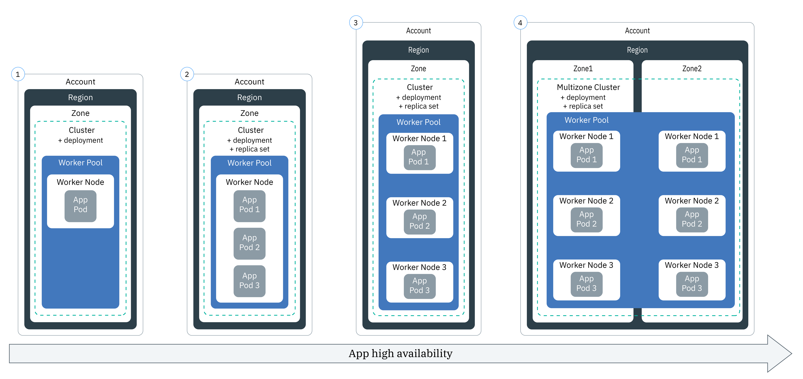

---

copyright: 
  years: 2014, 2022
lastupdated: "2022-12-01"

keywords: kubernetes, deploy

subcollection: containers


---

{{site.data.keyword.attribute-definition-list}}


# Planning app deployments
{: #plan_deploy}

Before you deploy an app to an {{site.data.keyword.containerlong}} cluster, decide how you want to set up your app so that your app can be accessed properly and be integrated with other services in {{site.data.keyword.cloud_notm}}.
{: shortdesc}

## Moving workloads to {{site.data.keyword.containerlong_notm}}
{: #moving}

Learn what kinds of workloads can be run on {{site.data.keyword.containerlong_notm}}, and the optimal way to set up these workloads.
{: shortdesc}

### What kind of apps can I run in {{site.data.keyword.containerlong_notm}}?
{: #app_types}

Your containerized app must be able to run on the supported operating system, Ubuntu 18.04 x86_64, 16.04 x86_64 (deprecated). You also want to consider the statefulness of your app.
{: shortdesc}

Stateless apps
:   Stateless apps are preferred for cloud-native environments like Kubernetes. They are simple to migrate and scale because they declare dependencies, store configurations separately from the code, and treat backing services such as databases as attached resources instead of coupled to the app. The app pods don't require persistent data storage or a stable network IP address, and as such, pods can be terminated, rescheduled, and scaled in response to workload demands. The app uses a Database-as-a-Service for persistent data, and NodePort, load balancer, or Ingress services to expose the workload on a stable IP address.

Stateful apps
:   Stateful apps are more complicated than stateless apps to set up, manage, and scale because the pods require persistent data and a stable network identity. Stateful apps are often databases or other distributed, data-intensive workloads where processing is more efficient closer to the data itself. If you want to deploy a stateful app, you need to set up persistent storage and mount a persistent volume to the pod that is controlled by a StatefulSet object. You can choose to add [file](/docs/containers?topic=containers-file_storage#file_statefulset), [block](/docs/containers?topic=containers-block_storage#block_statefulset), or [object](/docs/containers?topic=containers-storage_cos_apps#cos_statefulset) storage as the persistent storage for your stateful set. You can also install [Portworx](/docs/containers?topic=containers-portworx) on your bare metal worker nodes and use Portworx as a highly available software-defined storage solution to manage persistent storage for your stateful apps. For more information about how stateful sets work, see the [Kubernetes documentation](https://kubernetes.io/docs/concepts/workloads/controllers/statefulset/){: external}.

### What are some guidelines for developing stateless, cloud-native apps?
{: #12factor}

Check out the [Twelve-Factor App](https://12factor.net/){: external}, a language-neutral methodology for considering how to develop your app across 12 factors, summarized as follows.
{: shortdesc}

1. **Codebase**: Use a single codebase in a version control system for your deployments. When you pull an image for your container deployment, specify a tested image tag instead of using `latest`.
2. **Dependencies**: Explicitly declare and isolate external dependencies.
3. **Configuration**: Store deployment-specific configuration in environment variables, not in the code.
4. **Backing services**: Treat backing services, such as data stores or message queues, as attached or replaceable resources.
5. **App stages**: Build in distinct stages such as `build`, `release`, `run`, with strict separate among them.
6. **Processes**: Run as one or more stateless processes that share nothing and use [persistent storage](/docs/containers?topic=containers-storage_planning) for saving data.
7. **Port binding**: Port bindings are self-contained and provide a service endpoint on well-defined host and port.
8. **Concurrency**: Manage and scale your app through process instances such as replicas and horizontal scaling. Set resource requests and limits for your deployments. Note that Calico network policies can't limit bandwidth. Instead, consider [Istio](/docs/containers?topic=containers-istio).
9. **Disposability**: Design your app to be disposable, with minimal startup, graceful shutdown, and toleration for abrupt process terminations. Remember, containers, pods, and even worker nodes are meant to be disposable, so plan your app accordingly.
10. **Dev-to-prod parity**: Set up a [continuous integration](https://www.ibm.com/garage/method/practices/code/practice_continuous_integration){: external} and [continuous delivery](https://www.ibm.com/garage/method/practices/deliver/practice_continuous_delivery){: external} pipeline for your app, with minimal difference between the app in development and the app in prod.
11. **Logs**: Treat logs as event streams: the outer or hosting environment processes and routes log files. **Important**: In {{site.data.keyword.containerlong_notm}}, logs are not turned on by default. To enable, see [Configuring log forwarding](/docs/containers?topic=containers-health).
12. **Admin processes**: Keep any one-time admin scripts with your app and run them as a [Kubernetes Job object](https://kubernetes.io/docs/concepts/workloads/controllers/job/){: external} to ensure that the admin scripts run with the same environment as the app itself. For orchestration of larger packages that you want to run in your Kubernetes clusters, consider using a package manager such as [Helm](https://helm.sh/){: external}.

### What about serverless apps?
{: #apps_serverless}

You can run serverless apps and jobs through the [{{site.data.keyword.codeenginefull_notm}}](/docs/codeengine?topic=codeengine-getting-started) service. {{site.data.keyword.codeengineshort}} can also build your images for you. {{site.data.keyword.codeengineshort}} is designed so that you don't need to interact with the underlying technology it is built upon. However, if you have existing tooling that is based upon Kubernetes or Knative, you can still use it with {{site.data.keyword.codeengineshort}}. For more information, see [Using Kubernetes to interact with your application](/docs/codeengine?topic=codeengine-kubernetes). 
{: shortdesc}

### I already have an app. How can I migrate it to {{site.data.keyword.containerlong_notm}}?
{: #migrate_containerize}

You can take some general steps to containerize your app as follows.
{: shortdesc}
{: help}
{: support}

1. Use the [Twelve-Factor App](https://12factor.net/){: external} as a guide for isolating dependencies, separating processes into separate services, and reducing the statefulness of your app as much as possible.
1. Find an appropriate base image to use. You can use publicly available images from [Docker Hub](https://hub.docker.com/){: external}, [public IBM images](/docs/Registry?topic=Registry-public_images#public_images), or build and manage your own in your private {{site.data.keyword.registrylong_notm}}.
1. Add to your Docker image only what is necessary to run the app.

    Don't want to make a Dockerfile yourself? Try out the [`ibmcloud dev enable` command](/docs/cli?topic=cli-idt-cli#enable), which detects your app's programming language and builds a Dockerfile and containerization components for you.
    {: tip}
    

1. Instead of relying on local storage, plan to use persistent storage or cloud database-as-a-service solutions to back up your app's data.
1. Over time, refactor your app processes into microservices.

For more, see the following tutorials.
* [Migrating an app from Cloud Foundry to a cluster](/docs/containers?topic=containers-cf_tutorial#cf_tutorial).
* [Moving a VM-based app to Kubernetes](/docs/solution-tutorials?topic=solution-tutorials-vm-to-containers-and-kubernetes).


## Understanding Kubernetes objects for apps
{: #kube-objects}

With Kubernetes, you declare many types of objects in YAML configuration files such as pods, deployments, and jobs. These objects describe things like what containerized apps are running, what resources they use, and what policies manage their behavior for restarting, updating, replicating, and more. For more information, see the Kubernetes docs for [Configuration best practices](https://kubernetes.io/docs/concepts/configuration/overview/){: external}.
{: shortdesc}

### I thought that I needed to put my app in a container. Now what's all this stuff about pods?
{: #deploy_pods}

A [pod](https://kubernetes.io/docs/concepts/workloads/pods/){: external} is the smallest deployable unit that Kubernetes can manage. You put your container (or a group of containers) into a pod and use the pod configuration file to tell the pod how to run the container and share resources with other pods. All containers that you put into a pod run in a shared context, which means that they share the same virtual or physical machine.
{: shortdesc}

What to put in a container
:    As you think about your application's components, consider whether they have significantly different resource requirements for things like CPU and memory. Could some components run at a best effort, where going down for a little while to divert resources to other areas is acceptable? Is another component customer-facing, so it's critical for it to stay up? Split them up into separate containers. You can always deploy them to the same pod so that they run together in sync.

What to put in a pod
:   The containers for your app don't always have to be in the same pod. In fact, if you have a component that is stateful and difficult to scale, such as a database service, put it in a different pod that you can schedule on a worker node with more resources to handle the workload. If your containers work correctly if they run on different worker nodes, then use multiple pods. If they need to be on the same machine and scale together, group the containers into the same pod.

### So if I can just use a pod, why do I need all these different types of objects?
{: #deploy_objects}

Creating a pod YAML file is easy. You can write one with just a few lines as follows.

```yaml
apiVersion: v1
kind: Pod
metadata:
  name: nginx
spec:
  containers:
  - name: nginx
    image: nginx
    ports:
    - containerPort: 80
```
{: codeblock}

But you don't want to stop there. If the node that your pod runs on goes down, then your pod goes down with it and isn't rescheduled. Instead, use a [deployment](https://kubernetes.io/docs/concepts/workloads/controllers/deployment/){: external} to support pod rescheduling, replica sets, and rolling updates. A basic deployment is almost as easy to make as a pod. Instead of defining the container in the `spec` by itself, however, you specify `replicas` and a `template` in the deployment `spec`. The template has its own `spec` for the containers within it, such as follows.

```yaml
apiVersion: apps/v1
kind: Deployment
metadata:
  name: nginx-deployment
spec:
  replicas: 3
  selector:
    matchLabels:
      app: nginx
  template:
    metadata:
      labels:
        app: nginx
    spec:
      containers:
      - name: nginx
        image: nginx
        ports:
        - containerPort: 80
```
{: codeblock}

You can keep adding features, such as pod anti-affinity or resource limits, all in the same YAML file.

For a more detailed explanation of different features that you can add to your deployment, take a look at [Making your app deployment YAML file](/docs/containers?topic=containers-app#app_yaml).
{: tip}

### What type of Kubernetes objects can I make for my app?
{: #object}

When you prepare your app YAML file, you have many options to increase the app's availability, performance, and security. For example, instead of a single pod, you can use a Kubernetes controller object to manage your workload, such as a replica set, job, or daemon set. For more information about pods and controllers, view the [Kubernetes documentation](https://kubernetes.io/docs/concepts/workloads/pods/){: external}. A deployment that manages a replica set of pods is a common use case for an app.
{: shortdesc}

For example, a `kind: Deployment` object is a good choice to deploy an app pod because with it, you can specify a replica set for more availability for your pods.

The following table describes why you might create different types of Kubernetes workload objects.

| Object | Description |
| --- | --- |
| [`Pod`](https://kubernetes.io/docs/concepts/workloads/pods/){: external} | A pod is the smallest deployable unit for your workloads, and can hold a single or multiple containers. Similar to containers, pods are designed to be disposable and are often used for unit testing of app features. To avoid downtime for your app, consider deploying pods with a Kubernetes controller, such as a deployment. A deployment helps you to manage multiple pods, replicas, pod scaling, rollouts, and more. |
| [`ReplicaSet`](https://kubernetes.io/docs/concepts/workloads/controllers/replicaset/){: external} | A replica set makes sure that multiple replicas of your pod are running, and reschedules a pod if the pod goes down. You might create a replica set to test how pod scheduling works, but to manage app updates, rollouts, and scaling, create a deployment instead. |
| [`Deployment`](https://kubernetes.io/docs/concepts/workloads/controllers/deployment/){: external} | A deployment is a controller that manages a pod or [replica set](https://kubernetes.io/docs/concepts/workloads/controllers/replicaset/){: external} of pod templates. You can create pods or replica sets without a deployment to test app features. For a production-level setup, use deployments to manage app updates, rollouts, and scaling. |
| [`StatefulSet`](https://kubernetes.io/docs/concepts/workloads/controllers/statefulset/){: external} | Similar to deployments, a stateful set is a controller that manages a replica set of pods. Unlike deployments, a stateful set ensures that your pod has a unique network identity that maintains its state across rescheduling. When you want to run workloads in the cloud, try to [design your app to be stateless](/docs/containers?topic=containers-strategy#cloud_workloads) so that your service instances are independent from each other and can fail without a service interruption. However, some apps, such as databases, must be stateful. For those cases, consider to create a stateful set and use [file](/docs/containers?topic=containers-file_storage#file_statefulset), [block](/docs/containers?topic=containers-block_storage#block_statefulset), or [object](/docs/containers?topic=containers-storage_cos_apps#cos_statefulset) storage as the persistent storage for your stateful set. You can also install [Portworx](/docs/containers?topic=containers-portworx) on your bare metal worker nodes and use Portworx as a highly available software-defined storage solution to manage persistent storage for your stateful set. |
| [`DaemonSet`](https://kubernetes.io/docs/concepts/workloads/controllers/daemonset/){: external} | Use a daemon set when you must run the same pod on every worker node in your cluster. Pods that are managed by a daemon set are automatically scheduled when a worker node is added to a cluster. Typical use cases include log collectors, such as `logstash` or `prometheus`, that collect logs from every worker node to provide insight into the health of a cluster or an app. |
| [`Job`](https://kubernetes.io/docs/concepts/workloads/controllers/job/){: external} | A job ensures that one or more pods run successfully to completion. You might use a job for queues or batch jobs to support parallel processing of separate but related work items, such as a certain number of frames to render, emails to send, and files to convert. To schedule a job to run at certain times, use a [`CronJob`](https://kubernetes.io/docs/concepts/workloads/controllers/cron-jobs/){: external}.|
{: caption="Types of Kubernetes workload objects that you can create." caption-side="bottom"}

### What if I want my app configuration to use variables? How do I add these to the YAML?
{: #variables}

To add variable information to your deployments instead of hard-coding the data into the YAML file, you can use a Kubernetes [`ConfigMap`](https://kubernetes.io/docs/tasks/configure-pod-container/configure-pod-configmap/){: external} or [`Secret`](https://kubernetes.io/docs/concepts/configuration/secret/){: external} object.
{: shortdesc}

To consume a ConfigMap or secret, you need to mount it to the pod. The ConfigMap or secret is combined with the pod just before the pod is run. You can reuse a deployment spec and image across many apps, but then swap out the customized configmaps and secrets. Secrets in particular can take up a lot of storage on the local node, so plan accordingly.

Both resources define key-value pairs, but you use them for different situations.

Configmap
:   Provide non-sensitive configuration information for workloads that are specified in a deployment. You can use configmaps in three main ways.
    - File system: You can mount an entire file or a set of variables to a pod. A file is created for each entry based on the key name contents of the file that are set to the value.
    - Environment variable: Dynamically set the environment variable for a container spec.
    - Command-line option: Set the command-line option that is used in a container spec.

Secret
:   Provide sensitive information to your workloads, such as follows. Other users of the cluster might have access to the secret, so be sure that you know the secret information can be shared with those users.
    - Personally identifiable information (PII: Store sensitive information such as email addresses or other types of information that are required for company compliance or government regulation in secrets.
    - Credentials: Put credentials such as passwords, keys, and tokens in a secret to reduce the risk of accidental exposure. For example, when you [bind a service](/docs/containers?topic=containers-service-binding) to your cluster, the credentials are stored in a secret.

Want to make your secrets even more secured? Ask your cluster admin to [enable a key management service provider](/docs/containers?topic=containers-encryption#keyprotect) in your cluster to encrypt new and existing secrets.
{: tip}

### How can I make sure that my app has the correct resources?
{: #resources}

When you [specify your app YAML file](/docs/containers?topic=containers-app#app_yaml), you can add Kubernetes functionalities to your app configuration that help your app get the correct resources. In particular, [set resource limits and requests](https://kubernetes.io/docs/concepts/configuration/manage-resources-containers/){: external} for each container that is defined in your YAML file.
{: shortdesc}

Additionally, your cluster admin might set up resource controls that can affect your app deployment, such as the following.
* [Resource quotas](https://kubernetes.io/docs/concepts/policy/resource-quotas/){: external}
* [Pod priority](/docs/containers?topic=containers-pod_priority)

### How can I add capabilities to my app configuration?
{: #capabilities}

See [Specifying your app requirements in your YAML file](/docs/containers?topic=containers-app#app_yaml) for descriptions of what you might include in a deployment. The example includes:
* [Replica sets](/docs/containers?topic=containers-app#replicaset)
* [Labels](/docs/containers?topic=containers-app#label)
* [Affinity](/docs/containers?topic=containers-app#affinity)
* [Image policies](/docs/containers?topic=containers-app#image)
* [Ports](/docs/containers?topic=containers-app#port)
* [Resource requests and limits](/docs/containers?topic=containers-app#resourcereq)
* [Liveness and readiness probes](/docs/containers?topic=containers-app#probe)
* [Services](/docs/containers?topic=containers-app#app-service) to expose the app service on a port
* [Configmaps](/docs/containers?topic=containers-app#configmap) to set container environment variables
* [Secrets](/docs/containers?topic=containers-app#secret) to set container environment variables
* [Persistent volumes](/docs/containers?topic=containers-app#pv) that are mounted to the container for storage

### How can I add IBM services to my app, such as {{site.data.keyword.watson}}?
{: #services_ibm}

See [Adding services to apps](/docs/containers?topic=containers-service-binding#adding_app).


## Planning highly available deployments
{: #highly_available_apps}

The more widely you distribute your setup across multiple worker nodes and clusters, the less likely your users are to experience downtime with your app.
{: shortdesc}

Review the following potential app setups that are ordered with increasing degrees of availability.

{: caption="Figure 1. Stages of high availability for an app" caption-side="bottom"}

1. A deployment with n+2 pods that are managed by a replica set in a single node in a single zone cluster.
2. A deployment with n+2 pods that are managed by a replica set and spread across multiple nodes (anti-affinity) in a single zone cluster.
3. A deployment with n+2 pods that are managed by a replica set and spread across multiple nodes (anti-affinity) in a multizone cluster across zones.

You can also [connect multiple clusters in different regions with a global load balancer](/docs/containers?topic=containers-ha_clusters#multiple-clusters-glb) to increase the high availability.

### How can I increase the availability of my app?
{: #increase_availability}

Consider the following options to increase availability of your app.
{: shortdesc}

Use deployments and replica sets to deploy your app and its dependencies
:   A deployment is a Kubernetes resource that you can use to declare all the components of your app and its dependencies. With deployments, you don't have to write down all the steps and instead can focus on your app.
    When you deploy more than one pod, a replica set is automatically created for your deployments that monitors the pods and assures that the specified number of pods is up and running. When a pod goes down, the replica set replaces the unresponsive pod with a new one.
    You can use a deployment to define update strategies for your app, including the number of pods that you want to add during a rolling update and the number of pods that can be unavailable at a time. When you perform a rolling update, the deployment checks whether the revision is working and stops the rollout when failures are detected.
    With deployments, you can concurrently deploy multiple revisions with different flags. For example, you can test a deployment first before you decide to push it to production.
    By using Deployments, you can track any deployed revisions. You can use this history to roll back to a previous version if you encounter that your updates are not working as expected.

Include enough replicas for your app's workload, plus two
:   To make your app even more highly available and more resilient to failure, consider including extra replicas than the minimum to handle the expected workload. Extra replicas can handle the workload in case a pod crashes and the replica set did not yet recover the crashed pod. For protection against two simultaneous failures, include two extra replicas. This setup is an N+2 pattern, where N is the number of replicas to handle the incoming workload and +2 is an extra two replicas. As long as your cluster has enough space, you can have as many pods as you want.

Spread pods across multiple nodes (anti-affinity)
:   When you create your deployment, each pod can be deployed to the same worker node. This is known as affinity, or co-location. To protect your app against worker node failure, you can configure your deployment to spread your pods across multiple worker nodes by using the `podAntiAffinity` option with your standard clusters. You can define two types of pod anti-affinity: preferred or required.
    For more information, see the Kubernetes documentation on [Assigning Pods to Nodes](https://kubernetes.io/docs/concepts/scheduling-eviction/assign-pod-node/){: external}.</p>
    For an example of affinity in an app deployment, see [Making your app deployment YAML file](/docs/containers?topic=containers-app#app_yaml).

Distribute pods across multiple zones or regions</dt>
:   To protect your app from a zone failure, you can create multiple clusters in separate zones or add zones to a worker pool in a multizone cluster. Multizone clusters are available only in certain [classic](/docs/containers?topic=containers-regions-and-zones#zones-mz) or [VPC](/docs/containers?topic=containers-regions-and-zones#zones-vpc) multizones, such as Dallas. If you create multiple clusters in separate zones, you must [set up a global load balancer](/docs/containers?topic=containers-ha_clusters#multiple-clusters-glb).
    When you use a replica set and specify pod anti-affinity, Kubernetes spreads your app pods across the nodes. If your nodes are in multiple zones, the pods are spread across the zones, increasing the availability of your app. If you want to limit your apps to run only in one zone, you can configure pod affinity, or create and label a worker pool in one zone. For more information, see [High availability for multizone clusters](/docs/containers?topic=containers-ha_clusters#ha_clusters).
    
:   **In a multizone cluster deployment, are my app pods distributed evenly across the nodes?**
    The pods are evenly distributed across zones, but not always across nodes. For example, if you have a cluster with one node in each of three zones and deploy a replica set of six pods, then each node gets two pods. However, if you have a cluster with two nodes in each of three zones and deploy a replica set of six pods, each zone schedules two pods, and might schedule one pod per node or might not. For more control over scheduling, you can [set pod affinity](https://kubernetes.io/docs/concepts/scheduling-eviction/assign-pod-node/){: external}.
    
:   **If a zone goes down, how are pods rescheduled onto the remaining nodes in the other zones?**
    It depends on your scheduling policy that you used in the deployment. If you included [node-specific pod affinity](https://kubernetes.io/docs/concepts/scheduling-eviction/assign-pod-node/){: external}, your pods are not rescheduled. If you did not, pods are created on available worker nodes in other zones, but they might not be balanced. For example, the two pods might be spread across the two available nodes, or they might both be scheduled onto one node with available capacity. Similarly, when the unavailable zone returns, pods are not automatically deleted and rebalanced across nodes. If you want the pods to be rebalanced across zones after the zone is back up, consider using the [Kubernetes descheduler](https://github.com/kubernetes-sigs/descheduler){: external}{: shortdesc}.
    In multizone clusters, try to keep your worker node capacity at 50% per zone so that enough capacity is left to protect your cluster against a zonal failure.
    {: tip}
    
:   **What if I want to spread my app across regions?**
    To protect your app from a region failure, create a second cluster in another region, [set up a global load balancer](/docs/containers?topic=containers-ha_clusters#multiple-clusters-glb) to connect your clusters, and use a deployment YAML to deploy a duplicate replica set with [pod anti-affinity](https://kubernetes.io/docs/concepts/scheduling-eviction/assign-pod-node/){: external} for your app.
    
:   **What if my apps need persistent storage?**
    Use a cloud service such as [{{site.data.keyword.cloudant_short_notm}}](/docs/Cloudant?topic=Cloudant-getting-started-with-cloudant) or [{{site.data.keyword.cos_full_notm}}](/docs/cloud-object-storage?topic=cloud-object-storage-getting-started-cloud-object-storage).

### How can I scale my app?
{: #scale}

If you want to dynamically add and remove apps in response to workload usage, see [Scaling apps](/docs/containers?topic=containers-update_app#app_scaling) for steps to enable horizontal pod autoscaling.
{: shortdesc}

## Versioning and updating apps
{: #updating}

You put in a lot of effort preparing for the next version of your app. You can use {{site.data.keyword.cloud_notm}} and Kubernetes update tools to roll out different versions of your app.
{: shortdesc}

### How can I organize my deployments to make them easier to update and manage?
{: #deploy_organize}

Now that you have a good idea of what to include in your deployment, you might wonder how are you going to manage all these different YAML files? Not to mention the objects that they create in your Kubernetes environment!

The following tips can help you organize your deployment YAML files.
* Use a version-control system, such as Git.
* Group closely related Kubernetes objects within a single YAML file. For example, if you are creating a `deployment`, you might also add the `service` file to the YAML. Separate objects with `---` such as in the following example.
    ```yaml
    apiVersion: apps/v1
    kind: Deployment
    metadata:
    ...
    ---
    apiVersion: v1
    kind: Service
    metadata:
    ...
    ```
    {: codeblock}

* You can use the `kubectl apply -f` command to apply to an entire directory, not just a single file.
* Try out the [`kustomize` project](/docs/containers?topic=containers-app#kustomize) that you can use to help write, customize, and reuse your Kubernetes resource YAML configurations.

Within the YAML file, you can use labels or annotations as metadata to manage your deployments.

Labels
:   [Labels](https://kubernetes.io/docs/concepts/overview/working-with-objects/labels/){: external} are `key:value` pairs that can be attached to Kubernetes objects such as pods and deployments. They can be whatever you want, and are useful for selecting objects based on the label information. Labels provide the foundation for grouping objects. See the following examples for ideas for labels.
    * `app: nginx`
    * `version: v1`
    * `env: dev`

Annotations
:   [Annotations](https://kubernetes.io/docs/concepts/overview/working-with-objects/annotations/){: external} are similar to labels in that they are also `key:value` pairs. They are better for non-identifying information that can be leveraged by tools or libraries, such as holding extra information about where an object came from, how to use the object, pointers to related tracking repos, or a policy about the object. You don't select objects based on annotations.

### What app update strategies can I use?
{: #updating_apps_strategy}

To update your app, you can choose from various strategies such as the following. You might start with a rolling deployment or instantaneous switch before you progress to a more complicated canary deployment.

Rolling deployment
:   You can use Kubernetes-native functionality to create a `v2` deployment and to gradually replace your previous `v1` deployment. This approach requires that apps are backwards-compatible so that users who are served the `v2` app version don't experience any breaking changes. For more information, see [Managing rolling deployments to update your apps](/docs/containers?topic=containers-update_app#app_rolling).

Instantaneous switch
:   Also referred to as a blue-green deployment, an instantaneous switch requires double the compute resources to have two versions of an app running at once. With this approach, you can switch your users to the newer version in near real time. Make sure that you use service label selectors (such as `version: green` and `version: blue`) to make sure that requests are sent to the correct app version. You can create the new `version: green` deployment, wait until it is ready, and then delete the `version: blue` deployment. Or you can perform a [rolling update](/docs/containers?topic=containers-update_app#app_rolling), but set the `maxUnavailable` parameter to `0%` and the `maxSurge` parameter to `100%`.

Canary or A/B deployment
:   A more complex update strategy, a canary deployment is when you pick a percentage of users such as 5% and send them to the new app version. You collect metrics in your logging and monitoring tools on how the new app version performs, do A/B testing, and then roll out the update to more users. As with all deployments, labeling the app (such as `version: stable` and `version: canary`) is critical. To manage canary deployments, you might [install the managed Istio add-on service mesh](/docs/containers?topic=containers-istio), [set up {{site.data.keyword.mon_short}} for your cluster](/docs/monitoring?topic=monitoring-kubernetes_cluster#kubernetes_cluster), and then use the Istio service mesh for A/B testing as described [in this blog post](https://sysdig.com/blog/monitor-istio/){: external}.

### How can I automate my app deployment?
{: #packaging}

If you want to run your app in multiple clusters, public and private environments, or even multiple cloud providers, you might wonder how you can make your deployment strategy work across these environments. With {{site.data.keyword.cloud_notm}} and other open source tools, you can package your application to help automate deployments.
{: shortdesc}

Set up a continuous integration and delivery (CI/CD) pipeline
:   With your app configuration files organized in a source control management system such as Git, you can build your pipeline to test and deploy code to different environments, such as `test` and `prod`. Work with your cluster administrator to [set up continuous integration and delivery](/docs/containers?topic=containers-cicd).

Package your app configuration files
:   Package your app with tools like Kustomize or Helm.
    - With the `kustomize` [project](/docs/containers?topic=containers-app#kustomize), you can write, customize, and reuse your Kubernetes resource YAML configurations.
    - With the [Helm](https://helm.sh/docs/){: external} Kubernetes package manager, you can specify all Kubernetes resources that your app requires in a Helm chart. Then, you can use Helm to create the YAML configuration files and deploy these files in your cluster. You can also [integrate {{site.data.keyword.cloud_notm}}-provided Helm charts](https://cloud.ibm.com/kubernetes/helm){: external} to extend your cluster's capabilities, such as with a block storage plug-in.
        
Are you looking to create YAML file templates? Some people use Helm to do just that, or you might try out other community tools such as [`ytt`](https://get-ytt.io/){: external}.


## Setting up service discovery
{: #service_discovery}

Each of your pods in your Kubernetes cluster has an IP address. But when you deploy an app to your cluster, you don't want to rely on the pod IP address for service discovery and networking. Pods are removed and replaced frequently and dynamically. Instead, use a Kubernetes service, which represents a group of pods and provides a stable entry point through the service's virtual IP address, called its `cluster IP`. For more information, see the Kubernetes documentation on [Services](https://kubernetes.io/docs/concepts/services-networking/service/#discovering-services){: external}.
{: shortdesc}

### How can I make sure that my services are connected to the correct deployments and ready to go?
{: #services_connected}

For most services, add a selector to your service `.yaml` file so that it applies to pods that run your apps by that label. Many times when your app first starts up, you don't want it to process requests immediately. Add a readiness probe to your deployment so that traffic is only sent to a pod that is considered ready. For an example of a deployment with a service that uses labels and sets a readiness probe, check out this [NGINX YAML](https://raw.githubusercontent.com/IBM-Cloud/kube-samples/master/deploy-apps-clusters/nginx_preferredAntiAffinity.yaml){: external}.
{: shortdesc}

Sometimes, you don't want the service to use a label. For example, you might have an external database or want to point the service to another service in a different namespace within the cluster. When this happens, you have to manually add an endpoints object and link it to the service.


### How can I expose my services on the Internet?
{: #services_expose_apps}

You can create three types of services for external networking: NodePort, LoadBalancer, and Ingress.
{: shortdesc}

You have different options that depend on your cluster type. For more information, see [Planning networking services](/docs/containers?topic=containers-cs_network_planning#external).
- **Free cluster**: You can expose your app by using a [NodePort service](/docs/containers?topic=containers-nodeport).
- **Standard cluster**: You can expose your app by using a [NodePort, load balancer, or Ingress service](/docs/containers?topic=containers-cs_network_planning#external).
- **Cluster that is made private by using Calico**: You can expose your app by using a [NodePort, load balancer, or Ingress service](/docs/containers?topic=containers-cs_network_planning#private_both_vlans). You also must use a Calico preDNAT network policy to block the public node ports.
- **Private VLAN-only standard cluster**: You can expose your app by using a [NodePort, load balancer, or Ingress service](/docs/containers?topic=containers-cs_network_planning#plan_private_vlan). You also must open the port for the service's private IP address in your firewall.

As you plan how many `Service` objects you need in your cluster, keep in mind that Kubernetes uses `iptables` to handle networking and port forwarding rules. If you run many services in your cluster, such as 5000, performance might be impacted.


## Securing apps
{: #secure_apps}

As you plan and develop your app, consider the following options to maintain a secure image, ensure that sensitive information is encrypted, encrypt traffic between app microservices, and control traffic between your app pods and other pods and services in the cluster.
{: shortdesc}

Image security
:   To protect your app, you must protect the image and establish checks to ensure the image's integrity. Review the [image and registry security topic](/docs/containers?topic=containers-security#images_registry) for steps that you can take to ensure secure container images. For example, you might use Vulnerability Advisor to check the security status of container images. When you add an image to your organization's {{site.data.keyword.registrylong_notm}} namespace, the image is automatically scanned by Vulnerability Advisor to detect security issues and potential vulnerabilities. If security issues are found, instructions are provided to help fix the reported vulnerability. To get started, see [Managing image security with Vulnerability Advisor](/docs/Registry?topic=va-va_index).

Kubernetes secrets
:   When you deploy your app, don't store confidential information, such as credentials or keys, in the YAML configuration file, configmaps, or scripts. Instead, use [Kubernetes secrets](/docs/containers?topic=containers-security#pi), such as an image pull secret for registry credentials. You can then reference these secrets in your deployment YAML file.

Secret encryption
:   You can encrypt the Kubernetes secrets that you create in your cluster by using a key management service (KMS) provider. To get started, see [Encrypt secrets by using a KMS provider](/docs/containers?topic=containers-encryption#keyprotect) and [Verify that secrets are encrypted](/docs/containers?topic=containers-encryption#verify_kms).

Microservice traffic encryption
:   After you deploy your app, you can set up a service mesh and enable mTLS encryption for traffic between services in the mesh. To get started, [set up the managed Istio add-on](/docs/containers?topic=containers-istio). Then, follow the steps in [Securing in-cluster traffic by enabling mTLS](/docs/containers?topic=containers-istio-mesh#mtls).

Pod traffic management
:   By default, any pod has access to any other pod in the cluster. Additionally, any pod has access to any services that are exposed by the pod network, such as a metrics service, the cluster DNS, the API server, or any services that you manually create in your cluster. [Kubernetes network policies](/docs/containers?topic=containers-network_policies#isolate_services) protect pods from internal network traffic. For example, if most or all pods don't require access to specific pods or services, and you want to ensure that pods by default can't access those pods or services, you can create a Kubernetes network policy to block ingress traffic to those pods or services. Kubernetes network policies can also help you enforce workload isolation between namespaces by controlling how pods and services in different namespaces can communicate. For clusters that run Kubernetes 1.21 and later, the service account tokens that pods use to communicate with the Kubernetes API server are time-limited, automatically refreshed, scoped to a particular audience of users (the pod), and invalidated after the pod is deleted. To continue communicating with the API server, you must design your apps to read the refreshed token value on a regular basis, such as every minute. For more information, see [Bound Service Account Tokens](https://github.com/kubernetes/enhancements/blob/master/keps/sig-auth/1205-bound-service-account-tokens/README.md){: external}.

## Managing access and monitoring app health
{: #app_plan_logmet}

After you deploy your app, you can control who can access the app, and monitor the health and performance of the app.
{: shortdesc}

### How can I control who has access to my app deployments?
{: #app_plan_logmet_access}

The account and cluster administrators can control access on many different levels: the cluster, Kubernetes namespace, pod, and container.
{: shortdesc}

With {{site.data.keyword.cloud_notm}} IAM, you can assign permissions to individual users, groups, or service accounts at the cluster-instance level. You can scope cluster access down further by restricting users to particular namespaces within the cluster. For more information, see [Assigning cluster access](/docs/containers?topic=containers-users#users).

To control access at the pod level, you can configure [pod security policies (PSPs)](/docs/containers?topic=containers-psp).

Within the app deployment YAML, you can set the security context for a pod or container. For more information, review the [Kubernetes documentation](https://kubernetes.io/docs/tasks/configure-pod-container/security-context/){: external}.

Want to control access at the application level? To create a sign-on flow that you can update at any time without changing your app code, try using [{{site.data.keyword.appid_long_notm}}](/docs/appid?topic=appid-getting-started).
{: tip}

### After I deploy my app, how can I monitor its health?
{: #app_plan_logmet_monitor}

You can set up {{site.data.keyword.cloud_notm}} [logging and monitoring](/docs/containers?topic=containers-health) for your cluster. You might also choose to integrate with a third-party [logging or monitoring service](/docs/containers?topic=containers-supported_integrations#health_services).
{: shortdesc}


