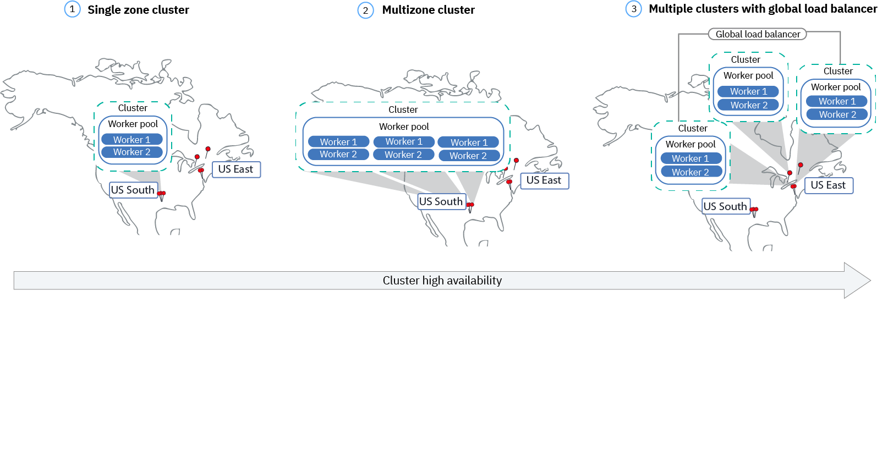

---

copyright: 
  years: 2014, 2024
lastupdated: "2024-07-31"

keywords: containers, {{site.data.keyword.containerlong_notm}}, ha, high availability, failover, kubernetes, multi az, multi-az, szr, mzr

subcollection: containers

---

{{site.data.keyword.attribute-definition-list}}

# Planning your cluster for high availability
{: #ha_clusters}

Design your standard cluster for maximum availability and capacity for your app with {{site.data.keyword.containerlong}}. Use the built-in features to make your cluster more highly available and to protect your app from downtime when a component in your cluster fails.
{: shortdesc}

High availability (HA) is a core discipline in an IT infrastructure to keep your apps up and running, even after a partial or full site failure. The main purpose of high availability is to eliminate potential points of failures in an IT infrastructure. For example, you can prepare for the failure of one system by adding redundancy and setting up failover mechanisms.

What level of availability is best?
:   You can achieve high availability on different levels in your IT infrastructure and within different components of your cluster. The level of availability that is correct for you depends on several factors, such as your business requirements, the Service Level Agreements that you have with your customers, and the resources that you want to expend.

What level of availability does {{site.data.keyword.cloud_notm}} offer?
:   See [How {{site.data.keyword.cloud_notm}} ensures high availability and disaster recovery](/docs/overview?topic=overview-zero-downtime).

The level of availability that you set up for your cluster impacts your coverage under the [{{site.data.keyword.cloud_notm}} HA service level agreement terms](/docs/overview?topic=overview-slas). For example, to receive full HA coverage under the SLA terms, you must set up a multizone cluster with a total of at least 6 worker nodes, two worker nodes per zone that are evenly spread across three zones.
{: important}

## High availability at different levels
{: #ha_levels}

Ensure maximum reliability by considering how high availability can be implemented at every level of your setup, from large geographical regions to your own containers and pods.
{: shortdesc}

To better implement high availability for your cluster and apps, make sure you understand [how IBM Cloud resources are organized by geographic regions and zones](https://cloud.ibm.com/docs/containers?topic=containers-regions-and-zones).
{: tip}

Region availability
:   Every region is set up with a highly available load balancer that is accessible from the region-specific API endpoint. The load balancer routes incoming and outgoing requests to clusters in the regional zones. The likelihood of a full regional failure is low. However, to account for this failure, you can set up [multiple clusters in different regions](#multiple-clusters-glb) and connect them by using an external load balancer. If an entire region fails, the cluster in the other region can take over the workload.

A multi-region cluster requires several Cloud resources, and depending on your app, can be complex and expensive. Check whether you need a multi-region setup or if you can accommodate a potential service disruption. If you want to set up a multi-region cluster, ensure that your app and the data can be hosted in another region, and that your app can handle global data replication.
{: note}

Cluster and zone availability
:   A zone failure affects all physical compute hosts and NFS storage. Failures include power, cooling, networking, or storage outages, and natural disasters, like flooding, earthquakes, and hurricanes. To protect against a zone failure, you must have clusters in two different zones that are load balanced by an external load balancer. Create a cluster in a [multizone location](#mz-clusters), which spreads the master across zones. Or, consider setting up a second cluster in another zone.

Storage availability
:   In a stateful app, data plays an important role to keep your app up and running. Make sure that your data is highly available so that you can recover from a potential failure. In {{site.data.keyword.containerlong_notm}}, you can choose from several options to persist your data. For example, you can provision NFS storage by using Kubernetes native persistent volumes, or store your data by using an {{site.data.keyword.cloud_notm}} database service. For more information, see [Planning highly available data](/docs/containers?topic=containers-storage-plan).

Worker node availability
:   A worker node is a VM that runs on physical hardware. Worker node failures include hardware outages, such as power, cooling, or networking, and issues on the VM itself. You can protect your setup during a worker node failure by setting up multiple worker nodes in your cluster. For more information, see [Creating clusters with multiple worker nodes](/docs/containers?topic=containers-kubernetes-service-cli#cs_cluster_create).

Container or pod availability
:   Containers and pods are, by design, short-lived and can fail unexpectedly. For example, a container or pod might crash if an error occurs in your app. To make your app highly available, you must ensure that you have enough instances of your app to handle the workload plus additional instances in the case of a failure. Ideally, these instances are distributed across multiple worker nodes to protect your app from a worker node failure. For more information, see [Deploying highly available apps](/docs/containers?topic=containers-plan_deploy#highly_available_apps).

## Resource distribution for high availability
{: #ha_distribution}

Your users are less likely to experience downtime when you distribute your apps across multiple worker nodes, zones, and clusters. Built-in capabilities, like load balancing and isolation, increase resiliency against potential failures with hosts, networks, or apps. Review these potential cluster setups that are ordered with increasing degrees of availability. For more information on how IBM Cloud resources are distributed across geographic zones and regions, review the [Locations](https://cloud.ibm.com/docs/containers?topic=containers-regions-and-zones) documentation.
{: tip}

[Single zone clusters](#single_zone) [Classic only]{: tag-classic-inf}
:   Single zone clusters have worker nodes that are distributed across replicas on separate physical hosts within a single zone.  This option protects against certain outages, such as during a master update, and is simpler to manage. However, it does not protect your apps if an entire zone experiences an outage. Single zone clusters deployed in certain locations can later be converted to multi zone clusters.

[Multi zone clusters](#mz-clusters) [Classic]{: tag-classic-inf} [VPC]{: tag-vpc}
:   Multi zone clusters have worker nodes automatically deployed with three replicas spread across multiple zones. If an entire zone experiences an outage, your workload is scheduled onto worker nodes in the other zones, protecting your app from the outage. 

[Multiple clusters linked with load balancers](#multiple-clusters-glb) [Classic]{: tag-classic-inf} [VPC]{: tag-vpc}
:   Multiple clusters can be set up in the same zone or in different zones and connected via a global load balancer. This option is useful if you must provision a cluster in a single zone region, but you still want the benefits of multi zone availability. 

{: caption="Figure 1. High availability for clusters" caption-side="bottom"}

## Single zone clusters
{: #single_zone}

[Classic only]{: tag-classic-inf}

If your cluster is created in a single zone region, the Kubernetes master of your classic cluster is highly available and includes replicas on separate physical hosts for your master API server, etcd, scheduler, and controller manager to protect against an outage, such as during a master update. You can add additional worker nodes to your single zone cluster to improve availability and add protection in the case that one worker node fails. 

If one worker node goes down, app instances on available worker nodes continue to run. Kubernetes automatically reschedules pods from unavailable worker nodes to ensure performance and capacity for your app. To ensure that your pods are evenly distributed across worker nodes, implement [pod affinity](https://kubernetes.io/docs/concepts/scheduling-eviction/assign-pod-node/){: external}.

If you prefer single zone clusters for simplified management, or if your cluster must reside in a specific single zone city that does not support multizone capabilities, you can create [multiple clusters](#multiple-clusters-glb) and connect them with a global load balancer.

If your single zone cluster is created in one of the multizone regions (MZRs), you can [change your single zone cluster to a multizone cluster](#convert-sz-to-mz). In a [multizone cluster](#mz-clusters), your workloads are distributed across worker nodes in different zones. If one zone is not available, your workloads continue to run in the remaining zones.
{: tip}

## Multizone clusters
{: #mz-clusters}

[Classic]{: tag-classic-inf} [VPC]{: tag-vpc}

Multizone clusters distribute workloads across multiple worker nodes and zones, creating additional protection against zone failures. You deploy your multizone cluster [in a metro region](https://cloud.ibm.com/docs/containers?topic=containers-regions-and-zones#zones-vpc), such as `sydney`, and three replicas are automatically spread across the three zones of the metro, such as `au-syd-1`, `au-syd-2`, and  `au-syd-3`. If resources in one zone go down, your cluster workloads continue to run in the other zones. 

Distributing your workload across three zones ensures high availability for your app in case a zone becomes unavailable. You must have your worker nodes spread evenly across all three availability zones to meet the [{{site.data.keyword.cloud_notm}} service level agreement (SLA)](/docs/overview?topic=overview-slas) for HA configuration.
{: important}

Multizone clusters are designed to evenly schedule pods across worker nodes and zones to assure availability and failure recovery. If worker nodes are not spread evenly across the zones or capacity is insufficient in one of the zones, the Kubernetes scheduler or {{site.data.keyword.redhat_openshift_notm}} controller might fail to schedule all requested pods. As a result, pods might go into a **Pending** state until enough capacity is available. If you want to change the default behavior to make Kubernetes scheduler or {{site.data.keyword.redhat_openshift_notm}} controller distribute pods across zones in a best effort distribution, use the `preferredDuringSchedulingIgnoredDuringExecution` [pod affinity policy](https://kubernetes.io/docs/concepts/scheduling-eviction/assign-pod-node/){: external}.

You can create a multizone cluster in one of the supported [classic](/docs/containers?topic=containers-regions-and-zones#zones-mz) or [VPC](/docs/containers?topic=containers-regions-and-zones#zones-vpc) multizone locations only.
{: note}

### Multizone cluster FAQ
{: #mz-cluster-faq-plan}

#### How is my {{site.data.keyword.containerlong_notm}} master set up?
{: #mz-master-setup-plan}

When you create a cluster in a multizone location, a highly available master is automatically deployed and three replicas are spread across the zones of the metro. For example, if the cluster is in `dal10`, `dal12`, or `dal13` zones, the replicas of the master are spread across each zone in the Dallas multizone metro.

#### Do I have to do anything so that the master can communicate with the workers across zones?
{: #mz-master-communication-plan}

If you created a VPC multizone cluster, the subnets in each zone are automatically set up with Access Control Lists (ACLs) that allow communication between the master and the worker nodes across zones. In classic clusters, if you have multiple VLANs for your cluster, multiple subnets on the same VLAN, or a multizone classic cluster, you must enable a [Virtual Router Function (VRF)](/docs/account?topic=account-vrf-service-endpoint&interface=ui) for your IBM Cloud infrastructure account so your worker nodes can communicate with each other on the private network. To enable VRF, see [Enabling VRF](/docs/account?topic=account-vrf-service-endpoint&interface=ui). To check whether a VRF is already enabled, use the `ibmcloud account show` command. If you can't or don't want to enable VRF, enable [VLAN spanning](/docs/vlans?topic=vlans-vlan-spanning#vlan-spanning). To perform this action, you need the **Network > Manage Network VLAN Spanning** infrastructure permission, or you can request the account owner to enable it. To check whether VLAN spanning is already enabled, use the `ibmcloud ks vlan spanning get --region <region>` [command](/docs/containers?topic=containers-kubernetes-service-cli#cs_vlan_spanning_get).

#### Can I convert my single zone cluster to a multizone cluster?
{: #convert-sz-to-mz-plan}

To convert a single zone cluster to a multizone cluster, your cluster must be set up in one of the supported [classic](/docs/containers?topic=containers-regions-and-zones#zones-mz) or [VPC](/docs/containers?topic=containers-regions-and-zones#zones-vpc) multizone locations. VPC clusters can be set up only in multizone metro locations, and as such can always be converted from a single zone cluster to a multizone cluster. Classic clusters that are set up in a single zone data center can't be converted to a multizone cluster. To convert a single zone cluster to a multizone cluster, see [Adding worker nodes to Classic clusters](/docs/containers?topic=containers-add-workers-classic) or [Adding worker nodes to VPC clusters](/docs/containers?topic=containers-add-workers-vpc).

#### Do my apps automatically spread across zones?
{: #multizone-apps-faq-plan}

It depends on how you set up the app. See [Planning highly available deployments](/docs/containers?topic=containers-plan_deploy#highly_available_apps) and [Planning highly available persistent storage](/docs/containers?topic=containers-storage-plan).

## Multiple public clusters connected with a global load balancer
{: #multiple-clusters-glb}

To protect your app from a master failure or for classic clusters that must reside in one of the supported [single zone locations](/docs/containers?topic=containers-regions-and-zones#zones-sz), you can create multiple clusters in different zones within a region, and connect them with a global load balancer.
{: shortdesc}

To connect multiple clusters with a global load balancer, the clusters must be set up with public network connectivity and your apps must be exposed through [Ingress](/docs/containers?topic=containers-managed-ingress-about), [routes](/docs/openshift?topic=openshift-openshift_routes), or with a [Kubernetes load balancer service](/docs/containers?topic=containers-loadbalancer-qs).
{: note}

To balance your workload across multiple clusters, you must [set up a global load balancer](/docs/cis?topic=cis-configure-glb) through [{{site.data.keyword.cis_short}}](/docs/cis?topic=cis-getting-started) and add the public IP addresses of your ALBs or load balancer services to your domain. By adding these IP addresses, you can route incoming traffic between your clusters. 

For the global load balancer to detect if one of your clusters is unavailable, consider adding a ping-based health check to every IP address. When you set up this check, your DNS provider regularly pings the IP addresses that you added to your domain. If one IP address becomes unavailable, then traffic is not sent to this IP address anymore. However, Kubernetes does not automatically restart pods from the unavailable cluster on worker nodes in available clusters. If you want Kubernetes to automatically restart pods in available clusters, consider setting up a [multizone cluster](#mz-clusters).
{: tip}

### Why do I need 3 clusters in three zones?
{: #multicluster-three-zones}

Similar to using [3 zones in multizone clusters](#mz-clusters), you can provide more availability to your app by setting up three clusters across zones. You can also reduce costs by purchasing smaller machines to handle your workload.

### What if I want to set up multiple clusters across regions?
{: #multiple-regions-setup-plan}

You can set up multiple clusters in different regions of one geolocation (such as US South and US East) or across geolocations (such as US South and EU Central). Both setups offer the same level of availability for your app, but also add complexity when it comes to data sharing and data replication. For most cases, staying within the same geolocation is sufficient. But if you have users across the world, it might be better to set up a cluster where your users are so that your users don't experience long waiting times when they send a request to your app.

### What options do I have to load balance workloads across multiple clusters?
{: #multiple-cluster-lb-options-plan}

To load balance workloads across multiple clusters, you must make your apps available on the public network by using [Application Load Balancers (ALBs)](/docs/containers?topic=containers-managed-ingress-about#managed-ingress-albs) or [Network Load Balancers (NLBs)](/docs/containers?topic=containers-loadbalancer-about). The ALBs and NLBs are assigned a public IP address that you can use to access your apps.

To load balance workloads across your apps, add the public IP addresses of your ALBs and NLBs to a CIS global load balancer or your own global load balancer.

### What if I want to load balance workloads on the private network?
{: #glb-private-plan}

{{site.data.keyword.cloud_notm}} does not offer a global load balancer service on the private network. However, you can connect your cluster to a private load balancer that you host in your on-prem network by using one of the [supported VPN options](/docs/containers?topic=containers-vpn). Make sure to expose your apps on the private network by using [Application Load Balancers (ALBs)](/docs/containers?topic=containers-managed-ingress-about#managed-ingress-albs) or [Network Load Balancers (NLBs)](/docs/containers?topic=containers-loadbalancer-about), and use the private IP address in your VPN settings to connect your app to your on-prem network.

