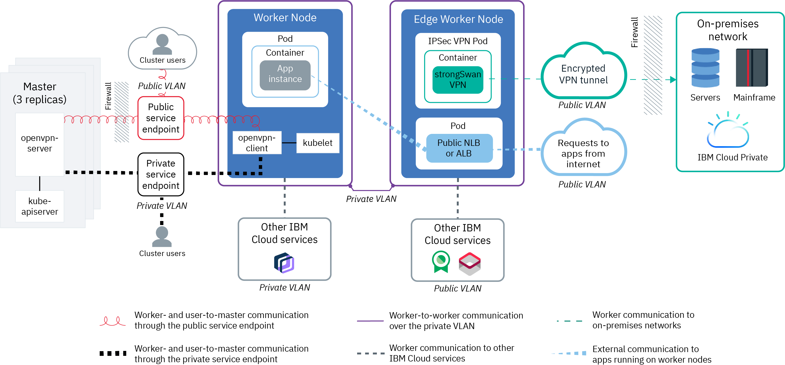
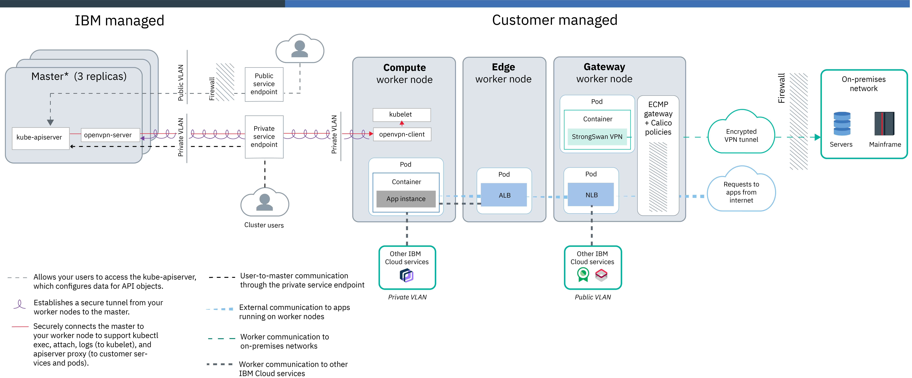
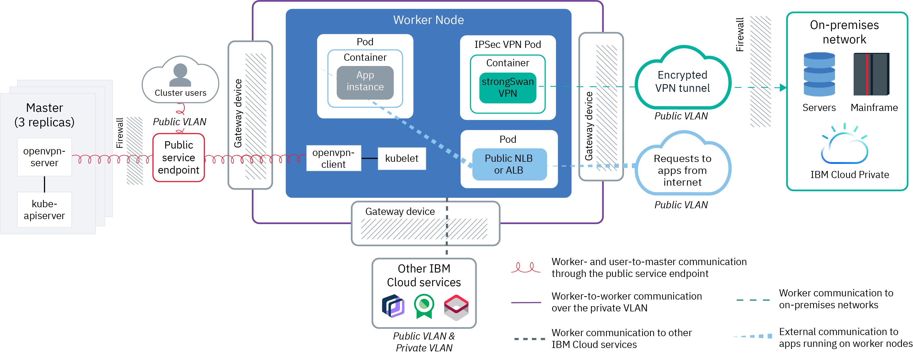
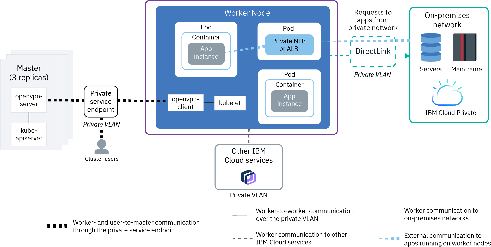

---

copyright: 
  years: 2022, 2022
lastupdated: "2022-11-11"

keywords: kubernetes network, classic

subcollection: containers

---

{{site.data.keyword.attribute-definition-list}}

# Understanding network basics of classic clusters
{: #plan_basics}

When you create a classic cluster, you must choose a networking setup so that certain cluster components can communicate with each other and with networks or services outside of the cluster.
{: shortdesc}

- [Worker-to-worker communication](#worker-worker): All worker nodes must be able to communicate with each other on the private network. In many cases, communication must be permitted across multiple private VLANs to allow workers on different VLANs and in different zones to connect with each other.
- [Worker-to-master and user-to-master communication](#workeruser-master): Your worker nodes and your authorized cluster users can communicate with the Kubernetes master securely over the public network with TLS or over the private network through private cloud service endpoints.
- [Worker communication to other {{site.data.keyword.cloud_notm}} services or on-premises networks](#worker-services-onprem): Allow your worker nodes to securely communicate with other {{site.data.keyword.cloud_notm}} services, such as {{site.data.keyword.registrylong}}, and to an on-premises network.
- [External communication to apps that run on worker nodes](#external-workers): Allow public or private requests into the cluster as well as requests out of the cluster to a public endpoint.

## Worker-to-worker communication: classic VLANs and subnets
{: #worker-worker}

When you create a classic cluster, the cluster's worker nodes are connected automatically to a private VLAN and optionally connected to a public VLAN. A VLAN configures a group of worker nodes and pods as if they were attached to the same physical wire and provides a channel for connectivity among the workers.
{: shortdesc}

You can't create classic {{site.data.keyword.openshiftlong_notm}} clusters that are connected to a private VLAN only. Your worker nodes must be connected to both public and private VLANs.
{: important}

### VLAN connections for worker nodes
{: #worker-worker-nodes}

All worker nodes must be connected to a private VLAN so that each worker node can send information to and receive information from other worker nodes. The private VLAN provides private subnets that are used to assign private IP addresses to your worker nodes and private app services. You can create a cluster with worker nodes that are also connected to a public VLAN. The public VLAN provides public subnets that are used to assign public IP addresses to your worker nodes and public app services. However, if you need to secure your apps from the public network interface, several options are available to secure your cluster such as using [Calico network policies](/docs/containers?topic=containers-network_policies) or isolating external network workloads to [edge worker nodes](/docs/containers?topic=containers-edge).
- Free clusters: In free clusters, the cluster's worker nodes are connected to an IBM-owned public VLAN and private VLAN by default. Because IBM controls the VLANs, subnets, and IP addresses, you can't create multizone clusters or add subnets to your cluster, and can use only NodePort services to expose your app.
- Standard clusters: In standard clusters, the first time that you create a cluster in a zone, a public VLAN and a private VLAN in that zone are automatically provisioned for you in your IBM Cloud infrastructure account. If you specify that worker nodes must be connected to a private VLAN only, then a private VLAN only in that zone is automatically provisioned. For every subsequent cluster that you create in that zone, you can specify the VLAN pair that you want to use. You can reuse the same public and private VLANs that were created for you because multiple clusters can share VLANs.

For more information about VLANs, subnets, and IP addresses, see [Overview of networking in {{site.data.keyword.containerlong_notm}}](/docs/containers?topic=containers-subnets#basics).

Need to create your cluster by using custom subnets? Check out [Using existing subnets to create a cluster](/docs/containers?topic=containers-subnets#subnets_custom).
{: tip}

### Worker node communication across subnets and VLANs
{: #worker-worker-subnets}

In several situations, components in your cluster must be permitted to communicate across multiple private VLANs. For example, if you want to create a multizone cluster, if you have multiple VLANs for a cluster, or if you have multiple subnets on the same VLAN, the worker nodes on different subnets in the same VLAN or in different VLANs can't automatically communicate with each other. You must enable either Virtual Routing and Forwarding (VRF) or VLAN spanning for your IBM Cloud infrastructure account.

- [Virtual Routing and Forwarding (VRF)](/docs/account?topic=account-vrf-service-endpoint#vrf): VRF enables all the private VLANs and subnets in your infrastructure account to communicate with each other. Additionally, VRF is required to allow your workers and master to communicate over the private cloud service endpoint, and to communicate with other {{site.data.keyword.cloud_notm}} instances that support private cloud service endpoints. To check whether a VRF is already enabled, use the `ibmcloud account show` command. To enable VRF, run `ibmcloud account update --service-endpoint-enable true`. This command output prompts you to open a support case to enable your account to use VRF and service endpoints. VRF eliminates the VLAN spanning option for your account because all VLANs are able to communicate.
    When VRF is enabled, any system that is connected to any of the private VLANs in the same {{site.data.keyword.cloud_notm}} account can communicate with the cluster worker nodes. You can isolate your cluster from other systems on the private network by applying [Calico private network policies](/docs/containers?topic=containers-network_policies#isolate_workers).
- [VLAN spanning](/docs/vlans?topic=vlans-vlan-spanning#vlan-spanning): If you can't or don't want to enable VRF, such as if you don't need the master to be accessible on the private network or if you use a gateway appliance to access the master over the public VLAN, enable VLAN spanning. For example, if you have an existing gateway appliance and then add a cluster, the new portable subnets that are ordered for the cluster aren't configured on the gateway appliance but VLAN spanning enables routing between the subnets. To enable VLAN spanning, you need the **Network > Manage Network VLAN Spanning** [infrastructure permission](/docs/containers?topic=containers-access-creds#infra_access), or you can request the account owner to enable it. To check whether VLAN spanning is already enabled, use the `ibmcloud ks vlan spanning get` [command](/docs/containers?topic=containers-kubernetes-service-cli#cs_vlan_spanning_get). You can't enable the private cloud service endpoint if you choose to enable VLAN spanning instead of VRF.

## Worker-to-master and user-to-master communication: Service endpoints
{: #workeruser-master}

A communication channel must be set up so that worker nodes can establish a connection to the Kubernetes master. You can allow your worker nodes and Kubernetes master to communicate by enabling the public cloud service endpoint only, public and private cloud service endpoints, or the private cloud service endpoint only.
{: shortdesc}

To secure communication over public and private cloud service endpoints, {{site.data.keyword.containerlong_notm}} automatically sets up an OpenVPN (Kubernetes version 1.20 or earlier) or Konnectivity (Kubernetes version 1.21 or later) connection between the Kubernetes master and the worker node when the cluster is created. Workers securely talk to the master through TLS certificates, and the master talks to workers through the OpenVPN connection.

### Public service endpoint only
{: #workeruser-master-endpoint}

If you don’t want to or can't enable VRF for your account, your worker nodes can automatically connect to the Kubernetes master over the public VLAN through the public cloud service endpoint.
- Communication between worker nodes and master is established securely over the public network through the public cloud service endpoint.
- The master is publicly accessible to authorized cluster users only through the public cloud service endpoint. Your cluster users can securely access your Kubernetes master over the internet to run `kubectl` commands, for example.

### Public and private cloud service endpoints
{: #workeruser-master-pub-priv}

To make your master publicly or privately accessible to cluster users, you can enable the public and private cloud service endpoints. VRF is required in your {{site.data.keyword.cloud_notm}} account, and you must enable your account to use service endpoints. To enable VRF and service endpoints, run `ibmcloud account update --service-endpoint-enable true`.
- If worker nodes are connected to public and private VLANs, communication between worker nodes and master is established over both the private network through the private cloud service endpoint and the public network through the public cloud service endpoint. By routing half of the worker-to-master traffic over the public endpoint and half over the private endpoint, your master-to-worker communication is protected from potential outages of the public or private network. If worker nodes are connected to private VLANs only, communication between worker nodes and master is established over the private network through the private cloud service endpoint only.
- The master is publicly accessible to authorized cluster users through the public cloud service endpoint. The master is privately accessible through the private cloud service endpoint if authorized cluster users are in your {{site.data.keyword.cloud_notm}} private network or are connected to the private network through a VPN connection or {{site.data.keyword.dl_full_notm}}. Note that you must [expose the master endpoint through a private load balancer](/docs/containers?topic=containers-access_cluster#access_private_se) so that users can access the master through a VPN or {{site.data.keyword.dl_full_notm}} connection.
- You can optionally secure access to your private cloud service endpoint by creating a subnet allowlist. Only authorized requests to your cluster master that originate from subnets in the allowlist are permitted through the cluster's private cloud service endpoint. For more information, see [Creating an allowlist for the private cloud service endpoint](/docs/containers?topic=containers-access_cluster#private-se-allowlist).

### Private service endpoint only
{: #workeruser-master-private}

To make your master only privately accessible, you can enable the private cloud service endpoint. VRF is required in your {{site.data.keyword.cloud_notm}} account, and you must enable your account to use service endpoints. To enable VRF and service endpoints, run `ibmcloud account update --service-endpoint-enable true`. Note that using private cloud service endpoint only incurs no billed or metered bandwidth charges.
- Communication between worker nodes and master is established over the private network through the private cloud service endpoint.
- The master is privately accessible if authorized cluster users are in your {{site.data.keyword.cloud_notm}} private network or are connected to the private network through a VPN connection or DirectLink. Note that you must [expose the master endpoint through a private load balancer](/docs/containers?topic=containers-access_cluster#access_private_se) so that users can access the master through a VPN or DirectLink connection.
- You can optionally secure access to your private cloud service endpoint by creating a subnet allowlist. Only authorized requests to your cluster master that originate from subnets in the allowlist are permitted through the cluster's private cloud service endpoint. For more information, see [Creating an allowlist for the private cloud service endpoint](/docs/containers?topic=containers-access_cluster#private-se-allowlist).

## Worker communication to other {{site.data.keyword.cloud_notm}} services or on-premises networks
{: #worker-services-onprem}

Allow your worker nodes to securely communicate with other {{site.data.keyword.cloud_notm}} services and to an on-premises network.
{: shortdesc}

### Communication with other {{site.data.keyword.cloud_notm}} services over the private or public network
{: #worker-services-onprem-pub-priv}

Your worker nodes can automatically and securely communicate with other [{{site.data.keyword.cloud_notm}} services that support private cloud service endpoints](/docs/account?topic=account-vrf-service-endpoint), such as {{site.data.keyword.registrylong}}, over your IBM Cloud infrastructure private network. If an {{site.data.keyword.cloud_notm}} service does not support private cloud service endpoints, your worker nodes must be connected to a public VLAN so that they can securely communicate with the services over the public network.

If you use Calico policies or a gateway appliance to control the public or private networks of your worker nodes, you must allow access to the public IP addresses of the services that support public cloud service endpoints, and optionally to the private IP addresses of the services that support private cloud service endpoints.
- [Allow access to services' public IP addresses in Calico policies](/docs/containers?topic=containers-network_policies#isolate_workers_public)
- [Allow access to the private IP addresses of services that support private cloud service endpoints in Calico policies](/docs/containers?topic=containers-network_policies#isolate_workers)
- [Allow access to services' public IP addresses and to the private IP addresses of services that support private cloud service endpoints in a gateway appliance firewall](/docs/containers?topic=containers-firewall#firewall_outbound)

### {{site.data.keyword.BluDirectLink}} for communication over the private network with resources in on-premises data centers
{: #worker-services-onprem-direct-link}

To connect your cluster with your on-premises data center, such as with {{site.data.keyword.icpfull_notm}}, you can set up [{{site.data.keyword.dl_full_notm}}](/docs/dl?topic=dl-get-started-with-ibm-cloud-dl). With {{site.data.keyword.dl_full_notm}}, you create a direct, private connection between your remote network environments and {{site.data.keyword.containerlong_notm}} without routing over the public internet.

### strongSwan IPSec VPN connection for communication over the public network with resources in on-premises data centers
{: #worker-services-onprem-strongswan}

* Worker nodes that are connected to public and private VLANs: Set up a [strongSwan IPSec VPN service](https://www.strongswan.org/about.html){: external} directly in your cluster. The strongSwan IPSec VPN service provides a secure end-to-end communication channel over the internet that is based on the industry-standard Internet Protocol Security (IPSec) protocol suite. To set up a secure connection between your cluster and an on-premises network, [configure and deploy the strongSwan IPSec VPN service](/docs/containers?topic=containers-vpn#vpn-setup) directly in a pod in your cluster.

* Worker nodes connected to a private VLAN only: Set up an IPSec VPN endpoint on a gateway appliance, such as a Virtual Router Appliance (Vyatta). Then, [configure the strongSwan IPSec VPN service](/docs/containers?topic=containers-vpn#vpn-setup) in your cluster to use the VPN endpoint on your gateway. If you don't want to use strongSwan, you can [set up VPN connectivity directly with VRA](/docs/containers?topic=containers-vpn#vyatta).

If you plan to connect your cluster to on-premises networks, check out the following helpful information:
{: tip}

- You might have subnet conflicts with the IBM-provided default 172.30.0.0/16 range for pods and 172.21.0.0/16 range for services. You can avoid subnet conflicts when you [create a cluster from the CLI](/docs/containers?topic=containers-kubernetes-service-cli#cs_cluster_create) by specifying a custom subnet CIDR for pods in the `--pod-subnet` flag and a custom subnet CIDR for services in the `--service-subnet` flag.
- If your VPN solution preserves the source IP addresses of requests, you can [create custom static routes](/docs/containers?topic=containers-static-routes) to ensure that your worker nodes can route responses from your cluster back to your on-premises network.
- Note that the `172.16.0.0/16`, `172.18.0.0/16`, `172.19.0.0/16`, and `172.20.0.0/16` subnet ranges are prohibited because they are reserved for {{site.data.keyword.containerlong_notm}} control plane functionality.

## External communication to apps that run on worker nodes
{: #external-workers}

Allow public or private traffic requests from outside the cluster to your apps that run on worker nodes.
{: shortdesc}

### Private traffic to cluster apps
{: #external-workers-private}

When you deploy an app in your cluster, you might want to make the app accessible to only users and services that are on the same private network as your cluster. Private load balancing is ideal for making your app available to requests from outside the cluster without exposing the app to the general public. You can also use private load balancing to test access, request routing, and other configurations for your app before you later expose your app to the public with public network services. To allow private traffic requests from outside the cluster to your apps, you can create private Kubernetes networking services, such as private NodePorts, NLBs, and Ingress ALBs. You can then use Calico pre-DNAT policies to block traffic to public NodePorts of private networking services. For more information, see [Planning private external load balancing](/docs/containers?topic=containers-cs_network_planning#private_access).

### Public traffic to cluster apps
{: #external-workers-public}

To make your apps externally accessible from the public internet, you can create public NodePorts, network load balancers (NLBs), and Ingress application load balancers (ALBs). Public networking services connect to this public network interface by providing your app with a public IP address and, depending on the service, a public URL. When an app is publicly exposed, anyone that has the public service IP address or the URL that you set up for your app can send a request to your app. You can then use Calico pre-DNAT policies to control traffic to public networking services, such as allowing traffic from only certain source IP addresses or CIDRs and blocking all other traffic. For more information, see [Planning public external load balancing](/docs/containers?topic=containers-cs_network_planning#public_access).

For additional security, you can isolate networking workloads to gateway worker nodes and edge worker nodes.
Gateway-enabled classic clusters
:    Gateway worker nodes help you achieve network connectivity separation between the internet or an on-premises data center and the compute workload that runs in your cluster. When you create a classic cluster with a gateway, the cluster is created with a `compute` worker pool of compute worker nodes that are connected to a private VLAN only, and a `gateway` worker pool of gateway worker nodes that are connected to public and private VLANs. The gateway worker pool provides an edge firewall in the form of Calico policies for ingress and egress traffic, load balancers for ingress traffic to the cluster, and a gateway for egress traffic from the cluster. All NLB pods deploy to the gateway worker nodes, which are also tainted so that no compute workloads can be scheduled onto them. Then, if you want to provide another level of network separation between the public network and your worker pools of compute worker nodes, you can optionally create an edge worker pool. When you create an edge node worker pool in a gateway-enabled cluster, ALB pods are deployed to only those specified worker nodes. By deploying only ALBs to edge nodes, all layer 7 proxy management is kept separate from the gateway worker nodes so that TLS termination and HTTP request routing is completed by the ALBs on the private network only.

Classic clusters without a gateway
:    Edge worker nodes can improve the security of your cluster by allowing fewer worker nodes that are connected to public VLANs to be accessed externally and by isolating the networking workload. When you [label worker nodes as edge nodes](/docs/containers?topic=containers-edge#edge_nodes), NLB and ALB pods are deployed to only those specified worker nodes. To also prevent other workloads from running on edge nodes, you can [taint the edge nodes](/docs/containers?topic=containers-edge#edge_workloads). Then, you can deploy both public and private NLBs and ALBs to edge nodes.
For example, if your worker nodes are connected to a private VLAN only, but you need to permit public access to an app in your cluster, you can create an edge worker pool in which the edge nodes are connected to public and private VLANs. You can deploy public NLBs and ALBs to these edge nodes to ensure that only those workers handle public connections.

## Scenario: Running internet-facing app workloads in a classic cluster
{: #internet-facing}

In this scenario, you want to run workloads in a classic cluster that are accessible to requests from the Internet so that end users can access your apps. You want the option of isolating public access in your cluster and of controlling what public requests are permitted to your cluster. Additionally, your workers have automatic access to any {{site.data.keyword.cloud_notm}} services that you want to connect with your cluster.
{: shortdesc}

{: caption="Figure 1. Network setup for a cluster that runs internet-facing workloads" caption-side="bottom"}

### Worker-to-worker communication in classic clusters with internet-facing workloads
{: #internet-facing-worker}

To achieve this setup, you create a cluster by connecting worker nodes to public and private VLANs.

If you create the cluster with both public and private VLANs, you can't later remove all public VLANs from that cluster. Removing all public VLANs from a cluster causes several cluster components to stop working. Instead, create a new worker pool that is connected to a private VLAN only.
{: note}

### Worker-to-master and user-to-master communication in classic clusters with internet-facing workloads
{: #internet-facing-master}

You can choose to allow worker-to-master and user-to-master communication over the public and private networks, or over the public network only.
- Public and private cloud service endpoints: Your account must be enabled with VRF and enabled to use service endpoints. Communication between worker nodes and master is established over both the private network through the private cloud service endpoint and the public network through the public cloud service endpoint. The master is publicly accessible to authorized cluster users through the public cloud service endpoint.
- Public service endpoint: If you don’t want to or can't enable VRF for your account, your worker nodes and authorized cluster users can automatically connect to the Kubernetes master over the public network through the public cloud service endpoint.

### Worker communication to other services or networks with internet-facing workloads
{: #internet-facing-services}

Your worker nodes can automatically, securely communicate with other {{site.data.keyword.cloud_notm}} services that support private cloud service endpoints over your IBM Cloud infrastructure private network. If an {{site.data.keyword.cloud_notm}} service does not support private cloud service endpoints, workers can securely communicate with the services over the public network. You can lock down the public or private interfaces of worker nodes by using Calico network policies for public network or private network isolation. You might need to allow access to the public and private IP addresses of the services that you want to use in these Calico isolation policies.

If your worker nodes need to access services in private networks outside of your {{site.data.keyword.cloud_notm}} account, you can configure and deploy the strongSwan IPSec VPN service in your cluster or leverage {{site.data.keyword.cloud_notm}} {{site.data.keyword.dl_full_notm}} services to connect to these networks.

### External communication to apps that run on worker nodes with internet-facing workloads
{: #internet-facing-external}

To expose an app in your cluster to the internet, you can create a public network load balancer (NLB) or Ingress application load balancer (ALB) service. You can improve the security of your cluster by creating a pool of worker nodes that are labeled as edge nodes. The pods for public network services are deployed to the edge nodes so that external traffic workloads are isolated to only a few workers in your cluster. You can further control public traffic to the network services that expose your apps by creating Calico pre-DNAT policies, such as allowlist and blocklist policies.

Ready to get started with a cluster for this scenario? After you plan your [high availability](/docs/containers?topic=containers-ha_clusters) and [worker node](/docs/containers?topic=containers-planning_worker_nodes) setups, see [Creating clusters](/docs/containers?topic=containers-clusters).

  
## Scenario: Extend your on-premises data center with a gateway-enabled classic cluster
{: #gateway}

In this scenario, you want to run workloads in a classic cluster that are accessible to services, databases, or other resources in your on-premises data center. However, you might need to provide limited public access to your cluster, and want to ensure that any public access is controlled and isolated in your cluster. For example, you might need your workers to access an {{site.data.keyword.cloud_notm}} service that does not support private cloud service endpoints, and must be accessed over the public network. Or you might need to provide limited public access to an app that runs in your cluster. To achieve this cluster setup, you can create a firewall by creating a gateway-enabled cluster.
{: shortdesc}

{: caption="Figure 1. Network setup for a cluster that uses a gateway for secure public access" caption-side="bottom"}

### Worker-to-worker communication in a gateway-enabled classic cluster
{: #limited-public-worker}

With this setup, you create a cluster that is connected to a public VLAN and a private VLAN and has an enabled gateway. The cluster is created with a `compute` worker pool of compute worker nodes that are connected to a private VLAN only, and a `gateway` worker pool of gateway worker nodes that are connected to public and private VLANs. Gateway worker nodes help you achieve network connectivity separation between the internet or an on-premises data center and the compute workload that runs in your cluster. After your cluster is created, if you want to provide another level of network separation between the public network and your worker pools of compute worker nodes, you can optionally [create an edge worker pool](/docs/containers?topic=containers-edge#edge_nodes), which is connected to a private VLAN only. Only ALB pods are deployed to the edge worker nodes.

### Worker-to-master and user-to-master communication in a gateway-enabled classic cluster
{: #limited-public-master}

To set up and use the private cloud service endpoint, your account must be enabled with VRF and enabled to use private cloud service endpoints. You can choose to allow worker-to-master and user-to-master communication over the public and private networks, or over the private network only.
- Public and private cloud service endpoints: Communication between compute worker nodes and the master is established over the private network through the private cloud service endpoint only. Communication between gateway worker nodes and the master is established over both the private network through the private cloud service endpoint and the public network through the public cloud service endpoint. The master is publicly accessible to authorized cluster users through the public cloud service endpoint.
- Private service endpoint only: Communication between all worker nodes and the master is established over the private network through the private cloud service endpoint. The Kubernetes master is accessible through the private cloud service endpoint if authorized cluster users are in your {{site.data.keyword.cloud_notm}} private network or are connected to the private network such as through a [classic VPN connection](/docs/iaas-vpn?topic=iaas-vpn-getting-started) or [{{site.data.keyword.dl_full_notm}}](/docs/dl?topic=dl-get-started-with-ibm-cloud-dl). However, communication with the Kubernetes master over the private cloud service endpoint must go through the `166.X.X.X` IP address range, which is not routable from a classic VPN connection or through {{site.data.keyword.dl_full_notm}}. You can expose the private cloud service endpoint of the master for your cluster users by using a private network load balancer (NLB). The private NLB exposes the private cloud service endpoint of the master as an internal `10.X.X.X` IP address range that users can access with the VPN or {{site.data.keyword.dl_full_notm}} connection. If you enable only the private cloud service endpoint, you can use the Kubernetes dashboard or temporarily enable the public cloud service endpoint to create the private NLB.

### Worker communication to other services or networks in a gateway-enabled classic cluster
{: #limited-public-service}

Your worker nodes can automatically, securely communicate with other {{site.data.keyword.cloud_notm}} services that support private cloud service endpoints over your {{site.data.keyword.cloud_notm}} private network. If an {{site.data.keyword.cloud_notm}} service does not support private cloud service endpoints, your gateway worker nodes that are connected to a public VLAN can securely communicate with the services over the public network. The gateway worker nodes are automatically protected by default Calico policies that act as a firewall for your cluster. If you create additional Calico network policies to further lock down the public or private network interfaces of your worker nodes, you might need to allow access to the public and private IP addresses of the services that you want to use in these Calico isolation policies.

To securely access services outside of {{site.data.keyword.cloud_notm}} and other on-premises networks, you can configure and deploy the strongSwan IPSec VPN service in your cluster. The strongSwan load balancer pod deploys to a worker in the gateway pool, where the pod establishes a secure connection to the on-premises network through an encrypted VPN tunnel over the public network. Alternatively, you can use {{site.data.keyword.dl_full_notm}} services to connect your cluster to your on-premises data center over the private network only.

### External communication to apps that run on worker nodes in a gateway-enabled classic cluster
{: #limited-public-external}

To provide private access to an app in your cluster, you can create a private network load balancer (NLB) or Ingress application load balancer (ALB) to expose your app to the private network only. If you need to provide public access to an app in your cluster, you can create a public NLB or ALB to expose your app. The pods for private and public NLBs and public and private ALBs deploy to the compute worker nodes. The gateway worker nodes are tainted so that no compute workloads can be scheduled onto them. If you also choose to create an edge node worker pool, ALB pods are deployed to the edge worker nodes instead of the gateway worker nodes. The gateway worker nodes also provide Equal Cost Multipath (ECMP) gateways for egress traffic from the cluster. When the app returns a response, the ECMP protocol is used to balance the response traffic through a gateway on one of the gateway worker nodes to the client. The gateway worker nodes are automatically protected by default Calico policies that act as a firewall for your cluster. You can further limit public traffic to the network services that expose your apps by creating Calico pre-DNAT policies, such as allowlist and blocklist policies.

Ready to get started with a cluster for this scenario? After you plan your [high availability](/docs/containers?topic=containers-ha_clusters) and [worker node](/docs/containers?topic=containers-planning_worker_nodes) setups, see [Prepare to create clusters at the account level](/docs/containers?topic=containers-clusters). Then, follow the steps in [Creating a standard classic cluster with a gateway](/docs/containers?topic=containers-cluster-create-classic&interface=ui).

## Scenario: Allow limited public connectivity with a gateway appliance
{: #vyatta-gateway}

In this scenario, you want to run workloads in a classic cluster that are accessible to services, databases, or other resources in your on-premises data center. However, you might need to provide limited public access to your cluster, and want to ensure that any public access is controlled and isolated in your cluster. For example, you might need your workers to access an {{site.data.keyword.cloud_notm}} service that does not support private cloud service endpoints, and must be accessed over the public network. Or you might need to provide limited public access to an app that runs in your cluster. To achieve this cluster setup, you can configure a gateway appliance, such as a Virtual Router Appliance (Vyatta), as a public gateway and firewall.
{: shortdesc}

{: caption="Figure 1. Network setup for a cluster that uses a gateway appliance for secure public access" caption-side="bottom"}

### Worker-to-worker communication, worker-to-master and user-to-master communication with a gateway appliance
{: #limited-public-gw-worker}

If you set up your worker nodes on a private VLAN only and you don’t want to or can't enable VRF for your account, you must configure a gateway appliance to provide network connectivity between your worker nodes and the master over the public network. For example, you might choose to set up a [Virtual Router Appliance](/docs/virtual-router-appliance?topic=virtual-router-appliance-about-the-vra) or a [Fortigate Security Appliance](/docs/vmwaresolutions/services?topic=vmwaresolutions-fsa_considerations).

You can set up your gateway appliance with custom network policies to provide dedicated network security for your cluster and to detect and remediate network intrusion. When you set up a firewall on the public network, you must open up the required ports and private IP addresses for each region so that the master and the worker nodes can communicate. If you also configure this firewall for the private network, you must also open up the required ports and private IP addresses to allow communication between worker nodes and let your cluster access infrastructure resources over the private network. You must also enable VLAN spanning for your account so that subnets can route on the same VLAN and across VLANs.

### Worker communication to other services or networks with a gateway appliance
{: #limited-public-gw-services}

To securely connect your worker nodes and apps to an on-premises network or services outside of {{site.data.keyword.cloud_notm}}, set up an IPSec VPN endpoint on your gateway appliance and the strongSwan IPSec VPN service in your cluster to use the gateway VPN endpoint. If you don't want to use strongSwan, you can set up VPN connectivity directly with VRA.

Your worker nodes can securely communicate with other {{site.data.keyword.cloud_notm}} services and public services outside of {{site.data.keyword.cloud_notm}} through your gateway appliance. You can configure your firewall allow access to the public and private IP addresses of only the services that you want to use

### External communication to apps that run on worker nodes with a gateway appliance
{: #limited-public-gw-external}

To provide private access to an app in your cluster, you can create a private network load balancer (NLB) or Ingress application load balancer (ALB) to expose your app to the private network only. If you need to provide limited public access to an app in your cluster, you can create a public NLB or ALB to expose your app. Because all traffic goes through your gateway appliance firewall, you can control public and private traffic to the network services that expose your apps by opening up the service's ports and IP addresses in your firewall to permit inbound traffic to these services.

Ready to get started with a cluster for this scenario? After you plan your [high availability](/docs/containers?topic=containers-ha_clusters) and [worker node](/docs/containers?topic=containers-planning_worker_nodes) setups, see [Creating clusters](/docs/containers?topic=containers-clusters).

## Scenario: Extend your on-premises data center to a classic cluster
{: #private_clusters}

In this scenario, you want to run workloads in a classic cluster. However, you want these workloads to be accessible only to services, databases, or other resources in your on-premises data center, such as {{site.data.keyword.icpfull_notm}}. Your cluster workloads might need to access a few other {{site.data.keyword.cloud_notm}} services that support communication over the private network, such as {{site.data.keyword.cos_full_notm}}.
{: shortdesc}

{: caption="Figure 1. Network setup for a cluster that connects to an on-premises data center on the private network" caption-side="bottom"}

### Worker-to-worker communication for private clusters
{: #private_clusters-worker}

To achieve this setup, you create a cluster by connecting worker nodes to a private VLAN only. To provide connectivity between the cluster master and worker nodes over the private network through the private cloud service endpoint only, your account must be enabled with VRF and enabled to use service endpoints. Because your cluster is visible to any resource on the private network when VRF is enabled, you can isolate your cluster from other systems on the private network by applying Calico private network policies.

Note that you might have subnet conflicts between the default ranges for workers nodes, pods, and services, and the subnets in your on-premises networks. You create your cluster without IBM-provided subnets by including the `--no-subnet` flag. After the cluster is created, you can [add custom subnets](/docs/containers?topic=containers-subnets#subnets_custom) to your cluster. Additionally, you can specify a custom subnet CIDR for pods and services by using the `--pod-subnet` and `--service-subnet` flags in the `ibmcloud ks cluster create` command when you create your cluster.

### Worker-to-master and user-to-master communication for private clusters
{: #private_clusters-master}

The Kubernetes master is accessible through the private cloud service endpoint if authorized cluster users are in your {{site.data.keyword.cloud_notm}} private network or are connected to the private network such as through a [classic VPN connection](/docs/iaas-vpn?topic=iaas-vpn-getting-started) or [{{site.data.keyword.dl_full_notm}}](/docs/dl?topic=dl-get-started-with-ibm-cloud-dl). However, communication with the Kubernetes master over the private cloud service endpoint must go through the `166.X.X.X` IP address range, which is not routable from a classic VPN connection or through {{site.data.keyword.dl_full_notm}}. You can expose the private cloud service endpoint of the master for your cluster users by using a private network load balancer (NLB). The private NLB exposes the private cloud service endpoint of the master as an internal `10.X.X.X` IP address range that users can access with the VPN or {{site.data.keyword.dl_full_notm}} connection. If you enable only the private cloud service endpoint, you can use the Kubernetes dashboard or temporarily enable the public cloud service endpoint to create the private NLB.

### Worker communication to other services or networks for private clusters
{: #private_clusters-services}

Your worker nodes can automatically, securely communicate with other {{site.data.keyword.cloud_notm}} services that support private cloud service endpoints, such as {{site.data.keyword.registrylong}}, over your IBM Cloud infrastructure private network. For example, dedicated hardware environments for all standard plan instances of {{site.data.keyword.cloudant_short_notm}} support private cloud service endpoints. If an {{site.data.keyword.cloud_notm}} service does not support private cloud service endpoints, your cluster can't access that service.

### External communication to apps that run on worker nodes for private clusters
{: #private_clusters-external}

To provide private access to an app in your cluster, you can create a private network load balancer (NLB) or Ingress application load balancer (ALB). These Kubernetes network services expose your app to the private network only so that any on-premises system with a connection to the subnet that the NLB IP is on can access the app.

Ready to get started with a cluster for this scenario? After you plan your [high availability](/docs/containers?topic=containers-ha_clusters) and [worker node](/docs/containers?topic=containers-planning_worker_nodes) setups, see [Creating clusters](/docs/containers?topic=containers-clusters).

