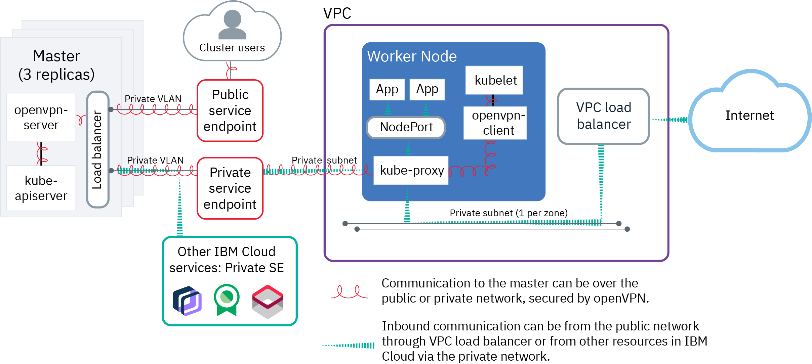
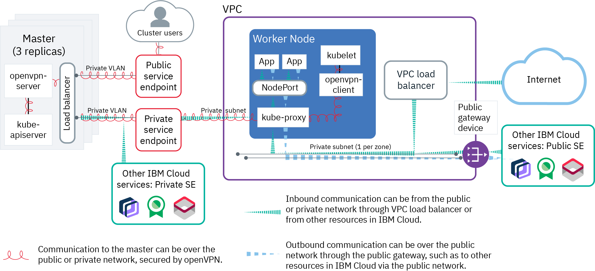
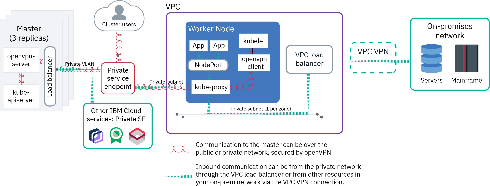

---

copyright: 
  years: 2022, 2023
lastupdated: "2023-04-14"

keywords: kubernetes network

subcollection: containers

---

{{site.data.keyword.attribute-definition-list}}

# Understanding network basics of VPC clusters
{: #plan_vpc_basics}

When you create your cluster, you must choose a networking setup so that certain cluster components can communicate with each other and with networks or services outside of the cluster.
{: shortdesc}

* [Worker-to-worker communication](#vpc-worker-worker): All worker nodes must be able to communicate with each other on the private network through VPC subnets.
* [Worker-to-master and user-to-master communication](#vpc-workeruser-master): Your worker nodes and your authorized cluster users can communicate with the Kubernetes master securely over virtual private endpoints or cloud service endpoints.
* [Worker communication to other services or networks](#vpc-worker-services-onprem): Allow your worker nodes to securely communicate with other {{site.data.keyword.cloud_notm}} services, such as {{site.data.keyword.registrylong}}, to on-premises networks, to other VPCs, or to classic infrastructure resources.
* [External communication to apps that run on worker nodes](#vpc-external-workers): Allow public or private requests into the cluster as well as requests out of the cluster to a public endpoint.

## Worker-to-worker communication using VPC subnets
{: #vpc-worker-worker}

Before you create a VPC cluster for the first time, you must [create a VPC subnet](https://cloud.ibm.com/vpc/provision/network){: external} in each zone where you want to deploy worker nodes. A VPC subnet is a specified private IP address range (CIDR block) and configures a group of worker nodes and pods as if they are attached to the same physical wire.
{: shortdesc}

When you create a cluster, you specify an existing VPC subnet for each zone. Each worker node that you add in a cluster is deployed with a private IP address from the VPC subnet in that zone. After the worker node is provisioned, the worker node IP address persists after a `reboot` operation, but the worker node IP address changes after `replace` and `update` operations.

Subnets provide a channel for connectivity among the worker nodes within the cluster. Additionally, any system that is connected to any of the private subnets in the same VPC can communicate with workers. For example, all subnets in one VPC can communicate through private layer 3 routing with a built-in VPC router. If you have multiple clusters that must communicate with each other, you can create the clusters in the same VPC. However, if your clusters don't need to communicate, you can achieve better network segmentation by creating the clusters in separate VPCs. You can also create [access control lists (ACLs)](/docs/openshift?topic=openshift-vpc-acls) for your VPC subnets to mediate traffic on the private network. ACLs consist of inbound and outbound rules that define which ingress and egress is permitted for each VPC subnet.

If your worker nodes must access a public endpoint outside of the cluster, you can enable a public gateway on the VPC subnet that the worker nodes are deployed to. A public gateway can be attached to or detached from a subnet at any time.

The default IP address range for VPC subnets is 10.0.0.0 – 10.255.255.255. For a list of IP address ranges per VPC zone, see the [VPC default address prefixes](/docs/vpc?topic=vpc-configuring-address-prefixes).

If you enable classic access when you create your VPC, [classic access default address prefixes](/docs/vpc?topic=vpc-setting-up-access-to-classic-infrastructure#classic-access-default-address-prefixes) automatically determine the IP ranges of any subnets that you create. However, the default IP ranges for classic access VPC subnets conflict with the subnets for the {{site.data.keyword.containerlong_notm}} control plane. Instead, you must [create the VPC without the automatic default address prefixes, and then create your own address prefixes and subnets within those ranges for you cluster](/docs/containers?topic=containers-vpc-subnets#classic_access_subnets).

Need to create your cluster by using custom-range subnets? Check out this guidance on [custom address prefixes](/docs/vpc?topic=vpc-configuring-address-prefixes). If you use custom-range subnets for your worker nodes, you must [ensure that your worker node subnets don't overlap with your cluster's pod subnet](/docs/containers?topic=containers-vpc-subnets#vpc-ip-range).
{: tip}

Do not delete the subnets that you attach to your cluster during cluster creation or when you add worker nodes in a zone. If you delete a VPC subnet that your cluster used, any load balancers that use IP addresses from the subnet might experience issues, and you might be unable to create new load balancers.
{: important}

When you create VPC subnets for your clusters, keep in mind the following features and limitations. For more information about VPC subnets, see [Characteristics of subnets in the VPC](/docs/vpc?topic=vpc-about-networking-for-vpc#subnets-in-the-vpc).
* The default CIDR size of each VPC subnet is `/24`, which can support up to 253 worker nodes. If you plan to deploy more than 250 worker nodes per zone in one cluster, consider creating a subnet of a larger size.
* After you create a VPC subnet, you can't resize it or change its IP range.
* Multiple clusters in the same VPC can share subnets.
* VPC subnets are bound to a single zone and can't span multiple zones or regions.
* After you create a subnet, you can't move it to a different zone, region, or VPC.
* If you have worker nodes that are attached to an existing subnet in a zone, you can't change the subnet for that zone in the cluster.
* The `172.16.0.0/16`, `172.18.0.0/16`, `172.19.0.0/16`, and `172.20.0.0/16` ranges are prohibited if you are using Kubernetes 1.20 or earlier .

## Worker-to-master and user-to-master communication using Virtual private endpoints or cloud service endpoints
{: #vpc-workeruser-master}

{{site.data.keyword.containerlong_notm}} uses different types of service endpoints to establish a connection from authorized cluster users and worker nodes to the Kubernetes master. Authorized cluster users communicate with the Kubernetes master through cloud service endpoints. Depending on your cluster version, worker nodes communicate with the Kubernetes master through cloud service endpoints or VPC virtual private endpoints.
{: shortdesc}

Before you create a cluster, you must enable your account to use service endpoints. To enable service endpoints, run `ibmcloud account update --service-endpoint-enable true`.

In VPC clusters in {{site.data.keyword.containerlong_notm}}, you can't disable the private cloud service endpoint or set up a cluster with the public cloud service endpoint only.
{: note}

## Worker-to-master communication in VPC clusters
{: #worker-to-master-comms}

Worker node communication to the Kubernetes master is established differently based on your cluster version.

* Worker node communication to the Kubernetes master is established over the [VPC virtual private endpoint (VPE)](/docs/containers?topic=containers-vpc-subnets#vpc_basics_vpe). If the public cloud service endpoint is also enabled, worker-to-master traffic is established half over the public endpoint and half over the VPE for protection from potential outages of the public or private network.

To secure communication over public and private cloud service endpoints or VPEs, {{site.data.keyword.containerlong_notm}} automatically sets up a Konnectivity connection between the Kubernetes master and worker nodes when the cluster is created. Worker nodes securely talk to the master through TLS certificates, and the master talks to workers through the Konnectivity connection.

## User-to-master communication in VPC clusters
{: #user-to-master-comms}

You can allow authorized cluster users to communicate with the Kubernetes master by enabling the public and private cloud service endpoints, or the private cloud service endpoint only.

* Public and private cloud service endpoints: By default, all calls to the master that are initiated by authorized cluster users are routed through the public cloud service endpoint. If authorized cluster users are in your VPC network or are connected through a [VPC VPN connection](/docs/containers?topic=containers-vpc-vpnaas), the master is privately accessible through the private cloud service endpoint.
* Private cloud service endpoint only: To access the master through the private cloud service endpoint, authorized cluster users must either be in your VPC network or connected through a [VPC VPN connection](/docs/containers?topic=containers-vpc-vpnaas).

You can secure access to your private cloud service endpoint by creating a subnet allowlist. Only authorized requests to your cluster master that originate from subnets in the allowlist are permitted through the cluster's private cloud service endpoint. Use of the allowlist function helps prevent unauthorized scanning activities. For more information, see [Creating an allowlist for the private cloud service endpoint](/docs/containers?topic=containers-access_cluster#private-se-allowlist).
{: tip}

## Worker communication to other services or networks
{: #vpc-worker-services-onprem}

Allow your worker nodes to securely communicate with other {{site.data.keyword.cloud_notm}} services, on-premises networks, other VPCs, and {{site.data.keyword.cloud_notm}} classic infrastructure resources.
{: shortdesc}

## Communication with other {{site.data.keyword.cloud_notm}} services over the private or public network
{: #vpc-worker-services-onprem-cloud-service}

Your worker nodes can automatically and securely communicate with other [{{site.data.keyword.cloud_notm}} services that support private cloud service endpoints](/docs/account?topic=account-vrf-service-endpoint), such as {{site.data.keyword.registrylong}}, over the private network. If an {{site.data.keyword.cloud_notm}} service does not support private cloud service endpoints, your worker nodes must be connected to a subnet that has a public gateway attached to it. The pods on those worker nodes can securely communicate with the services over the public network through the subnet's public gateway.

Note that if you use [access control lists (ACLs)](/docs/openshift?topic=openshift-vpc-acls) for your VPC subnets, you must create inbound or outbound rules to allow your worker nodes to communicate with these services.
- If you don't attach public gateways to your subnets, you can create inbound rules to allow ingress from services that support private cloud service endpoints.
- If you attach public gateways to your subnets, you can create inbound and outbound rules to allow ingress from and egress to services that support public cloud service endpoints only.

## Communication with resources in on-premises data centers
{: #vpc-worker-services-onprem-resources}

To connect your cluster with your on-premises data center, you can use the {{site.data.keyword.vpc_full}} VPN or {{site.data.keyword.dl_full}}.
- To get started with the Virtual Private Cloud VPN, see [Configure an on-prem VPN gateway](/docs/vpc?topic=vpc-vpn-onprem-example) and [Create a VPN gateway in your VPC, and create the connection between the VPC VPN gateway and your local VPN gateway](/docs/vpc?topic=vpc-creating-a-vpc-using-the-ibm-cloud-console#vpn-ui). If you have a multizone cluster, you must create a VPC gateway on a subnet in each zone where you have worker nodes.
- To get started with {{site.data.keyword.dl_short}}, see [Ordering {{site.data.keyword.dl_full_notm}} Dedicated](/docs/dl?topic=dl-how-to-order-ibm-cloud-dl-dedicated). In step 8, you can create a network connection to your VPC to be attached to the {{site.data.keyword.dl_short}} gateway.

If you plan to connect your cluster to on-premises networks, check out the following helpful information:
{: tip}

- You might have subnet conflicts with the IBM-provided default 172.30.0.0/16 range for pods and 172.21.0.0/16 range for services. You can avoid subnet conflicts when you [create a cluster from the CLI](/docs/containers?topic=containers-kubernetes-service-cli#cli_cluster-create-vpc-gen2) by specifying a custom subnet CIDR for pods in the `--pod-subnet` option and a custom subnet CIDR for services in the `--service-subnet` option.
- If your VPN solution preserves the source IP addresses of requests, you can [create custom static routes](/docs/containers?topic=containers-static-routes) to ensure that your worker nodes can route responses from your cluster back to your on-premises network.
- Note that the `172.16.0.0/16`, `172.18.0.0/16`, `172.19.0.0/16`, and `172.20.0.0/16` subnet ranges are prohibited because they are reserved for {{site.data.keyword.containerlong_notm}} control plane functionality.

### Communication with resources in other VPCs
{: #vpc-worker-services-onprem-other-vpcs}

To connect an entire VPC to another VPC in your account, you can use the {{site.data.keyword.vpc_short}} VPN or {{site.data.keyword.tg_full}}.
- To get started with the {{site.data.keyword.vpc_short}} VPN, follow the steps in [Connecting two VPCs using VPN](/docs/vpc?topic=vpc-vpn-example) to create a VPC gateway on a subnet in each VPC and create a VPN connection between the two VPC gateways. Note that if you use [access control lists (ACLs)](/docs/containers?topic=containers-vpc-network-policy) for your VPC subnets, you must create inbound or outbound rules to allow your worker nodes to communicate with the subnets in other VPCs.
- To get started with {{site.data.keyword.tg_full_notm}}, see the [{{site.data.keyword.tg_short}} documentation](/docs/transit-gateway?topic=transit-gateway-getting-started). {{site.data.keyword.tg_short}} instances can be configured to route between VPCs that are in the same region (local routing) or VPCs that are in different regions (global routing).

### Communication with {{site.data.keyword.cloud_notm}} classic resources
{: #vpc-worker-services-onprem-classic}

If you need to connect your cluster to resources in your {{site.data.keyword.cloud_notm}} classic infrastructure, you can set up a VPC with classic access or use {{site.data.keyword.tg_full_notm}}.
- To get started with a VPC with classic access, see [Setting up access to classic infrastructure](/docs/vpc?topic=vpc-setting-up-access-to-classic-infrastructure). Note that you must enable classic access when you create the VPC, and you can't convert an existing VPC to use classic access. Additionally, you can set up classic infrastructure access for only one VPC per region, and you can't set up more than one VPC with classic infrastructure access in a region.
- To get started with {{site.data.keyword.tg_full_notm}}, see the [{{site.data.keyword.tg_short}} documentation](/docs/transit-gateway?topic=transit-gateway-getting-started). You can connect multiple VPCs to classic infrastructure, such as using {{site.data.keyword.tg_full_notm}} to manage access between your VPCs in multiple regions to resources in your {{site.data.keyword.cloud_notm}} classic infrastructure.

## External communication to apps that run on worker nodes
{: #vpc-external-workers}

Allow private or public traffic requests from outside the cluster to your apps that run on worker nodes.
{: shortdesc}

## Private traffic to cluster apps
{: #vpc-worker-services-onprem-apps-private}

When you deploy an app in your cluster, you might want to make the app accessible to only users and services that are on the same private network as your cluster. Private load balancing is ideal for making your app available to requests from outside the cluster without exposing the app to the general public. You can also use private load balancing to test access, request routing, and other configurations for your app before you later expose your app to the public with public network services.

To allow private network traffic requests from outside the cluster to your apps, you can use private Kubernetes networking services, such as creating [`LoadBalancer` services](/docs/containers?topic=containers-vpc-lbaas). For example, when you create a Kubernetes `LoadBalancer` service in your cluster, a load balancer for VPC is automatically created in your VPC outside of your cluster. The VPC load balancer is multizonal and routes requests for your app through the private NodePorts that are automatically opened on your worker nodes. For VPC ALBs, a [security group](/docs/containers?topic=containers-vpc-security-group), named in the form of `kube-<vpc-id>`, is automatically attached to your ALB instance.

The `kube-<vpc-id>` security group that is attached to your VPC ALB is the same security group used for the private VPE gateway that communicates with the Kubernetes master. Do not modify this security group, as doing so might result in disruptions to the network connectivity between the cluster and the Kubernetes master. Instead, you can [remove the security group from the VPC ALB](/docs/vpc-infrastructure-cli-plugin?topic=vpc-infrastructure-cli-plugin-vpc-reference&interface=cli#security-group-target-remove) and [replace it with a security group](/docs/vpc-infrastructure-cli-plugin?topic=vpc-infrastructure-cli-plugin-vpc-reference&interface=cli#security-group-target-add) that you create and manage. 
{: important}

For more information, see [Planning private external load balancing](/docs/containers?topic=containers-cs_network_planning#private_access).

## Public traffic to cluster apps
{: #vpc-worker-services-onprem-apps-public}

To make your apps accessible from the public internet, you can use public networking services. Even though your worker nodes are connected to private VPC subnets only, the VPC load balancer that is created for public networking services can route public requests to your app on the private network by providing your app a public URL. When an app is publicly exposed, anyone that has the public URL can send a request to your app.

You can use public Kubernetes networking services, such as creating [`LoadBalancer` services](/docs/containers?topic=containers-vpc-lbaas). For example, when you create a Kubernetes `LoadBalancer` service in your cluster, a load balancer for VPC is automatically created in your VPC outside of your cluster. The VPC load balancer is multizonal and routes requests for your app through the private NodePorts that are automatically opened on your worker nodes. For VPC ALBs, a [security group](/docs/containers?topic=containers-vpc-security-group), named in the form of `kube-<vpc-id>`, is automatically attached to your ALB instance.

The `kube-<vpc-id>` security group that is attached to your VPC ALB is the same security group used for the private VPE gateway that communicates with the Kubernetes master. Do not modify this security group, as doing so might result in disruptions to the network connectivity between the cluster and the Kubernetes master. Instead, you can [remove the security group from the VPC ALB](/docs/vpc-infrastructure-cli-plugin?topic=vpc-infrastructure-cli-plugin-vpc-reference&interface=cli#security-group-target-remove) and [replace it with a security group](/docs/vpc-infrastructure-cli-plugin?topic=vpc-infrastructure-cli-plugin-vpc-reference&interface=cli#security-group-target-add) that you create and manage. 
{: important}

Note that a public gateway is not required on your subnets to allow inbound network traffic from the internet to `LoadBalancer` services or ALBs. Public gateways are required only to allow worker nodes to make outbound requests to public endpoints. For more information, see [Planning public external load balancing](/docs/containers?topic=containers-cs_network_planning#public_access).

## Example scenarios for VPC cluster network setups
{: #vpc-scenarios}

Now that you understand the basics of cluster networking, check out some example scenarios in which various VPC cluster network setups can meet your workload needs.
{: shortdesc}

### Scenario: Run internet-facing app workloads in a VPC cluster
{: #vpc-no-pgw}

In this scenario, you run workloads in a VPC cluster that are accessible to requests from the Internet. Public access is controlled by security groups so that end users can access your apps while unwanted public requests to your apps are denied. Additionally, your workers have automatic access to any {{site.data.keyword.cloud_notm}} services that support private cloud service endpoints.
{: shortdesc}

{: caption="Figure 1. Network setup for a VPC cluster that runs internet-facing app workloads" caption-side="bottom"}

### Worker-to-worker communication
{: #vpc-no-pgw-worker}

To achieve this setup, you create VPC subnets in each zone where you want to deploy worker nodes. No public gateways are required for these subnets. Then, you create a VPC cluster that uses these VPC subnets.

### Worker-to-master and user-to-master communication
{: #vpc-no-pgw-master}

You can choose to allow worker-to-master and user-to-master communication over the public and private networks, or over the private network only.
- Public and private cloud service endpoints: Communication between worker nodes and master is established over the private network through the private cloud service endpoint. By default, all calls to the master that are initiated by authorized cluster users are routed through the public cloud service endpoint.
- Private service endpoint only: Communication to master from both worker nodes and cluster users is established over the private network through the private cloud service endpoint. Cluster users must either be in your VPC network or connect through a [VPC VPN connection](/docs/containers?topic=containers-vpc-vpnaas).

### Worker communication to other services or networks
{: #vpc-no-pgw-services}

If your app workload requires other {{site.data.keyword.cloud_notm}} services, your worker nodes can automatically, securely communicate with {{site.data.keyword.cloud_notm}} services that support private cloud service endpoints over the private VPC network.

### External communication to apps that run on worker nodes
{: #vpc-no-pgw-external}

After you test your app, you can expose it to the internet by creating a public Kubernetes `LoadBalancer` service or using the default public Ingress application load balancers (ALBs). The VPC load balancer that is automatically created in your VPC outside of your cluster when you use one of these services routes traffic to your app. You can improve the security of your cluster and control public network traffic to your apps by replacing the `kube-<vpc-id>` security group, which is automatically applied to the VPC ALB, with a security group that you create and manage. When applied to ALBs, security groups control which inbound traffic is permitted to your cluster through the ALB. 

Ready to get started with a cluster for this scenario? After you plan your [high availability](/docs/containers?topic=containers-ha_clusters) and [worker node](/docs/containers?topic=containers-planning_worker_nodes) setups, see [Creating VPC clusters](/docs/containers?topic=containers-clusters).

## Scenario: Run internet-facing app workloads in a VPC cluster with limited public egress
{: #vpc-pgw}

In this scenario, you run workloads in a VPC cluster that are accessible to requests from the Internet. Public access is controlled so that end users can access your apps while unwanted public requests to your apps are denied. However, you might need to also provide limited public egress from your worker nodes to a public endpoint, and want to ensure that this public egress is controlled and isolated in your cluster. For example, you might need your app pods to access an {{site.data.keyword.cloud_notm}} service that does not support private cloud service endpoints, and must be accessed over the public network.
{: shortdesc}

{: caption="Figure 1. Network setup for a VPC cluster that allows limited, secure public access" caption-side="bottom"}

### Worker-to-worker communication
{: #vpc-pgw-worker}

To achieve this setup in, for example, a multizone cluster that has worker nodes in two zones, you create a VPC subnet in one zone that has no public gateway attached, and a VPC subnet in another zone that does have a public gateway attached. Then, you create a VPC cluster that uses these VPC subnets and zones.

### Worker-to-master and user-to-master communication
{: #vpc-pgw-master}

When you create the cluster you can choose to allow worker-to-master and user-to-master communication over the public and private networks, or over the private network only.
- Public and private cloud service endpoints: Communication between worker nodes and master is established over the private network through the private cloud service endpoint. By default, all calls to the master that are initiated by authorized cluster users are routed through the public cloud service endpoint.
- Private service endpoint only: Communication to master from both worker nodes and cluster users is established over the private network through the private cloud service endpoint. Cluster users must either be in your VPC network or connect through a [VPC VPN connection](/docs/containers?topic=containers-vpc-vpnaas).

### Worker communication to other services or networks
{: #vpc-pgw-services}

After the cluster is created, you create a worker pool that is deployed only to the zone where subnet has an attached public gateway. Any app pods that are deployed to the worker nodes in this pool can make requests to a public endpoint through the public gateway. For example, if you want your app pods to send logs to {{site.data.keyword.at_full}} (which does not support private endpoints), you can add an affinity rule for the worker pool ID label to the app deployment. This affinity rule ensures that the app pods which require public egress are confined to only one worker pool on one subnet. If you deploy other apps that don't require public egress, you can instead add anti-affinity rules to the app deployment so that the app pods deploy to only worker pools on subnets without a public gateway.

If your app workload requires other {{site.data.keyword.cloud_notm}} services that support private cloud service endpoints, your worker nodes can automatically, securely communicate with these services over the private VPC network without using a public gateway.

### External communication to apps that run on worker nodes
{: #vpc-pgw-external}

After you test your app, you can expose it to the internet by creating a public Kubernetes `LoadBalancer` service or using the default public Ingress application load balancers (ALBs). The VPC load balancer that is automatically created in your VPC outside of your cluster when you use one of these services routes traffic to your app. You can improve the security of your cluster and control public traffic apps by modifying the default VPC security group for your cluster. Security groups consist of rules that define which inbound traffic is permitted for your worker nodes. For example, you can use inbound rules to control incoming public traffic to your apps through the VPC load balancer, and outbound rules to control outgoing requests from your apps through the public gateway.

Ready to get started with a cluster for this scenario? After you plan your [high availability](/docs/containers?topic=containers-ha_clusters) and [worker node](/docs/containers?topic=containers-planning_worker_nodes) setups, see [Creating VPC clusters](/docs/containers?topic=containers-clusters).

## Extend your on-premises data center to a VPC cluster
{: #vpc-vpn}

In this scenario, you run workloads in a VPC cluster. However, you want these workloads to be accessible only to services, databases, or other resources in your private networks in an on-premises data center. Your cluster workloads might need to access a few other {{site.data.keyword.cloud_notm}} services that support communication over the private network.
{: shortdesc}

{: caption="Figure 1.Network setup for a VPC cluster that extends an on-prem data center" caption-side="bottom"}

### Worker-to-worker communication
{: #vpc-vpn-worker}

To achieve this setup, you create VPC subnets in each zone where you want to deploy worker nodes. No public gateways are required for these subnets. Then, you create a VPC cluster that uses these VPC subnets.

Note that you might have subnet conflicts between the default ranges for workers nodes, pods, and services, and the subnets in your on-premises networks. When you create your VPC subnets, you can choose [custom address prefixes](/docs/vpc?topic=vpc-configuring-address-prefixes) and then create your cluster by using these subnets. Additionally, you can specify a custom subnet CIDR for pods and services by using the `--pod-subnet` and `--service-subnet` options in the `ibmcloud ks cluster create` command when you create your cluster.

### Worker-to-master and user-to-master communication
{: #vpc-vpn-master}

When you create the cluster, you enable private cloud service endpoint only to allow worker-to-master and user-to-master communication over the private network. Cluster users must either be in your VPC network or connect through a [VPC VPN connection](/docs/containers?topic=containers-vpc-vpnaas).

### Worker communication to other services or networks
{: #vpc-vpn-services}

To connect your cluster with your on-premises data center, you can set up the VPC VPN service. The {{site.data.keyword.vpc_short}} VPN connects your entire VPC to an on-premises data center. If your app workload requires other {{site.data.keyword.cloud_notm}} services that support private cloud service endpoints, your worker nodes can automatically, securely communicate with these services over the private VPC network.

### External communication to apps that run on worker nodes
{: #vpc-vpn-external}

After you test your app, you can expose it to the private network by creating a private Kubernetes `LoadBalancer` service or using the default private Ingress application load balancers (ALBs). The VPC load balancer that is automatically created in your VPC outside of your cluster when you use one of these services routes traffic to your app. Note that the VPC load balancer exposes your app to the private network only so that any on-premises system with a connection to the VPC subnet can access the app. You can improve the security of your cluster and control public traffic apps by modifying the default VPC security group for your cluster. Security groups consist of rules that define which inbound traffic is permitted for your worker nodes.

Ready to get started with a cluster for this scenario? After you plan your [high availability](/docs/containers?topic=containers-ha_clusters) and [worker node](/docs/containers?topic=containers-planning_worker_nodes) setups, see [Creating VPC clusters](/docs/containers?topic=containers-clusters).
