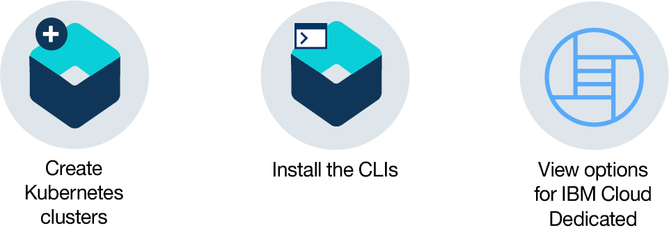

---

copyright:
  years: 2014, 2018
lastupdated: "2018-07-10"

---

{:new_window: target="_blank"}
{:shortdesc: .shortdesc}
{:screen: .screen}
{:pre: .pre}
{:table: .aria-labeledby="caption"}
{:codeblock: .codeblock}
{:tip: .tip}
{:download: .download}

# Getting started with {{site.data.keyword.containerlong_notm}}
{: #container_index}

Hit the ground running with {{site.data.keyword.containerlong}} by deploying highly available apps in Docker containers that run in Kubernetes clusters.
{:shortdesc}

Containers are a standard way to package apps and all their dependencies so that you can seamlessly move the apps between environments. Unlike virtual machines, containers do not bundle the operating system. Only the app code, run time, system tools, libraries, and settings are packaged inside containers. Containers are more lightweight, portable, and efficient than virtual machines.

Click an option to get started:

<map name="home_map" id="home_map">
<area href="#clusters" alt="Getting started with Kubernetes clusters in {{site.data.keyword.Bluemix_notm}}" title="Getting started with Kubernetes clusters in {{site.data.keyword.Bluemix_notm}}" shape="rect" coords="-7, -8, 108, 211" />
<area href="cs_cli_install.html" alt="Install the CLIs." title="Install the CLIs." shape="rect" coords="155, -1, 289, 210" />
<area href="cs_dedicated.html#dedicated_environment" alt="{{site.data.keyword.Bluemix_dedicated_notm}} cloud environment" title="{{site.data.keyword.Bluemix_notm}} cloud environment" shape="rect" coords="326, -10, 448, 218" />
</map>

## Getting started with clusters
{: #clusters}

So you want to deploy an app in a container? Hold on! Start by creating a Kubernetes cluster first. Kubernetes is an orchestration tool for containers. With Kubernetes, developers can deploy highly available apps in a flash by using the power and flexibility of clusters.
{:shortdesc}

And what is a cluster? A cluster is a set of resources, worker nodes, networks, and storage devices that keep apps highly available. After you have your cluster, then you can deploy your apps in containers.

**Before you begin**

Get the [{{site.data.keyword.Bluemix_notm}} account](https://console.bluemix.net/registration/) type that is right for you:
* **Pay-As-You-Go or Subscription**: You can create a free trial cluster. You can also provision IBM Cloud infrastructure (SoftLayer) resources to create and use in standard clusters.
* **Lite**: You cannot create a free or standard cluster. [Upgrade your account](/docs/account/account_faq.html#changeacct) to Pay-As-You-Go or Subscription.
* **Trial (for educational purposes)**: You can create one free cluster that you can use for 30 days to get familiar with the service.

To create a free cluster:

1.  In the [{{site.data.keyword.Bluemix_notm}} **Catalog** ](https://console.bluemix.net/catalog/?category=containers), select **{{site.data.keyword.containershort_notm}}** and click **Create**. A cluster configuration page opens. By default, **Free cluster** is selected.

2. Give your cluster a unique name.

3.  Click **Create Cluster**. A worker node is created that can take a few minutes to provision, but you can see the progress in the **Worker nodes** tab. When the status reaches `Ready` you can start working with your cluster!

Good work! You created your first Kubernetes cluster. Here are some details about your free cluster:

*   **Machine Type**: The free cluster has one virtual worker node with 2 CPU and 4 GB memory available for your apps to use. When you create a standard cluster, you can choose between physical (bare metal) or virtual machines, along with various machine sizes.
*   **Managed Master**: The worker node is centrally monitored and managed by a dedicated and highly available {{site.data.keyword.IBM_notm}}-owned Kubernetes master that controls and monitors all of the Kubernetes resources in the cluster. You can focus on your worker node and the apps that are deployed in the worker node without worrying about managing this master too.
*   **Infrastructure Resources**: The resources that are required to run the cluster, such as VLANS and IP addresses, are managed in an {{site.data.keyword.IBM_notm}}-owned IBM Cloud infrastructure (SoftLayer) account. When you create a standard cluster, you manage these resources in your own IBM Cloud infrastructure (SoftLayer) account. You can learn more about these resources and the [permissions needed](cs_users.html#infra_access) when you create a standard cluster.
*   **Other Options**: Free clusters are deployed within the region that you select, but you cannot choose which location (data center). For control over location, networking, and persistent storage, create a standard cluster. [Learn more about the benefits of free and standard clusters](cs_why.html#cluster_types).

**What's next?**
Try out some things with your free cluster before it expires.

* [Install the CLIs to start working with your cluster.](cs_cli_install.html#cs_cli_install)
* [Deploy an app in your cluster.](cs_app.html#app_cli)
* [Create a standard cluster with multiple nodes for higher availability.](cs_clusters.html#clusters_ui)
* [Set up a private registry in {{site.data.keyword.Bluemix_notm}} to store and share Docker images with other users.](/docs/services/Registry/index.html)
