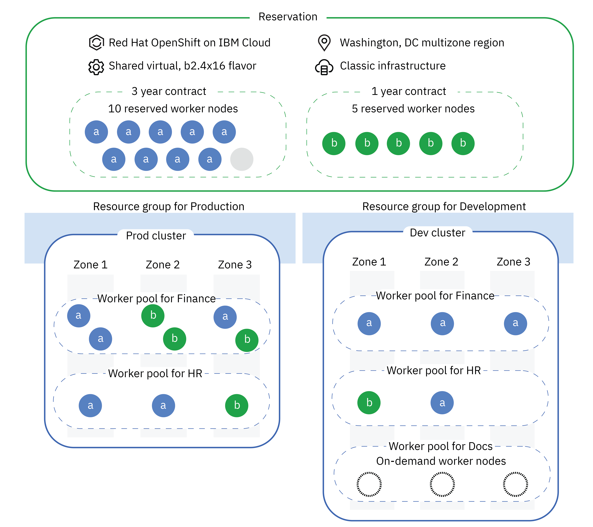

---

copyright: 
  years: 2014, 2022
lastupdated: "2022-11-23"

keywords: kubernetes

subcollection: containers

---

{{site.data.keyword.attribute-definition-list}}

# Using reservations to reduce classic worker node costs
{: #reservations}

When you have consistent computing needs over time of at least one year, create a reservation to reduce the costs of worker nodes in your {{site.data.keyword.containerlong}} clusters. With a reservation, you reserve virtual worker node instances in a contract for a fixed, predictable, and lower price than on demand instances.
{: shortdesc}

Reservations are available only for classic infrastructure worker nodes in multizone regions (MZRs). Also note that you can't enable the cluster autoscaler add-on on worker pools that use reservations.
{: important}

## Understanding reservations
{: #ri-about}

A reservation is a type of {{site.data.keyword.cloud_notm}} resource that you set up to describe the flavor, location, and other details of worker nodes that you want to purchase. Then, you create contracts for the reservation, which are agreements to pay a certain amount each month for a certain number of worker nodes for 1 or 3 year terms.
{: shortdesc}

Review the following diagram for an example scenario of how you might set up your reservation and contracts to use across clusters.

{: caption="Figure 1. An example scenario of using a reservation for worker nodes in your clusters." caption-side="bottom"}

**Reservation**: The reservation contains details such as the container platform, worker node flavor, location, and infrastructure provider.

**Contract**: The example reservation has two contracts for different terms. One contract is for 10 worker nodes across 3 years. The other contract is for 5 worker nodes across 1 year. Therefore, the total capacity of the reservation is 15 worker nodes.

**Clusters**: Each cluster is in the same multizone region as the reservation, but can be in a different resource group. Reserved worker nodes from different reservations can be used in different clusters. A cluster can have a mix of reserved and on demand worker pools.

**Worker pools**: You can create multiple worker pools in multiple clusters with your reserved worker nodes. Reserved worker nodes are used for the entire worker pool; you can't mix and match between on demand and reserved worker nodes in the same worker pool. Reserved worker nodes are used on a first-available basis, which means if you provision a worker pool that uses all your reserved worker nodes, you have no more reserved worker nodes left for other worker pools. Therefore, you might create separate reservations for each team that owns a worker pool or cluster.

**Zones**: Because the reservation is created in an {{site.data.keyword.cloud_notm}} multizone region, the reserved worker nodes can be used for clusters in any of the zones. For example, reservations in Washington, DC (US East region) can be used to create classic worker nodes in `wdc04`, `wdc06`, or `wdc07`.

**Reserved worker nodes that are used in the worker pools**: In this scenario, the development and production environments share a reservation that has a mix of contracts that are used for a mix of worker pools and teams. The reservation still has one unused, 3-year term reserved worker node that can be used for other worker pools or to scale up the existing worker pools. If the production environment needs more than one more worker node, you might resize down some worker pools in development, create a worker pool that uses on demand worker nodes, or add more contracts to the reservation. If you are concerned about a development environment using up your production environment resources, consider creating separate reservations for the different environments.

### Reservation usage and lifecycle
{: #ri-usage-lifecycle}

How can I use my reservation?
:   You can use your reservation to create worker pools in new or existing clusters. Your reservation is account-wide, so you can use the reserved worker nodes in different clusters, worker pools, and even resource groups. However, because prices vary by zone, you can't use reserved worker nodes across different metros or multizone regions. You also can't used reserved instances from other {{site.data.keyword.cloud_notm}} infrastructure services, such as virtual server instances, for your worker nodes, but must use the {{site.data.keyword.containerlong_notm}} reservations.

Does a reservation guarantee computing capacity in a zone?
:   Reserving worker nodes does not guarantee compute capacity whenever you want to create a worker pool. Instead, you reserve a certain number of worker nodes for a term so that you lock in the discounted price that is associated with the reservation.

How do I know how many reserved worker nodes I need?
:   See [Sizing your Kubernetes cluster to support your workload](/docs/containers?topic=containers-strategy#sizing).

What kind of workloads are best suited for reservations?
:   The following workloads are good candidates to run on reserved worker nodes:
    *   Production workloads
    *   Mission-critical workloads that must run 24/7
    *   Predictable workloads that have continuous usage and steady states
    *   Workloads that you want to increase high availability for by creating replicas in different zones and regions

Can I convert existing on demand worker nodes to reserved worker nodes to save money?
:   No. Instead, you can create reservations and contracts for the worker nodes in your clusters. Then, create worker pools in your existing clusters that use the reserved worker nodes. Consider using labels to reschedule your existing workloads to the new reserved worker pools. Then, delete your old, on demand worker pools.

How do reservations impact quotas?
:   By default, {{site.data.keyword.containerlong_notm}} sets a certain quota limit on the number of worker nodes that you can have across all clusters in a region. Contracts that exceed the worker node quota are blocked from creating. You can try a different region or increase the quota. If you need more of the resource, [contact IBM Support](/docs/get-support?topic=get-support-using-avatar). In the support case, include the new quota limit for the region and infrastructure provider that you want. After the quota is increased, you can create a contract.

What happens when my contract ends? Are my worker nodes deleted?
:   When a contract ends, your reservation is checked for extra capacity from other contracts. If you have more worker nodes than capacity, the worker nodes that exceed the reservation's total capacity are deleted.

For example, you might have a reservation with one contract for 10 worker nodes and another contract for 5 worker nodes, for a total capacity of 15 worker nodes. You use 14 of the 15 worker nodes. When the 5-worker node contract expires, your reservation total capacity reduces to 10 worker nodes. Therefore, 4 of your 14 running worker nodes are deleted, to make the number of worker nodes equal to the total capacity of 10 reserved worker nodes.

To avoid an unexpected deletion, scale down your worker pools before the contract ends to the remaining capacity in the reservation. Or, add contracts to your reservation so that you continue to have enough reserved capacity for the worker nodes that you need.
{: important}

### Billing and discounts
{: #ri-about-billing}

How much is the discount? Can I combine reservations with other discounts?
:   The discounts vary by the flavor, location, and term of the contract, but typically users realize a significant cost savings compared to on demand worker nodes.
    * 33% or more for 1 year terms.
    * Up to 50% for 3 year terms.

These discounted reserved worker nodes are in addition to any current account-level discounts that you might have, such as discounts from an {{site.data.keyword.cloud_notm}} subscription account.

How am I billed? How are my discounts applied?
:   When you create a contract, a discounted monthly price for the total number of worker nodes is calculated. Then, this cost is applied for each month in the term. You are billed each month for the discounted cost, regardless of how many worker nodes that you use during the month. Keep in mind that the price of each new contract is fixed at the time that the contract is created for the lifetime of the contract.

Consider the following example. You create a contract on 15 December 2020 for 12 worker nodes for a 1 year term, until 15 December 2021. The total discounted cost for all 12 worker nodes for the entire term is calculated at $12,000. For each full month, you are billed a flat rate of $1,000, regardless of how many worker nodes in the reservation are in use. For the first and last months, you are billed a pro-rated amount, according to the dates that the contract is active in the months.

If I don't need reserved worker nodes anymore, can I modify my contract?
:   No, you can't modify the terms of the contract, such as the duration, number of worker nodes, or flavor. You can remove any unneeded worker nodes from your clusters, but you can't get a refund for unused capacity in your reservation.

## Creating a reservation
{: #ri-create}

Create a reservation that you can use to provision worker nodes at a reduced cost by committing to a 1 or 3 year term.
{: shortdesc}

Before you begin, make sure that you have the [**Administrator** platform access role for the service in {{site.data.keyword.cloud_notm}} IAM](/docs/containers?topic=containers-users#checking-perms).

1. Log in to the [{{site.data.keyword.containerlong_notm}} reservations console](https://cloud.ibm.com/kubernetes/reservations){: external}.
2. Click **Create reservation**.
3. Select the **Infrastructure** provider to use for your worker nodes.
4. Select the **Location** for your reservation. Keep in mind that you can't change the location later.
    * **Geography**: The geographic area to filter locations by.
    * **Availability**: Choose single zone or multizone. For multizone areas, you select specific zones for your worker nodes when you create the worker pool.
    * **Metro**: The metro for the location.
5. Configure the **Worker nodes** for your reservation.
    * Click **Change flavor** to edit the CPU, memory, and other operating systems details of the worker nodes. Keep in mind that you can't change the flavor for the reservation later.
    * Enter the **Number of worker nodes** to create a contract for the initial reservation. You can add contracts for additional worker nodes later.
6. Fill out the **Reservation details**. For more information about the discounts, see [Billing and discounts](#ri-about-billing).
    * **Contract length**: Choose between 1 or 3 years for the initial contract duration. You can add contracts for additional durations later.
    * **Start date**: Choose the date that the contract and billing begin, at 00:00 UTC regardless of your time zone. The contract ends 1 or 3 years after the date that you select, such as 15 December 2020 - 15 December 2021. You can select a future date, but you can't create worker nodes that use the reservation until that date begins.
    * **Reservation name**: Give your reservation a name. This name is used to generate names for all the associated contracts, which appear in your billing and usage reports. Consider including brief details on the location and flavor to help when selecting the reservation to create worker pools later.
7. In the **Summary** pane, review the order summary and then click **Create**. Your reservation is created with the initial contract for worker nodes.
8. **Optional**: To add more capacity to your reservation, you can create more contracts.
    1. From the [{{site.data.keyword.containerlong_notm}} reservations console](https://cloud.ibm.com/kubernetes/reservations){: external}, click your reservation.
    2. In the **Contracts** section, click **Add+**.
    3. Select the **Number of worker nodes**, **Contract length**, and **Start date** for the contract.
    4. In the **Summary** pane, review the order summary and then click **Create**. Your contract is added to the reservation and becomes available to use to provision worker nodes on the start date.

Your reservation is created! Now, [use your reservation to provision worker nodes in your cluster](#ri-use) or [review your reservation usage](#ri-usage-lifecycle).

## Using a reservation in a cluster
{: #ri-use}

When you create a worker pool in a cluster, you can choose to use your reservation to provision the worker nodes. You can use the same reservation for multiple clusters and worker pools in the same location as the reservation.
{: shortdesc}

If you don't have enough capacity in your reservation to complete a worker pool action, such as creating, resizing, rebalancing, or adding a zone, the action is blocked. Instead, add a contract for more worker nodes to your reservation. Or, remove or scale down existing worker pools to add these worker nodes back to your reservation. You might also create the worker pool with on demand worker nodes.
{: note}

Before you begin:
* In {{site.data.keyword.cloud_notm}} IAM, make sure that you have the **Operator** platform access role for **Kubernetes Service** for the cluster to create worker pools.
* [Create](/docs/containers?topic=containers-cluster-create-classic) or have an existing a classic cluster in the **same metro** as the reservation that you want to use. If you want to use worker nodes only from a reservation, you can create a cluster with zero worker nodes, or remove existing, on demand worker pools from a cluster.

To use the reservation:
1. Log in to the [Kubernetes clusters console](https://cloud.ibm.com/kubernetes/clusters){: external}.
2. Select the cluster that you want to use.
3. From the cluster menu, select **Worker pools**.
4. Click **Add+**.
5. Fill out the worker pool details.
    1. Enter the **Worker pool name**.
    2. Select the **Reservation** that you want to use. Keep in mind that the reservation affects the flavor and number of worker nodes that you can provision in this worker pool.
    3. Select the **Worker zones** and review the VLAN information.
    4. For the **Worker nodes**, increase or decrease the number of worker nodes that you want to create per zone. You can review the percentage of your reservation that creating the worker pool uses. You can't create a worker pool with more worker nodes than you have in your reservation. To use worker nodes from another reservation, create a different worker pool.
6. In the **Summary** pane, notice that your estimated cost is zero, because your worker pool order uses the reservation. To complete the order, click **Create**.

## Reviewing reservation usage
{: #ri-review}

You can review your {{site.data.keyword.containerlong_notm}} reservation usage and billing details.
{: shortdesc}

Before you begin, make sure that you have the following roles in {{site.data.keyword.cloud_notm}} IAM.
* **Viewer** platform access role for **Kubernetes Service** to view reservation usage details.
* **Viewer** platform access role for **Account Management > Billing** service to view billing details.

**Reservation usage**:
1. Log in to the [{{site.data.keyword.containerlong_notm}} reservations console](https://cloud.ibm.com/kubernetes/reservations){: external}.
2. Review the **Usage** column to see how many worker nodes of the total amount are in use, such as `1 of 3 worker nodes`.
3. Review the **Clusters** column to see how many clusters have worker nodes that use the reservation.

**Billing details**:
1. Log in to the [{{site.data.keyword.cloud_notm}} billing console](https://cloud.ibm.com/billing){: external}.
2. From the navigation menu, click **Usage**.
3. From the **Services** table, find the **Kubernetes Service** row and click **View plans**.
4. From the plans table, find the row for your reservation name and click **View details**.
5. Review the details for the reserved worker nodes that are associated with the contracts of your reservation.

