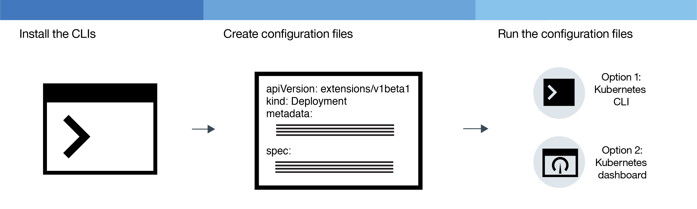

---

copyright:
  years: 2014, 2018
lastupdated: "2018-01-11"

---

{:new_window: target="_blank"}
{:shortdesc: .shortdesc}
{:screen: .screen}
{:pre: .pre}
{:table: .aria-labeledby="caption"}
{:codeblock: .codeblock}
{:tip: .tip}
{:download: .download}


# Deploying apps in clusters
{: #app}

You can use Kubernetes techniques to deploy apps and to ensure your apps are up and running at all times. For example, you can perform rolling updates and rollbacks without downtime for your users.
{:shortdesc}

Learn the general steps for deploying apps by clicking an area of the following image.


<map name="d62e18" id="d62e18">
<area href="cs_cli_install.html" target="_blank" alt="Install the CLIs." title="Install the CLIs." shape="rect" coords="30, 69, 179, 209" />
<area href="https://kubernetes.io/docs/concepts/configuration/overview/" target="_blank" alt="Create a configuration file for your app. Review the best practices from Kubernetes." title="Create a configuration file for your app. Review the best practices from Kubernetes." shape="rect" coords="254, 64, 486, 231" />
<area href="#app_cli" target="_blank" alt="Option 1: Run configuration files from the Kubernetes CLI." title="Option 1: Run configuration files from the Kubernetes CLI." shape="rect" coords="544, 67, 730, 124" />
<area href="#cli_dashboard" target="_blank" alt="Option 2: Start the Kubernetes dashboard locally and run configuration files." title="Option 2: Start the Kubernetes dashboard locally and run configuration files." shape="rect" coords="544, 141, 728, 204" />
</map>


<br />


## Planning highly available deployments
{: #highly_available_apps}

The more widely you distribute your setup across multiple worker nodes and clusters, the less likely your users are to experience downtime with your app.

Review the following potential app setups that are ordered with increasing degrees of availability.
{:shortdesc}


1.  A deployment with n+2 pods that are managed by a replica set.
2.  A deployment with n+2 pods that are managed by a replica set and spread across multiple nodes (anti-affinity) in the same location.
3.  A deployment with n+2 pods that are managed by a replica set and spread across multiple nodes (anti-affinity) in different locations.
4.  A deployment with n+2 pods that are managed by a replica set and spread across multiple nodes (anti-affinity) in different regions.

Learn more about the techniques to increase the availability of your app:

<dl>
<dt>Use deployments and replica sets to deploy your app and its dependencies</dt>
<dd>A deployment is a Kubernetes resource that you can use to declare all components of your app and its dependencies. By describing the single components rather than writing down all necessary steps and the order to create them, you can concentrate on how your app should look like when it is running.
</br></br>
When you deploy more than one pod, a replica set is automatically created for your deployments that monitors the pods and assures that the desired number of pods is up and running at all times. When a pod goes down, the replica set replaces the unresponsive pod with a new one.
</br></br>
You can use a deployment to define update strategies for your app including the number of pods that you want to add during a rolling update and the number of pods that can be unavailable at a time. When you perform a rolling update, the deployment checks whether or not the revision is working and stops the rollout when failures are detected.
</br></br>
Deployments also provide the possibility to concurrently deploy multiple revisions with different flags, so you can for example test a deployment first before you decide to push it to production.
</br></br>
Every deployment keeps track of the revisions that were deployed. You can use this history of revisions to roll back to a previous version when you encounter that your updates are not working as expected.</dd>
<dt>Include enough replicas for your app's workload, plus two</dt>
<dd>To make your app even more highly available and more resilient to failure, consider including extra replicas than the minimum to handle the expected workload. Extra replicas can handle the workload in case a pod crashes and the replica set has not yet recovered the crashed pod. For protection against two simultaneous failures, include two extra replicas. This set up is an N+2 pattern, where N is the number of replicas to handle incoming workload and +2 is an extra two replicas. You can have as many pods as you want in a cluster, as long as the cluster has enough space for them.</dd>
<dt>Spread pods across multiple nodes (anti-affinity)</dt>
<dd>When you create your deployment, each pod might be deployed to the same worker node. This setup where pods exist on the same worker node is known as affinity or co-location. To protect your app from a worker node failure, you can enforce your deployment to spread the pods across multiple worker nodes by using the <strong>podAntiAffinity</strong> option. This option is available for standard clusters only.

</br></br>
<strong>Note:</strong> The following YAML file enforces that every pod is deployed to a different worker node. When you have more replicas defined than you have available worker nodes in your cluster, only the number of replicas is deployed that can fulfill the anti-affinity requirement. Any additional replicas remain in a pending state until additional worker nodes are added to the cluster.

<pre class="codeblock">
<code>apiVersion: extensions/v1beta1
kind: Deployment
metadata:
  name: wasliberty
spec:
  replicas: 3
  template:
    metadata:
      labels:
        app: wasliberty
    spec:
      affinity:
        podAntiAffinity:
          preferredDuringSchedulingIgnoredDuringExecution:
          - weight: 100
            podAffinityTerm:
              labelSelector:
                matchExpressions:
                - key: app
                  operator: In
                  values:
                  - wasliberty
              topologyKey: kubernetes.io/hostname
      containers:
      - name: wasliberty
        image: registry.&lt;region&gt;.bluemix.net/ibmliberty
        ports:
        - containerPort: 9080
---
apiVersion: v1
kind: Service
metadata:
  name: wasliberty
  labels:
    app: wasliberty
spec:
  ports:
    # the port that this service should serve on
  - port: 9080
  selector:
    app: wasliberty
  type: NodePort</code></pre>

</dd>
<dt>Distribute pods across multiple locations or regions</dt>
<dd>To protect your app from a location or region failure, you can create a second cluster in another location or region and use a deployment YAML to deploy a duplicate replica set for your app. By adding a shared route and load balancer in front of your clusters, you can spread your work load across locations and regions. For more information about sharing a route between clusters, see <a href="cs_clusters.html#clusters" target="_blank">High availability of clusters</a>.

For more detail, review the options for <a href="cs_clusters.html#planning_clusters" target="_blank">highly available deployments</a>.</dd>
</dl>


### Minimal app deployment
{: #minimal_app_deployment}

A basic app deployment in a lite or standard cluster might include the following components.
{:shortdesc}


To deploy the components for a minimal app as depicted in the diagram, you use a configuration file similar to the following example:
```
apiVersion: extensions/v1beta1
kind: Deployment
metadata:
  name: ibmliberty
spec:
  replicas: 1
  template:
    metadata:
      labels:
        app: ibmliberty
    spec:
      containers:
      - name: ibmliberty
        image: registry.<region>.bluemix.net/ibmliberty:latest
---
apiVersion: v1
kind: Service
metadata:
  name: ibmliberty-service
  labels:
    app: ibmliberty
spec:
  selector:
    run: ibmliberty
  type: NodePort
  ports:
   - protocol: TCP
     port: 9080
```
{: codeblock}

To learn more about each component, review the [Kubernetes basics](cs_tech.html#kubernetes_basics).

<br />


## Launching the Kubernetes dashboard
{: #cli_dashboard}

Open a Kubernetes dashboard on your local system to view information about a cluster and its worker nodes.
{:shortdesc}

Before you begin, [target your CLI](cs_cli_install.html#cs_cli_configure) to your cluster. This task requires the [Administrator access policy](cs_users.html#access_policies). Verify your current [access policy](cs_users.html#infra_access).

You can use the default port or set your own port to launch the Kubernetes dashboard for a cluster.

1.  For clusters with a Kubernetes master version of 1.7.4 or earlier:

    1.  Set the proxy with the default port number.

        ```
        kubectl proxy
        ```
        {: pre}

        Output:

        ```
        Starting to serve on 127.0.0.1:8001
        ```
        {: screen}

    2.  Open the Kubernetes dashboard in a web browser.

        ```
        http://localhost:8001/ui
        ```
        {: codeblock}

2.  For clusters with a Kubernetes master version of 1.8.2 or later:

    1.  Get your credentials for Kubernetes.

        ```
        kubectl config view -o jsonpath='{.users[0].user.auth-provider.config.id-token}'
        ```
        {: pre}

    2.  Copy the **id-token** value that is shown in the output.

    3.  Set the proxy with the default port number.

        ```
        kubectl proxy
        ```
        {: pre}

        Example output:

        ```
        Starting to serve on 127.0.0.1:8001
        ```
        {: screen}

    4.  Sign in to the dashboard.

        1.  In your browser, navigate to the following URL:

            ```
            http://localhost:8001/api/v1/namespaces/kube-system/services/https:kubernetes-dashboard:/proxy/
            ```
            {: codeblock}

        2.  In the sign-on page, select the **Token** authentication method.

        3.  Then, paste the **id-token** value that you previously copied into the **Token** field and click **SIGN IN**.

[Next, you can run a configuration file from the dashboard.](#app_ui)

When you are done with the Kubernetes dashboard, use `CTRL+C` to exit the `proxy` command. After you exit, the Kubernetes dashboard is no longer available. Run the `proxy` command to restart the Kubernetes dashboard.


<br />


## Creating secrets
{: #secrets}

Kubernetes secrets are a secure way to store confidential information, such as user names, passwords, or keys.
{:shortdesc}

<table>
<caption>Table. Files needed to be stored in secrets by task</caption>
<thead>
<th>Task</th>
<th>Required files to store in secrets</th>
</thead>
<tbody>
<tr>
<td>Add a service to a cluster</td>
<td>None. A secret is created for you when you bind a service to a cluster.</td>
</tr>
<tr>
<td>Optional: Configure the Ingress service with TLS, if you are not using ingress-secret. <p><b>Note</b>: TLS is already enabled by default and a secret is created already for the TLS Connection.

To view the default TLS secret:
<pre>
bx cs cluster-get &gt;CLUSTER-NAME&lt; | grep "Ingress secret"
</pre>
</p>
To create your own instead, complete the steps in this topic.</td>
<td>Server cert and key: <code>server.crt</code> and <code>server.key</code></td>
<tr>
<td>Create the mutual-authentication annotation.</td>
<td>CA cert: <code>ca.crt</code></td>
</tr>
</tbody>
</table>

For more information on what you can store in secrets, see the [Kubernetes documentation](https://kubernetes.io/docs/concepts/configuration/secret/).


To create a secret with a certificate:

1. Generate the certificate authority (CA) cert and key from your certificate provider. If you have your own domain, purchase an official TLS certificate for your domain. For test purposes, you can generate a self-signed certificate.

 Important: Make sure the [CN](https://support.dnsimple.com/articles/what-is-common-name/) is different for each certificate.

 The client cert and client key must be verified up to the trusted root certificate, which in this case, is the CA cert. Example:

 ```
 Client Certificate: issued by Intermediate Certificate
 Intermediate Certificate: issued by Root Certificate
 Root Certificate: issued by itself
 ```
 {: codeblock}

2. Create the certificate as a Kubernetes secret.

   ```
   kubectl create secret generic <secretName> --from-file=<cert_file>=<cert_file>
   ```
   {: pre}

   Examples:
   - TLS connection:

     ```
     kubectl create secret tls <secretName> --from-file=tls.crt=server.crt --from-file=tls.key=server.key
     ```
     {: pre}

   - Mutual authentication annotation:

     ```
     kubectl create secret generic <secretName> --from-file=ca.crt=ca.crt
     ```
     {: pre}

<br />


## Deploying apps with the GUI
{: #app_ui}

When you deploy an app to your cluster by using the Kubernetes dashboard, a deployment resource is automatically created that creates, updates, and manages the pods in your cluster.
{:shortdesc}

Before you begin:

-   Install the required [CLIs](cs_cli_install.html#cs_cli_install).
-   [Target your CLI](cs_cli_install.html#cs_cli_configure) to your cluster.

To deploy your app:

1.  [Open the Kubernetes dashboard](#cli_dashboard).
2.  From the Kubernetes dashboard, click **+ Create**.
3.  Select **Specify app details below** to enter the app details on the GUI or **Upload a YAML or JSON file** to upload your app [configuration file ](https://kubernetes.io/docs/tasks/inject-data-application/define-environment-variable-container/). Use [this example YAML file ](https://github.com/IBM-Bluemix/kube-samples/blob/master/deploy-apps-clusters/deploy-ibmliberty.yaml) to deploy a container from the **ibmliberty** image in the US-South region.
4.  In the Kubernetes dashboard, click **Deployments** to verify that the deployment was created.
5.  If you made your app publicly available by using a node port service, a load balancer service, or Ingress, verify that you can access the app.

<br />


## Deploying apps with the CLI
{: #app_cli}

After a cluster is created, you can deploy an app into that cluster by using the Kubernetes CLI.
{:shortdesc}

Before you begin:

-   Install the required [CLIs](cs_cli_install.html#cs_cli_install).
-   [Target your CLI](cs_cli_install.html#cs_cli_configure) to your cluster.

To deploy your app:

1.  Create a configuration file based on [Kubernetes best practices ](https://kubernetes.io/docs/concepts/configuration/overview/). Generally, a configuration file contains configuration details for each of the resources you are creating in Kubernetes. Your script might include one or more of the following sections:

    -   [Deployment ](https://kubernetes.io/docs/concepts/workloads/controllers/deployment/): Defines the creation of pods and replica sets. A pod includes an individual containerized app and replica sets control multiple instances of pods.

    -   [Service ](https://kubernetes.io/docs/concepts/services-networking/service/): Provides front-end access to pods by using a worker node or load balancer public IP address, or a public Ingress route.

    -   [Ingress ](https://kubernetes.io/docs/concepts/services-networking/ingress/): Specifies a type of load balancer that provides routes to access your app publicly.

2.  Run the configuration file in a cluster's context.

    ```
    kubectl apply -f deployment_script_location
    ```
    {: pre}

3.  If you made your app publicly available by using a node port service, a load balancer service, or Ingress, verify that you can access the app.

<br />


## Scaling apps
{: #app_scaling}

Deploy cloud applications that respond to changes in demand for your applications and that use resources only when needed. Autoscaling automatically increases or decreases the number of instances of your apps based on CPU.
{:shortdesc}

Before you begin, [target your CLI](cs_cli_install.html#cs_cli_configure) to your cluster.

**Note:** Are you looking for information about scaling Cloud Foundry applications? Check out [IBM Auto-Scaling for {{site.data.keyword.Bluemix_notm}}](/docs/services/Auto-Scaling/index.html).

With Kubernetes, you can enable [Horizontal Pod Autoscaling ](https://kubernetes.io/docs/reference/generated/kubectl/kubectl-commands#autoscale) to scale your apps based on CPU.

1.  Deploy your app to your cluster from the CLI. When you deploy your app, you must request CPU.

    ```
    kubectl run <name> --image=<image> --requests=cpu=<cpu> --expose --port=<port_number>
    ```
    {: pre}

    <table>
    <thead>
    <th colspan=2> Understanding this command&apos;s components</th>
    </thead>
    <tbody>
    <tr>
    <td><code>--image</code></td>
    <td>The application that you want to deploy.</td>
    </tr>
    <tr>
    <td><code>--request=cpu</code></td>
    <td>The required CPU for the container, which is specified in milli-cores. As an example, <code>--requests=200m</code>.</td>
    </tr>
    <tr>
    <td><code>--expose</code></td>
    <td>When true, creates an external service.</td>
    </tr>
    <tr>
    <td><code>--port</code></td>
    <td>The port where your app is available externally.</td>
    </tr></tbody></table>

    **Note:** For more complex deployments, you might need to create a [configuration file](#app_cli).
2.  Create a Horizontal Pod Autoscaler and define your policy. For more information about working with the `kubectl autoscale` command, see [the Kubernetes documentation ](https://kubernetes.io/docs/reference/generated/kubectl/kubectl-commands#autoscale).

    ```
    kubectl autoscale deployment <deployment_name> --cpu-percent=<percentage> --min=<min_value> --max=<max_value>
    ```
    {: pre}

    <table>
    <thead>
    <th colspan=2> Understanding this command&apos;s components</th>
    </thead>
    <tbody>
    <tr>
    <td><code>--cpu-percent</code></td>
    <td>The average CPU utilization that is maintained by the Horizontal Pod Autoscaler, which is specified as a percentage.</td>
    </tr>
    <tr>
    <td><code>--min</code></td>
    <td>The minimum number of deployed pods that are used to maintain the specified CPU utilization percentage.</td>
    </tr>
    <tr>
    <td><code>--max</code></td>
    <td>The maximum number of deployed pods that are used to maintain the specified CPU utilization percentage.</td>
    </tr>
    </tbody></table>


<br />


## Managing rolling deployments
{: #app_rolling}

You can manage the rollout of your changes in an automated and controlled fashion. If your rollout isn't going according to plan, you can roll back your deployment to the previous revision.
{:shortdesc}

Before you begin, create a [deployment](#app_cli).

1.  [Roll out ](https://kubernetes.io/docs/reference/generated/kubectl/kubectl-commands#rollout) a change. For example, you might want to change the image that you used in your initial deployment.

    1.  Get the deployment name.

        ```
        kubectl get deployments
        ```
        {: pre}

    2.  Get the pod name.

        ```
        kubectl get pods
        ```
        {: pre}

    3.  Get the name of the container that is running in the pod.

        ```
        kubectl describe pod <pod_name>
        ```
        {: pre}

    4.  Set the new image for the deployment to use.

        ```
        kubectl set image deployment/<deployment_name><container_name>=<image_name>
        ```
        {: pre}

    When you run the commands, the change is immediately applied and logged in the roll-out history.

2.  Check the status of your deployment.

    ```
    kubectl rollout status deployments/<deployment_name>
    ```
    {: pre}

3.  Roll back a change.
    1.  View the roll-out history for the deployment and identify the revision number of your last deployment.

        ```
        kubectl rollout history deployment/<deployment_name>
        ```
        {: pre}

        **Tip:** To see the details for a specific revision, include the revision number.

        ```
        kubectl rollout history deployment/<deployment_name> --revision=<number>
        ```
        {: pre}

    2.  Roll back to the previous version, or specify a revision. To roll back to the previous version, use the following command.

        ```
        kubectl rollout undo deployment/<depoyment_name> --to-revision=<number>
        ```
        {: pre}

<br />

