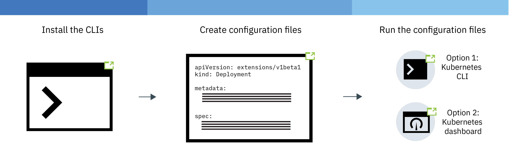

---

copyright:
  years: 2014, 2022
lastupdated: "2022-11-22"

keywords: kubernetes

subcollection: containers

---

{{site.data.keyword.attribute-definition-list}}


# Deploying Kubernetes-native apps in clusters
{: #deploy_app}

You can use Kubernetes techniques in {{site.data.keyword.containerlong}} to deploy apps in containers and ensure that those apps are up and running. For example, you can perform rolling updates and rollbacks without downtime for your users.
{: shortdesc}

For more information about creating a configuration file for your application, see [Configuration Best Practices](https://kubernetes.io/docs/concepts/configuration/overview/){: external}.

Try out the [deploying apps tutorial](/docs/containers?topic=containers-tutorial-starterkit-kube).
{: tip}

{: caption="Figure 1. Basic deployment process" caption-side="bottom"}

## Launching the Kubernetes dashboard
{: #cli_dashboard}

Open a Kubernetes dashboard on your local system to view information about a cluster and its worker nodes. [In the {{site.data.keyword.cloud_notm}} console](#db_gui), you can access the dashboard with a convenient one-click button. [With the CLI](#db_cli), you can access the dashboard or use the steps in an automation process such as for a CI/CD pipeline.
{: shortdesc}

Do you have so many resources and users in your cluster that the Kubernetes dashboard is a little slow? Your cluster admin can scale the `kubernetes-dashboard` deployment by running `kubectl -n kube-system scale deploy kubernetes-dashboard --replicas=3`.
{: tip}

To check the logs for individual app pods, you can run `kubectl logs <pod name>`. Do not use the Kubernetes dashboard to stream logs for your pods, which might cause a disruption in your access to the Kubernetes dashboard.
{: important}

Before you begin
- Make sure that you are assigned a [service access role](/docs/containers?topic=containers-users#checking-perms) that grants the appropriate Kubernetes RBAC role so that you can work with Kubernetes resources.
- To [launch the Kubernetes dashboard from the console](#db_gui), you must be assigned a [platform access role](/docs/containers?topic=containers-users#checking-perms). If you are assigned only a service access role but no platform access role, [launch the Kubernetes dashboard from the CLI](#db_cli).
- [Log in to your account. If applicable, target the appropriate resource group. Set the context for your cluster.](/docs/containers?topic=containers-cs_cli_install#cs_cli_configure)

You can use the default port or set your own port to launch the Kubernetes dashboard for a cluster.

### Launching the Kubernetes dashboard from the {{site.data.keyword.cloud_notm}} console
{: #db_gui}

1. Log in to the [{{site.data.keyword.cloud_notm}} console](https://cloud.ibm.com/).
2. From the menu bar, select the account that you want to use.
3. From the menu , click **Kubernetes**.
4. On the **Clusters** page, click the cluster that you want to access.
5. From the cluster detail page, click the **Kubernetes Dashboard** button.


### Launching the Kubernetes dashboard from the CLI
{: #db_cli}

Before you begin, [install the CLI](/docs/containers?topic=containers-cs_cli_install).

1. Get your credentials for Kubernetes.

    ```sh
    kubectl config view -o jsonpath='{.users[0].user.auth-provider.config.id-token}'
    ```
    {: pre}

2. Copy the **id-token** value that is shown in the output.

3. Set the proxy with the default port number.

    ```sh
    kubectl proxy
    ```
    {: pre}

    Example output

    ```sh
    Starting to serve on 127.0.0.1:8001
    ```
    {: screen}

4. Sign in to the dashboard.

    1. In your browser, navigate to the following URL:

        ```sh
        http://localhost:8001/api/v1/namespaces/kube-system/services/https:kubernetes-dashboard:/proxy/
        ```
        {: codeblock}

    2. In the sign-on page, select the **Token** authentication method.

    3. Then, paste the **id-token** value that you previously copied into the **Token** field and click **SIGN IN**.

When you are done with the Kubernetes dashboard, use `CTRL+C` to exit the `proxy` command. After you exit, the Kubernetes dashboard is no longer available. Run the `proxy` command to restart the Kubernetes dashboard.

Next, you can [run a configuration file from the dashboard.](#app_ui).


## Deploying apps with the Kubernetes dashboard
{: #app_ui}

When you deploy an app to your cluster by using the Kubernetes dashboard, a deployment resource automatically creates, updates, and manages the pods in your cluster. For more information about using the dashboard, see [the Kubernetes docs](https://kubernetes.io/docs/tasks/access-application-cluster/web-ui-dashboard/){: external}.
{: shortdesc}

Do you have so many resources and users in your cluster that the Kubernetes dashboard is a little slow? Your cluster admin can scale the `kubernetes-dashboard` deployment by running `kubectl -n kube-system scale deploy kubernetes-dashboard --replicas=3`.
{: tip}

Before you begin

- [Install the required CLIs](/docs/containers?topic=containers-cs_cli_install#cs_cli_install).
- [Log in to your account. If applicable, target the appropriate resource group. Set the context for your cluster.](/docs/containers?topic=containers-cs_cli_install#cs_cli_configure)
- Make sure that you are assigned a [service access role](/docs/containers?topic=containers-users#checking-perms) that grants the appropriate Kubernetes RBAC role so that you can work with Kubernetes resources.
- To [launch the Kubernetes dashboard from the console](#db_gui), you must be assigned a [platform access role](/docs/containers?topic=containers-users#checking-perms). If you are assigned only a service access role but no platform access role, [launch the Kubernetes dashboard from the CLI](#db_cli).

To deploy your app,

1. Open the Kubernetes [dashboard](#cli_dashboard) and click **+ Create**.
2. Enter your app details in 1 of 2 ways.
    - Select **Specify app details below** and enter the details.
    - Select **Upload a YAML or JSON file** to upload your app [configuration file](https://kubernetes.io/docs/tasks/inject-data-application/define-environment-variable-container/){: external}.

    Need help with your configuration file? Check out this [example YAML file](https://github.com/IBM-Cloud/kube-samples/blob/master/deploy-apps-clusters/deploy-ibmliberty.yaml){: external}. In this example, a container is deployed from the **ibmliberty** image in the US-South region. Learn more about [securing your personal information](/docs/containers?topic=containers-security#pi) when you work with Kubernetes resources.
    {: tip}

3. Verify that you successfully deployed your app in one of the following ways.
    - In the Kubernetes dashboard, click **Deployments**. A list of successful deployments is displayed.
    - If your app is [publicly available](/docs/containers?topic=containers-cs_network_planning#public_access), navigate to the cluster overview page in your {{site.data.keyword.containerlong}} dashboard. Copy the subdomain, which is located in the cluster summary section and paste it into a browser to view your app.

## Deploying apps with the CLI
{: #app_cli}

After a cluster is created, you can deploy an app into that cluster by using the Kubernetes CLI.
{: shortdesc}

Before you begin

- Install the required [CLIs](/docs/containers?topic=containers-cs_cli_install#cs_cli_install).
- [Log in to your account. If applicable, target the appropriate resource group. Set the context for your cluster.](/docs/containers?topic=containers-cs_cli_install#cs_cli_configure)
- Make sure that you are assigned a [service access role](/docs/containers?topic=containers-users#checking-perms) that grants the appropriate Kubernetes RBAC role so that you can work with Kubernetes resources in the namespace.

To deploy your app,

1. Create a configuration file based on [Kubernetes best practices](https://kubernetes.io/docs/concepts/configuration/overview/){: external}. Generally, a configuration file contains configuration details for each of the resources you are creating in Kubernetes. Your script might include one or more of the following sections:

    - [Deployment](https://kubernetes.io/docs/concepts/workloads/controllers/deployment/){: external}: Defines the creation of pods and replica sets. A pod includes an individual containerized app and replica sets control multiple instances of pods.

    - [Service](https://kubernetes.io/docs/concepts/services-networking/service/){: external}: Provides front-end access to pods by using a worker node or load balancer public IP address, or a public Ingress route.

    - [Ingress](https://kubernetes.io/docs/concepts/services-networking/ingress/){: external}: Specifies a type of load balancer that provides routes to access your app publicly.

    Learn more about [securing your personal information](/docs/containers?topic=containers-security#pi) when you work with Kubernetes resources.

2. Run the configuration file in a cluster's context.

    ```sh
    kubectl apply -f config.yaml
    ```
    {: pre}

3. If you made your app publicly available by using a nodeport service, a load balancer service, or Ingress, verify that you can access the app.

## Deploying apps to specific worker nodes by using labels
{: #node_affinity}

When you deploy an app, the app pods indiscriminately deploy to various worker nodes in your cluster. Sometimes, you might want to restrict the worker nodes that the app pods to deploy to. For example, you might want app pods to deploy to only worker nodes in a certain worker pool because those worker nodes are on bare metal machines. To designate the worker nodes that app pods must deploy to, add an affinity rule to your app deployment.
{: shortdesc}

Before you begin
- [Log in to your account. If applicable, target the appropriate resource group. Set the context for your cluster.](/docs/containers?topic=containers-cs_cli_install#cs_cli_configure)
- Make sure that you are assigned a [service access role](/docs/containers?topic=containers-users#checking-perms) that grants the appropriate Kubernetes RBAC role so that you can work with Kubernetes resources in the Kubernetes namespace.
- **Optional**: [Set a label for the worker pool](/docs/containers?topic=containers-add_workers#worker_pool_labels) that you want to run the app on.

To deploy apps to specific worker nodes,

1. Get the ID of the worker pool that you want to deploy app pods to.
    ```sh
    ibmcloud ks worker-pool ls --cluster <cluster_name_or_ID>
    ```
    {: pre}

2. List the worker nodes that are in the worker pool, and note one of the **Private IP** addresses.
    ```sh
    ibmcloud ks worker ls --cluster <cluster_name_or_ID> --worker-pool <worker_pool_name_or_ID>
    ```
    {: pre}

3. Describe the worker node. In the **Labels** output, note the worker pool ID label, `ibm-cloud.kubernetes.io/worker-pool-id`.

    The steps in this topic use a worker pool ID to deploy app pods only to worker nodes within that worker pool. To deploy app pods to specific worker nodes by using a different label, note this label instead. For example, to deploy app pods only to worker nodes on a specific private VLAN, use the `privateVLAN=` label.
    {: tip}

    ```sh
    kubectl describe node <worker_node_private_IP>
    ```
    {: pre}

    Example output

    ```sh
    NAME:               10.xxx.xx.xxx
    Roles:              <none>
    Labels:             arch=amd64
                        beta.kubernetes.io/arch=amd64
                        beta.kubernetes.io/instance-type=b3c.4x16.encrypted
                        beta.kubernetes.io/os=linux
                        failure-domain.beta.kubernetes.io/region=us-south
                        failure-domain.beta.kubernetes.io/zone=dal10
                        ibm-cloud.kubernetes.io/encrypted-docker-data=true
                        ibm-cloud.kubernetes.io/ha-worker=true
                        ibm-cloud.kubernetes.io/iaas-provider=softlayer
                        ibm-cloud.kubernetes.io/machine-type=b3c.4x16.encrypted
                        ibm-cloud.kubernetes.io/sgx-enabled=false
                        ibm-cloud.kubernetes.io/worker-pool-id=00a11aa1a11aa11a1111a1111aaa11aa-11a11a
                        ibm-cloud.kubernetes.io/worker-version=1.24_1534
                        kubernetes.io/hostname=10.xxx.xx.xxx
                        privateVLAN=1234567
                        publicVLAN=7654321
    Annotations:        node.alpha.kubernetes.io/ttl=0
    ...
    ```
    {: screen}

4. [Add an affinity rule](https://kubernetes.io/docs/concepts/scheduling-eviction/assign-pod-node/){: external} for the worker pool ID label to the app deployment.

    Example YAML

    ```yaml
    apiVersion: apps/v1
    kind: Deployment
    metadata:
      name: with-node-affinity
    spec:
      template:
        spec:
          affinity:
            nodeAffinity:
              requiredDuringSchedulingIgnoredDuringExecution:
                nodeSelectorTerms:
                - matchExpressions:
                  - key: ibm-cloud.kubernetes.io/worker-pool-id
                    operator: In
                    values:
                    - <worker_pool_ID>
    ...
    ```
    {: codeblock}

    In the **affinity** section of the example YAML, `ibm-cloud.kubernetes.io/worker-pool-id` is the `key` and `<worker_pool_ID>` is the `value`.

5. Apply the updated deployment configuration file.
    ```sh
    kubectl apply -f with-node-affinity.yaml
    ```
    {: pre}

6. Verify that the app pods deployed to the correct worker nodes.

    1. List the pods in your cluster.
        ```sh
        kubectl get pods -o wide
        ```
        {: pre}

        Example output
        ```sh
        NAME                   READY     STATUS              RESTARTS   AGE       IP               NODE
        cf-py-d7b7d94db-vp8pq  1/1       Running             0          15d       172.30.xxx.xxx   10.176.48.78
        ```
        {: screen}

    2. In the output, identify a pod for your app. Note the **NODE** private IP address of the worker node that the pod is on.

        In the previous example output, the app pod `cf-py-d7b7d94db-vp8pq` is on a worker node with the IP address `10.xxx.xx.xxx`.

    3. List the worker nodes in the worker pool that you designated in your app deployment.

        ```sh
        ibmcloud ks worker ls --cluster <cluster_name_or_ID> --worker-pool <worker_pool_name_or_ID>
        ```
        {: pre}

        Example output

        ```sh
        ID                                                 Public IP       Private IP     Machine Type      State    Status  Zone    Version
        kube-dal10-crb20b637238bb471f8b4b8b881bbb4962-w7   169.xx.xxx.xxx  10.176.48.78   b3c.4x16          normal   Ready   dal10   1.8.6_1504
        kube-dal10-crb20b637238bb471f8b4b8b881bbb4962-w8   169.xx.xxx.xxx  10.176.48.83   b3c.4x16          normal   Ready   dal10   1.8.6_1504
        kube-dal12-crb20b637238bb471f8b4b8b881bbb4962-w9   169.xx.xxx.xxx  10.176.48.69   b3c.4x16          normal   Ready   dal12   1.8.6_1504
        ```
        {: screen}

        If you created an app affinity rule based on another factor, get that value instead. For example, to verify that the app pod deployed to a worker node on a specific VLAN, view the VLAN that the worker node is on by running `ibmcloud ks worker get --cluster <cluster_name_or_ID> --worker <worker_ID>`.
        {: tip}

    4. In the output, verify that the worker node with the private IP address that you identified in the previous step is deployed in this worker pool.

## Deploying an app on a GPU machine
{: #gpu_app}

If you have a [GPU machine type](/docs/containers?topic=containers-planning_worker_nodes#planning_worker_nodes), you can accelerate the processing time required for compute intensive workloads such as AI, machine learning, inferencing and more.
{: shortdesc}

{{site.data.keyword.vpc_short}} worker nodes with GPUs are available for allowlisted accounts only. To request that your account be allowlisted, see [Requesting access to allowlisted features](/docs/openshift?topic=openshift-get-help). Be sure to include the data centers, the VPC infrastructure profile, and the number of workers that you want use. For example `12 worker nodes in us-east-1 of VPC profile gx2-16x128xv100`.
{: important}

In the following steps, you learn how to deploy workloads that require the GPU. You can also deploy apps that don't need to process their workloads across both the GPU and CPU. 

In the following steps, you learn how to deploy workloads that require the GPU. You can also deploy apps that don't need to process their workloads across both the GPU and CPU. After, you might find it useful to play around with mathematically intensive workloads such as the [TensorFlow](https://www.tensorflow.org/){: external} machine learning framework with [this Kubernetes demo](https://github.com/pachyderm/pachyderm/tree/master/examples/ml/tensorflow){: external}.

Before you begin
- Create a [cluster](/docs/containers?topic=containers-clusters&interface=ui) or [worker pool](/docs/containers?topic=containers-add_workers#add_pool) that uses a GPU bare metal flavor. Keep in mind that setting up a bare metal machine can take more than one business day to complete.
- Make sure that you are assigned a [service access role](/docs/containers?topic=containers-users#checking-perms) that grants the appropriate Kubernetes RBAC role so that you can work with Kubernetes resources in the cluster.
- [Install the NVIDIA GPU operator for your cluster version](https://docs.nvidia.com/datacenter/cloud-native/gpu-operator/getting-started.html#operator-install-guide){: external}.

To run a workload on a GPU machine,

1. Create a YAML file. In this example, a `Job` YAML manages batch-like workloads by making a short-lived pod that runs until the command that it is scheduled to complete successfully terminates.

    For GPU workloads, you must always provide the `resources: limits: nvidia.com/gpu` field in the YAML specification.
    {: note}

    ```yaml
    apiVersion: batch/v1
    kind: Job
    metadata:
      name: nvidia-smi
      labels:
        name: nvidia-smi
    spec:
      template:
        metadata:
          labels:
            name: nvidia-smi
        spec:
          containers:
          - name: nvidia-smi
            image: nvidia/cuda:9.1-base-ubuntu16.04
            command: [ "/usr/test/nvidia-smi" ]
            imagePullPolicy: IfNotPresent
            resources:
              limits:
                nvidia.com/gpu: 2
            volumeMounts:
            - mountPath: /usr/test
              name: nvidia0
          volumes:
            - name: nvidia0
              hostPath:
                path: /usr/bin
          restartPolicy: Never
    ```
    {: codeblock}
    
    | Component | Description |
    | ---- | ------- |
    | Metadata and label names | Enter a name and a label for the job, and use the same name in both the file's metadata and the `spec template` metadata. For example, `nvidia-smi`. |
    | `containers.image` | Provide the image that the container is a running instance of. In this example, the value is set to use the DockerHub CUDA image:`nvidia/cuda:9.1-base-ubuntu16.04`. |
    | `containers.command` | Specify a command to run in the container. In this example, the `[ "/usr/test/nvidia-smi" ]` command refers to a binary file that is on the GPU machine, so you must also set up a volume mount. |
    | `containers.imagePullPolicy` | To pull a new image only if the image is not currently on the worker node, specify `IfNotPresent`. |
    | `resources.limits` | For GPU machines, you must specify the resource limit. The Kubernetes [Device Plug-in](https://kubernetes.io/docs/concepts/extend-kubernetes/compute-storage-net/device-plugins/){: external} sets the default resource request to match the limit. \n * You must specify the key as `nvidia.com/gpu`. \n * Enter the whole number of GPUs that you request, such as `2`. Note that container pods don't share GPUs and GPUs can't be overcommitted. For example, if you have only 1 `mg1c.16x128` machine, then you have only 2 GPUs in that machine and can specify a maximum of `2`. |
    | `volumeMounts` | Name the volume that is mounted onto the container, such as `nvidia0`. Specify the `mountPath` on the container for the volume. In this example, the path `/usr/test` matches the path that is used in the job container command. |
    | `volumes` | Name the job volume, such as `nvidia0`. In the GPU worker node's `hostPath`, specify the volume's `path` on the host, in this example, `/usr/bin`. The container `mountPath` is mapped to the host volume `path`, which gives this job access to the NVIDIA binaries on the GPU worker node for the container command to run. |
    {: caption="Table 1. Understanding your YAML components" caption-side="bottom"}

2. Apply the YAML file. For example:

    ```sh
    kubectl apply -f nvidia-smi.yaml
    ```
    {: pre}

3. Check the job pod by filtering your pods by the `nvidia-sim` label. Verify that the **STATUS** is **Completed**.

    ```sh
    kubectl get pod -a -l 'name in (nvidia-sim)'
    ```
    {: pre}

    Example output

    ```sh
    NAME                  READY     STATUS      RESTARTS   AGE
    nvidia-smi-ppkd4      0/1       Completed   0          36s
    ```
    {: screen}

4. Describe the pod to see how the GPU device plug-in scheduled the pod.
    - In the `Limits` and `Requests` fields, see that the resource limit that you specified matches the request that the device plug-in automatically set.
    - In the events, verify that the pod is assigned to your GPU worker node.

        ```sh
        kubectl describe pod nvidia-smi-ppkd4
        ```
        {: pre}

        Example output
        ```sh
        NAME:           nvidia-smi-ppkd4
        Namespace:      default
        ...
        Limits:
            nvidia.com/gpu:  2
        Requests:
            nvidia.com/gpu:  2
        ...
        Events:
        Type    Reason                 Age   From                     Message
        ----    ------                 ----  ----                     -------
        Normal  Scheduled              1m    default-scheduler        Successfully assigned nvidia-smi-ppkd4 to 10.xxx.xx.xxx
        ...
        ```
        {: screen}

5. To verify that the job used the GPU to compute its workload, you can check the logs. The `[ "/usr/test/nvidia-smi" ]` command from the job queried the GPU device state on the GPU worker node.

    ```sh
    kubectl logs nvidia-sim-ppkd4
    ```
    {: pre}

    Example output

    ```sh
    +-----------------------------------------------------------------------------+
    | NVIDIA-SMI 390.12                 Driver Version: 390.12                    |
    |-------------------------------+----------------------+----------------------+
    | GPU  Name        Persistence-M| Bus-Id        Disp.A | Volatile Uncorr. ECC |
    | Fan  Temp  Perf  Pwr:Usage/Cap|         Memory-Usage | GPU-Util  Compute M. |
    |===============================+======================+======================|
    |   0  Tesla K80           Off  | 00000000:83:00.0 Off |                  Off |
    | N/A   37C    P0    57W / 149W |      0MiB / 12206MiB |      0%      Default |
    +-------------------------------+----------------------+----------------------+
    |   1  Tesla K80           Off  | 00000000:84:00.0 Off |                  Off |
    | N/A   32C    P0    63W / 149W |      0MiB / 12206MiB |      1%      Default |
    +-------------------------------+----------------------+----------------------+

    +-----------------------------------------------------------------------------+
    | Processes:                                                       GPU Memory |
    |  GPU       PID   Type   Process name                             Usage      |
    |=============================================================================|
    |  No running processes found                                                 |
    +-----------------------------------------------------------------------------+
    ```
    {: screen}

    In this example, you see that both GPUs were used to execute the job because both the GPUs were scheduled in the worker node. If the limit is set to 1, only 1 GPU is shown.

Now that you deployed a test GPU workload, you might want to set up your cluster to run a tool that relies on GPU processing, such as [IBM Maximo Visual Inspection](https://www.ibm.com/products/maximo/remote-monitoring){: external}.

    


