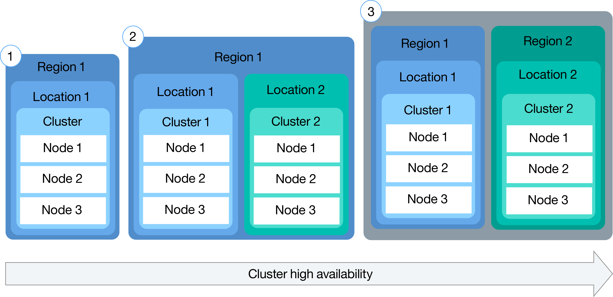
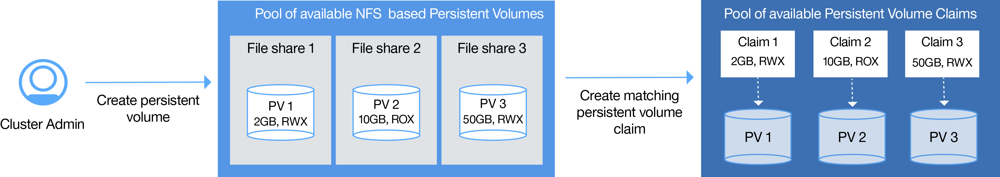

---

copyright:
  years: 2014, 2017
lastupdated: "2017-11-07"

---

{:new_window: target="_blank"}
{:shortdesc: .shortdesc}
{:screen: .screen}
{:pre: .pre}
{:codeblock: .codeblock}
{:table: .aria-labeledby="caption"}
{:codeblock: .codeblock}
{:tip: .tip}
{:download: .download}


# Setting up clusters
{: #cs_cluster}

Design your cluster setup for maximum availability and capacity.
{:shortdesc}

Before you begin, review the options for [highly available cluster configurations](cs_planning.html#cs_planning_cluster_config).



<br />


## Creating clusters with the GUI
{: #cs_cluster_ui}

A Kubernetes cluster is a set of worker nodes that are organized into a network. The purpose of the cluster is to define a set of resources, nodes, networks, and storage devices that keep applications highly available. Before you can deploy an app, you must create a cluster and set the definitions for the worker nodes in that cluster.
{:shortdesc}
For {{site.data.keyword.Bluemix_dedicated_notm}} users, see [Creating Kubernetes clusters from the GUI in {{site.data.keyword.Bluemix_dedicated_notm}} (Closed Beta)](#creating_ui_dedicated) instead.

To create a cluster:
1. In the catalog, select **Kubernetes Cluster**.
2. Select a type of cluster plan. You can choose either **Lite** or **Pay-As-You-Go**. With the Pay-As-You-Go plan, you can provision a standard cluster with features like multiple worker nodes for a highly available environment.
3. Configure your cluster details.
    1. Give your cluster a name, choose a version of Kubernetes, and select a location in which to deploy. Select the location that is physically closest to you for the best performance. Keep in mind that you might require legal authorization before data can be physically stored in a foreign country if you select a location outside your country.
    2. Select a type of machine and specify the number of worker nodes that you need. The machine type defines the amount of virtual CPU and memory that is set up in each worker node and made available to the containers.
        - The micro machine type indicates the smallest option.
        - A balanced machine has an equal amount of memory that is assigned to each CPU, which optimizes performance.
    3. Select a Public and Private VLAN from your IBM Cloud infrastructure (SoftLayer) account. Both VLANs communicate between worker nodes but the public VLAN also communicates with the IBM-managed Kubernetes master. You can use the same VLAN for multiple clusters.
        **Note**: If you choose not to select a public VLAN, you must configure an alternative solution.
    4. Select a type of hardware. Shared is a sufficient option for most situations.
        - **Dedicated**: Ensure complete isolation of your physical resources.
        - **Shared**: Allow storage of your physical resources on the same hardware as other IBM customers.
4. Click **Create cluster**. You can see the progress of the worker node deployment in the **Worker nodes** tab. When the deploy is done, you can see that your cluster is ready in the **Overview** tab.
    **Note:** Every worker node is assigned a unique worker node ID and domain name that must not be manually changed after the cluster is created. Changing the ID or domain name prevents the Kubernetes master from managing your cluster.


**What's next?**

When the cluster is up and running, you can check out the following tasks:

-   [Install the CLIs to start working with your cluster.](cs_cli_install.html#cs_cli_install)
-   [Deploy an app in your cluster.](cs_apps.html#cs_apps_cli)
-   [Set up your own private registry in {{site.data.keyword.Bluemix_notm}} to store and share Docker images with other users.](/docs/services/Registry/index.html)


### Creating clusters with the GUI in {{site.data.keyword.Bluemix_dedicated_notm}} (Closed Beta)
{: #creating_ui_dedicated}

1.  Log in to {{site.data.keyword.Bluemix_notm}} Public console ([https://console.bluemix.net ](https://console.bluemix.net)) with your IBMid.
2.  From the account menu, select your {{site.data.keyword.Bluemix_dedicated_notm}} account. The console is updated with the services and information for your {{site.data.keyword.Bluemix_dedicated_notm}} instance.
3.  From the catalog, select **Containers** and click **Kubernetes cluster**.
4.  Enter a **Cluster Name**.
5.  Select a **Machine type**. The machine type defines the amount of virtual CPU and memory that is set up in each worker node and that is available for all the containers that you deploy in your nodes.
    -   The micro machine type indicates the smallest option.
    -   A balanced machine type has an equal amount of memory assigned to each CPU, which optimizes performance.
6.  Choose the **Number of worker nodes** that you need. Select `3` to ensure high availability of your cluster.
7.  Click **Create Cluster**. The details for the cluster open, but the worker nodes in the cluster take a few minutes to provision. In the **Worker nodes** tab, you can see the progress of the worker node deployment. When the worker nodes are ready, the state changes to **Ready**.

**What's next?**

When the cluster is up and running, you can check out the following tasks:

-   [Install the CLIs to start working with your cluster.](cs_cli_install.html#cs_cli_install)
-   [Deploy an app in your cluster.](cs_apps.html#cs_apps_cli)
-   [Set up your own private registry in {{site.data.keyword.Bluemix_notm}} to store and share Docker images with other users.](/docs/services/Registry/index.html)

<br />


## Creating clusters with the CLI
{: #cs_cluster_cli}

A cluster is a set of worker nodes that are organized into a network. The purpose of the cluster is to define a set of resources, nodes, networks, and storage devices that keep applications highly available. Before you can deploy an app, you must create a cluster and set the definitions for the worker nodes in that cluster.
{:shortdesc}

For {{site.data.keyword.Bluemix_dedicated_notm}} users, see [Creating Kubernetes clusters from the CLI in {{site.data.keyword.Bluemix_dedicated_notm}} (Closed Beta)](#creating_cli_dedicated) instead.

To create a cluster:
1.  Install the {{site.data.keyword.Bluemix_notm}} CLI and the [{{site.data.keyword.containershort_notm}} plug-in](cs_cli_install.html#cs_cli_install).
2.  Log in to the {{site.data.keyword.Bluemix_notm}} CLI. Enter your {{site.data.keyword.Bluemix_notm}} credentials when prompted. To specify an {{site.data.keyword.Bluemix_notm}} region, [include the API endpoint](cs_regions.html#bluemix_regions).

    ```
    bx login
    ```
    {: pre}

    **Note:** If you have a federated ID, use `bx login --sso` to log in to the {{site.data.keyword.Bluemix_notm}} CLI. Enter your user name and use the provided URL in your CLI output to retrieve your one-time passcode. You know you have a federated ID when the login fails without the `--sso` and succeeds with the `--sso` option.

3. If you have multiple {{site.data.keyword.Bluemix_notm}} accounts, select the account where you want to create your Kubernetes cluster.

4.  Specify the {{site.data.keyword.Bluemix_notm}} organization and space where you want to create your Kubernetes cluster.
    ```
    bx target --cf
    ```
    {: pre}

    **Note**: Clusters are specific to an account and an organization, but are independent from a {{site.data.keyword.Bluemix_notm}} space. For example, if you create a cluster in your organization in `test` space, you can still work with that cluster if you later target the `dev` space.

5.  If you want to create or access Kubernetes clusters in a region other than the {{site.data.keyword.Bluemix_notm}} region that you selected earlier, [specify the {{site.data.keyword.containershort_notm}} region API endpoint](cs_regions.html#container_login_endpoints).

    **Note**: If you want to create a cluster in US East, you must specify the US East container region API endpoint using the `bx cs init --host https://us-east.containers.bluemix.net` command.

7.  Create a cluster.
    1.  Review the locations that are available. The locations that are shown depend on the {{site.data.keyword.containershort_notm}} region that you are logged in.

        ```
        bx cs locations
        ```
        {: pre}

        Your CLI output matches the [locations for the container region](cs_regions.html#locations).

    2.  Choose a location and review the machine types available in that location. The machine type specifies the virtual compute resources that are available to each worker node.

        ```
        bx cs machine-types <location>
        ```
        {: pre}

        ```
        Getting machine types list...
        OK
        Machine Types
        Name         Cores   Memory   Network Speed   OS             Storage   Server Type
        u1c.2x4      2       4GB      1000Mbps        UBUNTU_16_64   100GB     virtual
        b1c.4x16     4       16GB     1000Mbps        UBUNTU_16_64   100GB     virtual
        b1c.16x64    16      64GB     1000Mbps        UBUNTU_16_64   100GB     virtual
        b1c.32x128   32      128GB    1000Mbps        UBUNTU_16_64   100GB     virtual
        b1c.56x242   56      242GB    1000Mbps        UBUNTU_16_64   100GB     virtual
        ```
        {: screen}

    3.  Check to see if a public and private VLAN already exists in the IBM Cloud infrastructure (SoftLayer) for this account.

        ```
        bx cs vlans <location>
        ```
        {: pre}

        ```
        ID        Name                Number   Type      Router
        1519999   vlan   1355     private   bcr02a.dal10
        1519898   vlan   1357     private   bcr02a.dal10
        1518787   vlan   1252     public   fcr02a.dal10
        1518888   vlan   1254     public    fcr02a.dal10
        ```
        {: screen}

        If a public and private VLAN already exists, note the matching routers. Private VLAN routers always begin with `bcr` (back-end router) and public VLAN routers always begin with `fcr` (front-end router). The number and letter combination after those prefixes must match to use those VLANs when creating a cluster. In the example output, any of the private VLANs can be used with any of public VLANs because the routers all include `02a.dal10`.

    4.  Run the `cluster-create` command. You can choose between a lite cluster, which includes one worker node set up with 2vCPU and 4GB memory, or a standard cluster, which can include as many worker nodes as you choose in your IBM Cloud infrastructure (SoftLayer) account. When you create a standard cluster, by default, the hardware of the worker node is shared by multiple IBM customers and billed by hours of usage. </br>Example for a standard cluster:

        ```
        bx cs cluster-create --location dal10 --public-vlan <public_vlan_id> --private-vlan <private_vlan_id> --machine-type u1c.2x4 --workers 3 --name <cluster_name> --kube-version <major.minor.patch>
        ```
        {: pre}

        Example for a lite cluster:

        ```
        bx cs cluster-create --name my_cluster
        ```
        {: pre}

        <table>
        <caption>Table 1. Understanding <code>bx cs cluster-create</code> command components</caption>
        <thead>
        <th colspan=2> Understanding this command's components</th>
        </thead>
        <tbody>
        <tr>
        <td><code>cluster-create</code></td>
        <td>The command to create a cluster in your {{site.data.keyword.Bluemix_notm}} organization.</td>
        </tr>
        <tr>
        <td><code>--location <em>&lt;location&gt;</em></code></td>
        <td>Replace <em>&lt;location&gt;</em> with the {{site.data.keyword.Bluemix_notm}} location ID where you want to create your cluster. [Available locations](cs_regions.html#locations) depend on the {{site.data.keyword.containershort_notm}} region you are logged in to.</td>
        </tr>
        <tr>
        <td><code>--machine-type <em>&lt;machine_type&gt;</em></code></td>
        <td>If you are creating a standard cluster, choose a machine type. The machine type specifies the virtual compute resources that are available to each worker node. Review [Comparison of lite and standard clusters for {{site.data.keyword.containershort_notm}}](cs_planning.html#cs_planning_cluster_type) for more information. For lite clusters, you do not have to define the machine type.</td>
        </tr>
        <tr>
        <td><code>--public-vlan <em>&lt;public_vlan_id&gt;</em></code></td>
        <td><ul>
          <li>For lite clusters, you do not have to define a public VLAN. Your lite cluster is automatically connected to a public VLAN that is owned by IBM.</li>
          <li>For a standard cluster, if you already have a public VLAN set up in your IBM Cloud infrastructure (SoftLayer) account for that location, enter the ID of the public VLAN. If you do not have both a public and a private VLAN in your account, do not specify this option. {{site.data.keyword.containershort_notm}} automatically creates a public VLAN for you.<br/><br/>
          <strong>Note</strong>: Private VLAN routers always begin with <code>bcr</code> (back-end router) and public VLAN routers always begin with <code>fcr</code> (front-end router). The number and letter combination after those prefixes must match to use those VLANs when creating a cluster.</li>
        </ul></td>
        </tr>
        <tr>
        <td><code>--private-vlan <em>&lt;private_vlan_id&gt;</em></code></td>
        <td><ul><li>For lite clusters, you do not have to define a private VLAN. Your lite cluster is automatically connected to a private VLAN that is owned by IBM.</li><li>For a standard cluster, if you already have a private VLAN set up in your IBM Cloud infrastructure (SoftLayer) account for that location, enter the ID of the private VLAN. If you do not have both a public and a private VLAN in your account, do not specify this option. {{site.data.keyword.containershort_notm}} automatically creates a public VLAN for you.<br/><br/><strong>Note</strong>: Private VLAN routers always begin with <code>bcr</code> (back-end router) and public VLAN routers always begin with <code>fcr</code> (front-end router). The number and letter combination after those prefixes must match to use those VLANs when creating a cluster.</li></ul></td>
        </tr>
        <tr>
        <td><code>--name <em>&lt;name&gt;</em></code></td>
        <td>Replace <em>&lt;name&gt;</em> with a name for your cluster.</td>
        </tr>
        <tr>
        <td><code>--workers <em>&lt;number&gt;</em></code></td>
        <td>The number of worker nodes to include in the cluster. If the <code>--workers</code> option is not specified, 1 worker node is created.</td>
        </tr>
        <tr>
          <td><code>--kube-version <em>&lt;major.minor.patch&gt;</em></code></td>
          <td>The Kubernetes version for the cluster master node. This value is optional. Unless specified, the cluster is created with the default of supported Kubernetes versions. To see available versions, run <code>bx cs kube-versions</code>.</td>
        </tr>
        </tbody></table>

8.  Verify that the creation of the cluster was requested.

    ```
    bx cs clusters
    ```
    {: pre}

    **Note:** It can take up to 15 minutes for the worker node machines to be ordered, and for the cluster to be set up and provisioned in your account.

    When the provisioning of your cluster is completed, the status of your cluster changes to **deployed**.

    ```
    Name         ID                                   State      Created          Workers
    my_cluster   paf97e8843e29941b49c598f516de72101   deployed   20170201162433   1
    ```
    {: screen}

9.  Check the status of the worker nodes.

    ```
    bx cs workers <cluster>
    ```
    {: pre}

    When the worker nodes are ready, the state changes to **normal** and the status is **Ready**. When the node status is **Ready**, you can then access the cluster.

    **Note:** Every worker node is assigned a unique worker node ID and domain name that must not be changed manually after the cluster is created. Changing the ID or domain name prevents the Kubernetes master from managing your cluster.

    ```
    ID                                                  Public IP        Private IP     Machine Type   State      Status
    prod-dal10-pa8dfcc5223804439c87489886dbbc9c07-w1   169.47.223.113   10.171.42.93   free           normal    Ready
    ```
    {: screen}

10. Set the cluster you created as the context for this session. Complete these configuration steps every time that you work with your cluster.
    1.  Get the command to set the environment variable and download the Kubernetes configuration files.

        ```
        bx cs cluster-config <cluster_name_or_id>
        ```
        {: pre}

        When the download of the configuration files is finished, a command is displayed that you can use to set the path to the local Kubernetes configuration file as an environment variable.

        Example for OS X:

        ```
        export KUBECONFIG=/Users/<user_name>/.bluemix/plugins/container-service/clusters/<cluster_name>/kube-config-prod-dal10-<cluster_name>.yml
        ```
        {: screen}

    2.  Copy and paste the command that is displayed in your terminal to set the `KUBECONFIG` environment variable.
    3.  Verify that the `KUBECONFIG` environment variable is set properly.

        Example for OS X:

        ```
        echo $KUBECONFIG
        ```
        {: pre}

        Output:

        ```
        /Users/<user_name>/.bluemix/plugins/container-service/clusters/<cluster_name>/kube-config-prod-dal10-<cluster_name>.yml

        ```
        {: screen}

11. Launch your Kubernetes dashboard with the default port `8001`.
    1.  Set the proxy with the default port number.

        ```
        kubectl proxy
        ```
        {: pre}

        ```
        Starting to serve on 127.0.0.1:8001
        ```
        {: screen}

    2.  Open the following URL in a web browser to see the Kubernetes dashboard.

        ```
        http://localhost:8001/ui
        ```
        {: codeblock}


**What's next?**

-   [Deploy an app in your cluster.](cs_apps.html#cs_apps_cli)
-   [Manage your cluster with the `kubectl` command line. ](https://kubernetes.io/docs/user-guide/kubectl/)
-   [Set up your own private registry in {{site.data.keyword.Bluemix_notm}} to store and share Docker images with other users.](/docs/services/Registry/index.html)

### Creating clusters with the CLI in {{site.data.keyword.Bluemix_dedicated_notm}} (Closed Beta)
{: #creating_cli_dedicated}

1.  Install the {{site.data.keyword.Bluemix_notm}} CLI and the [{{site.data.keyword.containershort_notm}} plug-in](cs_cli_install.html#cs_cli_install).
2.  Log in to the public endpoint for {{site.data.keyword.containershort_notm}}. Enter your {{site.data.keyword.Bluemix_notm}} credentials and select the {{site.data.keyword.Bluemix_dedicated_notm}} account when prompted.

    ```
    bx login -a api.<region>.bluemix.net
    ```
    {: pre}

    **Note:** If you have a federated ID, use `bx login --sso` to log in to the {{site.data.keyword.Bluemix_notm}} CLI. Enter your user name and use the provided URL in your CLI output to retrieve your one-time passcode. You know you have a federated ID when the login fails without the `--sso` and succeeds with the `--sso` option.

3.  Create a cluster with the `cluster-create` command. When you create a standard cluster, the hardware of the worker node is billed by hours of usage.

    Example:

    ```
    bx cs cluster-create --location <location> --machine-type <machine-type> --name <cluster_name> --workers <number>
    ```
    {: pre}

    <table>
    <caption>Table 2. Understanding this command's components</caption>
    <thead>
    <th colspan=2> Understanding this command's components</th>
    </thead>
    <tbody>
    <tr>
    <td><code>cluster-create</code></td>
    <td>The command to create a cluster in your {{site.data.keyword.Bluemix_notm}} organization.</td>
    </tr>
    <tr>
    <td><code>--location <em>&lt;location&gt;</em></code></td>
    <td>Replace &lt;location&gt; with the {{site.data.keyword.Bluemix_notm}} location ID where you want to create your cluster. [Available locations](cs_regions.html#locations) depend on the {{site.data.keyword.containershort_notm}} region you are logged in to.</td>
    </tr>
    <tr>
    <td><code>--machine-type <em>&lt;machine_type&gt;</em></code></td>
    <td>If you are creating a standard cluster, choose a machine type. The machine type specifies the virtual compute resources that are available to each worker node. Review [Comparison of lite and standard clusters for {{site.data.keyword.containershort_notm}}](cs_planning.html#cs_planning_cluster_type) for more information. For lite clusters, you do not have to define the machine type.</td>
    </tr>
    <tr>
    <td><code>--name <em>&lt;name&gt;</em></code></td>
    <td>Replace <em>&lt;name&gt;</em> with a name for your cluster.</td>
    </tr>
    <tr>
    <td><code>--workers <em>&lt;number&gt;</em></code></td>
    <td>The number of worker nodes to include in the cluster. If the <code>--workers</code> option is not specified, 1 worker node is created.</td>
    </tr>
    </tbody></table>

4.  Verify that the creation of the cluster was requested.

    ```
    bx cs clusters
    ```
    {: pre}

    **Note:** It can take up to 15 minutes for the worker node machines to be ordered, and for the cluster to be set up and provisioned in your account.

    When the provisioning of your cluster is completed, the state of your cluster changes to **deployed**.

    ```
    Name         ID                                   State      Created          Workers
    my_cluster   paf97e8843e29941b49c598f516de72101   deployed   20170201162433   1
    ```
    {: screen}

5.  Check the status of the worker nodes.

    ```
    bx cs workers <cluster>
    ```
    {: pre}

    When the worker nodes are ready, the state changes to **normal** and the status is **Ready**. When the node status is **Ready**, you can then access the cluster.

    ```
    ID                                                  Public IP        Private IP     Machine Type   State      Status
    prod-dal10-pa8dfcc5223804439c87489886dbbc9c07-w1   169.47.223.113   10.171.42.93   free           normal    Ready
    ```
    {: screen}

6.  Set the cluster you created as the context for this session. Complete these configuration steps every time that you work with your cluster.

    1.  Get the command to set the environment variable and download the Kubernetes configuration files.

        ```
        bx cs cluster-config <cluster_name_or_id>
        ```
        {: pre}

        When the download of the configuration files is finished, a command is displayed that you can use to set the path to the local Kubernetes configuration file as an environment variable.

        Example for OS X:

        ```
        export KUBECONFIG=/Users/<user_name>/.bluemix/plugins/container-service/clusters/<cluster_name>/kube-config-prod-dal10-<cluster_name>.yml
        ```
        {: screen}

    2.  Copy and paste the command that is displayed in your terminal to set the `KUBECONFIG` environment variable.
    3.  Verify that the `KUBECONFIG` environment variable is set properly.

        Example for OS X:

        ```
        echo $KUBECONFIG
        ```
        {: pre}

        Output:

        ```
        /Users/<user_name>/.bluemix/plugins/container-service/clusters/<cluster_name>/kube-config-prod-dal10-<cluster_name>.yml

        ```
        {: screen}

7.  Access your Kubernetes dashboard with the default port 8001.
    1.  Set the proxy with the default port number.

        ```
        kubectl proxy
        ```
        {: pre}

        ```
        Starting to serve on 127.0.0.1:8001
        ```
        {: screen}

    2.  Open the following URL in a web browser in order to see the Kubernetes dashboard.

        ```
        http://localhost:8001/ui
        ```
        {: codeblock}


**What's next?**

-   [Deploy an app in your cluster.](cs_apps.html#cs_apps_cli)
-   [Manage your cluster with the `kubectl` command line. ](https://kubernetes.io/docs/user-guide/kubectl/)
-   [Set up your own private registry in {{site.data.keyword.Bluemix_notm}} to store and share Docker images with other users.](/docs/services/Registry/index.html)

<br />


## Using private and public image registries
{: #cs_apps_images}

A Docker image is the basis for every container that you create. An image is created from a Dockerfile, which is a file that contains instructions to build the image. A Dockerfile might reference build artifacts in its instructions that are stored separately, such as an app, the app's configuration, and its dependencies. Images are typically stored in a registry that can either be accessible by the public (public registry) or set up with limited access for a small group of users (private registry).
{:shortdesc}

Review the following options to find information about how to set up an image registry and how to use an image from the registry.

-   [Accessing a namespace in {{site.data.keyword.registryshort_notm}} to work with IBM-provided images and your own private Docker images](#bx_registry_default).
-   [Accessing public images from Docker Hub](#dockerhub).
-   [Accessing private images that are stored in other private registries](#private_registry).

### Accessing a namespace in {{site.data.keyword.registryshort_notm}} to work with IBM-provided images and your own private Docker images
{: #bx_registry_default}

You can deploy containers to your cluster from an IBM-provided public image or a private image that is stored in your namespace in {{site.data.keyword.registryshort_notm}}.

Before you begin:

1. [Set up a namespace in {{site.data.keyword.registryshort_notm}} on {{site.data.keyword.Bluemix_notm}} Public or {{site.data.keyword.Bluemix_dedicated_notm}} and push images to this namespace](/docs/services/Registry/registry_setup_cli_namespace.html#registry_namespace_add).
2. [Create a cluster](#cs_cluster_cli).
3. [Target your CLI to your cluster](cs_cli_install.html#cs_cli_configure).

When you create a cluster, a non-expiring registry token is automatically created for the cluster. This token is used to authorize read-only access to any of your namespaces that you set up in {{site.data.keyword.registryshort_notm}} so that you can work with IBM-provided public and your own private Docker images. Tokens must be stored in a Kubernetes `imagePullSecret` so that they are accessible to a Kubernetes cluster when you deploy a containerized app. When your cluster is created, {{site.data.keyword.containershort_notm}} automatically stores this token in a Kubernetes `imagePullSecret`. The `imagePullSecret` is added to the default Kubernetes namespace, the default list of secrets in the ServiceAccount for that namespace, and the kube-system namespace.

**Note:** By using this initial setup, you can deploy containers from any image that is available in a namespace in your {{site.data.keyword.Bluemix_notm}} account into the **default** namespace of your cluster. If you want to deploy a container into other namespaces of your cluster, or if you want to use an image that is stored in another {{site.data.keyword.Bluemix_notm}} region or in another {{site.data.keyword.Bluemix_notm}} account, you must [create your own imagePullSecret for your cluster](#bx_registry_other).

To deploy a container into the **default** namespace of your cluster, create a configuration file.

1.  Create a deployment configuration file that is named `mydeployment.yaml`.
2.  Define the deployment and the image that you want to use from your namespace in {{site.data.keyword.registryshort_notm}}.

    To use a private image from a namespace in {{site.data.keyword.registryshort_notm}}:

    ```
    apiVersion: extensions/v1beta1
    kind: Deployment
    metadata:
      name: ibmliberty-deployment
    spec:
      replicas: 3
      template:
        metadata:
          labels:
            app: ibmliberty
        spec:
          containers:
          - name: ibmliberty
            image: registry.<region>.bluemix.net/<namespace>/<my_image>:<tag>
    ```
    {: codeblock}

    **Tip:** To retrieve your namespace information, run `bx cr namespace-list`.

3.  Create the deployment in your cluster.

    ```
    kubectl apply -f mydeployment.yaml
    ```
    {: pre}

    **Tip:** You can also deploy an existing configuration file, such as one of the IBM-provided public images. This example uses the **ibmliberty** image in the US-South region.

    ```
    kubectl apply -f https://raw.githubusercontent.com/IBM-{{site.data.keyword.Bluemix_notm}}/kube-samples/master/deploy-apps-clusters/deploy-ibmliberty.yaml
    ```
    {: pre}

### Deploying images to other Kubernetes namespaces or accessing images in other {{site.data.keyword.Bluemix_notm}} regions and accounts
{: #bx_registry_other}

You can deploy containers to other Kubernetes namespaces, use images that are stored in other {{site.data.keyword.Bluemix_notm}} regions or accounts, or use images that are stored in {{site.data.keyword.Bluemix_dedicated_notm}} by creating your own imagePullSecret.

Before you begin:

1.  [Set up a namespace in {{site.data.keyword.registryshort_notm}} on {{site.data.keyword.Bluemix_notm}} Public or {{site.data.keyword.Bluemix_dedicated_notm}} and push images to this namespace](/docs/services/Registry/registry_setup_cli_namespace.html#registry_namespace_add).
2.  [Create a cluster](#cs_cluster_cli).
3.  [Target your CLI to your cluster](cs_cli_install.html#cs_cli_configure).

To create your own imagePullSecret:

**Note:** ImagePullSecrets are valid only for the Kubernetes namespaces that they were created for. Repeat these steps for every namespace where you want to deploy containers. Images from [DockerHub](#dockerhub) do not require ImagePullSecrets.

1.  If you do not have a token, [create a token for the registry that you want to access.](/docs/services/Registry/registry_tokens.html#registry_tokens_create)
2.  List tokens in your {{site.data.keyword.Bluemix_notm}} account.

    ```
    bx cr token-list
    ```
    {: pre}

3.  Note the token ID that you want to use.
4.  Retrieve the value for your token. Replace <em>&lt;token_id&gt;</em> with the ID of the token that you retrieved in the previous step.

    ```
    bx cr token-get <token_id>
    ```
    {: pre}

    Your token value is displayed in the **Token** field of your CLI output.

5.  Create the Kubernetes secret to store your token information.

    ```
    kubectl --namespace <kubernetes_namespace> create secret docker-registry <secret_name>  --docker-server=<registry_url> --docker-username=token --docker-password=<token_value> --docker-email=<docker_email>
    ```
    {: pre}

    <table>
    <caption>Table 3. Understanding this command's components</caption>
    <thead>
    <th colspan=2> Understanding this command's components</th>
    </thead>
    <tbody>
    <tr>
    <td><code>--namespace <em>&lt;kubernetes_namespace&gt;</em></code></td>
    <td>Required. The Kubernetes namespace of your cluster where you want to use the secret and deploy containers to. Run <code>kubectl get namespaces</code> to list all namespaces in your cluster.</td>
    </tr>
    <tr>
    <td><code><em>&lt;secret_name&gt;</em></code></td>
    <td>Required. The name that you want to use for your imagePullSecret.</td>
    </tr>
    <tr>
    <td><code>--docker-server <em>&lt;registry_url&gt;</em></code></td>
    <td>Required. The URL to the image registry where your namespace is set up.<ul><li>For namespaces that are set up in US-South and US-East registry.ng.bluemix.net</li><li>For namespaces that are set up in UK-South registry.eu-gb.bluemix.net</li><li>For namespaces that are set up in EU-Central (Frankfurt) registry.eu-de.bluemix.net</li><li>For namespaces that are set up in Australia (Sydney) registry.au-syd.bluemix.net</li><li>For namespaces that are set up in {{site.data.keyword.Bluemix_dedicated_notm}} registry.<em>&lt;dedicated_domain&gt;</em></li></ul></td>
    </tr>
    <tr>
    <td><code>--docker-username <em>&lt;docker_username&gt;</em></code></td>
    <td>Required. The user name to log in to your private registry. For {{site.data.keyword.registryshort_notm}}, the user name is set to <code>token</code>.</td>
    </tr>
    <tr>
    <td><code>--docker-password <em>&lt;token_value&gt;</em></code></td>
    <td>Required. The value of your registry token that you retrieved earlier.</td>
    </tr>
    <tr>
    <td><code>--docker-email <em>&lt;docker-email&gt;</em></code></td>
    <td>Required. If you have one, enter your Docker email address. If you do not have one, enter a fictional email address, as for example a@b.c. This email is mandatory to create a Kubernetes secret, but is not used after creation.</td>
    </tr>
    </tbody></table>

6.  Verify that the secret was created successfully. Replace <em>&lt;kubernetes_namespace&gt;</em> with the name of the namespace where you created the imagePullSecret.

    ```
    kubectl get secrets --namespace <kubernetes_namespace>
    ```
    {: pre}

7.  Create a pod that references the imagePullSecret.
    1.  Create a pod configuration file that is named `mypod.yaml`.
    2.  Define the pod and the imagePullSecret that you want to use to access the private {{site.data.keyword.Bluemix_notm}} registry.

        A private image from a namespace:

        ```
        apiVersion: v1
        kind: Pod
        metadata:
          name: <pod_name>
        spec:
          containers:
            - name: <container_name>
              image: registry.<region>.bluemix.net/<my_namespace>/<my_image>:<tag>
          imagePullSecrets:
            - name: <secret_name>
        ```
        {: codeblock}

        An {{site.data.keyword.Bluemix_notm}} public image:

        ```
        apiVersion: v1
        kind: Pod
        metadata:
          name: <pod_name>
        spec:
          containers:
            - name: <container_name>
              image: registry.<region>.bluemix.net/
          imagePullSecrets:
            - name: <secret_name>
        ```
        {: codeblock}

        <table>
        <caption>Table 4. Understanding the YAML file components</caption>
        <thead>
        <th colspan=2> Understanding the YAML file components</th>
        </thead>
        <tbody>
        <tr>
        <td><code><em>&lt;container_name&gt;</em></code></td>
        <td>The name of the container that you want to deploy to your cluster.</td>
        </tr>
        <tr>
        <td><code><em>&lt;my_namespace&gt;</em></code></td>
        <td>The namespace where your image is stored. To list available namespaces, run `bx cr namespace-list`.</td>
        </tr>
        <tr>
        <td><code><em>&lt;my_image&gt;</em></code></td>
        <td>The name of the image that you want to use. To list available images in an {{site.data.keyword.Bluemix_notm}} account, run `bx cr image-list`.</td>
        </tr>
        <tr>
        <td><code><em>&lt;tag&gt;</em></code></td>
        <td>The version of the image that you want to use. If no tag is specified, the image that is tagged <strong>latest</strong> is used by default.</td>
        </tr>
        <tr>
        <td><code><em>&lt;secret_name&gt;</em></code></td>
        <td>The name of the imagePullSecret that you created earlier.</td>
        </tr>
        </tbody></table>

   3.  Save your changes.
   4.  Create the deployment in your cluster.

        ```
        kubectl apply -f mypod.yaml
        ```
        {: pre}


### Accessing public images from Docker Hub
{: #dockerhub}

You can use any public image that is stored in Docker Hub to deploy a container to your cluster without any additional configuration.

Before you begin:

1.  [Create a cluster](#cs_cluster_cli).
2.  [Target your CLI to your cluster](cs_cli_install.html#cs_cli_configure).

Create a deployment configuration file.

1.  Create a configuration file that is named `mydeployment.yaml`.
2.  Define the deployment and the public image from Docker Hub that you want to use. The following configuration file uses the public NGINX image that is available on Docker Hub.

    ```
    apiVersion: extensions/v1beta1
    kind: Deployment
    metadata:
      name: nginx-deployment
    spec:
      replicas: 3
      template:
        metadata:
          labels:
            app: nginx
        spec:
          containers:
          - name: nginx
            image: nginx
    ```
    {: codeblock}

3.  Create the deployment in your cluster.

    ```
    kubectl apply -f mydeployment.yaml
    ```
    {: pre}

    **Tip:** Alternatively, deploy an existing configuration file. The following example uses the same public NGINX image, but applies it directly to your cluster.

    ```
    kubectl apply -f https://raw.githubusercontent.com/IBM-{{site.data.keyword.Bluemix_notm}}/kube-samples/master/deploy-apps-clusters/deploy-nginx.yaml
    ```
    {: pre}


### Accessing private images that are stored in other private registries
{: #private_registry}

If you already have a private registry that you want to use, you must store the registry credentials in a Kubernetes imagePullSecret and reference this secret in your configuration file.

Before you begin:

1.  [Create a cluster](#cs_cluster_cli).
2.  [Target your CLI to your cluster](cs_cli_install.html#cs_cli_configure).

To create an imagePullSecret:

**Note:** ImagePullSecrets are valid for the Kubernetes namespaces they were created for. Repeat these steps for every namespace where you want to deploy containers from an image in a private {{site.data.keyword.Bluemix_notm}} registry.

1.  Create the Kubernetes secret to store your private registry credentials.

    ```
    kubectl --namespace <kubernetes_namespace> create secret docker-registry <secret_name>  --docker-server=<registry_url> --docker-username=<docker_username> --docker-password=<docker_password> --docker-email=<docker_email>
    ```
    {: pre}

    <table>
    <caption>Table 5. Understanding this command's components</caption>
    <thead>
    <th colspan=2> Understanding this command's components</th>
    </thead>
    <tbody>
    <tr>
    <td><code>--namespace <em>&lt;kubernetes_namespace&gt;</em></code></td>
    <td>Required. The Kubernetes namespace of your cluster where you want to use the secret and deploy containers to. Run <code>kubectl get namespaces</code> to list all namespaces in your cluster.</td>
    </tr>
    <tr>
    <td><code><em>&lt;secret_name&gt;</em></code></td>
    <td>Required. The name that you want to use for your imagePullSecret.</td>
    </tr>
    <tr>
    <td><code>--docker-server <em>&lt;registry_url&gt;</em></code></td>
    <td>Required. The URL to the registry where your private images are stored.</td>
    </tr>
    <tr>
    <td><code>--docker-username <em>&lt;docker_username&gt;</em></code></td>
    <td>Required. The user name to log in to your private registry.</td>
    </tr>
    <tr>
    <td><code>--docker-password <em>&lt;token_value&gt;</em></code></td>
    <td>Required. The value of your registry token that you retrieved earlier.</td>
    </tr>
    <tr>
    <td><code>--docker-email <em>&lt;docker-email&gt;</em></code></td>
    <td>Required. If you have one, enter your Docker email address. If you do not have one, enter a fictional email address, as for example a@b.c. This email is mandatory to create a Kubernetes secret, but is not used after creation.</td>
    </tr>
    </tbody></table>

2.  Verify that the secret was created successfully. Replace <em>&lt;kubernetes_namespace&gt;</em> with the name of the namespace where you created the imagePullSecret.

    ```
    kubectl get secrets --namespace <kubernetes_namespace>
    ```
    {: pre}

3.  Create a pod that references the imagePullSecret.
    1.  Create a pod configuration file that is named `mypod.yaml`.
    2.  Define the pod and the imagePullSecret that you want to use to access the private {{site.data.keyword.Bluemix_notm}} registry. To use a private image from your private registry:

        ```
        apiVersion: v1
        kind: Pod
        metadata:
          name: <pod_name>
        spec:
          containers:
            - name: <container_name>
              image: <my_image>:<tag>
          imagePullSecrets:
            - name: <secret_name>
        ```
        {: codeblock}

        <table>
        <caption>Table 6. Understanding the YAML file components</caption>
        <thead>
        <th colspan=2> Understanding the YAML file components</th>
        </thead>
        <tbody>
        <tr>
        <td><code><em>&lt;pod_name&gt;</em></code></td>
        <td>The name of the pod that you want to create.</td>
        </tr>
        <tr>
        <td><code><em>&lt;container_name&gt;</em></code></td>
        <td>The name of the container that you want to deploy to your cluster.</td>
        </tr>
        <tr>
        <td><code><em>&lt;my_image&gt;</em></code></td>
        <td>The full path to the image in your private registry that you want to use.</td>
        </tr>
        <tr>
        <td><code><em>&lt;tag&gt;</em></code></td>
        <td>The version of the image that you want to use. If no tag is specified, the image that is tagged <strong>latest</strong> is used by default.</td>
        </tr>
        <tr>
        <td><code><em>&lt;secret_name&gt;</em></code></td>
        <td>The name of the imagePullSecret that you created earlier.</td>
        </tr>
        </tbody></table>

  3.  Save your changes.
  4.  Create the deployment in your cluster.

        ```
        kubectl apply -f mypod.yaml
        ```
        {: pre}

<br />


## Adding {{site.data.keyword.Bluemix_notm}} services to clusters
{: #cs_cluster_service}

Add an existing {{site.data.keyword.Bluemix_notm}} service instance to your cluster to enable your cluster users to access and use the {{site.data.keyword.Bluemix_notm}} service when they deploy an app to the cluster.
{:shortdesc}

Before you begin:

1. [Target your CLI](cs_cli_install.html#cs_cli_configure) to your cluster.
2. [Request an instance of the {{site.data.keyword.Bluemix_notm}} service](/docs/services/reqnsi.html#req_instance) in your space.
   **Note:** To create an instance of a service in the Washington DC location, you must use the CLI.
3. For {{site.data.keyword.Bluemix_dedicated_notm}} users, see [Adding {{site.data.keyword.Bluemix_notm}} services to clusters in {{site.data.keyword.Bluemix_dedicated_notm}} (Closed Beta)](#binding_dedicated) instead.

**Note:**
<ul><ul>
<li>You can only add {{site.data.keyword.Bluemix_notm}} services that support service keys. If the service does not support service keys, see [Enabling external apps to use {{site.data.keyword.Bluemix_notm}} services](/docs/services/reqnsi.html#req_instance).</li>
<li>The cluster and the worker nodes must be deployed fully before you can add a service.</li>
</ul></ul>


To add a service:
2.  List all existing services in your {{site.data.keyword.Bluemix_notm}} space.

    ```
    bx service list
    ```
    {: pre}

    Example CLI output:

    ```
    name                      service           plan    bound apps   last operation
    <service_instance_name>   <service_name>    spark                create succeeded
    ```
    {: screen}

3.  Note the **name** of the service instance that you want to add to your cluster.
4.  Identify the cluster namespace that you want to use to add your service. Choose between the following options.
    -   List existing namespaces and choose a namespace that you want to use.

        ```
        kubectl get namespaces
        ```
        {: pre}

    -   Create a new namespace in your cluster.

        ```
        kubectl create namespace <namespace_name>
        ```
        {: pre}

5.  Add the service to your cluster.

    ```
    bx cs cluster-service-bind <cluster_name_or_id> <namespace> <service_instance_name>
    ```
    {: pre}

    When the service is successfully added to your cluster, a cluster secret is created that holds the credentials of your service instance. Example CLI output:

    ```
    bx cs cluster-service-bind mycluster mynamespace cleardb
    Binding service instance to namespace...
    OK
    Namespace:	mynamespace
    Secret name:     binding-<service_instance_name>
    ```
    {: screen}

6.  Verify that the secret was created in your cluster namespace.

    ```
    kubectl get secrets --namespace=<namespace>
    ```
    {: pre}


To use the service in a pod that is deployed in the cluster, cluster users can access the service credentials of the {{site.data.keyword.Bluemix_notm}} service by [mounting the Kubernetes secret as a secret volume to a pod](cs_apps.html#cs_apps_service).

### Adding {{site.data.keyword.Bluemix_notm}} services to clusters in {{site.data.keyword.Bluemix_dedicated_notm}} (Closed Beta)
{: #binding_dedicated}

**Note**: The cluster and the worker nodes must be deployed fully before you can add a service.

1.  Set the path to your local {{site.data.keyword.Bluemix_dedicated_notm}} configuration file as the `DEDICATED_BLUEMIX_CONFIG` environment variable.

    ```
    export DEDICATED_BLUEMIX_CONFIG=<path_to_config_directory>
    ```
    {: pre}

2.  Set the same path defined above as the `BLUEMIX_HOME` environment variable.

    ```
    export BLUEMIX_HOME=$DEDICATED_BLUEMIX_CONFIG
    ```
    {: pre}

3.  Log in to the {{site.data.keyword.Bluemix_dedicated_notm}} environment where you want to create the service instance.

    ```
    bx login -a api.<dedicated_domain> -u <user> -p <password> -o <org> -s <space>
    ```
    {: pre}

4.  List the available services in the {{site.data.keyword.Bluemix_notm}} catalog.

    ```
    bx service offerings
    ```
    {: pre}

5.  Create an instance of the service you want to bind to the cluster.

    ```
    bx service create <service_name> <service_plan> <service_instance_name>
    ```
    {: pre}

6.  Verify that you created your service instance by listing all existing services in your {{site.data.keyword.Bluemix_notm}} space.

    ```
    bx service list
    ```
    {: pre}

    Example CLI output:

    ```
    name                      service           plan    bound apps   last operation
    <service_instance_name>   <service_name>    spark                create succeeded
    ```
    {: screen}

7.  Unset the `BLUEMIX_HOME` environment variable to return to using {{site.data.keyword.Bluemix_notm}} Public.

    ```
    unset $BLUEMIX_HOME
    ```
    {: pre}

8.  Log in to the public endpoint for {{site.data.keyword.containershort_notm}} and target your CLI to the cluster in your {{site.data.keyword.Bluemix_dedicated_notm}} environment.
    1.  Log in to the account by using the public endpoint for {{site.data.keyword.containershort_notm}}. Enter your {{site.data.keyword.Bluemix_notm}} credentials and select the {{site.data.keyword.Bluemix_dedicated_notm}} account when prompted.

        ```
        bx login -a api.ng.bluemix.net
        ```
        {: pre}

        **Note:** If you have a federated ID, use `bx login --sso` to log in to the {{site.data.keyword.Bluemix_notm}} CLI. Enter your user name and use the provided URL in your CLI output to retrieve your one-time passcode. You know you have a federated ID when the login fails without the `--sso` and succeeds with the `--sso` option.

    2.  Get a list of available clusters and identify the name of the cluster to target in your CLI.

        ```
        bx cs clusters
        ```
        {: pre}

    3.  Get the command to set the environment variable and download the Kubernetes configuration files.

        ```
        bx cs cluster-config <cluster_name_or_id>
        ```
        {: pre}

        When the download of the configuration files is finished, a command is displayed that you can use to set the path to the local Kubernetes configuration file as an environment variable.

        Example for OS X:

        ```
        export KUBECONFIG=/Users/<user_name>/.bluemix/plugins/container-service/clusters/<cluster_name>/kube-config-prod-dal10-<cluster_name>.yml
        ```
        {: screen}

    4.  Copy and paste the command that is displayed in your terminal to set the `KUBECONFIG` environment variable.

9.  Identify the cluster namespace that you want to use to add your service. Choose between the following options.
    * List existing namespaces and choose a namespace that you want to use.
        ```
        kubectl get namespaces
        ```
        {: pre}

    * Create a new namespace in your cluster.
        ```
        kubectl create namespace <namespace_name>
        ```
        {: pre}

10.  Bind the service instance to your cluster.

      ```
      bx cs cluster-service-bind <cluster_name_or_id> <namespace> <service_instance_name>
      ```
      {: pre}

<br />


## Managing cluster access
{: #cs_cluster_user}

You can grant access to your cluster to other users, so that they can access the cluster, manage the cluster, and deploy apps to the cluster.
{:shortdesc}

Every user that works with {{site.data.keyword.containershort_notm}} must be assigned a service-specific user role in Identity and Access Management that determines what actions this user can perform. Identity and Access Management differentiates between the following access permissions.

-   {{site.data.keyword.containershort_notm}} access policies

    Access policies determine the cluster management actions that you can perform on a cluster, such as creating or removing clusters, and adding or removing extra worker nodes.

<!-- If you want to prevent a user from deploying apps to a cluster or creating other Kubernetes resources, you must create RBAC policies for the cluster. -->

-   Cloud Foundry roles

    Every user must be assigned a Cloud Foundry user role. This role determines the actions that the user can perform on the {{site.data.keyword.Bluemix_notm}} account, such as inviting other users, or viewing the quota usage. To review the permissions of each role, see [Cloud Foundry roles](/docs/iam/users_roles.html#cfroles).

-   RBAC roles

    Every user who is assigned an {{site.data.keyword.containershort_notm}} access policy is automatically assigned an RBAC role. RBAC roles determine the actions that you can perform on Kubernetes resources inside the cluster. RBAC roles are set up for the default namespace only. The cluster administrator can add RBAC roles for other namespaces in the cluster. See [Using RBAC Authorization ](https://kubernetes.io/docs/admin/authorization/rbac/#api-overview) in the Kubernetes documentation for more information.


Choose between the following actions to proceed:

-   [View required access policies and permissions to work with clusters](#access_ov).
-   [View your current access policy](#view_access).
-   [Change the access policy of an existing user](#change_access).
-   [Add additional users to the {{site.data.keyword.Bluemix_notm}} account](#add_users).

### Overview of required {{site.data.keyword.containershort_notm}} access policies and permissions
{: #access_ov}

Review the access policies and permissions that you can grant to users in your {{site.data.keyword.Bluemix_notm}} account.

|Access policy|Cluster Management Permissions|Kubernetes Resource Permissions|
|-------------|------------------------------|-------------------------------|
|<ul><li>Role: Administrator</li><li>Service Instances: all current service instances</li></ul>|<ul><li>Create a lite or standard cluster</li><li>Set credentials for an {{site.data.keyword.Bluemix_notm}} account to access the IBM Cloud infrastructure (SoftLayer) portfolio</li><li>Remove a cluster</li><li>Assign and change {{site.data.keyword.containershort_notm}} access policies for other existing users in this account.</li></ul><br/>This role inherits permissions from the Editor, Operator, and Viewer roles for all clusters in this account.|<ul><li>RBAC Role: cluster-admin</li><li>Read/write access to resources in every namespace</li><li>Create roles within a namespace</li><li>Access Kubernetes dashboard</li><li>Create an Ingress resource that makes apps publically available</li></ul>|
|<ul><li>Role: Administrator</li><li>Service Instances: a specific cluster ID</li></ul>|<ul><li>Remove a specific cluster.</li></ul><br/>This role inherits permissions from the Editor, Operator, and Viewer roles for the selected cluster.|<ul><li>RBAC Role: cluster-admin</li><li>Read/write access to resources in every namespace</li><li>Create roles within a namespace</li><li>Access Kubernetes dashboard</li><li>Create an Ingress resource that makes apps publically available</li></ul>|
|<ul><li>Role: Operator</li><li>Service Instances: all current service instances/ a specific cluster ID</li></ul>|<ul><li>Add additional worker nodes to a cluster</li><li>Remove worker nodes from a cluster</li><li>Reboot a worker node</li><li>Reload a worker node</li><li>Add a subnet to a cluster</li></ul>|<ul><li>RBAC Role: admin</li><li>Read/write access to resources inside the default namespace but not to the namespace itself</li><li>Create roles within a namespace</li></ul>|
|<ul><li>Role: Editor</li><li>Service Instances: all current service instances a specific cluster ID</li></ul>|<ul><li>Bind an {{site.data.keyword.Bluemix_notm}} service to a cluster.</li><li>Unbind an {{site.data.keyword.Bluemix_notm}} service to a cluster.</li><li>Create a webhook.</li></ul><br/>Use this role for your app developers.|<ul><li>RBAC Role: edit</li><li>Read/write access to resources inside the default namespace</li></ul>|
|<ul><li>Role: Viewer</li><li>Service Instances: all current service instances/ a specific cluster ID</li></ul>|<ul><li>List a cluster</li><li>View details for a cluster</li></ul>|<ul><li>RBAC Role: view</li><li>Read access to resources inside the default namespace</li><li>No read access to Kubernetes secrets</li></ul>|
|<ul><li>Cloud Foundry organization role: Manager</li></ul>|<ul><li>Add additional users to an {{site.data.keyword.Bluemix_notm}} account</li></ul>| |
|<ul><li>Cloud Foundry space role: Developer</li></ul>|<ul><li>Create {{site.data.keyword.Bluemix_notm}} service instances/li><li>Bind {{site.data.keyword.Bluemix_notm}} service instances to clusters</li></ul>| |
{: caption="Table 7. Overview of required {{site.data.keyword.containershort_notm}} access policies and permissions" caption-side="top"}

### Verifying your {{site.data.keyword.containershort_notm}} access policy
{: #view_access}

You can review and verify your assigned access policy for {{site.data.keyword.containershort_notm}}. The access policy determines the cluster management actions that you can perform.

1.  Select the {{site.data.keyword.Bluemix_notm}} account where you want to verify your {{site.data.keyword.containershort_notm}} access policy.
2.  From the menu bar, click **Manage** > **Security** > **Identity and Access**. The **Users** window displays a list of users with their email addresses and current status for the selected account.
3.  Select the user for whom you want to check the access policy.
4.  In the **Service Policies** section, review the access policy for the user. To find detailed information about the actions that you can perform with this role, see [Overview of required {{site.data.keyword.containershort_notm}} access policies and permissions](#access_ov).
5.  Optional: [Change your current access policy](#change_access).

    **Note:** Only users with an assigned Administrator service policy for all resources in {{site.data.keyword.containershort_notm}} can change the access policy for an existing user. To add further users to an {{site.data.keyword.Bluemix_notm}} account, you must have the Manager Cloud Foundry role for the account. To find the ID of the {{site.data.keyword.Bluemix_notm}} account owner, run `bx iam accounts` and look for the **Owner User ID**.


### Changing the {{site.data.keyword.containershort_notm}} access policy for an existing user
{: #change_access}

You can change the access policy for an existing user to grant cluster management permissions for a cluster in your {{site.data.keyword.Bluemix_notm}} account.

Before you begin, [verify that you have been assigned the Administrator access policy](#view_access) for all resources in {{site.data.keyword.containershort_notm}}.

1.  Select the {{site.data.keyword.Bluemix_notm}} account where you want to change the {{site.data.keyword.containershort_notm}} access policy for an existing user.
2.  From the menu bar, click **Manage** > **Security** > **Identity and Access**. The **Users** window displays a list of users with their email addresses and current status for the selected account.
3.  Find the user for whom you want to change the access policy. If you do not find the user you are looking for, [invite this user to the {{site.data.keyword.Bluemix_notm}} account](#add_users).
4.  From the **Actions** tab, click **Assign policy**.
5.  From the **Service** drop-down list, select **{{site.data.keyword.containershort_notm}}**.
6.  From the **Roles** drop-down list, select the access policy that you want to assign. Selecting a role without any limitations on a specific region or cluster automatically applies this access policy to all clusters that were created in this account. If you want to limit the access to a certain cluster or region, select them from the **Service instance** and **Region** drop-down list. To find a list of supported actions per access policy, see [Overview of required {{site.data.keyword.containershort_notm}} access policies and permissions](#access_ov). To find the ID of a specific cluster, run `bx cs clusters`.
7.  Click **Assign Policy** to save your changes.

### Adding users to an {{site.data.keyword.Bluemix_notm}} account
{: #add_users}

You can add additional users to an {{site.data.keyword.Bluemix_notm}} account to grant access to your clusters.

Before you begin, verify that you have been assigned the Manager Cloud Foundry role for an {{site.data.keyword.Bluemix_notm}} account.

1.  Select the {{site.data.keyword.Bluemix_notm}} account where you want to add users.
2.  From the menu bar, click **Manage** > **Security** > **Identity and Access**. The Users window displays a list of users with their email addresses and current status for the selected account.
3.  Click **Invite users**.
4.  In **Email address or existing IBMid**, enter the email address of the user that you want to add to the {{site.data.keyword.Bluemix_notm}} account.
5.  In the **Access** section, expand **Identity and Access enabled services**.
6.  From the **Services** drop-down list, select **{{site.data.keyword.containershort_notm}}**.
7.  From the **Region** drop-down list, select a region. If the region you want is not listed and is [supported for {{site.data.keyword.containershort_notm}}](cs_regions.html), select **All regions**.
8.  From the **Roles** drop-down list, select the access policy that you want to assign. Selecting a role without any limitations on a specific region or cluster automatically applies this access policy to all clusters that were created in this account. To limit the access to a certain cluster or region, select a value from the **Service instance** and **Region** drop-down lists. To find a list of supported actions per access policy, see [Overview of required {{site.data.keyword.containershort_notm}} access policies and permissions](#access_ov). To find the ID of a specific cluster, run `bx cs clusters`.
9.  Expand the **Cloud Foundry access** section and select the {{site.data.keyword.Bluemix_notm}} organization from the **Organization** drop-down list to which you want to add the user.
10.  From the **Space Roles** drop-down list, select any role. Kubernetes clusters are independent from {{site.data.keyword.Bluemix_notm}} spaces.
11. Click **Invite users**.
12. Optional: To allow this user to add additional users to an {{site.data.keyword.Bluemix_notm}} account, assign the user a Cloud Foundry org role.
    1. From the **Users** overview table, in the **Actions** column, select **Manage User**.
    2. In the **Cloud Foundry roles** section, find the Cloud Foundry organization role that was granted to the user that you added in the previous steps.
    3. From the **Actions** tab, select **Edit Organization Role**.
    4. From the **Organization Roles** drop-down list, select **Manager**.
    5. Click **Save Role**.

<br />


## Updating the Kubernetes master
{: #cs_cluster_update}

Kubernetes periodically updates [major, minor, and patch versions](cs_versions.html#version_types), which impacts your clusters. Updating a cluster is a two-step process. First, you must update the Kubernetes master, and then you can update each of the worker nodes.

By default, you cannot update a Kubernetes master more than two minor versions ahead. For example, if your current master is version 1.5 and you want to update to 1.8, you must update to 1.7 first. You can force the update to continue, but updating more than two minor versions might cause unexpected results.

**Attention**: Follow the update instructions and use a test cluster to address potential app outages and interruptions during the update. You cannot roll back a cluster to a previous version.

When making a _major_ or _minor_ update, complete the following steps.

1. Review the [Kubernetes changes](cs_versions.html) and make any updates marked _Update before master_.
2. Update your Kubernetes master by using the GUI or running the [CLI command](cs_cli_reference.html#cs_cluster_update). When you update the Kubernetes master, the master is down for about 5 - 10 minutes. During the update, you cannot access or change the cluster. However, worker nodes, apps, and resources that cluster users have deployed are not modified and continue to run.
3. Confirm that the update is complete. Review the Kubernetes version on the {{site.data.keyword.Bluemix_notm}} Dashboard or run `bx cs clusters`.

When the Kubernetes master update is complete, you can update your worker nodes.

<br />


## Updating worker nodes
{: #cs_cluster_worker_update}

While IBM automatically applies patches to the Kubernetes master, you must explicitly update worker nodes for major and minor updates. The worker node version cannot be higher than the Kubernetes master.

**Attention**: Updates to worker nodes can cause downtime for your apps and services:
- Data is deleted if not stored outside the pod.
- Use [replicas ](https://kubernetes.io/docs/concepts/workloads/controllers/deployment/#replicas) in your deployments to reschedule pods on available nodes.

Updating production-level clusters:
- To help avoid downtime for your apps, the update process prevents pods from being scheduled on the worker node during the update. See [`kubectl drain` ](https://kubernetes.io/docs/user-guide/kubectl/v1.8/#drain) for more information.
- Use a test cluster to validate that your workloads and the delivery process are not impacted by the update. You cannot roll back worker nodes to a previous version.
- Production-level clusters should have capacity to survive a worker node failure. If your cluster does not, add a worker node before updating the cluster.


1. Install the version of the [`kubectl cli` ](https://kubernetes.io/docs/tasks/tools/install-kubectl/) that matches the Kubernetes version of the Kubernetes master.

2. Make any changes that are marked _Update after master_ in [Kubernetes changes](cs_versions.html).

3. Update your worker nodes:
  * To update from the {{site.data.keyword.Bluemix_notm}} Dashboard, navigate to the `Worker Nodes` section of your cluster, and click `Update Worker`.
  * To get worker node IDs, run `bx cs workers <cluster_name_or_id>`. If you select multiple worker nodes, the worker nodes are updated one at a time.

    ```
    bx cs worker-update <cluster_name_or_id> <worker_node_id1> <worker_node_id2>
    ```
    {: pre}

4. Confirm that the update is complete:
  * Review the Kubernetes version on the {{site.data.keyword.Bluemix_notm}} Dashboard or run `bx cs workers <cluster_name_or_id>`.
  * Review the Kubernets version of the worker nodes by running `kubectl get nodes`.
  * In some cases, older clusters might list duplicate worker nodes with a **NotReady** status after an update. To remove duplicates, see [troubleshooting](cs_troubleshoot.html#cs_duplicate_nodes).

After you complete the update:
  - Repeat the update process with other clusters.
  - Inform developers who work in the cluster to update their `kubectl` CLI to the version of the Kubernetes master.
  - If the Kubernetes dashboard does not display utilization graphs, [delete the `kube-dashboard` pod](cs_troubleshoot.html#cs_dashboard_graphs).

<br />


## Adding subnets to clusters
{: #cs_cluster_subnet}

Change the pool of available portable public IP addresses by adding subnets to your cluster.
{:shortdesc}

In {{site.data.keyword.containershort_notm}}, you can add stable, portable IPs for Kubernetes services by adding network subnets to the cluster. When you create a standard cluster, {{site.data.keyword.containershort_notm}} automatically provisions a portable public subnet and 5 IP addresses. Portable public IP addresses are static and do not change when a worker node, or even the cluster, is removed.

One of the portable public IP addresses is used for the [Ingress controller](cs_apps.html#cs_apps_public_ingress) that you can use to expose multiple apps in your cluster by using a public route. The remaining 4 portable public IP addresses can be used to expose single apps to the public by [creating a load balancer service](cs_apps.html#cs_apps_public_load_balancer).

**Note:** Portable public IP addresses are charged on a monthly basis. If you choose to remove portable public IP addresses after your cluster is provisioned, you still have to pay the monthly charge, even if you used them only for a short amount of time.

### Requesting additional subnets for your cluster
{: #add_subnet}

You can add stable, portable public IPs to the cluster by assigning subnets to the cluster.

For {{site.data.keyword.Bluemix_dedicated_notm}} users, instead of using this task, you must [open a support ticket](/docs/support/index.html#contacting-support) to create the subnet, and then use the [`bx cs cluster-subnet-add`](cs_cli_reference.html#cs_cluster_subnet_add) command to add the subnet to the cluster.

Before you begin, make sure that you can access the IBM Cloud infrastructure (SoftLayer) portfolio through the {{site.data.keyword.Bluemix_notm}} GUI. To access the portfolio, you must set up or use an existing {{site.data.keyword.Bluemix_notm}} Pay-As-You-Go account.

1.  From the catalog, in the **Infrastructure** section, select **Network**.
2.  Select **Subnet/IPs** and click **Create**.
3.  From the **Select the type of subnet to add to this account** drop-down menu, select **Portable Public**.
4.  Select the number of IP addresses that you want to add from your portable subnet.

    **Note:** When you add portable public IP addresses for your subnet, three IP addresses are used to establish cluster-internal networking, so that you cannot use them for your Ingress controller or to create a load balancer service. For example, if you request eight portable public IP addresses, you can use five of them to expose your apps to the public.

5.  Select the public VLAN where you want to route the portable public IP addresses to. You must select the public VLAN that an existing worker node is connected to. Review the public VLAN for a worker node.

    ```
    bx cs worker-get <worker_id>
    ```
    {: pre}

6.  Complete the questionnaire and click **Place order**.

    **Note:** Portable public IP addresses are charged on a monthly basis. If you choose to remove portable public IP addresses after you created them, you still must pay the monthly charge, even if you used them only part of the month.

7.  After the subnet is provisioned, make the subnet available to your Kubernetes cluster.
    1.  From the Infrastructure dashboard, select the subnet that you created and note the ID of the subnet.
    2.  Log in to the {{site.data.keyword.Bluemix_notm}} CLI. To specify an {{site.data.keyword.Bluemix_notm}} region, [include the API endpoint](cs_regions.html#bluemix_regions).

        ```
        bx login
        ```
        {: pre}

        **Note:** If you have a federated ID, use `bx login --sso` to log in to the {{site.data.keyword.Bluemix_notm}} CLI. Enter your user name and use the provided URL in your CLI output to retrieve your one-time passcode. You know you have a federated ID when the login fails without the `--sso` and succeeds with the `--sso` option.

    3.  List all clusters in your account and note the ID of the cluster where you want to make your subnet available.

        ```
        bx cs clusters
        ```
        {: pre}

    4.  Add the subnet to your cluster. When you make a subnet available to a cluster, a Kubernetes config map is created for you that includes all available portable public IP addresses that you can use. If no Ingress controller exists for your cluster, one portable public IP address is automatically used to create the Ingress controller. All other portable public IP addresses can be used to create load balancer services for your apps.

        ```
        bx cs cluster-subnet-add <cluster name or id> <subnet id>
        ```
        {: pre}

8.  Verify that the subnet was successfully added to your cluster. The subnet CIDR is listed in the **VLANs** section.

    ```
    bx cs cluster-get --showResources <cluster name or id>
    ```
    {: pre}

### Adding custom and existing subnets to Kubernetes clusters
{: #custom_subnet}

You can add existing portable public subnets to your Kubernetes cluster.

Before you begin, [target your CLI](cs_cli_install.html#cs_cli_configure) to your cluster.

If you have an existing subnet in your IBM Cloud infrastructure (SoftLayer) portfolio with custom firewall rules or available IP addresses that you want to use, create a cluster with no subnet and make your existing subnet available to the cluster when the cluster provisions.

1.  Identify the subnet to use. Note the ID of the subnet and the VLAN ID. In this example, the subnet ID is 807861 and the VLAN ID is 1901230.

    ```
    bx cs subnets
    ```
    {: pre}

    ```
    Getting subnet list...
    OK
    ID        Network                                      Gateway                                   VLAN ID   Type      Bound Cluster
    553242    203.0.113.0/24                               10.87.15.00                               1565280   private
    807861    192.0.2.0/24                                 10.121.167.180                            1901230   public

    ```
    {: screen}

2.  Confirm the location that the VLAN is located. In this example, the location is dal10.

    ```
    bx cs vlans dal10
    ```
    {: pre}

    ```
    Getting VLAN list...
    OK
    ID        Name                  Number   Type      Router
    1900403   vlan                    1391     private   bcr01a.dal10
    1901230   vlan                    1180     public   fcr02a.dal10
    ```
    {: screen}

3.  Create a cluster by using the location and VLAN ID that you identified. Include the `--no-subnet` flag to prevent a new portable public IP subnet from being created automatically.

    ```
    bx cs cluster-create --location dal10 --machine-type u1c.2x4 --no-subnet --public-vlan 1901230 --private-vlan 1900403 --workers 3 --name my_cluster
    ```
    {: pre}

4.  Verify that the creation of the cluster was requested.

    ```
    bx cs clusters
    ```
    {: pre}

    **Note:** It can take up to 15 minutes for the worker node machines to be ordered, and for the cluster to be set up and provisioned in your account.

    When the provisioning of your cluster is completed, the status of your cluster changes to **deployed**.

    ```
    Name         ID                                   State      Created          Workers
    my_cluster   paf97e8843e29941b49c598f516de72101   deployed   20170201162433   3
    ```
    {: screen}

5.  Check the status of the worker nodes.

    ```
    bx cs workers <cluster>
    ```
    {: pre}

    When the worker nodes are ready, the state changes to **normal** and the status is **Ready**. When the node status is **Ready**, you can then access the cluster.

    ```
    ID                                                  Public IP        Private IP     Machine Type   State      Status
    prod-dal10-pa8dfcc5223804439c87489886dbbc9c07-w1   169.47.223.113   10.171.42.93   free           normal    Ready
    ```
    {: screen}

6.  Add the subnet to your cluster by specifying the subnet ID. When you make a subnet available to a cluster, a Kubernetes config map is created for you that includes all available portable public IP addresses that you can use. If no Ingress controller already exists for your cluster, one portable public IP address is automatically used to create the Ingress controller. All other portable public IP addresses can be used to create load balancer services for your apps.

    ```
    bx cs cluster-subnet-add mycluster 807861
    ```
    {: pre}

### Adding user-managed subnets and IP addresses to Kubernetes clusters
{: #user_subnet}

Provide your own subnet from an on-premises network that you want {{site.data.keyword.containershort_notm}} to access. Then, you can add private IP addresses from that subnet to load balancer services in your Kubernetes cluster.

Requirements:
- User-managed subnets can be added to private VLANs only.
- The subnet prefix length limit is /24 to /30. For example, `203.0.113.0/24` specifies 253 usable private IP addresses, while `203.0.113.0/30` specifies 1 usable private IP address.
- The first IP address in the subnet must be used as the gateway for the subnet.

Before you begin: Configure the routing of network traffic into and out of the external subnet. In addition, confirm that you have VPN connectivity between the on-premises data center gateway device and the private network Vyatta in your IBM Cloud infrastructure (SoftLayer) portfolio. For more information see this [blog post ](https://www.ibm.com/blogs/bluemix/2017/07/kubernetes-and-bluemix-container-based-workloads-part4/).

1. View the ID of your cluster's Private VLAN. Locate the **VLANs** section. In the field **User-managed**, identify the VLAN ID with _false_.

    ```
    bx cs cluster-get --showResources <cluster_name>
    ```
    {: pre}

    ```
    VLANs
    VLAN ID   Subnet CIDR         Public       User-managed
    1555503   192.0.2.0/24        true         false
    1555505   198.51.100.0/24     false        false
    ```
    {: screen}

2. Add the external subnet to your private VLAN. The portable private IP addresses are added to the cluster's config map.

    ```
    bx cs cluster-user-subnet-add <subnet_CIDR> <VLAN_ID>
    ```
    {: pre}

    Example:

    ```
    bx cs cluster-user-subnet-add 203.0.113.0/24 1555505
    ```
    {: pre}

3. Verify that the user-provided subnet is added. The field **User-managed** is _true_.

    ```
    bx cs cluster-get --showResources <cluster_name>
    ```
    {: pre}

    ```
    VLANs
    VLAN ID   Subnet CIDR         Public       User-managed
    1555503   192.0.2.0/24        true         false
    1555505   198.51.100.0/24     false        false
    1555505   203.0.113.0/24      false        true
    ```
    {: screen}

4. Add a private load balancer to access your app over the private network. If you want to use a private IP address from the subnet that you added, you must specify an IP address when you create a private load balancer. Otherwise, an IP address is chosen at random from the IBM Cloud infrastructure (SoftLayer) subnets or user-provided subnets on the private VLAN. For more information See [Configuring access to an app](cs_apps.html#cs_apps_public_load_balancer).

    Example configuration file for a private load balancer service with a specified IP address:

    ```
    apiVersion: v1
    kind: Service
    metadata:
      name: <myservice>
      annotations:
        service.kubernetes.io/ibm-load-balancer-cloud-provider-ip-type: private
    spec:
      type: LoadBalancer
      selector:
        <selectorkey>:<selectorvalue>
      ports:
       - protocol: TCP
         port: 8080
      loadBalancerIP: <private_ip_address>
    ```
    {: codeblock}

<br />


## Using existing NFS file shares in clusters
{: #cs_cluster_volume_create}

If you already have existing NFS file shares in your IBM Cloud infrastructure (SoftLayer) account that you want to use with Kubernetes, you can do so by creating persistent volumes on your existing NFS file share. A persistent volume is a piece of actual hardware that serves as a Kubernetes cluster resource and can be consumed by the cluster user.
{:shortdesc}

Before you begin, make sure that you have an existing NFS file share that you can use to create your persistent volume.

[](../api/content/containers/images/cs_cluster_pv_pvc.png)

Kubernetes differentiates between persistent volumes that represent the actual hardware and persistent volume claims that are requests for storage usually initiated by the cluster user. When you want to enable existing NFS file shares to be used with Kubernetes, you must create persistent volumes with a certain size and access mode and create a persistent volume claim that matches the persistent volume specification. If persistent volume and persistent volume claim match, they are bound to each other. Only bound persistent volume claims can be used by the cluster user to mount the volume to a pod. This process is referred to as static provisioning of persistent storage.

**Note:** Static provisioning of persistent storage only applies to existing NFS file shares. If you do not have existing NFS file shares, cluster users can use the [dynamic provisioning](cs_apps.html#cs_apps_volume_claim) process to add persistent volumes.

To create a persistent volume and matching persistent volume claim, follow these steps.

1.  In your IBM Cloud infrastructure (SoftLayer) account, look up the ID and path of the NFS file share where you want to create your persistent volume object.
    1.  Log in to your IBM Cloud infrastructure (SoftLayer) account.
    2.  Click **Storage**.
    3.  Click **File Storage** and note the ID and path of the NFS file share that you want to use.
2.  Open your preferred editor.
3.  Create a storage configuration file for your persistent volume.

    ```
    apiVersion: v1
    kind: PersistentVolume
    metadata:
     name: mypv
    spec:
     capacity:
       storage: "20Gi"
     accessModes:
       - ReadWriteMany
     nfs:
       server: "nfslon0410b-fz.service.softlayer.com"
       path: "/IBM01SEV8491247_0908"
    ```
    {: codeblock}

    <table>
    <caption>Table 8. Understanding the YAML file components</caption>
    <thead>
    <th colspan=2> Understanding the YAML file components</th>
    </thead>
    <tbody>
    <tr>
    <td><code>name</code></td>
    <td>Enter the name of the persistent volume object that you want to create.</td>
    </tr>
    <tr>
    <td><code>storage</code></td>
    <td>Enter the storage size of the existing NFS file share. The storage size must be written in gigabytes, for example, 20Gi (20 GB) or 1000Gi (1 TB), and the size must match the size of the existing file share.</td>
    </tr>
    <tr>
    <td><code>accessMode</code></td>
    <td>Access modes define the way that the persistent volume claim can be mounted to a worker node.<ul><li>ReadWriteOnce (RWO): The persistent volume can be mounted to pods in a single worker node only. Pods that are mounted to this persistent volume can read from and write to the volume.</li><li>ReadOnlyMany (ROX): The persistent volume can be mounted to pods that are hosted on multiple worker nodes. Pods that are mounted to this persistent volume can only read from the volume.</li><li>ReadWriteMany (RWX): This persistent volume can be mounted to pods that are hosted on multiple worker nodes. Pods that are mounted to this persistent volume can read from and write to the volume.</li></ul></td>
    </tr>
    <tr>
    <td><code>server</code></td>
    <td>Enter the NFS file share server ID.</td>
    </tr>
    <tr>
    <td><code>path</code></td>
    <td>Enter the path to the NFS file share where you want to create the persistent volume object.</td>
    </tr>
    </tbody></table>

4.  Create the persistent volume object in your cluster.

    ```
    kubectl apply -f <yaml_path>
    ```
    {: pre}

    Example

    ```
    kubectl apply -f deploy/kube-config/pv.yaml
    ```
    {: pre}

5.  Verify that the persistent volume is created.

    ```
    kubectl get pv
    ```
    {: pre}

6.  Create another configuration file to create your persistent volume claim. In order for the persistent volume claim to match the persistent volume object that you created earlier, you must choose the same value for `storage` and `accessMode`. The `storage-class` field must be empty. If any of these fields do not match the persistent volume, then a new persistent volume is created automatically instead.

    ```
    kind: PersistentVolumeClaim
    apiVersion: v1
    metadata:
     name: mypvc
     annotations:
       volume.beta.kubernetes.io/storage-class: ""
    spec:
     accessModes:
       - ReadWriteMany
     resources:
       requests:
         storage: "20Gi"
    ```
    {: codeblock}

7.  Create your persistent volume claim.

    ```
    kubectl apply -f deploy/kube-config/mypvc.yaml
    ```
    {: pre}

8.  Verify that your persistent volume claim is created and bound to the persistent volume object. This process can take a few minutes.

    ```
    kubectl describe pvc mypvc
    ```
    {: pre}

    Your output looks similar to the following.

    ```
    Name: mypvc
    Namespace: default
    StorageClass:	""
    Status: Bound
    Volume: pvc-0d787071-3a67-11e7-aafc-eef80dd2dea2
    Labels: <none>
    Capacity: 20Gi
    Access Modes: RWX
    Events:
      FirstSeen LastSeen Count From        SubObjectPath Type Reason Message
      --------- -------- ----- ----        ------------- -------- ------ -------
      3m 3m 1 {ibm.io/ibmc-file 31898035-3011-11e7-a6a4-7a08779efd33 } Normal Provisioning External provisioner is provisioning volume for claim "default/my-persistent-volume-claim"
      3m 1m	 10 {persistentvolume-controller } Normal ExternalProvisioning cannot find provisioner "ibm.io/ibmc-file", expecting that a volume for the claim is provisioned either manually or via external software
      1m 1m 1 {ibm.io/ibmc-file 31898035-3011-11e7-a6a4-7a08779efd33 } Normal ProvisioningSucceeded	Successfully provisioned volume pvc-0d787071-3a67-11e7-aafc-eef80dd2dea2
    ```
    {: screen}


You successfully created a persistent volume object and bound it to a persistent volume claim. Cluster users can now [mount the persistent volume claim](cs_apps.html#cs_apps_volume_mount) to their pod and start reading from and writing to the persistent volume object.

<br />


## Configuring cluster logging
{: #cs_logging}

Logs help you troubleshoot issues with your clusters and apps. Sometimes, you might want to send logs to a specific location for processing or long-term storage. On a Kubernetes cluster in {{site.data.keyword.containershort_notm}}, you can enable log forwarding for your cluster and choose where your logs are forwarded.
{:shortdesc}

### Viewing logs
{: #cs_view_logs}

To view logs for clusters and containers, you can use the standard Kubernetes and Docker logging features.
{:shortdesc}

**Note**: In order to view logs, the account owner needs Manager, Developer, or Auditor permissions to the space that the cluster was created in. For more information about changing {{site.data.keyword.containershort_notm}} access policies and permissions, see [Managing cluster access](cs_cluster.html#cs_cluster_user). Once permissions are changed, it can take up to 24 hours for logs to start appearing.

#### {{site.data.keyword.loganalysislong_notm}}
{: #cs_view_logs_k8s}

For standard clusters, logs are located in the {{site.data.keyword.Bluemix_notm}} space you were logged in to when you created the Kubernetes cluster. Container logs are monitored and forwarded outside of the container. You can access logs for a container by using the Kibana dashboard. For more information about logging, see [Logging for the {{site.data.keyword.containershort_notm}}](/docs/services/CloudLogAnalysis/containers/logging_containers_ov.html#logging_containers_ov).

To access the Kibana dashboard, go to one of the following URLs and select the {{site.data.keyword.Bluemix_notm}} organization and space where you created the cluster.
- US-South and US-East: https://logging.ng.bluemix.net
- UK-South: https://logging.eu-gb.bluemix.net
- EU-Central: https://logging.eu-de.bluemix.net

#### Docker logs
{: #cs_view_logs_docker}

You can leverage the built-in Docker logging capabilities to review activities on the standard STDOUT and STDERR output streams. For more information, see [Viewing container logs for a container that runs in a Kubernetes cluster](/docs/services/CloudLogAnalysis/containers/logging_containers_ov.html#logging_containers_ov_methods_view_kube).

### Configuring log forwarding for a Docker container namespace
{: #cs_configure_namespace_logs}

By default, the {{site.data.keyword.containershort_notm}} forwards Docker container namespace logs to {{site.data.keyword.loganalysislong_notm}}. You can also forward container namespace logs to an external syslog server by creating a new log forwarding configuration.
{:shortdesc}

**Note**: To view logs in the Sydney location, you must forward logs to an external syslog server.

#### Enabling log forwarding to syslog
{: #cs_namespace_enable}

Before you begin:

1. Set up a server that can accept a syslog protocol in one of two ways:
  * Set up and manage your own server or have a provider manage it for you. If a provider manages the server for you, get the logging endpoint from the logging provider.
  * Run syslog from a container. For example, you can use this [deployment .yaml file ](https://github.com/IBM-Bluemix/kube-samples/blob/master/deploy-apps-clusters/deploy-syslog-from-kube.yaml) to fetch a Docker public image that runs a container in a Kubernetes cluster. The image publishes the port `514` on the public cluster IP address, and uses this public cluster IP address to configure the syslog host.

2. [Target your CLI](cs_cli_install.html#cs_cli_configure) to the cluster where the namespace is located.

To forward your namespace logs to a syslog server:

1. Create the logging configuration.

    ```
    bx cs logging-config-create <my_cluster> --namespace <my_namespace> --hostname <log_server_hostname> --port <log_server_port> --type syslog
    ```
    {: pre}

    <table>
    <caption>Table 9. Understanding this command's components</caption>
    <thead>
    <th colspan=2> Understanding this command's components</th>
    </thead>
    <tbody>
    <tr>
    <td><code>logging-config-create</code></td>
    <td>The command to create the log forwarding configuration for your namespace.</td>
    </tr>
    <tr>
    <td><code><em>&lt;my_cluster&gt;</em></code></td>
    <td>Replace <em>&lt;my_cluster&gt;</em> with the name or ID of the cluster.</td>
    </tr>
    <tr>
    <td><code>--namespace <em>&lt;my_namespace&gt;</em></code></td>
    <td>Replace <em>&lt;my_namespace&gt;</em> with the name of the namespace. Log forwarding is not supported for the <code>ibm-system</code> and <code>kube-system</code> Kubernetes namespaces. If you do not specify a namespace, then all namespaces in the container use this configuration.</td>
    </tr>
    <tr>
    <td><code>--hostname <em>&lt;log_server_hostname&gt;</em></code></td>
    <td>Replace <em>&lt;log_server_hostname&gt;</em> with the hostname or IP address of the log collector server.</td>
    </tr>
    <tr>
    <td><code>--port <em>&lt;log_server_port&gt;</em></code></td>
    <td>Replace <em>&lt;log_server_port&gt;</em> with the port of the log collector server. If you do not specify a port, then the standard port <code>514</code> is used for syslog.</td>
    </tr>
    <tr>
    <td><code>--type syslog</code></td>
    <td>The log type for syslog.</td>
    </tr>
    </tbody></table>

2. Verify that the log forwarding configuration was created.

    * To list all of the logging configurations in the cluster:
      ```
      bx cs logging-config-get <my_cluster>
      ```
      {: pre}

      Example output:

      ```
      Logging Configurations
      ---------------------------------------------
      Id                                    Source        Host             Port    Protocol   Paths
      f4bc77c0-ee7d-422d-aabf-a4e6b977264e  kubernetes    172.30.162.138   5514    syslog     /var/log/kubelet.log,/var/log/kube-proxy.log
      5bd9c609-13c8-4c48-9d6e-3a6664c825a9  application   localhost        -       ibm        /var/log/apps/**/*.log,/var/log/apps/**/*.err

      Container Log Namespace configurations
      ---------------------------------------------
      Namespace         Host             Port    Protocol
      default           myhostname.com   5514    syslog
      my-namespace      localhost        5514    syslog
      ```
      {: screen}

    * To list only namespace logging configurations:
      ```
      bx cs logging-config-get <my_cluster> --logsource namespaces
      ```
      {: pre}

      Example output:

      ```
      Namespace         Host             Port    Protocol
      default           myhostname.com   5514    syslog
      my-namespace      localhost        5514    syslog
      ```
      {: screen}

#### Updating the syslog server configuration
{: #cs_namespace_update}

If you want to update details for the current syslog server configuration or change to a different syslog server, you can update the logging forwarding configuration.
{:shortdesc}

Before you begin, [target your CLI](cs_cli_install.html#cs_cli_configure) to the cluster where the namespace is located.

1. Update the log forwarding configuration.

    ```
    bx cs logging-config-update <my_cluster> --namespace <my_namespace> --hostname <log_server_hostname> --port <log_server_port> --type syslog
    ```
    {: pre}

    <table>
    <caption>Table 10. Understanding this command's components</caption>
    <thead>
    <th colspan=2> Understanding this command's components</th>
    </thead>
    <tbody>
    <tr>
    <td><code>logging-config-update</code></td>
    <td>The command to update the log forwarding configuration for your namespace.</td>
    </tr>
    <tr>
    <td><code><em>&lt;my_cluster&gt;</em></code></td>
    <td>Replace <em>&lt;my_cluster&gt;</em> with the name or ID of the cluster.</td>
    </tr>
    <tr>
    <td><code>--namepsace <em>&lt;my_namespace&gt;</em></code></td>
    <td>Replace <em>&lt;my_namespace&gt;</em> with the name of the namespace with the logging configuration.</td>
    </tr>
    <tr>
    <td><code>--hostname <em>&lt;log_server_hostname&gt;</em></code></td>
    <td>Replace <em>&lt;log_server_hostname&gt;</em> with the hostname or IP address of the log collector server.</td>
    </tr>
    <tr>
    <td><code>--port <em>&lt;log_collector_port&gt;</em></code></td>
    <td>Replace <em>&lt;log_server_port&gt;</em> with the port of the log collector server. If you do not specify a port, then the standard port <code>514</code> is used.</td>
    </tr>
    <tr>
    <td><code>--type syslog</code></td>
    <td>The logging type for <code>syslog</code>.</td>
    </tr>
    </tbody></table>

2. Verify that the log forwarding configuration was updated.
    ```
    bx cs logging-config-get <my_cluster> --logsource namespaces
    ```
    {: pre}

    Example output:

    ```
    Namespace         Host             Port    Protocol
    default           myhostname.com   5514    syslog
    my-namespace      localhost        5514    syslog
    ```
    {: screen}

#### Stopping log forwarding to syslog
{: #cs_namespace_delete}

You can stop forwarding logs from a namespace by deleting the logging configuration.

**Note**: This action deletes only the configuration for forwarding logs to a syslog server. Logs for the namespace continue to be forwarded to {{site.data.keyword.loganalysislong_notm}}.

Before you begin, [target your CLI](cs_cli_install.html#cs_cli_configure) to your cluster where the namespace is located.

1. Delete the logging configuration.

    ```
    bx cs logging-config-rm <my_cluster> --namespace <my_namespace>
    ```
    {: pre}
    Replace <em>&lt;my_cluster&gt;</em> with the name of the cluster that the logging configuration is in and <em>&lt;my_namespace&gt;</em> with the name of the namespace.

### Configuring log forwarding for applications, worker nodes, the Kubernetes system component, and the Ingress controller
{: #cs_configure_log_source_logs}

By default, the {{site.data.keyword.containershort_notm}} forwards Docker container namespace logs to {{site.data.keyword.loganalysislong_notm}}. You can also configure log forwarding for other log sources, such as applications, worker nodes, Kubernetes clusters, and Ingress controllers.
{:shortdesc}

Review the following options for information about each log source.

|Log source|Characteristics|Log paths|
|----------|---------------|-----|
|`application`|Logs for your own application that runs in a Kubernetes cluster.|`/var/log/apps/**/*.log`, `/var/log/apps/**/*.err`
|`worker`|Logs for virtual machine worker nodes within a Kubernetes cluster.|`/var/log/syslog`, `/var/log/auth.log`
|`kubernetes`|Logs for the Kubernetes system component.|`/var/log/kubelet.log`, `/var/log/kube-proxy.log`
|`ingress`|Logs for an Ingress controller that manages network traffic coming into a Kubernetes cluster.|`/var/log/alb/ids/*.log`, `/var/log/alb/ids/*.err`, `/var/log/alb/customerlogs/*.log`, `/var/log/alb/customerlogs/*.err`
{: caption="Table 11. Log source characteristics." caption-side="top"}

#### Enabling log forwarding for applications
{: #cs_apps_enable}

Logs from applications must be constrained to a specific directory on the host node. You can do this by mounting a host path volume to your containers with a mount path. This mount path serves as the directory on your containers where application logs are sent. The predefined host path directory, `/var/log/apps`, is automatically created when you create the volume mount.

Review the following aspects of application log forwarding:
* Logs are read recursively from the /var/log/apps path. This means that you can put application logs in subdirectories of the /var/log/apps path.
* Only application log files with `.log` or `.err` file extensions are forwarded.
* When you enable log forwarding for the first time, application logs are tailed instead of being read from head. This means that the contents of any logs already present before application logging was enabled are not read. The logs are read from the point that logging was enabled. However, after the first time that log forwarding is enabled, logs are always picked up from where they last left off.
* When you mount the `/var/log/apps` host path volume to containers, the containers all write to this same directory. This means that if your containers are writing to the same file name, the containers will write to the extact same file on the host. If this is not your intention, you can prevent your containers from overwriting the same log files by name the log files from each container differently.

Before you start, [target your CLI](cs_cli_install.html#cs_cli_configure) to the cluster where the log source is located.

1. Open the `.yaml` configuration file for the application's pod.

2. Add the following `volumeMounts` and `volumes` to the configuration file:

    ```
    apiVersion: v1
    kind: Pod
    metadata:
      name: <pod_name>
    containers:
    - name: fluentd
      image: "<registry_url>/armada/<image_prefix>-fluentd-collector:<tag>"
      volumeMounts:
        # Docker paths
          - mountPath: /var/log/my-app-log-files-directory
            name: app-log
    volumes:
    - name: app-log
      hostPath:
        path: /var/log/apps
    ```
    {: codeblock}

2. Mount the volume to the pod.

    ```
    kubectl apply -f <local_yaml_path>
    ```
    {:pre}

3. To create a log forwarding configuration, follow the steps in [Enabling log forwarding for worker nodes, the Kubernetes system component, and the Ingress controller](cs_cluster.html#cs_log_sources_enable).

#### Enabling log forwarding for worker nodes, the Kubernetes system component, and the Ingress controller
{: #cs_log_sources_enable}

You can forward logs to {{site.data.keyword.loganalysislong_notm}} or to an external syslog server. If you forward logs to {{site.data.keyword.loganalysisshort_notm}}, they are forwarded to the same space in which you created the cluster. If you want to forward logs from one log source to both log collector servers, then you must create two logging configurations.
{:shortdesc}

Before you begin:

1. If you want to forward logs to an external syslog server, you can set up a server that accepts a syslog protocol in two ways:
  * Set up and manage your own server or have a provider manage it for you. If a provider manages the server for you, get the logging endpoint from the logging provider.
  * Run syslog from a container. For example, you can use this [deployment .yaml file ](https://github.com/IBM-Bluemix/kube-samples/blob/master/deploy-apps-clusters/deploy-syslog-from-kube.yaml) to fetch a Docker public image that runs a container in a Kubernetes cluster. The image publishes the port `514` on the public cluster IP address, and uses this public cluster IP address to configure the syslog host.
**Note**: To view logs in the Sydney location, you must forward logs to an external syslog server.

2. [Target your CLI](cs_cli_install.html#cs_cli_configure) to the cluster where the log source is located.

To enable log forwarding for worker nodes, the Kubernetes system component, or an Ingress controller:

1. Create a log forwarding configuration.

  * To forward logs to {{site.data.keyword.loganalysisshort_notm}}:

    ```
    bx cs logging-config-create <my_cluster> --logsource <my_log_source> --type ibm
    ```
    {: pre}
    Replace <em>&lt;my_cluster&gt;</em> with the name or ID of the cluster. Replace <em>&lt;my_log_source&gt;</em> with the log source. Accepted values are `application`, `worker`, `kubernetes`, and `ingress`.

  * To forward logs to an external syslog server:

    ```
    bx cs logging-config-create <my_cluster> --logsource <my_log_source> --hostname <log_server_hostname> --port <log_server_port> --type syslog
    ```
    {: pre}

    <table>
    <caption>Table 12. Understanding this command's components</caption>
    <thead>
    <th colspan=2> Understanding this command's components</th>
    </thead>
    <tbody>
    <tr>
    <td><code>logging-config-create</code></td>
    <td>The command to create the syslog log forwarding configuration for your log source.</td>
    </tr>
    <tr>
    <td><code><em>&lt;my_cluster&gt;</em></code></td>
    <td>Replace <em>&lt;my_cluster&gt;</em> with the name or ID of the cluster.</td>
    </tr>
    <tr>
    <td><code>--logsource <em>&lt;my_log_source&gt;</em></code></td>
    <td>Replace <em>&lt;my_log_source&gt;</em> with the log source. Accepted values are <code>application</code>, <code>worker</code>, <code>kubernetes</code>, and <code>ingress</code>.</td>
    </tr>
    <tr>
    <td><code>--hostname <em>&lt;log_server_hostname&gt;</em></code></td>
    <td>Replace <em>&lt;log_server_hostname&gt;</em> with the hostname or IP address of the log collector server.</td>
    </tr>
    <tr>
    <td><code>--port <em>&lt;log_collector_port&gt;</em></code></td>
    <td>Replace <em>&lt;log_server_port&gt;</em> with the port of the log collector server. If you do not specify a port, then the standard port <code>514</code> is used for syslog.</td>
    </tr>
    <tr>
    <td><code>--type syslog</code></td>
    <td>The log type for an external syslog server.</td>
    </tr>
    </tbody></table>

2. Verify that the log forwarding configuration was created.

    * To list all the logging configurations in the cluster:
      ```
      bx cs logging-config-get <my_cluster>
      ```
      {: pre}

      Example output:

      ```
      Logging Configurations
      ---------------------------------------------
      Id                                    Source        Host             Port    Protocol   Paths
      f4bc77c0-ee7d-422d-aabf-a4e6b977264e  kubernetes    172.30.162.138   5514    syslog     /var/log/kubelet.log,/var/log/kube-proxy.log
      5bd9c609-13c8-4c48-9d6e-3a6664c825a9  application   localhost        -       ibm        /var/log/apps/**/*.log,/var/log/apps/**/*.err

      Container Log Namespace configurations
      ---------------------------------------------
      Namespace         Host             Port    Protocol
      default           myhostname.com   5514    syslog
      my-namespace      localhost        5514    syslog
      ```
      {: screen}

    * To list logging configurations for one type of log source:
      ```
      bx cs logging-config-get <my_cluster> --logsource worker
      ```
      {: pre}

      Example output:

      ```
      Id                                    Source      Host        Port   Protocol   Paths
      f4bc77c0-ee7d-422d-aabf-a4e6b977264e  worker      localhost   5514   syslog     /var/log/syslog,/var/log/auth.log
      5bd9c609-13c8-4c48-9d6e-3a6664c825a9  worker      -           -      ibm        /var/log/syslog,/var/log/auth.log
      ```
      {: screen}

#### Updating the log collector server
{: #cs_log_sources_update}

You can update a logging configuration for an application, worker nodes, the Kubernetes system component, and the Ingress controller by changing the log collector server, or the log type.
{: shortdesc}

**Note**: To view logs in the Sydney location, you must forward logs to an external syslog server.

Before you begin:

1. If you are changing the log collector server to syslog, you can set up a server that accepts a syslog protocol in two ways:
  * Set up and manage your own server or have a provider manage it for you. If a provider manages the server for you, get the logging endpoint from the logging provider.
  * Run syslog from a container. For example, you can use this [deployment .yaml file ](https://github.com/IBM-Bluemix/kube-samples/blob/master/deploy-apps-clusters/deploy-syslog-from-kube.yaml) to fetch a Docker public image that runs a container in a Kubernetes cluster. The image publishes the port `514` on the public cluster IP address, and uses this public cluster IP address to configure the syslog host.

2. [Target your CLI](cs_cli_install.html#cs_cli_configure) to the cluster where the log source is located.

To change the log collector server for your log source:

1. Update the logging configuration.

    ```
    bx cs logging-config-update <my_cluster> --id <log_source_id> --logsource <my_log_source> --hostname <log_server_hostname> --port <log_server_port> --type <logging_type>
    ```
    {: pre}

    <table>
    <caption>Table 13. Understanding this command's components</caption>
    <thead>
    <th colspan=2> Understanding this command's components</th>
    </thead>
    <tbody>
    <tr>
    <td><code>logging-config-update</code></td>
    <td>The command to update the log forwarding configuration for your log source.</td>
    </tr>
    <tr>
    <td><code><em>&lt;my_cluster&gt;</em></code></td>
    <td>Replace <em>&lt;my_cluster&gt;</em> with the name or ID of the cluster.</td>
    </tr>
    <tr>
    <td><code>--id <em>&lt;log_source_id&gt;</em></code></td>
    <td>Replace <em>&lt;log_source_id&gt;</em> with the ID of the log source configuration.</td>
    </tr>
    <tr>
    <td><code>--logsource <em>&lt;my_log_source&gt;</em></code></td>
    <td>Replace <em>&lt;my_log_source&gt;</em> with the log source. Accepted values are <code>application</code>, <code>worker</code>, <code>kubernetes</code>, and <code>ingress</code>.</td>
    </tr>
    <tr>
    <td><code>--hostname <em>&lt;log_server_hostname&gt;</em></code></td>
    <td>Replace <em>&lt;log_server_hostname&gt;</em> with the hostname or IP address of the log collector server.</td>
    </tr>
    <tr>
    <td><code>--port <em>&lt;log_collector_port&gt;</em></code></td>
    <td>Replace <em>&lt;log_server_port&gt;</em> with the port of the log collector server. If you do not specify a port, then the standard port <code>514</code> is used for syslog.</td>
    </tr>
    <tr>
    <td><code>--type <em>&lt;logging_type&gt;</em></code></td>
    <td>Replace <em>&lt;logging_type&gt;</em> with the new log forwarding protocol you want to use. Currently, <code>syslog</code> and <code>ibm</code> are supported.</td>
    </tr>
    </tbody></table>

2. Verify that the log forwarding configuration was updated.

  * To list all the logging configurations in the cluster:
    ```
    bx cs logging-config-get <my_cluster>
    ```
    {: pre}

    Example output:

    ```
    Logging Configurations
    ---------------------------------------------
    Id                                    Source        Host             Port    Protocol   Paths
    f4bc77c0-ee7d-422d-aabf-a4e6b977264e  kubernetes    172.30.162.138   5514    syslog     /var/log/kubelet.log,/var/log/kube-proxy.log
    5bd9c609-13c8-4c48-9d6e-3a6664c825a9  application   localhost        -       ibm        /var/log/apps/**/*.log,/var/log/apps/**/*.err

    Container Log Namespace configurations
    ---------------------------------------------
    Namespace         Host             Port    Protocol
    default           myhostname.com   5514    syslog
    my-namespace      localhost        5514    syslog
    ```
    {: screen}

  * To list logging configurations for one type of log source:
    ```
    bx cs logging-config-get <my_cluster> --logsource worker
    ```
    {: pre}

    Example output:

    ```
    Id                                    Source      Host        Port   Protocol   Paths
    f4bc77c0-ee7d-422d-aabf-a4e6b977264e  worker      localhost   5514   syslog     /var/log/syslog,/var/log/auth.log
    5bd9c609-13c8-4c48-9d6e-3a6664c825a9  worker      -           -      ibm        /var/log/syslog,/var/log/auth.log
    ```
    {: screen}

#### Stopping log forwarding
{: #cs_log_sources_delete}

You can stop forwarding logs by deleting the logging configuration.

Before you begin, [target your CLI](cs_cli_install.html#cs_cli_configure) to your cluster where the log source is located.

1. Delete the logging configuration.

    ```
    bx cs logging-config-rm <my_cluster> --id <log_source_id>
    ```
    {: pre}
    Replace <em>&lt;my_cluster&gt;</em> with the name of the cluster that the logging configuration is in and <em>&lt;log_source_id&gt;</em> with the ID of the log source configuration.


## Visualizing Kubernetes cluster resources
{: #cs_weavescope}

Weave Scope provides a visual diagram of your resources within a Kubernetes cluster, including services, pods, containers, processes, nodes, and more. Weave Scope provides interactive metrics for CPU and memory and also provides tools to tail and exec into a container.
{:shortdesc}

Before you begin:

-   Remember not to expose your cluster information on the public internet. Complete these steps to deploy Weave Scope securely and access it from a web browser locally.
-   If you do not have one already, [create a standard cluster](#cs_cluster_ui). Weave Scope can be CPU intensive, especially the app. Run Weave Scope with larger standard clusters, not lite clusters.
-   [Target your CLI](cs_cli_install.html#cs_cli_configure) to your cluster to run `kubectl` commands.


To use Weave Scope with a cluster:
2.  Deploy one of the provided RBAC permissions configuration file in the cluster.

    To enable read/write permissions:

    ```
    kubectl apply -f "https://raw.githubusercontent.com/IBM-{{site.data.keyword.Bluemix_notm}}/kube-samples/master/weave-scope/weave-scope-rbac.yaml"
    ```
    {: pre}

    To enable read-only permissions:

    ```
    kubectl apply -f "https://raw.githubusercontent.com/IBM-{{site.data.keyword.Bluemix_notm}}/kube-samples/master/weave-scope/weave-scope-rbac-readonly.yaml"
    ```
    {: pre}

    Output:

    ```
    clusterrole "weave-scope-mgr" created
    clusterrolebinding "weave-scope-mgr-role-binding" created
    ```
    {: screen}

3.  Deploy the Weave Scope service, which is privately accessible by the cluster IP address.

    <pre class="pre">
    <code>kubectl apply --namespace kube-system -f "https://cloud.weave.works/k8s/scope.yaml?k8s-version=$(kubectl version | base64 | tr -d '&bsol;n')"</code>
    </pre>

    Output:

    ```
    serviceaccount "weave-scope" created
    deployment "weave-scope-app" created
    service "weave-scope-app" created
    daemonset "weave-scope-agent" created
    ```
    {: screen}

4.  Run a port forwarding command to bring up the service on your computer. Now that Weave Scope is configured with the cluster, to access Weave Scope next time, you can run this port forwarding command without completing the previous configuration steps again.

    ```
    kubectl port-forward -n kube-system "$(kubectl get -n kube-system pod --selector=weave-scope-component=app -o jsonpath='{.items..metadata.name}')" 4040
    ```
    {: pre}

    Output:

    ```
    Forwarding from 127.0.0.1:4040 -> 4040
    Forwarding from [::1]:4040 -> 4040
    Handling connection for 4040
    ```
    {: screen}

5.  Open your web browser to `http://localhost:4040`. Choose to view topology diagrams or tables of the Kubernetes resources in the cluster.

     


[Learn more about the Weave Scope features ](https://www.weave.works/docs/scope/latest/features/).

<br />


## Removing clusters
{: #cs_cluster_remove}

When you are finished with a cluster, you can remove it so that the cluster is no longer consuming resources.
{:shortdesc}

Lite and standard clusters created with a standard or {{site.data.keyword.Bluemix_notm}} Pay-As-You-Go account must be removed manually by the user when they are not needed anymore. Lite clusters created with a free trial account are automatically removed after the free trial period ends.

When you delete a cluster, you are also deleting resources on the cluster, including containers, pods, bound services, and secrets. If you do not delete your storage when you delete your cluster, you can delete your storage through the IBM Cloud infrastructure (SoftLayer) dashboard in the {{site.data.keyword.Bluemix_notm}} GUI. Due to the monthly billing cycle, a persistent volume claim cannot be deleted on the last day of a month. If you delete the persistent volume claim on the last day of the month, the deletion remains pending until the beginning of the next month.

**Warning:** No backups are created of your cluster or your data in your persistent storage. Deleting a cluster is permanent and cannot be undone.

-   From the {{site.data.keyword.Bluemix_notm}} GUI
    1.  Select your cluster and click **Delete** from the **More actions...** menu.
-   From the {{site.data.keyword.Bluemix_notm}} CLI
    1.  List the available clusters.

        ```
        bx cs clusters
        ```
        {: pre}

    2.  Delete the cluster.

        ```
        bx cs cluster-rm my_cluster
        ```
        {: pre}

    3.  Follow the prompts and choose whether to delete cluster resources.

When you remove a cluster, you can choose to remove the portable subnets and persistent storage associated with it:
- Subnets are used to assign portable public IP addresses to load balancer services or your Ingress controller. If you keep them, you can reuse them in a new cluster or manually delete them later from your IBM Cloud infrastructure (SoftLayer) portfolio.
- Persistent storage provides high availability for your data. If you delete it, you cannot recover your data.
