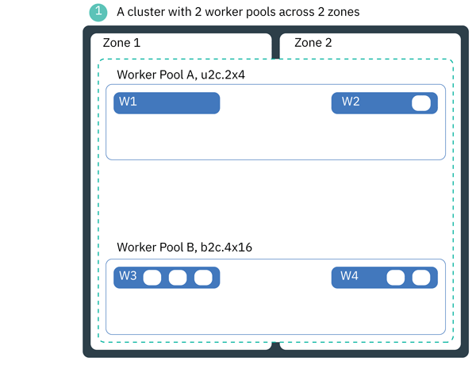

---

copyright:
  years: 2014, 2020
lastupdated: "2020-01-02"

keywords: kubernetes, iks, node scaling, ca, autoscaler

subcollection: containers

---

{:new_window: target="_blank"}
{:shortdesc: .shortdesc}
{:screen: .screen}
{:pre: .pre}
{:table: .aria-labeledby="caption"}
{:codeblock: .codeblock}
{:tip: .tip}
{:note: .note}
{:important: .important}
{:deprecated: .deprecated}
{:download: .download}
{:preview: .preview} 
{:gif: data-image-type='gif'}

# Autoscaling clusters
{: #ca}

With the `ibm-iks-cluster-autoscaler` plug-in, you can scale the worker pools in your {{site.data.keyword.containerlong}} cluster automatically to increase or decrease the number of worker nodes in the worker pool based on the sizing needs of your scheduled workloads. The `ibm-iks-cluster-autoscaler` plug-in is based on the [Kubernetes Cluster-Autoscaler project ](https://github.com/kubernetes/autoscaler/tree/master/cluster-autoscaler).
{: shortdesc}


Want to autoscale your pods instead? Check out [Scaling apps](/docs/containers?topic=containers-app#app_scaling).
{: tip}


The cluster autoscaler is available for standard clusters that are set up with public network connectivity. If your cluster cannot access the public network, such as a private cluster behind a firewall or a cluster with only the private service endpoint enabled, see [Using the cluster autoscaler for a private network-only cluster](#ca_private_cluster).
{: important}

## Understanding scale-up and scale-down
{: #ca_about}


The cluster autoscaler periodically scans the cluster to adjust the number of worker nodes within the worker pools that it manages in response to your workload resource requests and any custom settings that you configure, such as scanning intervals. Every minute, the cluster autoscaler checks for the following situations.
{: shortdesc}

*   **Pending pods to scale up**: A pod is considered pending when insufficient compute resources exist to schedule the pod on a worker node. When the cluster autoscaler detects pending pods, the autoscaler scales up your worker nodes evenly across zones to meet the workload resource requests.
*   **Underutilized worker nodes to scale down**: By default, worker nodes that run with less than 50% of the total compute resources that are requested for 10 minutes or more and that can reschedule their workloads onto other worker nodes are considered underutilized. If the cluster autoscaler detects underutilized worker nodes, it scales down your worker nodes one at a time so that you have only the compute resources that you need. If you want, you can [customize](/docs/containers?topic=containers-ca#ca_chart_values) the default scale-down utilization threshold of 50% for 10 minutes.

Scanning and scaling up and down happens at regular intervals over time, and depending on the number of worker nodes might take a longer period of time to complete, such as 30 minutes.

The cluster autoscaler adjusts the number of worker nodes by considering the [resource requests ](https://kubernetes.io/docs/concepts/configuration/manage-compute-resources-container/) that you define for your deployments, not actual worker node usage. If your pods and deployments don't request appropriate amounts of resources, you must adjust their configuration files. The cluster autoscaler can't adjust them for you. Also, keep in mind that worker nodes use some of their compute resources for basic cluster functionality, default and custom [add-ons](/docs/containers?topic=containers-update#addons), and [resource reserves](/docs/containers?topic=containers-planning_worker_nodes#resource_limit_node).
{: note}

<br>
**What does scaling up and down look like?**<br>
In general, the cluster autoscaler calculates the number of worker nodes that your cluster needs to run its workload. Scaling the cluster up or down depends on many factors, including the following.
*   The minimum and maximum worker node size per zone that you set.
*   Your pending pod resource requests and certain metadata that you associate with the workload, such as anti-affinity, labels to place pods only on certain flavors, or [pod disruption budgets](https://kubernetes.io/docs/concepts/workloads/pods/disruptions/).
*   The worker pools that the cluster autoscaler manages, potentially across zones in a [multizone cluster](/docs/containers?topic=containers-ha_clusters#multizone).
*   The [custom Helm chart values](#ca_chart_values) that are set, such as skipping worker nodes for deletion if they use local storage.

For more information, see the Kubernetes Cluster Autoscaler FAQs for [How does scale-up work? ](https://github.com/kubernetes/autoscaler/blob/master/cluster-autoscaler/FAQ.md#how-does-scale-up-work) and [How does scale-down work? ](https://github.com/kubernetes/autoscaler/blob/master/cluster-autoscaler/FAQ.md#how-does-scale-down-work).

<br>

**Can I change how scale-up and scale-down work?**<br>
You can customize settings or use other Kubernetes resources to affect how scaling up and down work.
* **Scale-up**: [Customize the cluster autoscaler Helm chart values](#ca_chart_values) such as `scanInterval`, `expander`, `skipNodes`, or `maxNodeProvisionTime`. Review ways to [overprovision worker nodes](#ca_scaleup) so that you can scale up worker nodes before a worker pool runs out of resources. You can also [set up Kubernetes pod budget disruptions and pod priority cutoffs](#scalable-practices-apps) to affect how scaling up works.
* **Scale-down**: [Customize the cluster autoscaler Helm chart values](#ca_chart_values) such as `scaleDownUnneededTime`, `scaleDownDelayAfterAdd`, `scaleDownDelayAfterDelete`, or `scaleDownUtilizationThreshold`.

<br>
**Can I set the minimum size per zone to immediately scale up my cluster to that size?**<br>
No, setting a `minSize` does not automatically trigger a scale-up. The `minSize` is a threshold so that the cluster autoscaler does not scale below a certain number of worker nodes per zone. If your cluster does not yet have that number per zone, the cluster autoscaler does not scale up until you have workload resource requests that require more resources. For example, if you have a worker pool with one worker node per three zones (three total worker nodes) and set the `minSize` to `4` per zone, the cluster autoscaler does not immediately provision an additional three worker nodes per zone (12 worker nodes total). Instead, the scale-up is triggered by resource requests. If you create a workload that requests the resources of 15 worker nodes, the cluster autoscaler scales up the worker pool to meet this request. Now, the `minSize` means that the cluster autoscaler does not scale down below four worker nodes per zone even if you remove the workload that requests the amount.

<br>
**How is this behavior different from worker pools that are not managed by the cluster autoscaler?**<br>
When you [create a worker pool](/docs/containers?topic=containers-add_workers#add_pool), you specify how many worker nodes per zone it has. The worker pool maintains that number of worker nodes until you [resize](/docs/containers?topic=containers-cli-plugin-kubernetes-service-cli#cs_worker_pool_resize) or [rebalance](/docs/containers?topic=containers-cli-plugin-kubernetes-service-cli#cs_rebalance) it. The worker pool does not add or remove worker nodes for you. If you have more pods than can be scheduled, the pods remain in pending state until you resize the worker pool.

When you enable the cluster autoscaler for a worker pool, worker nodes are scaled up or down in response to your pod spec settings and resource requests. You don't need to resize or rebalance the worker pool manually.

<br>
**Can I see an example of how the cluster autoscaler scales up and down?**<br>
Consider the following image for an example of scaling the cluster up and down.

_Figure: Autoscaling a cluster up and down._
{: gif}

1.  The cluster has four worker nodes in two worker pools that are spread across two zones. Each pool has one worker node per zone, but **Worker Pool A** has a flavor of `u3c.2x4` and **Worker Pool B** has a flavor of `b2c.4x16`. Your total compute resources are roughly 10 cores (2 cores x 2 worker nodes for **Worker Pool A**, and 4 cores x 2 worker nodes for **Worker Pool B**). Your cluster currently runs a workload that requests 6 of these 10 cores. Additional computing resources are taken up on each worker node by the [reserved resources](/docs/containers?topic=containers-planning_worker_nodes#resource_limit_node) that are required to run the cluster, worker nodes, and any add-ons such as the cluster autoscaler.
2.  The cluster autoscaler is configured to manage both worker pools with the following minimum and maximum size-per-zone:
    *  **Worker Pool A**: `minSize=1`, `maxSize=5`.
    *  **Worker Pool B**: `minSize=1`, `maxSize=2`.
3.  You schedule deployments that require 14 additional pod replicas of an app that requests one core of CPU per replica. One pod replica can be deployed on the current resources, but the other 13 are pending.
4.  The cluster autoscaler scales up your worker nodes within these constraints to support the additional 13 pod replicas resource requests.
    *  **Worker Pool A**: Seven worker nodes are added in a round-robin method as evenly as possible across the zones. The worker nodes increase the cluster compute capacity by roughly 14 cores (2 cores x 7 worker nodes).
    *  **Worker Pool B**: Two worker nodes are added evenly across the zones, reaching the `maxSize` of two worker nodes per zone. The worker nodes increase cluster capacity by roughly 8 cores (4 cores x 2 worker node).
5.  The 20 pods with one-core requests are distributed as follows across the worker nodes. Because worker nodes have resource reserves as well as pods that run to cover default cluster features, the pods for your workload cannot use all the available compute resources of a worker node. For example, although the `b2c.4x16` worker nodes have four cores, only three pods that request a minimum of one core each can be scheduled onto the worker nodes.
    <table summary="A table that describes the distribution of workload in scaled cluster.">
    <caption>Distribution of workload in scaled cluster.</caption>
    <thead>
    <tr>
      <th>Worker Pool</th>
      <th>Zone</th>
      <th>Type</th>
      <th># worker nodes</th>
      <th># pods</th>
    </tr>
    </thead>
    <tbody>
    <tr>
      <td>A</td>
      <td>dal10</td>
      <td>u3c.2x4</td>
      <td>Four nodes</td>
      <td>Three pods</td>
    </tr>
    <tr>
      <td>A</td>
      <td>dal12</td>
      <td>u3c.2x4</td>
      <td>Five nodes</td>
      <td>Five pods</td>
    </tr>
    <tr>
      <td>B</td>
      <td>dal10</td>
      <td>b2c.4x16</td>
      <td>Two nodes</td>
      <td>Six pods</td>
    </tr>
    <tr>
      <td>B</td>
      <td>dal12</td>
      <td>b2c.4x16</td>
      <td>Two nodes</td>
      <td>Six pods</td>
    </tr>
    </tbody>
    </table>
6.  You no longer need the additional workload, so you delete the deployment. After a short period of time, the cluster autoscaler detects that your cluster no longer needs all its compute resources and scales down the worker nodes one at a time.
7.  Your worker pools are scaled down. The cluster autoscaler scans at regular intervals to check for pending pod resource requests and underutilized worker nodes to scale your worker pools up or down.

## Following scalable deployment practices
{: #scalable-practices}

Make the most out of the cluster autoscaler by using the following strategies for your worker node and workload deployment strategies. For more information, see the [Kubernetes Cluster Autoscaler FAQs ](https://github.com/kubernetes/autoscaler/blob/master/cluster-autoscaler/FAQ.md).
{: shortdesc}

[Try out the cluster autoscaler](#ca_helm) with a few test workloads to get a good feel for how [scale-up and scale-down work](#ca_about), what [custom values](#ca_chart_values) you might want to configure, and any other aspects that you might want, like [overprovisioning](#ca_scaleup) worker nodes or [limiting apps](#ca_limit_pool). Then, clean up your test environment and plan to include these custom values and additional settings with a fresh installation of the cluster autoscaler.

### Can I autoscale multiple worker pools at once?
{: #scalable-practices-multiple}
Yes, after you install the Helm chart, you can choose which worker pools within the cluster to autoscale [in the configmap](#ca_cm). You can run only one `ibm-iks-cluster-autoscaler` Helm chart per cluster.
{: shortdesc}

### How can I make sure that the cluster autoscaler responds to what resources my app needs?
{: #scalable-practices-resrequests}

The cluster autoscaler scales your cluster in response to your workload [resource requests ](https://kubernetes.io/docs/concepts/configuration/manage-compute-resources-container/). As such, specify [resource requests ](https://kubernetes.io/docs/concepts/configuration/manage-compute-resources-container/) for all your deployments because the resource requests are what the cluster autoscaler uses to calculate how many worker nodes are needed to run the workload. Keep in mind that autoscaling is based on the compute usage that your workload configurations request, and does not consider other factors such as machine costs.
{: shortdesc}

### Can I scale down a worker pool to zero (0) nodes?
{: #scalable-practices-zero}

No, you cannot set the cluster autoscaler `minSize` to `0`. Additionally, unless you [disable](/docs/containers?topic=containers-cli-plugin-kubernetes-service-cli#cs_alb_configure) all public application load balancers (ALBs) in each zone of your cluster, you must change the `minSize` to `2` worker nodes per zone so that the ALB pods can be spread for high availability.
{: shortdesc}

If your worker pool has zero (0) worker nodes, the worker pool cannot be scaled. [Disable cluster autoscaling](/docs/containers?topic=containers-ca#ca_cm) for the worker pool, [manually resize the worker pool](/docs/containers?topic=containers-add_workers#resize_pool) to at least one, and [re-enable cluster autoscaling](/docs/containers?topic=containers-ca#ca_cm).

### Can I optimize my deployments for autoscaling?
{: #scalable-practices-apps}

Yes, you can add several Kubernetes features to your deployment to adjust how the cluster autoscaler considers your resource requests for scaling.
{: shortdesc}
*   Use [pod disruption budgets ](https://kubernetes.io/docs/concepts/workloads/pods/disruptions/) to prevent abrupt rescheduling or deletions of your pods.
*   If you're using pod priority, you can [edit the priority cutoff ](https://github.com/kubernetes/autoscaler/blob/master/cluster-autoscaler/FAQ.md#how-does-cluster-autoscaler-work-with-pod-priority-and-preemption) to change what types of priority trigger scaling up. By default, the priority cutoff is zero (`0`).

### Can I use taints and tolerations with autoscaled worker pools?
{: #scalable-practices-taints}

Because taints cannot be applied at the worker pool level, do not [taint worker nodes](https://kubernetes.io/docs/concepts/configuration/taint-and-toleration/) to avoid unexpected results. For example, when you deploy a workload that is not tolerated by the tainted worker nodes, the worker nodes are not considered for scale-up and more worker nodes might be ordered even if the cluster has sufficient capacity. However, the tainted worker nodes are still identified as underutilized if they have less than the threshold (by default 50%) of their resources utilized and thus are considered for scale-down.
{: shortdesc}

### Why are my autoscaled worker pools unbalanced?
{: #scalable-practices-unbalanced}

During a scale-up, the cluster autoscaler balances nodes across zones, with a permitted difference of plus or minus one (+/- 1) worker node. Your pending workloads might not request enough capacity to make each zone balanced. In this case, if you want to manually balance the worker pools, [update your cluster autoscaler configmap](#ca_cm) to remove the unbalanced worker pool. Then run the `ibmcloud ks worker-pool rebalance` [command](/docs/containers?topic=containers-cli-plugin-kubernetes-service-cli#cs_rebalance), and add the worker pool back to the cluster autoscaler configmap.
{: shortdesc}


### Why can't I resize or rebalance my worker pool?
{: #scalable-practices-resize}

When the cluster autoscaler is enabled for a worker pool, you cannot [resize](/docs/containers?topic=containers-cli-plugin-kubernetes-service-cli#cs_worker_pool_resize) or [rebalance](/docs/containers?topic=containers-cli-plugin-kubernetes-service-cli#cs_rebalance) your worker pools. You must [edit the configmap](#ca_cm) to change the worker pool minimum or maximum sizes, or disable cluster autoscaling for that worker pool. Don't use the `ibmcloud ks worker rm` [command](/docs/containers?topic=containers-cli-plugin-kubernetes-service-cli#cs_worker_rm) to remove individual worker nodes from your worker pool, which can unbalance the worker pool.
{: shortdesc}

Further, if you do not disable the worker pools before you uninstall the `ibm-iks-cluster-autoscaler` Helm chart, the worker pools cannot be resized manually. Reinstall the `ibm-iks-cluster-autoscaler` Helm chart, [edit the configmap](#ca_cm) to disable the worker pool, and try again.

<br />


## Deploying the cluster autoscaler Helm chart to your cluster
{: #ca_helm}

Install the {{site.data.keyword.cloud_notm}} cluster autoscaler plug-in with a Helm chart to autoscale worker pools in your cluster.
{: shortdesc}

**Before you begin**:

1.  [Install the required CLI and plug-ins](/docs/cli?topic=cloud-cli-getting-started):
    *  {{site.data.keyword.cloud_notm}} CLI (`ibmcloud`)
    *  {{site.data.keyword.containerlong_notm}} plug-in (`ibmcloud ks`)
    *  {{site.data.keyword.registrylong_notm}} plug-in (`ibmcloud cr`)
    *  Kubernetes (`kubectl`)
    *  Helm (`helm`)
2.  [Create a standard cluster](/docs/containers?topic=containers-clusters).
3.  [Log in to your account. If applicable, target the appropriate resource group. Set the context for your cluster.](/docs/containers?topic=containers-cs_cli_install#cs_cli_configure)
4.  Confirm that your {{site.data.keyword.cloud_notm}} Identity and Access Management credentials are stored in the cluster. The cluster autoscaler uses this secret to authenticate credentials. If the secret is missing, [create it by resetting credentials](/docs/containers?topic=containers-cs_troubleshoot_storage#missing_permissions).
    ```
    kubectl get secrets -n kube-system | grep storage-secret-store
    ```
    {: pre}
5.  The cluster autoscaler can scale only worker pools that have the `ibm-cloud.kubernetes.io/worker-pool-id` label.
    1.  Check whether your worker pool has the required label.
        ```
        ibmcloud ks worker-pool get --cluster <cluster_name_or_ID> --worker-pool <worker_pool_name_or_ID> | grep Labels
        ```
        {: pre}

        Example output of a worker pool with the label:
        ```
        Labels:             ibm-cloud.kubernetes.io/worker-pool-id=a1aa111111b22b22cc3c3cc444444d44-4d555e5
        ```
        {: screen}
    2.  If your worker pool does not have the required label, [add a new worker pool](/docs/containers?topic=containers-add_workers#add_pool) and use this worker pool with the cluster autoscaler.
6. **Private clusters only**: See [Using the cluster autoscaler for a private network-only cluster](#ca_private_cluster).

<br>
**To install the `ibm-iks-cluster-autoscaler` plug-in in your cluster**:

1.  [Follow the instructions](/docs/containers?topic=containers-helm#public_helm_install) to install the **Helm version 2.15 or later** client on your local machine, and install the Helm server (tiller) with a service account in your cluster.
2.  Verify that tiller is installed with a service account.

    ```
    kubectl get serviceaccount -n kube-system tiller
    ```
    {: pre}

    Example output:

    ```
    NAME                                 SECRETS   AGE
    tiller                               1         2m
    ```
    {: screen}
3.  Make sure that Tiller is set up with version 2.15 or later.
    1.  Check what version of Tiller is installed in your cluster.
        ```
        helm version --server
        ```
        {: pre}
    2.  If Tiller does not run version 2.15 or later, [change the Tiller version](/docs/containers?topic=containers-helm#tiller_version). The following example installs Tiller version 2.15.0.
        ```
        kubectl --namespace=kube-system set image deployments/tiller-deploy tiller=gcr.io/kubernetes-helm/tiller@sha256:561afe83feaec2999bdf6a2824d52ca5e94e226753a8f25cdf6343679836986a
        ```
        {: pre}

        If you Tiller pod errors with an `Error: ImagePullBackOff` event, make sure that your cluster can pull images on the public network, such as enabling a public gateway for VPC clusters, and try again.
        {: tip}

4.  Add and update the Helm repo where the cluster autoscaler Helm chart is.
    ```
    helm repo add iks-charts https://icr.io/helm/iks-charts
    ```
    {: pre}
    ```
    helm repo update
    ```
    {: pre}
5.  Decide if you want to [customize the cluster autoscaler settings](#ca_chart_values), such as the worker pools that are autoscaled, or the amount of time that the cluster autoscaler waits before scaling worker nodes up or down. You can customize your settings by using the `--set` flag in the `helm install` command. Depending on the settings that you want to customize, you might need to prepare multiple `--set` flags before you can install the Helm chart. For example, you might want to autoscale your default worker pool by preparing the following `--set` flag.
    ```
    --set workerpools[0].<pool_name>.max=<number_of_workers>,workerpools[0].<pool_name>.min=<number_of_workers>,workerpools[0].<pool_name>.enabled=(true|false)
    ```
    {: codeblock}

    Understanding the `--set workerpools` options:
    * **`workerpools[0]`**: The first worker pool to enable or disable for autoscaling. You must include three parameters for each worker pool for the command to succeed: the maximum number of worker nodes (`max`), the minimum number of worker nodes (`min`), and whether you want to enable (`true`) or disable (`false`) autoscaling for this worker pool. To include multiple worker pools, include a comma-separated list and increase the number in brackets, such as: `workerpools[0].default...,workerpools[1].pool1...,workerpools[2].pool2...`.
    * **`<pool_name>`**: The name or ID of the worker pool that you want to enable or disable for autoscaling. To list available worker pools, run `ibmcloud ks worker-pool ls --cluster <cluster_name_or_ID>`.
    * **`max=<number_of_workers>`**: Specify the maximum number of worker nodes per zone that the cluster autoscaler can scale up to. The value must be equal to or greater than the value that you set for the `min=<number_of_workers>` size.
    * **`min=<number_of_workers>`**: Specify the minimum number of worker nodes per zone that the cluster autoscaler can scale down to. The value must be `2` or greater so that your ALB pods can be spread for high availability. If you [disabled](/docs/containers?topic=containers-cli-plugin-kubernetes-service-cli#cs_alb_configure) all public ALBs in each zone of your standard cluster, you can set the value to `1`.<p class="note">Keep in mind that setting a `min` size does not automatically trigger a scale-up. The `min` size is a threshold so that the cluster autoscaler does not scale below this minimum number of worker nodes per zone. If your cluster does not have this number of worker nodes per zone yet, the cluster autoscaler does not scale up until you have workload resource requests that require more resources.</p>
    * **`enabled=(true|false)`**: Set the value to `true` to enable the cluster autoscaler to scale your worker pool. Set the value to `false` to stop the cluster autoscaler from scaling the worker pool. Later, if you want to [remove the cluster autoscaler](/docs/containers?topic=containers-ca#ca_rm), you must first disable each worker pool in the configmap.

6.  Install the cluster autoscaler Helm chart in the `kube-system` namespace of your cluster. In the example command, the default worker pool is enabled for autoscaling with the Helm chart installation. The worker pool details are added to the cluster autoscaler config map.
    ```
    helm install iks-charts/ibm-iks-cluster-autoscaler --namespace kube-system --name ibm-iks-cluster-autoscaler --set workerpools[0].default.max=5,workerpools[0].default.min=2,workerpools[0].default.enabled=true
    ```
    {: pre}

    Example output:
    ```
    NAME:   ibm-iks-cluster-autoscaler
    LAST DEPLOYED: Thu Nov 29 13:43:46 2018
    NAMESPACE: kube-system
    STATUS: DEPLOYED

    RESOURCES:
    ==> v1/ClusterRole
    NAME                       AGE
    ibm-iks-cluster-autoscaler  1s

    ==> v1/Pod(related)

    NAME                                        READY  STATUS             RESTARTS  AGE
    ibm-iks-cluster-autoscaler-67c8f87b96-qbb6c  0/1    ContainerCreating  0         1s

    ==> v1/ConfigMap

    NAME              AGE
    iks-ca-configmap  1s

    ==> v1/ClusterRoleBinding
    ibm-iks-cluster-autoscaler  1s

    ==> v1/Role
    ibm-iks-cluster-autoscaler  1s

    ==> v1/RoleBinding
    ibm-iks-cluster-autoscaler  1s

    ==> v1/Service
    ibm-iks-cluster-autoscaler  1s

    ==> v1beta1/Deployment
    ibm-iks-cluster-autoscaler  1s

    ==> v1/ServiceAccount
    ibm-iks-cluster-autoscaler  1s

    NOTES:
    Thank you for installing: ibm-iks-cluster-autoscaler. Your release is named: ibm-iks-cluster-autoscaler

    For more information about using the cluster autoscaler, refer to the chart README.md file.
    ```
    {: screen}

7.  Verify that the installation is successful.

    1.  Check that the cluster autoscaler pod is in a **Running** state.
        ```
        kubectl get pods --namespace=kube-system | grep ibm-iks-cluster-autoscaler
        ```
        {: pre}
        Example output:
        ```
        ibm-iks-cluster-autoscaler-8497bfc968-dbn7w   1/1       Running   0          9m
        ```
        {: screen}
    2.  Check that the cluster autoscaler service is created.
        ```
        kubectl get service --namespace=kube-system | grep ibm-iks-cluster-autoscaler
        ```
        {: pre}
        Example output:
        ```
        ibm-iks-cluster-autoscaler   ClusterIP   172.21.xxx.xx    <none>        8085/TCP        9m
        ```
        {: screen}
    3.  Optional: If you enabled autoscaling for a worker pool during the Helm chart installation, verify that the config map is correct by checking that the `workerPoolsConfig.json` field is updated and that the `workerPoolsConfigStatus` field shows a `SUCCESS` message.
        ```
        kubectl get cm iks-ca-configmap -n kube-system -o yaml
        ```
        {: pre}

        Example output where the default worker pool is enabled for autoscaling:
        ```
        apiVersion: v1
        data:
          workerPoolsConfig.json: |
            [{"name": "default", "minSize": 1, "maxSize": 2, "enabled": true }]
        kind: ConfigMap
        metadata:
          annotations:
            workerPoolsConfigStatus: '{"1:2:default":"SUCCESS"}'
          creationTimestamp: "2019-08-23T14:26:54Z"
          name: iks-ca-configmap
          namespace: kube-system
          resourceVersion: "12757878"
          selfLink: /api/v1/namespaces/kube-system/configmaps/iks-ca-configmap
          uid: bd661f95-35ef-433d-97e0-5d1ac092eafb
        ```
        {: screen}

8.  Repeat these steps for every cluster where you want to provision the cluster autoscaler.

9.  Optional: If you did not set any worker pools for autoscaling with the installation, you can [Update the cluster autoscaler configuration](#ca_cm).

<br />


## Updating the cluster autoscaler configmap to enable scaling
{: #ca_cm}

Update the cluster autoscaler configmap to enable automatically scaling worker nodes in your worker pools based on the minimum and maximum values that you set.
{: shortdesc}

After you edit the configmap to enable a worker pool, the cluster autoscaler scales your cluster in response to your workload requests. As such, you cannot [resize](/docs/containers?topic=containers-cli-plugin-kubernetes-service-cli#cs_worker_pool_resize) or [rebalance](/docs/containers?topic=containers-cli-plugin-kubernetes-service-cli#cs_rebalance) your worker pools. Scanning and scaling up and down happens at regular intervals over time, and depending on the number of worker nodes might take a longer period of time to complete, such as 30 minutes. Later, if you want to [remove the cluster autoscaler](#ca_rm), you must first disable each worker pool in the configmap.
{: note}

**Before you begin**:
*  [Install the `ibm-iks-cluster-autoscaler` plug-in](#ca_helm).
*  [Log in to your account. If applicable, target the appropriate resource group. Set the context for your cluster.](/docs/containers?topic=containers-cs_cli_install#cs_cli_configure)

**To update the cluster autoscaler configmap and values**:

1.  Edit the cluster autoscaler configmap YAML file.
    ```
    kubectl edit cm iks-ca-configmap -n kube-system -o yaml
    ```
    {: pre}
    Example output:
    ```
    apiVersion: v1
    data:
      workerPoolsConfig.json: |
        [
         {"name": "default","minSize": 1,"maxSize": 2,"enabled":false}
        ]
    kind: ConfigMap
    metadata:
      creationTimestamp: 2018-11-29T18:43:46Z
      name: iks-ca-configmap
      namespace: kube-system
      resourceVersion: "2227854"
      selfLink: /api/v1/namespaces/kube-system/configmaps/iks-ca-configmap
      uid: b45d047b-f406-11e8-b7f0-82ddffc6e65e
    ```
    {: screen}
2.  Edit the configmap with the parameters to define how the cluster autoscaler scales your cluster worker pool. **Note:** Unless you [disabled](/docs/containers?topic=containers-cli-plugin-kubernetes-service-cli#cs_alb_configure) all public application load balancers (ALBs) in each zone of your standard cluster, you must change the `minSize` to `2` per zone so that the ALB pods can be spread for high availability.

    <table>
    <caption>Cluster autoscaler configmap parameters</caption>
    <thead>
    <th id="parameter-with-default">Parameter with default value</th>
    <th id="parameter-with-description">Description</th>
    </thead>
    <tbody>
    <tr>
    <td id="parameter-name" headers="parameter-with-default">`"name": "default"`</td>
    <td headers="parameter-name parameter-with-description">Replace `"default"` with the name or ID of the worker pool that you want to scale. To list worker pools, run `ibmcloud ks worker-pool ls --cluster <cluster_name_or_ID>`.<br><br>
    To manage more than one worker pool, copy the JSON line to a comma-separated line, such as follows. <pre class="codeblock">[
     {"name": "default","minSize": 1,"maxSize": 2,"enabled":false},
     {"name": "Pool2","minSize": 2,"maxSize": 5,"enabled":true}
    ]</pre><br><br>
    <p class="note">The cluster autoscaler can scale only worker pools that have the `ibm-cloud.kubernetes.io/worker-pool-id` label. To check whether your worker pool has the required label, run `ibmcloud ks worker-pool get --cluster <cluster_name_or_ID> --worker-pool <worker_pool_name_or_ID> | grep Labels`. If your worker pool does not have the required label, [add a new worker pool](/docs/containers?topic=containers-add_workers#add_pool) and use this worker pool with the cluster autoscaler.</p></td>
    </tr>
    <tr>
    <td id="parameter-minsize" headers="parameter-with-default">`"minSize": 1`</td>
    <td headers="parameter-minsize parameter-with-description">Specify the minimum number of worker nodes per zone that the cluster autoscaler can scale down the worker pool to. The value must be `2` or greater so that your ALB pods can be spread for high availability. If you [disabled](/docs/containers?topic=containers-cli-plugin-kubernetes-service-cli#cs_alb_configure) all public ALBs in each zone of your standard cluster, you can set the value to `1`.
    <p class="note">Setting a `minSize` does not automatically trigger a scale-up. The `minSize` is a threshold so that the cluster autoscaler does not scale below a certain number of worker nodes per zone. If your cluster does not yet have that number per zone, the cluster autoscaler does not scale up until you have workload resource requests that require more resources. For example, if you have a worker pool with one worker node per three zones (three total worker nodes) and set the `minSize` to `4` per zone, the cluster autoscaler does not immediately provision an additional three worker nodes per zone (12 worker nodes total). Instead, the scale-up is triggered by resource requests. If you create a workload that requests the resources of 15 worker nodes, the cluster autoscaler scales up the worker pool to meet this request. Now, the `minSize` means that the cluster autoscaler does not scale down below four worker nodes per zone even if you remove the workload that requests the amount. For more information, see the [Kubernetes docs ](https://github.com/kubernetes/autoscaler/blob/master/cluster-autoscaler/FAQ.md#when-does-cluster-autoscaler-change-the-size-of-a-cluster).</p></td>
    </tr>
    <tr>
    <td id="parameter-maxsize" headers="parameter-with-default">`"maxSize": 2`</td>
    <td headers="parameter-maxsize parameter-with-description">Specify the maximum number of worker nodes per zone that the cluster autoscaler can scale up the worker pool to. The value must be equal to or greater than the value that you set for the `minSize`.</td>
    </tr>
    <tr>
    <td id="parameter-enabled" headers="parameter-with-default">`"enabled": false`</td>
    <td headers="parameter-enabled parameter-with-description">Set the value to `true` for the cluster autoscaler to manage scaling for the worker pool. Set the value to `false` to stop the cluster autoscaler from scaling the worker pool.<br><br>
    Later, if you want to [remove the cluster autoscaler](#ca_rm), you must first disable each worker pool in the configmap.</td>
    </tr>
    </tbody>
    </table>
3.  Save the configuration file.
4.  Get your cluster autoscaler pod.
    ```
    kubectl get pods -n kube-system
    ```
    {: pre}
5.  Review the **`Events`** section of the cluster autoscaler pod for a **`ConfigUpdated`** event to verify that the configmap is successfully updated. The event message for your configmap is in the following format: `minSize:maxSize:PoolName:<SUCCESS|FAILED>:error message`.

    ```
    kubectl describe pod -n kube-system <cluster_autoscaler_pod>
    ```
    {: pre}

    Example output:
    ```
		Name:               ibm-iks-cluster-autoscaler-857c4d9d54-gwvc6
		Namespace:          kube-system
		...
		Events:
		Type     Reason         Age   From                                        Message
		----     ------         ----  ----                                        -------

		Normal  ConfigUpdated  3m    ibm-iks-cluster-autoscaler-857c4d9d54-gwvc6  {"1:3:default":"SUCCESS:"}
    ```
    {: screen}

<p class="note">If you enable a worker pool for autoscaling and then later add a zone to this worker pool, restart the cluster autoscaler pod so that it picks up this change: `kubectl delete pod -n kube-system <cluster_autoscaler_pod>`.</p>

## Customizing the cluster autoscaler Helm chart configuration values
{: #ca_chart_values}

Customize the cluster autoscaler settings such as the amount of time it waits before scaling worker nodes up or down.
{: shortdesc}

**Before you begin**:
*  [Log in to your account. If applicable, target the appropriate resource group. Set the context for your cluster.](/docs/containers?topic=containers-cs_cli_install#cs_cli_configure)
*  [Install the `ibm-iks-cluster-autoscaler` plug-in](#ca_helm).
*  **Private clusters only**: See [Using the cluster autoscaler for a private network-only cluster](#ca_private_cluster).

**To update the cluster autoscaler values**:

1.  Review the cluster autoscaler Helm chart configuration values. The cluster autoscaler comes with default settings. However, you might want to change some values such as the scale-down or scanning intervals, depending on how often you change your cluster workloads.
    ```
    helm get values ibm-iks-cluster-autoscaler -a
    ```
    {: pre}

    Example output:
    ```
    expander: least-waste
    image:
      pullPolicy: Always
      repository: icr.io/iks-charts/ibm-iks-cluster-autoscaler
      tag: dev1
    maxNodeProvisionTime: 120m
    resources:
      limits:
        cpu: 300m
        memory: 300Mi
      requests:
        cpu: 100m
        memory: 100Mi
    scaleDownDelayAfterAdd: 10m
    scaleDownDelayAfterDelete: 10m
    scaleDownUtilizationThreshold: 0.5
    scaleDownUnneededTime: 10m
    scanInterval: 1m
    skipNodes:
      withLocalStorage: true
      withSystemPods: true
    workerpools:
    - default:
        enabled: true
        max: 2
        min: 1
    - pool1:
        enabled: false
        max: 5
        min: 3
    ```
    {: screen}

    Understanding the parameters and default values:
    <table>
    <caption>Cluster autoscaler configuration values</caption>
    <thead>
    <th>Parameter</th>
    <th>Description</th>
    <th>Default value</th>
    </thead>
    <tbody>
    <tr>
    <td>`api_route` parameter</td>
    <td>Set the [{{site.data.keyword.containerlong_notm}} API endpoint](/docs/containers?topic=containers-cli-plugin-kubernetes-service-cli#cs_cli_api) for the region that your cluster is in.</td>
    <td>No default; uses the targeted region that your cluster is in.</td>
    </tr>
    <tr>
    <td>`expander` parameter</td>
    <td>Specify how the cluster autoscaler determines which worker pool to scale if you have multiple worker pools. Possible values are:
    <ul><li>`random`: Selects randomly between `most-pods` and `least-waste`.</li>
    <li>`most-pods`: Selects the worker pool that is able to schedule the most pods when scaling up. Use this method if you are using `nodeSelector` to make sure that pods land on specific worker nodes.</li>
    <li>`least-waste`: Selects the worker pool that has the least unused CPU after scaling up. If two worker pools use the same amount of CPU resources after scaling up, the worker pool with the least unused memory is selected.</li></ul></td>
    <td>random</td>
    </tr>
    <tr>
    <td>`image.repository` parameter</td>
    <td>Specify the cluster autoscaler Docker image to use.</td>
    <td>`icr.io/iks-charts/ibm-iks-cluster-autoscaler`</td>
    </tr>
    <tr>
    <td>`image.pullPolicy` parameter</td>
    <td>Specify when to pull the Docker image. Possible values are:
    <ul><li>`Always`: Pulls the image every time that the pod is started.</li>
    <li>`IfNotPresent`: Pulls the image only if the image is not already present locally.</li>
    <li>`Never`: Assumes that the image exists locally and never pulls the image.</li></ul></td>
    <td>`IfNotPreset`</td>
    </tr>
    <tr>
    <td>`maxNodeProvisionTime` parameter</td>
    <td>Set the maximum amount of time in minutes that a worker node can take to begin provisioning before the cluster autoscaler cancels the scale-up request.</td>
    <td>`120m`</td>
    </tr>
    <tr>
    <td>`resources.limits.cpu` parameter</td>
    <td>Set the maximum amount of worker node CPU that the `ibm-iks-cluster-autoscaler` pod can consume.</td>
    <td>`300m`</td>
    </tr>
    <tr>
    <td>`resources.limits.memory` parameter</td>
    <td>Set the maximum amount of worker node memory that the `ibm-iks-cluster-autoscaler` pod can consume.</td>
    <td>`300Mi`</td>
    </tr>
    <tr>
    <td>`resources.requests.cpu` parameter</td>
    <td>Set the minimum amount of worker node CPU that the `ibm-iks-cluster-autoscaler` pod starts with.</td>
    <td>`100m`</td>
    </tr>
    <tr>
    <td>`resources.requests.memory` parameter</td>
    <td>Set the minimum amount of worker node memory that the `ibm-iks-cluster-autoscaler` pod starts with.</td>
    <td>`100Mi`</td>
    </tr>
    <tr>
    <td>`scaleDownUnneededTime` parameter</td>
    <td>Set the amount of time in minutes that a worker node must be unnecessary before it can be scaled down.</td>
    <td>`10m`</td>
    </tr>
    <tr>
    <td>`scaleDownDelayAfterAdd`, `scaleDownDelayAfterDelete` parameters</td>
    <td>Set the amount of time in minutes that the cluster autoscaler waits to start scaling actions again after scaling up (`add`) or scaling down (`delete`).</td>
    <td>`10m`</td>
    </tr>
    <tr>
    <td>`scaleDownUtilizationThreshold` parameter</td>
    <td>Set the worker node utilization threshold. If the worker node utilization goes below the threshold, the worker node is considered to be scaled down. Worker node utilization is calculated as the sum of the CPU and memory resources that are requested by all pods that run on the worker node, divided by the worker node resource capacity.</td>
    <td>`0.5`</td>
    </tr>
    <tr>
    <td>`scanInterval` parameter</td>
    <td>Set how often in minutes that the cluster autoscaler scans for workload usage that triggers scaling up or down.</td>
    <td>`1m`</td>
    </tr>
    <tr>
    <td>`skipNodes.withLocalStorage` parameter</td>
    <td>When set to `true`, worker nodes that have pods that are saving data to local storage are not scaled down.</td>
    <td>`true`</td>
    </tr>
    <tr>
    <td>`skipNodes.withSystemPods` parameter</td>
    <td>When set to `true`, worker nodes that have `kube-system` pods are not scaled down. Do not set the value to `false` because scaling down `kube-system` pods might have unexpected results.</td>
    <td>`true`</td>
    </tr>
    <tr>
    <td>`ignoreDaemonSetsUtilization`</td>
    <td>When set to `true`, the cluster autoscaler ignores DaemonSet pods when it calculates resource utilization for scale-down.</td>
    <td>`false`</td>
    </tr>
    <tr>
    <td>`maxBulkSoftTaintCount`</td>
    <td>Set the maximum number of worker nodes that can be tainted or untainted with `PreferNoSchedule` at the same time. To disable this feature, set to `0`.</td>
    <td>`0`</td>
    </tr>
    <tr>
    <td>`maxBulkSoftTaintTime` </td>
    <td>Set the maximum amount of time that worker nodes can be tainted or untainted with `PreferNoSchedule` at the same time.</td>
    <td>`10m`</td>
    </tr>
     <tr>
    <td>`workerpools` parameter</td>
    <td>The worker pools that you want to autoscale, including their minimum and maximum number of worker nodes per zone. These settings are mirrored in the [cluster autoscaler config map](#ca_cm). To set the worker pool, format the option as as follows: <code>--set workerpools[0].<pool_name>.max=<number_of_workers>,workerpools[0].<pool_name>.min=<number_of_workers>,workerpools[0].<pool_name>.enabled=(true|false)</code><br><br>
    Understanding the `--set workerpools` options:
      <ul><li>**`workerpools[0]`**: The first worker pool to enable or disable for autoscaling. You must include three parameters for each worker pool for the command to succeed: the maximum number of worker nodes (`max`), the minimum number of worker nodes (`min`), and whether you want to enable (`true`) or disable (`false`) autoscaling for this worker pool. To include multiple worker pools, include a comma-separated list and increase the number in brackets, such as: `workerpools[0].default...,workerpools[1].pool1...,workerpools[2].pool2...`.</li>
      <li>**`<pool_name>`**: The name or ID of the worker pool that you want to enable or disable for autoscaling. To list available worker pools, run `ibmcloud ks worker-pool ls --cluster <cluster_name_or_ID>`.</li>
      <li>**`max=<number_of_workers>`**: Specify the maximum number of worker nodes per zone that the cluster autoscaler can scale up to. The value must be equal to or greater than the value that you set for the `min=<number_of_workers>` size.</li>
      <li>**`min=<number_of_workers>`**: Specify the minimum number of worker nodes per zone that the cluster autoscaler can scale down to. The value must be `2` or greater so that your ALB pods can be spread for high availability. If you [disabled](/docs/containers?topic=containers-cli-plugin-kubernetes-service-cli#cs_alb_configure) all public ALBs in each zone of your standard cluster, you can set the value to `1`.<p class="note">Keep in mind that setting a `min` size does not automatically trigger a scale-up. The `min` size is a threshold so that the cluster autoscaler does not scale below this minimum number of worker nodes per zone. If your cluster does not have this number of worker nodes per zone yet, the cluster autoscaler does not scale up until you have workload resource requests that require more resources.</p></li>
      <li>**`enabled=(true|false)`**: Set the value to `true` to enable the cluster autoscaler to scale your worker pool. Set the value to `false` to stop the cluster autoscaler from scaling the worker pool. Later, if you want to [remove the cluster autoscaler](/docs/containers?topic=containers-ca#ca_rm), you must first disable each worker pool in the configmap.</li></ul>
      <p class="note">If you enable a worker pool for autoscaling and then later add a zone to this worker pool, restart the cluster autoscaler pod so that it picks up this change: `kubectl delete pod -n kube-system <cluster_autoscaler_pod>`.</p>
      <br><br>By default, the `default` worker pool is **not** enabled, with a `max` value of `2` and a `min` value of `1`.</td>
    <td>Disabled</td>
    </tr>
    </tbody>
    </table>
2.  To change any of the cluster autoscaler configuration values, update the Helm chart with the new values. Include the `--recreate-pods` flag so that any existing cluster autoscaler pods are re-created to pick up the custom setting changes. The following example command changes the scan interval to `2m` and enables autoscaling for the `default` worker pool, with a maximum of `5` and minimum of `3` worker nodes per zone.
    ```
    helm upgrade --set scanInterval=2m --set workerpools[0].default.max=5,workerpools[0].default.min=3,workerpools[0].default.enabled=true ibm-iks-cluster-autoscaler iks-charts/ibm-iks-cluster-autoscaler -i --recreate-pods --namespace kube-system
    ```
    {: pre}

    To reset the chart to the default values:
    ```
    helm upgrade --reset-values ibm-iks-cluster-autoscaler iks-charts/ibm-iks-cluster-autoscaler --recreate-pods
    ```
    {: pre}
3.  To verify your changes, review the Helm chart values again.
    ```
    helm get values ibm-iks-cluster-autoscaler -a
    ```
    {: pre}

## Limiting apps to run on only certain autoscaled worker pools
{: #ca_limit_pool}

To limit a pod deployment to a specific worker pool that is managed by the cluster autoscaler, use labels and `nodeSelector` or `nodeAffinity`. With `nodeAffinity`, you have more control over how the scheduling behavior works to match pods to worker nodes. For more information about assigning pods to worker nodes, [see the Kubernetes docs ](https://kubernetes.io/docs/concepts/configuration/assign-pod-node/).
{: shortdesc}

**Before you begin**:
*  [Install the `ibm-iks-cluster-autoscaler` plug-in](#ca_helm).
*  [Log in to your account. If applicable, target the appropriate resource group. Set the context for your cluster.](/docs/containers?topic=containers-cs_cli_install#cs_cli_configure)

**To limit pods to run on certain autoscaled worker pools**:

1.  Create the worker pool with the label that you want to use. For example, your label might be `app: nginx`.
  * Classic clusters:
    ```
    ibmcloud ks worker-pool create classic --name <name> --cluster <cluster_name_or_ID> --machine-type <flavor> --size-per-zone <number_of_worker_nodes> --label <key>=<value>
    ```
    {: pre}
  * VPC Generation 1 clusters:
    ```
    ibmcloud ks worker-pool create vpc-classic --name <name> --cluster <cluster_name_or_ID> --flavor <flavor> --size-per-zone <number_of_worker_nodes> --label <key>=<value>
    ```
    {: pre}
    
2.  [Add the worker pool to the cluster autoscaler configuration](#ca_cm).
3.  In your pod spec template, match the `nodeSelector` or `nodeAffinity` to the label that you used in your worker pool.

    Example of `nodeSelector`:
    ```
    ...
    spec:
      containers:
      - name: nginx
        image: nginx
        imagePullPolicy: IfNotPresent
      nodeSelector:
        app: nginx
    ...
    ```
    {: codeblock}

    Example of `nodeAffinity`:
    ```
    spec:
      containers:
      - name: nginx
        image: nginx
        imagePullPolicy: IfNotPresent
      affinity:
        nodeAffinity:
          requiredDuringSchedulingIgnoredDuringExecution:
            nodeSelectorTerms:
            - matchExpressions:
              - key: app
                operator: In
                values:
                - nginx
    ```
    {: codeblock}
4.  Deploy the pod. Because of the matching label, the pod is scheduled onto a worker node that is in the labeled worker pool.
    ```
    kubectl apply -f pod.yaml
    ```
    {: pre}

<br />


## Scaling up worker nodes before the worker pool has insufficient resources
{: #ca_scaleup}

As described in the [Understanding how the cluster autoscaler works](#ca_about) topic and the [Kubernetes Cluster Autoscaler FAQs ](https://github.com/kubernetes/autoscaler/blob/master/cluster-autoscaler/FAQ.md), the cluster autoscaler scales up your worker pools in response to your requested resources of the workload against the available recourses of the worker pool. However, you might want the cluster autoscaler to scale up worker nodes before the worker pool runs out of resources. In this case, your workload does not need to wait as long for worker nodes to be provisioned because the worker pool is already scaled up to meet the resource requests.
{: shortdesc}

The cluster autoscaler does not support early scaling (overprovisioning) of worker pools. However, you can configure other Kubernetes resources to work with the cluster autoscaler to achieve early scaling.

<dl>
  <dt><strong>Pause pods</strong></dt>
  <dd>You can create a deployment that deploys [pause containers ](https://stackoverflow.com/questions/48651269/what-are-the-pause-containers) in pods with specific resource requests, and assign the deployment a low pod priority. When these resources are needed by higher priority workloads, the pause pod is preempted and becomes a pending pod. This event triggers the cluster autoscaler to scale up.<br><br>For more information about setting up a pause pod deployment, see the [Kubernetes FAQ ](https://github.com/kubernetes/autoscaler/blob/master/cluster-autoscaler/FAQ.md#how-can-i-configure-overprovisioning-with-cluster-autoscaler). You can use [this example overprovisioning configuration file ](https://github.com/IBM-Cloud/kube-samples/blob/master/ibm-ks-cluster-autoscaler/overprovisioning-autoscaler.yaml) to create the priority class, service account, and deployments.<p class="note">If you use this method, make sure that you understand how [pod priority](/docs/containers?topic=containers-pod_priority) works and how to set pod priority for your deployments. For example, if the pause pod does not have enough resources for a higher priority pod, the pod is not preempted. The higher priority workload remains in pending, so the cluster autoscaler is triggered to scale up. However, in this case, the scale-up action is not early because the workload that you want to run cannot be scheduled because of insufficient resources.</p></dd>

  <dt><strong>Horizontal pod autoscaling (HPA)</strong></dt>
  <dd>Because horizontal pod autoscaling is based on the average CPU usage of the pods, the CPU usage limit that you set is reached before the worker pool runs out of resources. More pods are requested, which then triggers the cluster autoscaler to scale up the worker pool.<br><br>For more information about setting up HPA, see the [Kubernetes docs ](https://kubernetes.io/docs/tasks/run-application/horizontal-pod-autoscale-walkthrough/).</dd>
</dl>

<br />


## Updating the cluster autoscaler Helm chart
{: #ca_helm_up}

You can update the existing cluster autoscaler Helm chart to the latest version. To check your current Helm chart version, run `helm ls | grep cluster-autoscaler`.
{: shortdesc}

Updating to the latest Helm chart from version 1.0.2 or earlier? [Follow these instructions](#ca_helm_up_102).
{: note}

**Before you begin**:
* [Log in to your account. If applicable, target the appropriate resource group. Set the context for your cluster.](/docs/containers?topic=containers-cs_cli_install#cs_cli_configure)
* **Private clusters only**: See [Using the cluster autoscaler for a private network-only cluster](#ca_private_cluster).
* For a changelog of chart versions, [download the source code `tar` file ](https://cloud.ibm.com/kubernetes/helm/iks-charts/ibm-iks-cluster-autoscaler) and open the `RELEASENOTES.MD` file.

**To update the cluster autoscaler Helm chart**:
1.  Update the Helm repo to retrieve the latest version of all Helm charts in this repo.
    ```
    helm repo update
    ```
    {: pre}

2.  Optional: Download the latest Helm chart to your local machine. Then, extract the package and review the `release.md` file to find the latest release information.
    ```
    helm fetch iks-charts/ibm-iks-cluster-autoscaler
    ```
    {: pre}

3.  Find the name of the cluster autoscaler Helm chart that you installed in your cluster.
    ```
    helm ls | grep cluster-autoscaler
    ```
    {: pre}

    Example output:
    ```
    myhelmchart 	1       	Mon Jan  7 14:47:44 2019	DEPLOYED	ibm-ks-cluster-autoscaler-1.0.0  	kube-system
    ```
    {: screen}

4.  Update the cluster autoscaler Helm chart to the latest version.
    ```
    helm upgrade --force --recreate-pods <helm_chart_name>  iks-charts/ibm-iks-cluster-autoscaler
    ```
    {: pre}

5.  Verify that the [cluster autoscaler configmap](#ca_cm) `workerPoolsConfig.json` section is set to `"enabled": true` for the worker pools that you want to scale.
    ```
    kubectl describe cm iks-ca-configmap -n kube-system
    ```
    {: pre}

    Example output:
    ```
    Name:         iks-ca-configmap
    Namespace:    kube-system
    Labels:       <none>
    Annotations:  kubectl.kubernetes.io/last-applied-configuration={"apiVersion":"v1","data":{"workerPoolsConfig.json":"[\n {\"name\": \"docs\",\"minSize\": 1,\"maxSize\": 3,\"enabled\":true}\n]\n"},"kind":"ConfigMap",...

    Data
    ====
    workerPoolsConfig.json:
    ----
    [
     {"name": "docs","minSize": 1,"maxSize": 3,"enabled":true}
    ]

    Events:  <none>
    ```
    {: screen}

### Updating to the latest Helm chart from version 1.0.2 or earlier
{: #ca_helm_up_102}

The latest Helm chart version of the cluster autoscaler requires a full removal of previously installed cluster autoscaler Helm chart versions. If you installed the Helm chart version 1.0.2 or earlier, uninstall that version first before you install the latest Helm chart of the cluster autoscaler.
{: shortdesc}

Before you begin: [Log in to your account. If applicable, target the appropriate resource group. Set the context for your cluster.](/docs/containers?topic=containers-cs_cli_install#cs_cli_configure)

1.  Get your cluster autoscaler configmap.
    ```
    kubectl get cm iks-ca-configmap -n kube-system -o yaml > iks-ca-configmap.yaml
    ```
    {: pre}
2.  Remove all worker pools from the configmap by setting the `"enabled"` value to `false`.
    ```
    kubectl edit cm iks-ca-configmap -n kube-system
    ```
    {: pre}
3.  If you applied custom settings to the Helm chart, note your custom settings.
    ```
    helm get values ibm-ks-cluster-autoscaler -a
    ```
    {: pre}
4.  Uninstall your current Helm chart.
    ```
    helm delete --purge ibm-ks-cluster-autoscaler
    ```
    {: pre}
5.  Update the Helm chart repo to get the latest cluster autoscaler Helm chart version.
    ```
    helm repo update
    ```
    {: pre}
6.  Install the latest cluster autoscaler Helm chart. Apply any custom settings that you previously used with the `--set` flag, such as `scanInterval=2m`.
    ```
    helm install  iks-charts/ibm-iks-cluster-autoscaler --namespace kube-system --name ibm-iks-cluster-autoscaler [--set <custom_settings>]
    ```
    {: pre}
7.  Apply the cluster autoscaler configmap that you previously retrieved to enable autoscaling for your worker pools.
    ```
    kubectl apply -f iks-ca-configmap.yaml
    ```
    {: pre}
8.  Get your cluster autoscaler pod.
    ```
    kubectl get pods -n kube-system
    ```
    {: pre}
9.  Review the **`Events`** section of the cluster autoscaler pod and look for a **`ConfigUpdated`** event to verify that the configmap is successfully updated. The event message for your configmap is in the following format: `minSize:maxSize:PoolName:<SUCCESS|FAILED>:error message`.
    ```
    kubectl describe pod -n kube-system <cluster_autoscaler_pod>
    ```
    {: pre}

    Example output:
    ```
		Name:               ibm-iks-cluster-autoscaler-857c4d9d54-gwvc6
		Namespace:          kube-system
		...
		Events:
		Type     Reason         Age   From                                        Message
		----     ------         ----  ----                                        -------

		Normal  ConfigUpdated  3m    ibm-iks-cluster-autoscaler-857c4d9d54-gwvc6  {"1:3:default":"SUCCESS:"}
    ```
    {: screen}

<br />


## Using the cluster autoscaler for a private network-only cluster
{: #ca_private_cluster}

The cluster autoscaler is available for standard clusters that are set up with public network connectivity. If your cluster cannot access the public network, such as a private cluster behind a firewall or a cluster with only the private service endpoint enabled, you must temporarily open the required ports or temporarily enable the public service endpoint to install, update, or customize the cluster autoscaler. After the cluster autoscaler is installed, you can close the ports or disable the public service endpoint.
{: shortdesc}

If your account is not enabled for VRF and service endpoints, you can [open the required ports](/docs/containers?topic=containers-firewall#vyatta_firewall) to allow public network connectivity in your cluster.
{: tip}

Before you begin: [Log in to your account. If applicable, target the appropriate resource group. Set the context for your cluster.](/docs/containers?topic=containers-cs_cli_install#cs_cli_configure)

1.  Set up Helm for your private network-only cluster. You can choose between the following options.
    * [Pushing the Helm Tiller image to your namespace in {{site.data.keyword.registrylong_notm}}](/docs/containers?topic=containers-helm#private_local_tiller).
    * [Installing a Helm chart without Tiller](/docs/containers?topic=containers-helm#private_install_without_tiller).
2.  Temporarily enable public connectivity to your cluster to install, update, or customize the cluster autoscaler.
    * If your cluster is protected from the public network by a firewall, [open the required ports in your firewall](/docs/containers?topic=containers-firewall).
    * If your cluster has only the private service endpoint enabled, [enable the public service endpoint](/docs/containers?topic=containers-cs_network_cluster#set-up-public-se).
3.  [Install](#ca_helm), [update](#ca_helm_up), or [configure](#ca_chart_values) the cluster autoscaler Helm chart.
4.  After you configure the cluster autoscaler, you can close the ports or [disable the public service endpoint](/docs/containers?topic=containers-cs_network_cluster#set-up-public-se).
5.  Make sure that the `storage-secret-store` secret in the `kube-system` namespace uses the private service endpoint. If you initially created the cluster with a private service endpoint, the endpoint is already added to the secret.
    1.  Download the secret to get the encoded secret information from the `data` field of the secret file.
        ```
        kubectl get secret storage-secret-store -n kube-system -o yaml > storage-secret-store.yaml
        ```
        {: pre}
        Example output:
        ```
        apiVersion: v1
        data:
          slclient.toml: W0J...
        ```
        {: screen}
    2.  Decode the value of the `data` field.
        ```
        echo "<W0J...>" | base64 -D
        ```
        {: pre}
        Example output:
        ```
        [Bluemix]
          iam_url = "https://iam.bluemix.net"
          iam_client_id = "bx"
          iam_client_secret = "bx"
          iam_api_key = "<key>"
          refresh_token = ""
          pay_tier = "paid"
          containers_api_route = "https://us-south.containers.cloud.ibm.com"
          encryption = true
          containers_api_route_private = "https://private.us-south.containers.cloud.ibm.com"

        [Softlayer]
          encryption = true
          softlayer_username = ""
          softlayer_api_key = ""
          softlayer_endpoint_url = "https://api.service.softlayer.com/rest/v3"
          softlayer_iam_endpoint_url = "https://api.service.softlayer.com/mobile/v3"
          softlayer_datacenter = "dal10"
          softlayer_token_exchange_endpoint_url = "https://iam.bluemix.net"

        [VPC]
          gc_token_exchange_endpoint_url = "https://iam.bluemix.net"
          gc_riaas_endpoint_url = "https://us-south.iaas.cloud.ibm.com:443"
          gc_api_key = "<key>"
        ```
        {: screen}
    3.  Verify that the `containers_api_route_private` field includes the `private` service endpoint address.
    4.  If the `containers_api_route_private` field is not in the secret, add it to the string by appending `private.` to the `containers_api_route` address. For example:
        ```
        containers_api_route = "https://us-south.containers.cloud.ibm.com"
        containers_api_route_private = "https://private.us-south.containers.cloud.ibm.com"
        ```
        {: screen}
    5.  Encode the full string.
        ```
        echo -n '[Bluemix]iam_url....' | openssl base64
        ```
        {: pre}
    6.  Open the `storage-secret-store.yaml` file and replace the `data.slclient.toml` and `metadata.annotations` strings with the new encoded string with the private service endpoint.
    7.  Apply the secret changes to your cluster.
        ```
        kubectl apply -f storage-secret-store.yaml
        ```
        {: pre}

<br />


## Removing the cluster autoscaler
{: #ca_rm}

If you do not want to automatically scale your worker pools, you can uninstall the cluster autoscaler Helm chart. After the removal, you must [resize](/docs/containers?topic=containers-cli-plugin-kubernetes-service-cli#cs_worker_pool_resize) or [rebalance](/docs/containers?topic=containers-cli-plugin-kubernetes-service-cli#cs_rebalance) your worker pools manually.
{: shortdesc}

Before you begin: [Log in to your account. If applicable, target the appropriate resource group. Set the context for your cluster.](/docs/containers?topic=containers-cs_cli_install#cs_cli_configure)

1.  In the [cluster autoscaler configmap](#ca_cm), remove the worker pool by setting the `"enabled"` value to `false`.
    ```
    kubectl edit cm iks-ca-configmap -n kube-system
    ```
    {: pre}
    Example output:
    ```
    apiVersion: v1
    data:
      workerPoolsConfig.json: |
        [
         {"name": "default","minSize": 1,"maxSize": 2,"enabled":false},
         {"name":"mypool","minSize":1,"maxSize":5,"enabled":false}
        ]
    kind: ConfigMap
    ...
    ```
    {: screen}

    If you already deleted the Helm chart and see a message such as `iks-ca-configmap not found`, [redeploy the cluster autoscaler Helm chart](#ca_helm) to your cluster and try to remove it again.
    {: tip}

2.  List your existing Helm charts and note the name of the cluster autoscaler.
    ```
    helm ls
    ```
    {: pre}
3.  Remove the existing Helm chart from your cluster.
    ```
    helm delete --purge <ibm-iks-cluster-autoscaler_name>
    ```
    {: pre}


