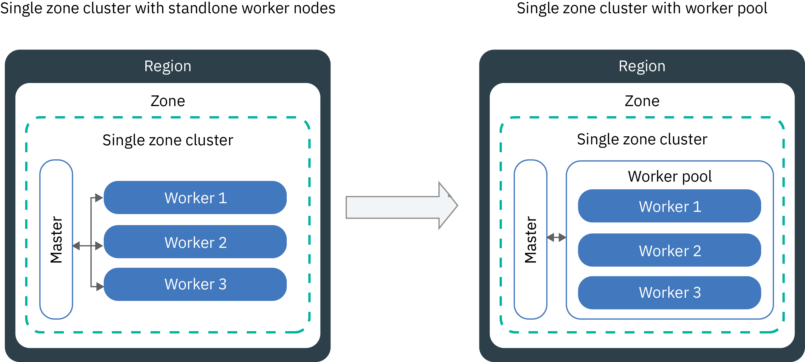

---

copyright:
  years: 2014, 2023
lastupdated: "2023-02-20"

keywords: kubernetes, upgrade, version

subcollection: containers

---

{{site.data.keyword.attribute-definition-list}}


# Updating clusters, worker nodes, and cluster components
{: #update}

You can install updates to keep your Kubernetes clusters up-to-date in {{site.data.keyword.containerlong}}.
{: shortdesc}

## Updating the Kubernetes master
{: #master}

Periodically, the Kubernetes project releases [major, minor, or patch updates](/docs/containers?topic=containers-cs_versions#update_types). Updates can affect the Kubernetes API server version or other components in your Kubernetes master. IBM updates the patch version, but you must update the master major and minor versions.
{: shortdesc}

### About updating the master
{: #master-about}

How do I know when to update the master?
:   You are notified in the {{site.data.keyword.cloud_notm}} console and CLI when updates are available, and can also check the [supported versions](/docs/containers?topic=containers-cs_versions) page.

How many versions behind the latest can the master be?
:   IBM generally supports three versions of Kubernetes at a time. You can update the Kubernetes API server only to the next version ahead of its current version (`n+1`). Additionally, your worker nodes can be up to two versions behind the master version (`n-2`).

For example, if your current Kubernetes API server version is 1.18 (`n`) and you want to update to 1.20, you must first update to 1.19 (`n+1`) and then to 1.20 (`n+2`). Next, you can update the worker nodes up to two version ahead, such as 1.18 to 1.20 (`n+2`).

If your cluster runs an unsupported Kubernetes version, follow the [version archive instructions](/docs/containers?topic=containers-cs_versions#k8s_version_archive). To avoid getting in an unsupported state and operational impact, keep your cluster up-to-date.

Can my worker nodes run a later version than the master?
:   Your worker nodes can't run a later `major.minor` Kubernetes version than the master. Additionally, your worker nodes can be only up to two versions behind the master version (`n-2`). First, [update your master](#update_master) to the latest Kubernetes version. Then, [update the worker nodes](#worker_node) in your cluster.

Worker nodes can run later patch versions than the master, such as patch versions that are specific to worker nodes for security updates.

How are patch updates applied?
:   By default, patch updates for the master are applied automatically over the course of several days, so a master patch version might show up as available before it is applied to your master. The update automation also skips clusters that are in an unhealthy state or have operations currently in progress. Occasionally, IBM might disable automatic updates for a specific master fix pack, such as a patch that is only needed if a master is updated from one minor version to another. In any of these cases, you can [check the versions change log](/docs/containers?topic=containers-changelog) for any potential impact and choose to safely use the `ibmcloud ks cluster master update` [command](/docs/containers?topic=containers-kubernetes-service-cli#cs_cluster_update) yourself without waiting for the update automation to apply.

Unlike the master, you must update your workers for each patch version.


What happens during the master update?
:   Your master is highly available with three replica master pods. The master pods have a rolling update, during which only one pod is unavailable at a time. Two instances are up and running so that you can access and change the cluster during the update. Your worker nodes, apps, and resources continue to run.

Can I roll back the update?
:   No, you can't roll back a cluster to a previous version after the update process takes place. Be sure to use a test cluster and follow the instructions to address potential issues before you update your production master.

What process can I follow to update the master?
:   The following diagram shows the process that you can take to update your master.

{: caption="Figure 1. Updating Kubernetes master process diagram" caption-side="bottom"}
{: #update_master}

### Steps to update the cluster master
{: #master-steps}

Before you begin, make sure that you have the [**Operator** or **Administrator** {{site.data.keyword.cloud_notm}} IAM platform access role](/docs/containers?topic=containers-users#checking-perms).

To update the Kubernetes master _major_ or _minor_ version:

1. Review the [Kubernetes changes](/docs/containers?topic=containers-cs_versions) and make any updates marked _Update before master_.
2. Review any [Kubernetes helpful warnings](https://kubernetes.io/blog/2020/09/03/warnings/){: external}, such as deprecation notices.
3. Check the add-ons and plug-ins that are installed in your cluster for any impact that might be caused by updating the cluster version.

    * Checking add-ons
        1. List the add-ons in the cluster.
            ```sh
            ibmcloud ks cluster addon ls --cluster <cluster_name_or_ID>
            ```
            {: pre}

        2. Check the supported Kubernetes version for each add-on that is installed.
            ```sh
            ibmcloud ks addon-versions
            ```
            {: pre}

        3. If the add-on must be updated to run in the Kubernetes version that you want to update your cluster to, [update the add-on](/docs/containers?topic=containers-managed-addons#updating-managed-add-ons).

    * Checking plug-ins
        1. In the [Helm catalog](https://cloud.ibm.com/kubernetes/helm){: external}, find the plug-ins that you installed in your cluster.
        2. From the side menu, expand the **SOURCES & TAR FILE** section.
        3. Download and open the source code.
        4. Check the `README.md` or `RELEASENOTES.md` files for supported versions.
        5. If the plug-in must be updated to run in the Kubernetes version that you want to update your cluster to, update the plug-in by following the plug-in instructions.

4. Update your API server and associated master components by using the [{{site.data.keyword.cloud_notm}} console](https://cloud.ibm.com/login) or running the CLI `ibmcloud ks cluster master update` [command](/docs/containers?topic=containers-kubernetes-service-cli#cs_cluster_update).
5. Wait a few minutes, then confirm that the update is complete. Review the API server version on the {{site.data.keyword.cloud_notm}} clusters dashboard or run `ibmcloud ks cluster ls`.
6. Install the version of the [`kubectl cli`](/docs/containers?topic=containers-cs_cli_install#kubectl) that matches the API server version that runs in the master. [Kubernetes does not support](https://kubernetes.io/releases/version-skew-policy/){: external} `kubectl` client versions that are two or more versions apart from the server version (n +/- 2).

When the master update is complete, you can update your worker nodes, depending on the type of cluster infrastructure provider that you have.
* [Updating classic worker nodes](#worker_node).
* [Updating VPC worker nodes](#vpc_worker_node).


## Updating classic worker nodes
{: #worker_node}

You notice that an update is available for your worker nodes in a [classic infrastructure](/docs/containers?topic=containers-infrastructure_providers) cluster. What does that mean? As security updates and patches are put in place for the API server and other master components, you must be sure that the worker nodes remain in sync. You can make two types of updates: updating only the patch version, or updating the `major.minor` version with the patch version.
{: shortdesc}

Applies to only classic clusters. Have a VPC cluster? See [Updating VPC worker nodes](#vpc_worker_node) instead.
{: note}

For the latest security patches and fixes, make sure to update your worker nodes to the latest patch as soon as possible after it is available. For more information about the latest updates, review the [change log](/docs/containers?topic=containers-changelog).
{: tip}

To update {{site.data.keyword.satelliteshort}} worker nodes, see [Updating hosts that are assigned as worker nodes to Satellite-enabled services](/docs/satellite?topic=satellite-host-update-workers).
{: tip}

* **Patch**: A worker node patch update includes security fixes. You can update the classic worker node to the latest patch by using the `ibmcloud ks worker reload` or `update` commands. Keep in mind that the `update` command also updates the worker node to the same `major.minor` version as the master and latest patch version, if a `major.minor` version update is also available.
* **Major.minor**: A `major.minor` update moves up the Kubernetes version of the worker node to the same version as the master. This type of update often includes changes to the Kubernetes API or other behaviors that you must prepare your cluster for. Remember that your worker nodes can be only up to two versions behind the master version (`n-2`). You can update the classic worker node to the same patch by using the `ibmcloud ks worker update` command.

For more information, see [Update types](/docs/containers?topic=containers-cs_versions#update_types).
{: shortdesc}

What happens to my apps during an update?
:   If you run apps as part of a deployment on worker nodes that you update, the apps are rescheduled onto other worker nodes in the cluster. These worker nodes might be in a different worker pool, or if you have stand-alone worker nodes, apps might be scheduled onto stand-alone worker nodes. To avoid downtime for your app, you must ensure that you have enough capacity in the cluster to carry the workload.

How can I control how many worker nodes go down at a time during an update or reload?
:   If you need all your worker nodes to be up and running, consider [resizing your worker pool](/docs/containers?topic=containers-kubernetes-service-cli#cs_worker_pool_resize) or [adding stand-alone worker nodes](/docs/containers?topic=containers-kubernetes-service-cli#cs_worker_add) to add more worker nodes. You can remove the additional worker nodes after the update is completed.

In addition, you can create a Kubernetes config map that specifies the maximum number of worker nodes that can be unavailable at a time, such as during an update. Worker nodes are identified by the worker node labels. You can use IBM-provided labels or custom labels that you added to the worker node.

The Kubernetes config map rules are used for updating worker nodes only. These rules do not impact worker node reloads which means reloading happens immediately when requested.
{: important}

What if I choose not to define a config map?
:   When the config map is not defined, the default is used. By default, a maximum of 20% of all your worker nodes in each cluster can be unavailable during the update process.

### Prerequisites
{: #worker-up-prereqs}

Before you update your classic infrastructure worker nodes, review the prerequisite steps.
{: shortdesc}

Updates to worker nodes can cause downtime for your apps and services. Your worker node machine is reimaged, and data is deleted if not [stored outside the pod](/docs/containers?topic=containers-storage_planning#persistent_storage_overview).
{: important}

- [Log in to your account. If applicable, target the appropriate resource group. Set the context for your cluster.](/docs/containers?topic=containers-cs_cli_install#cs_cli_configure)
- [Update the master](#master). The worker node version can't be higher than the API server version that runs in your Kubernetes master.
- Make any changes that are marked with _Update after master_ in the [Kubernetes version preparation guide](/docs/containers?topic=containers-cs_versions).
- If you want to apply a patch update, review the [Kubernetes version change log](/docs/containers?topic=containers-changelog).
- Consider [adding more worker nodes](/docs/containers?topic=containers-add_workers) so that your cluster has enough capacity to rescheduling your workloads during the update.
- Make sure that you have the [**Operator** or **Administrator** {{site.data.keyword.cloud_notm}} IAM platform access role](/docs/containers?topic=containers-users#checking-perms).

### Updating classic worker nodes in the CLI with a configmap
{: #worker-up-configmap}

Set up a ConfigMap to perform a rolling update of your classic worker nodes.
{: shortdesc}

1. Complete the [prerequisite steps](#worker-up-prereqs).
2. List available worker nodes and note their private IP address.

    ```sh
    ibmcloud ks worker ls --cluster <cluster_name_or_ID>
    ```
    {: pre}

3. View the labels of a worker node. You can find the worker node labels in the **Labels** section of your CLI output. Every label consists of a `NodeSelectorKey` and a `NodeSelectorValue`.
    ```sh
    kubectl describe node <private_worker_IP>
    ```
    {: pre}

    Example output

    ```sh
    NAME:               10.184.58.3
    Roles:              <none>
    Labels:             arch=amd64
                    beta.kubernetes.io/arch=amd64
                    beta.kubernetes.io/os=linux
                    failure-domain.beta.kubernetes.io/region=us-south
                    failure-domain.beta.kubernetes.io/zone=dal12
                    ibm-cloud.kubernetes.io/encrypted-docker-data=true
                    ibm-cloud.kubernetes.io/iaas-provider=softlayer
                    ibm-cloud.kubernetes.io/machine-type=u3c.2x4.encrypted
                    kubernetes.io/hostname=10.123.45.3
                    privateVLAN=2299001
                    publicVLAN=2299012
    Annotations:        node.alpha.kubernetes.io/ttl=0
                    volumes.kubernetes.io/controller-managed-attach-detach=true
    CreationTimestamp:  Tue, 03 Apr 2018 15:26:17 -0400
    Taints:             <none>
    Unschedulable:      false
    ```
    {: screen}

4. Create a config map and define the unavailability rules for your worker nodes. The following example shows four checks, the `zonecheck.json`, `regioncheck.json`, `defaultcheck.json`, and a check template. You can use these example checks to define rules for worker nodes in a specific zone (`zonecheck.json`), region (`regioncheck.json`), or for all worker nodes that don't match any of the checks that you defined in the config map (`defaultcheck.json`). Use the check template to create your own check. For every check, to identify a worker node, you must choose one of the worker node labels that you retrieved in the previous step.  

    For every check, you can set only one value for `NodeSelectorKey` and `NodeSelectorValue`. If you want to set rules for more than one region, zone, or other worker node labels, create a new check. Define up to 15 checks in a config map. If you add more checks, only 1 worker node will be reloaded at a time until all workers requested are updated.
    {: note}

    Example
    ```yaml
    apiVersion: v1
    kind: ConfigMap
    metadata:
      name: ibm-cluster-update-configuration
      namespace: kube-system
    data:
      drain_timeout_seconds: "120"
      zonecheck.json: |
        {
          "MaxUnavailablePercentage": 30,
          "NodeSelectorKey": "failure-domain.beta.kubernetes.io/zone",
          "NodeSelectorValue": "dal13"
        }
      regioncheck.json: |
        {
          "MaxUnavailablePercentage": 20,
          "NodeSelectorKey": "failure-domain.beta.kubernetes.io/region",
          "NodeSelectorValue": "us-south"
        }
      defaultcheck.json: |
        {
          "MaxUnavailablePercentage": 20
        }
      <check_name>: |
        {
          "MaxUnavailablePercentage": <value_in_percentage>,
          "NodeSelectorKey": "<node_selector_key>",
          "NodeSelectorValue": "<node_selector_value>"
        }
    ```
    {: codeblock}

    `drain_timeout_seconds`
    :    Optional: The timeout in seconds to wait for the [drain](https://kubernetes.io/docs/tasks/administer-cluster/safely-drain-node/){: external} to complete. Draining a worker node safely removes all existing pods from the worker node and reschedules the pods onto other worker nodes in the cluster. Accepted values are integers in the range 1 - 180. The default value is 30.

    `zonecheck.json` and `regioncheck.json`
    :   Two checks that define a rule for a set of worker nodes that you can identify with the specified `NodeSelectorKey` and `NodeSelectorValue`. The `zonecheck.json` identifies worker nodes based on their zone label, and the `regioncheck.json` uses the region label that is added to every worker node during provisioning. In the example, 30% of all worker nodes that have `dal13` as their zone label and 20% of all the worker nodes in `us-south` can be unavailable during the update.

    `defaultcheck.json`
    :   If you don't create a config map or the map is configured incorrectly, the Kubernetes default is applied. By default, only 20% of the worker nodes in the cluster can be unavailable at a time. You can override the default value by adding the default check to your config map. In the example, every worker node that is not specified in the zone and region checks (`dal13` or `us-south`) can be unavailable during the update. 

    `MaxUnavailablePercentage`
    :   The maximum number of nodes that are allowed to be unavailable for a specified label key and value, which is specified as a percentage. A worker node is unavailable during the deploying, reloading, or provisioning process. The queued worker nodes are blocked from updating if it exceeds any defined maximum unavailable percentages. 

    `NodeSelectorKey`
    :   The label key of the worker node for which you want to set a rule. You can set rules for the default labels that are provided by IBM, as well as on worker node labels that you created. If you want to add a rule for worker nodes that belong to one worker pool, you can use the `ibm-cloud.kubernetes.io/machine-type` label.

    `NodeSelectorValue`
    :   The label value that the worker node must have to be considered for the rule that you define.
        
5. Create the configuration map in your cluster.
    ```sh
    kubectl apply -f <filepath/configmap.yaml>
    ```
    {: pre}

6. Verify that the config map is created.
    ```sh
    kubectl get configmap --namespace kube-system
    ```
    {: pre}

7. Update the worker nodes.

    ```sh
    ibmcloud ks worker update --cluster <cluster_name_or_ID> --worker <worker_node1_ID> --worker <worker_node2_ID>
    ```
    {: pre}

8. Optional: Verify the events that are triggered by the config map and any validation errors that occur. The events can be reviewed in the  **Events** section of your CLI output.
    ```sh
    kubectl describe -n kube-system cm ibm-cluster-update-configuration
    ```
    {: pre}

9. Confirm that the update is complete by reviewing the Kubernetes version of your worker nodes.  
    ```sh
    kubectl get nodes
    ```
    {: pre}

10. Verify that you don't have duplicate worker nodes. Sometimes, older clusters might list duplicate worker nodes with a **`NotReady`** status after an update. To remove duplicates, see [troubleshooting](/docs/containers?topic=containers-cs_duplicate_nodes).

Next steps:
- Repeat the update process with other worker pools.
- Inform developers who work in the cluster to update their `kubectl` CLI to the version of the Kubernetes master.
- If the Kubernetes dashboard does not display utilization graphs, [delete the `kube-dashboard` pod](/docs/containers?topic=containers-cs_dashboard_graphs).

### Updating classic worker nodes in the console
{: #worker_up_console}

After you set up the config map for the first time, you can then update worker nodes by using the {{site.data.keyword.cloud_notm}} console.
{: shortdesc}

To update worker nodes from the console:
1. Complete the [prerequisite steps](#worker-up-prereqs) and [set up a config map](#worker_node) to control how your worker nodes are updated.
2. From the [{{site.data.keyword.cloud_notm}} console](https://cloud.ibm.com/) menu , click **Kubernetes**.
3. From the **Clusters** page, click your cluster.
4. From the **Worker Nodes** tab, select the checkbox for each worker node that you want to update. An action bar is displayed over the table header row.
5. From the action bar, click **Update**.

If you have Portworx installed in your cluster, you must restart the Portworx pods on updated worker nodes. For more information, see [Portworx limitations](/docs/containers?topic=containers-portworx#portworx_limitations).


## Updating VPC worker nodes
{: #vpc_worker_node}

You notice that an update is available for your worker nodes in a [VPC infrastructure cluster](/docs/containers?topic=containers-infrastructure_providers). What does that mean? As security updates and patches are put in place for the API server and other master components, you must be sure that the worker nodes remain in sync. You can make two types of updates: updating only the patch version, or updating the `major.minor` version with the patch version.
{: shortdesc}

 Applies to only VPC clusters. Have a classic cluster? See [Updating classic worker nodes](#worker_node) instead.
{: note}

If you have Portworx deployed in your cluster, follow the steps to [update VPC worker nodes with Portworx volumes](/docs/containers?topic=containers-portworx#portworx_vpc_up).
{: important}


For the latest security patches and fixes, make sure to update your worker nodes to the latest patch as soon as possible after it is available. For more information about the latest updates, review the [change log](/docs/containers?topic=containers-changelog).
{: tip}

To update {{site.data.keyword.satelliteshort}} worker nodes, see [Updating hosts that are assigned as worker nodes to Satellite-enabled services](/docs/satellite?topic=satellite-host-update-workers).
{: tip}

* **Patch**: A worker node patch update includes security fixes. You can update the VPC worker node to the latest patch by using the `ibmcloud ks worker replace` command.
* **Major.minor**: A `major.minor` update moves up the Kubernetes version of the worker node to the same version as the master. This type of update often includes changes to the Kubernetes API or other behaviors that you must prepare your cluster for. Remember that your worker nodes can be only up to two versions behind the master version (`n-2`). You can update the VPC worker node to the same patch by using the `ibmcloud ks worker replace` command with the `--update` option.

For more information, see [Update types](/docs/containers?topic=containers-cs_versions#update_types).

What happens to my apps during an update?
:   If you run apps as part of a deployment on worker nodes that you update, the apps are rescheduled onto other worker nodes in the cluster. These worker nodes might be in a different worker pool. To avoid downtime for your app, you must ensure that you have enough capacity in the cluster to carry the workload, such as by [resizing your worker pools](/docs/containers?topic=containers-add_workers#resize_pool).

What happens to my worker node during an update?
:   Your VPC worker node is replaced by removing the old worker node and provisioning a new worker node that runs at the updated patch or `major.minor` version. The replacement worker node is created in the same zone, same worker pool, and with the same flavor as the deleted worker node. However, the replacement worker node is assigned a new private IP address, and loses any custom labels or taints that you applied to the old worker node (worker pool labels and taints are still applied to the replacement worker node).

What if I replace multiple worker nodes at the same time?
:   If you replace multiple worker nodes at the same time, they are deleted and replaced concurrently, not one by one. Make sure that you have enough capacity in your cluster to reschedule your workloads before you replace worker nodes.

What if a replacement worker node is not created?
:   A replacement worker node is not created if the worker pool does not have [automatic rebalancing enabled](/docs/containers?topic=containers-auto-rebalance-off).

### Prerequisites
{: #vpc_worker_prereqs}

Before you update your VPC infrastructure worker nodes, review the prerequisite steps.
{: shortdesc}

Updates to worker nodes can cause downtime for your apps and services. Your worker node machine is removed, and data is deleted if not [stored outside the pod](/docs/containers?topic=containers-storage_planning#persistent_storage_overview).
{: important}

- [Log in to your account. If applicable, target the appropriate resource group. Set the context for your cluster.](/docs/containers?topic=containers-cs_cli_install#cs_cli_configure)
- [Update the master](#master). The worker node version can't be higher than the API server version that runs in your Kubernetes master.
- Make any changes that are marked with _Update after master_ in the [Kubernetes version preparation guide](/docs/containers?topic=containers-cs_versions).
- If you want to apply a patch update, review the [Kubernetes clusters](/docs/containers?topic=containers-changelog) version change log.
- Make sure that you have the [**Operator** or **Administrator** {{site.data.keyword.cloud_notm}} IAM platform access role](/docs/containers?topic=containers-users#checking-perms).

### Updating VPC worker nodes in the CLI
{: #vpc_worker_cli}

Before you update your VPC worker nodes, review the prerequisite steps. 
{: shortdesc}

1. Complete the [prerequisite steps](#vpc_worker_prereqs).
2. Optional: Add capacity to your cluster by [resizing the worker pool](/docs/containers?topic=containers-add_workers#resize_pool). The pods on the worker node can be rescheduled and continue running on the added worker nodes during the update.
3. List the worker nodes in your cluster and note the **ID** and **Primary IP** of the worker node that you want to update.
    ```sh
    ibmcloud ks worker ls --cluster <cluster_name_or_ID>
    ```
    {: pre}

4. Replace the worker node to update either the patch version or the `major.minor` version that matches the master version.
    *  To update the worker node to the same `major.minor` version as the master, such as from 1.24 to 1.25, include the `--update` option.
        ```sh
        ibmcloud ks worker replace --cluster <cluster_name_or_ID> --worker <worker_node_ID> --update
        ```
        {: pre}

    *  To update the worker node to the latest patch version at the same `major.minor` version, such as from 1.24.8_1530 to 1.24.9_1533, don't include the `--update` option.
        ```sh
        ibmcloud ks worker replace --cluster <cluster_name_or_ID> --worker <worker_node_ID>
        ```
        {: pre}

5. Repeat these steps for each worker node that you must update.
6. Optional: After the replaced worker nodes are in a **Ready** status, [resize the worker pool](/docs/containers?topic=containers-add_workers#resize_pool) to meet the cluster capacity that you want.

If you are running Portworx in your VPC cluster, you must [manually attach your {{site.data.keyword.block_storage_is_short}} volume to your new worker node.](/docs/containers?topic=containers-portworx#portworx_vpc_up)
{: note}

### Updating VPC Gen2 worker nodes that use software-defined storage
{: #vpc_odf_cli}


For VPC Gen2 clusters with a storage solution such as OpenShift Data Foundation or Portworx, you must cordon, drain, and replace each worker node sequentially. If you deployed OpenShift Data Foundation to a subset of worker nodes in your cluster, then after you replace the worker node, you must then edit the `ocscluster` resource to include the new worker node.
{: shortdesc}

[Log in to your account. If applicable, target the appropriate resource group. Set the context for your cluster.](/docs/containers?topic=containers-cs_cli_install#cs_cli_configure)

Before updating your worker nodes, make sure to back up your app data. Also, plan to complete the following steps for one worker node at a time. Repeat the steps for each worker node that you want to update.
{: important}

1. List your worker nodes by using `oc get nodes` and determine which worker nodes you want to update.

    ```sh
    oc get nodes
    ```
    {: pre}
    
    Example output
        
    ```sh
    NAME           STATUS   ROLES           AGE    VERSION
    10.241.0.4     Ready    master,worker   106s   v1.21.6+4b61f94
    10.241.128.4   Ready    master,worker   22d    v1.21.6+bb8d50a
    10.241.64.4    Ready    master,worker   22d    v1.21.6+bb8d50a
    ```
    {: screen}

1.  Cordon the node. Cordoning the node prevents any pods from being scheduled on this node.
    ```sh
    oc adm cordon NODE_NAME
    ```
    {: pre}
    
    Example output
    
    ```sh
    node/10.241.0.4 cordoned
    ```
    {: screen}
    
1. Drain the node to remove all the pods. When you drain the worker node, the pods move to the other worker nodes ensuring there is no downtime. Draining also ensures that there is no disruption of the pod disruption budget. 
    ```sh
    oc adm drain NODE_NAME --force --delete-local-data --ignore-daemonsets
    ```
    {: pre}
    
    Example output
    ```sh
    evicting pod "managed-storage-validation-webhooks-7fd79bc9f7-pdpv6"
    evicting pod "calico-kube-controllers-647dbbd685-fmrp9"
    evicting pod "certified-operators-2v852"
    evicting pod "csi-snapshot-controller-77fbf474df-47ddt"
    evicting pod "calico-typha-8574d89b8c-7f2cc"
    evicting pod "dns-operator-6d48cbff67-vrrsw"
    evicting pod "router-default-6fc798b98b-9m6kh"
    evicting pod "prometheus-adapter-5b77ffdd5f-hzqrp"
    evicting pod "alertmanager-main-1"
    evicting pod "prometheus-k8s-0"
    evicting pod "network-check-source-66c7fbb86-2r78z"
    ```
    {: screen}
    
1. Wait until draining finishes, then complete the following steps to replace the worker node. When you replace a worker node in VPC Gen 2 you get a new worker node with the latest patch updates. For more information, see [Updating VPC Gen 2 worker nodes](/docs/containers?topic=containers-update#vpc_worker_node).

1. List your worker nodes by using `ibmcloud ks worker ls` and determine which worker node you want to update.
    ```sh
    ibmcloud ks worker ls -c CLUSTER
    ```
    {: pre}
    
    Example output
    ```sh
    ID                                                 Primary IP     Flavor     State    Status   Zone        Version   
    kube-c85ra07w091uv4nid9ug-vpcoc-default-000001c1   10.241.128.4   bx2.4x16   normal   Ready    us-east-3   4.8.29_1544_openshift*   
    kube-c85ra07w091uv4nid9ug-vpcoc-default-00000288   10.241.0.4     bx2.4x16   normal   Ready    us-east-1   4.8.29_1544_openshift*   
    kube-c85ra07w091uv4nid9ug-vpcoc-default-00000352   10.241.64.4    bx2.4x16   normal   Ready    us-east-2   4.8.29_1544_openshift*
    ```
    {: pre}
    
1. Replace one worker node at a time by using the `worker replace` [command](/docs/containers?topic=containers-kubernetes-service-cli#cli_worker_replace). For more information, see [Updating VPC Gen 2 worker nodes](/docs/containers?topic=containers-update#vpc_worker_node).
    ```sh
    ibmcloud ks worker replace -c CLUSTER --worker kube-***
    ```
    {: pre}
    
    Example output
    ```sh
    The replacement worker node is created in the same zone with the same flavor, but gets new public or private IP addresses. During the replacement, all pods might be rescheduled onto other worker nodes and data is deleted if not stored outside the pod. To avoid downtime, ensure that you have enough worker nodes to handle your workload while the selected worker nodes are being replaced.
    Replace worker node kube-c85ra07w091uv4nid9ug-cluster-default-00000288? [y/N]> y
    Deleting worker node kube-c85ra07w091uv4nid9ug-cluster-default-00000288 and creating a new worker node in cluster
    ```
    {: screen}
    
1. Wait for the replacement node to get provisioned, then list your worker nodes. Note that this process might take 20 minutes or more.
    ```sh
    oc get nodes
    ```
    {: pre}
    
    Example output
    
    ```sh
    NAME           STATUS   ROLES           AGE   VERSION
    10.241.0.4     Ready    master,worker   22d   v1.21.6+bb8d50a
    10.241.128.4   Ready    master,worker   22d   v1.21.6+bb8d50a
    10.241.64.4    Ready    master,worker   22d   v1.21.6+bb8d50a
    ```
    {: screen}

1. If you specified worker nodes in your OpenShift Data Foundation configuration, update the `ocscluster` CRD to include the new name. If you did not limit your configuration to only certain worker nodes, you do not need to update `ocscluster`.
    ```sh
    oc edit ocscluster 
    ```
    {: pre}

1. Wait for the OpenShift Data Foundation pods to deploy to the new worker. Verify the OSD persistent volumes get created and that all pods are `Running`.
    ```sh
    oc get pv
    oc get ocscluster
    oc get pods -n openshift-storage
    ```
    {: pre}    

### Updating VPC worker nodes in the console
{: #vpc_worker_ui}

You can update your VPC worker nodes in the console. Before you begin, consider [adding more worker nodes](/docs/containers?topic=containers-add_workers) to the cluster to help avoid downtime for your apps.
{: shortdesc}

1. Complete the [prerequisite steps](#vpc_worker_prereqs).
2. From the [{{site.data.keyword.cloud_notm}} console](https://cloud.ibm.com/) menu , click **Kubernetes**.
3. From the **Clusters** page, click your cluster.
4. From the **Worker Nodes** tab, select the checkbox for each worker node that you want to update. An action bar is displayed over the table header row.
5. From the action bar, click **Update**.


## Updating flavors (machine types)
{: #machine_type}

You can update the flavors, or machine types, of your worker nodes by adding new worker nodes and removing the old ones. For example, if your cluster has deprecated Ubuntu 16 `x1c` or `x2c` worker node flavors, create Ubuntu 18 worker nodes that use flavors with `x3c` in the names.
{: shortdesc}

Before you begin:
- [Log in to your account. If applicable, target the appropriate resource group. Set the context for your cluster.](/docs/containers?topic=containers-cs_cli_install#cs_cli_configure)
- If you store data on your worker node, the data is deleted if not [stored outside the worker node](/docs/containers?topic=containers-storage_planning#persistent_storage_overview).
- Make sure that you have the [**Operator** or **Administrator** {{site.data.keyword.cloud_notm}} IAM platform access role](/docs/containers?topic=containers-users#checking-perms).

To update flavors:

1. List available worker nodes and note their private IP address.
    - **For worker nodes in a worker pool**:
        1. List available worker pools in your cluster.
            ```sh
            ibmcloud ks worker-pool ls --cluster <cluster_name_or_ID>
            ```
            {: pre}

        2. List the worker nodes in the worker pool. Note the **ID** and **Private IP**.
            ```sh
            ibmcloud ks worker ls --cluster <cluster_name_or_ID> --worker-pool <pool_name>
            ```
            {: pre}

        3. Get the details for a worker node. In the output, note the zone and either the private and public VLAN ID for classic clusters or the subnet ID for VPC clusters.
            ```sh
            ibmcloud ks worker get --cluster <cluster_name_or_ID> --worker <worker_ID>
            ```
            {: pre}

    - **Deprecated: For stand-alone worker nodes**:
        1. List available worker nodes. Note the **ID** and **Private IP**.
            ```sh
            ibmcloud ks worker ls --cluster <cluster_name_or_ID>
            ```
            {: pre}

        2. Get the details for a worker node and note the zone, the private VLAN ID, and the public VLAN ID.
            ```sh
            ibmcloud ks worker get --cluster <cluster_name_or_ID> --worker <worker_ID>
            ```
            {: pre}

2. List available flavors in the zone.
    ```sh
    ibmcloud ks flavors --zone <zone>
    ```
    {: pre}

3. Create a worker node with the new machine type.
    - **For worker nodes in a worker pool**:
        1. Create a worker pool with the number of worker nodes that you want to replace.
            * Classic clusters:
                ```sh
                ibmcloud ks worker-pool create classic --name <pool_name> --cluster <cluster_name_or_ID> --flavor <flavor> --size-per-zone <number_of_workers_per_zone>
                ```
                {: pre}

            * VPC Generation 2 clusters:
                ```sh
                ibmcloud ks worker-pool create vpc-gen2 --name <name> --cluster <cluster_name_or_ID> --flavor <flavor> --size-per-zone <number_of_worker_nodes> --label <key>=<value>
                ```
                {: pre}

        2. Verify that the worker pool is created.
            ```sh
            ibmcloud ks worker-pool ls --cluster <cluster_name_or_ID>
            ```
            {: pre}

        3. Add the zone to your worker pool that you retrieved earlier. When you add a zone, the worker nodes that are defined in your worker pool are provisioned in the zone and considered for future workload scheduling. If you want to spread your worker nodes across multiple zones, choose a [classic](/docs/containers?topic=containers-regions-and-zones#zones-mz) or [VPC](/docs/containers?topic=containers-regions-and-zones#zones-vpc) multizone location.
            * Classic clusters:
                ```sh
                ibmcloud ks zone add classic --zone <zone> --cluster <cluster_name_or_ID> --worker-pool <pool_name> --private-vlan <private_VLAN_ID> --public-vlan <public_VLAN_ID>
                ```
                {: pre}

            * VPC Generation 2 clusters:
                ```sh
                ibmcloud ks zone add vpc-gen2 --zone <zone> --cluster <cluster_name_or_ID> --worker-pool <pool_name> --subnet-id <vpc_subnet_id>
                ```
                {: pre}

    - **Deprecated: For stand-alone worker nodes**:
        ```sh
        ibmcloud ks worker add --cluster <cluster_name> --flavor <flavor> --workers <number_of_worker_nodes> --private-vlan <private_VLAN_ID> --public-vlan <public_VLAN_ID>
        ```
        {: pre}

4. Wait for the worker nodes to be deployed. When the worker node state changes to **Normal**, the deployment is finished.
    ```sh
    ibmcloud ks worker ls --cluster <cluster_name_or_ID>
    ```
    {: pre}

5. Remove the old worker node. **Note**: If you are removing a flavor that is billed monthly (such as bare metal), you are charged for the entire the month.
    - **For worker nodes in a worker pool**:
        1. Remove the worker pool with the old machine type. Removing a worker pool removes all worker nodes in the pool in all zones. This process might take a few minutes to complete.
            ```sh
            ibmcloud ks worker-pool rm --worker-pool <pool_name> --cluster <cluster_name_or_ID>
            ```
            {: pre}

        2. Verify that the worker pool is removed.
            ```sh
            ibmcloud ks worker-pool ls --cluster <cluster_name_or_ID>
            ```
            {: pre}

    - **Deprecated: For stand-alone worker nodes**:
        ```sh
        ibmcloud ks worker rm --cluster <cluster_name> --worker <worker_node>
        ```
        {: pre}

6. Verify that the worker nodes are removed from your cluster.
    ```sh
    ibmcloud ks worker ls --cluster <cluster_name_or_ID>
    ```
    {: pre}

7. Repeat these steps to update other worker pools or stand-alone worker nodes to different flavors.

## Updating cluster components
{: #components}

Your {{site.data.keyword.containerlong_notm}} cluster comes with components, such as Ingress, that are installed automatically when you provision the cluster. By default, these components are updated automatically by IBM. However, you can disable automatic updates for some components and manually update them separately from the master and worker nodes.
{: shortdesc}

What default components can I update separately from the cluster?
:   You can optionally disable automatic updates for the following components:
    * [Fluentd for logging](#logging-up)
    * [Ingress application load balancer (ALB)](#alb)

Are there components that I can't update separately from the cluster?
:   Yes. Your cluster is deployed with the following managed components and associated resources that can't be changed, except to scale pods or edit configmaps for certain performance benefits. If you try to change one of these deployment components, their original settings are restored on a regular interval when they are updated with the cluster master. However, note that resources that you create that are associated with these components, such as Calico network policies that you create to be implemented by the Calico deployment components, are not updated.

* `calico` components
* `coredns` components
* `ibm-cloud-provider-ip`
* `ibm-file-plugin`
* `ibm-keepalived-watcher`
* `ibm-master-proxy`
* `ibm-storage-watcher`
* `kubernetes-dashboard` components
* `metrics-server`
* `olm-operator` and `catalog` components (1.16 and later)
* `vpn`
* In gateway-enabled classic clusters, `ibm-gateway-controller`

Can I install other plug-ins or add-ons than the default components?
:   Yes. {{site.data.keyword.containerlong_notm}} provides other plugin-ins and add-ons that you can choose from to add capabilities to your cluster. For example, you might want to [use Helm charts](/docs/containers?topic=containers-helm) to install the [block storage plug-in](/docs/containers?topic=containers-block_storage#install_block) or [strongSwan VPN](/docs/containers?topic=containers-vpn#vpn-setup). Or you might want to enable IBM-managed add-ons in your cluster, such as [Istio](/docs/containers?topic=containers-istio). You must update these Helm charts and add-ons separately by following the instructions in the Helm chart readme files or by following the steps to [update managed add-ons](/docs/containers?topic=containers-managed-addons#updating-managed-add-ons).

### Managing automatic updates for Fluentd
{: #logging-up}

When you create a logging configuration for a source in your cluster to forward to an external server, a Fluentd component is created in your cluster. To change your logging or filter configurations, the Fluentd component must be at the latest version. By default, automatic updates to the component are enabled.
{: shortdesc}

As of 14 November 2019, a Fluentd component is created for your cluster only if you [create a logging configuration to forward logs to a syslog server](/docs/containers?topic=containers-health#configuring). If no logging configurations for syslog exist in your cluster, the Fluentd component is removed automatically. If you don't forward logs to syslog and want to ensure that the Fluentd component is removed from your cluster, automatic updates to Fluentd must be enabled.
{: important}

You can manage automatic updates of the Fluentd component in the following ways. **Note**: To run the following commands, you must have the [**Administrator** {{site.data.keyword.cloud_notm}} IAM platform access role](/docs/containers?topic=containers-users#checking-perms) for the cluster.

* Check whether automatic updates are enabled by running the `ibmcloud ks logging autoupdate get --cluster <cluster_name_or_ID>` [command](/docs/containers?topic=containers-kubernetes-service-cli#cs_log_autoupdate_get).
* Disable automatic updates by running the `ibmcloud ks logging autoupdate disable` [command](/docs/containers?topic=containers-kubernetes-service-cli#cs_log_autoupdate_disable).
* If automatic updates are disabled, but you need to change your configuration, you have two options:
    * Turn on automatic updates for your Fluentd pods.
        ```sh
        ibmcloud ks logging autoupdate enable --cluster <cluster_name_or_ID>
        ```
        {: pre}

    * Force a one-time update when you use a logging command that includes the `--force-update` option. **Note**: Your pods update to the latest version of the Fluentd component, but Fluentd does not update automatically going forward.
        Example command

        ```sh
        ibmcloud ks logging config update --cluster <cluster_name_or_ID> --id <log_config_ID> --type <log_type> --force-update
        ```
        {: pre}

### Managing automatic updates for Ingress ALBs
{: #alb}

Control when the Ingress application load balancer (ALB) component is updated. For information about keeping ALBs up-to-date, see [Managing the Ingress ALB lifecycle](/docs/containers?topic=containers-managed-ingress-about).
{: shortdesc}


## Updating managed add-ons
{: #addons}

Managed {{site.data.keyword.containerlong_notm}} add-ons are an easy way to enhance your cluster with open-source capabilities, such as Istio. The version of the open-source tool that you add to your cluster is tested by IBM and approved for use in {{site.data.keyword.containerlong_notm}}. To update managed add-ons that you enabled in your cluster to the latest versions, see [Updating managed add-ons](/docs/containers?topic=containers-managed-addons#updating-managed-add-ons).

## Updating from stand-alone worker nodes to worker pools
{: #standalone_to_workerpool}

With the introduction of multizone clusters, worker nodes with the same configuration, such as the machine type, are grouped in worker pools. When you create a new cluster, a worker pool that is named `default` is automatically created for you.
{: shortdesc}

Applies to only classic clusters. VPC clusters always use worker pools.
{: note}

You can use worker pools to spread worker nodes evenly across zones and build a balanced cluster. Balanced clusters are more available and resilient to failures. If a worker node is removed from a zone, you can rebalance the worker pool and automatically provision new worker nodes to that zone. Worker pools are also used to install Kubernetes version updates to all your worker nodes.  

If you created clusters before multizone clusters became available, your worker nodes are still stand-alone and not automatically grouped into worker pools. You must update these clusters to use worker pools. If not updated, you can't change your single zone cluster to a multizone cluster.
{: important}

Review the following image to see how your cluster setup changes when you move from stand-alone worker nodes to worker pools.

{: caption="Figure 1. Update your cluster from stand-alone worker nodes to worker pools" caption-side="bottom"}

Before you begin:
- Ensure that you have the [**Operator** or **Administrator** {{site.data.keyword.cloud_notm}} IAM platform access role](/docs/containers?topic=containers-users#checking-perms) for the cluster.
- [Log in to your account. If applicable, target the appropriate resource group. Set the context for your cluster.](/docs/containers?topic=containers-cs_cli_install#cs_cli_configure)

To update stand-alone worker nodes to worker pools:

1. List existing stand-alone worker nodes in your cluster and note the **ID**, the **Machine Type**, and **Private IP**.
    ```sh
    ibmcloud ks worker ls --cluster <cluster_name_or_ID>
    ```
    {: pre}

2. Create a worker pool and decide on the flavor and the number of worker nodes that you want to add to the pool.
    ```sh
    ibmcloud ks worker-pool create classic --name <pool_name> --cluster <cluster_name_or_ID> --flavor <flavor> --size-per-zone <number_of_workers_per_zone>
    ```
    {: pre}

3. List available zones and decide where you want to provision the worker nodes in your worker pool. To view the zone where your stand-alone worker nodes are provisioned, run `ibmcloud ks cluster get --cluster <cluster_name_or_ID>`. If you want to spread your worker nodes across multiple zones, choose a [classic](/docs/containers?topic=containers-regions-and-zones#zones-mz) or [VPC](/docs/containers?topic=containers-regions-and-zones#zones-vpc) multizone.
    ```sh
    ibmcloud ks zone ls
    ```
    {: pre}

4. List available VLANs for the zone that you chose in the previous step. If you don't have a VLAN in that zone yet, the VLAN is automatically created for you when you add the zone to the worker pool.
    ```sh
    ibmcloud ks vlan ls --zone <zone>
    ```
    {: pre}

5. Add the zone to your worker pool. When you add a zone to a worker pool, the worker nodes that are defined in your worker pool are provisioned in the zone and considered for future workload scheduling. {{site.data.keyword.containerlong}} automatically adds the `failure-domain.beta.kubernetes.io/region` label for the region and the `failure-domain.beta.kubernetes.io/zone` label for the zone to each worker node. The Kubernetes scheduler uses these labels to spread pods across zones within the same region.
    1. **To add a zone to one worker pool**: Replace `<pool_name>` with the name of your worker pool, and fill in the cluster ID, zone, and VLANs with the information you previously retrieved. If you don't have a private and a public VLAN in that zone, don't specify this option. A private and a public VLAN are automatically created for you.

        If you want to use different VLANs for different worker pools, repeat this command for each VLAN and its corresponding worker pools. Any new worker nodes are added to the VLANs that you specify, but the VLANs for any existing worker nodes are not changed.
        ```sh
        ibmcloud ks zone add classic --zone <zone> --cluster <cluster_name_or_ID> --worker-pool <pool_name> --private-vlan <private_VLAN_ID> --public-vlan <public_VLAN_ID>
        ```
        {: pre}

    2. **To add the zone to multiple worker pools**: Add multiple worker pools to the `ibmcloud ks zone add classic` command. To add multiple worker pools to a zone, you must have an existing private and public VLAN in that zone. If you don't have a public and private VLAN in that zone, consider adding the zone to one worker pool first so that a public and a private VLAN are created for you. Then, you can add the zone to other worker pools. It is important that the worker nodes in all your worker pools are provisioned into all the zones to ensure that your cluster is balanced across zones. If you want to use different VLANs for different worker pools, repeat this command with the VLAN that you want to use for your worker pool. In classic clusters, if you have multiple VLANs for your cluster, multiple subnets on the same VLAN, or a multizone classic cluster, you must enable a [Virtual Router Function (VRF)](/docs/account?topic=account-vrf-service-endpoint#vrf) for your IBM Cloud infrastructure account so your worker nodes can communicate with each other on the private network. To enable VRF, see [Enabling VRF](/docs/account?topic=account-vrf-service-endpoint#vrf). To check whether a VRF is already enabled, use the `ibmcloud account show` command. If you can't or don't want to enable VRF, enable [VLAN spanning](/docs/vlans?topic=vlans-vlan-spanning#vlan-spanning). To perform this action, you need the **Network > Manage Network VLAN Spanning** [infrastructure permission](/docs/containers?topic=containers-access-creds#infra_access), or you can request the account owner to enable it. To check whether VLAN spanning is already enabled, use the `ibmcloud ks vlan spanning get --region <region>` [command](/docs/containers?topic=containers-kubernetes-service-cli#cs_vlan_spanning_get).
        ```sh
        ibmcloud ks zone add classic --zone <zone> --cluster <cluster_name_or_ID> -w <pool_name1> -w <pool_name2> -w <pool_name3> --private-vlan <private_VLAN_ID> --public-vlan <public_VLAN_ID>
        ```
        {: pre}

    3. **To add multiple zones to your worker pools**: Repeat the `ibmcloud ks zone add classic` command with a different zone and specify the worker pools that you want to provision in that zone. By adding more zones to your cluster, you change your cluster from a single zone cluster to a [multizone cluster](/docs/containers?topic=containers-ha_clusters#mz-clusters).

6. Wait for the worker nodes to be deployed in each zone.
    ```sh
    ibmcloud ks worker ls --cluster <cluster_name_or_ID>
    ```
    {: pre}

    When the worker node state changes to **Normal** the deployment is finished.

7. Remove your stand-alone worker nodes. If you have multiple stand-alone worker nodes, remove one at a time.
    1. List the worker nodes in your cluster and compare the private IP address from this command with the private IP address that you retrieved in the beginning to find your stand-alone worker nodes.
        ```sh
        kubectl get nodes
        ```
        {: pre}

    2. Remove your stand-alone worker node. Use the ID of the worker node that you retrieved with the `ibmcloud ks worker ls --cluster <cluster_name_or_ID>` command.
        ```sh
        ibmcloud ks worker rm --cluster <cluster_name_or_ID> --worker <worker_ID>
        ```
        {: pre}

    3. Repeat these steps until all your stand-alone worker nodes are removed.


What's next?
:   Now that you updated your cluster to use worker pools, you can, improve availability by adding more zones to your cluster. Adding more zones to your cluster changes your cluster from a single zone cluster to a [multizone cluster](/docs/containers?topic=containers-ha_clusters#ha_clusters). When you change your single zone cluster to a multizone cluster, your Ingress domain changes from `<cluster_name>.<region>.containers.mybluemix.net` to `<cluster_name>.<region_or_zone>.containers.appdomain.cloud`. The existing Ingress domain is still valid and can be used to send requests to your apps.


