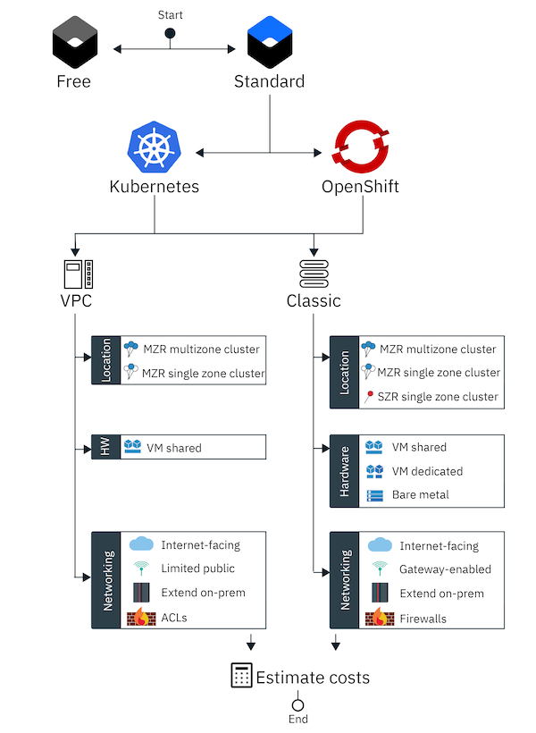

---

copyright:
  years: 2014, 2020
lastupdated: "2020-01-22"

keywords: kubernetes, iks, clusters, worker nodes, worker pools

subcollection: containers

---

{:codeblock: .codeblock}
{:deprecated: .deprecated}
{:download: .download}
{:external: target="_blank" .external}
{:faq: data-hd-content-type='faq'}
{:gif: data-image-type='gif'}
{:help: data-hd-content-type='help'}
{:important: .important}
{:new_window: target="_blank"}
{:note: .note}
{:pre: .pre}
{:preview: .preview}
{:screen: .screen}
{:shortdesc: .shortdesc}
{:support: data-reuse='support'}
{:table: .aria-labeledby="caption"}
{:tip: .tip}
{:troubleshoot: data-hd-content-type='troubleshoot'}
{:tsCauses: .tsCauses}
{:tsResolve: .tsResolve}
{:tsSymptoms: .tsSymptoms}


# Creating clusters
{: #clusters}

Create a cluster in {{site.data.keyword.containerlong}}.
{: shortdesc}

After [getting started](/docs/containers?topic=containers-getting-started), you might want to create a cluster that is customized to your use case and different public and private cloud environments. Consider the following steps to create the right cluster each time.

1.  [Prepare your account to create clusters](/docs/containers?topic=containers-clusters#cluster_prepare). This step includes creating a billable account, setting up an API key with infrastructure permissions, making sure that you have Administrator access in {{site.data.keyword.cloud_notm}} IAM, planning resource groups, and setting up account networking.
2.  [Decide on your cluster setup](/docs/containers?topic=containers-clusters#prepare_cluster_level). This step includes planning cluster network and HA setup, estimating costs, and if applicable, allowing network traffic through a firewall.
3.  Create your [VPC](#clusters_vpc_standard) or [classic](#clusters_standard) cluster by following the steps in the {{site.data.keyword.cloud_notm}} console or CLI.

<br />


## Sample commands
{: #cluster_create_samples}

Have you created a cluster before and are just looking for quick example commands? Try these examples.
{: shortdesc}

**Free cluster**:
```
ibmcloud ks cluster create classic --name my_cluster
```
{: pre}

**Classic clusters**:
* Classic cluster, shared virtual machine:
   ```
   ibmcloud ks cluster create classic --name my_cluster --zone dal10 --machine-type b3c.4x16 --hardware shared --workers 3 --public-vlan <public_VLAN_ID> --private-vlan <private_VLAN_ID>
   ```
   {: pre}
*  Classic cluster, bare metal:
   ```
   ibmcloud ks cluster create classic --name my_cluster --zone dal10 --machine-type mb2c.4x32 --hardware dedicated --workers 3 --public-vlan <public_VLAN_ID> --private-vlan <private_VLAN_ID>
   ```
   {: pre}
*  Classic cluster with a gateway enabled:
   ```
   ibmcloud ks cluster create classic --name my_cluster --zone dal10 --machine-type b3c.4x16 --hardware shared --workers 3 --gateway-enabled --kube-version 1.16.5 --public-vlan <public_VLAN_ID> --private-vlan <private_VLAN_ID> --public-service-endpoint --private-service-endpoint
   ```
   {: pre}
*  Classic cluster that uses private VLANs and the private service endpoint only:
   ```
   ibmcloud ks cluster create classic --name my_cluster --zone dal10 --machine-type b3c.4x16 --hardware shared --workers 3 --private-vlan <private_VLAN_ID> --private-only --private-service-endpoint
   ```
   {: pre}
*  For a classic multizone cluster, after you created the cluster in a [multizone metro](/docs/containers?topic=containers-regions-and-zones#zones), [add zones](/docs/containers?topic=containers-add_workers#add_zone):
   ```
   ibmcloud ks zone add classic --zone <zone> --cluster <cluster_name_or_ID> --worker-pool <pool_name> --private-vlan <private_VLAN_ID> --public-vlan <public_VLAN_ID>
   ```
   {: pre}


**VPC clusters**:
*  VPC Generation 1 compute cluster:
   ```
   ibmcloud ks cluster create vpc-classic --name my_cluster --zone us-east-1 --vpc-id <VPC_ID> --subnet-id <VPC_SUBNET_ID> --flavor b2.4x16 --workers 3
   ```
   {: pre}
*  For a VPC multizone cluster, after you created the cluster in a [multizone metro](/docs/containers?topic=containers-regions-and-zones#zones), [add zones](/docs/containers?topic=containers-add_workers#add_zone):
   ```
   ibmcloud ks zone add vpc-classic --zone <zone> --cluster <cluster_name_or_ID> --worker-pool <pool_name> --subnet-id <VPC_SUBNET_ID>
   ```
   {: pre}


<br />


## Prepare to create clusters at the account level
{: #cluster_prepare}

Prepare your {{site.data.keyword.cloud_notm}} account for {{site.data.keyword.containerlong_notm}}. After the account administrator makes these preparations, you might not need to change them each time that you create a cluster. However, each time that you create a cluster, you still want to verify that the current account-level state is what you need it to be.
{: shortdesc}

1. [Create or upgrade your account to a billable account ({{site.data.keyword.cloud_notm}} Pay-As-You-Go or Subscription)](https://cloud.ibm.com/registration/).

2. [Set up an API key for {{site.data.keyword.containerlong_notm}}](/docs/containers?topic=containers-users#api_key) in the region and resource groups that you want to create clusters. Assign the API key with the appropriate service and infrastructure permissions to create clusters.<p class="tip">Are you the account owner? You already have the necessary permissions! When you create a cluster, the API key for that region and resource group is set with your credentials.</p>

    **Services**:
    * [**Administrator** platform role](/docs/containers?topic=containers-users#platform) for {{site.data.keyword.containerlong_notm}} at the account level.
    * [**Writer** or **Manager** service role](/docs/containers?topic=containers-users#platform) for {{site.data.keyword.containerlong_notm}}.
    * [**Administrator** platform role](/docs/containers?topic=containers-users#platform) for Container Registry at the account level. If your account predates 4 October 2018, you need to [enable {{site.data.keyword.cloud_notm}} IAM policies for {{site.data.keyword.registryshort_notm}}](/docs/services/Registry?topic=registry-user#existing_users). With IAM policies, you can control access to resources such as registry namespaces.

    **Infrastructure**:
    * Classic clusters only: **Super User** role or the [minimum required permissions](/docs/containers?topic=containers-access_reference#infra) for classic infrastructure.
    * VPC clusters only: [**Administrator** platform role for VPC Infrastructure](/docs/vpc-on-classic?topic=vpc-on-classic-managing-user-permissions-for-vpc-resources).

3. Verify that you as a user (not just the API key) have the **Administrator** platform role for {{site.data.keyword.containerlong_notm}}. To allow your cluster to pull images from the private registry, you also need the **Administrator** platform role for {{site.data.keyword.registrylong_notm}}. If you are the account owner, you already have these permissions.
  1. From the [{{site.data.keyword.cloud_notm}} console](https://cloud.ibm.com/){: external} menu bar, click **Manage > Access (IAM)**.
  2. Click the **Users** page, and then from the table, select yourself.
  3. From the **Access policies** tab, confirm that your **Role** is **Administrator**. You can be the **Administrator** for all the resources in the account, or at least for {{site.data.keyword.containerlong_notm}}. **Note**: If you have the **Administrator** role for {{site.data.keyword.containerlong_notm}} in only one resource group or region instead of the entire account, you must have at least the **Viewer** role at the account level to see the account's VLANs.
  <p class="tip">Make sure that your account administrator does not assign you the **Administrator** platform role at the same time as scoping the access policy to a namespace.</p>

4. If your account uses multiple resource groups, figure out your account's strategy for [managing resource groups](/docs/containers?topic=containers-users#resource_groups).
  * The cluster is created in the resource group that you target when you log in to {{site.data.keyword.cloud_notm}}. If you do not target a resource group, the default resource group is automatically targeted. Free clusters are created in the `default` resource group.
  * If you want to create a cluster in a different resource group than the default, you need at least the **Viewer** role for the resource group. If you do not have any role for the resource group, your cluster is created in the default resource group.
  * You cannot change a cluster's resource group. Furthermore, if you need to use the `ibmcloud ks cluster service bind` [command](/docs/containers-cli-plugin?topic=containers-cli-plugin-kubernetes-service-cli#cs_cluster_service_bind) to [integrate with an {{site.data.keyword.cloud_notm}} service](/docs/containers?topic=containers-service-binding#bind-services), that service must be in the same resource group as the cluster. Services that do not use resource groups like {{site.data.keyword.registrylong_notm}} or that do not need service binding like {{site.data.keyword.la_full_notm}} work even if the cluster is in a different resource group.
  * Consider giving clusters unique names across resource groups and regions in your account to avoid naming conflicts. You cannot rename a cluster.

5. **Standard clusters**: Plan your cluster network setup so that your cluster meets the needs of your workloads and environment. Then, set up your IBM Cloud infrastructure networking to allow worker-to-master and user-to-master communication. Your cluster network setup varies with the infrastructure provider that you choose (classic or VPC). For more information, see [Planning your cluster network setup](/docs/containers?topic=containers-plan_clusters).
  * **VPC clusters only**: Your VPC clusters are created with a public and a private service endpoint by default.
    1. [Enable your {{site.data.keyword.cloud_notm}} account to use service endpoints](/docs/account?topic=account-vrf-service-endpoint#service-endpoint).
    2. Optional: If you want your VPC clusters to communicate with classic clusters over the private network interface, you can choose to set up classic infrastructure access from the VPC that your cluster is in. Note that you can set up classic infrastructure access for only one VPC per region and [Virtual Routing and Forwarding (VRF)](/docs/resources?topic=direct-link-overview-of-virtual-routing-and-forwarding-vrf-on-ibm-cloud) is required in your {{site.data.keyword.cloud_notm}} account. For more information, see [Setting up access to your Classic Infrastructure from VPC](/docs/vpc-on-classic?topic=vpc-on-classic-setting-up-access-to-your-classic-infrastructure-from-vpc).

  * **Classic clusters only, VRF and service endpoint enabled accounts**: You must set up your account to use VRF and service endpoints to support scenarios such as running internet-facing workloads and extending your on-premises data center. After you set up the account, your VPC and classic clusters are created with a public and a private service endpoint by default.
    1. Enable [VRF](/docs/resources?topic=direct-link-overview-of-virtual-routing-and-forwarding-vrf-on-ibm-cloud) in your IBM Cloud infrastructure account. To check whether a VRF is already enabled, use the `ibmcloud account show` command.
    2. [Enable your {{site.data.keyword.cloud_notm}} account to use service endpoints](/docs/account?topic=account-vrf-service-endpoint#service-endpoint).
      

  * **Classic clusters only, Non-VRF and non-service endpoint accounts**: If you do not set up your account to use VRF and service endpoints, you can create only classic clusters that use VLAN spanning to communicate with each other on the public and private network. Note that you cannot create gateway-enabled clusters.
    * To use the public service endpoint only (run internet-facing workloads):
      1. Enable [VLAN spanning](/docs/infrastructure/vlans?topic=vlans-vlan-spanning#vlan-spanning) for your IBM Cloud infrastructure account so that your worker nodes can communicate with each other on the private network. To perform this action, you need the **Network > Manage Network VLAN Spanning** [infrastructure permission](/docs/containers?topic=containers-users#infra_access), or you can request the account owner to enable it. To check whether VLAN spanning is already enabled, use the `ibmcloud ks vlan spanning get --region <region>` [command](/docs/containers?topic=containers-cli-plugin-kubernetes-service-cli#cs_vlan_spanning_get).
    * To use a gateway appliance (extend your on-premises data center):
      1. Enable [VLAN spanning](/docs/infrastructure/vlans?topic=vlans-vlan-spanning#vlan-spanning) for your IBM Cloud infrastructure account so that your worker nodes can communicate with each other on the private network. To perform this action, you need the **Network > Manage Network VLAN Spanning** [infrastructure permission](/docs/containers?topic=containers-users#infra_access), or you can request the account owner to enable it. To check whether VLAN spanning is already enabled, use the `ibmcloud ks vlan spanning get --region <region>` [command](/docs/containers?topic=containers-cli-plugin-kubernetes-service-cli#cs_vlan_spanning_get).
      2. Configure a gateway appliance to connect your cluster to the on-premises network. For example, you might choose to set up a [Virtual Router Appliance](/docs/infrastructure/virtual-router-appliance?topic=virtual-router-appliance-about-the-vra) or a [Fortigate Security Appliance](/docs/services/vmwaresolutions/services?topic=vmware-solutions-fsa_considerations) to act as your firewall to allow required network traffic and to block unwanted network traffic.
      3. [Open up the required private IP addresses and ports](/docs/containers?topic=containers-firewall#firewall_outbound) for each region so that the master and the worker nodes can communicate and for the {{site.data.keyword.cloud_notm}} services that you plan to use.

<br />


## Deciding on your cluster setup
{: #prepare_cluster_level}
{: help}
{: support}

After you set up your account to create clusters, decide on the setup for your cluster. You must make these decisions every time that you create a cluster. You can click on the options in the following decision tree image for more information, such as comparisons of free and standard, Kubernetes and OpenShift, or VPC and classic clusters.
{: shortdesc}



<map name="cluster-plan-map">
    <area target="" alt="Free and standard cluster comparison" title="Free and standard cluster comparison" href="/docs/containers?topic=containers-cs_ov#cluster_types" coords="43,9,361,106" shape="rect">
    <area target="" alt="OpenShift and Kubernetes comparison" title="OpenShift and Kubernetes comparison" href="/docs/openshift?topic=openshift-cs_ov#openshift_kubernetes" coords="110,128,467,224" shape="rect">
    <area target="" alt="VPC and classic infrastructure comparison" title="VPC and classic infrastructure comparison" href="/docs/containers?topic=containers-infrastructure_providers" coords="60,252,398,352" shape="rect">
    <area target="" alt="Locations" title="Locations" href="/docs/containers?topic=containers-regions-and-zones#zones" coords="101,377,564,456" shape="rect">
    <area target="" alt="Virtual Machines" title="Virtual Machines" href="/docs/containers?topic=containers-planning_worker_nodes#vm" coords="105,488,564,538" shape="rect">
    <area target="" alt="Bare metal machines" title="Bare metal machines" href="/docs/containers?topic=containers-planning_worker_nodes#bm" coords="566,569,372,546" shape="rect">
    <area target="" alt="VPC scenarios" title="VPC scenarios" href="/docs/containers?topic=containers-plan_clusters#vpc-scenarios" coords="104,597,298,675" shape="rect">
    <area target="" alt="Classic scenarios" title="Classic scenarios" href="/docs/containers?topic=containers-plan_clusters#classic-scenarios" coords="369,596,566,674" shape="rect">
    <area target="" alt="Classic firewall" title="Classic firewall" href="/docs/containers?topic=containers-firewall" coords="369,681,564,704" shape="rect">
    <area target="" alt="VPC ACLs and firewall" title="VPC ACLs and firewall" href="/docs/containers?topic=containers-firewall" coords="103,680,298,704" shape="rect">
    <area target="" alt="Estimate costs (cluster create page)" title="Estimate costs (cluster create page)" href="https://cloud.ibm.com/kubernetes/catalog/cluster/create" coords="248,732,426,776" shape="rect">
</map>

<br />


## Creating a standard classic cluster
{: #clusters_standard}

Use the {{site.data.keyword.cloud_notm}} CLI or the {{site.data.keyword.cloud_notm}} console to create a fully-customizable standard cluster with your choice of hardware isolation and access to features like multiple worker nodes for a highly available environment.
{: shortdesc}


### Creating a standard classic cluster in the console
{: #clusters_ui}

Create your single zone or multizone classic Kubernetes cluster by using the {{site.data.keyword.cloud_notm}} console.
{: shortdesc}

1. Make sure that you complete the prerequisites to [prepare your account](#cluster_prepare) and decide on your [cluster setup](#prepare_cluster_level).
2. From the [{{site.data.keyword.cloud_notm}} Kubernetes Clusters console](https://cloud.ibm.com/kubernetes/clusters){: external}, click **Create cluster**.
3. Configure your cluster environment.
   1. Select the **Standard** cluster plan.
   2. Select **Kubernetes** as your container platform and use the drop-down list to select the Kubernetes version that you want to use in your cluster.
   3. Select **Classic infrastructure**.
   4. Give your cluster a unique name. The name must start with a letter, can contain letters, numbers, and hyphen (-), and must be 35 characters or fewer. Use a name that is unique across regions. The cluster name and the region in which the cluster is deployed form the fully qualified domain name for the Ingress subdomain. To ensure that the Ingress subdomain is unique within a region, the cluster name might be truncated and appended with a random value within the Ingress domain name.
 **Note**: Changing the unique ID or domain name that is assigned during cluster creation blocks the Kubernetes master from managing your cluster.
   5. Select a resource group in which to create your cluster.
      * A cluster can be created in only one resource group, and after the cluster is created, you can't change its resource group.
      * To create clusters in a resource group other than the default, you must have at least the [**Viewer** role](/docs/containers?topic=containers-users#platform) for the resource group.
   6. Select a geography in which to deploy your cluster.
4. Select **Single zone** or **Multizone** availability. In a multizone cluster, the Kubernetes master is deployed in a multizone-capable zone and three replicas of your master are spread across zones.
5. Enter your metro city and zone details.
  * Multizone clusters:
    1. Select a metro location. For the best performance, select the metro location that is physically closest to you. Your choices might be limited by geography.
    2. Select the specific zones in which you want to host your cluster. You must select at least one zone but you can select as many as you like. If you select more than one zone, the worker nodes are spread across the zones that you choose which gives you higher availability. If you select only one zone, you can [add zones to your cluster](/docs/containers?topic=containers-add_workers#add_zone) after the cluster is created.
  * Single zone clusters: Select a zone in which you want to host your cluster. For the best performance, select the zone that is physically closest to you. Your choices might be limited by geography.
6. For each of the selected zones, choose your public and private VLANs.
  * To create a cluster in which you can run internet-facing workloads:
    1. Select a public VLAN and a private VLAN from your IBM Cloud infrastructure account for each zone. Worker nodes communicate with each other by using the private VLAN, and can communicate with the Kubernetes master by using the public or the private VLAN. If you do not have a public or private VLAN in this zone, a public and a private VLAN are automatically created for you. You can use the same VLAN for multiple clusters.
  * To create a cluster that extends your on-premises data center on the private network only, that extends your on-premises data center with the option of adding limited public access later, or that extends your on-premises data center and provides limited public access through a gateway appliance:
    1. Select a private VLAN from your IBM Cloud infrastructure account for each zone. Worker nodes communicate with each other by using the private VLAN. If you do not have a private VLAN in a zone, a private VLAN is automatically created for you. You can use the same VLAN for multiple clusters.
    2. For the public VLAN, select **None**.
7. For **Master service endpoint**, choose how your Kubernetes master and worker nodes communicate.
  * To create a cluster in which you can run internet-facing workloads:
    * If VRF and service endpoints are enabled in your {{site.data.keyword.cloud_notm}} account, select **Both private & public endpoints**.
    * If you cannot or do not want to enable VRF, select **Public endpoint only**.
  * To create a cluster that extends your on-premises data center only, or a cluster that extends your on-premises data center and provides limited public access with edge worker nodes, select **Both private & public endpoints** or **Private endpoint only**. Ensure that you have enabled VRF and service endpoints in your {{site.data.keyword.cloud_notm}} account. Note that if you enable the private service endpoint only, you must [expose the master endpoint through a private network load balancer](/docs/containers?topic=containers-access_cluster#access_private_se) so that users can access the master through a VPN or {{site.data.keyword.BluDirectLink}} connection.
  * To create a cluster that extends your on-premises data center and provides limited public access with a gateway appliance, select **Public endpoint only**.
8. Configure your default worker pool. Worker pools are groups of worker nodes that share the same configuration. You can always add more worker pools to your cluster later.
   1. Filter the worker flavors by selecting a machine type. Virtual is billed hourly and bare metal is billed monthly.
      - **Bare metal**: Bare metal servers are provisioned manually by IBM Cloud infrastructure after you order, and can take more than one business day to complete. Bare metal is best suited for high-performance applications that need more resources and host control. Be sure that you want to provision a bare metal machine. Because it is billed monthly, if you cancel it immediately after an order by mistake, you are still charged the full month.
      - **Virtual - shared**: Infrastructure resources, such as the hypervisor and physical hardware, are shared across you and other IBM customers, but each worker node is accessible only by you. Although this option is less expensive and sufficient in most cases, you might want to verify your performance and infrastructure requirements with your company policies.
      - **Virtual - dedicated**: Your worker nodes are hosted on infrastructure that is devoted to your account. Your physical resources are completely isolated.
   2. Select a flavor. The flavor defines the amount of virtual CPU, memory, and disk space that is set up in each worker node and made available to the containers. Available bare metal and virtual machines types vary by the zone in which you deploy the cluster. For more information, see [Planning your worker node setup](/docs/containers?topic=containers-planning_worker_nodes). After you create your cluster, you can add different flavors by adding a worker node or worker pool to the cluster.
   3. Specify the number of worker nodes that you need in the cluster. The number of workers that you enter is replicated across the number of zones that you selected. For example, if you selected two zones and want to create three worker nodes, a total of six worker nodes are provisioned in your cluster with three worker nodes in each zone.
9. Click **Create cluster**. A worker pool is created with the number of workers that you specified. You can see the progress of the worker node deployment in the **Worker nodes** tab.
    *   Your cluster might take some time to provision the Kubernetes master and all worker nodes and enter a **Normal** state. Note that even if the cluster is ready, some parts of the cluster that are used by other services, such as Ingress secrets or registry image pull secrets, might still be in process.
    *   Every worker node is assigned a unique worker node ID and domain name that must not be changed manually after the cluster is created. Changing the ID or domain name prevents the Kubernetes master from managing your cluster.<p class="tip">Is your cluster not in a **Normal** state? Check out the [Debugging clusters](/docs/containers?topic=containers-cs_troubleshoot) guide for help. For example, if your cluster is provisioned in an account that is protected by a firewall gateway appliance, you must [configure your firewall settings to allow outgoing traffic to the appropriate ports and IP addresses](/docs/containers?topic=containers-firewall#firewall_outbound).</p>
10. After your cluster is created, you can [begin working with your cluster by configuring your CLI session](/docs/containers?topic=containers-access_cluster). For more possibilities, review the [Next steps](/docs/containers?topic=containers-clusters#next_steps).

<br />


### Creating a standard classic cluster in the CLI
{: #clusters_cli_steps}

Create your single zone or multizone classic cluster by using the {{site.data.keyword.cloud_notm}} CLI.
{: shortdesc}

**Before you begin**:
* Make sure that you complete the prerequisites to [prepare your account](#cluster_prepare) and decide on your [cluster setup](#prepare_cluster_level).
* Install the {{site.data.keyword.cloud_notm}} CLI and the [{{site.data.keyword.containerlong_notm}} plug-in](/docs/containers?topic=containers-cs_cli_install#cs_cli_install).

<br>

**To create a classic cluster from the CLI**:

1. Log in to the {{site.data.keyword.cloud_notm}} CLI.
   1. Log in and enter your {{site.data.keyword.cloud_notm}} credentials when prompted. If you have a federated ID, use `ibmcloud login --sso` to log in to the {{site.data.keyword.cloud_notm}} CLI.
      ```
      ibmcloud login [--sso]
      ```
      {: pre}

   2. If you have multiple {{site.data.keyword.cloud_notm}} accounts, select the account where you want to create your Kubernetes cluster.
   3. To create clusters in a resource group other than default, target that resource group.
      * A cluster can be created in only one resource group, and after the cluster is created, you can't change its resource group.
      * You must have at least the [**Viewer** role](/docs/containers?topic=containers-users#platform) for the resource group.

      ```
      ibmcloud target -g <resource_group_name>
      ```
      {: pre} 

3. Review the zones where you can create your cluster. In the output of the following command, zones have a **Location Type** of `dc`. To span your cluster across zones, you must create the cluster in a [multizone-capable zone](/docs/containers?topic=containers-regions-and-zones#zones). Multizone-capable zones have a metro value in the **Multizone Metro** column. If you want to create a multizone cluster, you can use the {{site.data.keyword.cloud_notm}} console, or [add more zones](/docs/containers?topic=containers-add_workers#add_zone) to your cluster after the cluster is created.
    ```
    ibmcloud ks supported-locations
    ```
    {: pre}
    When you select a zone that is located outside your country, keep in mind that you might require legal authorization before data can be physically stored in a foreign country.
    {: note}

4. Review the worker node flavors that are available in that zone. The flavor determines the amount of virtual CPU, memory, and disk space that is set up in each worker node and made available to your apps. Worker nodes in classic clusters can be created as virtual machines on shared or dedicated infrastructure, or as bare metal machines that are dedicated to you. For more information, see [Planning your worker node setup](/docs/containers?topic=containers-planning_worker_nodes). After you create your cluster, you can add different flavors by [adding a worker pool](/docs/containers?topic=containers-add_workers#add_pool).

   Before you create a bare metal machine, be sure that you want to provision one. Bare metal machines are billed monthly. If you order a bare metal machine by mistake, you are charged for the entire month, even if you cancel the machine immediately.  
   {:tip}

   ```
   ibmcloud ks flavors --zone <zone>
   ```
   {: pre}

5. Check if you have existing VLANs in the zones that you want to include in your cluster, and note the ID of the VLAN. If you do not have a public or private VLAN in one of the zones that you want to use in your cluster, {{site.data.keyword.containerlong_notm}} automatically creates these VLANs for you when you create the cluster.
   ```
   ibmcloud ks vlan ls --zone <zone>
   ```
   {: pre}

   Example output:
   ```
   ID        Name   Number   Type      Router
   1519999   vlan   1355     private   bcr02a.dal10
   1519898   vlan   1357     private   bcr02a.dal10
   1518787   vlan   1252     public    fcr02a.dal10
   1518888   vlan   1254     public    fcr02a.dal10
   ```
   {: screen}
   * To create a cluster in which you can run internet-facing workloads, check to see whether a public and private VLAN exist. If a public and private VLAN already exist, note the matching routers. Private VLAN routers always begin with <code>bcr</code> (back-end router) and public VLAN routers always begin with <code>fcr</code> (front-end router). When you create a cluster and specify the public and private VLANs, the number and letter combination after those prefixes must match. In the example output, any private VLAN can be used with any public VLAN because the routers all include `02a.dal10`.
   * To create a cluster that extends your on-premises data center on the private network only or provides limited public access through a gateway appliance, check to see whether a private VLAN exists. If you have a private VLAN, note the ID.

6. Create your standard cluster.
   * To create a cluster in which you can run internet-facing workloads:
     ```
     ibmcloud ks cluster create classic --zone <zone> --machine-type <flavor> --hardware <shared_or_dedicated> --public-vlan <public_VLAN_ID> --private-vlan <private_VLAN_ID> --workers <number> --name <cluster_name> --kube-version <major.minor.patch> [--private-service-endpoint] [--public-service-endpoint] [--disable-disk-encrypt]
     ```
     {: pre}

   * To create a cluster with private network connectivity only, such as to extend your on-premises data center:
     ```
     ibmcloud ks cluster create classic --zone <zone> --machine-type <flavor> --hardware <shared_or_dedicated> --private-vlan <private_VLAN_ID> --private-only --workers <number> --name <cluster_name> --kube-version <major.minor.patch> --public-service-endpoint [--disable-disk-encrypt]
     ```
     {: pre}

   <table>
   <caption>`cluster create classic` command components</caption>
   <thead>
   <th colspan=2> Understanding this command's components</th>
   </thead>
   <tbody>
   <tr>
   <td><code>cluster-create</code></td>
   <td>The command to create a cluster in your {{site.data.keyword.cloud_notm}} organization.</td>
   </tr>
   <tr>
   <td><code>--zone <em>&lt;zone&gt;</em></code></td>
   <td>Specify the {{site.data.keyword.cloud_notm}} zone ID that you chose earlier and that you want to use to create your cluster.</td>
   </tr>
   <tr>
   <td><code>--machine-type <em>&lt;flavor&gt;</em></code></td>
   <td>Specify the flavor for your worker node that you chose earlier.</td>
   </tr>
   <tr>
   <td><code>--hardware <em>&lt;shared_or_dedicated&gt;</em></code></td>
   <td>Specify with the level of hardware isolation for your worker node. Use <code>dedicated</code> to have available physical resources dedicated to you only, or <code>shared</code> to allow physical resources to be shared with other IBM customers. The default is shared. This value is optional for VM standard clusters. For bare metal flavors, specify <code>dedicated</code>.</td>
   </tr>
   <tr>
   <td><code>--public-vlan <em>&lt;public_vlan_id&gt;</em></code></td>
   <td>If you already have a public VLAN set up in your IBM Cloud infrastructure account for that zone, enter the ID of the public VLAN that you retrieved earlier. If you do not have a public VLAN in your account, do not specify this option. {{site.data.keyword.containerlong_notm}} automatically creates a public VLAN for you.<p>Private VLAN routers always begin with <code>bcr</code> (back-end router) and public VLAN routers always begin with <code>fcr</code> (front-end router). When you create a cluster and specify the public and private VLANs, the number and letter combination after those prefixes must match.</p></td>
   </tr>
   <tr>
   <td><code>--private-vlan <em>&lt;private_vlan_id&gt;</em></code></td>
   <td>If you already have a private VLAN set up in your IBM Cloud infrastructure account for that zone, enter the ID of the private VLAN that you retrieved earlier. If you do not have a private VLAN in your account, do not specify this option. {{site.data.keyword.containerlong_notm}} automatically creates a private VLAN for you.<p>Private VLAN routers always begin with <code>bcr</code> (back-end router) and public VLAN routers always begin with <code>fcr</code> (front-end router). When you create a cluster and specify the public and private VLANs, the number and letter combination after those prefixes must match.</p></td>
   </tr>
   <tr>
   <td><code>--private-only</code></td>
   <td>Create the cluster with private VLANs only. If you include this option, do not include the <code>--public-vlan</code> option.</td>
   </tr>
   <tr>
   <td><code>--name <em>&lt;name&gt;</em></code></td>
   <td>Specify a name for your cluster. The name must start with a letter, can contain letters, numbers, and hyphen (-), and must be 35 characters or fewer. Use a name that is unique across regions. The cluster name and the region in which the cluster is deployed form the fully qualified domain name for the Ingress subdomain. To ensure that the Ingress subdomain is unique within a region, the cluster name might be truncated and appended with a random value within the Ingress domain name.
</td>
   </tr>
   <tr>
   <td><code>--workers <em>&lt;number&gt;</em></code></td>
   <td>Specify the number of worker nodes to include in the cluster. If the <code>--workers</code> option is not specified, one worker node is created.</td>
   </tr>
   <tr>
   <td><code>--kube-version <em>&lt;major.minor.patch&gt;</em></code></td>
   <td>The Kubernetes version for the cluster master node. This value is optional. When the version is not specified, the cluster is created with the default supported Kubernetes version. To see available versions, run <code>ibmcloud ks versions</code>.
</td>
   </tr>
   <tr>
   <td><code>--private-service-endpoint</code></td>
   <td>**In [VRF-enabled accounts](/docs/resources?topic=direct-link-overview-of-virtual-routing-and-forwarding-vrf-on-ibm-cloud)**: Enable the private service endpoint so that your Kubernetes master and the worker nodes can communicate over the private VLAN. In addition, you can choose to enable the public service endpoint by using the `--public-service-endpoint` flag to access your cluster over the internet. If you enable the private service endpoint only, you must be connected to the private VLAN to communicate with your Kubernetes master. After you enable a private service endpoint, you cannot later disable it.<br><br>After you create the cluster, you can get the endpoint by running `ibmcloud ks cluster get --cluster <cluster_name_or_ID>`.</td>
   </tr>
   <tr>
   <td><code>--public-service-endpoint</code></td>
   <td>Enable the public service endpoint so that your Kubernetes master can be accessed over the public network, for example to run `kubectl` commands from your terminal, and so that your Kubernetes master and the worker nodes can communicate over the public VLAN. You can later disable the public service endpoint if you want a private-only cluster.<br><br>After you create the cluster, you can get the endpoint by running `ibmcloud ks cluster get --cluster <cluster_name_or_ID>`.</td>
   </tr>
   <tr>
   <td><code>--disable-disk-encrypt</code></td>
   <td>Worker nodes feature AES 256-bit [disk encryption](/docs/containers?topic=containers-security#encrypted_disk) by default. If you want to disable encryption, include this option.</td>
   </tr>
   </tbody></table>

7. Verify that the creation of the cluster was requested. For virtual machines, it can take a few minutes for the worker node machines to be ordered, and for the cluster to be set up and provisioned in your account. Bare metal physical machines are provisioned by manual interaction with IBM Cloud infrastructure, and can take more than one business day to complete.
   ```
   ibmcloud ks cluster ls
   ```
   {: pre}

   When the provisioning of your Kubernetes master is completed, the **State** of your cluster changes to `deployed`. After your Kubernetes master is ready, the provisioning of your worker nodes is initiated.
   ```
   Name         ID                         State      Created          Workers    Zone      Version     Resource Group Name   Provider
   mycluster    blrs3b1d0p0p2f7haq0g       deployed   20170201162433   3          dal10     1.14.10      Default             classic
   ```
   {: screen}

   Is your cluster not in a `deployed` state? Check out the [Debugging clusters](/docs/containers?topic=containers-cs_troubleshoot) guide for help. For example, if your cluster is provisioned in an account that is protected by a firewall gateway appliance, you must [configure your firewall settings to allow outgoing traffic to the appropriate ports and IP addresses](/docs/containers?topic=containers-firewall#firewall_outbound).
   {: tip}

8. Check the status of the worker nodes.
   ```
   ibmcloud ks worker ls --cluster <cluster_name_or_ID>
   ```
   {: pre}

   When the worker nodes are ready, the worker node state changes to **normal** and the status changes to **Ready**. When the node status is **Ready**, you can then access the cluster. Note that even if the cluster is ready, some parts of the cluster that are used by other services, such as Ingress secrets or registry image pull secrets, might still be in process. Note that if you created your cluster with a private VLAN only, no **Public IP** addresses are assigned to your worker nodes.
   ```
   ID                                                     Public IP        Private IP     Flavor              State    Status   Zone    Version
   kube-blrs3b1d0p0p2f7haq0g-mycluster-default-000001f7   169.xx.xxx.xxx  10.xxx.xx.xxx   u3c.2x4.encrypted   normal   Ready    dal10   1.14.10
   ```
   {: screen}

   Every worker node is assigned a unique worker node ID and domain name that must not be changed manually after the cluster is created. Changing the ID or domain name prevents the Kubernetes master from managing your cluster.
   {: important}

9. After your cluster is created, you can [begin working with your cluster by configuring your CLI session](/docs/containers?topic=containers-access_cluster). For more possibilities, review the [Next steps](/docs/containers?topic=containers-clusters#next_steps).

<br />


### Creating a standard classic cluster with a gateway in the CLI
{: #gateway_cluster_cli}

Use the {{site.data.keyword.cloud_notm}} CLI to create a standard, gateway-enabled cluster on classic infrastructure.
{: shortdesc}

When you enable a gateway on a classic cluster, the cluster is created with a `compute` worker pool of compute worker nodes that are connected to a private VLAN only, and a `gateway` worker pool of gateway worker nodes that are connected to public and private VLANs. Traffic into or out of the cluster is routed through the gateway worker nodes, which provide your cluster with limited public access. For more information about the network setup for gateway-enabled clusters, see [Using a gateway-enabled cluster](/docs/containers?topic=containers-plan_clusters#gateway).

**Before you begin**:
* Make sure that you complete the prerequisites to [prepare your account](#cluster_prepare) and decide on your [cluster setup](#prepare_cluster_level). Your account must be enabled with VRF and enabled to use private service endpoints.
* Install the {{site.data.keyword.cloud_notm}} CLI and the [{{site.data.keyword.containerlong_notm}} plug-in](/docs/containers?topic=containers-cs_cli_install#cs_cli_install).

<br>

**To create a classic gateway cluster**:

1. Log in to the {{site.data.keyword.cloud_notm}} CLI.
   1. Log in and enter your {{site.data.keyword.cloud_notm}} credentials when prompted.
      ```
      ibmcloud login
      ```
      {: pre}

      If you have a federated ID, use `ibmcloud login --sso` to log in to the {{site.data.keyword.cloud_notm}} CLI. Enter your username and use the provided URL in your CLI output to retrieve your one-time passcode. You know that you have a federated ID when the login fails without the `--sso` and succeeds with the `--sso` option.
      {: tip}

   2. If you have multiple {{site.data.keyword.cloud_notm}} accounts, select the account where you want to create your Kubernetes cluster.

   3. To create clusters in a resource group other than default, target that resource group.
      * A cluster can be created in only one resource group, and after the cluster is created, you can't change its resource group.
      * You must have at least the [**Viewer** role](/docs/containers?topic=containers-users#platform) for the resource group.

      ```
      ibmcloud target -g <resource_group_name>
      ```
      {: pre} 

3. Review the zones where you can create your cluster. In the output of the following command, zones have a **Location Type** of `dc`. To span your cluster across zones, you must create the cluster in a [multizone-capable zone](/docs/containers?topic=containers-regions-and-zones#zones). Multizone-capable zones have a metro value in the **Multizone Metro** column. If you want to create a multizone cluster, you can use the {{site.data.keyword.cloud_notm}} console, or [add more zones](/docs/containers?topic=containers-add_workers#add_zone) to your cluster after the cluster is created.
    ```
    ibmcloud ks supported-locations
    ```
    {: pre}
    <p class=note>When you select a zone that is located outside your country, keep in mind that you might require legal authorization before data can be physically stored in a foreign country.</p>

4. Review the compute worker node flavors that are available in that zone. The flavor determines the amount of virtual CPU, memory, and disk space that is set up in each worker node and made available to your apps. Worker nodes in classic clusters can be created as virtual machines on shared or dedicated infrastructure, or as bare metal machines that are dedicated to you. For more information, see [Planning your worker node setup](/docs/containers?topic=containers-planning_worker_nodes). After you create your cluster, you can add different flavors by [adding a worker pool](/docs/containers?topic=containers-add_workers#add_pool). Note that the gateway worker nodes are created with the `u3c.2x4` flavor by default. If you want to change the isolation and flavor of the gateway worker nodes after you create your cluster, you can [create a new gateway worker pool](/docs/containers?topic=containers-add_workers#gateway_replace) to replace the gateway worker pool that is created by default.

   Before you create a bare metal machine, be sure that you want to provision one. Bare metal machines are billed monthly. If you order a bare metal machine by mistake, you are charged for the entire month, even if you cancel the machine immediately.
   {:tip}

   ```
   ibmcloud ks flavors --zone <zone>
   ```
   {: pre}

5. In the zone where you want to create your cluster, check to see whether a public and private VLAN exist. If a public and private VLAN already exist, and they have matching routers, note the VLAN IDs. Private VLAN routers always begin with <code>bcr</code> (back-end router) and public VLAN routers always begin with <code>fcr</code> (front-end router). When you create a cluster and specify the public and private VLANs, the number and letter combination after those prefixes must match. If you do not have a public or private VLAN in the zone that you want to use in your cluster, or if you do not have VLANs that have matching routers, {{site.data.keyword.containerlong_notm}} automatically creates these VLANs for you when you create the cluster.
   ```
   ibmcloud ks vlan ls --zone <zone>
   ```
   {: pre}

   In this example output, any private VLAN can be used with any public VLAN because the routers all include `02a.dal10`.
   ```
   ID        Name   Number   Type      Router
   1519999   vlan   1355     private   bcr02a.dal10
   1519898   vlan   1357     private   bcr02a.dal10
   1518787   vlan   1252     public    fcr02a.dal10
   1518888   vlan   1254     public    fcr02a.dal10
   ```
   {: screen}

6. Create your gateway-enabled cluster.
   ```
  ibmcloud ks cluster create classic --zone <single_zone> --gateway-enabled --machine-type <flavor> --hardware <shared_or_dedicated> --public-vlan <public_VLAN_ID> --private-vlan <private_VLAN_ID> --workers <number> --name <cluster_name> --kube-version 1.16.5 --private-service-endpoint --public-service-endpoint [--disable-disk-encrypt]
   ```
   {: pre}

   <table>
   <caption>cluster create classic components</caption>
   <thead>
   <th colspan=2> Understanding this command's components</th>
   </thead>
   <tbody>
   <tr>
   <td><code>cluster-create</code></td>
   <td>The command to create a cluster in your {{site.data.keyword.cloud_notm}} organization.</td>
   </tr>
   <tr>
   <td><code>--zone <em>&lt;zone&gt;</em></code></td>
   <td>Specify the {{site.data.keyword.cloud_notm}} zone ID that you chose earlier and that you want to use to create your cluster.</td>
   </tr>
   <tr>
   <td><code>--gateway-enabled</code></td>
   <td>Create a cluster with a `gateway` worker pool of two gateway worker nodes that are connected to public and private VLANs to provide limited public access, and a `compute` worker pool of compute worker nodes that are connected to the private VLAN only. You can specify the number of compute nodes that are created in the `--workers` option. Note that you can later resize both the `compute` and `gateway` worker nodes by using the `ibmcloud ks worker-pool resize` command.</td>
   </tr>
   <tr>
   <td><code>--machine-type <em>&lt;flavor&gt;</em></code></td>
   <td>Specify the flavor for your compute worker nodes that you chose earlier. Note that the gateway worker nodes are created with the `u3c.2x4` flavor by default. If you want to change the isolation and flavor of the gateway worker nodes, you can [create a new gateway worker pool](/docs/containers?topic=containers-add_workers#gateway_replace) to replace the gateway worker pool that is created by default.</td>
   </tr>
   <tr>
   <td><code>--hardware <em>&lt;shared_or_dedicated&gt;</em></code></td>
   <td>Specify the level of hardware isolation for your worker node. Use <code>dedicated</code> to have available physical resources dedicated to you only, or <code>shared</code> to allow physical resources to be shared with other IBM customers. The default is shared. This value is optional for VM standard clusters. For bare metal flavors, specify <code>dedicated</code>.</td>
   </tr>
   <tr>
   <td><code>--public-vlan <em>&lt;public_vlan_id&gt;</em></code></td>
   <td>If you already have a public VLAN set up in your IBM Cloud infrastructure account for that zone, enter the ID of the public VLAN that you retrieved earlier. If you do not have a public VLAN in your account, do not specify this option. {{site.data.keyword.containerlong_notm}} automatically creates a public VLAN for you.</td>
   </tr>
   <tr>
   <td><code>--private-vlan <em>&lt;private_vlan_id&gt;</em></code></td>
   <td>If you already have a private VLAN set up in your IBM Cloud infrastructure account for that zone, enter the ID of the private VLAN that you retrieved earlier. If you do not have a private VLAN in your account, do not specify this option. {{site.data.keyword.containerlong_notm}} automatically creates a private VLAN for you.</td>
   </tr>
   <tr>
   <td><code>--name <em>&lt;name&gt;</em></code></td>
   <td>Specify a name for your cluster. The name must start with a letter, can contain letters, numbers, and hyphen (-), and must be 35 characters or fewer. Use a name that is unique across regions. The cluster name and the region in which the cluster is deployed form the fully qualified domain name for the Ingress subdomain. To ensure that the Ingress subdomain is unique within a region, the cluster name might be truncated and appended with a random value within the Ingress domain name.
</td>
   </tr>
   <tr>
   <td><code>--workers <em>&lt;number&gt;</em></code></td>
   <td>Specify the number of compute worker nodes to include in the `compute` worker pool. If the <code>--workers</code> option is not specified, one compute worker node is created. Note that the `gateway` worker pool is created with two gateway worker nodes by default.</td>
   </tr>
   <tr>
   <td><code>--kube-version <em>&lt;major.minor.patch&gt;</em></code></td>
   <td>The Kubernetes version for the cluster master node. This value is optional. When the version is not specified, the cluster is created with the default supported Kubernetes version. To see available versions, run <code>ibmcloud ks versions</code>.
 Note that gateway-enabled clusters are supported for Kubernetes versions 1.15 and later only.</td>
   </tr>
   <tr>
   <td><code>--private-service-endpoint</code></td>
   <td>Enable the private service endpoint so that your Kubernetes master and the worker nodes can communicate over the private VLAN. In addition, you can choose to enable the public service endpoint by using the `--public-service-endpoint` flag to access your cluster over the internet. If you enable the private service endpoint only, you must be connected to the private VLAN to communicate with your Kubernetes master. After you enable a private service endpoint, you cannot later disable it.<br><br>After you create the cluster, you can get the endpoint by running `ibmcloud ks cluster get --cluster <cluster_name_or_ID>`.</td>
   </tr>
   <tr>
   <td><code>--public-service-endpoint</code></td>
   <td>Enable the public service endpoint so that your Kubernetes master can be accessed over the public network, for example to run `kubectl` commands from your terminal, and so that your Kubernetes master and the worker nodes can communicate over the public VLAN. You can later disable the public service endpoint if you want a private-only cluster.<br><br>After you create the cluster, you can get the endpoint by running `ibmcloud ks cluster get --cluster <cluster_name_or_ID>`.</td>
   </tr>
   <tr>
   <td><code>--disable-disk-encrypt</code></td>
   <td>Worker nodes feature AES 256-bit [disk encryption](/docs/containers?topic=containers-security#encrypted_disk) by default. If you want to disable encryption, include this option.</td>
   </tr>
   </tbody></table>

7. Verify that the creation of the cluster was requested. For virtual machines, it can take a few minutes for the worker node machines to be ordered, and for the cluster to be set up and provisioned in your account. Bare metal physical machines are provisioned by manual interaction with IBM Cloud infrastructure, and can take more than one business day to complete.
   ```
   ibmcloud ks cluster ls
   ```
   {: pre}

   When the provisioning of your Kubernetes master is completed, the **State** of your cluster changes to `deployed`. After your Kubernetes master is ready, the provisioning of your worker nodes is initiated.
   ```
   Name          ID                                 State    Created         Workers   Location          Version                   Resource Group Name   Provider
   mycluster     blbfcbhd0p6lse558lgg               deployed   1 month ago     1         Dallas            1.15.3_1515               default               vpc-classic
   ```
   {: screen}

   Is your cluster not in a **deployed** state? Check out the [Debugging clusters](/docs/containers?topic=containers-cs_troubleshoot) guide for help.
   {: tip}

8. Check the status of the worker nodes. When the worker nodes are ready, the worker node **State** changes to `deployed` and the **Status** changes to `Ready`. When the node **Status** changes to `Ready`, you can then access the cluster. Note that even if the cluster is ready, some parts of the cluster that are used by other services, such as Ingress secrets or registry image pull secrets, might still be in process.
   ```
   ibmcloud ks worker ls --cluster <cluster_name_or_ID>
   ```
   {: pre}

   In the output, verify that the number of compute worker nodes that you specified in the `--workers` flag and two gateway worker nodes are provisioned. In the following example output, three compute and two gateway worker nodes are provisioned.
   ```
   ID                                                     Public IP        Private IP     Flavor              State    Status   Zone    Version
   kube-blrs3b1d0p0p2f7haq0g-mycluster-compute-000001f7   -                10.xxx.xx.xxx   b3c.4x16.encrypted   normal   Ready    dal10   1.14.10
   kube-blrs3b1d0p0p2f7haq0g-mycluster-compute-000004ea   -                10.xxx.xx.xxx   b3c.4x16.encrypted   normal   Ready    dal10   1.14.10
   kube-blrs3b1d0p0p2f7haq0g-mycluster-compute-000003d6   -                10.xxx.xx.xxx   b3c.4x16.encrypted   normal   Ready    dal10   1.14.10
   kube-blrs3b1d0p0p2f7haq0g-mycluster-gateway-000004ea   169.xx.xxx.xxx  10.xxx.xx.xxx   u3c.2x4.encrypted   normal   Ready    dal10   1.14.10
   kube-blrs3b1d0p0p2f7haq0g-mycluster-gateway-000003d6   169.xx.xxx.xxx  10.xxx.xx.xxx   u3c.2x4.encrypted   normal   Ready    dal10   1.14.10
   ```
   {: screen}

   Every worker node is assigned a unique worker node ID and domain name that must not be changed manually after the cluster is created. Changing the ID or domain name prevents the Kubernetes master from managing your cluster.
   {: important}

9. After your cluster is created, you can [begin working with your cluster by configuring your CLI session](/docs/containers?topic=containers-access_cluster). For more possibilities, review the [Next steps](/docs/containers?topic=containers-clusters#next_steps).


<br />


## Creating a standard VPC Gen 1 compute cluster
{: #clusters_vpc_standard}

Use the {{site.data.keyword.cloud_notm}} CLI or the {{site.data.keyword.cloud_notm}} console to create a standard VPC Generation 1 compute cluster, and customize your cluster to meet the high availability and security requirements of your apps.
{: shortdesc}

### Creating a standard VPC Gen 1 compute cluster in the console
{: #clusters_vpc_ui}

Create your single zone or multizone VPC Generation 1 compute cluster by using the {{site.data.keyword.cloud_notm}} console.
{: shortdesc}

1. Make sure that you complete the prerequisites to [prepare your account](#cluster_prepare) and decide on your [cluster setup](#prepare_cluster_level).
2. [Create a Virtual Private Cloud (VPC)](https://cloud.ibm.com/vpc/provision/vpc){: external} with a subnet that is located in the VPC zone where you want to create the cluster. During the VPC creation, you can create one subnet only. Subnets are specific to a zone. If you want to create a multizone cluster, create the subnet in one of the multizone-capable zones that you want to use. Later, you manually create the subnets for the remaining zones that you want to include in your cluster. For more information, see [Creating a VPC using the IBM Cloud console](/docs/vpc-on-classic?topic=vpc-on-classic-creating-a-vpc-using-the-ibm-cloud-console).
3. If you want to create a multizone cluster, create the subnets for all of the remaining zones that you want to include in your cluster. You must have one VPC subnet in all of the zones where you want to create your multizone cluster.
   1. From the [VPC subnet dashboard](https://cloud.ibm.com/vpc/network/subnets), click **New subnet**.
   2. Enter a name for your subnet and select the name of the VPC that you created.
   3. Select the location and zone where you want to create the subnet.
   4. Specify the number of IP addresses to create. VPC subnets provide IP addresses for your worker nodes and load balancer services in the cluster, so create a VPC subnet with enough IP addresses, such as 256. You cannot change the number of IPs that a VPC subnet has later. If you enter a specific IP range, do not use the following reserved ranges: `172.16.0.0/16`, `172.18.0.0/16`, `172.19.0.0/16`, and `172.20.0.0/16`.
   5. Choose if you want to attach a public network gateway to your subnet. A public network gateway is required when you want your cluster to access public endpoints, such as a public URL of another app, or an {{site.data.keyword.cloud_notm}} service that supports public service endpoints only. Make sure to review the [VPC networking basics](/docs/containers?topic=containers-plan_clusters#vpc_basics) to understand when a public network gateway is required and how you can set up your cluster to limit public access to one or more subnets only.
   6. Click **Create subnet**.  
4. From the [{{site.data.keyword.containerlong_notm}} dashboard](https://cloud.ibm.com/kubernetes/clusters){: external}, click **Create cluster**.
5. Configure your cluster environment.
   1. Select the **Standard** cluster plan.
   2. Select **Kubernetes** as your container platform and use the drop-down list to select the Kubernetes version that you want to use in your cluster. To create a VPC cluster, you must select **Kubernetes version 1.15 or later**.
   3. Select **VPC infrastructure**.
   4. From the **Virtual Private Cloud** drop-down menu, select the VPC that you created earlier.
   5. Give your cluster a unique name. The name must start with a letter, can contain letters, numbers, and hyphen (-), and must be 35 characters or fewer. Use a name that is unique across regions. The cluster name and the region in which the cluster is deployed form the fully qualified domain name for the Ingress subdomain. To ensure that the Ingress subdomain is unique within a region, the cluster name might be truncated and appended with a random value within the Ingress domain name.
 **Note**: Changing the unique ID or domain name that is assigned during cluster creation blocks the Kubernetes master from managing your cluster.
   6. Select a resource group in which to create your cluster.
      * A cluster can be created in only one resource group, and after the cluster is created, you can't change its resource group.
      * To create clusters in a resource group other than the default, you must have at least the [**Viewer** role](/docs/containers?topic=containers-users#platform) for the resource group.
      * The cluster can be in a different resource group than the VPC.
   7. Select a geography in which to deploy your cluster.
6. Select the location to deploy your cluster and set up your cluster for high availability.
   1. Select the metro city location where you want to create your cluster. For the best performance, select the location that is physically closest to you. Your choices might be limited by the geography that you selected.
   2. Select the worker node zones where you want to create worker nodes. To create a [single zone cluster](/docs/containers?topic=containers-ha_clusters#single_zone), select one zone only. To create a [multizone cluster](/docs/containers?topic=containers-ha_clusters#multizone), select multiple zones.
   3. For each of the selected zones, choose the VPC subnet that you want to use for your worker nodes. The VPC subnets that you created earlier are automatically loaded for the selected worker node zones.
7. Configure your cluster with a private, or a public and a private service endpoint by setting the **Master service endpoint**. For more information about what setup is required to run internet-facing apps, or to keep your cluster private, see [Planning your cluster network setup](/docs/containers?topic=containers-plan_clusters#vpc-pgw).
8. Configure your default worker pool. Worker pools are groups of worker nodes that share the same configuration. You can always add more worker pools to your cluster later.
   1. Use the filter options to limit the number of shared virtual server flavors that are displayed to you.
   2. Select a flavor. The flavor determines the amount of virtual CPU, memory, and disk space that is set up in each worker node and made available to your apps. VPC Gen 1 worker nodes can be created as virtual machines on shared infrastructure only. Bare metal or software-defined storage machines are not supported. For more information, see [Planning your worker node setup](/docs/containers?topic=containers-planning_worker_nodes). After you create your cluster, you can add different flavors by adding a worker node or worker pool to the cluster.
   3. Specify the number of worker nodes that you need in the cluster. The number of workers that you enter is replicated across the number of zones that you selected. For example, if you selected two zones and want to create three worker nodes, a total of six worker nodes are provisioned in your cluster with three worker nodes in each zone.
9. Click **Create cluster**. A worker pool is created with the number of workers that you specified. You can see the progress of the worker node deployment in the **Worker nodes** tab.
   - When the deployment is done, you can see that your cluster is ready in the **Overview** tab. Note that even if the cluster is ready, some parts of the cluster that are used by other services, such as Ingress secrets or registry image pull secrets, might still be in process.
   - Every worker node is assigned a unique worker node ID and domain name that must not be changed manually after the cluster is created. Changing the ID or domain name prevents the Kubernetes master from managing your cluster.<p class="tip">Is your cluster not in a **deployed** state? Check out the [Debugging clusters](/docs/containers?topic=containers-cs_troubleshoot) guide for help. For example, if your cluster is provisioned in an account that is protected by a firewall gateway appliance, you must [configure your firewall settings to allow outgoing traffic to the appropriate ports and IP addresses](/docs/containers?topic=containers-firewall#firewall_outbound).</p>
10. After your cluster is created, you can [begin working with your cluster by configuring your CLI session](/docs/containers?topic=containers-access_cluster). For more possibilities, review the [Next steps](/docs/containers?topic=containers-clusters#next_steps).

### Creating standard VPC Gen 1 compute clusters from the CLI
{: #cluster_vpc_cli}

Create your single zone or multizone VPC Generation 1 compute cluster by using the {{site.data.keyword.cloud_notm}} CLI.
{: shortdesc}

**Before you begin**:
* Make sure that you complete the prerequisites to [prepare your account](#cluster_prepare) and decide on your [cluster setup](#prepare_cluster_level).
* Install the {{site.data.keyword.cloud_notm}} CLI and the [{{site.data.keyword.containerlong_notm}} plug-in](/docs/containers?topic=containers-cs_cli_install#cs_cli_install).
* Install the [VPC CLI plug-in](/docs/vpc-on-classic?topic=vpc-infrastructure-cli-plugin-vpc-reference#prerequisites-).

<br>

**To create a VPC cluster from the CLI**:

1. In your terminal, log in to your {{site.data.keyword.cloud_notm}} account and target the {{site.data.keyword.cloud_notm}} region and resource group where you want to create your VPC cluster. For supported regions, see [Creating a VPC in a different region](/docs/vpc-on-classic?topic=vpc-on-classic-creating-a-vpc-in-a-different-region). The cluster's resource group can differ from the VPC resource group. Enter your {{site.data.keyword.cloud_notm}} credentials when prompted. If you have a federated ID, use the --sso flag to log in.
   ```
   ibmcloud login -r <region> [--sso]
   ```
   {: pre}

2. Target the {{site.data.keyword.cloud_notm}} infrastructure generation **1** for VPC.
   ```
   ibmcloud is target --gen 1
   ```
   {: pre}

3. [Create a VPC](/docs/vpc-on-classic?topic=vpc-on-classic-creating-a-vpc-using-the-ibm-cloud-cli#step-3-create-a-vpc-and-save-the-vpc-id) in the same region where you want to create the cluster.
4. [Create a subnet for your VPC](/docs/vpc-on-classic?topic=vpc-on-classic-creating-a-vpc-using-the-ibm-cloud-cli#step-4-create-a-subnet-and-save-the-subnet-id).
  * If you want to create a [multizone cluster](/docs/containers?topic=containers-ha_clusters#multizone), repeat this step to create additional subnets in all of the zones that you want to include in your cluster.
  * VPC subnets provide IP addresses for your worker nodes and load balancer services in the cluster, so create a VPC subnet with enough IP addresses, such as 256. You cannot change the number of IPs that a VPC subnet has later.
  * Do not use the following reserved ranges: `172.16.0.0/16`, `172.18.0.0/16`, `172.19.0.0/16`, and `172.20.0.0/16`.
5.  Create the cluster in your VPC. You can use the `cluster create vpc-classic` command to create a single zone cluster in your VPC with worker nodes that are connected to one VPC subnet only. If you want to create a multizone cluster, you can use the {{site.data.keyword.cloud_notm}} console, or [add more zones](/docs/containers?topic=containers-add_workers#vpc_add_zone) to your cluster after the cluster is created. The cluster takes a few minutes to provision.
    ```
    ibmcloud ks cluster create vpc-classic --name <cluster_name> --zone <vpc_zone> --vpc-id <vpc_ID> --subnet-id <vpc_subnet_ID> --flavor <worker_flavor> [--kube-version <major.minor.patch>] --provider vpc-classic [--workers <number_workers_per_zone>] [--disable-public-service-endpoint]
    ```
    {: pre}

    <table>
    <caption>Cluster create components</caption>
    <thead>
    <th colspan=2> Understanding this command's components</th>
    </thead>
    <tbody>
    <tr>
    <td><code>cluster create vpc-classic</code></td>
    <td>The command to create a standard VPC Gen 1 compute cluster in your {{site.data.keyword.cloud_notm}} organization.</td>
    </tr>
    <tr>
    <td><code>--name <em>&lt;cluster_name&gt;</em></code></td>
    <td>Specify a name for your cluster. The name must start with a letter, can contain letters, numbers, and hyphen (-), and must be 35 characters or fewer. Use a name that is unique across regions. The cluster name and the region in which the cluster is deployed form the fully qualified domain name for the Ingress subdomain. To ensure that the Ingress subdomain is unique within a region, the cluster name might be truncated and appended with a random value within the Ingress domain name.
</td>
    </tr>
    <tr>
    <td><code>--zone <em>&lt;zone&gt;</em></code></td>
    <td>Specify the {{site.data.keyword.cloud_notm}} zone where you want to create your cluster. Make sure that you use a zone that matches the metro city location that you selected when you created your VPC and that you have an existing VPC subnet for that zone. For example, if you created your VPC in the Dallas metro city, your zone must be set to <code>us-south-1</code>, <code>us-south-2</code>, or <code>us-south-3</code>. To list available VPC cluster zones, run <code>ibmcloud ks zone ls --provider vpc-classic</code>. Note that when you select a zone outside of your country, you might require legal authorization before data can be physically stored in a foreign country.</td>
    </tr>
    <tr>
    <td><code>--vpc-id <em>&lt;vpc_ID&gt;</em></code></td>
    <td>Enter the ID of the VPC that you created earlier. To retrieve the ID of your VPC, run <code>ibmcloud ks vpcs</code>. </td>
    </tr>
    <tr>
    <td><code>--subnet-id <em>&lt;subnet_ID&gt;</em></code></td>
    <td>Enter the ID of the VPC subnet that you created earlier. When you create a VPC cluster from the CLI, you can initially create your cluster in one zone with one subnet only. To create a multizone cluster, [add more zones](/docs/containers?topic=containers-add_workers) with the subnets that you created earlier to your cluster after the cluster is created. To list the IDs of your subnets, run <code> ibmcloud ks subnets --provider vpc-classic --vpc-id &lt,VPC_ID&gt; --zone &lt;subnet_zone&gt; </code>.  </td>
    </tr>
    <tr>
    <td><code>--flavor <em>&lt;worker_flavor&gt;</em></code></td>
    <td>Enter the worker node flavor that you want to use. The flavor determines the amount of virtual CPU, memory, and disk space that is set up in each worker node and made available to your apps. VPC Gen 1 worker nodes can be created as virtual machines on shared infrastructure only. Bare metal or software-defined storage machines are not supported.  For more information, see [Planning your worker node setup](/docs/containers?topic=containers-planning_worker_nodes). To view available flavors, first list available VPC zones with <code>ibmcloud ks zone ls --provider vpc-classic</code>, and then use the zone to list supported flavors by running <code>ibmcloud ks flavors --zone &lt;VPC_zone&gt; --provider vpc-classic</code>. After you create your cluster, you can add different flavors by adding a worker node or worker pool to the cluster.</td>
    </tr>
    <tr>
    <td><code>--kube-version <em>&lt;major.minor.patch&gt;</em></code></td>
    <td>The Kubernetes version for the cluster master node. This value is optional. When the version is not specified, the cluster is created with the default supported Kubernetes version. To see available versions, run <code>ibmcloud ks versions</code>.
 Note that VPC clusters are supported for Kubernetes versions 1.15 and later only.</td>
    </tr>  
    <tr>
    <td><code>--provider <em>&lt;vpc-classic&gt;</em></code></td>
    <td>Enter the generation of {{site.data.keyword.cloud_notm}} infrastructure that you want to use. To create a VPC Generation 1 compute cluster, you must enter <strong>vpc-classic</strong>.</td>
    </tr>
    <tr>
    <td><code>--workers <em>&lt;number&gt;</em></code></td>
    <td>Specify the number of worker nodes to include in the cluster. If the <code>--workers</code> option is not specified, one worker node is created by default.</td>
    </tr>
    <tr>
    <td><code>--disable-public-service-endpoint</code></td>
    <td>Include this option in your command to create your VPC cluster with a private service endpoint only. If you do not include this option, your cluster is set up with a public and a private service endpoint. The service endpoint determines how your Kubernetes master and the worker nodes communicate, how your cluster access other {{site.data.keyword.cloud_notm}} services and apps outside the cluster, and how your users connect to your cluster. For more information about what setup is required to run internet-facing apps, or to keep your cluster private, see [Planning your cluster network setup](/docs/containers?topic=containers-plan_clusters#vpc-pgw). </td>
    </tr>
    </tbody></table>
6. Verify that the creation of the cluster was requested. It can take a few minutes for the worker node machines to be ordered, and for the cluster to be set up and provisioned in your account.
    ```
    ibmcloud ks cluster ls
    ```
    {: pre}

    When the provisioning of your Kubernetes master is completed, the status of your cluster changes to **deployed**. After the Kubernetes master is ready, your worker nodes are set up.
    ```
    Name         ID                                   State      Created          Workers    Zone      Version     Resource Group Name   Provider
    mycluster    aaf97a8843a29941b49a598f516da72101   deployed   20170201162433   3          mil01     1.14.10      Default             classic
    ```
    {: screen}

    Is your cluster not in a **deployed** state? Check out the [Debugging clusters](/docs/containers?topic=containers-cs_troubleshoot) guide for help. For example, if your cluster is provisioned in an account that is protected by a firewall gateway appliance, you must [configure your firewall settings to allow outgoing traffic to the appropriate ports and IP addresses](/docs/containers?topic=containers-firewall#firewall_outbound).
    {: tip}

7. Check the status of the worker nodes.
   ```
   ibmcloud ks worker ls --cluster <cluster_name_or_ID>
   ```
   {: pre}

   When the worker nodes are ready, the worker node **State** changes to `deployed` and the **Status** changes to `Ready`. When the node **Status** changes to `Ready`, you can access the cluster. Note that even if the cluster is ready, some parts of the cluster that are used by other services, such as Ingress secrets or registry image pull secrets, might still be in process.
   ```
   ID                                                     Public IP        Private IP     Flavor              State    Status   Zone    Version
   kube-blrs3b1d0p0p2f7haq0g-mycluster-default-000001f7   169.xx.xxx.xxx  10.xxx.xx.xxx   u3c.2x4.encrypted   normal   Ready    dal10   1.14.10
   ```
   {: screen}

   Every worker node is assigned a unique worker node ID and domain name that must not be changed manually after the cluster is created. Changing the ID or domain name prevents the Kubernetes master from managing your cluster.
   {: important}

8. After your cluster is created, you can [begin working with your cluster by configuring your CLI session](/docs/containers?topic=containers-access_cluster). For more possibilities, review the [Next steps](/docs/containers?topic=containers-clusters#next_steps).

<br />


## Next steps
{: #next_steps}

When the cluster is up and running, you can check out the following cluster administration tasks:
- If you created the cluster in a multizone capable zone, [spread worker nodes by adding a zone to your cluster](/docs/containers?topic=containers-add_workers).
- [Deploy an app in your cluster.](/docs/containers?topic=containers-app#app_cli)
- [Set up your own private registry in {{site.data.keyword.cloud_notm}} to store and share Docker images with other users.](/docs/services/Registry?topic=registry-getting-started)
- [Set up the cluster autoscaler](/docs/containers?topic=containers-ca#ca) to automatically add or remove worker nodes from your worker pools based on your workload resource requests.
- Control who can create pods in your cluster with [pod security policies](/docs/containers?topic=containers-psp).
- Enable the [Istio](/docs/containers?topic=containers-istio) and [Knative](/docs/containers?topic=containers-serverless-apps-knative) managed add-ons to extend your cluster capabilities.

Then, you can check out the following network configuration steps for your cluster setup:
* Classic clusters:
  * Isolate networking workloads to edge worker nodes [in classic clusters without a gateway](/docs/containers?topic=containers-edge) or [in gateway-enabled classic clusters](/docs/containers?topic=containers-edge#edge_gateway).
  * Expose your apps with [public networking services](/docs/containers?topic=containers-cs_network_planning#public_access) or [private networking services](/docs/containers?topic=containers-cs_network_planning#private_access).
  * Connect your cluster with services in private networks outside of your {{site.data.keyword.cloud_notm}} account by setting up [{{site.data.keyword.cloud_notm}} Direct Link](/docs/infrastructure/direct-link?topic=direct-link-get-started-with-ibm-cloud-direct-link) or the [strongSwan IPSec VPN service](/docs/containers?topic=containers-vpn).
  * Create Calico host network policies to isolate your cluster on the [public network](/docs/containers?topic=containers-network_policies#isolate_workers_public) and on the [private network](/docs/containers?topic=containers-network_policies#isolate_workers).
  * If you use a gateway appliance, such as a Virtual Router Appliance (VRA), [open up the required ports and IP addresses](/docs/containers?topic=containers-firewall#firewall_inbound) in the public firewall to permit inbound traffic to networking services. If you also have a firewall on the private network, [allow communication between worker nodes and let your cluster access infrastructure resources over the private network](/docs/containers?topic=containers-firewall#firewall_private).
* VPC clusters:
  * Expose your apps with [public networking services](/docs/containers?topic=containers-cs_network_planning#public_access) or [private networking services](/docs/containers?topic=containers-cs_network_planning#private_access).
  * [Connect your cluster with services in private networks outside of your {{site.data.keyword.cloud_notm}} account](/docs/containers?topic=containers-vpc-vpnaas) by setting up the {{site.data.keyword.cloud_notm}} VPC VPN or the strongSwan IPSec VPN service.
  * [Create access control lists (ACLs)](/docs/containers?topic=containers-vpc-network-policy) to control ingress and egress traffic to your VPC subnets.


