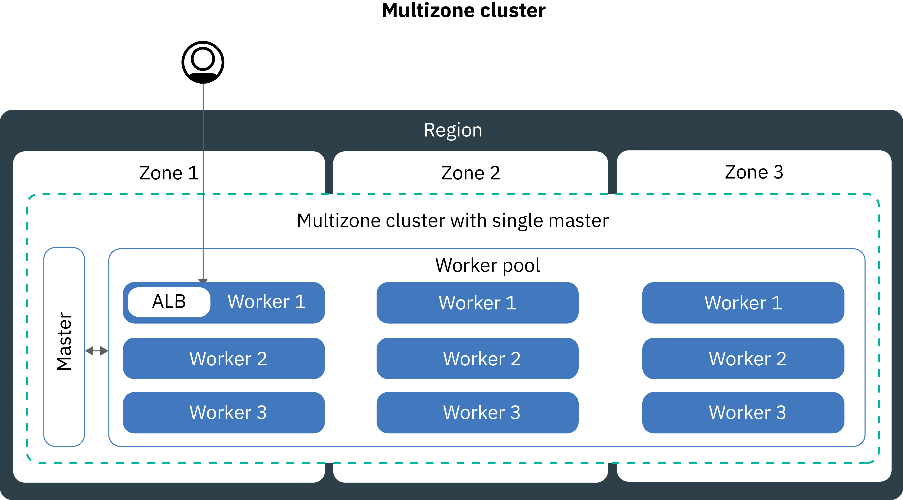

---

copyright:
  years: 2014, 2018
lastupdated: "2018-07-11"

---

{:new_window: target="_blank"}
{:shortdesc: .shortdesc}
{:screen: .screen}
{:pre: .pre}
{:table: .aria-labeledby="caption"}
{:codeblock: .codeblock}
{:tip: .tip}
{:download: .download}


# Setting up clusters
{: #clusters}

Design your Kubernetes cluster setup for maximum container availability and capacity with {{site.data.keyword.containerlong}}.
{:shortdesc}

## Creating multizone clusters in {{site.data.keyword.containershort_notm}}
{: #multizone}

With {{site.data.keyword.containerlong}}, you can create multizone clusters. Your users are less likely to experience downtime when you distribute your apps across multiple worker nodes and zones by using a worker pool. Built-in capabilities, like load balancing and isolation, increase resiliency against potential zone failures with hosts, networks, or apps. If resources in one zone go down, your cluster workloads still operate in the other zones.
{: shortdesc}

### Wait, what's all this talk about zones and pools? What's changed?
{: #mz_changed}

**Zones**, previously called locations, are data centers that you can create IBM Cloud resources in.

Clusters now have a feature called a **worker pool**, which is a collection of worker nodes with the same flavor, such as machine type, CPU, and memory. Use new `ibmcloud cs worker-pool` commands to make changes to your cluster, such as adding zones, adding worker nodes, or updating worker nodes.

The previous cluster setup of stand-alone worker nodes is supported, but deprecated. Be sure to [add a worker pool to your cluster](cs_clusters.html#add_pool), and then [migrate to using worker pools](cs_cluster_update.html#standalone_to_workerpool) to organize your worker nodes instead of stand-alone worker nodes.

### What do I need to know before I get started?
{: #general_reqs}

Before you get too far, you need to take care of a few admin items to ensure your multizone clusters are ready for workloads.

<dl>
<dt>VLANs required</dt>
  <dd><p>When you add a zone to a worker pool, you must define a private and a public VLAN that your worker nodes connect to.</p><ol><li>To check if you have existing VLANs in that zone that you can use, run `ibmcloud cs vlans <zone>`. Note the VLAN IDs and use them when you add a zone to a worker pool. </li>
  <li>If you do not have VLANs in that zone, a private and a public VLAN is automatically created for you. You do not have to specify a private and a public VLAN. </li></ul>
  </dd>
<dt>Enable VLAN spanning or VRF</dt>
  <dd><p>Your worker nodes must communicate with each other on the private network across zones. You have two options:</p>
  <ol><li>[Enable VLAN spanning](/docs/infrastructure/vlans/vlan-spanning.html#enable-or-disable-vlan-spanning) in your IBM Cloud infrastructure (SoftLayer) account. To enable VLAN spanning, you must have the <strong>Network > Manage Network VLAN Spanning</strong> [infrastructure permission](/docs/iam/infrastructureaccess.html#infrapermission), or you can request the account owner to enable it.</li>
  <li>Or, use a Virtual Router Function (VRF) enabled IBM Cloud infrastructure (SoftLayer) account. To get a VRF account, contact IBM Cloud infrastructure (SoftLayer) support.</li></ol></dd>
<dt>Prepare existing persistent volumes</dt>
  <dd><p>Persistent volumes can be used only in the zone where the actual storage device is located. To prevent unexpected app errors in a multizone cluster, you must apply region and zone labels to existing persistent volumes. These labels help the kube-scheduler to determine where to schedule an app that uses the persistent volume. Run the following command and replace <code>&lt;mycluster&gt;</code> with your cluster name:</p>
  <pre class="pre"><code>bash <(curl -Ls https://raw.githubusercontent.com/IBM-Cloud/kube-samples/master/file-pv-labels/apply_pv_labels.sh) <mycluster></code></pre></dd>
<dt>Only single zone clusters are available for {{site.data.keyword.Bluemix_dedicated_notm}} instances.</dt>
    <dd>With a {{site.data.keyword.Bluemix_dedicated_notm}}, you can create only [single zone clusters](cs_clusters.html#single_zone). The available zone was pre-defined when the {{site.data.keyword.Bluemix_dedicated_notm}} environment was set up. By default, a single zone cluster is set up with a worker pool that is named `default`. The worker pool groups worker nodes with the same configuration, such as the machine type, that you defined during cluster creation. You can add more worker nodes to your cluster by [resizing an existing worker pool](cs_clusters.html#resize_pool) or by [adding a new worker pool](cs_clusters.html#add_pool). When you add a worker pool, you must add the available zone to the worker pool so that workers can deploy into the zone. However, you cannot add other zones to your worker pools.</dd>
</dl>

### I'm ready to make a multizone cluster. How can I get started?
{: #mz_gs}

Start today in the [{{site.data.keyword.containershort_notm}} console](https://console.bluemix.net/containers-kubernetes/clusters) by clicking **Create Cluster**.

You can create a cluster in one of the [multizone cities](cs_regions.html#zones):
* Dallas in US South region: dal10, dal12, dal13
* Washington DC in US East region: wdc04, wdc06, wdc07
* Frankfurt in EU Central region: fra02, fra04, fra05
* London in UK South region: lon02, lon04, lon06

**Add zones to an existing cluster**:

If you have a cluster in a multizone city, you can add a worker pool to the cluster, and then add a zone to that worker pool by using the GUI or CLI. For a complete list of steps, see [Updating from stand-alone worker nodes to worker pools](cs_cluster_update.html#standalone_to_workerpool).

### Going forward, what are some changes from how I currently manage my clusters?
{: #mz_new_ways}

With the introduction of worker pools, you can use a new set of APIs and commands to manage your cluster. You can see these new commands in the [CLI documentation page](cs_cli_reference.html#cs_cli_reference), or in your terminal by running `ibmcloud cs help`.

The following table compares the old and new methods for a few common cluster management actions.
<table summary="The table shows the description of the new way to perform multizone commands. Rows are to be read from the left to right, with the description in column one, the old way in column two, and the new multizone way in column three.">
<caption>New methods for multizone worker pool commands.</caption>
  <thead>
  <th>Description</th>
  <th>Old stand-alone worker nodes</th>
  <th>New multizone worker pools</th>
  </thead>
  <tbody>
    <tr>
    <td>Add worker nodes to the cluster.</td>
    <td><strong>Deprecated</strong>: <code>ibmcloud cs worker-add</code> to add stand-alone worker nodes.</td>
    <td><ul><li>To add different machine types than your existing pool, create a new worker pool: <code>ibmcloud cs worker-pool-create</code> [command](cs_cli_reference.html#cs_worker_pool_create).</li>
    <li>To add worker nodes to an existing pool, resize the number of nodes per zone in the pool: <code>ibmcloud cs worker-pool-resize</code> [command](cs_cli_reference.html#cs_worker_pool_resize).</li></ul></td>
    </tr>
    <tr>
    <td>Remove worker nodes from the cluster.</td>
    <td><code>ibmcloud cs worker-rm</code>, which you can still use to delete a troublesome worker node from your cluster.</td>
    <td><ul><li>If your worker pool is unbalanced, for example after removing a worker node), rebalance it: <code>ibmcloud cs worker-pool-rebalance</code> [command](cs_cli_reference.html#cs_rebalance).</li>
    <li>To reduce the number of worker nodes in a pool, resize the number per zone (minimum value of 1): <code>ibmcloud cs worker-pool-resize</code> [command](cs_cli_reference.html#cs_worker_pool_resize).</li></ul></td>
    </tr>
    <tr>
    <td>Use a new VLAN for worker nodes.</td>
    <td><strong>Deprecated</strong>: Add a new worker node that uses the new private or public VLAN: <code>ibmcloud cs worker-add</code>.</td>
    <td>Set the worker pool to use a different public or private VLAN than what it previously used: <code>ibmcloud cs zone-network-set</code> [command](cs_cli_reference.html#cs_zone_network_set).</td>
    </tr>
  </tbody>
  </table>

### How can I learn more about multizone clusters?
{: #learn_more}

The entire documentation was updated for multizone. In particular, you might be interested in the following topics that changed quite a bit with the introduction of multizone clusters:
* [Setting up highly available clusters](#ha_clusters)
* [Planning highly available app deployments](cs_app.html#highly_available_apps)
* [Exposing apps with LoadBalancers for multizone clusters](cs_loadbalancer.html#multi_zone_config)
* [Exposing apps with Ingress](cs_ingress.html#ingress)
* For highly available persistent storage, use a cloud service such as [{{site.data.keyword.cloudant_short_notm}}](/docs/services/Cloudant/getting-started.html#getting-started-with-cloudant) or [{{site.data.keyword.cos_full_notm}}](/docs/services/cloud-object-storage/about-cos.html#about-ibm-cloud-object-storage).

## Setting up highly available clusters
{: #ha_clusters}
Design your standard cluster for maximum availability and capacity for your app with {{site.data.keyword.containerlong}}.

Your users are less likely to experience downtime when you distribute your apps across multiple worker nodes, zones, and clusters. Built-in capabilities, like load balancing and isolation, increase resiliency against potential failures with hosts, networks, or apps.

Review these potential cluster setups that are ordered with increasing degrees of availability.


1. A [single zone cluster](#single_zone) with multiple worker nodes in a worker pool.
2. A [multizone cluster](#multi_zone) that spreads worker nodes across zones within one region.
3. [Multiple clusters](#multiple_clusters) that are set up across zones or regions and that are connected via a global load balancer.

### Single zone cluster
{: #single_zone}

To improve availability for your app and to allow failover for the case that one worker node is not available in your cluster, add additional worker nodes to your single zone cluster.
{: shortdesc}


By default, your single zone cluster is set up with a worker pool that is named `default`. The worker pool groups worker nodes with the same configuration, such as the machine type, that you defined during cluster creation. You can add more worker nodes to your cluster by [resizing an existing worker pool](#resize_pool) or by [adding a new worker pool](#add_pool).

When you add more worker nodes, app instances can be distributed across multiple worker nodes. If one worker node goes down, app instances on available worker nodes continue to run. Kubernetes automatically reschedules pods from unavailable worker nodes to ensure performance and capacity for your app. To ensure that your pods are evenly distributed across worker nodes, implement [pod affinity](https://kubernetes.io/docs/concepts/configuration/assign-pod-node/#inter-pod-affinity-and-anti-affinity-beta-feature).

**Can I convert my single zone cluster to a multizone cluster?**
Sometimes. If your single zone cluster is in a [multizone metro city](cs_regions.html#zones), you can convert the single zone cluster to a multizone cluster. To convert to a multizone cluster [add a zone](#add_zone) to your cluster's worker pool. If you have multiple worker pools, add the zone to all the pools so that the worker nodes remain balanced across the cluster.

**Do I have to use multizone clusters?**
No. You can create as many single zone clusters as you like. Indeed, you might prefer single zone clusters for simplified management or if your cluster must reside in a specific [single zone city](cs_regions.html#zones).

### Multizone cluster
{: #multi_zone}

To protect your cluster against a single zone failure, you can spread your cluster across zones within one region.
{: shortdesc}



You can add additional zones to your cluster to replicate the worker nodes in your worker pools across multiple zones within one region. Multizone clusters are designed to evenly schedule pods across worker nodes and zones to assure availability and failure recovery. If worker nodes are not spread evenly across the zones or there is insufficient capacity in one of the zones, the Kubernetes scheduler might fail to schedule all requested pods. As a result, pods might go into **Pending** state until enough capacity is available. If you want to change the default behavior to make Kubernetes scheduler distribute pods across zones in a best effort distribution, use the `preferredDuringSchedulingIgnoredDuringExecution` [pod affinity policy](https://kubernetes.io/docs/concepts/configuration/assign-pod-node/#inter-pod-affinity-and-anti-affinity-beta-feature).

**Why do I need worker nodes in 3 zones?** </br>
Distributing your work load across 3 zones ensures high availability for your app in case one or two zones are not available, but it also makes your cluster setup more cost-efficient. Why is that, you ask? Here is an example.

Let's say you need a worker node with 6 cores to handle the workload for your app. To make your cluster more available, you have the following options:

- **Duplicate your resources in another zone:** This option leaves you with 2 worker nodes, each with 6 cores in each zone making it a total of 12 cores. </br>
- **Distribute resources across 3 zones:** With this option, you deploy 3 cores per zone, which leaves you with a total capacity of 9 cores. To handle your workload, two zones must be up at a time. If one zone is unavailable, the other two zones can handle your workload. If two zones are unavailable, the 3 remaining cores are up to handle your workload. Deploying 3 cores per zone means smaller machines and hence reduced cost for you.</br>

**How do I increase availability for my Kubernetes master?** </br>
A multizone cluster is set up with a single Kubernetes master that is provisioned in the same metro area as the workers. For example, if the workers are in one or multiple of the `dal10`, `dal12`, or `dal13` zones, the master is located in the Dallas multizone metro city.

**What happens if the Kubernetes master becomes unavailable?** </br>
You cannot access or change your cluster while the Kubernetes master is unavailable. However, worker nodes, apps, and resources that you deployed are not modified and continue to run. To protect your cluster against a Kubernetes master failure or in regions where multizone clusters are not available, you can [set up multiple clusters and connect them with a global load balancer](#multiple_clusters).

**How do I let my users access my app from the public Internet?**</br>
You can expose your apps by using an Ingress application load balancer (ALB) or load balancer service. By default, public ALBs are automatically created and enabled in each zone in your cluster. A multizone load balancer (MZLB) for your cluster is also automatically created and enabled. The MZLB health checks the ALBs in each zone of your cluster and keeps the DNS lookup results updated based on these health checks. For more information, see highly available [Ingress services](cs_ingress.html#planning).

Load balancer services are set up in one zone only. Incoming requests to your app are routed from that one zone to all app instances in other zones. If this zone becomes unavailable, then your app might not be reachable from the internet. You can set up additional load balancer services in other zones to account for a single zone failure. For more information, see highly available [load balancer services](cs_loadbalancer.html#multi_zone_config).

**I created my multizone cluster. Why is there still only one zone? How do I add zones to my cluster?**</br>
If you [create your multizone cluster with the CLI](#clusters_cli), the cluster is created, but you must add zones to the worker pool to complete the process. To span across multiple zones, your cluster must be in a [multizone metro city](cs_regions.html#zones). To add a zone to your cluster and spread worker nodes across zones, see [Adding a zone to your cluster](#add_zone).

### Multiple clusters connected with a global load balancer
{: #multiple_clusters}

To protect your app from a Kubernetes master failure and for regions where multizone clusters are not available, you can create multiple clusters in different zones within a region and connect them with a global load balancer.
{: shortdesc}


To balance your workload across multiple clusters, you must set up a global load balancer and add the IP addresses of your application load balancers (ALBs) or load balancer services to your domain. By adding these IP addresses, you can route incoming traffic between your clusters. For the global load balancer to detect if one of your clusters is unavailable, consider adding a ping-based health check to every IP address. When you set up this check, your DNS provider regularly pings the IP addresses that you added to your domain. If one IP address becomes unavailable, then traffic is not sent to this IP address anymore. However, Kubernetes does not automatically restart pods from the unavailable cluster on worker nodes in available clusters. If you want Kubernetes to automatically restart pods in available clusters, consider setting up a [multizone cluster](#multi_zone).

**Why do I need 3 clusters in 3 zones?** </br>
Similar to using [3 zones in a multizone clusters](#multi_zone), you can provide more availability to your app by setting up 3 clusters across zones. You can also reduce costs by purchasing smaller machines to handle your workload.

**What if I want to set up multiple clusters across regions?** </br>
You can set up multiple clusters in different regions of one geolocation (such as US South and US East) or across geolocations (such as US South and EU Central). Both setups offer the same level of availability for your app, but also add complexity when it comes to data sharing and data replication. For most cases, staying within the same geolocation is sufficient. But if you have users across the world, it might be better to set up a cluster where your users are, so that your users do not experience long waiting times when they send a request to your app.

**To set up a global load balancer for multiple clusters:**

1. [Create clusters](cs_clusters.html#clusters) in multiple zones or regions.
2. Enable [VLAN spanning](/docs/infrastructure/vlans/vlan-spanning.html#enable-or-disable-vlan-spanning) for your IBM Cloud infrastructure (SoftLayer) account so your worker nodes can communicate with each other on the private network. To perform this action, you need the **Network > Manage Network VLAN Spanning** [infrastructure permission](cs_users.html#infra_access), or you can request the account owner to enable it. As an alternative to VLAN spanning, you can use a Virtual Router Function (VRF) if it is enabled in your IBM Cloud infrastructure (SoftLayer) account.
3. In each cluster, expose your app by using an [application load balancer (ALB)](cs_ingress.html#ingress_expose_public) or [load balancer service](cs_loadbalancer.html#config).
4. For each cluster, list the public IP addresses for your ALBs or load balancer services.
   - To list the IP address of all public enabled ALBs in your cluster:
     ```
     ibmcloud cs albs --cluster <cluster_name_or_id>
     ```
     {: pre}

   - To list the IP address for your load balancer service:
     ```
     kubectl describe service <myservice>
     ```
     {: pre}

     The **Load Balancer Ingress** IP address is the portable IP address that was assigned to your load balancer service.
4. Set up a global load balancer by using {{site.data.keyword.Bluemix_notm}} Internet Services (CIS) or set up your own global load balancer.
    * To use a CIS global load balancer:
        1. Set up the service by following steps 1 - 4 in [Getting Started with {{site.data.keyword.Bluemix_notm}} Internet Services (CIS)](/docs/infrastructure/cis/getting-started.html#getting-started-with-ibm-cloud-internet-services-cis-).
            * Steps 1 - 3 walk you through provisioning the service instance, adding your app domain, and configuring your name servers.
            * Step 4 walks you through creating DNS records. Create a DNS record for each ALB or load balancer IP address that you collected. These DNS records map your app domain to all of your cluster ALBs or load balancers, and ensure that requests to your app domain are forwarded to your clusters in a round-robin cycle.
        2. [Add health checks](/docs/infrastructure/cis/glb-setup.html#add-a-health-check) for the ALBs or load balancers. You can use the same health check for the ALBs or load balancers in all of your clusters, or create specific health checks to use for specific clusters.
        3. [Add an origin pool](/docs/infrastructure/cis/glb-setup.html#add-a-pool) for each cluster by adding the cluster's ALB or load balancer IPs. For example, if you have 3 clusters that each have 2 ALBs, create 3 origin pools that each have 2 ALB IP addresses. Add a health check to each origin pool that you create.
        4. [Add a global load balancer](/docs/infrastructure/cis/glb-setup.html#set-up-and-configure-your-load-balancers).
    * To use your own global load balancer:
        1. Configure your domain to route incoming traffic to your ALB or load balancer services by adding the IP addresses of all public enabled ALBs and load balancer services to your domain.
        2. For each IP address, enable a ping-based health check so that your DNS provider can detect unhealthy IP addresses. If an unhealthy IP address is detected, traffic is not routed to this IP address anymore.

## Worker node configuration planning
{: #planning_worker_nodes}

A Kubernetes cluster consists of worker nodes that are grouped in worker node pools and is centrally monitored and managed by the Kubernetes master. Cluster admins decide how to set up the cluster of worker nodes to ensure that cluster users have all the resources to deploy and run apps in the cluster.
{:shortdesc}

When you create a standard cluster, worker nodes of the same configuration are ordered in IBM Cloud infrastructure (SoftLayer) on your behalf and added to the default worker node pool in your cluster. Every worker node is assigned a unique worker node ID and domain name that must not be changed after the cluster is created.

You can choose between virtual or physical (bare metal) servers. Depending on the level of hardware isolation that you choose, virtual worker nodes can be set up as shared or dedicated nodes. You can also choose whether you want worker nodes to connect to a public VLAN and private VLAN, or only to a private VLAN. Every worker node is provisioned with a specific machine type that determines the number of vCPUs, memory, and disk space that are available to the containers that are deployed to the worker node. Kubernetes limits the maximum number of worker nodes that you can have in a cluster. Review [worker node and pod quotas ](https://kubernetes.io/docs/setup/cluster-large/) for more information.


### Worker pools
{: #worker_pools}

Every cluster is set up with a default worker pool that groups worker nodes with the same configuration that you defined during cluster creation, such as the machine type. If you provision a cluster from the UI, you can select multiple zones at the same time. Clusters that are created from the CLI are initially provisioned with a worker pool in one zone only. You can add more zones to your worker pool after the cluster is provisioned to replicate worker nodes evenly across zones. For example, if you add a second zone to a worker pool that consists of 3 worker nodes, then 3 worker nodes are provisioned into the second zone which leaves you with a cluster of 6 worker nodes in total.

If you have worker nodes in different zones, enable [VLAN spanning](/docs/infrastructure/vlans/vlan-spanning.html#enable-or-disable-vlan-spanning) for your IBM Cloud infrastructure (SoftLayer) account. This procedure ensures that your worker nodes can communicate with each other on the private network. To add different machine type flavors to your cluster, [create another worker pool(cs_cli_reference.html#cs_worker_pool_add).

### Hardware for worker nodes
{: #shared_dedicated_node}

When you create a standard cluster in {{site.data.keyword.Bluemix_notm}}, you choose to provision your worker nodes as physical machines (bare metal) or as virtual machines that run on physical hardware. When you create a free cluster, your worker node is automatically provisioned as a virtual, shared node in the IBM Cloud infrastructure (SoftLayer) account.
{:shortdesc}


Review the following information to decide what type of worker pools you want. As you plan, consider the [worker node limit minimum threshold](#resource_limit_node) of 10% of total memory capacity.

<dl>
<dt>Why would I use physical machines (bare metal)?</dt>
<dd><p><strong>More compute resources</strong>: You can provision your worker node as a single-tenant physical server, also referred to as bare metal. Bare metal gives you direct access to the physical resources on the machine, such as the memory or CPU. This setup eliminates the virtual machine hypervisor that allocates physical resources to virtual machines that run on the host. Instead, all of a bare metal machine's resources are dedicated exclusively to the worker, so you don't need to worry about "noisy neighbors" sharing resources or slowing down performance. Physical machine types have more local storage than virtual, and some have RAID to back up local data.</p>
<p><strong>Monthly billing</strong>: Bare metal servers are more expensive than virtual servers, and are best suited for high-performance apps that need more resources and host control. Bare metal servers are billed monthly. If you cancel a bare metal server before the end of the month, you are charged through the end of that month. Ordering and canceling bare metal servers is a manual process through your IBM Cloud infrastructure (SoftLayer) account. It can take more than one business day to complete.</p>
<p><strong>Option to enable Trusted Compute</strong>: Enable Trusted Compute to verify your worker nodes against tampering. If you don't enable trust during cluster creation but want to later, you can use the `ibmcloud cs feature-enable` [command](cs_cli_reference.html#cs_cluster_feature_enable). After you enable trust, you cannot disable it later. You can make a new cluster without trust. For more information about how trust works during the node startup process, see [{{site.data.keyword.containershort_notm}} with Trusted Compute](cs_secure.html#trusted_compute). Trusted Compute is available on clusters that run Kubernetes version 1.9 or later and have certain bare metal machine types. When you run the `ibmcloud cs machine-types <zone>` [command](cs_cli_reference.html#cs_machine_types), you can see which machines support trust by reviewing the **Trustable** field. For example, `mgXc` GPU flavors do not support Trusted Compute.</p></dd>
<dt>Why would I use virtual machines?</dt>
<dd><p>With VMs, you get greater flexibility, quicker provisioning times, and more automatic scalability features than bare metal, at a more cost-effective price. You can use VMs for most general purpose use cases such as testing and development environments, staging and prod environments, microservices, and business apps. However, there is a trade-off in performance. If you need high performance computing for RAM-, data-, or GPU-intensive workloads, use bare metal.</p>
<p><strong>Decide between single or multiple tenancy</strong>: When you create a standard virtual cluster, you must choose whether you want the underlying hardware to be shared by multiple {{site.data.keyword.IBM_notm}} customers (multi tenancy) or to be dedicated to you only (single tenancy).</p>
<p>In a multi-tenant set up, physical resources, such as CPU and memory, are shared across all virtual machines that are deployed to the same physical hardware. To ensure that every virtual machine can run independently, a virtual machine monitor, also referred to as the hypervisor, segments the physical resources into isolated entities and allocates them as dedicated resources to a virtual machine (hypervisor isolation).</p>
<p>In a single-tenant set up, all physical resources are dedicated to you only. You can deploy multiple worker nodes as virtual machines on the same physical host. Similar to the multi-tenant set up, the hypervisor assures that every worker node gets its share of the available physical resources.</p>
<p>Shared nodes are usually less costly than dedicated nodes because the costs for the underlying hardware are shared among multiple customers. However, when you decide between shared and dedicated nodes, you might want to check with your legal department to discuss the level of infrastructure isolation and compliance that your app environment requires.</p>
<p><strong>Virtual `u2c` or `b2c` machine flavors</strong>: These machines use local disk instead of storage area networking (SAN) for reliability. Reliability benefits include higher throughput when serializing bytes to the local disk and reduced file system degradation due to network failures. These machine types contain 25GB primary local disk storage for the OS file system, and 100GB secondary local disk storage for data such as container runtime and the kubelet.</p>
<p><strong>What if I have deprecated `u1c` or `b1c` machine types?</strong> To start using `u2c` and `b2c` machine types, [update the machine types by adding worker nodes](cs_cluster_update.html#machine_type).</p></dd>
<dt>What virtual and physical machine flavors can I choose from?</dt>
<dd><p>Many! Select the type of machine that is best for your use case. Remember that a worker pool consists of machines that are the same flavor. If you want a mix of machine types in your cluster, create separate worker pools for each flavor.</p>
<p>Machine types vary by zone. To see the machine types available in your zone, run `ibmcloud cs machine-types <zone_name>`.</p>
<p><table>
<caption>Available physical (bare metal) and virtual machine types in {{site.data.keyword.containershort_notm}}.</caption>
<thead>
<th>Name and use case</th>
<th>Cores / Memory</th>
<th>Primary / Secondary disk</th>
<th>Network speed</th>
</thead>
<tbody>
<tr>
<td><strong>Virtual, u2c.2x4</strong>: Use this smallest size VM for quick testing, proofs of concept, and other light workloads.</td>
<td>2 / 4GB</td>
<td>25GB / 100GB</td>
<td>1000Mbps</td>
</tr>
<tr>
<td><strong>Virtual, b2c.4x16</strong>: Select this balanced VM for testing and development, and other light workloads.</td>
<td>4 / 16GB</td>
<td>25GB / 100GB</td>
<td>1000Mbps</td>
</tr>
<tr>
<td><strong>Virtual, b2c.16x64</strong>: Select this balanced VM for mid-sized workloads.</td></td>
<td>16 / 64GB</td>
<td>25GB / 100GB</td>
<td>1000Mbps</td>
</tr>
<tr>
<td><strong>Virtual, b2c.32x128</strong>: Select this balanced VM for mid to large workloads, such as a database and a dynamic website with many concurrent users.</td></td>
<td>32 / 128GB</td>
<td>25GB / 100GB</td>
<td>1000Mbps</td>
</tr>
<tr>
<td><strong>Virtual, b2c.56x242</strong>: Select this balanced VM for large workloads, such as a database and multiple apps with many concurrent users.</td></td>
<td>56 / 242GB</td>
<td>25GB / 100GB</td>
<td>1000Mbps</td>
</tr>
<tr>
<td><strong>RAM-intensive bare metal, mr1c.28x512</strong>: Maximize the RAM available to your worker nodes.</td>
<td>28 / 512GB</td>
<td>2TB SATA / 960GB SSD</td>
<td>10000Mbps</td>
</tr>
<tr>
<td><strong>GPU bare metal, mg1c.16x128</strong>: Choose this type for mathematically-intensive workloads such as high performance computing, machine learning, or 3D applications. This flavor has 1 Tesla K80 physical card that has 2 graphics processing units (GPUs) per card for a total of 2 GPUs.</td>
<td>16 / 128GB</td>
<td>2TB SATA / 960GB SSD</td>
<td>10000Mbps</td>
</tr>
<tr>
<td><strong>GPU bare metal, mg1c.28x256</strong>: Choose this type for mathematically-intensive workloads such as high performance computing, machine learning, or 3D applications. This flavor has 2 Tesla K80 physical cards that have 2 GPUs per card for a total of 4 GPUs.</td>
<td>28 / 256GB</td>
<td>2TB SATA / 960GB SSD</td>
<td>10000Mbps</td>
</tr>
<tr>
<td><strong>Data-intensive bare metal, md1c.16x64.4x4tb</strong>: For a significant amount of local disk storage, including RAID to back up data that is stored locally on the machine. Use for cases such as distributed file systems, large databases, and big data analytics workloads.</td>
<td>16 / 64GB</td>
<td>2x2TB RAID1 / 4x4TB SATA RAID10</td>
<td>10000Mbps</td>
</tr>
<tr>
<td><strong>Data-intensive bare metal, md1c.28x512.4x4tb</strong>: For a significant amount of local disk storage, including RAID to back up data that is stored locally on the machine. Use for cases such as distributed file systems, large databases, and big data analytics workloads.</td>
<td>28 / 512 GB</td>
<td>2x2TB RAID1 / 4x4TB SATA RAID10</td>
<td>10000Mbps</td>
</tr>
<tr>
<td><strong>Balanced bare metal, mb1c.4x32</strong>: Use for balanced workloads that require more compute resources than virtual machines offer.</td>
<td>4 / 32GB</td>
<td>2TB SATA / 2TB SATA</td>
<td>10000Mbps</td>
</tr>
<tr>
<td><strong>Balanced bare metal, mb1c.16x64</strong>: Use for balanced workloads that require more compute resources than virtual machines offer.</td>
<td>16 / 64GB</td>
<td>2TB SATA / 960GB SSD</td>
<td>10000Mbps</td>
</tr>
</tbody>
</table>
</p>
</dd>
</dl>


You can deploy clusters by using the [console UI](#clusters_ui) or the [CLI](#clusters_cli).

### VLAN connection for worker nodes
{: #worker_vlan_connection}

When you create a cluster, every cluster is automatically connected to a VLAN from your IBM Cloud infrastructure (SoftLayer) account.
{:shortdesc}

A VLAN configures a group of worker nodes and pods as if they were attached to the same physical wire.
* The public VLAN has two subnets automatically provisioned on it. The primary public subnet determines the public IP address that is assigned to a worker node during cluster creation, and the portable public subnet provides public IP addresses for Ingress and load balancer networking services.
* The private VLAN also has two subnets automatically provisioned on it. The primary private subnet determines the private IP address that is assigned to a worker node during cluster creation, and the portable private subnet provides private IP addresses for Ingress and load balancer networking services.

For free clusters, the cluster's worker nodes are connected to an IBM-owned public VLAN and private VLAN by default during cluster creation.

For standard clusters, the first time that you create a cluster in a zone, a public VLAN and a private VLAN are automatically provisioned for you. For every subsequent cluster that you create in that zone, you choose the VLANs that you want to use. You can either connect your worker nodes to both a public VLAN and the private VLAN, or to the private VLAN only. If you want to connect your worker nodes to a private VLAN only, you can use the ID of an existing private VLAN or [create a private VLAN](/docs/cli/reference/softlayer/index.html#sl_vlan_create) and use the ID during cluster creation. If worker nodes are set up with a private VLAN only, you must configure an alternative solution for network connectivity, such as a [Virtual Router Appliance](cs_vpn.html#vyatta), so that the worker nodes can communicate with the master.

**Note**: If you have multiple VLANs for a cluster or multiple subnets on the same VLAN, you must turn on VLAN spanning so that your worker nodes can communicate with each other on the private network. For instructions, see [Enable or disable VLAN spanning](/docs/infrastructure/vlans/vlan-spanning.html#enable-or-disable-vlan-spanning).

### Worker node memory limits
{: #resource_limit_node}

{{site.data.keyword.containershort_notm}} sets a memory limit on each worker node. When pods that are running on the worker node exceed this memory limit, the pods are removed. In Kubernetes, this limit is called a [hard eviction threshold ](https://kubernetes.io/docs/tasks/administer-cluster/out-of-resource/#hard-eviction-thresholds).
{:shortdesc}

If your pods are removed frequently, add more worker nodes to your cluster or set [resource limits ](https://kubernetes.io/docs/concepts/configuration/manage-compute-resources-container/#resource-requests-and-limits-of-pod-and-container) on your pods.

**Each machine has a minimum threshold that equals 10% of its total memory capacity**. When there is less memory available on the worker node than the minimum threshold that is allowed, Kubernetes immediately removes the pod. The pod reschedules onto another worker node if a worker node is available. For example, if you have a `b2c.4x16` virtual machine, its total memory capacity is 16GB. If less than 1600MB (10%) of memory is available, new pods cannot schedule onto this worker node but instead are scheduled onto another worker node. If no other worker node is available, the new pods remain unscheduled.

To review how much memory is used on your worker node, run [kubectl top node ](https://kubernetes.io/docs/reference/kubectl/overview/#top).

### Autorecovery for your worker nodes
`Docker`, `kubelet`, `kube-proxy`, and `calico` are critical components that must be functional to have a healthy Kubernetes worker node. Over time these components can break and may leave your worker node in a nonfunctional state. Nonfunctional worker nodes decrease total capacity of the cluster and can result in downtime for your app.

You can [configure health checks for your worker node and enable Autorecovery](cs_health.html#autorecovery). If Autorecovery detects an unhealthy worker node based on the configured checks, Autorecovery triggers a corrective action like an OS reload on the worker node. For more information about how Autorecovery works, see the [Autorecovery blog ](https://www.ibm.com/blogs/bluemix/2017/12/autorecovery-utilizes-consistent-hashing-high-availability/).

<br />


## Creating clusters with the GUI
{: #clusters_ui}

The purpose of the Kubernetes cluster is to define a set of resources, nodes, networks, and storage devices that keep apps highly available. Before you can deploy an app, you must create a cluster and set the definitions for the worker nodes in that cluster.
{:shortdesc}

**Before you begin**

You must have a Trial, Pay-As-You-Go, or Subscription [{{site.data.keyword.Bluemix_notm}} account](https://console.bluemix.net/registration/).

To fully-customize your clusters with your choice of hardware isolation, zone, API version and more, create a standard cluster.
{: tip}

**To create a free cluster**

You can use your 1 free cluster to become familiar with how {{site.data.keyword.containershort_notm}} works. With free clusters, you can learn the terminology, complete a tutorial, and get your bearings before you take the leap to production-level standard clusters. Don't worry, you still get a free cluster, even if you have a Pay-As-You-Go or Subscription account. **Note**: Free clusters have a life span of 21 days. After that time, the cluster expires and the cluster and its data are deleted. The deleted data is not backed up by {{site.data.keyword.Bluemix_notm}} and cannot be restored. Be sure to back up any important data.

1. In the catalog, select **{{site.data.keyword.containershort_notm}}**.

2. Select a region in which to deploy your cluster.

3. Select the **Free** cluster plan.

4. Give your cluster a name. The name must start with a letter, can contain letters, numbers, and hyphen (-), and must be 35 characters or fewer. The cluster name and the region in which the cluster is deployed form the fully qualified domain name for the Ingress subdomain. To ensure that the Ingress subdomain is unique within a region, the cluster name might be truncated and appended with a random value within the Ingress domain name.


5. Click **Create cluster**. By default, a worker pool with one worker node is created. You can see the progress of the worker node deployment in the **Worker nodes** tab. When the deploy is done, you can see that your cluster is ready in the **Overview** tab.

    Changing the unique ID or domain name that is assigned during creation blocks the Kubernetes master from managing your cluster.
    {: tip}

</br>

**To create a standard cluster**

1. In the catalog, select **{{site.data.keyword.containershort_notm}}**.

2. Select a region in which to deploy your cluster. For the best performance, select the region that is physically closest to you. Keep in mind that if you select a zone that is outside of your country, you might require legal authorization prior to the data being stored.

3. Select the **Standard** cluster plan. With a standard cluster you have access to features like multiple worker nodes for a highly available environment.

4. Enter your zone details.

    1. Select **Single zone** or **Multizone** availability. In a multizone cluster the master node is deployed in a multizone-capable zone and your cluster's resources are spread across multiple zones. Your choices might be limited by region.

    2. Select the specific zones in which you want to host your cluster. You must select at least 1 zone but you can select as many as you would like. If you select more than 1 zone, the worker nodes are spread across the zones that you choose which gives you higher availability. If you select only 1 zone, you can [add zones to your cluster](#add_zone) after it is created.

    3. Select a public VLAN (optional) and a private VLAN (required) from your IBM Cloud infrastructure (SoftLayer) account. Worker nodes communicate with each other by using the private VLAN. To communicate with the Kubernetes master, you must configure public connectivity for your worker node.  If you do not have a public or private VLAN in this zone, leave it blank. A public and a private VLAN is automatically created for you. If you have existing VLANs and you do not specify a public VLAN, consider configuring a firewall, such as a [Virtual Router Appliance](/docs/infrastructure/virtual-router-appliance/about.html#about). You can use the same VLAN for multiple clusters. Be sure to turn on [VLAN spanning](/docs/infrastructure/vlans/vlan-spanning.html#enable-or-disable-vlan-spanning) if you select more than one zone.
        **Note**: If worker nodes are set up with a private VLAN only, you must configure an alternative solution for network connectivity. For more information, see [VLAN connection for worker nodes](cs_clusters.html#worker_vlan_connection).

5. Configure your default worker pool. Worker pools are groups of worker nodes that share the same configuration. You can always add more worker pools to your cluster later.

    1. Select a type of hardware isolation. Virtual is billed hourly and bare metal is billed monthly.

        - **Virtual - Dedicated**: Your worker nodes are hosted on infrastructure that is devoted to your account. Your physical resources are completely isolated.

        - **Virtual - Shared**: Infrastructure resources, such as the hypervisor and physical hardware, are shared across you and other IBM customers, but each worker node is accessible only by you. Although this option is less expensive and sufficient in most cases, you might want to verify your performance and infrastructure requirements with your company policies.

        - **Bare Metal**: Billed monthly, bare metal servers are provisioned by manual interaction with IBM Cloud infrastructure (SoftLayer), and can take more than one business day to complete. Bare metal is best suited for high-performance applications that need more resources and host control. For clusters that run Kubernetes version 1.9 or later, you can also choose to enable [Trusted Compute](cs_secure.html#trusted_compute) to verify your worker nodes against tampering. Trusted Compute is available for select bare metal machine types. For example, `mgXc` GPU flavors do not support Trusted Compute. If you don't enable trust during cluster creation but want to later, you can use the `ibmcloud cs feature-enable` [command](cs_cli_reference.html#cs_cluster_feature_enable). After you enable trust, you cannot disable it later.

        Be sure that you want to provision a bare metal machine. Because it is billed monthly, if you cancel it immediately after an order by mistake, you are still charged the full month.
        {:tip}

    2. Select a machine type. The machine type defines the amount of virtual CPU, memory, and disk space that is set up in each worker node and made available to the containers. Available bare metal and virtual machines types vary by the zone in which you deploy the cluster. After you create your cluster, you can add different machine types by adding a worker or pool to the cluster.

    3. Specify the number of worker nodes that you need in the cluster. The number of workers that you enter is replicated across the number of zones that you selected. This means that if you have 2 zones and select 3 worker nodes, 6 nodes are provisioned, and 3 nodes live in each zone.

6. Give your cluster a unique name. **Note**: Changing the unique ID or domain name that is assigned during creation blocks the Kubernetes master from managing your cluster.

7. Choose the Kubernetes API server version for the cluster master node.

8. Click **Create cluster**. A worker pool is created with the number of workers that you specified. You can see the progress of the worker node deployment in the **Worker nodes** tab. When the deploy is done, you can see that your cluster is ready in the **Overview** tab.

**What's next?**

When the cluster is up and running, you can check out the following tasks:

-   Spread worker nodes across multiple zones by [adding a zone to your cluster](#add_zone).
-   [Install the CLIs to start working with your cluster.](cs_cli_install.html#cs_cli_install)
-   [Deploy an app in your cluster.](cs_app.html#app_cli)
-   [Set up your own private registry in {{site.data.keyword.Bluemix_notm}} to store and share Docker images with other users.](/docs/services/Registry/index.html)
- If you have multiple VLANs for a cluster or multiple subnets on the same VLAN, you must [turn on VLAN spanning](/docs/infrastructure/vlans/vlan-spanning.html#enable-or-disable-vlan-spanning) so that your worker nodes can communicate with each other on the private network.
- If you have a firewall, you might need to [open the required ports](cs_firewall.html#firewall) to use `ibmcloud`, `kubectl`, or `calicotl` commands, to allow outbound traffic from your cluster, or to allow inbound traffic for networking services.
-  Clusters with Kubernetes version 1.10.3 or later: Control who can create pods in your cluster with [pod security policies](cs_psp.html).

<br />


## Creating clusters with the CLI
{: #clusters_cli}

The purpose of the Kubernetes cluster is to define a set of resources, nodes, networks, and storage devices that keep apps highly available. Before you can deploy an app, you must create a cluster and set the definitions for the worker nodes in that cluster.
{:shortdesc}

Before you begin:
- You must have a Pay-As-You-Go or Subscription [{{site.data.keyword.Bluemix_notm}} account](https://console.bluemix.net/registration/) that is configured to [access the IBM Cloud infrastructure (SoftLayer) portfolio](cs_troubleshoot_clusters.html#cs_credentials). You can create 1 free cluster to try out some of the capabilities for 30 days, or create fully-customizable standard clusters with your choice of hardware isolation.
- [Make sure you have the minimum required permissions in IBM Cloud infrastructure (SoftLayer) to provision a standard cluster](cs_users.html#infra_access).

To create a cluster:

1.  Install the {{site.data.keyword.Bluemix_notm}} CLI and the [{{site.data.keyword.containershort_notm}} plug-in](cs_cli_install.html#cs_cli_install).

2.  Log in to the {{site.data.keyword.Bluemix_notm}} CLI. Enter your {{site.data.keyword.Bluemix_notm}} credentials when prompted.

    ```
    ibmcloud login
    ```
    {: pre}

    **Note:** If you have a federated ID, use `ibmcloud login --sso` to log in to the {{site.data.keyword.Bluemix_notm}} CLI. Enter your user name and use the provided URL in your CLI output to retrieve your one-time passcode. You know you have a federated ID when the login fails without the `--sso` and succeeds with the `--sso` option.

3. If you have multiple {{site.data.keyword.Bluemix_notm}} accounts, select the account where you want to create your Kubernetes cluster.

4.  If you want to create or access Kubernetes clusters in a region other than the {{site.data.keyword.Bluemix_notm}} region that you selected earlier, run `ibmcloud cs region-set`.

6.  Create a cluster.

    1.  **Standard clusters**: Review the zones that are available. The zones that are shown depend on the {{site.data.keyword.containershort_notm}} region that you are logged in.
        
        **Note**: To span your cluster across zones, you must create the cluster in a [multizone-capable zone](cs_regions.html#zones).

        ```
        ibmcloud cs zones
        ```
        {: pre}
        
    2.  **Standard clusters**: Choose a zone and review the machine types available in that zone. The machine type specifies the virtual or physical compute hosts that are available to each worker node.

        -  View the **Server Type** field to choose virtual or physical (bare metal) machines.
        -  **Virtual**: Billed hourly, virtual machines are provisioned on shared or dedicated hardware.
        -  **Physical**: Billed monthly, bare metal servers are provisioned by manual interaction with IBM Cloud infrastructure (SoftLayer), and can take more than one business day to complete. Bare metal is best suited for high-performance applications that need more resources and host control.
        - **Physical machines with Trusted Compute**: For bare metal clusters that run Kubernetes version 1.9 or later, you can also choose to enable [Trusted Compute](cs_secure.html#trusted_compute) to verify your bare metal worker nodes against tampering. Trusted Compute is available for select bare metal machine types. For example, `mgXc` GPU flavors do not support Trusted Compute. If you don't enable trust during cluster creation but want to later, you can use the `ibmcloud cs feature-enable` [command](cs_cli_reference.html#cs_cluster_feature_enable). After you enable trust, you cannot disable it later.
        -  **Machine types**: To decide what machine type to deploy, review the core, memory, and storage combinations or consult the `ibmcloud cs machine-types` [command documentation](cs_cli_reference.html#cs_machine_types). After you create your cluster, you can add different physical or virtual machine types by using the `ibmcloud cs worker-add` [command](cs_cli_reference.html#cs_worker_add).

           Be sure that you want to provision a bare metal machine. Because it is billed monthly, if you cancel it immediately after an order by  mistake, you are still charged the full month.
           {:tip}

        ```
        ibmcloud cs machine-types <zone>
        ```
        {: pre}

    3.  **Standard clusters**: Check to see if a public and private VLAN already exists in the IBM Cloud infrastructure (SoftLayer) for this account.

        ```
        ibmcloud cs vlans <zone>
        ```
        {: pre}

        ```
        ID        Name   Number   Type      Router
        1519999   vlan   1355     private   bcr02a.dal10
        1519898   vlan   1357     private   bcr02a.dal10
        1518787   vlan   1252     public    fcr02a.dal10
        1518888   vlan   1254     public    fcr02a.dal10
        ```
        {: screen}

        If a public and private VLAN already exist, note the matching routers. Private VLAN routers always begin with <code>bcr</code> (back-end router) and public VLAN routers always begin with <code>fcr</code> (front-end router). When creating a cluster and specifying the public and private VLANs, the number and letter combination after those prefixes must match. In the example output, any of the private VLANs can be used with any of public VLANs because the routers all include `02a.dal10`.

        You must connect your worker nodes to a private VLAN, and optionally, you can connect your worker nodes to a public VLAN. **Note**: If worker nodes are set up with a private VLAN only, you must configure an alternative solution for network connectivity. For more information, see [VLAN connection for worker nodes](cs_clusters.html#worker_vlan_connection).

    4.  **Free and standard clusters**: Run the `cluster-create` command. You can choose between a free cluster, which includes one worker node set up with 2vCPU and 4GB memory and is automatically deleted after 30 days. When you create a standard cluster, by default, the worker node disks are encrypted, its hardware is shared by multiple IBM customers, and it is billed by hours of usage. </br>Example for a standard cluster. Specify the cluster's options:

        ```
        ibmcloud cs cluster-create --zone dal10 --machine-type b2c.4x16 --hardware <shared_or_dedicated> --public-vlan <public_VLAN_ID> --private-vlan <private_VLAN_ID> --workers 3 --name <cluster_name> --kube-version <major.minor.patch> [--disable-disk-encrypt] [--trusted]
        ```
        {: pre}

        Example for a free cluster. Specify the cluster name:

        ```
        ibmcloud cs cluster-create --name my_cluster
        ```
        {: pre}

        <table>
        <caption>cluster-create components</caption>
        <thead>
        <th colspan=2> Understanding this command's components</th>
        </thead>
        <tbody>
        <tr>
        <td><code>cluster-create</code></td>
        <td>The command to create a cluster in your {{site.data.keyword.Bluemix_notm}} organization.</td>
        </tr>
        <tr>
        <td><code>--zone <em>&lt;zone&gt;</em></code></td>
        <td>**Standard clusters**: Replace <em>&lt;zone&gt;</em> with the {{site.data.keyword.Bluemix_notm}} zone ID where you want to create your cluster. Available zones depend on the {{site.data.keyword.containershort_notm}} region that you are logged in to.<br></br>**Note**: The cluster worker nodes are deployed into this zone. To span your cluster across zones, you must create the cluster in a [multizone-capable zone](cs_regions.html#zones). After the cluster is created, you can [add a zone to the cluster](#add_zone).</td>
        </tr>
        <tr>
        <td><code>--machine-type <em>&lt;machine_type&gt;</em></code></td>
        <td>**Standard clusters**: Choose a machine type. You can deploy your worker nodes as virtual machines on shared or dedicated hardware, or as physical machines on bare metal. Available physical and virtual machines types vary by the zone in which you deploy the cluster. For more information, see the documentation for the `ibmcloud cs machine-type` [command](cs_cli_reference.html#cs_machine_types). For free clusters, you do not have to define the machine type.</td>
        </tr>
        <tr>
        <td><code>--hardware <em>&lt;shared_or_dedicated&gt;</em></code></td>
        <td>**Standard clusters, virtual-only**: The level of hardware isolation for your worker node. Use dedicated to have available physical resources dedicated to you only, or shared to allow physical resources to be shared with other IBM customers. The default is shared. This value is optional for standard clusters and is not available for free clusters.</td>
        </tr>
        <tr>
        <td><code>--public-vlan <em>&lt;public_vlan_id&gt;</em></code></td>
        <td><ul>
          <li>**Free clusters**: You do not have to define a public VLAN. Your free cluster is automatically connected to a public VLAN that is owned by IBM.</li>
          <li>**Standard clusters**: If you already have a public VLAN set up in your IBM Cloud infrastructure (SoftLayer) account for that zone, enter the ID of the public VLAN. If you want to connect your worker nodes to a private VLAN only, do not specify this option. **Note**: If worker nodes are set up with a private VLAN only, you must configure an alternative solution for network connectivity. For more information, see [VLAN connection for worker nodes](cs_clusters.html#worker_vlan_connection).<br/><br/>
          <strong>Note</strong>: Private VLAN routers always begin with <code>bcr</code> (back-end router) and public VLAN routers always begin with <code>fcr</code> (front-end router). When creating a cluster and specifying the public and private VLANs, the number and letter combination after those prefixes must match.</li>
        </ul></td>
        </tr>
        <tr>
        <td><code>--private-vlan <em>&lt;private_vlan_id&gt;</em></code></td>
        <td><ul><li>**Free clusters**: You do not have to define a private VLAN. Your free cluster is automatically connected to a private VLAN that is owned by IBM.</li><li>**Standard clusters**: If you already have a private VLAN set up in your IBM Cloud infrastructure (SoftLayer) account for that zone, enter the ID of the private VLAN. If you do not have a private VLAN in your account, do not specify this option. {{site.data.keyword.containershort_notm}} automatically creates a private VLAN for you.<br/><br/><strong>Note</strong>: Private VLAN routers always begin with <code>bcr</code> (back-end router) and public VLAN routers always begin with <code>fcr</code> (front-end router). When creating a cluster and specifying the public and private VLANs, the number and letter combination after those prefixes must match.</li></ul></td>
        </tr>
        <tr>
        <td><code>--name <em>&lt;name&gt;</em></code></td>
        <td>**Free and standard clusters**: Replace <em>&lt;name&gt;</em> with a name for your cluster. The name must start with a letter, can contain letters, numbers, and hyphen (-), and must be 35 characters or fewer. The cluster name and the region in which the cluster is deployed form the fully qualified domain name for the Ingress subdomain. To ensure that the Ingress subdomain is unique within a region, the cluster name might be truncated and appended with a random value within the Ingress domain name.
</td>
        </tr>
        <tr>
        <td><code>--workers <em>&lt;number&gt;</em></code></td>
        <td>**Standard clusters**: The number of worker nodes to include in the cluster. If the <code>--workers</code> option is not specified, 1 worker node is created.</td>
        </tr>
        <tr>
          <td><code>--kube-version <em>&lt;major.minor.patch&gt;</em></code></td>
          <td>**Standard clusters**: The Kubernetes version for the cluster master node. This value is optional. When the version is not specified, the cluster is created with the default of supported Kubernetes versions. To see available versions, run <code>ibmcloud cs kube-versions</code>.
</td>
        </tr>
        <tr>
        <td><code>--disable-disk-encrypt</code></td>
        <td>**Free and standard clusters**: Worker nodes feature disk encryption by default; [learn more](cs_secure.html#encrypted_disk). If you want to disable encryption, include this option.</td>
        </tr>
        <tr>
        <td><code>--trusted</code></td>
        <td>**Standard bare metal clusters**: Enable [Trusted Compute](cs_secure.html#trusted_compute) to verify your bare metal worker nodes against tampering. Trusted Compute is available for select bare metal machine types. For example, `mgXc` GPU flavors do not support Trusted Compute. If you don't enable trust during cluster creation but want to later, you can use the `ibmcloud cs feature-enable` [command](cs_cli_reference.html#cs_cluster_feature_enable). After you enable trust, you cannot disable it later.</td>
        </tr>
        </tbody></table>

7.  Verify that the creation of the cluster was requested.

    ```
    ibmcloud cs clusters
    ```
    {: pre}

    **Note:** For virtual machines, it can take a few minutes for the worker node machines to be ordered, and for the cluster to be set up and provisioned in your account. Bare metal physical machines are provisioned by manual interaction with IBM Cloud infrastructure (SoftLayer), and can take more than one business day to complete.

    When the provisioning of your cluster is completed, the status of your cluster changes to **deployed**.

    ```
    Name         ID                                   State      Created          Workers   Zone   Version
    my_cluster   paf97e8843e29941b49c598f516de72101   deployed   20170201162433   1         mil01      1.9.8
    ```
    {: screen}

8.  Check the status of the worker nodes.

    ```
    ibmcloud cs workers <cluster_name_or_ID>
    ```
    {: pre}

    When the worker nodes are ready, the state changes to **normal** and the status is **Ready**. When the node status is **Ready**, you can then access the cluster.

    **Note:** Every worker node is assigned a unique worker node ID and domain name that must not be changed manually after the cluster is created. Changing the ID or domain name prevents the Kubernetes master from managing your cluster.

    ```
    ID                                                 Public IP       Private IP      Machine Type   State    Status   Zone   Version
    kube-mil01-paf97e8843e29941b49c598f516de72101-w1   169.xx.xxx.xxx  10.xxx.xx.xxx   free           normal   Ready    mil01      1.9.8
    ```
    {: screen}

9. Set the cluster you created as the context for this session. Complete these configuration steps every time that you work with your cluster.
    1.  Get the command to set the environment variable and download the Kubernetes configuration files.

        ```
        ibmcloud cs cluster-config <cluster_name_or_ID>
        ```
        {: pre}

        When the download of the configuration files is finished, a command is displayed that you can use to set the path to the local Kubernetes configuration file as an environment variable.

        Example for OS X:

        ```
        export KUBECONFIG=/Users/<user_name>/.bluemix/plugins/container-service/clusters/mycluster/kube-config-prod-dal10-mycluster.yml
        ```
        {: screen}

    2.  Copy and paste the command that is displayed in your terminal to set the `KUBECONFIG` environment variable.
    3.  Verify that the `KUBECONFIG` environment variable is set properly.

        Example for OS X:

        ```
        echo $KUBECONFIG
        ```
        {: pre}

        Output:

        ```
        /Users/<user_name>/.bluemix/plugins/container-service/clusters/mycluster/kube-config-prod-dal10-mycluster.yml

        ```
        {: screen}

10. Launch your Kubernetes dashboard with the default port `8001`.
    1.  Set the proxy with the default port number.

        ```
        kubectl proxy
        ```
        {: pre}

        ```
        Starting to serve on 127.0.0.1:8001
        ```
        {: screen}

    2.  Open the following URL in a web browser to see the Kubernetes dashboard.

        ```
        http://localhost:8001/ui
        ```
        {: codeblock}


**What's next?**

-   Spread worker nodes across multiple zones by [adding a zone to your cluster](#add_zone).
-   [Deploy an app in your cluster.](cs_app.html#app_cli)
-   [Manage your cluster with the `kubectl` command line. ](https://kubernetes.io/docs/reference/kubectl/overview/)
-   [Set up your own private registry in {{site.data.keyword.Bluemix_notm}} to store and share Docker images with other users.](/docs/services/Registry/index.html)
- If you have multiple VLANs for a cluster or multiple subnets on the same VLAN, you must [turn on VLAN spanning](/docs/infrastructure/vlans/vlan-spanning.html#enable-or-disable-vlan-spanning) so that your worker nodes can communicate with each other on the private network.
- If you have a firewall, you might need to [open the required ports](cs_firewall.html#firewall) to use `ibmcloud`, `kubectl`, or `calicotl` commands, to allow outbound traffic from your cluster, or to allow inbound traffic for networking services.
-  Clusters with Kubernetes version 1.10.3 or later: Control who can create pods in your cluster with [pod security policies](cs_psp.html).

<br />


## Adding worker nodes and zones to clusters
{: #add_workers}

To increase the availability of your apps, you can add worker nodes to an existing zone or multiple existing zones in your cluster. To help protect your apps from zone failures, you can add zones to your cluster.
{:shortdesc}

When you create a cluster, the worker nodes are provisioned in a worker pool. After cluster creation, you can add more worker nodes to a pool by resizing it or by adding more worker pools. By default, the worker pool exists in one zone. Clusters that have a worker pool in only one zone are called single zone clusters. When you add more zones to the cluster, the worker pool exists across the zones. Clusters that have a worker pool that is spread across more than one zone are called multizone clusters.

If you have a multizone cluster, keep its worker node resources balanced. Make sure that all the worker pools are spread across the same zones, and add or remove workers by resizing the pools instead of adding individual nodes.
{: tip}

The following sections show you how to:
  * [Add worker nodes by resizing an existing worker pool in your cluster](#resize_pool)
  * [Add worker nodes by adding a worker pool to your cluster](#add_pool)
  * [Add a zone to your cluster and replicate the worker nodes in your worker pools across multiple zones](#add_zone)
  * [Deprecated: Add a stand-alone worker node to a cluster](#standalone)


### Adding worker nodes by resizing an existing worker pool
{: #resize_pool}

You can add or reduce the number of worker nodes in your cluster by resizing an existing worker pool, regardless of whether the worker pool is in one zone or spread across multiple zones.
{: shortdesc}

For example, consider a cluster with one worker pool that has three worker nodes per zone.
* If the cluster is single zone and exists in `dal10`, then the worker pool has three worker nodes in `dal10`. The cluster has a total of three worker nodes.
* If the cluster is multizone and exists in `dal10` and `dal12`, then the worker pool has three worker nodes in `dal10` and three worker nodes in `dal12`. The cluster has a total of six worker nodes.

For bare metal worker pools, keep in mind that billing is monthly. If you resize up or down, it impacts your costs for the month.
{: tip}

To resize the worker pool, change the number of worker nodes that the worker pool deploys in each zone:

1. Get the name of the worker pool that you want to resize.
    ```
    ibmcloud cs worker-pools --cluster <cluster_name_or_ID>
    ```
    {: pre}

2. Resize the worker pool by designating the number of worker nodes that you want to deploy in each zone. The minimum value is 1.
    ```
    ibmcloud cs worker-pool-resize --cluster <cluster_name_or_ID> --worker-pool <pool_name>  --size-per-zone <number_of_workers_per_zone>
    ```
    {: pre}

3. Verify that the worker pool is resized.
    ```
    ibmcloud cs workers <cluster_name_or_ID> --worker-pool <pool_name>
    ```
    {: pre}

    Example output for a worker pool that is in two zones, `dal10` and `dal12`, and is resized to two worker nodes per zone:
    ```
    ID                                                 Public IP        Private IP      Machine Type      State    Status  Zone    Version
    kube-dal10-crb20b637238ea471f8d4a8b881aae4962-w7   169.xx.xxx.xxx   10.xxx.xx.xxx   b2c.4x16          normal   Ready   dal10   1.8.6_1504
    kube-dal10-crb20b637238ea471f8d4a8b881aae4962-w8   169.xx.xxx.xxx   10.xxx.xx.xxx   b2c.4x16          normal   Ready   dal10   1.8.6_1504
    kube-dal12-crb20b637238ea471f8d4a8b881aae4962-w9   169.xx.xxx.xxx   10.xxx.xx.xxx   b2c.4x16          normal   Ready   dal12   1.8.6_1504
    kube-dal12-crb20b637238ea471f8d4a8b881aae4962-w10  169.xx.xxx.xxx   10.xxx.xx.xxx   b2c.4x16          normal   Ready   dal12   1.8.6_1504
    ```
    {: screen}

### Adding worker nodes by creating a new worker pool
{: #add_pool}

You can add worker nodes to your cluster by creating a new worker pool.
{:shortdesc}

1. List available zones and choose the zone where you want to deploy the worker nodes in your worker pool. If you plan on spreading your worker nodes across multiple zones, choose a [multizone-capable zone](cs_regions.html#zones).
   ```
   ibmcloud cs zones
   ```
   {: pre}

2. For each zone, list available private and public VLANs. Note the private and the public VLAN that you want to use. If you do not have a private or a public VLAN, the VLAN is automatically created for you when you add a zone to your worker pool.
   ```
   ibmcloud cs vlans <zone>
   ```
   {: pre}

3. Create a worker pool. For machine type options, review the [`machine-types` command](cs_cli_reference.html#cs_machine_types) documentation.
   ```
   ibmcloud cs worker-pool-create --name <pool_name> --cluster <cluster_name_or_ID> --machine-type <machine_type> --size-per-zone <number_of_workers_per_zone>
   ```
   {: pre}

4. Verify that the worker pool is created.
   ```
   ibmcloud cs worker-pools --cluster <cluster_name_or_ID>
   ```
   {: pre}

5. By default, adding a worker pool creates a pool with no zones. To deploy worker nodes in a zone, you must add zones to the worker pool. If you want to spread your worker nodes across multiple zones, repeat this command with a different multizone-capable zone.  
   ```
   ibmcloud cs zone-add --zone <zone> --cluster <cluster_name_or_ID> --worker-pools <pool_name> --private-vlan <private_VLAN_ID> --public-vlan <public_VLAN_ID>
   ```
   {: pre}

6. Verify that worker nodes provision in the zone that you added.
   ```
   ibmcloud cs workers <cluster_name_or_ID> --worker-pool <pool_name>
   ```
   {: pre}

   Example output:
   ```
   ID                                                 Public IP        Private IP      Machine Type      State    Status  Zone    Version
   kube-dal10-crb20b637238ea471f8d4a8b881aae4962-w7   169.xx.xxx.xxx   10.xxx.xx.xxx   b2c.4x16          normal   Ready   dal10   1.8.6_1504
   kube-dal10-crb20b637238ea471f8d4a8b881aae4962-w8   169.xx.xxx.xxx   10.xxx.xx.xxx   b2c.4x16          normal   Ready   dal10   1.8.6_1504
   ```
   {: screen}

### Adding worker nodes by adding a zone to a worker pool
{: #add_zone}

You can span your cluster across multiple zones within one region by adding a zone to your existing worker pool.
{:shortdesc}

When you add a zone to a worker pool, the worker nodes that are defined in your worker pool are provisioned in the new zone and considered for future workload scheduling. {{site.data.keyword.containerlong_notm}} automatically adds the `failure-domain.beta.kubernetes.io/region` label for the region and the `failure-domain.beta.kubernetes.io/zone` label for the zone to each worker node. The Kubernetes scheduler uses these labels to spread pods across zones within the same region.

**Note**: If you have multiple worker pools in your cluster, add the zone to all of them so that worker nodes are spread evenly across your cluster.

Before you begin:
*  To add a zone to your worker pool, your worker pool must be in a [multizone-capable zone](cs_regions.html#zones). If your worker pool is not in a multizone-capable zone, consider [creating a new worker pool](#add_pool).
*  Enable [VLAN spanning](/docs/infrastructure/vlans/vlan-spanning.html#enable-or-disable-vlan-spanning) for your IBM Cloud infrastructure (SoftLayer) account so your worker nodes can communicate with each other on the private network. To perform this action, you need the **Network > Manage Network VLAN Spanning** [infrastructure permission](cs_users.html#infra_access), or you can request the account owner to enable it. As an alternative to VLAN spanning, you can use a Virtual Router Function (VRF) if it is enabled in your IBM Cloud infrastructure (SoftLayer) account.

To add a zone with worker nodes to your worker pool:

1. List available zones and pick the zone that you want to add to your worker pool. The zone that you choose must be a multizone-capable zone.
   ```
   ibmcloud cs zones
   ```
   {: pre}

2. List available VLANs in that zone. If you do not have a private or a public VLAN, the VLAN is automatically created for you when you add a zone to your worker pool.
   ```
   ibmcloud cs vlans <zone>
   ```
   {: pre}

3. List the worker pools in your cluster and note their names.
   ```
   ibmcloud cs worker-pools --cluster <cluster_name_or_ID>
   ```
   {: pre}

4. Add the zone to your worker pool. If you have multiple worker pools, add the zone to all your worker pools so that your cluster is balanced in all zones. Replace `<pool1_id_or_name,pool2_id_or_name,...>` with the names of all of your worker pools in a comma-separated list. </br>**Note:** A private and a public VLAN must exist before you can add a zone to multiple worker pools. If you do not have a private and a public VLAN in that zone, add the zone to one worker pool first so that a private and a public VLAN is created for you. Then, you can add the zone to other worker pools by specifying the private and the public VLAN that was created for you.

   If you want to use different VLANs for different worker pools, repeat this command for each VLAN and its corresponding worker pools. Any new worker nodes are added to the VLANs that you specify, but the VLANs for any existing worker nodes are not changed.
   {: tip}
   ```
   ibmcloud cs zone-add --zone <zone> --cluster <cluster_name_or_ID> --worker-pools <pool1_name,pool2_name,...> --private-vlan <private_VLAN_ID> --public-vlan <public_VLAN_ID>
   ```
   {: pre}

5. Verify that the zone is added to your cluster. Look for the added zone in the **Worker zones** field of the output. Note that the total number of workers in the **Workers** field has increased as new worker nodes are provisioned in the added zone.
    ```
    ibmcloud cs cluster-get <cluster_name_or_ID>
    ```
    {: pre}

    Example output:
    ```
    Name:               mycluster
    ID:                 a20a637238aa471f8d4a8b881aaa4988
    State:              normal
    Created:            2018-04-19T01:49:22+0000
    Master zone:    us-south
    Worker zones:       dal10,dal12
    Master URL:         https://169.xx.xxx.xxx:21111
    Ingress subdomain:  ...
    Ingress secret:     ...
    Workers:            6
    Version:            1.8.6_1504
    ```
    {: screen}  

### Deprecated: Adding stand-alone worker nodes
{: #standalone}

If you have a cluster that was created before worker pools were introduced, you can use the deprecated commands to add stand-alone worker nodes.
{: shortdesc}

**Note:** If you have a cluster that was created after worker pools were introduced, you cannot add stand-alone worker nodes. Instead, you can [create a worker pool](#add_pool), [resize an existing worker pool](#resize_pool), or [add a zone to a worker pool](#add_zone) to add worker nodes to your cluster.

1. List available zones and pick the zone where you want to add worker nodes.
   ```
   ibmcloud cs zones
   ```
   {: pre}

2. List available VLANs in that zone and note their ID.
   ```
   ibmcloud cs vlans <zone>
   ```
   {: pre}

3. List available machine types in that zone.
   ```
   ibmcloud cs machine-types <zone>
   ```
   {: pre}

4. Add stand-alone worker nodes to the cluster.
   ```
   ibmcloud cs worker-add --cluster <cluster_name_or_ID> --number <number_of_worker_nodes> --public-vlan <public_VLAN_ID> --private-vlan <private_VLAN_ID> --machine-type <machine_type> --hardware <shared_or_dedicated>
   ```
   {: pre}

5. Verify that the worker nodes are created.
   ```
   ibmcloud cs workers <cluster_name_or_ID>
   ```
   {: pre}


## Viewing cluster states
{: #states}

Review the state of a Kubernetes cluster to get information about the availability and capacity of the cluster, and potential problems that might have occurred.
{:shortdesc}

To view information about a specific cluster, such as its zones, master URL, Ingress subdomain, version, owner, and monitoring dashboard, use the `ibmcloud cs cluster-get <cluster_name_or_ID>` [command](cs_cli_reference.html#cs_cluster_get). Include the `--showResources` flag to view more cluster resources such as add-ons for storage pods or subnet VLANs for public and private IPs.

You can view the current cluster state by running the `ibmcloud cs clusters` command and locating the **State** field. To troubleshoot your cluster and worker nodes, see [Troubleshooting clusters](cs_troubleshoot.html#debug_clusters).

<table summary="Every table row should be read left to right, with the cluster state in column one and a description in column two.">
<caption>Cluster states</caption>
   <thead>
   <th>Cluster state</th>
   <th>Description</th>
   </thead>
   <tbody>
<tr>
   <td>Aborted</td>
   <td>The deletion of the cluster is requested by the user before the Kubernetes master is deployed. After the deletion of the cluster is completed, the cluster is removed from your dashboard. If your cluster is stuck in this state for a long time, open an [{{site.data.keyword.Bluemix_notm}} support ticket](cs_troubleshoot.html#ts_getting_help).</td>
   </tr>
 <tr>
     <td>Critical</td>
     <td>The Kubernetes master cannot be reached or all worker nodes in the cluster are down. </td>
    </tr>
   <tr>
     <td>Delete failed</td>
     <td>The Kubernetes master or at least one worker node cannot be deleted.  </td>
   </tr>
   <tr>
     <td>Deleted</td>
     <td>The cluster is deleted but not yet removed from your dashboard. If your cluster is stuck in this state for a long time, open an [{{site.data.keyword.Bluemix_notm}} support ticket](cs_troubleshoot.html#ts_getting_help). </td>
   </tr>
   <tr>
   <td>Deleting</td>
   <td>The cluster is being deleted and cluster infrastructure is being dismantled. You cannot access the cluster.  </td>
   </tr>
   <tr>
     <td>Deploy failed</td>
     <td>The deployment of the Kubernetes master could not be completed. You cannot resolve this state. Contact IBM Cloud support by opening an [{{site.data.keyword.Bluemix_notm}} support ticket](cs_troubleshoot.html#ts_getting_help).</td>
   </tr>
     <tr>
       <td>Deploying</td>
       <td>The Kubernetes master is not fully deployed yet. You cannot access your cluster. Wait until your cluster is fully deployed to review the health of your cluster.</td>
      </tr>
      <tr>
       <td>Normal</td>
       <td>All worker nodes in a cluster are up and running. You can access the cluster and deploy apps to the cluster. This state is considered healthy and does not require an action from you. **Note**: Although the worker nodes might be normal, other infrastructure resources, such as [networking](cs_troubleshoot_network.html) and [storage](cs_troubleshoot_storage.html), might still need attention.</td>
    </tr>
      <tr>
       <td>Pending</td>
       <td>The Kubernetes master is deployed. The worker nodes are being provisioned and are not available in the cluster yet. You can access the cluster, but you cannot deploy apps to the cluster.  </td>
     </tr>
   <tr>
     <td>Requested</td>
     <td>A request to create the cluster and order the infrastructure for the Kubernetes master and worker nodes is sent. When the deployment of the cluster starts, the cluster state changes to <code>Deploying</code>. If your cluster is stuck in the <code>Requested</code> state for a long time, open an [{{site.data.keyword.Bluemix_notm}} support ticket](cs_troubleshoot.html#ts_getting_help). </td>
   </tr>
   <tr>
     <td>Updating</td>
     <td>The Kubernetes API server that runs in your Kubernetes master is being updated to a new Kubernetes API version. During the update, you cannot access or change the cluster. Worker nodes, apps, and resources that the user deployed are not modified and continue to run. Wait for the update to complete to review the health of your cluster. </td>
   </tr>
    <tr>
       <td>Warning</td>
       <td>At least one worker node in the cluster is not available, but other worker nodes are available and can take over the workload. </td>
    </tr>
   </tbody>
 </table>


<br />


## Removing clusters
{: #remove}

Free and standard clusters that are created with a Pay-As-You-Go account must be removed manually when they are not needed anymore so that those clusters are no longer consuming resources.
{:shortdesc}

**Warning:**
  - No backups are created of your cluster or your data in your persistent storage. Deleting a cluster or persistent storage is permanent and cannot be undone.
  - When you remove a cluster, you also remove any subnets that were automatically provisioned when you created the cluster and that you created by using the `ibmcloud cs cluster-subnet-create` command. However, if you manually added existing subnets to your cluster by using the `ibmcloud cs cluster-subnet-add command`, these subnets are not removed from your IBM Cloud infrastructure (SoftLayer) account and you can reuse them in other clusters.

Before you begin:
* Note down your cluster ID. You might need the cluster ID to investigate and remove related IBM Cloud infrastructure (SoftLayer) resources that are not automatically deleted with your cluster.
* If you want to delete the data in your persistent storage, [understand the delete options](cs_storage.html#cleanup).

To remove a cluster:

-   From the {{site.data.keyword.Bluemix_notm}} GUI
    1.  Select your cluster and click **Delete** from the **More actions...** menu.

-   From the {{site.data.keyword.Bluemix_notm}} CLI
    1.  List the available clusters.

        ```
        ibmcloud cs clusters
        ```
        {: pre}

    2.  Delete the cluster.

        ```
        ibmcloud cs cluster-rm <cluster_name_or_ID>
        ```
        {: pre}

    3.  Follow the prompts and choose whether to delete cluster resources, which includes containers, pods, bound services, persistent storage, and secrets.
      - **Persistent storage**: Persistent storage provides high availability for your data. If you created a persistent volume claim by using an [existing file share](cs_storage.html#existing), then you cannot delete the file share when you delete the cluster. You must manually delete the file share later from your IBM Cloud infrastructure (SoftLayer) portfolio.

          **Note**: Due to the monthly billing cycle, a persistent volume claim cannot be deleted on the last day of a month. If you delete the persistent volume claim on the last day of the month, the deletion remains pending until the beginning of the next month.

Next steps:
- After it is no longer listed in the available clusters list when you run the `ibmcloud cs clusters` command, you can reuse the name of a removed cluster.
- If you kept the subnets, you can [reuse them in a new cluster](cs_subnets.html#custom) or manually delete them later from your IBM Cloud infrastructure (SoftLayer) portfolio.
- If you kept the persistent storage, you can [delete your storage](cs_storage.html#cleanup) later through the IBM Cloud infrastructure (SoftLayer) dashboard in the {{site.data.keyword.Bluemix_notm}} GUI.
