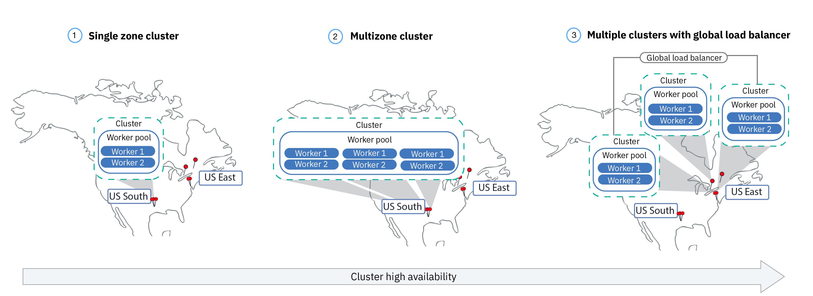

---

copyright:
  years: 2014, 2019
lastupdated: "2019-04-24"

keywords: kubernetes, iks, multi az, multi-az, szr, mzr

subcollection: containers

---

{:new_window: target="_blank"}
{:shortdesc: .shortdesc}
{:screen: .screen}
{:pre: .pre}
{:table: .aria-labeledby="caption"}
{:codeblock: .codeblock}
{:tip: .tip}
{:note: .note}
{:important: .important}
{:deprecated: .deprecated}
{:download: .download}


# Planning your cluster and worker node setup
{: #plan_clusters}
Design your standard cluster for maximum availability and capacity for your app with {{site.data.keyword.containerlong}}.
{: shortdesc}

## Highly available clusters
{: #ha_clusters}

Your users are less likely to experience downtime when you distribute your apps across multiple worker nodes, zones, and clusters. Built-in capabilities, like load balancing and isolation, increase resiliency against potential failures with hosts, networks, or apps.
{: shortdesc}

Review these potential cluster setups that are ordered with increasing degrees of availability.



1. A [single zone cluster](#single_zone) with multiple worker nodes in a worker pool.
2. A [multizone cluster](#multizone) that spreads worker nodes across zones within one region.
3. [Multiple clusters](#multiple_clusters) that are set up across zones or regions and that are connected via a global load balancer.

## Single zone cluster
{: #single_zone}

To improve availability for your app and to allow failover for the case that one worker node is not available in your cluster, add additional worker nodes to your single zone cluster.
{: shortdesc}


By default, your single zone cluster is set up with a worker pool that is named `default`. The worker pool groups worker nodes with the same configuration, such as the machine type, that you defined during cluster creation. You can add more worker nodes to your cluster by [resizing an existing worker pool](/docs/containers?topic=containers-clusters#resize_pool) or by [adding a new worker pool](/docs/containers?topic=containers-clusters#add_pool).

When you add more worker nodes, app instances can be distributed across multiple worker nodes. If one worker node goes down, app instances on available worker nodes continue to run. Kubernetes automatically reschedules pods from unavailable worker nodes to ensure performance and capacity for your app. To ensure that your pods are evenly distributed across worker nodes, implement [pod affinity](https://kubernetes.io/docs/concepts/configuration/assign-pod-node/#inter-pod-affinity-and-anti-affinity-beta-feature).

**Can I convert my single zone cluster to a multizone cluster?**</br>
If the cluster is in one of the [supported multizone metro locations](/docs/containers?topic=containers-regions-and-zones#zones), yes. See [Updating from stand-alone worker nodes to worker pools](/docs/containers?topic=containers-update#standalone_to_workerpool).


**Do I have to use multizone clusters?**</br>
No. You can create as many single zone clusters as you like. Indeed, you might prefer single zone clusters for simplified management or if your cluster must reside in a specific [single zone city](/docs/containers?topic=containers-regions-and-zones#zones).

**Can I have a highly available master in a single zone?**</br>
Yes. In a single zone, your master is highly available and includes replicas on separate physical hosts for your Kubernetes API server, etcd, scheduler, and controller manager to protect against an outage such as during a master update. To protect against a zonal failure, you can:
* [Create a cluster in a multizone-capable zone](/docs/containers?topic=containers-plan_clusters#multizone), where the master is spread across zones.
* [Create multiple clusters](#multiple_clusters) and connect them with a global load balancer.

## Multizone cluster
{: #multizone}

With {{site.data.keyword.containerlong_notm}}, you can create multizone clusters. Your users are less likely to experience downtime when you distribute your apps across multiple worker nodes and zones by using a worker pool. Built-in capabilities, like load balancing, increase resiliency against potential zone failures with hosts, networks, or apps. If resources in one zone go down, your cluster workloads still operate in the other zones.
{: shortdesc}

**What is a worker pool?**</br>
A worker pool is a collection of worker nodes with the same flavor, such as machine type, CPU, and memory. When you create a cluster, a default worker pool is automatically created for you. To spread the worker nodes in your pool across zones, add worker nodes to the pool, or update worker nodes, you can use new `ibmcloud ks worker-pool` commands.

**Can I still use stand-alone worker nodes?**</br>
The previous cluster setup of stand-alone worker nodes is supported, but deprecated. Be sure to [add a worker pool to your cluster](/docs/containers?topic=containers-clusters#add_pool), and then [use worker pools](/docs/containers?topic=containers-update#standalone_to_workerpool) to organize your worker nodes instead of stand-alone worker nodes.

**Can I convert my single zone cluster to a multizone cluster?**</br>
If the cluster is in one of the [supported multizone metro locations](/docs/containers?topic=containers-regions-and-zones#zones), yes. See [Updating from stand-alone worker nodes to worker pools](/docs/containers?topic=containers-update#standalone_to_workerpool).


### Tell me more about the multizone cluster setup
{: #mz_setup}


You can add additional zones to your cluster to replicate the worker nodes in your worker pools across multiple zones within one region. Multizone clusters are designed to evenly schedule pods across worker nodes and zones to assure availability and failure recovery. If worker nodes are not spread evenly across the zones or capacity is insufficient in one of the zones, the Kubernetes scheduler might fail to schedule all requested pods. As a result, pods might go into a **Pending** state until enough capacity is available. If you want to change the default behavior to make Kubernetes scheduler distribute pods across zones in a best effort distribution, use the `preferredDuringSchedulingIgnoredDuringExecution` [pod affinity policy](https://kubernetes.io/docs/concepts/configuration/assign-pod-node/#inter-pod-affinity-and-anti-affinity-beta-feature).

**Why do I need worker nodes in 3 zones?** </br>
Distributing your work load across 3 zones ensures high availability for your app in case one or two zones are not available, but it also makes your cluster setup more cost-efficient. Why is that, you ask? Here is an example.

Let's say you need a worker node with 6 cores to handle the workload for your app. To make your cluster more available, you have the following options:

- **Duplicate your resources in another zone:** This option leaves you with 2 worker nodes, each with 6 cores in each zone making it a total of 12 cores. </br>
- **Distribute resources across 3 zones:** With this option, you deploy 3 cores per zone, which leaves you with a total capacity of 9 cores. To handle your workload, two zones must be up at a time. If one zone is unavailable, the other two zones can handle your workload. If two zones are unavailable, the 3 remaining cores are up to handle your workload. Deploying 3 cores per zone means smaller machines and hence reduced cost for you.</br>

**How is my Kubernetes master set up?** </br>
When you create a cluster in a [multizone metro location](/docs/containers?topic=containers-regions-and-zones#zones), a highly available Kubernetes master is automatically deployed and three replicas are spread across the zones of the metro. For example, if the cluster is in `dal10`, `dal12`, or `dal13` zones, the replicas of the Kubernetes master are spread across each zone in the Dallas multizone metro.

**What happens if the Kubernetes master becomes unavailable?** </br>
The [Kubernetes master](/docs/containers?topic=containers-ibm-cloud-kubernetes-service-technology#architecture) is the main component that keeps your cluster up and running. The master stores cluster resources and their configurations in the etcd database that serves as the single point of truth for your cluster. The Kubernetes API server is the main entry point for all cluster management requests from the worker nodes to the master, or when you want to interact with your cluster resources.<br><br>If a master failure occurs, your workloads continue to run on the worker nodes, but you cannot use `kubectl` commands to work with your cluster resources or view the cluster health until the Kubernetes API server in the master is back up. If a pod goes down during the master outage, the pod cannot be rescheduled until the worker node can reach the Kubernetes API server again.<br><br>During a master outage, you can still run `ibmcloud ks` commands against the {{site.data.keyword.containerlong_notm}} API to work with your infrastructure resources, such as worker nodes or VLANs. If you change the current cluster configuration by adding or removing worker nodes to the cluster, your changes do not happen until the master is back up.

Do not restart or reboot a worker node during a master outage. This action removes the pods from your worker node. Because the Kubernetes API server is unavailable, the pods cannot be rescheduled onto other worker nodes in the cluster.
{: important}


To protect your cluster against a Kubernetes master failure or in regions where multizone clusters are not available, you can [set up multiple clusters and connect them with a global load balancer](#multiple_clusters).

**Do I have to do anything so that the master can communicate with the workers across zones?**</br>
Yes. If you have multiple VLANs for a cluster, multiple subnets on the same VLAN, or a multizone cluster, you must enable a [Virtual Router Function (VRF)](/docs/infrastructure/direct-link?topic=direct-link-overview-of-virtual-routing-and-forwarding-vrf-on-ibm-cloud#overview-of-virtual-routing-and-forwarding-vrf-on-ibm-cloud) for your IBM Cloud infrastructure (SoftLayer) account so your worker nodes can communicate with each other on the private network. To enable VRF, [contact your IBM Cloud infrastructure (SoftLayer) account representative](/docs/infrastructure/direct-link?topic=direct-link-overview-of-virtual-routing-and-forwarding-vrf-on-ibm-cloud#how-you-can-initiate-the-conversion). If you cannot or do not want to enable VRF, enable [VLAN spanning](/docs/infrastructure/vlans?topic=vlans-vlan-spanning#vlan-spanning). To perform this action, you need the **Network > Manage Network VLAN Spanning** [infrastructure permission](/docs/containers?topic=containers-users#infra_access), or you can request the account owner to enable it. To check if VLAN spanning is already enabled, use the `ibmcloud ks vlan-spanning-get` [command](/docs/containers?topic=containers-cs_cli_reference#cs_vlan_spanning_get).

**How do I let my users access my app from the public Internet?**</br>
You can expose your apps by using an Ingress application load balancer (ALB) or load balancer service.

- **Ingress application load balancer (ALB)** By default, public ALBs are automatically created and enabled in each zone in your cluster. A Cloudflare multizone load balancer (MZLB) for your cluster is also automatically created and deployed so that 1 MZLB exists for each region. The MZLB puts the IP addresses of your ALBs behind the same host name and enables health checks on these IP addresses to determine whether they are available or not. For example, if you have worker nodes in 3 zones in the US-East region, the host name `yourcluster.us-east.containers.appdomain.cloud` has 3 ALB IP addresses. The MZLB health checks the public ALB IP in each zone of a region and keeps the DNS lookup results updated based on these health checks. For more information, see [Ingress components and architecture](/docs/containers?topic=containers-ingress#planning).

- **Load balancer services:** Load balancer services are set up in one zone only. Incoming requests to your app are routed from that one zone to all app instances in other zones. If this zone becomes unavailable, then your app might not be reachable from the internet. You can set up additional load balancer services in other zones to account for a single zone failure. For more information, see highly available [load balancer services](/docs/containers?topic=containers-loadbalancer#multi_zone_config).

**Can I set up persistent storage for my multizone cluster?**</br>
For highly available persistent storage, use a cloud service such as [{{site.data.keyword.cloudant_short_notm}}](/docs/services/Cloudant?topic=cloudant-getting-started#getting-started) or [{{site.data.keyword.cos_full_notm}}](/docs/services/cloud-object-storage?topic=cloud-object-storage-about#about). You can also try a software-defined storage (SDS) solution such as [Portworx](/docs/containers?topic=containers-portworx#portworx) that uses [SDS machines](#sds). For more information, see [Comparison of persistent storage options for multizone clusters](/docs/containers?topic=containers-storage_planning#persistent_storage_overview).

NFS file and block storage is not sharable across zones. Persistent volumes can be used only in the zone where the actual storage device is located. If you have existing NFS file or block storage in your cluster that you want to continue to use, you must apply region and zone labels to existing persistent volumes. These labels help the kube-scheduler to determine where to schedule an app that uses the persistent volume. Run the following command and replace `<mycluster>` with your cluster name.

```
bash <(curl -Ls https://raw.githubusercontent.com/IBM-Cloud/kube-samples/master/file-pv-labels/apply_pv_labels.sh) <mycluster>
```
{: pre}

**I created my multizone cluster. Why is there still only one zone? How do I add zones to my cluster?**</br>
If you [create your multizone cluster with the CLI](/docs/containers?topic=containers-clusters#clusters_cli), the cluster is created, but you must add zones to the worker pool to complete the process. To span across multiple zones, your cluster must be in a [multizone metro location](/docs/containers?topic=containers-regions-and-zones#zones). To add a zone to your cluster and spread worker nodes across zones, see [Adding a zone to your cluster](/docs/containers?topic=containers-clusters#add_zone).

### What are some changes from how I currently manage my clusters?
{: #mz_new_ways}

With the introduction of worker pools, you can use a new set of APIs and commands to manage your cluster. You can see these new commands in the [CLI documentation page](/docs/containers?topic=containers-cs_cli_reference#cs_cli_reference), or in your terminal by running `ibmcloud ks help`.
{: shortdesc}

The following table compares the old and new methods for a few common cluster management actions.
<table summary="The table shows the description of the new way to perform multizone commands. Rows are to be read from the left to right, with the description in column one, the old way in column two, and the new multizone way in column three.">
<caption>New methods for multizone worker pool commands.</caption>
  <thead>
  <th>Description</th>
  <th>Old stand-alone worker nodes</th>
  <th>New multizone worker pools</th>
  </thead>
  <tbody>
    <tr>
    <td>Add worker nodes to the cluster.</td>
    <td><p class="deprecated"><code>ibmcloud ks worker-add</code> to add stand-alone worker nodes.</p></td>
    <td><ul><li>To add different machine types than your existing pool, create a new worker pool: <code>ibmcloud ks worker-pool-create</code> [command](/docs/containers?topic=containers-cs_cli_reference#cs_worker_pool_create).</li>
    <li>To add worker nodes to an existing pool, resize the number of nodes per zone in the pool: <code>ibmcloud ks worker-pool-resize</code> [command](/docs/containers?topic=containers-cs_cli_reference#cs_worker_pool_resize).</li></ul></td>
    </tr>
    <tr>
    <td>Remove worker nodes from the cluster.</td>
    <td><code>ibmcloud ks worker-rm</code>, which you can still use to delete a troublesome worker node from your cluster.</td>
    <td><ul><li>If your worker pool is unbalanced, for example after removing a worker node), rebalance it: <code>ibmcloud ks worker-pool-rebalance</code> [command](/docs/containers?topic=containers-cs_cli_reference#cs_rebalance).</li>
    <li>To reduce the number of worker nodes in a pool, resize the number per zone (minimum value of 1): <code>ibmcloud ks worker-pool-resize</code> [command](/docs/containers?topic=containers-cs_cli_reference#cs_worker_pool_resize).</li></ul></td>
    </tr>
    <tr>
    <td>Use a new VLAN for worker nodes.</td>
    <td><p class="deprecated">Add a new worker node that uses the new private or public VLAN: <code>ibmcloud ks worker-add</code>.</p></td>
    <td>Set the worker pool to use a different public or private VLAN than what it previously used: <code>ibmcloud ks zone-network-set</code> [command](/docs/containers?topic=containers-cs_cli_reference#cs_zone_network_set).</td>
    </tr>
  </tbody>
  </table>

## Multiple clusters connected with a global load balancer
{: #multiple_clusters}

To protect your app from a Kubernetes master failure and for regions where multizone clusters are not available, you can create multiple clusters in different zones within a region and connect them with a global load balancer.
{: shortdesc}


To balance your workload across multiple clusters, you must set up a global load balancer and add the IP addresses of your application load balancers (ALBs) or load balancer services to your domain. By adding these IP addresses, you can route incoming traffic between your clusters. For the global load balancer to detect if one of your clusters is unavailable, consider adding a ping-based health check to every IP address. When you set up this check, your DNS provider regularly pings the IP addresses that you added to your domain. If one IP address becomes unavailable, then traffic is not sent to this IP address anymore. However, Kubernetes does not automatically restart pods from the unavailable cluster on worker nodes in available clusters. If you want Kubernetes to automatically restart pods in available clusters, consider setting up a [multizone cluster](#multizone).

**Why do I need 3 clusters in 3 zones?** </br>
Similar to using [3 zones in a multizone clusters](#multizone), you can provide more availability to your app by setting up 3 clusters across zones. You can also reduce costs by purchasing smaller machines to handle your workload.

**What if I want to set up multiple clusters across regions?** </br>
You can set up multiple clusters in different regions of one geolocation (such as US South and US East) or across geolocations (such as US South and EU Central). Both setups offer the same level of availability for your app, but also add complexity when it comes to data sharing and data replication. For most cases, staying within the same geolocation is sufficient. But if you have users across the world, it might be better to set up a cluster where your users are, so that your users do not experience long waiting times when they send a request to your app.

**To set up a global load balancer for multiple clusters:**

1. [Create clusters](/docs/containers?topic=containers-clusters#clusters) in multiple zones or regions.
2. If you have multiple VLANs for a cluster, multiple subnets on the same VLAN, or a multizone cluster, you must enable a [Virtual Router Function (VRF)](/docs/infrastructure/direct-link?topic=direct-link-overview-of-virtual-routing-and-forwarding-vrf-on-ibm-cloud#overview-of-virtual-routing-and-forwarding-vrf-on-ibm-cloud) for your IBM Cloud infrastructure (SoftLayer) account so your worker nodes can communicate with each other on the private network. To enable VRF, [contact your IBM Cloud infrastructure (SoftLayer) account representative](/docs/infrastructure/direct-link?topic=direct-link-overview-of-virtual-routing-and-forwarding-vrf-on-ibm-cloud#how-you-can-initiate-the-conversion). If you cannot or do not want to enable VRF, enable [VLAN spanning](/docs/infrastructure/vlans?topic=vlans-vlan-spanning#vlan-spanning). To perform this action, you need the **Network > Manage Network VLAN Spanning** [infrastructure permission](/docs/containers?topic=containers-users#infra_access), or you can request the account owner to enable it. To check if VLAN spanning is already enabled, use the `ibmcloud ks vlan-spanning-get` [command](/docs/containers?topic=containers-cs_cli_reference#cs_vlan_spanning_get).
3. In each cluster, expose your app by using an [application load balancer (ALB)](/docs/containers?topic=containers-ingress#ingress_expose_public) or [load balancer service](/docs/containers?topic=containers-loadbalancer).
4. For each cluster, list the public IP addresses for your ALBs or load balancer services.
   - To list the IP address of all public enabled ALBs in your cluster:
     ```
     ibmcloud ks albs --cluster <cluster_name_or_id>
     ```
     {: pre}

   - To list the IP address for your load balancer service:
     ```
     kubectl describe service <myservice>
     ```
     {: pre}

     The **Load Balancer Ingress** IP address is the portable IP address that was assigned to your load balancer service.

4.  Set up a global load balancer by using {{site.data.keyword.Bluemix_notm}} Internet Services (CIS) or set up your own global load balancer.

    **To use a CIS global load balancer**:
    1.  Set up the service by following steps 1 - 5 in [Getting Started with {{site.data.keyword.Bluemix_notm}} Internet Services (CIS)](/docs/infrastructure/cis?topic=cis-getting-started#getting-started). These steps walk you through provisioning the service instance, adding your app domain, and configuring your name servers, and creating DNS records. Create a DNS record for each ALB or load balancer IP address that you collected. These DNS records map your app domain to all of your cluster ALBs or load balancers, and ensure that requests to your app domain are forwarded to your clusters in a round-robin cycle.
    2. [Add health checks](/docs/infrastructure/cis?topic=cis-set-up-and-configure-your-load-balancers#add-a-health-check) for the ALBs or load balancers. You can use the same health check for the ALBs or load balancers in all of your clusters, or create specific health checks to use for specific clusters.
    3. [Add an origin pool](/docs/infrastructure/cis?topic=cis-set-up-and-configure-your-load-balancers#add-a-pool) for each cluster by adding the cluster's ALB or load balancer IPs. For example, if you have 3 clusters that each have 2 ALBs, create 3 origin pools that each have 2 ALB IP addresses. Add a health check to each origin pool that you create.
    4. [Add a global load balancer](/docs/infrastructure/cis?topic=cis-set-up-and-configure-your-load-balancers#set-up-and-configure-your-load-balancers).

    **To use your own global load balancer**:
    1. Configure your domain to route incoming traffic to your ALB or load balancer services by adding the IP addresses of all public enabled ALBs and load balancer services to your domain.
    2. For each IP address, enable a ping-based health check so that your DNS provider can detect unhealthy IP addresses. If an unhealthy IP address is detected, traffic is not routed to this IP address anymore.

## Private clusters
{: #private_clusters}

By default, {{site.data.keyword.containerlong_notm}} sets up your cluster with access to a private VLAN and a public VLAN. The private VLAN determines the private IP address that is assigned to each worker node, which provides each worker node with a private network interface. The public VLAN allows the worker nodes to automatically and securely connect to the master.
{: shortdesc}

However, you might want to create a private VLAN or private service endpoint cluster for security or compliance requirements. Your options for creating a private cluster depend upon the type of IBM Cloud infrastructure (SoftLayer) account that you have and the public and private VLAN setup that you want. For more information about each of the following setups, see [Planning your cluster network](/docs/containers?topic=containers-cs_network_ov).

Do you have an existing cluster that you want to make private only? To see how you can add worker pools or modify existing worker pools with new VLANs, check out [Changing your worker node VLAN connections](/docs/containers?topic=containers-cs_network_cluster#change-vlans).
{: note}

**VRF-enabled account, private Kubernetes master, worker nodes on both public and private VLANs**</br>
In clusters that run Kubernetes version 1.11 or later, you can set up your cluster network to use public and private service endpoints. After you enable the private service endpoint, the Kubernetes master and your worker nodes always communicate over the private VLAN via the private service endpoint. Even if you enable the public service endpoint for your cluster, the Kubernetes master to worker node communication stays on the private VLAN. After you enable the private service endpoint, you cannot disable it. You can keep the public service endpoint for secure access to your Kubernetes master over the internet, for example to run `kubectl` commands, or you can disable the public service endpoint for a private service endpoint-only cluster.

**Non-VRF or VRF-enabled account, Kubernetes master and worker nodes on private VLAN only**</br>
If you set up your worker nodes on a private VLAN only, the worker nodes can't automatically expose their app services on the public network, and in a non-VRF account also cannot connect to the master. You must configure a gateway device to provide network connectivity between the worker nodes and the master.

For non-VRF accounts: If you create the cluster with both public and private VLANs, you cannot later remove the public VLANs from that cluster. Removing all public VLANs from a cluster causes several cluster components to stop working. Instead, create a new cluster without the public VLAN.
{: note}

**Non-VRF account, Kubernetes master and worker nodes on both public and private VLANs**</br>
For most cases, your cluster setup can include worker nodes on both public and private VLANs. Then, you can lock down the cluster by blocking public VLAN traffic with Calico policies and restricting traffic to select edge nodes.

## Worker pools and worker nodes
{: #planning_worker_nodes}

A Kubernetes cluster consists of worker nodes that are grouped in worker node pools and is centrally monitored and managed by the Kubernetes master. Cluster administrators decide how to set up the cluster of worker nodes to ensure that cluster users have all the resources to deploy and run apps in the cluster.
{:shortdesc}

When you create a standard cluster, worker nodes of the same memory, CPU, and disk space specifications (flavor) are ordered in IBM Cloud infrastructure (SoftLayer) on your behalf and added to the default worker node pool in your cluster. Every worker node is assigned a unique worker node ID and domain name that must not be changed after the cluster is created. You can choose between virtual or physical (bare metal) servers. Depending on the level of hardware isolation that you choose, virtual worker nodes can be set up as shared or dedicated nodes. To add different flavors to your cluster, [create another worker pool](/docs/containers?topic=containers-cs_cli_reference#cs_worker_pool_create).

Kubernetes limits the maximum number of worker nodes that you can have in a cluster. Review [worker node and pod quotas ](https://kubernetes.io/docs/setup/cluster-large/) for more information.


Want to be sure that you always have enough worker nodes to cover your workload? Try out [the cluster autoscaler](/docs/containers?topic=containers-ca#ca).
{: tip}

<br />


## Available hardware for worker nodes
{: #shared_dedicated_node}

When you create a standard cluster in {{site.data.keyword.Bluemix_notm}}, you choose whether your worker pools consists of worker nodes that are either physical machines (bare metal) or virtual machines that run on physical hardware. You also select the worker node flavor, or combination of memory, CPU, and other machine specifications such as disk storage.
{:shortdesc}


If you want more than one flavor of worker node, you must create a worker pool for each flavor. You cannot resize existing worker nodes to have different resources such as CPU or memory. When you create a free cluster, your worker node is automatically provisioned as a virtual, shared node in the IBM Cloud infrastructure (SoftLayer) account. In standard clusters, you can choose the type of machine that works best for your workload. As you plan, consider the [worker node resource reserves](#resource_limit_node) on the total CPU and memory capacity.

You can deploy clusters by using the [console UI or the CLI](/docs/containers?topic=containers-clusters#clusters_ui).

Select one of the following options to decide what type of worker pool you want.
* [Virtual machines](#vm)
* [Physical machines (bare metal)](#bm)
* [Software-defined storage (SDS) machines](#sds)

### Virtual machines
{: #vm}

With VMs, you get greater flexibility, quicker provisioning times, and more automatic scalability features than bare metal, at a more cost-effective price. You can use VMs for most general purpose use cases such as testing and development environments, staging and prod environments, microservices, and business apps. However, there is a trade-off in performance. If you need high performance computing for RAM-, data-, or GPU-intensive workloads, use [bare metal](#bm).
{: shortdesc}

**Do I want to use shared or dedicated hardware?**</br>
When you create a standard virtual cluster, you must choose whether you want the underlying hardware to be shared by multiple {{site.data.keyword.IBM_notm}} customers (multi tenancy) or to be dedicated to you only (single tenancy).

* **In a multi-tenant, shared hardware setup**: Physical resources, such as CPU and memory, are shared across all virtual machines that are deployed to the same physical hardware. To ensure that every virtual machine can run independently, a virtual machine monitor, also referred to as the hypervisor, segments the physical resources into isolated entities and allocates them as dedicated resources to a virtual machine (hypervisor isolation).
* **In a single-tenant, dedicated hardware setup**: All physical resources are dedicated to you only. You can deploy multiple worker nodes as virtual machines on the same physical host. Similar to the multi-tenant set up, the hypervisor assures that every worker node gets its share of the available physical resources.

Shared nodes are usually less costly than dedicated nodes because the costs for the underlying hardware are shared among multiple customers. However, when you decide between shared and dedicated nodes, you might want to check with your legal department to discuss the level of infrastructure isolation and compliance that your app environment requires.

Some flavors are available for only one type of tenancy setup. For example, the `m3c` VMs are only available as `shared` tenancy setup.
{: note}

**What are the general features of VMs?**</br>
Virtual machines use local disk instead of storage area networking (SAN) for reliability. Reliability benefits include higher throughput when serializing bytes to the local disk and reduced file system degradation due to network failures. Every VM comes with 1000Mbps networking speed, 25GB primary local disk storage for the OS file system, and 100GB secondary local disk storage for data such as the container runtime and the `kubelet`. Local storage on the worker node is for short-term processing only, and the primary and secondary disks are wiped when you update or reload the worker node. For persistent storage solutions, see [Planning highly available persistent storage](/docs/containers?topic=containers-storage_planning#storage_planning).

**What if I have older machine types?**</br>
If your cluster has deprecated `x1c` or older Ubuntu 16 `x2c` worker node flavors, you can [update your cluster to have Ubuntu 18 `x3c` worker nodes](/docs/containers?topic=containers-update#machine_type).

**What virtual machine flavors are available?**</br>
Worker node flavors vary by zone. The following table includes the most recent version of a flavor, such as `x3c` Ubuntu 18 worker nodes flavors, as opposed to the older `x2c` Ubuntu 16 worker node flavors. To see the machine types available in your zone, run `ibmcloud ks machine-types <zone>`. You can also review available [bare metal](#bm) or [SDS](#sds) machine types.

{: #vm-table}
<table>
<caption>Available virtual machine types in {{site.data.keyword.containerlong_notm}}.</caption>
<thead>
<th>Name and use case</th>
<th>Cores / Memory</th>
<th>Primary / Secondary disk</th>
<th>Network speed</th>
</thead>
<tbody>
<tr>
<td><strong>Virtual, u3c.2x4</strong>: Use this smallest size VM for quick testing, proofs of concept, and other light workloads.</td>
<td>2 / 4GB</td>
<td>25GB / 100GB</td>
<td>1000Mbps</td>
</tr>
<tr>
<td><strong>Virtual, b3c.4x16</strong>: Select this balanced VM for testing and development, and other light workloads.</td>
<td>4 / 16GB</td>
<td>25GB / 100GB</td>
<td>1000Mbps</td>
</tr>
<tr>
<td><strong>Virtual, b3c.16x64</strong>: Select this balanced VM for mid-sized workloads.</td></td>
<td>16 / 64GB</td>
<td>25GB / 100GB</td>
<td>1000Mbps</td>
</tr>
<tr>
<td><strong>Virtual, b3c.32x128</strong>: Select this balanced VM for mid to large workloads, such as a database and a dynamic website with many concurrent users.</td>
<td>32 / 128GB</td>
<td>25GB / 100GB</td>
<td>1000Mbps</td>
</tr>
<tr>
<td><strong>Virtual, b3c.56x242</strong>: Select this balanced VM for large workloads, such as a database and multiple apps with many concurrent users.</td>
<td>56 / 242GB</td>
<td>25GB / 100GB</td>
<td>1000Mbps</td>
</tr>
<tr>
<td><strong>Virtual, c3c.16x16</strong>: Use this flavor when you want an even balance of compute resources from the worker node for light workloads.</td>
<td>16 / 16GB</td>
<td>25GB / 100GB</td>
<td>1000Mbps</td>
</tr><tr>
<td><strong>Virtual, c3c.16x32</strong>: Use this flavor when you want a 1:2 ratio of CPU and memory resources from the worker node for light to mid-sized workloads.</td>
<td>16 / 32GB</td>
<td>25GB / 100GB</td>
<td>1000Mbps</td>
</tr><tr>
<td><strong>Virtual, c3c.32x32</strong>: Use this flavor when you want an even balance of compute resources from the worker node for mid-sized workloads.</td>
<td>32 / 32GB</td>
<td>25GB / 100GB</td>
<td>1000Mbps</td>
</tr><tr>
<td><strong>Virtual, c3c.32x64</strong>: Use this flavor when you want a 1:2 ratio of CPU and memory resources from the worker node for mid-sized workloads.</td>
<td>32 / 64GB</td>
<td>25GB / 100GB</td>
<td>1000Mbps</td>
</tr>
<tr>
<td><strong>Virtual, m3c.8x64</strong>: Use this flavor when you want a 1:8 ratio of CPU and memory resources for light to mid-sized workloads that require more memory like databases such as {{site.data.keyword.Db2_on_Cloud_short}}. Available only in Dallas and as `--hardware shared` tenancy.</td>
<td>8 / 64GB</td>
<td>25GB / 100GB</td>
<td>1000Mbps</td>
</tr><tr>
<td><strong>Virtual, m3c.16x128</strong>: Use this flavor when you want a 1:8 ratio of CPU and memory resources for mid-sized workloads that require more memory like databases such as {{site.data.keyword.Db2_on_Cloud_short}}. Available only in Dallas and as `--hardware shared` tenancy.</td>
<td>16 / 128GB</td>
<td>25GB / 100GB</td>
<td>1000Mbps</td>
</tr><tr>
<td><strong>Virtual, m3c.30x240</strong>: Use this flavor when you want a 1:8 ratio of CPU and memory resources for mid to large-sized workloads that require more memory like databases such as {{site.data.keyword.Db2_on_Cloud_short}}. Available only in Dallas and as `--hardware shared` tenancy.</td>
<td>30 / 240GB</td>
<td>25GB / 100GB</td>
<td>1000Mbps</td>
</tr><tr>
<td><strong>Virtual, m3c.48x384</strong>: Use this flavor when you want a 1:8 ratio of CPU and memory resources for mid to large-sized workloads that require more memory like databases such as {{site.data.keyword.Db2_on_Cloud_short}}. Available only as `--hardware shared` tenancy.</td>
<td>48 / 384GB</td>
<td>25GB / 100GB</td>
<td>1000Mbps</td>
</tr><tr>
<td><strong>Virtual, m3c.56x448</strong>: Use this flavor when you want a 1:8 ratio of CPU and memory resources for large-sized workloads that require more memory like databases such as {{site.data.keyword.Db2_on_Cloud_short}}. Available only as `--hardware shared` tenancy.</td>
<td>56 / 448GB</td>
<td>25GB / 100GB</td>
<td>1000Mbps</td>
</tr><tr>
<td><strong>Virtual, m3c.64x512</strong>: Use this flavor when you want a 1:8 ratio of CPU and memory resources for large-sized workloads that require more memory like databases such as {{site.data.keyword.Db2_on_Cloud_short}}. Available only as `--hardware shared` tenancy.</td>
<td>64 / 512GB</td>
<td>25GB / 100GB</td>
<td>1000Mbps</td>
</tr>
</tbody>
</table>

### Physical machines (bare metal)
{: #bm}

You can provision your worker node as a single-tenant physical server, also referred to as bare metal.
{: shortdesc}

**How is bare metal different than VMs?**</br>
Bare metal gives you direct access to the physical resources on the machine, such as the memory or CPU. This setup eliminates the virtual machine hypervisor that allocates physical resources to virtual machines that run on the host. Instead, all of a bare metal machine's resources are dedicated exclusively to the worker, so you don't need to worry about "noisy neighbors" sharing resources or slowing down performance. Physical machine types have more local storage than virtual, and some have RAID to increase data availability. Local storage on the worker node is for short-term processing only, and the primary and secondary disks are wiped when you update or reload the worker node. For persistent storage solutions, see [Planning highly available persistent storage](/docs/containers?topic=containers-storage_planning#storage_planning).

**Besides better specs for performance, can I do something with bare metal that I can't with VMs?**</br>
Yes. With bare metal, you have the option to enable Trusted Compute to verify your worker nodes against tampering. If you don't enable trust during cluster creation but want to later, you can use the `ibmcloud ks feature-enable` [command](/docs/containers?topic=containers-cs_cli_reference#cs_cluster_feature_enable). After you enable trust, you cannot disable it later. You can make a new cluster without trust. For more information about how trust works during the node startup process, see [{{site.data.keyword.containerlong_notm}} with Trusted Compute](/docs/containers?topic=containers-security#trusted_compute). Trusted Compute is available for certain bare metal machine types. When you run the `ibmcloud ks machine-types <zone>` [command](/docs/containers?topic=containers-cs_cli_reference#cs_machine_types), you can see which machines support trust by reviewing the **Trustable** field. For example, `mgXc` GPU flavors do not support Trusted Compute.

In addition to Trusted Compute, you can also take advantage of {{site.data.keyword.datashield_full}} (Beta). {{site.data.keyword.datashield_short}} is integrated with Intel® Software Guard Extensions (SGX) and Fortanix® technology so that your {{site.data.keyword.Bluemix_notm}} container workload code and data are protected in use. The app code and data run in CPU-hardened enclaves, which are trusted areas of memory on the worker node that protect critical aspects of the app, which helps to keep the code and data confidential and unmodified. If you or your company require data sensitivity due to internal policies, government regulations, or industry compliance requirements, this solution might help you to move to the cloud. Example use cases include financial and healthcare institutions, or countries with government policies that require on-premises cloud solutions.

**Bare metal sounds awesome! What's stopping me from ordering one right now?**</br>
Bare metal servers are more expensive than virtual servers, and are best suited for high-performance apps that need more resources and host control.

Bare metal servers are billed monthly. If you cancel a bare metal server before the end of the month, you are charged through the end of that month. After you order or cancel a bare metal server, the process is completed manually in your IBM Cloud infrastructure (SoftLayer) account. Therefore, it can take more than one business day to complete.
{: important}

**What bare metal flavors can I order?**</br>
Worker node flavors vary by zone. The following table includes the most recent version of a flavor, such as `x3c` Ubuntu 18 worker nodes flavors, as opposed to the older `x2c` Ubuntu 16 worker node flavors. To see the machine types available in your zone, run `ibmcloud ks machine-types <zone>`. You can also review available [VM](#vm) or [SDS](#sds) machine types.

Bare metal machines are optimized for different use cases such as RAM-intensive, data-intensive, or GPU-intensive workloads.

Choose a machine type with the right storage configuration to support your workload. Some flavors have a mix of the following disks and storage configurations. For example, some flavors might have a SATA primary disk with a raw SSD secondary disk.

* **SATA**: A magnetic spinning disk storage device that is often used for the primary disk of the worker node that stores the OS file system.
* **SSD**: A solid state drive storage device for high performance data.
* **Raw**: The storage device is unformatted, with the full capacity is available for use.
* **RAID**: The storage device has data distributed for redundancy and performance that varies depending on the RAID level. As such, the disk capacity that is available for use varies.


{: #bm-table}
<table>
<caption>Available bare metal machine types in {{site.data.keyword.containerlong_notm}}.</caption>
<thead>
<th>Name and use case</th>
<th>Cores / Memory</th>
<th>Primary / Secondary disk</th>
<th>Network speed</th>
</thead>
<tbody>
<tr>
<td><strong>RAM-intensive bare metal, mr3c.28x512</strong>: Maximize the RAM available to your worker nodes.</td>
<td>28 / 512GB</td>
<td>2TB SATA / 960GB SSD</td>
<td>10000Mbps</td>
</tr>
<tr>
<td><strong>GPU bare metal, mg3c.16x128</strong>: Choose this type for mathematically-intensive workloads such as high performance computing, machine learning, or 3D applications. This flavor has 1 Tesla K80 physical card that has 2 graphics processing units (GPUs) per card for a total of 2 GPUs.</td>
<td>16 / 128GB</td>
<td>2TB SATA / 960GB SSD</td>
<td>10000Mbps</td>
</tr>
<tr>
<td><strong>GPU bare metal, mg3c.28x256</strong>: Choose this type for mathematically-intensive workloads such as high performance computing, machine learning, or 3D applications. This flavor has 2 Tesla K80 physical cards that have 2 GPUs per card for a total of 4 GPUs.</td>
<td>28 / 256GB</td>
<td>2TB SATA / 960GB SSD</td>
<td>10000Mbps</td>
</tr>
<tr>
<td><strong>Data-intensive bare metal, md3c.16x64.4x4tb</strong>: Use this type for a significant amount of local disk storage, including RAID to increase data availability, for workloads such as distributed file systems, large databases, and big data analytics.</td>
<td>16 / 64GB</td>
<td>2x2TB RAID1 / 4x4TB SATA RAID10</td>
<td>10000Mbps</td>
</tr>
<tr>
<td><strong>Data-intensive bare metal, md3c.28x512.4x4tb</strong>: Use this type for a significant amount of local disk storage, including RAID to increase data availability, for workloads such as distributed file systems, large databases, and big data analytics..</td>
<td>28 / 512 GB</td>
<td>2x2TB RAID1 / 4x4TB SATA RAID10</td>
<td>10000Mbps</td>
</tr>
<tr>
<td><strong>Balanced bare metal, mb3c.4x32</strong>: Use for balanced workloads that require more compute resources than virtual machines offer. This flavor can also be enabled with Intel® Software Guard Extensions (SGX) so that you can use <a href="/docs/services/data-shield?topic=data-shield-getting-started#getting-started" target="_blank">{{site.data.keyword.datashield_short}} (Beta)</a> to encrypt your data memory.</td>
<td>4 / 32GB</td>
<td>2TB SATA / 2TB SATA</td>
<td>10000Mbps</td>
</tr>
<tr>
<td><strong>Balanced bare metal, mb3c.16x64</strong>: Use for balanced workloads that require more compute resources than virtual machines offer.</td>
<td>16 / 64GB</td>
<td>2TB SATA / 960GB SSD</td>
<td>10000Mbps</td>
</tr>
<tr>
</tbody>
</table>

### Software-defined storage (SDS) machines
{: #sds}

Software-defined storage (SDS) flavors are physical machines that are provisioned with additional raw disks for physical local storage. Unlike the primary and secondary local disk, these raw disks are not wiped during a worker node update or reload. Because data is co-located with the compute node, SDS machines are suited for high performance workloads.
{: shortdesc}

**When do I use SDS flavors?**</br>
You typically use SDS machines in the following cases:
*  If you use an SDS add-on such as [Portworx](/docs/containers?topic=containers-portworx#portworx) to the cluster, use an SDS machine.
*  If your app is a [StatefulSet ](https://kubernetes.io/docs/concepts/workloads/controllers/statefulset/) that requires local storage, you can use SDS machines and provision [Kubernetes local persistent volumes (beta) ](https://kubernetes.io/blog/2018/04/13/local-persistent-volumes-beta/).
*  You might have custom apps that require additional raw local storage.

For more storage solutions, see [Planning highly available persistent storage](/docs/containers?topic=containers-storage_planning#storage_planning).

**What SDS flavors can I order?**</br>
Worker node flavors vary by zone. The following table includes the most recent version of a flavor, such as `x3c` Ubuntu 18 worker nodes flavors, as opposed to the older `x2c` Ubuntu 16 worker node flavors. To see the machine types available in your zone, run `ibmcloud ks machine-types <zone>`. You can also review available [bare metal](#bm) or [VM](#vm) machine types.

Choose a machine type with the right storage configuration to support your workload. Some flavors have a mix of the following disks and storage configurations. For example, some flavors might have a SATA primary disk with a raw SSD secondary disk.

* **SATA**: A magnetic spinning disk storage device that is often used for the primary disk of the worker node that stores the OS file system.
* **SSD**: A solid state drive storage device for high performance data.
* **Raw**: The storage device is unformatted, with the full capacity is available for use.
* **RAID**: The storage device has data distributed for redundancy and performance that varies depending on the RAID level. As such, the disk capacity that is available for use varies.


{: #sds-table}
<table>
<caption>Available SDS machine types in {{site.data.keyword.containerlong_notm}}.</caption>
<thead>
<th>Name and use case</th>
<th>Cores / Memory</th>
<th>Primary / Secondary disk</th>
<th>Additional raw disks</th>
<th>Network speed</th>
</thead>
<tbody>
<tr>
<td><strong>Bare metal with SDS, ms3c.4x32.1.9tb.ssd</strong>: If you need extra local storage for performance, use this disk-heavy flavor that supports software-defined storage (SDS).</td>
<td>4 / 32GB</td>
<td>2TB SATA / 960GB SSD</td>
<td>1.9TB Raw SSD (device path: `/dev/sdc`)</td>
<td>10000Mbps</td>
</tr>
<tr>
<td><strong>Bare metal with SDS, ms3c.16x64.1.9tb.ssd</strong>: If you need extra local storage for performance, use this disk-heavy flavor that supports software-defined storage (SDS).</td>
<td>16 / 64GB</td>
<td>2TB SATA / 960GB SSD</td>
<td>1.9TB Raw SSD (device path: `/dev/sdc`)</td>
<td>10000Mbps</td>
</tr>
<tr>
<td><strong>Bare metal with SDS, ms3c.28x256.3.8tb.ssd</strong>: If you need extra local storage for performance, use this disk-heavy flavor that supports software-defined storage (SDS).</td>
<td>28 / 256GB</td>
<td>2TB SATA / 1.9TB SSD</td>
<td>3.8TB Raw SSD (device path: `/dev/sdc`)</td>
<td>10000Mbps</td>
</tr>
<tr>
<td><strong>Bare metal with SDS, ms3c.28x512.4x3.8tb.ssd</strong>: If you need extra local storage for performance, use this disk-heavy flavor that supports software-defined storage (SDS).</td>
<td>28 / 512GB</td>
<td>2TB SATA / 1.9TB SSD</td>
<td>4 disks, 3.8TB Raw SSD (device paths: `/dev/sdc`, `/dev/sdd`, `/dev/sde`, `/dev/sdf`)</td>
<td>10000Mbps</td>
</tr>
</tbody>
</table>

## Worker node resource reserves
{: #resource_limit_node}

{{site.data.keyword.containerlong_notm}} sets compute resource reserves that limit available compute resources on each worker node. Reserved memory and CPU resources cannot be used by pods on the worker node, and reduces the allocatable resources on each worker node. When you initially deploy pods, if the worker node does not have enough allocatable resources, the deployment fails. Further, if pods exceed the worker node resource limit, the pods are evicted. In Kubernetes, this limit is called a [hard eviction threshold ](https://kubernetes.io/docs/tasks/administer-cluster/out-of-resource/#hard-eviction-thresholds).
{:shortdesc}

If less CPU or memory is available than the worker node reserves, Kubernetes starts to evict pods to restore sufficient compute resources. The pods reschedule onto another worker node if a worker node is available. If your pods are evicted frequently, add more worker nodes to your cluster or set [resource limits ](https://kubernetes.io/docs/concepts/configuration/manage-compute-resources-container/#resource-requests-and-limits-of-pod-and-container) on your pods.

The resources that are reserved on your worker node depend on the amount of CPU and memory that your worker node comes with. {{site.data.keyword.containerlong_notm}} defines memory and CPU tiers as shown in the following tables. If your worker node comes with compute resources in multiple tiers, a percentage of your CPU and memory resources is reserved for each tier.

To review how much compute resources are currently used on your worker node, run [`kubectl top node` ](https://kubernetes.io/docs/reference/kubectl/overview/#top).
{: tip}

<table summary="This table shows worker node memory reserves by tier.">
<caption>Worker node memory reserves by tier.</caption>
<thead>
<tr>
  <th>Memory tier</th>
  <th>% or amount reserved</th>
  <th>`b3c.4x16` worker node (16 GB) example</th>
  <th>`mg1c.28x256` worker node (256 GB) example</th>
</tr>
</thead>
<tbody>
<tr>
  <td>First 4GB (0-4GB)</td>
  <td>25% of memory</td>
  <td>1 GB</td>
  <td>1 GB</td>
</tr>
<tr>
  <td>Next 4GB (5-8GB)</td>
  <td>20% of memory</td>
  <td>0.8 GB</td>
  <td>0.8 GB</td>
</tr>
<tr>
  <td>Next 8GB (9-16GB)</td>
  <td>10% of memory</td>
  <td>0.8 GB</td>
  <td>0.8 GB</td>
</tr>
<tr>
  <td>Next 112GB (17-128GB)</td>
  <td>6% of memory</td>
  <td>N/A</td>
  <td>6.72 GB</td>
</tr>
<tr>
  <td>Remaining GBs (129GB+)</td>
  <td>2% of memory</td>
  <td>N/A</td>
  <td>2.54 GB</td>
</tr>
<tr>
  <td>Additional reserve for [`kubelet` eviction ](https://kubernetes.io/docs/tasks/administer-cluster/out-of-resource/)</td>
  <td>100MB</td>
  <td>100MB (flat amount)</td>
  <td>100MB (flat amount)</td>
</tr>
<tr>
  <td>**Total reserved**</td>
  <td>**(varies)**</td>
  <td>**2.7 GB of 16 GB total**</td>
  <td>**11.96 GB of 256 GB total**</td>
</tr>
</tbody>
</table>

<table summary="This table shows worker node CPU reserves by tier.">
<caption>Worker node CPU reserves by tier.</caption>
<thead>
<tr>
  <th>CPU tier</th>
  <th>% reserved</th>
  <th>`b3c.4x16` worker node (4 cores) example</th>
  <th>`mg1c.28x256` worker node (28 cores) example</th>
</tr>
</thead>
<tbody>
<tr>
  <td>First core (Core 1)</td>
  <td>6% cores</td>
  <td>0.06 cores</td>
  <td>0.06 cores</td>
</tr>
<tr>
  <td>Next 2 cores (Cores 2-3)</td>
  <td>1% cores</td>
  <td>0.02 cores</td>
  <td>0.02 cores</td>
</tr>
<tr>
  <td>Next 2 cores (Cores 4-5)</td>
  <td>0.5% cores</td>
  <td>0.005 cores</td>
  <td>0.01 cores</td>
</tr>
<tr>
  <td>Remaining cores (Cores 6+)</td>
  <td>0.25% cores</td>
  <td>N/A</td>
  <td>0.0575 cores</td>
</tr>
<tr>
  <td>**Total reserved**</td>
  <td>**(varies)**</td>
  <td>**0.085 cores of 4 cores total**</td>
  <td>**0.1475 cores of 28 cores total**</td>
</tr>
</tbody>
</table>

## Autorecovery for your worker nodes
{: #planning_autorecovery}

Critical components, such as `containerd`, `kubelet`, `kube-proxy`, and `calico`, must be functional to have a healthy Kubernetes worker node. Over time these components can break and may leave your worker node in a nonfunctional state. Nonfunctional worker nodes decrease total capacity of the cluster and can result in downtime for your app.
{:shortdesc}

You can [configure health checks for your worker node and enable Autorecovery](/docs/containers?topic=containers-health#autorecovery). If Autorecovery detects an unhealthy worker node based on the configured checks, Autorecovery triggers a corrective action like an OS reload on the worker node. For more information about how Autorecovery works, see the [Autorecovery blog ](https://www.ibm.com/blogs/bluemix/2017/12/autorecovery-utilizes-consistent-hashing-high-availability/).

<br />


