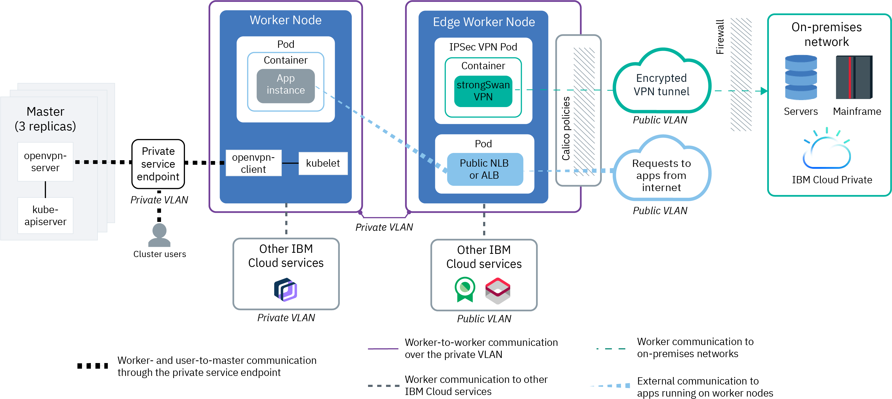

---

copyright:
  years: 2014, 2019
lastupdated: "2019-07-20"

keywords: kubernetes, iks, multi az, multi-az, szr, mzr

subcollection: containers

---

{:new_window: target="_blank"}
{:shortdesc: .shortdesc}
{:screen: .screen}
{:pre: .pre}
{:table: .aria-labeledby="caption"}
{:codeblock: .codeblock}
{:tip: .tip}
{:note: .note}
{:important: .important}
{:deprecated: .deprecated}
{:download: .download}
{:preview: .preview}

# Planning your cluster network setup
{: #plan_clusters}

Design a network setup for your community Kubernetes or OpenShift clusters in {{site.data.keyword.containerlong}} that meets the needs of your workloads and environment.
{: shortdesc}

In both community Kubernetes and OpenShift clusters, your containerized apps are hosted on compute hosts that are called worker nodes. Worker nodes are managed by the Kubernetes master. The communication setup between worker nodes and the Kubernetes master, other services, the Internet, or other private networks depends on how you set up your IBM Cloud infrastructure network.

First time creating a cluster? Try out our tutorials for [community Kubernetes]](/docs/containers?topic=containers-cs_cluster_tutorial) or [OpenShift clusters](/docs/openshift?topic=openshift-openshift_tutorial) first and come back here when you’re ready to plan out your production-ready clusters.
{: tip}

To plan your cluster network setup, first [understand cluster network basics](#plan_basics). Then, you can review three potential cluster network setups that are suited to environment-based scenarios, including [running internet-facing app workloads](#internet-facing), [extending an on-premises data center with limited public access](#limited-public), and [extending an on-premises data center on the private network only](#private_clusters).

## Understanding cluster network basics
{: #plan_basics}

When you create your cluster, you must choose a networking setup so that certain cluster components can communicate with each other and with networks or services outside of the cluster.
{: shortdesc}

* [Worker-to-worker communication](#worker-worker): All worker nodes must be able to communicate with each other on the private network. In many cases, communication must be permitted across multiple private VLANs to allow workers on different VLANs and in different zones to connect with each other.
* [Worker-to-master and user-to-master communication](#workeruser-master): Your worker nodes and your authorized cluster users can communicate with the Kubernetes master securely over the public network with TLS or over the private network through private service endpoints.
* [Worker communication to other {{site.data.keyword.cloud_notm}} services or on-premises networks](#worker-services-onprem): Allow your worker nodes to securely communicate with other {{site.data.keyword.cloud_notm}} services, such as {{site.data.keyword.registrylong}}, and to an on-premises network.
* [External communication to apps that run on worker nodes](#external-workers): Allow public or private requests into the cluster as well as requests out of the cluster to a public endpoint.

### Worker-to-worker communication
{: #worker-worker}

When you create a cluster, the cluster's worker nodes are connected automatically to a private VLAN and optionally connected to a public VLAN. A VLAN configures a group of worker nodes and pods as if they were attached to the same physical wire and provides a channel for connectivity among the workers.
{: shortdesc}

**VLAN connections for worker nodes** 
All worker nodes must be connected to a private VLAN so that each worker node can send and receive information to other worker nodes. When you create a cluster with worker nodes that are also connected to a public VLAN, your worker nodes can communicate with the Kubernetes master automatically over the public VLAN and over the private VLAN if you enable private service endpoint. The public VLAN also provides public network connectivity so that you can expose apps in your cluster to the internet. However, if you need to secure your apps from the public interface, several options are available to secure your cluster such as using Calico network policies or isolating external network workload to edge worker nodes.
* Free clusters: In free clusters, the cluster's worker nodes are connected to an IBM-owned public VLAN and private VLAN by default. Because IBM controls the VLANs, subnets, and IP addresses, you cannot create multizone clusters or add subnets to your cluster, and can use only NodePort services to expose your app.</dd>
* Standard clusters: In standard clusters, the first time that you create a cluster in a zone, a public VLAN, and a private VLAN in that zone are automatically provisioned for you in your IBM Cloud infrastructure account. If you specify that worker nodes must be connected to a private VLAN only, then a private VLAN only in that zone is automatically provisioned. For every subsequent cluster that you create in that zone, you can specify the VLAN pair that you want to use. You can reuse the same public and private VLANs that were created for you because multiple clusters can share VLANs.

For more information about VLANs, subnets, and IP addresses, see [Overview of networking in {{site.data.keyword.containerlong_notm}}](/docs/containers?topic=containers-subnets#basics).

**Worker node communication across subnets and VLANs** 
In several situations, components in your cluster must be permitted to communicate across multiple private VLANs. For example, if you want to create a multizone cluster, if you have multiple VLANs for a cluster, or if you have multiple subnets on the same VLAN, the worker nodes on different subnets in the same VLAN or in different VLANs cannot automatically communicate with each other. You must enable either Virtual Routing and Forwarding (VRF) or VLAN spanning for your IBM Cloud infrastructure account.

* [Virtual Routing and Forwarding (VRF)](/docs/infrastructure/direct-link?topic=direct-link-overview-of-virtual-routing-and-forwarding-vrf-on-ibm-cloud#overview-of-virtual-routing-and-forwarding-vrf-on-ibm-cloud): VRF enables all the private VLANs and subnets in your infrastructure account to communicate with each other. Additionally, VRF is required to allow your workers and master to communicate over the private service endpoint, and to communicate with other {{site.data.keyword.cloud_notm}} instances that support private service endpoints. To enable VRF, run `ibmcloud account update --service-endpoint-enable true`. This command output prompts you to open a support case to enable your account to use VRF and service endpoints. VRF eliminates the VLAN spanning option for your account because all VLANs are able to communicate.  
When VRF is enabled, any system that is connected to any of the private VLANs in the same {{site.data.keyword.cloud_notm}} account can communicate with the cluster worker nodes. You can isolate your cluster from other systems on the private network by applying [Calico private network policies](/docs/containers?topic=containers-network_policies#isolate_workers).</dd>
* [VLAN spanning](/docs/infrastructure/vlans?topic=vlans-vlan-spanning#vlan-spanning): If you cannot or do not want to enable VRF, such as if you do not need the master to be accessible on the private network or if you use a gateway device to access the master over the public VLAN, enable VLAN spanning. For example, if you have an existing gateway device and then add a cluster, the new portable subnets that are ordered for the cluster aren't configured on the gateway device but VLAN spanning enables routing between the subnets. To enable VLAN spanning, you need the **Network > Manage Network VLAN Spanning** [infrastructure permission](/docs/containers?topic=containers-users#infra_access), or you can request the account owner to enable it. To check whether VLAN spanning is already enabled, use the `ibmcloud ks vlan-spanning-get` [command](/docs/containers?topic=containers-cli-plugin-kubernetes-service-cli#cs_vlan_spanning_get). You cannot enable the private service endpoint if you choose to enable VLAN spanning instead of VRF.

 

### Worker-to-master and user-to-master communication
{: #workeruser-master}

A communication channel must be set up so that worker nodes can establish a connection to the Kubernetes master. You can allow your worker nodes and Kubernetes master to communicate by enabling the public service endpoint only, public and private service endpoints, or the private service endpoint only.
{: shortdesc}

To secure communication over public and private service endpoints, {{site.data.keyword.containerlong_notm}} automatically sets up an OpenVPN connection between the Kubernetes master and the worker node when the cluster is created. Workers securely talk to the master through TLS certificates, and the master talks to workers through the OpenVPN connection.

**Public service endpoint only** 
If you don’t want to or cannot enable VRF for your account, your worker nodes can automatically connect to the Kubernetes master over the public VLAN through the public service endpoint.
* Communication between worker nodes and master is established securely over the public network through the public service endpoint.
* The master is publicly accessible to authorized cluster users only through the public service endpoint. Your cluster users can securely access your Kubernetes master over the internet to run `kubectl` commands, for example.

**Public and private service endpoints** 
To make your master publicly or privately accessible to cluster users, you can enable the public and private service endpoints. VRF is required in your {{site.data.keyword.cloud_notm}} account, and you must enable your account to use service endpoints. To enable VRF and service endpoints, run `ibmcloud account update --service-endpoint-enable true`.
* If worker nodes are connected to public and private VLANs, communication between worker nodes and master is established over both the private network through the private service endpoint and the public network through the public service endpoint. By routing half of the worker-to-master traffic over the public endpoint and half over the private endpoint, your master-to-worker communication is protected from potential outages of the public or private network. If worker nodes are connected to private VLANs only, communication between worker nodes and master is established over the private network through the private service endpoint only.
* The master is publicly accessible to authorized cluster users through the public service endpoint. The master is privately accessible through the private service endpoint if authorized cluster users are in your {{site.data.keyword.cloud_notm}} private network or are connected to the private network through a VPN connection or {{site.data.keyword.cloud_notm}} Direct Link. Note that you must [expose the master endpoint through a private load balancer](/docs/containers?topic=containers-clusters#access_on_prem) so that users can access the master through a VPN or {{site.data.keyword.cloud_notm}} Direct Link connection.

**Private service endpoint only** 
To make your master only privately accessible, you can enable the private service endpoint. VRF is required in your {{site.data.keyword.cloud_notm}} account, and you must enable your account to use service endpoints. To enable VRF and service endpoints, run `ibmcloud account update --service-endpoint-enable true`. Note that using private service endpoint only incurs no billed or metered bandwidth charges.
* Communication between worker nodes and master is established over the private network through the private service endpoint.
* The master is privately accessible if authorized cluster users are in your {{site.data.keyword.cloud_notm}} private network or are connected to the private network through a VPN connection or DirectLink. Note that you must [expose the master endpoint through a private load balancer](/docs/containers?topic=containers-clusters#access_on_prem) so that users can access the master through a VPN or DirectLink connection.

 

### Worker communication to other {{site.data.keyword.cloud_notm}} services or on-premises networks
{: #worker-services-onprem}

Allow your worker nodes to securely communicate with other {{site.data.keyword.cloud_notm}} services, such as {{site.data.keyword.registrylong}}, and to an on-premises network.
{: shortdesc}

**Communication with other {{site.data.keyword.cloud_notm}} services over the private or public network** 
Your worker nodes can automatically and securely communicate with other {{site.data.keyword.cloud_notm}} services that support private service endpoints, such as {{site.data.keyword.registrylong}}, over your IBM Cloud infrastructure private network. If an {{site.data.keyword.cloud_notm}} service does not support private service endpoints, your worker nodes must be connected to a public VLAN so that they can securely communicate with the services over the public network.

If you use Calico policies or a gateway device to control the public or private networks of your worker nodes, you must allow access to the public IP addresses of the services that support public service endpoints, and optionally to the private IP addresses of the services that support private service endpoints.
* [Allow access to services' public IP addresses in Calico policies](/docs/containers?topic=containers-network_policies#isolate_workers_public)
* [Allow access to the private IP addresses of services that support private service endpoints in Calico policies](/docs/containers?topic=containers-network_policies#isolate_workers)
* [Allow access to services' public IP addresses and to the private IP addresses of services that support private service endpoints in a gateway device firewall](/docs/containers?topic=containers-firewall#firewall_outbound)

**{{site.data.keyword.BluDirectLink}} for communication over the private network with resources in on-premises data centers** 
To connect your cluster with your on-premises data center, such as with {{site.data.keyword.icpfull_notm}}, you can set up [{{site.data.keyword.cloud_notm}} Direct Link](/docs/infrastructure/direct-link?topic=direct-link-get-started-with-ibm-cloud-direct-link). With {{site.data.keyword.cloud_notm}} Direct Link, you create a direct, private connection between your remote network environments and {{site.data.keyword.containerlong_notm}} without routing over the public internet.

**strongSwan IPSec VPN connection for communication over the public network with resources in on-premises data centers**
* Worker nodes that are connected to public and private VLANs: Set up a [strongSwan IPSec VPN service ](https://www.strongswan.org/about.html) directly in your cluster. The strongSwan IPSec VPN service provides a secure end-to-end communication channel over the internet that is based on the industry-standard Internet Protocol Security (IPSec) protocol suite. To set up a secure connection between your cluster and an on-premises network, [configure and deploy the strongSwan IPSec VPN service](/docs/containers?topic=containers-vpn#vpn-setup) directly in a pod in your cluster.
* Worker nodes connected to a private VLAN only: Set up an IPSec VPN endpoint on a gateway device, such as a Virtual Router Appliance (Vyatta). Then, [configure the strongSwan IPSec VPN service](/docs/containers?topic=containers-vpn#vpn-setup) in your cluster to use the VPN endpoint on your gateway. If you do not want to use strongSwan, you can [set up VPN connectivity directly with VRA](/docs/containers?topic=containers-vpn#vyatta).

 

### External communication to apps that run on worker nodes
{: #external-workers}

Allow public or private traffic requests from outside the cluster to your apps that run on worker nodes.
{: shortdesc}

**Private traffic to cluster apps** 
When you deploy an app in your cluster, you might want to make the app accessible to only users and services that are on the same private network as your cluster. Private load balancing is ideal for making your app available to requests from outside the cluster without exposing the app to the general public. You can also use private load balancing to test access, request routing, and other configurations for your app before you later expose your app to the public with public network services. To allow private traffic requests from outside the cluster to your apps, you can create private Kubernetes networking services, such as private NodePorts, NLBs, and Ingress ALBs. You can then use Calico pre-DNAT policies to block traffic to public NodePorts of private networking services. For more information, see [Planning private external load balancing](/docs/containers?topic=containers-cs_network_planning#private_access).

**Public traffic to cluster apps** 
To make your apps externally accessible from the public internet, you can create public NodePorts, network load balancers (NLBs), and Ingress application load balancers (ALBs). Public networking services connect to this public network interface by providing your app with a public IP address and optionally, a public URL. When an app is publicly exposed, anyone that has the public service IP address or the URL that you set up for your app can send a request to your app. You can then use Calico pre-DNAT policies to control traffic to public networking services, such as whitelisting traffic from only certain source IP addresses or CIDRs and blocking all other traffic. For more information, see [Planning public external load balancing](/docs/containers?topic=containers-cs_network_planning#private_access).

For additional security, isolate networking workloads to edge worker nodes. Edge worker nodes can improve the security of your cluster by allowing fewer worker nodes that are connected to public VLANs to be accessed externally and by isolating the networking workload. When you [label worker nodes as edge nodes](/docs/containers?topic=containers-edge#edge_nodes), NLB and ALB pods are deployed to only those specified worker nodes. To also prevent other workloads from running on edge nodes, you can [taint the edge nodes](/docs/containers?topic=containers-edge#edge_workloads). In Kubernetes version 1.14 and later, you can deploy both public and private NLBs and ALBs to edge nodes.
For example, if your worker nodes are connected to a private VLAN only, but you need to permit public access to an app in your cluster, you can create an edge worker pool in which the edge nodes are connected to public and private VLANs. You can deploy public NLBs and ALBs to these edge nodes to ensure that only those workers handle public connections.

If your worker nodes are connected to a private VLAN only and you use a gateway device to provide communication between worker nodes and the cluster master, you can also configure the device as a public or private firewall. To allow public or private traffic requests from outside the cluster to your apps, you can create public or private NodePorts, NLBs, and Ingress ALBs. Then, you must [open up the required ports and IP addresses](/docs/containers?topic=containers-firewall#firewall_inbound) in your gateway device firewall to permit inbound traffic to these services over the public or private network.
{: note}

 

## Scenario: Run internet-facing app workloads in a cluster
{: #internet-facing}

In this scenario, you want to run workloads in a cluster that are accessible to requests from the Internet so that end users can access your apps. You want the option of isolating public access in your cluster and of controlling what public requests are permitted to your cluster. Additionally, your workers have automatic access to any {{site.data.keyword.cloud_notm}} services that you want to connect with your cluster.
{: shortdesc}

<figure>
 
 <figcaption>Architecture for a cluster that runs internet-facing workloads</figcaption>
</figure>

To achieve this setup, you create a cluster by connecting worker nodes to public and private VLANs.

If you create the cluster with both public and private VLANs, you cannot later remove all public VLANs from that cluster. Removing all public VLANs from a cluster causes several cluster components to stop working. Instead, create a new worker pool that is connected to a private VLAN only.
{: note}

You can choose to allow worker-to-master and user-to-master communication over the public and private networks, or over the public network only.
* Public and private service endpoints: Your account must be enabled with VRF and enabled to use service endpoints. Communication between worker nodes and master is established over both the private network through the private service endpoint and the public network through the public service endpoint. The master is publicly accessible to authorized cluster users through the public service endpoint.
* Public service endpoint: If you don’t want to or cannot enable VRF for your account, your worker nodes and authorized cluster users can automatically connect to the Kubernetes master over the public network through the public service endpoint.

Your worker nodes can automatically, securely communicate with other {{site.data.keyword.cloud_notm}} services that support private service endpoints over your IBM Cloud infrastructure private network. If an {{site.data.keyword.cloud_notm}} service does not support private service endpoints, workers can securely communicate with the services over the public network. You can lock down the public or private interfaces of worker nodes by using Calico network policies for public network or private network isolation. You might need to allow access to the public and private IP addresses of the services that you want to use in these Calico isolation policies.

To expose an app in your cluster to the internet, you can create a public network load balancer (NLB) or Ingress application load balancer (ALB) service. You can improve the security of your cluster by creating a pool of worker nodes that are labeled as edge nodes. The pods for public network services are deployed to the edge nodes so that external traffic workloads are isolated to only a few workers in your cluster. You can further control public traffic to the network services that expose your apps by creating Calico pre-DNAT policies, such as whitelist and blacklist policies.

If your worker nodes need to access services in private networks outside of your {{site.data.keyword.cloud_notm}} account, you can configure and deploy the strongSwan IPSec VPN service in your cluster or leverage {{site.data.keyword.cloud_notm}} {{site.data.keyword.cloud_notm}} Direct Link services to connect to these networks.

Ready to get started with a cluster for this scenario? After you plan your [high availability](/docs/containers?topic=containers-ha_clusters) and [worker node](/docs/containers?topic=containers-planning_worker_nodes) setups, see [Creating clusters](/docs/containers?topic=containers-clusters#cluster_prepare).

 

## Scenario: Extend your on-premises data center to a cluster on the private network and add limited public access
{: #limited-public}

In this scenario, you want to run workloads in a cluster that are accessible to services, databases, or other resources in your on-premises data center. However, you might need to provide limited public access to your cluster, and want to ensure that any public access is controlled and isolated in your cluster. For example, you might need your workers to access an {{site.data.keyword.cloud_notm}} service that does not support private service endpoints, and must be accessed over the public network. Or, you might need to provide limited public access to an app that runs in your cluster.
{: shortdesc}

To achieve this cluster setup, you can create a firewall by [using edge nodes and Calico network policies](#calico-pc) or [using a gateway device](#vyatta-gateway).

### Using edge nodes and Calico network policies
{: #calico-pc}

Allow limited public connectivity to your cluster by using edge nodes as a public gateway and Calico network policies as a public firewall.
{: shortdesc}

<figure>
 
 <figcaption>Architecture for a cluster that uses edge nodes and Calico network policies for secure public access</figcaption>
</figure>

With this setup, you create a cluster by connecting worker nodes to a private VLAN only. Your account must be enabled with VRF and enabled to use private service endpoints.

The Kubernetes master is accessible through the private service endpoint if authorized cluster users are in your {{site.data.keyword.cloud_notm}} private network or are connected to the private network through a [VPN connection](/docs/infrastructure/iaas-vpn?topic=VPN-getting-started) or [{{site.data.keyword.cloud_notm}} Direct Link](/docs/infrastructure/direct-link?topic=direct-link-get-started-with-ibm-cloud-direct-link). However, communication with the Kubernetes master over the private service endpoint must go through the <code>166.X.X.X</code> IP address range, which is not routable from a VPN connection or through {{site.data.keyword.cloud_notm}} Direct Link. You can expose the private service endpoint of the master for your cluster users by using a private network load balancer (NLB). The private NLB exposes the private service endpoint of the master as an internal <code>10.X.X.X</code> IP address range that users can access with the VPN or {{site.data.keyword.cloud_notm}} Direct Link connection. If you enable only the private service endpoint, you can use the Kubernetes dashboard or temporarily enable the public service endpoint to create the private NLB.

Next, you can create a pool of worker nodes that are connected to public and private VLANs and labeled as edge nodes. Edge nodes can improve the security of your cluster by allowing only a few worker nodes to be accessed externally and by isolating the networking workload to these workers.

Your worker nodes can automatically, securely communicate with other {{site.data.keyword.cloud_notm}} services that support private service endpoints over your IBM Cloud infrastructure private network. If an {{site.data.keyword.cloud_notm}} service does not support private service endpoints, your edge nodes that are connected to a public VLAN can securely communicate with the services over the public network. You can lock down the public or private interfaces of worker nodes by using Calico network policies for public network or private network isolation. You might need to allow access to the public and private IP addresses of the services that you want to use in these Calico isolation policies.

To provide private access to an app in your cluster, you can create a private network load balancer (NLB) or Ingress application load balancer (ALB) to expose your app to the private network only. You can block all public traffic to these network services that expose your apps by creating Calico pre-DNAT policies, such as policies to block public NodePorts on worker nodes. If you need to provide limited public access to an app in your cluster, you can create a public NLB or ALB to expose your app. You must then deploy your apps to these edge nodes so that the NLBs or ALBs can direct public traffic to your app pods. You can further control public traffic to the network services that expose your apps by creating Calico pre-DNAT policies, such as whitelist and blacklist policies. The pods for both private and public network services are deployed to the edge nodes so that external traffic workloads are restricted to only a few workers in your cluster.  

To securely access services outside of {{site.data.keyword.cloud_notm}} and other on-premises networks, you can configure and deploy the strongSwan IPSec VPN service in your cluster. The strongSwan load balancer pod deploys to a worker in the edge pool, where the pod establishes a secure connection to the on-premises network through an encrypted VPN tunnel over the public network. Alternatively, you can use {{site.data.keyword.cloud_notm}} Direct Link services to connect your cluster to your on-premises data center over the private network only.

Ready to get started with a cluster for this scenario? After you plan your [high availability](/docs/containers?topic=containers-ha_clusters) and [worker node](/docs/containers?topic=containers-planning_worker_nodes) setups, see [Creating clusters](/docs/containers?topic=containers-clusters#cluster_prepare).

 

### Using a gateway device
{: #vyatta-gateway}

Allow limited public connectivity to your cluster by configuring a gateway device, such as a Virtual Router Appliance (Vyatta), as a public gateway and firewall.
{: shortdesc}

<figure>
 
 <figcaption>Architecture for a cluster that uses a gateway device for secure public access</figcaption>
</figure>

If you set up your worker nodes on a private VLAN only and you don’t want to or cannot enable VRF for your account, you must configure a gateway device to provide network connectivity between your worker nodes and the master over the public network. For example, you might choose to set up a [Virtual Router Appliance](/docs/infrastructure/virtual-router-appliance?topic=virtual-router-appliance-about-the-vra) or a [Fortigate Security Appliance](/docs/services/vmwaresolutions/services?topic=vmware-solutions-fsa_considerations).

You can set up your gateway device with custom network policies to provide dedicated network security for your cluster and to detect and remediate network intrusion. When you set up a firewall on the public network, you must open up the required ports and private IP addresses for each region so that the master and the worker nodes can communicate. If you also configure this firewall for the private network, you must also open up the required ports and private IP addresses to allow communication between worker nodes and let your cluster access infrastructure resources over the private network. You must also enable VLAN spanning for your account so that subnets can route on the same VLAN and across VLANs.

To securely connect your worker nodes and apps to an on-premises network or services outside of {{site.data.keyword.cloud_notm}}, set up an IPSec VPN endpoint on your gateway device and the strongSwan IPSec VPN service in your cluster to use the gateway VPN endpoint. If you do not want to use strongSwan, you can set up VPN connectivity directly with VRA.

Your worker nodes can securely communicate with other {{site.data.keyword.cloud_notm}} services and public services outside of {{site.data.keyword.cloud_notm}} through your gateway device. You can configure your firewall allow access to the public and private IP addresses of only the services that you want to use.

To provide private access to an app in your cluster, you can create a private network load balancer (NLB) or Ingress application load balancer (ALB) to expose your app to the private network only. If you need to provide limited public access to an app in your cluster, you can create a public NLB or ALB to expose your app. Because all traffic goes through your gateway device firewall, you can control public and public traffic to the network services that expose your apps by opening up the service's ports and IP addresses in your firewall to permit inbound traffic to these services.

Ready to get started with a cluster for this scenario? After you plan your [high availability](/docs/containers?topic=containers-ha_clusters) and [worker node](/docs/containers?topic=containers-planning_worker_nodes) setups, see [Creating clusters](/docs/containers?topic=containers-clusters#cluster_prepare).

 

## Scenario: Extend your on-premises data center to a cluster on the private network
{: #private_clusters}

In this scenario, you want to run workloads in an {{site.data.keyword.containerlong_notm}} cluster. However, you want these workloads to be accessible only to services, databases, or other resources in your on-premises data center, such as {{site.data.keyword.icpfull_notm}}. Your cluster workloads might need to access a few other {{site.data.keyword.cloud_notm}} services that support communication over the private network, such as {{site.data.keyword.cos_full_notm}}.
{: shortdesc}

<figure>
 
 <figcaption>Architecture for a cluster that connects to an on-premises data center on the private network</figcaption>
</figure>

To achieve this setup, you create a cluster by connecting worker nodes to a private VLAN only. To provide connectivity between the cluster master and worker nodes over the private network through the private service endpoint only, your account must be enabled with VRF and enabled to use service endpoints. Because your cluster is visible to any resource on the private network when VRF is enabled, you can isolate your cluster from other systems on the private network by applying Calico private network policies.

The Kubernetes master is accessible through the private service endpoint if authorized cluster users are in your {{site.data.keyword.cloud_notm}} private network or are connected to the private network through a [VPN connection](/docs/infrastructure/iaas-vpn?topic=VPN-getting-started) or [{{site.data.keyword.cloud_notm}} Direct Link](/docs/infrastructure/direct-link?topic=direct-link-get-started-with-ibm-cloud-direct-link). However, communication with the Kubernetes master over the private service endpoint must go through the <code>166.X.X.X</code> IP address range, which is not routable from a VPN connection or through {{site.data.keyword.cloud_notm}} Direct Link. You can expose the private service endpoint of the master for your cluster users by using a private network load balancer (NLB). The private NLB exposes the private service endpoint of the master as an internal <code>10.X.X.X</code> IP address range that users can access with the VPN or {{site.data.keyword.cloud_notm}} Direct Link connection. If you enable only the private service endpoint, you can use the Kubernetes dashboard or temporarily enable the public service endpoint to create the private NLB.

Your worker nodes can automatically, securely communicate with other {{site.data.keyword.cloud_notm}} services that support private service endpoints, such as {{site.data.keyword.registrylong}}, over your IBM Cloud infrastructure private network. For example, dedicated hardware environments for all standard plan instances of {{site.data.keyword.cloudant_short_notm}} support private service endpoints. If an {{site.data.keyword.cloud_notm}} service does not support private service endpoints, your cluster cannot access that service.

To provide private access to an app in your cluster, you can create a private network load balancer (NLB) or Ingress application load balancer (ALB). These Kubernetes network services expose your app to the private network only so that any on-premises system with a connection to the subnet that the NLB IP is on can access the app.

Ready to get started with a cluster for this scenario? After you plan your [high availability](/docs/containers?topic=containers-ha_clusters) and [worker node](/docs/containers?topic=containers-planning_worker_nodes) setups, see [Creating clusters](/docs/containers?topic=containers-clusters#cluster_prepare).
