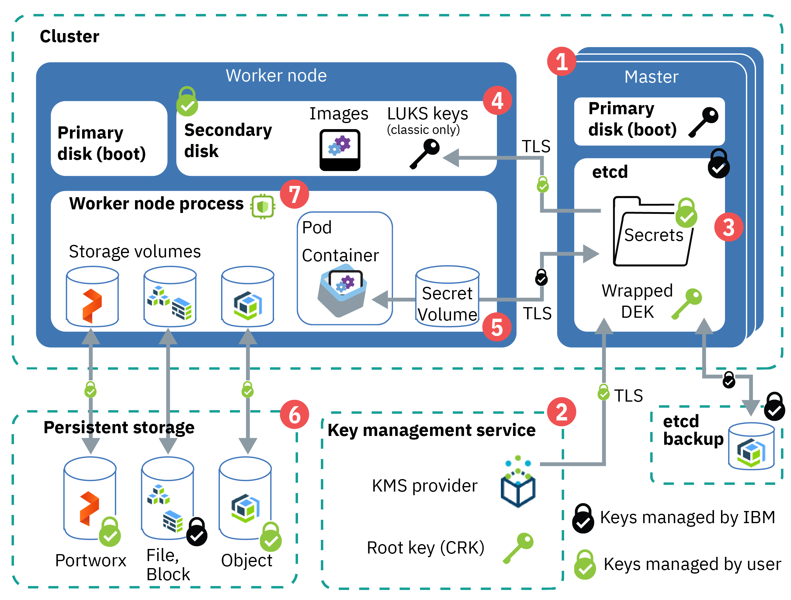

---

copyright:
  years: 2014, 2019
lastupdated: "2019-11-01"

keywords: kubernetes, iks, encrypt, security, kms, root key, crk

subcollection: containers

---

{:new_window: target="_blank"}
{:shortdesc: .shortdesc}
{:screen: .screen}
{:pre: .pre}
{:table: .aria-labeledby="caption"}
{:codeblock: .codeblock}
{:tip: .tip}
{:note: .note}
{:important: .important}
{:deprecated: .deprecated}
{:download: .download}
{:preview: .preview}
{:external: target="_blank" .external}

# Protecting sensitive information in your cluster
{: #encryption}

Protect sensitive cluster information to ensure data integrity and to prevent your data from being exposed to unauthorized users.
{: shortdesc}

You can create sensitive data on different levels in your cluster that each require appropriate protection.
- **Cluster-level:** Cluster configuration data is stored in the etcd component of your Kubernetes master. Data in etcd is stored on the local disk of the Kubernetes master and is backed up to {{site.data.keyword.cos_full_notm}}. Data is encrypted during transit to {{site.data.keyword.cos_full_notm}} and at rest. You can choose to enable encryption for your etcd data on the local disk of your Kubernetes master by [enabling a key management service provider](#keyprotect) for your cluster.
- **App-level:** When you deploy your app, do not store confidential information, such as credentials or keys, in the YAML configuration file, configmaps, or scripts. Instead, use [Kubernetes secrets ](https://kubernetes.io/docs/concepts/configuration/secret/), such as an `imagePullSecret` for registry credentials. You can also [encrypt data in Kubernetes secrets](#keyprotect) to prevent unauthorized users from accessing sensitive app information.

For more information about securing your cluster and personal information, see [Security for {{site.data.keyword.containerlong_notm}}](/docs/containers?topic=containers-security#security) and [Storing personal information](/docs/containers?topic=containers-security#pi).


## Overview of cluster encryption
{: #encrypt_ov}

The following image and description outline default and optional data encryption for {{site.data.keyword.containerlong_notm}} clusters.
{: shortdesc}



_Figure: Overview of data encryption in a cluster_

1.  **Kubernetes master control plane startup**: Components in the Kubernetes master, such as etcd, boot up on a LUKS-encrypted drive by using an IBM-managed key.
2.  **Bring your own key (BYOK)**: When you [enable a key management service (KMS) provider](#keyprotect) in your cluster, you can bring your own root key to create data encryption keys (DEKs) that encrypt the secrets in your cluster. The root key is stored in the KMS instance that you control. For example, if you use {{site.data.keyword.keymanagementservicelong_notm}}, the root key is stored in a FIPS 120-3 Level 3 hardware security module (HSM).
3.  **etcd data**: Etcd is the component of the master that stores the configuration files of your Kubernetes resources, such as deployments and secrets. Data in etcd is stored on the local disk of the Kubernetes master and is backed up to {{site.data.keyword.cos_full_notm}}. Data is encrypted during transit to {{site.data.keyword.cos_full_notm}} and at rest. When you enable a KMS provider, a wrapped data encryption key (DEK) is stored in etcd. The DEK encrypts the secrets in your cluster that store service credentials and the LUKS key. Because the root key is in your KMS instance, you control access to your encrypted secrets. To unwrap the DEK, the cluster uses the root key from your KMS instance. For more information about how key encryption works, see [Envelope encryption](/docs/services/key-protect/concepts?topic=key-protect-envelope-encryption#envelope-encryption).
4.  **Worker node disks**: The primary disk contains the kernel images that are used to boot your worker node, and is unencrypted. The secondary disk hosts the container file system and stores locally pulled images. The secondary disk is AES 256-bit encrypted with an IBM-managed LUKS encryption key that is unique to the worker node and stored as a secret in etcd. When you reload or update your worker nodes, the LUKS keys are rotated. If you enable a KMS provider, the etcd secret that holds the LUKS key is encrypted by the root key and DEK of your KMS provider.
5.  **Cluster secrets**: By default, [Kubernetes secrets](https://kubernetes.io/docs/concepts/configuration/secret/){: external} are base64 encoded. To manage encryption of the Kubernetes secrets in your cluster, you can enable a KMS provider. The secrets are encrypted by KMS-provided encryption until their information is used. For example, if you update a Kubernetes pod that mounts a secret, the pod requests the secret values from the master API server. The master API server asks the KMS provider root key to unwrap the DEK and encode its values in base64. Then, the master API server uses the KMS provider DEK that is stored in etcd to read the secret, and sends the secret to the pod by using TLS.
6.  **Persistent storage encryption**: You can choose to store data by [setting up file, block, object, or software-defined Portworx persistent storage](/docs/containers?topic=containers-storage_planning#persistent_storage_overview). If you store your data on file or block storage, your data is automatically encrypted at rest. If you use object storage, your data is also encrypted during transit. With Portworx, you can choose to [set up volume encryption](/docs/containers?topic=containers-portworx#encrypt_volumes) to protect your data during transit and at rest. The IBM Cloud infrastructure storage instances save the data on encrypted disks, so your data at rest is encrypted.
7.  **Data-in-use encryption**: For select, SGX-enabled classic worker node flavors, you can use [{{site.data.keyword.datashield_short}}](#datashield) to encrypt data-in-use within the worker node.


<br />


## Understanding Key Management Service (KMS) providers
{: #kms}

You can protect the etcd component in your Kubernetes master and Kubernetes secrets by using a Kubernetes [key management service (KMS) provider ](https://kubernetes.io/docs/tasks/administer-cluster/kms-provider/) that encrypts secrets with encryption keys that you control.
{: shortdesc}

KMS provider integration is a beta feature.
{: note}

**What KMS providers are available by default? Can I add other providers?**<br>
{{site.data.keyword.containerlong_notm}} supports the following KMS providers: 
* {{site.data.keyword.keymanagementservicefull}} for [public cloud](/docs/services/key-protect?topic=key-protect-getting-started-tutorial) or [on-prem ](https://www.ibm.com/support/knowledgecenter/en/SSBS6K_3.2.0/apis/kms_apis.html#gen_key) environments.
* [Hyper Protect Crypto Services](https://cloud.ibm.com/catalog/services/hyper-protect-crypto-services){: external} for keep your own key (KYOK) crypto unit support.

Because adding a different KMS provider requires updating the managed master default configuration, you cannot add other KMS providers to the cluster.

**With a KMS provider, do I control the encryption in my cluster?**<br>
Yes. When you enable a KMS provider in your cluster, your own KMS root key is used to encrypt data in etcd, including the LUKS secrets. Using your own encryption root key adds a layer of security to your etcd data and Kubernetes secrets and gives you more granular control of who can access sensitive cluster information. For more information, see the [overview](#encrypt_ov) and your KMS provider's documentation, such as [{{site.data.keyword.keymanagementserviceshort}} envelope encryption](/docs/services/key-protect?topic=key-protect-envelope-encryption).

You cannot disable KMS provider encryption. Do not delete root keys in your KMS instance, even if you rotate to use a new key. You cannot access or remove the data in etcd or the data from the secrets in your cluster if you delete a root key.
{: important}

<br />


## Encrypting the Kubernetes master's local disk and secrets by using a KMS provider (beta)
{: #keyprotect}

Enable a Kubernetes [key management service (KMS) provider ](https://kubernetes.io/docs/tasks/administer-cluster/kms-provider/) such as [{{site.data.keyword.keymanagementserviceshort}} ](/docs/services/key-protect?topic=key-protect-getting-started-tutorial) to encrypt the Kubernetes secrets and etcd component of your Kubernetes master.
{: shortdesc}

To rotate your encryption key, repeat the [CLI](#kms_cli) or [console](#kms_ui) steps to enable KMS provider encryption with a new root key ID. The new root key is added to the cluster configuration along with the previous root key so that existing encrypted data is still protected.
{: note}

### Prerequisites
{: #kms_prereqs}

Before you enable a key management service (KMS) provider in your cluster, create a KMS instance and complete the following steps.
{: shortdesc}

1.  Create a KMS instance, such as [{{site.data.keyword.keymanagementserviceshort}}](/docs/services/key-protect?topic=key-protect-provision#provision) or [Hyper Protect Crypto Services](https://cloud.ibm.com/catalog/services/hyper-protect-crypto-services){: external}.
2.  Create a customer root key (CRK) in your KMS instance, such as a [{{site.data.keyword.keymanagementserviceshort}} root key](/docs/services/key-protect?topic=key-protect-create-root-keys#create-root-keys). By default, the root key is created without an expiration date.

    Need to set an expiration date to comply with internal security policies? [Create the root key by using the API](/docs/services/key-protect?topic=key-protect-create-root-keys#create-root-key-api) and include the `expirationDate` parameter. **Important**: Before your root key expires, you must repeat these steps to update your cluster to use a new root key. Otherwise, you cannot decrypt your secrets.
    {: tip}
3.  Make sure that your cluster environment is set up to use KMS encryption.
    * Check that your cluster runs Kubernetes version 1.11.3_1521 or later by running `ibmcloud ks cluster get -c <cluster_name_or_ID>` and checking the **Version** field.
    * Ensure that you have the [**Administrator** {{site.data.keyword.cloud_notm}} IAM platform role](/docs/containers?topic=containers-users#platform) for the cluster.
    * Make sure that the API key that is set for the region that your cluster is in is authorized to use the KMS provider. For example, to create an instance and root key, you need at least the **Editor** platform and **Writer** service roles for [{{site.data.keyword.keymanagementserviceshort}}](/docs/services/key-protect?topic=key-protect-manage-access). To check the API key owner whose credentials are stored for the region, run `ibmcloud ks api-key info -c <cluster_name_or_ID>`.
4.  Enable KMS encryption through the [CLI](#kms_cli) or [console](#kms_ui).

### Enabling or rotating KMS encryption through the CLI
{: #kms_cli}

You can enable a KMS provider or update the instance or root key that encrypts secrets in the cluster through the CLI.
{: shortdesc}

1.  Complete the [prerequisite steps](#kms_prereqs) to create a KMS instance and root key.
2.  Get the ID of the KMS instance that you previously created.
    ```
    ibmcloud ks kms instance ls
    ```
    {: pre}
3.  Get the **ID** of the root key that you previously created.
    ```
    ibmcloud ks kms crk ls
    ```
    {: pre}
4.  Enable the KMS provider to encrypt secrets in your cluster. Fill in the flags with the information that you previously retrieved. To use the KMS provider's private service endpoint to download the encryption keys, such as for private-only clusters, include the `--private-endpoint` flag. The enablement process can take some time to complete.<p class="important">During the enablement, you might not be able to access the Kubernetes master such as to update YAML configurations for deployments.</p>
    ```
    ibmcloud ks kms enable -c <cluster_name_or_ID> --instance-id <kms_instance_ID> --crk <root_key_ID> [--private-endpoint]
    ```
    {: pre}
5.  Verify that the KMS enablement process is finished. The process is finished when that the **Master Status** is **Ready**.
    ```
    ibmcloud ks cluster get -c <cluster_name_or_ID>
    ```
    {: pre}

    Example output when the enablement is in progress:
    ```
    Name:                   <cluster_name>   
    ID:                     <cluster_ID>   
    ...
    Master Status:          Key Protect feature enablement in progress.  
    ```
    {: screen}

    Example output when the master is ready:
    ```
    Name:                   <cluster_name>   
    ID:                     <cluster_ID>   
    ...
    Master Status:          Ready (1 min ago)   
    ```
    {: screen}

    After the KMS provider is enabled in the cluster, data in `etcd`, existing secrets, and new secrets that are created in the cluster are automatically encrypted by using your root key.
6.  Optional: [Verify that your secrets are encrypted](#verify_kms).

Do not delete root keys in your KMS instance, even if you rotate to use a new key. You cannot access or remove the data in etcd or the data from the secrets in your cluster if you delete a root key.
{: important}

### Enabling or rotating KMS encryption through the console
{: #kms_ui}

You can enable a KMS provider or update the instance or root key that encrypts secrets in the cluster through the {{site.data.keyword.cloud_notm}} console.
{: shortdesc}

1.  Complete the [prerequisite steps](#kms_prereqs) to create a KMS instance and root key.
2.  From the [Clusters](https://cloud.ibm.com/kubernetes/clusters){: external} console, select the cluster that you want to enable encryption for.
3.  From the **Overview** tab, in the **Summary > Key management service (beta)** section, click **Enable**. If you already enabled the KMS provider, click **Update**.
4.  Select the **Key management service instance** and **Root key** that you want to use for the encryption.<p class="important">During the enablement, you might not be able to access the Kubernetes master such as to update YAML configurations for deployments.</p>
5.  Click **Enable** (or **Update**).
6.  Verify that the KMS enablement process is finished. From the **Summary > Master status** section, you can check the progress.
    Example output when the enablement is in progress:
    ```
    Master status   KMS feature enablement in progress.  
    ```
    {: screen}

    Example output when the master is ready:
    ```
    Master status   Ready
    ```
    {: screen}
7.  Optional: [Verify that your secrets are encrypted](#verify_kms).

After the KMS provider is enabled in the cluster, data in `etcd`, existing secrets, and new secrets that are created in the cluster are automatically encrypted by using your root key. Do not delete root keys in your KMS instance, even if you rotate to use a new key. You cannot access or remove the data in etcd or the data from the secrets in your cluster if you delete a root key.
{: important}

## Verifying secret encryption
{: #verify_kms}

After you enable a KMS provider in your cluster, you can verify that your cluster secrets are encrypted by querying information that is in `etcd` in the master. If the returned information is encrypted, you know that the KMS provider works in your cluster.
{: shortdesc}

Before you begin: [Log in to your account. If applicable, target the appropriate resource group. Set the context for your cluster.](/docs/containers?topic=containers-cs_cli_install#cs_cli_configure)

1.  Install the etcd CLI (`etcdctl`) version 3 or higher.
    1.  Download the release package for your operating system from the [etcd project ](https://github.com/etcd-io/etcd/releases).
    2.  Unzip and move the `etcdctl` binary file to the location of your binary files, such as the following example.
        ```
        mv Downloads/etcd-v3.3.13-darwin-amd64/etcdctl /usr/local/bin/etcdctl
        ```
        {: pre}
    3.  Verify that `etcdctl` is installed.
        ```
        etcdctl --version
        ```
        {: screen}
2.  Set your terminal session context to use the appropriate `etcdctl` API version.
    ```
    export ETCDCTL_API=3
    ```
    {: pre}
3.  Download the Calico configuration file that contains information about the etcd component of the cluster. The **Network Config** output includes the path to the downloaded Calico configuration file.
    ```
    ibmcloud ks cluster config -c <cluster_name_or_ID> --admin --network
    ```
    {: pre}
    Example output:
    ```
    The configuration for <cluster_name> was downloaded successfully.

    Network Config:

    /Users/<user>/.bluemix/plugins/container-service/clusters/<cluster_name>-admin/calicoctl.cfg
    ```
    {: screen}
4.  From the Calico configuration file, note the values of the `etcdEndpoints`, `etcdCACertFile`, `etcdKeyFile`, and `etcdCertFile` fields.
    ```
    cat /Users/<user>/.bluemix/plugins/container-service/clusters/<cluster_name>-admin/calicoctl.cfg
    ```
    {: pre}
    Example output:
    ```
    apiVersion: projectcalico.org/v3
    kind: CalicoAPIConfig
    spec:
      datastoreType: etcdv3
      etcdEndpoints: https://<master_URL>:31773
      etcdKeyFile: '/Users/<user>/.bluemix/plugins/container-service/clusters/<cluster_name>-admin/admin-key.pem'
      etcdCertFile: '/Users/<user>/.bluemix/plugins/container-service/clusters/<cluster_name>-admin/admin.pem'
      etcdCACertFile: '/Users/<user>/.bluemix/plugins/container-service/clusters/<cluster_name>-admin/ca-<location>-<cluster_name>.pem'
    ```
    {: screen}
5.  Confirm that the Kubernetes secrets for the cluster are encrypted. Replace the `cluster_name`, `etcdEndpoints`, `etcdCACertFile`, `etcdKeyFile`, and `etcdCertFile` fields with the values that you previously retrieved. The output is unreadable and scrambled, indicating that the secrets are encrypted.
    ```
    etcdctl get /registry/secrets/default/<cluster_name> --endpoints <etcdEndpoints> --cacert="<etcdCACertFile>" --key="<etcdKeyFile>" --cert="<etcdCertFile>"
    ```
    {: pre}

    Example output of encrypted secrets:
    ```
    k8s:enc:kms:v1:ibm:...=a?u???T?fE?pC?/?f|???'?z
    ?nI?a,)?
            9??O?{2??]="g?۳o??\5
    ?,a??AW??6Mx??x?5???7       dwX@DG8Dd?԰?ۭ#??[Y?ρF??????a$??9????_ˌ??m??Ɵϭ8?7????????c4L??q1?$0? ??yfzgl?}
                        ??Aynw#?$?J???p?x??pΝ???]ؖE6I?ө?o??t]??p?s?#0%BׇB?????k*֊ؖ??~?B??????V??
    ```
    {: screen}

## Encrypting data in classic clusters by using IBM Cloud Data Shield
{: #datashield}

{{site.data.keyword.datashield_short}} is integrated with Intel® Software Guard Extensions (SGX) and Fortanix® technology so that the app code and data of your containerized workloads are protected in use. The app code and data run in CPU-hardened enclaves, which are trusted areas of memory on the worker node that protect critical aspects of the app, which helps to keep the code and data confidential and unmodified.
{: shortdesc}

 Applies to only classic clusters. VPC clusters cannot have bare metal worker nodes, which are required to use {{site.data.keyword.datashield_short}}.
{: note}

When it comes to protecting your data, encryption is one of the most popular and effective controls. But, the data must be encrypted at each step of its lifecycle for your data to be protected. During its lifecycle, data has three phases. It can be at rest, in motion, or in use. Data at rest and in motion are generally the area of focus when you think of securing your data. But, after an application starts to run, data that is in use by CPU and memory is vulnerable to various attacks. The attacks might include malicious insiders, root users, credential compromise, OS zero-day, network intruders, and others. Taking that protection one step further, you can now encrypt data in use.

If you or your company require data sensitivity due to internal policies, government regulations, or industry compliance requirements, this solution might help you to move to the cloud. Example solutions include financial and healthcare institutions, or countries with government policies that require on-premises cloud solutions.

To get started, provision an SGX-enabled bare metal worker cluster with a [supported flavor for {{site.data.keyword.datashield_short}}](/docs/services/data-shield?topic=data-shield-getting-started).


