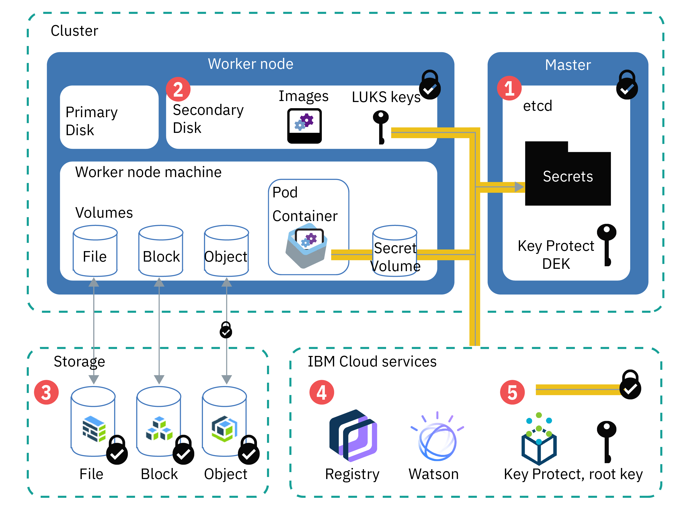

---

copyright:
  years: 2014, 2019
lastupdated: "2019-10-25"

keywords: kubernetes, iks, encrypt, security, kms, root key, crk

subcollection: containers

---

{:new_window: target="_blank"}
{:shortdesc: .shortdesc}
{:screen: .screen}
{:pre: .pre}
{:table: .aria-labeledby="caption"}
{:codeblock: .codeblock}
{:tip: .tip}
{:note: .note}
{:important: .important}
{:deprecated: .deprecated}
{:download: .download}
{:preview: .preview}
{:external: target="_blank" .external}


# Protecting sensitive information in your cluster
{: #encryption}

Protect sensitive cluster information to ensure data integrity and to prevent your data from being exposed to unauthorized users.
{: shortdesc}

You can create sensitive data on different levels in your cluster that each require appropriate protection.
- **Cluster-level:** Cluster configuration data is stored in the etcd component of your Kubernetes master. Data in etcd is stored on the local disk of the Kubernetes master and is backed up to {{site.data.keyword.cos_full_notm}}. Data is encrypted during transit to {{site.data.keyword.cos_full_notm}} and at rest. You can choose to enable encryption for your etcd data on the local disk of your Kubernetes master by [enabling {{site.data.keyword.keymanagementservicelong_notm}} encryption](/docs/containers?topic=containers-encryption#keyprotect) for your cluster. The etcd data for clusters that run an earlier version of Kubernetes is stored on an encrypted disk that is managed by IBM and backed up daily.
- **App-level:** When you deploy your app, do not store confidential information, such as credentials or keys, in the YAML configuration file, configmaps, or scripts. Instead, use [Kubernetes secrets ](https://kubernetes.io/docs/concepts/configuration/secret/). You can also [encrypt data in Kubernetes secrets](#keyprotect) to prevent unauthorized users from accessing sensitive cluster information.

For more information about securing your cluster, see [Security for {{site.data.keyword.containerlong_notm}}](/docs/containers?topic=containers-security#security).



_Figure: Overview of data encryption in a cluster_

1.  **etcd**: etcd is the component of the master that stores the data of your Kubernetes resources, such as object configuration `.yaml` files and secrets. Data in etcd is stored on the local disk of the Kubernetes master and is backed up to {{site.data.keyword.cos_full_notm}}. Data is encrypted during transit to {{site.data.keyword.cos_full_notm}} and at rest. You can choose to enable encryption for your etcd data on the local disk of your Kubernetes master by [enabling {{site.data.keyword.keymanagementservicelong_notm}} encryption](#keyprotect) for your cluster. The etcd data in clusters that run an earlier version of Kubernetes is stored on an encrypted disk that is managed by IBM and backed up daily. When etcd data is sent to a pod, data is encrypted via TLS to ensure data protection and integrity.
2.  **Secondary disk of the worker node**: Your worker node's secondary disk is where the container file system and locally pulled images are stored. The disk is AES 256-bit encrypted with a LUKS encryption key that is unique to the worker node and stored as a secret in etcd, managed by IBM. When you reload or update your worker nodes, the LUKS keys are rotated.
3.  **Storage**: You can choose to store data by [setting up file, block, or object persistent storage](/docs/containers?topic=containers-storage_planning#persistent_storage_overview). The IBM Cloud infrastructure storage instances save the data on encrypted disks, so your data at rest is encrypted. Further, if you choose object storage, your data in transit is also encrypted.
4.  **{{site.data.keyword.cloud_notm}} services**: You can [integrate {{site.data.keyword.cloud_notm}} services](/docs/containers?topic=containers-service-binding#bind-services), such as {{site.data.keyword.registryshort_notm}} or {{site.data.keyword.watson}}, with your cluster. The service credentials are stored in a secret that is saved in etcd. Your app can access these credentials by mounting the secret as a volume or specifying the secret as an environment variable in [your deployment](/docs/containers?topic=containers-app#secret).
5.  **{{site.data.keyword.keymanagementserviceshort}}**: When you [enable {{site.data.keyword.keymanagementserviceshort}}](#keyprotect) in your cluster, a wrapped data encryption key (DEK) is stored in etcd. The DEK encrypts the secrets in your cluster, including service credentials and LUKS key. Because the root key is in your {{site.data.keyword.keymanagementserviceshort}} instance, you control access to your encrypted secrets. The {{site.data.keyword.keymanagementserviceshort}} keys are secured by FIPS 140-2 Level 2 certified cloud-based hardware security modules that protect against the theft of information. For more information about how {{site.data.keyword.keymanagementserviceshort}} encryption works, see [Envelope encryption](/docs/services/key-protect/concepts?topic=key-protect-envelope-encryption#envelope-encryption).

## Understanding when to use secrets
{: #secrets}

Kubernetes secrets are a secure way to store confidential information, such as user names, passwords, or keys. If you need confidential information encrypted, [enable {{site.data.keyword.keymanagementserviceshort}}](#keyprotect) to encrypt the secrets. For more information about what you can store in secrets, see the [Kubernetes documentation ](https://kubernetes.io/docs/concepts/configuration/secret/).
{:shortdesc}

Review the following tasks that require secrets.

### Adding a service to a cluster
{: #secrets_service}

When you bind a service to a cluster, you don't have to create a secret to store your service credentials. A secret is automatically created for you. For more information, see [Adding {{site.data.keyword.cloud_notm}} services to clusters](/docs/containers?topic=containers-service-binding#bind-services).
{: shortdesc}

### Encrypting traffic to your apps with TLS secrets
{: #secrets_tls}

The ALB load balances HTTP network traffic to the apps in your cluster. To also load balance incoming HTTPS connections, you can configure the ALB to decrypt the network traffic and forward the decrypted request to the apps that are exposed in your cluster. For more information, see the [Ingress configuration documentation](/docs/containers?topic=containers-ingress#public_inside_3).
{: shortdesc}

Additionally, if you have apps that require the HTTPS protocol and need traffic to stay encrypted, you can use one-way or mutual authentication secrets with the `ssl-services` annotation. For more information, see the [Ingress annotations documentation](/docs/containers?topic=containers-ingress_annotation#ssl-services).

### Accessing your registry with credentials that are stored in a Kubernetes image pull secret
{: #imagepullsecret}

When you create a cluster, secrets for your {{site.data.keyword.registrylong}} credentials are automatically created for you in the `default` Kubernetes namespace. However, you must [create your own image pull secret for your cluster](/docs/containers?topic=containers-images#other) if you want to deploy a container in the following situations.
* From an image in your {{site.data.keyword.registryshort_notm}} registry to a Kubernetes namespace other than `default`.
* From an image in your {{site.data.keyword.registryshort_notm}} registry that is stored in a different {{site.data.keyword.cloud_notm}} region or {{site.data.keyword.cloud_notm}} account.
* From an image that is stored in an external, private registry.

<br />


## Encrypting the Kubernetes master's local disk and secrets by using {{site.data.keyword.keymanagementserviceshort}} (beta)
{: #keyprotect}

You can protect the etcd component in your Kubernetes master and Kubernetes secrets by using [{{site.data.keyword.keymanagementservicefull}} ](/docs/services/key-protect?topic=key-protect-getting-started-tutorial) as a Kubernetes [key management service (KMS) provider ](https://kubernetes.io/docs/tasks/administer-cluster/kms-provider/) in your cluster. KMS provider is an alpha feature in Kubernetes version 1.11, which makes the {{site.data.keyword.keymanagementserviceshort}} integration a beta release in {{site.data.keyword.containerlong_notm}}.
{: shortdesc}

By default, your cluster configuration and Kubernetes secrets are stored in the etcd component of the IBM-managed Kubernetes master. Your worker nodes also have secondary disks that are encrypted by IBM-managed LUKS keys that are stored as secrets in etcd. Data in etcd is stored on the local disk of the Kubernetes master and is backed up to {{site.data.keyword.cos_full_notm}}. Data is encrypted during transit to {{site.data.keyword.cos_full_notm}} and at rest. However, data in your etcd component on the local disk of your Kubernetes master is not automatically encrypted until you enable {{site.data.keyword.keymanagementserviceshort}} encryption for your cluster. The etcd data for clusters that run an earlier version of Kubernetes is stored on an encrypted disk that is managed by IBM and backed up daily.

When you enable {{site.data.keyword.keymanagementserviceshort}} in your cluster, your own root key is used to encrypt data in etcd, including the LUKS secrets. You get more control over your sensitive data by encrypting the secrets with your root key. Using your own encryption adds a layer of security to your etcd data and Kubernetes secrets and gives you more granular control of who can access sensitive cluster information. If you ever need to irreversibly remove access to etcd or your secrets, you can delete the root key.

Do not delete root keys in your {{site.data.keyword.keymanagementserviceshort}} instance. Do not delete keys even if you rotate to use a new key. You cannot access or remove the data in etcd or the data from the secrets in your cluster if you delete a root key.
{: important}

Before you begin:
* [Log in to your account. If applicable, target the appropriate resource group. Set the context for your cluster.](/docs/containers?topic=containers-cs_cli_install#cs_cli_configure)
* Check that your cluster runs Kubernetes version 1.11.3_1521 or later by running `ibmcloud ks cluster get --cluster <cluster_name_or_ID>` and checking the **Version** field.
* Ensure that you have the [**Administrator** {{site.data.keyword.cloud_notm}} IAM platform role](/docs/containers?topic=containers-users#platform) for the cluster.
* Make sure that the API key that is set for the region that your cluster is in is authorized to use Key Protect. To check the API key owner whose credentials are stored for the region, run `ibmcloud ks api-key info --cluster <cluster_name_or_ID>`.

To enable {{site.data.keyword.keymanagementserviceshort}}, or to update the instance or root key that encrypts secrets in the cluster:

1.  [Create a {{site.data.keyword.keymanagementserviceshort}} instance](/docs/services/key-protect?topic=key-protect-provision#provision).

2.  Get the service instance ID.

    ```
    ibmcloud resource service-instance <kp_instance_name> | grep GUID
    ```
    {: pre}

3.  [Create a root key](/docs/services/key-protect?topic=key-protect-create-root-keys#create-root-keys). By default, the root key is created without an expiration date.

    Need to set an expiration date to comply with internal security policies? [Create the root key by using the API](/docs/services/key-protect?topic=key-protect-create-root-keys#create-root-key-api) and include the `expirationDate` parameter. **Important**: Before your root key expires, you must repeat these steps to update your cluster to use a new root key. Otherwise, you cannot decrypt your secrets.
    {: tip}

4.  Note the [root key **ID**](/docs/services/key-protect?topic=key-protect-view-keys#view-keys-gui).

5.  Get the [{{site.data.keyword.keymanagementserviceshort}} endpoint](/docs/services/key-protect?topic=key-protect-regions#service-endpoints) of your instance.

6.  Get the name of the cluster for which you want to enable {{site.data.keyword.keymanagementserviceshort}}.

    ```
    ibmcloud ks cluster ls
    ```
    {: pre}

7.  Enable {{site.data.keyword.keymanagementserviceshort}} in your cluster. Fill in the flags with the information that you previously retrieved. The enablement process can take some time to complete.

    ```
    ibmcloud ks key-protect-enable --cluster <cluster_name_or_ID> --key-protect-url <kp_endpoint> --key-protect-instance <kp_instance_ID> --crk <kp_root_key_ID>
    ```
    {: pre}

8.  During the enablement, you might not be able to access the Kubernetes master such as to update YAML configurations for deployments. In the output of the following command, check that the **Master Status** is **Ready**.
    ```
    ibmcloud ks cluster get --cluster <cluster_name_or_ID>
    ```
    {: pre}

    Example output when the enablement is in progress:
    ```
    Name:                   <cluster_name>   
    ID:                     <cluster_ID>   
    ...
    Master Status:          Key Protect feature enablement in progress.  
    ```
    {: screen}

    Example output when the master is ready:
    ```
    Name:                   <cluster_name>   
    ID:                     <cluster_ID>   
    ...
    Master Status:          Ready (1 min ago)   
    ```
    {: screen}

    After {{site.data.keyword.keymanagementserviceshort}} is enabled in the cluster, data in `etcd`, existing secrets and new secrets that are created in the cluster are automatically encrypted by using your {{site.data.keyword.keymanagementserviceshort}} root key.

9.  Optional: To rotate your key, repeat these steps with a new root key ID. The new root key is added to the cluster configuration along with the previous root key so that existing encrypted data is still protected.

Do not delete root keys in your {{site.data.keyword.keymanagementserviceshort}} instance. Do not delete keys even if you rotate to use a new key. You cannot access or remove the data in etcd or the data from the secrets in your cluster if you delete a root key.
{: important}


## Encrypting data in classic clusters by using IBM Cloud Data Shield
{: #datashield}

{{site.data.keyword.datashield_short}} is integrated with Intel® Software Guard Extensions (SGX) and Fortanix® technology so that your {{site.data.keyword.cloud_notm}} container workload code and data are protected in use. The app code and data run in CPU-hardened enclaves, which are trusted areas of memory on the worker node that protect critical aspects of the app, which helps to keep the code and data confidential and unmodified.
{: shortdesc}

 Applies to only classic clusters. VPC clusters cannot have bare metal worker nodes, which are required to use {{site.data.keyword.datashield_short}}.
{: note}

When it comes to protecting your data, encryption is one of the most popular and effective controls. But, the data must be encrypted at each step of its lifecycle for your data to really be secure. During its lifecycle, data has three phases. It can be at rest, in motion, or in use. Data at rest and in motion are generally the area of focus when you think of securing your data. But, after an application starts to run, data that is in use by CPU and memory is vulnerable to various attacks. The attacks might include malicious insiders, root users, credential compromise, OS zero-day, network intruders, and others. Taking that protection one step further, you can now encrypt data in use.

If you or your company require data sensitivity due to internal policies, government regulations, or industry compliance requirements, this solution might help you to move to the cloud. Example solutions include financial and healthcare institutions, or countries with government policies that require on-premises cloud solutions.

To get started, provision an SGX-enabled bare metal worker cluster with a [supported flavor for {{site.data.keyword.datashield_short}}](/docs/services/data-shield?topic=data-shield-getting-started).


