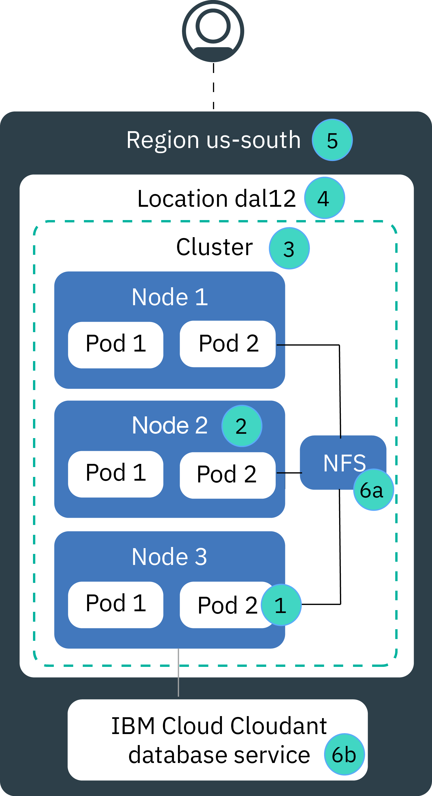

---

copyright:
  years: 2014, 2020
lastupdated: "2020-02-17"

keywords: kubernetes, iks, disaster recovery, dr, ha, hadr

subcollection: containers

---

{:codeblock: .codeblock}
{:deprecated: .deprecated}
{:download: .download}
{:external: target="_blank" .external}
{:faq: data-hd-content-type='faq'}
{:gif: data-image-type='gif'}
{:help: data-hd-content-type='help'}
{:important: .important}
{:new_window: target="_blank"}
{:note: .note}
{:pre: .pre}
{:preview: .preview}
{:screen: .screen}
{:shortdesc: .shortdesc}
{:support: data-reuse='support'}
{:table: .aria-labeledby="caption"}
{:tip: .tip}
{:troubleshoot: data-hd-content-type='troubleshoot'}
{:tsCauses: .tsCauses}
{:tsResolve: .tsResolve}
{:tsSymptoms: .tsSymptoms}

# High availability for {{site.data.keyword.containerlong_notm}}
{: #ha}

Use the built-in Kubernetes and {{site.data.keyword.containerlong}} features to make your cluster more highly available and to protect your app from downtime when a component in your cluster fails.
{: shortdesc}

High availability is a core discipline in an IT infrastructure to keep your apps up and running, even after a partial or full site failure. The main purpose of high availability is to eliminate potential points of failures in an IT infrastructure. For example, you can prepare for the failure of one system by adding redundancy and setting up failover mechanisms.

You can achieve high availability on different levels in your IT infrastructure and within different components of your cluster. The level of availability that is right for you depends on several factors, such as your business requirements, the Service Level Agreements that you have with your customers, and the money that you want to spend.

## Overview of potential points of failure in {{site.data.keyword.containerlong_notm}}
{: #fault_domains}

The {{site.data.keyword.containerlong_notm}} architecture and infrastructure is designed to ensure reliability, low processing latency, and a maximum uptime of the service. However, failures can happen. Depending on the service that you host in {{site.data.keyword.cloud_notm}}, you might not be able to tolerate failures, even if failures last for only a few minutes.
{: shortdesc}

{{site.data.keyword.containerlong_notm}} provides several approaches to add more availability to your cluster by adding redundancy and anti-affinity. Review the following image to learn about potential points of failure and how to eliminate them. 

<dl>
<dt> 1. Container or pod failure.</dt>
  <dd>
Containers and pods are, by design, short-lived and can fail unexpectedly. For example, a container or pod might crash if an error occurs in your app. To make your app highly available, you must ensure that you have enough instances of your app to handle the workload plus additional instances in the case of a failure. Ideally, these instances are distributed across multiple worker nodes to protect your app from a worker node failure.

  
See [Deploying highly available apps](/docs/containers?topic=containers-plan_deploy#highly_available_apps).
</dd>
<dt> 2. Worker node failure.</dt>
  <dd>
A worker node is a VM that runs on top of physical hardware. Worker node failures include hardware outages, such as power, cooling, or networking, and issues on the VM itself. You can account for a worker node failure by setting up multiple worker nodes in your cluster.

Worker nodes in one zone are not guaranteed to be on separate physical compute hosts. For example, you might have a cluster with three worker nodes, but all three worker nodes were created on the same physical compute host in the IBM zone. If this physical compute host goes down, all your worker nodes are down. To protect against this failure, you must [set up a multizone cluster or create multiple single zone clusters](/docs/containers?topic=containers-ha_clusters#ha_clusters) in different zones.

  
See [Creating clusters with multiple worker nodes.](/docs/containers?topic=containers-cli-plugin-kubernetes-service-cli#cs_cluster_create)
</dd>
<dt> 3. Cluster failure.</dt>
  <dd>
The [Kubernetes master](/docs/containers?topic=containers-service-arch) is the main component that keeps your cluster up and running. The master stores cluster resources and their configurations in the etcd database that serves as the single point of truth for your cluster. The Kubernetes API server is the main entry point for all cluster management requests from the worker nodes to the master, or when you want to interact with your cluster resources.  If a master failure occurs, your workloads continue to run on the worker nodes, but you cannot use `kubectl` commands to work with your cluster resources or view the cluster health until the Kubernetes API server in the master is back up. If a pod goes down during the master outage, the pod cannot be rescheduled until the worker node can reach the Kubernetes API server again.  During a master outage, you can still run `ibmcloud ks` commands against the {{site.data.keyword.containerlong_notm}} API to work with your infrastructure resources, such as worker nodes or VLANs. If you change the current cluster configuration by adding or removing worker nodes to the cluster, your changes do not happen until the master is back up.

Do not restart or reboot a worker node during a master outage. This action removes the pods from your worker node. Because the Kubernetes API server is unavailable, the pods cannot be rescheduled onto other worker nodes in the cluster.

  
The cluster masters are highly available and include replicas for your Kubernetes API server, etcd, scheduler, and controller manager on separate hosts to protect against an outage such as during a master update.

To protect your cluster master from a zone failure, you can: <ul><li>Create a cluster in a [multizone metro location](/docs/containers?topic=containers-regions-and-zones#zones), which spreads the master across zones.</li><li>Set up a second cluster in another zone.</li></ul>

  
See [Setting up highly available clusters.](/docs/containers?topic=containers-ha_clusters#ha_clusters)
</dd>
<dt> 4. Zone failure.</dt>
  <dd>
A zone failure affects all physical compute hosts and NFS storage. Failures include power, cooling, networking, or storage outages, and natural disasters, like flooding, earthquakes, and hurricanes. To protect against a zone failure, you must have clusters in two different zones that are load balanced by an external load balancer.

  
See [Setting up highly available clusters](/docs/containers?topic=containers-ha_clusters#ha_clusters).
</dd>    
<dt> 5. Region failure.</dt>
  <dd>
Every region is set up with a highly available load balancer that is accessible from the region-specific API endpoint. The load balancer routes incoming and outgoing requests to clusters in the regional zones. The likelihood of a full regional failure is low. However, to account for this failure, you can set up multiple clusters in different regions and connect them by using an external load balancer. If an entire region fails, the cluster in the other region can take over the work load.

A multi-region cluster requires several Cloud resources, and depending on your app, can be complex and expensive. Check whether you need a multi-region setup or if you can accommodate a potential service disruption. If you want to set up a multi-region cluster, ensure that your app and the data can be hosted in another region, and that your app can handle global data replication.

  
See [Setting up highly available clusters](/docs/containers?topic=containers-ha_clusters#ha_clusters).
</dd>   
<dt> 6a, 6b. Storage failure.</dt>
  <dd>
In a stateful app, data plays an important role to keep your app up and running. Make sure that your data is highly available so that you can recover from a potential failure. In {{site.data.keyword.containerlong_notm}}, you can choose from several options to persist your data. For example, you can provision NFS storage by using Kubernetes native persistent volumes, or store your data by using an {{site.data.keyword.cloud_notm}} database service.

  
See [Planning highly available data](/docs/containers?topic=containers-storage_planning#persistent_storage_overview).
</dd>
</dl>

