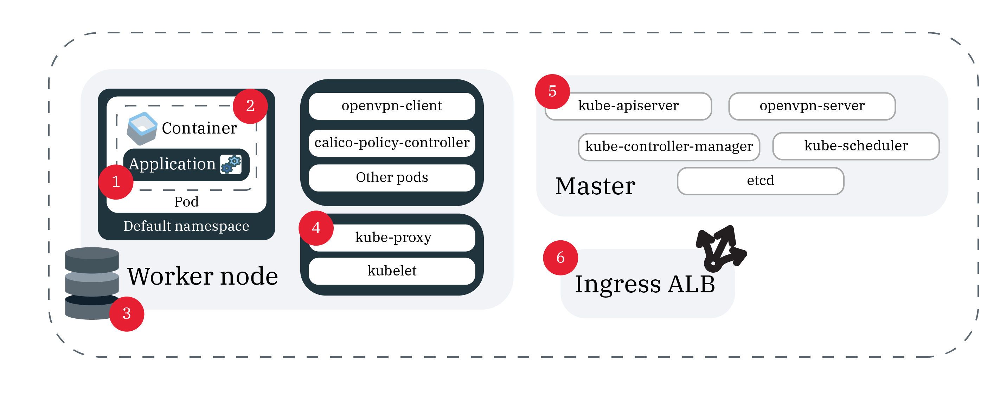

---

copyright:
  years: 2014, 2023
lastupdated: "2023-06-12"

keywords: kubernetes, logmet, logs, metrics, recovery, auto-recovery

subcollection: containers

---

{{site.data.keyword.attribute-definition-list}}


# Logging for clusters
{: #health}

Set up logging in {{site.data.keyword.containerlong}} to help you troubleshoot issues and improve the health and performance of your Kubernetes clusters and apps.
{: shortdesc}

Continuous monitoring and logging is the key to detecting attacks on your cluster and troubleshooting issues as they arise. By continuously monitoring your cluster, you're able to better understand your cluster capacity and the availability of resources that are available to your app. With this insight, you can prepare to protect your apps against downtime.

You can configure custom settings for the logging agents that are deployed to your cluster such custom inclusion rules, logging directories, and more. For more information, see [Configuring a logging agent](/docs/log-analysis?topic=log-analysis-log_analysis_agent#log_analysis_agent_configure){: external}
{: note}

## Choosing a logging solution
{: #logging_overview}

By default, logs are generated and written locally for all the following {{site.data.keyword.containerlong_notm}} cluster components: worker nodes, containers, applications, persistent storage, Ingress application load balancer, Kubernetes API, and the `kube-system` namespace. Several logging solutions are available to collect, forward, and view these logs.
{: shortdesc}

You can choose your logging solution based on which cluster components you need to collect logs for. A common implementation is to choose a logging service that you prefer based on its analysis and interface capabilities, such as {{site.data.keyword.la_full_notm}} or a third-party service. You can then use {{site.data.keyword.at_full_notm}} to audit user activity in the cluster.

{{site.data.keyword.la_full}}
: Manage pod container logs by deploying an instance of {{site.data.keyword.la_full_notm}} and configuring this instance for your cluster in {{site.data.keyword.containershort_notm}}. A logging agent collects logs with the extension `*.log` and extensionless files that are stored in the `/var/log` directory of your pod from all namespaces, including `kube-system`. The agent then forwards the logs to your {{site.data.keyword.la_full_notm}} service instance. For more information about the service, see the [{{site.data.keyword.la_full_notm}}](/docs/log-analysis?topic=log-analysis-getting-started) documentation. To enable {{site.data.keyword.la_full_notm}} in your cluster, see [Forwarding cluster and app logs to {{site.data.keyword.la_full_notm}}](#logging).

{{site.data.keyword.at_full}}
: To monitor user-initiated administrative activity made in your cluster, {{site.data.keyword.containershort_notm}} automatically generates cluster management events and forwards these event logs to {{site.data.keyword.at_full_notm}}. To access these logs, [provision an instance of {{site.data.keyword.at_full_notm}}](/docs/activity-tracker?topic=activity-tracker-getting-started). For more information about the types of {{site.data.keyword.containerlong_notm}} events that you can track, see [Activity Tracker events](/docs/containers?topic=containers-at_events).

Fluentd with an external server
: To collect, forward, and view logs for a cluster component, you can create a logging configuration by using Fluentd. When you create a logging configuration, the [Fluentd](https://www.fluentd.org/){: external} cluster component collects logs from the paths for a specified source. Fluentd can then forward these logs to an external server that accepts a syslog protocol. To get started, see [Understanding cluster and app log forwarding to syslog](#logging).


## Forwarding cluster and app logs to {{site.data.keyword.la_full_notm}}
{: #logging}

Forward logs to an {{site.data.keyword.la_full_notm}} instance.
{: shortdesc}

Use the {{site.data.keyword.containerlong_notm}} observability plug-in to create a logging configuration for {{site.data.keyword.la_full_notm}} in your cluster, and use this logging configuration to automatically collect and forward pod logs to {{site.data.keyword.la_full_notm}}.
{: shortdesc}

Considerations for using the {{site.data.keyword.containerlong_notm}} observability plug-in:
* You can have only one logging configuration for {{site.data.keyword.la_full_notm}} in your cluster at a time. If you want to use a different {{site.data.keyword.la_full_notm}} service instance to send logs to, use the [`ibmcloud ob logging config replace`](/docs/containers?topic=containers-observability_cli#logging_config_replace) command.
* If you created a {{site.data.keyword.la_short}} configuration in your cluster without using the {{site.data.keyword.containerlong_notm}} observability plug-in, you can use the [`ibmcloud ob logging agent discover`](/docs/containers?topic=containers-observability_cli#logging_agent_discover) command to make the configuration visible to the plug-in. Then, you can use the observability plug-in commands and functionality in the {{site.data.keyword.cloud_notm}} console to manage the configuration.

Before you begin
- Verify that you are assigned the **Editor** platform access role and **Manager** server access role for {{site.data.keyword.la_full_notm}}.
- Verify that you are assigned the **Administrator** platform access role and the **Manager** service access role for all Kubernetes namespaces in {{site.data.keyword.containerlong_notm}} to create the logging configuration. To view a logging configuration or launch the {{site.data.keyword.la_short}} dashboard after the logging configuration is created, users must be assigned the **Viewer** platform access role and **Reader** service access role for the `ibm-observe` Kubernetes namespace in {{site.data.keyword.containerlong_notm}}.
- If you want to use the CLI to set up the logging configuration:
    - [Install the {{site.data.keyword.containerlong_notm}} observability CLI plug-in (`ibmcloud ob`)](/docs/containers?topic=containers-cli-install).
    - [Log in to your account. If applicable, target the appropriate resource group. Set the context for your cluster.](/docs/containers?topic=containers-access_cluster)

To set up a logging configuration for your cluster,

1. Create an [{{site.data.keyword.la_full_notm}} service instance](/docs/log-analysis?topic=log-analysis-provision) and note the name of the instance. The service instance must belong to the same {{site.data.keyword.cloud_notm}} account where you created your cluster, but can be in a different resource group and {{site.data.keyword.cloud_notm}} region than your cluster.
2. Set up a logging configuration for your cluster. When you create the logging configuration, a Kubernetes namespace `ibm-observe` is created and a {{site.data.keyword.la_short}} agent is deployed as a daemon set to all worker nodes in your cluster. This agent collects logs with the extension `*.log` and extensionless files that are stored in the `/var/log` directory of your pod from all namespaces, including `kube-system`. The agent then forwards the logs to the {{site.data.keyword.la_full_notm}} service.

    - From the console
        1. From the [Kubernetes clusters console](https://cloud.ibm.com/kubernetes/clusters){: external}, select the cluster for which you want to create a {{site.data.keyword.la_short}} configuration.
        2. On the cluster **Overview** page, click **Connect**.
        3. Select the region and the {{site.data.keyword.la_full_notm}} service instance that you created earlier, and click **Connect**.

    - From the CLI
        1. Create the {{site.data.keyword.la_short}} configuration. When you create the {{site.data.keyword.la_short}} configuration, the ingestion key that was last added is retrieved automatically. If you want to use a different ingestion key, add the `--logdna-ingestion-key <ingestion_key>` option to the command.

            To use a different ingestion key after you created your logging configuration, use the [`ibmcloud ob logging config replace`](/docs/containers?topic=containers-observability_cli#logging_config_replace) command.
            {: tip}

            ```sh
            ibmcloud ob logging config create --cluster <cluster_name_or_ID> --instance <Log_Analysis_instance_name_or_ID>
            ```
            {: pre}

            Example output
            ```sh
            Creating configuration...
            OK
            ```
            {: screen}

        2. Verify that the logging configuration was added to your cluster.
            ```sh
            ibmcloud ob logging config list --cluster <cluster_name_or_ID>
            ```
            {: pre}

            Example output
            ```sh
            Listing configurations...

            OK
            Instance Name                Instance ID                            CRN   
            IBM Cloud Log Analysis-opm   1a111a1a-1111-11a1-a1aa-aaa11111a11a   crn:v1:prod:public:logdna:us-south:a/a11111a1aaaaa11a111aa11a1aa1111a:1a111a1a-1111-11a1-a1aa-aaa11111a11a::  
            ```
            {: screen}

3. Optional: Verify that the {{site.data.keyword.la_short}} agent was set up successfully.
    1. If you used the console to create the {{site.data.keyword.la_short}} configuration, log in to your cluster. For more information, see [Log in to your account. If applicable, target the appropriate resource group. Set the context for your cluster.](/docs/containers?topic=containers-access_cluster).

    2. Verify that the daemon set for the {{site.data.keyword.la_short}} agent was created and all instances are listed as `AVAILABLE`.
        ```sh
        kubectl get daemonsets -n ibm-observe
        ```
        {: pre}

        Example output
        ```sh
        NAME           DESIRED   CURRENT   READY   UP-TO-DATE   AVAILABLE   NODE SELECTOR   AGE
        logdna-agent   9         9         9       9            9           <none>          14m
        ```
        {: screen}

        The number of daemon set instances that are deployed equals the number of worker nodes in your cluster.

    3. Review the ConfigMap that was created for your {{site.data.keyword.la_short}} agent.
        ```sh
        kubectl describe configmap -n ibm-observe
        ```
        {: pre}

4. Access the logs for your pods from the {{site.data.keyword.la_short}} dashboard.
    1. From the [Kubernetes clusters console](https://cloud.ibm.com/kubernetes/clusters){: external}, select the cluster that you configured.  
    2. On the cluster **Overview** page, click **Launch**. The {{site.data.keyword.la_short}} dashboard opens.
    3. Review the pod logs that the {{site.data.keyword.la_short}} agent collected from your cluster. It might take a few minutes for your first logs to show.

5. Review how you can [search and filter logs in the {{site.data.keyword.la_short}} dashboard](/docs/log-analysis?topic=log-analysis-view_logs).


## Forwarding cluster and app logs to an external server
{: #configuring}

Configure log forwarding for {{site.data.keyword.containerlong_notm}} standard clusters to an external server.
{: shortdesc}

### Understanding log forwarding to an external server
{: #logging-external}

When you create a logging configuration for a source in your cluster to forward to an external server, a [Fluentd](https://www.fluentd.org/){: external} component is created in your cluster. Fluentd collects the logs from that source's paths and forwards the logs to an external server. The traffic from the source to the logging service on the ingestion port is encrypted.
{: shortdesc}

What are the sources that I can configure log forwarding for?
:   In the following image, you can see the location of the sources that you can configure logging for.

{: caption="Figure 1. Log sources in your cluster" caption-side="bottom"}

1. `worker`: Information that is specific to the infrastructure configuration that you have for your worker node. Worker logs are captured in syslog and contain operating system events. In `auth.log` you can find information on the authentication requests that are made to the OS.
    
    Paths
    - `/var/log/syslog`
    - `/var/log/auth.log`

2. `container`: Information that is logged by a running container.**Paths**: Anything that is written to `STDOUT` or `STDERR`.

3. `application`: Information about events that occur at the application level. This could be a notification that an event took place such as a successful login, a warning about storage, or other operations that can be performed at the app level.**Paths**: You can set the paths that your logs are forwarded to. However, in order for logs to be sent, you must use an absolute path in your logging configuration or the logs can't be read. If your path is mounted to your worker node, it might have created a symbolic link. Example: If the specified path is `/usr/local/spark/work/app-0546/0/stderr` but the logs actually go to `/usr/local/spark-1.0-hadoop-1.2/work/app-0546/0/stderr`, then the logs can't be read.

4. `storage`: Information about persistent storage that is set up in your cluster. Storage logs can help you set up problem determination dashboards and alerts as part of your DevOps pipeline and production releases. **Note**: The paths `/var/log/kubelet.log` and `/var/log/syslog` also contain storage logs, but logs from these paths are collected by the `kubernetes` and `worker` log sources.
    
    Paths
    :   `/var/log/ibmc-s3fs.log`
    :   `/var/log/ibmc-block.log`

    Pods**
    :   `portworx-***`
    :   `ibmcloud-block-storage-attacher-***`
    :   `ibmcloud-block-storage-driver-***`
    :   `ibmcloud-block-storage-plugin-***`
    :   `ibmcloud-object-storage-plugin-***`

5. `kubernetes`: Information from the kubelet, the kube-proxy, and other Kubernetes events that happen in the kube-system namespace of the worker node.

    Paths
    :   `/var/log/kubelet.log`
    :   `/var/log/kube-proxy.log`
    :   `/var/log/event-exporter/1..log`
    
6. `ingress`: Information about the network traffic that comes into a cluster through the Ingress ALB.

    Paths
    :   `/var/log/alb/ids/*.log`
    :   `/var/log/alb/ids/*.err`
    :   `/var/log/alb/customerlogs/*.log`
    :   `/var/log/alb/customerlogs/*.err`

7. `kube-audit`: Information about cluster-related actions that is sent to the Kubernetes API server, including the time, the user, and the affected resource. The `kube-audit` source can be configured with a webhook. For more information, see [Forwarding Kubernetes API audit logs to an external server](/docs/containers?topic=containers-health-audit#audit-api-server-external).


Am I responsible for keeping Fluentd updated?
:   To change your logging or filter configurations, the Fluentd logging component must be at the latest version. By default, automatic updates to the add-on are enabled. To disable automatic updates, see [Updating cluster components: Fluentd for logging](/docs/containers?topic=containers-update#logging-up).

Can I forward some logs, but not others, from one source in my cluster?
:   Yes. For example, if you have a particularly chatty pod, you might want to prevent logs from that pod from taking up log storage space, while still allowing other pods' logs to be forwarded. To prevent logs from a specific pod from being forwarded, see [Filtering logs](#filter-logs).


### Forwarding cluster and app logs
{: #enable-forwarding}

Create a configuration for cluster and app logging. You can differentiate between the different logging options by using options.
{: shortdesc}

The following table shows the different options that you have when you configure logging and their descriptions.

| Parameter | Description |
| --- | ---------- |
| `<cluster_name_or_ID>` | The name or ID of the cluster. |
| `--logsource` | The source that you want to forward logs from. Accepted values are `container`, `application`, `worker`, `kubernetes`, `ingress`, and `storage`. This option supports a comma-separated list of log sources to apply to the configuration. If you don't provide a log source, logging configurations are created for `container` and `ingress` log sources. |
| `--type syslog` | The value `syslog` forwards your logs to an external server. |
| `--namespace` | Optional: The Kubernetes namespace that you want to forward logs from. Log forwarding is not supported for the `ibm-system` and `kube-system` Kubernetes namespaces. This value is valid only for the `container` log source. If you don't specify a namespace, then all namespaces in the cluster use this configuration. |
| `--hostname` | Specify the hostname or IP address of the log collector service. |
| `--port` | The ingestion port. If you don't specify a port, then the standard port `9091` is used. For syslog, specify the port of the log collector server. If you don't specify a port, then the standard port `514` is used. | 
| `--app-containers` | Optional: To forward logs from apps, you can specify the name of the container that contains your app. You can specify more than one container by using a comma-separated list. If no containers are specified, logs are forwarded from all the containers that contain the paths that you provided. |
| `--app-paths` | The path on a container that the apps log to. To forward logs with source type `application`, you must provide a path. To specify more than one path, use a comma-separated list; for example, `/var/log/myApp1/*,/var/log/myApp2/*` |
| `--syslog-protocol` | When the logging type is `syslog<`, the transport layer protocol. You can use the following protocols: `udp`, `tls`, or `tcp`. When forwarding to a rsyslog server with the `udp` protocol, logs that are over 1KB are truncated. |
| `--ca-cert` | Required: When the logging type is `syslog` and the protocol is `tls`, the Kubernetes secret name that contains the certificate authority certificate. |
| `--verify-mode` | When the logging type is `syslog` and the protocol is `tls`, the verification mode. Supported values are `verify-peer` and the default `verify-none`. |
| `--skip-validation` | Optional: Skip the validation of the org and space names when they are specified. Skipping validation decreases processing time, but an invalid logging configuration does not correctly forward logs. |
{: caption="Table 1. Understanding logging configuration options" caption-side="bottom"}


### Forwarding logs to your own server over the `udp` or `tcp` protocols
{: #enable-forwarding-udp-tcp}

1. Ensure that you have the [**Editor** or **Administrator** {{site.data.keyword.cloud_notm}} IAM platform access role](/docs/containers?topic=containers-users#checking-perms).

2. For the cluster where the log source is located: [Log in to your account. If applicable, target the appropriate resource group. Set the context for your cluster.](/docs/containers?topic=containers-access_cluster)

3. Set up a server that accepts a syslog protocol in 1 of 2 ways:
    :  Set up and manage your own server or have a provider manage it for you. If a provider manages the server for you, get the logging endpoint from the logging provider.

    :  Run syslog from a container. For example, you can use this [deployment .yaml file](https://github.com/IBM-Cloud/kube-samples/blob/master/deploy-apps-clusters/deploy-syslog-from-kube.yaml){: external} to fetch a Docker public image that runs a container in your cluster. The image publishes the port `514` on the public cluster IP address, and uses this public cluster IP address to configure the syslog host.

    You can see your logs as valid JSON by removing syslog prefixes. To do so, add the following code to the beginning your `etc/rsyslog.conf` file where your rsyslog server runs: `$template customFormat,"%msg%\n"$ActionFileDefaultTemplate customFormat`
    {: tip}

4. Create a log forwarding configuration. For more information about the parameters, see the [Understanding logging configuration options table](#enable-forwarding).
    ```sh
    ibmcloud ks logging config create --cluster <cluster_name_or_ID> --logsource <log_source> --namespace <kubernetes_namespace> --hostname <log_server_hostname_or_IP> --port <log_server_port> --type syslog --app-containers <container1,2> --app-paths <paths_to_logs> --syslog-protocol <protocol> --skip-validation
    ```
    {: pre}


### Forwarding logs to your own server over the `tls` protocol
{: #enable-forwarding-tls}

The following steps are general instructions. Before you use the container in a production environment, be sure that any security requirements are met.
{: tip}

1. Ensure that you have the following [{{site.data.keyword.cloud_notm}} IAM roles](/docs/containers?topic=containers-users#checking-perms):
    - **Editor** or **Administrator** platform access role for the cluster
    - **Writer** or **Manager** service access role for the `kube-system` namespace

2. For the cluster where the log source is located: [Log in to your account. If applicable, target the appropriate resource group. Set the context for your cluster.](/docs/containers?topic=containers-access_cluster)

3. Set up a server that accepts a syslog protocol in 1 of 2 ways:
    - Set up and manage your own server or have a provider manage it for you. If a provider manages the server for you, get the logging endpoint from the logging provider.

    - Run syslog from a container. For example, you can use this [deployment .yaml file](https://github.com/IBM-Cloud/kube-samples/blob/master/deploy-apps-clusters/deploy-syslog-from-kube.yaml){: external} to fetch a Docker public image that runs a container in your cluster. The image publishes the port `514` on the public cluster IP address, and uses this public cluster IP address to configure the syslog host. You need to inject the relevant certificate authority and server-side certificates and update the `syslog.conf` to enable `tls` on your server.

4. Save your certificate authority certificate to a file named `ca-cert`. It must be that exact name.

5. Create a secret in the `kube-system` namespace for the `ca-cert` file. When you create your logging configuration, use the secret name for the `--ca-cert` option.
    ```sh
    kubectl -n kube-system create secret generic --from-file=ca-cert
    ```
    {: pre}

6. Create a log forwarding configuration. For more information about the parameters, see the [Understanding logging configuration options table](#enable-forwarding).
    ```sh
    ibmcloud ks logging config create --cluster <cluster name or id> --logsource <log source> --type syslog --syslog-protocol tls --hostname <ip address of syslog server> --port <port for syslog server, 514 is default> --ca-cert <secret name> --verify-mode <defaults to verify-none>
    ```
    {: pre}

### Filtering logs that are forwarded
{: #filter-logs}

You can choose which logs to forward to your external server by filtering out specific logs for a period of time. You can differentiate between the different filtering options by using options.
{: shortdesc}

| Parameter | Description |
| --- | ------- |
| `<cluster_name_or_ID>` | Required: The name or ID of the cluster that you want to filter logs for. |
| `<log_type>` | The type of logs that you want to apply the filter to. Currently `all`, `container`, and `host` are supported. |
| `<configs>` | Optional: A comma-separated list of your logging configuration IDs. If not provided, the filter is applied to all the cluster logging configurations that are passed to the filter. You can view log configurations that match the filter by using the `--show-matching-configs` option. | 
| `<kubernetes_namespace>` | Optional: The Kubernetes namespace that you want to forward logs from. This option applies only when you are using log type `container`. |
| `<container_name>` | Optional: The name of the container from which you want to filter logs. |
| `<logging_level>` | Optional: Filters out logs that are at the specified level and less. Acceptable values in their canonical order are `fatal`, `error`, `warn/warning`, `info`, `debug`, and `trace`. As an example, if you filtered logs at the `info` level, `debug`, and `trace` are also filtered. **Note**: You can use this option only when log messages are in JSON format and contain a level field. To display your messages in JSON, append the `--output json` option to the command. |
| `<message>` | Optional: Filters out logs that contain a specified message that is written as a regular expression. |
| `<filter_ID>` | Optional: The ID of the log filter. |
| `--show-matching-configs` | Optional: Show the logging configurations that each filter applies to. |
| `--all` | Optional: Delete all your log forwarding filters. |
{: caption="Table 2. Understanding the options for log filtering" caption-side="bottom"}

1. Create a logging filter.
    ```sh
    ibmcloud ks logging filter create --cluster <cluster_name_or_ID> --type <log_type> --logging-configs <configs> --namespace <kubernetes_namespace> --container <container_name> --level <logging_level> --regex-message <message>
    ```
    {: pre}

2. View the log filter that you created.

    ```sh
    ibmcloud ks logging filter get --cluster <cluster_name_or_ID> --id <filter_ID> --show-matching-configs
    ```
    {: pre}

3. Update the log filter that you created.
    ```sh
    ibmcloud ks logging filter update --cluster <cluster_name_or_ID> --id <filter_ID> --type <server_type> --logging-configs <configs> --namespace <kubernetes_namespace --container <container_name> --level <logging_level> --regex-message <message>
    ```
    {: pre}

4. Delete a log filter that you created.

    ```sh
    ibmcloud ks logging filter rm --cluster <cluster_name_or_ID> --id <filter_ID> [--all]
    ```
    {: pre}

### Verifying, updating, and deleting log forwarding
{: #verifying-log-forwarding}

#### Verifying log forwarding
{: #verify-log-forwarding}

You can verify that your configuration is set up correctly in 1 of 2 ways:

- To list all the logging configurations in a cluster:
    ```sh
    ibmcloud ks logging config get --cluster <cluster_name_or_ID>
    ```
    {: pre}

- To list the logging configurations for one type of log source:
    ```sh
    ibmcloud ks logging config get --cluster <cluster_name_or_ID> --logsource <source>
    ```
    {: pre}

#### Updating log forwarding
{: #updating-log-forwarding}

You can update a logging configuration that you already created:
```sh
ibmcloud ks logging config update --cluster <cluster_name_or_ID> --id <log_config_id> --namespace <namespace> --type <server_type> --syslog-protocol <protocol> --logsource <source> --hostname <hostname_or_ingestion_URL> --port <port> --space <cluster_space> --org <cluster_org> --app-containers <container1,2> --app-paths <paths_to_logs>
```
{: pre}

#### Deleting log forwarding
{: #deleting-log-forwarding}

You can stop forwarding logs by deleting one or all the logging configurations for a cluster:

- To delete one logging configuration:
    ```sh
    ibmcloud ks logging config rm --cluster <cluster_name_or_ID> --id <log_config_ID>
    ```
    {: pre}

- To delete all the logging configurations:
    ```sh
    ibmcloud ks logging config rm --cluster <my_cluster> --all
    ```
    {: pre}


