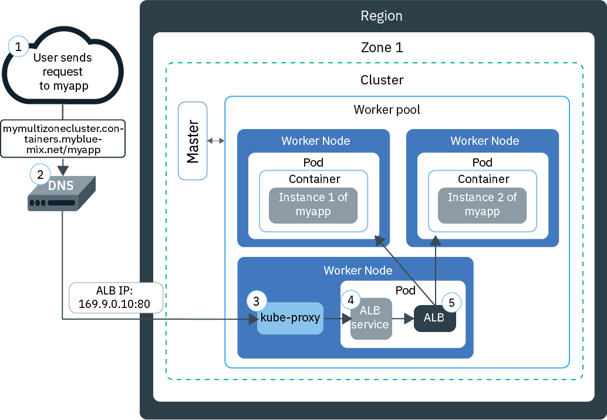

---

copyright:
  years: 2014, 2018
lastupdated: "2018-03-30"

---

{:new_window: target="_blank"}
{:shortdesc: .shortdesc}
{:screen: .screen}
{:pre: .pre}
{:table: .aria-labeledby="caption"}
{:codeblock: .codeblock}
{:tip: .tip}
{:download: .download}


# Exposing apps with Ingress
{: #ingress}

Expose multiple apps in your Kubernetes cluster by creating Ingress resources that are managed by the IBM-provided application load balancer in {{site.data.keyword.containerlong}}.
{:shortdesc}

## Managing network traffic by using Ingress
{: #planning}

Ingress is a Kubernetes service that balances network traffic workloads in your cluster by forwarding public or private requests to your apps. You can use Ingress to expose multiple app services to the public or to a private network by using a unique public or private route.
{:shortdesc}

Ingress consists of two components:
<dl>
<dt>Application load balancer</dt>
<dd>The application load balancer (ALB) is an external load balancer that listens for incoming HTTP or HTTPS, TCP, or UDP service requests and forwards requests to the appropriate app pod. When you create a standard cluster, {{site.data.keyword.containershort_notm}} automatically creates a highly available ALB for your cluster and assigns a unique public route to it. The public route is linked to a portable public IP address that is provisioned into your IBM Cloud infrastructure (SoftLayer) account during cluster creation. A default private ALB is also automatically created, but is not automatically enabled.</dd>
<dt>Ingress resource</dt>
<dd>To expose an app by using Ingress, you must create a Kubernetes service for your app and register this service with the ALB by defining an Ingress resource. The Ingress resource is a Kubernetes resource that defines the rules for how to route incoming requests for an app. The Ingress resource also specifies the path to your app service, which is appended to the public route to form a unique app URL such as `mycluster.us-south.containers.mybluemix.net/myapp`.</dd>
</dl>

The following diagram shows how Ingress directs communication from the internet to an app:



1. A user sends a request to your app by accessing your app's URL. This URL is the public URL for your exposed app with the Ingress resource path appended to it, such as `mycluster.us-south.containers.mybluemix.net/myapp`.

2. A DNS system service that acts as the global load balancer resolves the URL to the portable public IP address of the default public ALB in the cluster.

3. `kube-proxy` routes the request to the Kubernetes ALB service for the app.

4. The Kubernetes service routes the request to the ALB.

5. The ALB checks if a routing rule for the `myapp` path in the cluster exists. If a matching rule is found, the request is forwarded according to the rules that you defined in the Ingress resource to the pod where the app is deployed. If multiple app instances are deployed in the cluster, the ALB load balances the requests between the app pods.


**Note:** Ingress is available for standard clusters only and requires at least two worker nodes in the cluster to ensure high availability and that periodic updates are applied. Setting up Ingress requires an [Administrator access policy](cs_users.html#access_policies). Verify your current [access policy](cs_users.html#infra_access).

To choose the best configuration for Ingress, you can follow this decision tree:


<map name="ingress_map" id="ingress_map">
<area href="/docs/containers/cs_ingress.html#private_ingress_no_tls" alt="Privately expose apps using a custom domain without TLS" shape="rect" coords="25, 246, 187, 294"/>
<area href="/docs/containers/cs_ingress.html#private_ingress_tls" alt="Privately expose apps using a custom domain with TLS" shape="rect" coords="161, 337, 309, 385"/>
<area href="/docs/containers/cs_ingress.html#external_endpoint" alt="Publicly exposing apps that are outside your cluster using the IBM-provided or a custom domain with TLS" shape="rect" coords="313, 229, 466, 282"/>
<area href="/docs/containers/cs_ingress.html#custom_domain_cert" alt="Publicly exposing apps using a custom domain with TLS" shape="rect" coords="365, 415, 518, 468"/>
<area href="/docs/containers/cs_ingress.html#ibm_domain" alt="Publicly exposing apps using the IBM-provided domain without TLS" shape="rect" coords="414, 629, 569, 679"/>
<area href="/docs/containers/cs_ingress.html#ibm_domain_cert" alt="Publicly exposing apps using the IBM-provided domain with TLS" shape="rect" coords="563, 711, 716, 764"/>
</map>

<br />


## Exposing apps to the public
{: #ingress_expose_public}

When you create a standard cluster, an IBM-provided application load balancer (ALB) is automatically enabled and is assigned a portable public IP address and a public route.
{:shortdesc}

Every app that is exposed to the public via Ingress is assigned a unique path that is appended to the public route, so that you can use a unique URL to access an app publicly in your cluster. To expose your app to the public, you can configure Ingress for the following scenarios.

-   [Publicly expose apps using the IBM-provided domain without TLS](#ibm_domain)
-   [Publicly expose apps using the IBM-provided domain with TLS](#ibm_domain_cert)
-   [Publicly expose apps using a custom domain with TLS](#custom_domain_cert)
-   [Publicly expose apps that are outside your cluster using the IBM-provided or a custom domain with TLS](#external_endpoint)

### Publicly expose apps using the IBM-provided domain without TLS
{: #ibm_domain}

You can configure the ALB to load balance incoming HTTP network traffic to the apps in your cluster and use the IBM-provided domain to access your apps from the internet.
{:shortdesc}

Before you begin:

-   If you do not have one already, [create a standard cluster](cs_clusters.html#clusters_ui).
-   [Target your CLI](cs_cli_install.html#cs_cli_configure) to your cluster to run `kubectl` commands.

To expose an app by using the IBM-provided domain:

1.  [Deploy your app to the cluster](cs_app.html#app_cli). When you deploy your app to the cluster, one or more pods are created for you that run your app in a container. Ensure that you add a label to your deployment in the metadata section of your configuration file. This label is needed to identify all pods where your app is running, so that they can be included in the Ingress load balancing.
2.  Create a Kubernetes service for the app to expose. The ALB can include your app into the Ingress load balancing only if your app is exposed via a Kubernetes service inside the cluster.
    1.  Open your preferred editor and create a service configuration file that is named, for example, `myservice.yaml`.
    2.  Define a service for the app that you want to expose to the public.

        ```
        apiVersion: v1
        kind: Service
        metadata:
          name: <myservice>
        spec:
          selector:
            <selectorkey>: <selectorvalue>
          ports:
           - protocol: TCP
             port: 8080
        ```
        {: codeblock}

        <table>
        <caption>Understanding the ALB service file components</caption>
        <thead>
        <th colspan=2> Understanding the YAML file components</th>
        </thead>
        <tbody>
        <tr>
        <td><code>name</code></td>
        <td>Replace <em>&lt;myservice&gt;</em> with a name for your ALB service.</td>
        </tr>
        <tr>
        <td><code>selector</code></td>
        <td>Enter the label key (<em>&lt;selectorkey&gt;</em>) and value (<em>&lt;selectorvalue&gt;</em>) pair that you want to use to target the pods where your app runs. For example, if you use the following selector <code>app: code</code>, all pods that have this label in their metadata are included in the load balancing. Enter the same label that you used when you deployed your app to the cluster. </td>
         </tr>
         <tr>
         <td><code>port</code></td>
         <td>The port that the service listens on.</td>
         </tr>
         </tbody></table>
    3.  Save your changes.
    4.  Create the service in your cluster.

        ```
        kubectl apply -f myservice.yaml
        ```
        {: pre}
    5.  Repeat these steps for every app that you want to expose to the public.
3.  Get the details for your cluster to view the IBM-provided domain. Replace _&lt;mycluster&gt;_ with the name of the cluster where the app is deployed that you want to expose to the public.

    ```
    bx cs cluster-get <mycluster>
    ```
    {: pre}

    Your CLI output looks similar to the following.

    ```
    Retrieving cluster <mycluster>...
    OK
    Name:    <mycluster>
    ID:    b9c6b00dc0aa487f97123440b4895f2d
    State:    normal
    Created:  2017-04-26T19:47:08+0000
    Location: dal10
    Master URL:  https://169.57.40.165:1931
    Ingress subdomain:  <ibmdomain>
    Ingress secret:  <ibmtlssecret>
    Workers:  3
    Version: 1.8.8
    ```
    {: screen}

    You can see the IBM-provided domain in the **Ingress subdomain** field.
4.  Create an Ingress resource. Ingress resources define the routing rules for the Kubernetes service that you created for your app and are used by the ALB to route incoming network traffic to the service. You must use one Ingress resource to define routing rules for multiple apps if every app is exposed via a Kubernetes service inside the cluster.
    1.  Open your preferred editor and create an Ingress configuration file that is named, for example, `myingress.yaml`.
    2.  Define an Ingress resource in your configuration file that uses the IBM-provided domain to route incoming network traffic to the service that you created earlier.

        ```
        apiVersion: extensions/v1beta1
        kind: Ingress
        metadata:
          name: <myingressname>
        spec:
          rules:
          - host: <ibmdomain>
            http:
              paths:
              - path: /<myservicepath1>
                backend:
                  serviceName: <myservice1>
                  servicePort: 80
              - path: /<myservicepath2>
                backend:
                  serviceName: <myservice2>
                  servicePort: 80
        ```
        {: codeblock}

        <table>
        <caption>Understanding the Ingress resource file components</caption>
        <thead>
        <th colspan=2> Understanding the YAML file components</th>
        </thead>
        <tbody>
        <tr>
        <td><code>name</code></td>
        <td>Replace <em>&lt;myingressname&gt;</em> with a name for your Ingress resource.</td>
        </tr>
        <tr>
        <td><code>host</code></td>
        <td>Replace <em>&lt;ibmdomain&gt;</em> with the IBM-provided <strong>Ingress subdomain</strong> name from the previous step.

        </br></br>
        <strong>Note:</strong> Do not use * for your host or leave the host property empty to avoid failures during Ingress creation.</td>
        </tr>
        <tr>
        <td><code>path</code></td>
        <td>Replace <em>&lt;myservicepath1&gt;</em> with a slash or the unique path that your app is listening on so that network traffic can be forwarded to the app.

        </br>
        For every Kubernetes service, you can define an individual path that is appended to the IBM-provided domain to create a unique path to your app, for example <code>ingress_domain/myservicepath1</code>. When you enter this route into a web browser, network traffic is routed to the ALB. The ALB looks up the associated service, and sends network traffic to the service and to the pods where the app is running by using the same path. The app must be set up to listen on this path in order to receive incoming network traffic.

        </br></br>
        Many apps do not listen on a specific path, but use the root path and a specific port. In this case, define the root path as <code>/</code> and do not specify an individual path for your app.
        </br>
        Examples: <ul><li>For <code>http://ingress_host_name/</code>, enter <code>/</code> as the path.</li><li>For <code>http://ingress_host_name/myservicepath</code>, enter <code>/myservicepath</code> as the path.</li></ul>
        </br>
        <strong>Tip:</strong> To configure Ingress to listen on a path that is different than the path that your app listens on, you can use the [rewrite annotation](cs_annotations.html#rewrite-path) to establish proper routing to your app.</td>
        </tr>
        <tr>
        <td><code>serviceName</code></td>
        <td>Replace <em>&lt;myservice1&gt;</em> with the name of the service that you used when you created the Kubernetes service for your app.</td>
        </tr>
        <tr>
        <td><code>servicePort</code></td>
        <td>The port that your service listens to. Use the same port that you defined when you created the Kubernetes service for your app.</td>
        </tr>
        </tbody></table>

    3.  Create the Ingress resource for your cluster.

        ```
        kubectl apply -f myingress.yaml
        ```
        {: pre}

5.  Verify that the Ingress resource was created successfully. Replace _&lt;myingressname&gt;_ with the name of the Ingress resource that you created earlier.

    ```
    kubectl describe ingress <myingressname>
    ```
    {: pre}

    1. If messages in the events describe an error in your resource configuration, change the values in your resource file and reapply the file for the resource.

6.  In a web browser, enter the URL of the app service to access.

    ```
    http://<ibmdomain>/<myservicepath1>
    ```
    {: codeblock}

<br />


### Publicly expose apps using the IBM-provided domain with TLS
{: #ibm_domain_cert}

You can configure the Ingress ALB to manage incoming TLS connections for your apps, decrypt the network traffic by using the IBM-provided TLS certificate, and forward the decrypted request to the apps that are exposed in your cluster.
{:shortdesc}

Before you begin:

-   If you do not have one already, [create a standard cluster](cs_clusters.html#clusters_ui).
-   [Target your CLI](cs_cli_install.html#cs_cli_configure) to your cluster to run `kubectl` commands.

To expose an app by using the IBM-provided domain with TLS:

1.  [Deploy your app to the cluster](cs_app.html#app_cli). Ensure that you add a label to your deployment in the metadata section of your configuration file. This label identifies all pods where your app is running, so that the pods are included in the Ingress load balancing.
2.  Create a Kubernetes service for the app to expose. The ALB can include your app into the Ingress load balancing only if your app is exposed via a Kubernetes service inside the cluster.
    1.  Open your preferred editor and create a service configuration file that is named, for example, `myservice.yaml`.
    2.  Define an ALB service for the app that you want to expose to the public.

        ```
        apiVersion: v1
        kind: Service
        metadata:
          name: <myservice>
        spec:
          selector:
            <selectorkey>: <selectorvalue>
          ports:
           - protocol: TCP
             port: 8080
        ```
        {: codeblock}

        <table>
        <caption>Understanding the ALB service file components</caption>
        <thead>
        <th colspan=2> Understanding the YAML file components</th>
        </thead>
        <tbody>
        <tr>
        <td><code>name</code></td>
        <td>Replace <em>&lt;myservice&gt;</em> with a name for your ALB service.</td>
        </tr>
        <tr>
        <td><code>selector</code></td>
        <td>Enter the label key (<em>&lt;selectorkey&gt;</em>) and value (<em>&lt;selectorvalue&gt;</em>) pair that you want to use to target the pods where your app runs. For example, if you use the following selector <code>app: code</code>, all pods that have this label in their metadata are included in the load balancing. Enter the same label that you used when you deployed your app to the cluster. </td>
         </tr>
         <tr>
         <td><code>port</code></td>
         <td>The port that the service listens on.</td>
         </tr>
         </tbody></table>

    3.  Save your changes.
    4.  Create the service in your cluster.

        ```
        kubectl apply -f myservice.yaml
        ```
        {: pre}

    5.  Repeat these steps for every app that you want to expose to the public.

3.  View the IBM-provided domain and TLS certificate. Replace _&lt;mycluster&gt;_ with the name of the cluster where the app is deployed.

    ```
    bx cs cluster-get <mycluster>
    ```
    {: pre}

    Your CLI output looks similar to the following.

    ```
    bx cs cluster-get <mycluster>
    Retrieving cluster <mycluster>...
    OK
    Name:    <mycluster>
    ID:    b9c6b00dc0aa487f97123440b4895f2d
    State:    normal
    Created:  2017-04-26T19:47:08+0000
    Location: dal10
    Master URL:  https://169.57.40.165:1931
    Ingress subdomain:  <ibmdomain>
    Ingress secret:  <ibmtlssecret>
    Workers:  3
    Version: 1.8.8
    ```
    {: screen}

    You can see the IBM-provided domain in the **Ingress subdomain** and the IBM-provided certificate in the **Ingress secret** field.

4.  Create an Ingress resource. Ingress resources define the routing rules for the Kubernetes service that you created for your app and are used by the ALB to route incoming network traffic to the service. You must use one Ingress resource to define routing rules for multiple apps if every app is exposed via a Kubernetes service inside the cluster.
    1.  Open your preferred editor and create an Ingress configuration file that is named, for example, `myingress.yaml`.
    2.  Define an Ingress resource in your configuration file that uses the IBM-provided domain to route incoming network traffic to your services, and the IBM-provided certificate to manage the TLS termination for you. For every service, you can define an individual path that is appended to the IBM-provided domain to create a unique path to your app, for example `https://ingress_domain/myapp`. When you enter this route into a web browser, network traffic is routed to the ALB. The ALB looks up the associated service and sends network traffic to the service, and further to the pods where the app is running.

        **Note:** Your app must listen on the path that you defined in the Ingress resource. Otherwise, network traffic cannot be forwarded to the app. Most apps do not listen on a specific path, but use the root path and a specific port. In this case, define the root path as `/` and do not specify an individual path for your app.

        ```
        apiVersion: extensions/v1beta1
        kind: Ingress
        metadata:
          name: <myingressname>
        spec:
          tls:
          - hosts:
            - <ibmdomain>
            secretName: <ibmtlssecret>
          rules:
          - host: <ibmdomain>
            http:
              paths:
              - path: /<myservicepath1>
                backend:
                  serviceName: <myservice1>
                  servicePort: 80
              - path: /<myservicepath2>
                backend:
                  serviceName: <myservice2>
                  servicePort: 80
        ```
        {: codeblock}

        <table>
        <caption>Understanding the Ingress resource file components</caption>
        <thead>
        <th colspan=2> Understanding the YAML file components</th>
        </thead>
        <tbody>
        <tr>
        <td><code>name</code></td>
        <td>Replace <em>&lt;myingressname&gt;</em> with a name for your Ingress resource.</td>
        </tr>
        <tr>
        <td><code>tls/hosts</code></td>
        <td>Replace <em>&lt;ibmdomain&gt;</em> with the IBM-provided <strong>Ingress subdomain</strong> name from the previous step. This domain is configured for TLS termination.

        </br></br>
        <strong>Note:</strong> Do not use &ast; for your host or leave the host property empty to avoid failures during Ingress creation.</td>
        </tr>
        <tr>
        <td><code>tls/secretName</code></td>
        <td>Replace <em>&lt;ibmtlssecret&gt;</em> with the IBM-provided <strong>Ingress secret</strong> name from the previous step. This certificate manages the TLS termination.
        </tr>
        <tr>
        <td><code>host</code></td>
        <td>Replace <em>&lt;ibmdomain&gt;</em> with the IBM-provided <strong>Ingress subdomain</strong> name from the previous step. This domain is configured for TLS termination.

        </br></br>
        <strong>Note:</strong> Do not use &ast; for your host or leave the host property empty to avoid failures during Ingress creation.</td>
        </tr>
        <tr>
        <td><code>path</code></td>
        <td>Replace <em>&lt;myservicepath1&gt;</em> with a slash or the unique path that your app is listening on so that network traffic can be forwarded to the app.

        </br>
        For every Kubernetes service, you can define an individual path that is appended to the IBM-provided domain to create a unique path to your app, for example <code>ingress_domain/myservicepath1</code>. When you enter this route into a web browser, network traffic is routed to the ALB. The ALB looks up the associated service, and sends network traffic to the service and to the pods where the app is running by using the same path. The app must be set up to listen on this path in order to receive incoming network traffic.

        </br>
        Many apps do not listen on a specific path, but use the root path and a specific port. In this case, define the root path as <code>/</code> and do not specify an individual path for your app.

        </br>
        Examples: <ul><li>For <code>http://ingress_host_name/</code>, enter <code>/</code> as the path.</li><li>For <code>http://ingress_host_name/myservicepath</code>, enter <code>/myservicepath</code> as the path.</li></ul>
        <strong>Tip:</strong> To configure Ingress to listen on a path that is different than the path that your app listens on, you can use the [rewrite annotation](cs_annotations.html#rewrite-path) to establish proper routing to your app.</td>
        </tr>
        <tr>
        <td><code>serviceName</code></td>
        <td>Replace <em>&lt;myservice1&gt;</em> with the name of the service that you used when you created the Kubernetes service for your app.</td>
        </tr>
        <tr>
        <td><code>servicePort</code></td>
        <td>The port that your service listens to. Use the same port that you defined when you created the Kubernetes service for your app.</td>
        </tr>
        </tbody></table>

    3.  Create the Ingress resource for your cluster.

        ```
        kubectl apply -f myingress.yaml
        ```
        {: pre}

5.  Verify that the Ingress resource was created successfully. Replace _&lt;myingressname&gt;_ with the name of the Ingress resource that you created earlier.

    ```
    kubectl describe ingress <myingressname>
    ```
    {: pre}

    1. If messages in the events describe an error in your resource configuration, change the values in your resource file and reapply the file for the resource.

6.  In a web browser, enter the URL of the app service to access.

    ```
    https://<ibmdomain>/<myservicepath1>
    ```
    {: codeblock}

<br />


### Publicly expose apps using a custom domain with TLS
{: #custom_domain_cert}

You can configure the ALB to route incoming network traffic to the apps in your cluster and use your own TLS certificate to manage the TLS termination, while using your custom domain rather than the IBM-provided domain.
{:shortdesc}

Before you begin:

-   If you do not have one already, [create a standard cluster](cs_clusters.html#clusters_ui).
-   [Target your CLI](cs_cli_install.html#cs_cli_configure) to your cluster to run `kubectl` commands.

To expose an app by using a custom domain with TLS:

1.  Create a custom domain. To create a custom domain, work with your Domain Name Service (DNS) provider or [{{site.data.keyword.Bluemix_notm}} ](/docs/infrastructure/dns/getting-started.html#getting-started-with-dns) to register your custom domain.
2.  Configure your domain to route incoming network traffic to the IBM-provided ALB. Choose between these options:
    -   Define an alias for your custom domain by specifying the IBM-provided domain as a Canonical Name record (CNAME). To find the IBM-provided Ingress domain, run `bx cs cluster-get <mycluster>` and look for the **Ingress subdomain** field.
    -   Map your custom domain to the portable public IP address of the IBM-provided ALB by adding the IP address as a record. To find the portable public IP address of the ALB, run `bx cs alb-get <public_alb_ID>`.
3.  Either import or create a TLS certificate and key secret:
    * If a TLS certificate is stored in {{site.data.keyword.cloudcerts_long_notm}} that you want to use, you can import its associated secret into your cluster by running the following command:

      ```
      bx cs alb-cert-deploy --secret-name <secret_name> --cluster <cluster_name_or_ID> --cert-crn <certificate_crn>
      ```
      {: pre}

    * If you do not have a TLS certificate ready, follow these steps:
        1. Create a TLS certificate and key for your domain that is encoded in PEM format.
        2. Create a secret that uses your TLS certificate and key. Replace <em>&lt;mytlssecret&gt;</em> with a name for your Kubernetes secret, <em>&lt;tls_key_filepath&gt;</em> with the path to your custom TLS key file, and <em>&lt;tls_cert_filepath&gt;</em> with the path to your custom TLS certificate file.

            ```
            kubectl create secret tls <mytlssecret> --key <tls_key_filepath> --cert <tls_cert_filepath>
            ```
            {: pre}

4.  [Deploy your app to the cluster](cs_app.html#app_cli). When you deploy your app to the cluster, one or more pods are created for you that run your app in a container. Ensure that you add a label to your deployment in the metadata section of your configuration file. This label is needed to identify all pods where your app is running, so that they can be included in the Ingress load balancing.

5.  Create a Kubernetes service for the app to expose. The ALB can include your app into the Ingress load balancing only if your app is exposed via a Kubernetes service inside the cluster.

    1.  Open your preferred editor and create a service configuration file that is named, for example, `myservice.yaml`.
    2.  Define an ALB service for the app that you want to expose to the public.

        ```
        apiVersion: v1
        kind: Service
        metadata:
          name: <myservice>
        spec:
          selector:
            <selectorkey>: <selectorvalue>
          ports:
           - protocol: TCP
             port: 8080
        ```
       {: codeblock}

        <table>
        <caption>Understanding the ALB service file components</caption>
        <thead>
        <th colspan=2> Understanding the YAML file components</th>
        </thead>
        <tbody>
        <tr>
        <td><code>name</code></td>
        <td>Replace <em>&lt;myservice1&gt;</em> with a name for your ALB service.</td>
        </tr>
        <tr>
        <td><code>selector</code></td>
        <td>Enter the label key (<em>&lt;selectorkey&gt;</em>) and value (<em>&lt;selectorvalue&gt;</em>) pair that you want to use to target the pods where your app runs. For example, if you use the following selector <code>app: code</code>, all pods that have this label in their metadata are included in the load balancing. Enter the same label that you used when you deployed your app to the cluster. </td>
         </tr>
         <td><code>port</code></td>
         <td>The port that the service listens on.</td>
         </tbody></table>

    3.  Save your changes.
    4.  Create the service in your cluster.

        ```
        kubectl apply -f myservice.yaml
        ```
        {: pre}

    5.  Repeat these steps for every app that you want to expose to the public.
6.  Create an Ingress resource. Ingress resources define the routing rules for the Kubernetes service that you created for your app and are used by the ALB to route incoming network traffic to the service. You must use one Ingress resource to define routing rules for multiple apps if every app is exposed via a Kubernetes service inside the cluster.
    1.  Open your preferred editor and create an Ingress configuration file that is named, for example, `myingress.yaml`.
    2.  Define an Ingress resource in your configuration file that uses your custom domain to route incoming network traffic to your services, and your custom certificate to manage the TLS termination. For every service, you can define an individual path that is appended to your custom domain to create a unique path to your app; for example, `https://mydomain/myapp`. When you enter this route into a web browser, network traffic is routed to the ALB. The ALB looks up the associated service and sends network traffic to the service, and further to the pods where the app is running.

        The app must listen on the path that you defined in the Ingress resource. Otherwise, network traffic cannot be forwarded to the app. Most apps do not listen on a specific path, but use the root path and a specific port. In this case, define the root path as `/` and do not specify an individual path for your app.

        ```
        apiVersion: extensions/v1beta1
        kind: Ingress
        metadata:
          name: <myingressname>
        spec:
          tls:
          - hosts:
            - <mycustomdomain>
            secretName: <mytlssecret>
          rules:
          - host: <mycustomdomain>
            http:
              paths:
              - path: /<myservicepath1>
                backend:
                  serviceName: <myservice1>
                  servicePort: 80
              - path: /<myservicepath2>
                backend:
                  serviceName: <myservice2>
                  servicePort: 80
        ```
        {: codeblock}

        <table>
        <caption>Understanding the Ingress resource file components</caption>
        <thead>
        <th colspan=2> Understanding the YAML file components</th>
        </thead>
        <tbody>
        <tr>
        <td><code>name</code></td>
        <td>Replace <em>&lt;myingressname&gt;</em> with a name for your Ingress resource.</td>
        </tr>
        <tr>
        <td><code>tls/hosts</code></td>
        <td>Replace <em>&lt;mycustomdomain&gt;</em> with our custom domain that you want to configure for TLS termination.

        </br></br>
        <strong>Note:</strong> Do not use &ast; for your host or leave the host property empty to avoid failures during Ingress creation.</td>
        </tr>
        <tr>
        <td><code>tls/secretName</code></td>
        <td>Replace <em>&lt;mytlssecret&gt;</em> with the name of the secret that you created earlier that holds your custom TLS certificate and key. If you imported a certificate from {{site.data.keyword.cloudcerts_short}}, you can run <code>bx cs alb-cert-get --cluster <cluster_name_or_ID> --cert-crn <certificate_crn></code> to see the secrets that are associated with a TLS certificate.
        </tr>
        <tr>
        <td><code>host</code></td>
        <td>Replace <em>&lt;mycustomdomain&gt;</em> with our custom domain that you want to configure for TLS termination.

        </br></br>
        <strong>Note:</strong> Do not use &ast; for your host or leave the host property empty to avoid failures during Ingress creation.
        </td>
        </tr>
        <tr>
        <td><code>path</code></td>
        <td>Replace <em>&lt;myservicepath1&gt;</em> with a slash or the unique path that your app is listening on so that network traffic can be forwarded to the app.

        </br>
        For every Kubernetes service, you can define an individual path that is appended to the IBM-provided domain to create a unique path to your app, for example <code>ingress_domain/myservicepath1</code>. When you enter this route into a web browser, network traffic is routed to the ALB. The ALB looks up the associated service, and sends network traffic to the service and to the pods where the app is running by using the same path. The app must be set up to listen on this path in order to receive incoming network traffic.

        </br>
        Many apps do not listen on a specific path, but use the root path and a specific port. In this case, define the root path as <code>/</code> and do not specify an individual path for your app.

        </br></br>
        Examples: <ul><li>For <code>https://mycustomdomain/</code>, enter <code>/</code> as the path.</li><li>For <code>https://mycustomdomain/myservicepath</code>, enter <code>/myservicepath</code> as the path.</li></ul>
        <strong>Tip:</strong> To configure Ingress to listen on a path that is different than the path that your app listens on, you can use the [rewrite annotation](cs_annotations.html#rewrite-path) to establish proper routing to your app.
        </td>
        </tr>
        <tr>
        <td><code>serviceName</code></td>
        <td>Replace <em>&lt;myservice1&gt;</em> with the name of the service that you used when you created the Kubernetes service for your app.</td>
        </tr>
        <tr>
        <td><code>servicePort</code></td>
        <td>The port that your service listens to. Use the same port that you defined when you created the Kubernetes service for your app.</td>
        </tr>
        </tbody></table>

    3.  Save your changes.
    4.  Create the Ingress resource for your cluster.

        ```
        kubectl apply -f myingress.yaml
        ```
        {: pre}

7.  Verify that the Ingress resource was created successfully. Replace _&lt;myingressname&gt;_ with the name of the Ingress resource that you created earlier.

    ```
    kubectl describe ingress <myingressname>
    ```
    {: pre}

    1. If messages in the events describe an error in your resource configuration, change the values in your resource file and reapply the file for the resource.

8.  Access your app from the internet.
    1.  Open your preferred web browser.
    2.  Enter the URL of the app service that you want to access.

        ```
        https://<mycustomdomain>/<myservicepath1>
        ```
        {: codeblock}

<br />


### Publicly expose apps that are outside your cluster using the IBM-provided or a custom domain with TLS
{: #external_endpoint}

You can configure the ALB to include apps that are located outside your cluster. Incoming requests on the IBM-provided or your custom domain are forwarded automatically to the external app.
{:shortdesc}

Before you begin:

-   If you do not have one already, [create a standard cluster](cs_clusters.html#clusters_ui).
-   [Target your CLI](cs_cli_install.html#cs_cli_configure) to your cluster to run `kubectl` commands.
-   Ensure that the external app that you want to include into the cluster load balancing can be accessed by using a public IP address.

You can route incoming network traffic on the IBM-provided domain to apps that are located outside your cluster. If you want to use a custom domain and TLS certificate instead, replace the IBM-provided domain and TLS certificate with your [custom domain and TLS certificate](#custom_domain_cert).

1.  Create a Kubernetes service for your cluster that will forward incoming requests to an external endpoint that you will created.
    1.  Open your preferred editor and create a service configuration file that is named, for example, `myexternalservice.yaml`.
    2.  Define the ALB service.

        ```
        apiVersion: v1
        kind: Service
        metadata:
          name: <myservicename>
        spec:
          ports:
           - protocol: TCP
             port: 8080
        ```
        {: codeblock}

        <table>
        <caption>Understanding the ALB service file components</caption>
        <thead>
        <th colspan=2> Understanding the YAML file components</th>
        </thead>
        <tbody>
        <tr>
        <td><code>metadata/name</code></td>
        <td>Replace <em>&lt;myservicename&gt;</em> with a name for your service.</td>
        </tr>
        <tr>
        <td><code>port</code></td>
        <td>The port that the service listens on.</td>
        </tr></tbody></table>

    3.  Save your changes.
    4.  Create the Kubernetes service for your cluster.

        ```
        kubectl apply -f myexternalservice.yaml
        ```
        {: pre}

2.  Configure a Kubernetes endpoint that defines the external location of the app that you want to include into the cluster load balancing.
    1.  Open your preferred editor and create an endpoint configuration file that is named, for example, `myexternalendpoint.yaml`.
    2.  Define your external endpoint. Include all public IP addresses and ports that you can use to access your external app.

        ```
        kind: Endpoints
        apiVersion: v1
        metadata:
          name: <myservicename>
        subsets:
          - addresses:
              - ip: <externalIP1>
              - ip: <externalIP2>
            ports:
              - port: <externalport>
        ```
        {: codeblock}

        <table>
        <thead>
        <th colspan=2> Understanding the YAML file components</th>
        </thead>
        <tbody>
        <tr>
        <td><code>name</code></td>
        <td>Replace <em>&lt;myendpointname&gt;</em> with the name of the Kubernetes service that you created earlier.</td>
        </tr>
        <tr>
        <td><code>ip</code></td>
        <td>Replace <em>&lt;externalIP&gt;</em> with the public IP addresses to connect to your external app.</td>
         </tr>
         <td><code>port</code></td>
         <td>Replace <em>&lt;externalport&gt;</em> with the port that your external app listens to.</td>
         </tbody></table>

    3.  Save your changes.
    4.  Create the Kubernetes endpoint for your cluster.

        ```
        kubectl apply -f myexternalendpoint.yaml
        ```
        {: pre}

3.  View the IBM-provided domain and TLS certificate. Replace _&lt;mycluster&gt;_ with the name of the cluster where the app is deployed.

    ```
    bx cs cluster-get <mycluster>
    ```
    {: pre}

    Your CLI output looks similar to the following.

    ```
    Retrieving cluster <mycluster>...
    OK
    Name:    <mycluster>
    ID:    b9c6b00dc0aa487f97123440b4895f2d
    State:    normal
    Created:  2017-04-26T19:47:08+0000
    Location: dal10
    Master URL:  https://169.57.40.165:1931
    Ingress subdomain:  <ibmdomain>
    Ingress secret:  <ibmtlssecret>
    Workers:  3
    Version: 1.8.8
    ```
    {: screen}

    You can see the IBM-provided domain in the **Ingress subdomain** and the IBM-provided certificate in the **Ingress secret** field.

4.  Create an Ingress resource. Ingress resources define the routing rules for the Kubernetes service that you created for your app and are used by the ALB to route incoming network traffic to the service. You can use one Ingress resource to define routing rules for multiple external apps as long as every app is exposed with its external endpoint via a Kubernetes service inside the cluster.
    1.  Open your preferred editor and create an Ingress configuration file that is named, for example, `myexternalingress.yaml`.
    2.  Define an Ingress resource in your configuration file that uses the IBM-provided domain and TLS certificate to route incoming network traffic to your external app by using the external endpoint that you defined earlier. For every service, you can define an individual path that is appended to the IBM-provided or custom domain to create a unique path to your app, for example `https://ingress_domain/myapp`. When you enter this route into a web browser, network traffic is routed to the ALB. The ALB looks up the associated service and sends network traffic to the service, and further to the external app.

        The app must listen on the path that you defined in the Ingress resource. Otherwise, network traffic cannot be forwarded to the app. Most apps do not listen on a specific path, but use the root path and a specific port. In this case, define the root path as / and do not specify an individual path for your app.

        ```
        apiVersion: extensions/v1beta1
        kind: Ingress
        metadata:
          name: <myingressname>
        spec:
          tls:
          - hosts:
            - <ibmdomain>
            secretName: <ibmtlssecret>
          rules:
          - host: <ibmdomain>
            http:
              paths:
              - path: /<myexternalservicepath1>
                backend:
                  serviceName: <myservice1>
                  servicePort: 80
              - path: /<myexternalservicepath2>
                backend:
                  serviceName: <myexternalservice2>
                  servicePort: 80
        ```
        {: codeblock}

        <table>
        <caption>Understanding the Ingress resource file components</caption>
        <thead>
        <th colspan=2> Understanding the YAML file components</th>
        </thead>
        <tbody>
        <tr>
        <td><code>name</code></td>
        <td>Replace <em>&lt;myingressname&gt;</em> with the name for the Ingress resource.</td>
        </tr>
        <tr>
        <td><code>tls/hosts</code></td>
        <td>Replace <em>&lt;ibmdomain&gt;</em> with the IBM-provided <strong>Ingress subdomain</strong> name from the previous step. This domain is configured for TLS termination.

        </br></br>
        <strong>Note:</strong> Do not use &ast; for your host or leave the host property empty to avoid failures during Ingress creation.</td>
        </tr>
        <tr>
        <td><code>tls/secretName</code></td>
        <td>Replace <em>&lt;ibmtlssecret&gt;</em> with the IBM-provided <strong>Ingress secret</strong> from the previous step. This certificate manages the TLS termination.</td>
        </tr>
        <tr>
        <td><code>rules/host</code></td>
        <td>Replace <em>&lt;ibmdomain&gt;</em> with the IBM-provided <strong>Ingress subdomain</strong> name from the previous step. This domain is configured for TLS termination.

        </br></br>
        <strong>Note:</strong> Do not use &ast; for your host or leave the host property empty to avoid failures during Ingress creation.</td>
        </tr>
        <tr>
        <td><code>path</code></td>
        <td>Replace <em>&lt;myexternalservicepath&gt;</em> with a slash or the unique path that your external app is listening on, so that network traffic can be forwarded to the app.

        </br>
        For every Kubernetes service, you can define an individual path that is appended to your domain to create a unique path to your app, for example <code>https://ibmdomain/myservicepath1</code>. When you enter this route into a web browser, network traffic is routed to the ALB. The ALB looks up the associated service, and sends network traffic to the external app by using the same path. The app must be set up to listen on this path in order to receive incoming network traffic.

        </br></br>
        Many apps do not listen on a specific path, but use the root path and a specific port. In this case, define the root path as <code>/</code> and do not specify an individual path for your app.

        </br></br>
        <strong>Tip:</strong> To configure Ingress to listen on a path that is different than the path that your app listens on, you can use the [rewrite annotation](cs_annotations.html#rewrite-path) to establish proper routing to your app.</td>
        </tr>
        <tr>
        <td><code>serviceName</code></td>
        <td>Replace <em>&lt;myexternalservice&gt;</em> with the name of the service that you used when you created the Kubernetes service for your external app.</td>
        </tr>
        <tr>
        <td><code>servicePort</code></td>
        <td>The port that your service listens to.</td>
        </tr>
        </tbody></table>

    3.  Save your changes.
    4.  Create the Ingress resource for your cluster.

        ```
        kubectl apply -f myexternalingress.yaml
        ```
        {: pre}

5.  Verify that the Ingress resource was created successfully. Replace _&lt;myingressname&gt;_ with the name of the Ingress resource that you created earlier.

    ```
    kubectl describe ingress <myingressname>
    ```
    {: pre}

    1. If messages in the events describe an error in your resource configuration, change the values in your resource file and reapply the file for the resource.

6.  Access your external app.
    1.  Open your preferred web browser.
    2.  Enter the URL to access your external app.

        ```
        https://<ibmdomain>/<myexternalservicepath>
        ```
        {: codeblock}

<br />


## Exposing apps to a private network
{: #ingress_expose_private}

When you create a standard cluster, an IBM-provided application load balancer (ALB) is created and assigned a portable private IP address and a private route. However, the default private ALB is not automatically enabled.
{:shortdesc}

To expose your app to private networks, first [enable the default private application load balancer](#private_ingress).

You can then configure Ingress for the following scenarios.
-   [Privately expose apps using a custom domain without TLS using an external DNS provider](#private_ingress_no_tls)
-   [Privately expose apps using a custom domain with TLS using an external DNS provider](#private_ingress_tls)
-   [Privately expose apps using an on-premises DNS service](#private_ingress_onprem_dns)

### Enabling the default private application load balancer
{: #private_ingress}

Before you can use the default private ALB, you must enable it with either the IBM-provided portable private IP address or your own portable private IP address.
{:shortdesc}

**Note**: If you used the `--no-subnet` flag when you created the cluster, then you must add a portable private subnet or a user-managed subnet before you can enable the private ALB. For more information, see [Requesting more subnets for your cluster](cs_subnets.html#request).

Before you begin:

-   If you do not have one already, [create a standard cluster](cs_clusters.html#clusters_ui).
-   [Target your CLI](cs_cli_install.html#cs_cli_configure) to your cluster.

To enable the private ALB by using the pre-assigned, IBM-provided portable private IP address:

1. List the available ALBs in your cluster to get the ID of the private ALB. Replace <em>&lt;cluser_name&gt;</em> with the name of the cluster where the app that you want to expose is deployed.

    ```
    bx cs albs --cluster <my_cluster>
    ```
    {: pre}

    The field **Status** for the private ALB is _disabled_.
    ```
    ALB ID                                            Enabled   Status     Type      ALB IP
    private-cr6d779503319d419ea3b4ab171d12c3b8-alb1   false     disabled   private   -
    public-cr6d779503319d419ea3b4ab171d12c3b8-alb1    true      enabled    public    169.46.63.150
    ```
    {: screen}

2. Enable the private ALB. Replace <em>&lt;private_ALB_ID&gt;</em> with the ID for private ALB from the output in the previous step.

   ```
   bx cs alb-configure --albID <private_ALB_ID> --enable
   ```
   {: pre}


To enable the private ALB using your own portable private IP address:

1. Configure the user-managed subnet of your chosen IP address to route traffic on the private VLAN of your cluster. Replace <em>&lt;cluser_name&gt;</em> with the name or ID of the cluster where the app that you want to expose is deployed, <em>&lt;subnet_CIDR&gt;</em> with the CIDR of your user-managed subnet, and <em>&lt;private_VLAN&gt;</em> with an available private VLAN ID. You can find the ID of an available private VLAN by running `bx cs vlans`.

   ```
   bx cs cluster-user-subnet-add <cluster_name> <subnet_CIDR> <private_VLAN>
   ```
   {: pre}

2. List the available ALBs in your cluster to get the ID of private ALB.

    ```
    bx cs albs --cluster <my_cluster>
    ```
    {: pre}

    The field **Status** for the private ALB is _disabled_.
    ```
    ALB ID                                            Enabled   Status     Type      ALB IP
    private-cr6d779503319d419ea3b4ab171d12c3b8-alb1   false     disabled   private   -
    public-cr6d779503319d419ea3b4ab171d12c3b8-alb1    true      enabled    public    169.46.63.150
    ```
    {: screen}

3. Enable the private ALB. Replace <em>&lt;private_ALB_ID&gt;</em> with the ID for private ALB from the output in the previous step and <em>&lt;user_ip&gt;</em> with the IP address from your user-managed subnet that you want to use.

   ```
   bx cs alb-configure --albID <private_ALB_ID> --enable --user-ip <user_ip>
   ```
   {: pre}

<br />


### Privately expose apps using a custom domain without TLS using an external DNS provider
{: #private_ingress_no_tls}

You can configure the private ALB to route incoming network traffic to the apps in your cluster using a custom domain.
{:shortdesc}

Before you begin:
* [Enable the private application load balancer](#private_ingress).
* If you have private worker nodes and want to use an external DNS provider, you must [configure edge nodes with public access](cs_edge.html#edge) and [configure a Vyatta Gateway Appliance ]](https://www.ibm.com/blogs/bluemix/2017/07/kubernetes-and-bluemix-container-based-workloads-part4/). If you want to remain on a private network only, see [Privately expose apps using an on-premises DNS service](#private_ingress_onprem_dns) instead.

To privately expose an app by using a custom domain without TLS using an external DNS provider:

1.  Create a custom domain. To create a custom domain, work with your Domain Name Service (DNS) provider or [{{site.data.keyword.Bluemix_notm}} ](/docs/infrastructure/dns/getting-started.html#getting-started-with-dns) to register your custom domain.

2.  Map your custom domain to the portable private IP address of the IBM-provided private ALB by adding the IP address as a record. To find the portable private IP address of the private ALB, run `bx cs albs --cluster <cluster_name>`.

3.  [Deploy your app to the cluster](cs_app.html#app_cli). When you deploy your app to the cluster, one or more pods are created for you that run your app in a container. Ensure that you add a label to your deployment in the metadata section of your configuration file. This label identifies all pods where your app is running so that they can be included in the Ingress load balancing.

4.  Create a Kubernetes service for the app to expose. The private ALB can include your app into the Ingress load balancing only if your app is exposed via a Kubernetes service inside the cluster.

    1.  Open your preferred editor and create a service configuration file that is named, for example, `myservice.yaml`.
    2.  Define an ALB service for the app that you want to expose to the public.

        ```
        apiVersion: v1
        kind: Service
        metadata:
          name: <myservice>
        spec:
          selector:
            <selectorkey>: <selectorvalue>
          ports:
           - protocol: TCP
             port: 8080
        ```
       {: codeblock}

        <table>
        <caption>Understanding the ALB service file components</caption>
        <thead>
        <th colspan=2> Understanding the YAML file components</th>
        </thead>
        <tbody>
        <tr>
        <td><code>name</code></td>
        <td>Replace <em>&lt;myservice1&gt;</em> with a name for your ALB service.</td>
        </tr>
        <tr>
        <td><code>selector</code></td>
        <td>Enter the label key (<em>&lt;selectorkey&gt;</em>) and value (<em>&lt;selectorvalue&gt;</em>) pair that you want to use to target the pods where your app runs. For example, if you use the following selector <code>app: code</code>, all pods that have this label in their metadata are included in the load balancing. Enter the same label that you used when you deployed your app to the cluster. </td>
         </tr>
         <td><code>port</code></td>
         <td>The port that the service listens on.</td>
         </tbody></table>

    3.  Save your changes.
    4.  Create the Kubernetes service in your cluster.

        ```
        kubectl apply -f myservice.yaml
        ```
        {: pre}

    5.  Repeat these steps for every app that you want to expose to the private network.
7.  Create an Ingress resource. Ingress resources define the routing rules for the Kubernetes service that you created for your app and are used by the ALB to route incoming network traffic to the service. You must use one Ingress resource to define routing rules for multiple apps if every app is exposed via a Kubernetes service inside the cluster.
    1.  Open your preferred editor and create an Ingress configuration file that is named, for example, `myingress.yaml`.
    2.  Define an Ingress resource in your configuration file that uses your custom domain to route incoming network traffic to your services. For every service, you can define an individual path that is appended to your custom domain to create a unique path to your app, for example `https://mydomain/myapp`. When you enter this route into a web browser, network traffic is routed to the ALB. The ALB looks up the associated service and sends network traffic to the service, and further to the pods where the app is running.

        The app must listen on the path that you defined in the Ingress resource. Otherwise, network traffic cannot be forwarded to the app. Most apps do not listen on a specific path, but use the root path and a specific port. In this case, define the root path as `/` and do not specify an individual path for your app.

        ```
        apiVersion: extensions/v1beta1
        kind: Ingress
        metadata:
          name: <myingressname>
          annotations:
            ingress.bluemix.net/ALB-ID: "<private_ALB_ID>"
        spec:
          rules:
          - host: <mycustomdomain>
            http:
              paths:
              - path: /<myservicepath1>
                backend:
                  serviceName: <myservice1>
                  servicePort: 80
              - path: /<myservicepath2>
                backend:
                  serviceName: <myservice2>
                  servicePort: 80
        ```
        {: codeblock}

        <table>
        <caption>Understanding the Ingress resource file components</caption>
        <thead>
        <th colspan=2> Understanding the YAML file components</th>
        </thead>
        <tbody>
        <tr>
        <td><code>name</code></td>
        <td>Replace <em>&lt;myingressname&gt;</em> with a name for your Ingress resource.</td>
        </tr>
        <tr>
        <td><code>ingress.bluemix.net/ALB-ID</code></td>
        <td>Replace <em>&lt;private_ALB_ID&gt;</em> with the ID for your private ALB. Run <code>bx cs albs --cluster <my_cluster></code> to find the ALB ID. For more information about this Ingress annotation, see [Private application load balancer routing](cs_annotations.html#alb-id).</td>
        </tr>
        <td><code>host</code></td>
        <td>Replace <em>&lt;mycustomdomain&gt;</em> with your custom domain.

        </br></br>
        <strong>Note:</strong> Do not use &ast; for your host or leave the host property empty to avoid failures during Ingress creation.
        </td>
        </tr>
        <tr>
        <td><code>path</code></td>
        <td>Replace <em>&lt;myservicepath1&gt;</em> with a slash or the unique path that your app is listening on so that network traffic can be forwarded to the app.

        </br>
        For every Kubernetes service, you can define an individual path that is appended to the custom domain to create a unique path to your app, for example <code>custom_domain/myservicepath1</code>. When you enter this route into a web browser, network traffic is routed to the ALB. The ALB looks up the associated service, and sends network traffic to the service and to the pods where the app is running by using the same path. The app must be set up to listen on this path in order to receive incoming network traffic.

        </br>
        Many apps do not listen on a specific path, but use the root path and a specific port. In this case, define the root path as <code>/</code> and do not specify an individual path for your app.

        </br></br>
        Examples: <ul><li>For <code>https://mycustomdomain/</code>, enter <code>/</code> as the path.</li><li>For <code>https://mycustomdomain/myservicepath</code>, enter <code>/myservicepath</code> as the path.</li></ul>
        <strong>Tip:</strong> To configure Ingress to listen on a path that is different than the path that your app listens on, you can use the [rewrite annotation](cs_annotations.html#rewrite-path) to establish proper routing to your app.
        </td>
        </tr>
        <tr>
        <td><code>serviceName</code></td>
        <td>Replace <em>&lt;myservice1&gt;</em> with the name of the service that you used when you created the Kubernetes service for your app.</td>
        </tr>
        <tr>
        <td><code>servicePort</code></td>
        <td>The port that your service listens to. Use the same port that you defined when you created the Kubernetes service for your app.</td>
        </tr>
        </tbody></table>

    3.  Save your changes.
    4.  Create the Ingress resource for your cluster.

        ```
        kubectl apply -f myingress.yaml
        ```
        {: pre}

8.  Verify that the Ingress resource was created successfully. Replace _&lt;myingressname&gt;_ with the name of the Ingress resource that you created earlier.

    ```
    kubectl describe ingress <myingressname>
    ```
    {: pre}

    1. If messages in the events describe an error in your resource configuration, change the values in your resource file and reapply the file for the resource.

9.  Access your app from the internet.
    1.  Open your preferred web browser.
    2.  Enter the URL of the app service that you want to access.

        ```
        http://<mycustomdomain>/<myservicepath1>
        ```
        {: codeblock}

<br />


### Privately expose apps using a custom domain with TLS using an external DNS provider
{: #private_ingress_tls}

You can use private ALBs to route incoming network traffic to apps in your cluster. Also, use your own TLS certificate to manage the TLS termination while using your custom domain.
{:shortdesc}

Before you begin:
* [Enable the private application load balancer](#private_ingress).
* If you have private worker nodes and want to use an external DNS provider, you must [configure edge nodes with public access](cs_edge.html#edge) and [configure a Vyatta Gateway Appliance ]](https://www.ibm.com/blogs/bluemix/2017/07/kubernetes-and-bluemix-container-based-workloads-part4/). If you want to remain on a private network only, see [Privately expose apps using an on-premises DNS service](#private_ingress_onprem_dns) instead.

To privately expose an app by using a custom domain with TLS using an external DNS provider:

1.  Create a custom domain. To create a custom domain, work with your Domain Name Service (DNS) provider or [{{site.data.keyword.Bluemix_notm}} ](/docs/infrastructure/dns/getting-started.html#getting-started-with-dns) to register your custom domain.

2.  Map your custom domain to the portable private IP address of the IBM-provided private ALB by adding the IP address as a record. To find the portable private IP address of the private ALB, run `bx cs albs --cluster <cluster_name>`.

3.  Either import or create a TLS certificate and key secret:
    * If a TLS certificate is stored in {{site.data.keyword.cloudcerts_long_notm}} that you want to use, you can import its associated secret into your cluster by running `bx cs alb-cert-deploy --secret-name <secret_name> --cluster <cluster_name_or_ID> --cert-crn <certificate_crn>`.
    * If you do not have a TLS certificate ready, follow these steps:
        1. Create a TLS certificate and key for your domain that is encoded in PEM format.
        2. Create a secret that uses your TLS certificate and key. Replace <em>&lt;mytlssecret&gt;</em> with a name for your Kubernetes secret, <em>&lt;tls_key_filepath&gt;</em> with the path to your custom TLS key file, and <em>&lt;tls_cert_filepath&gt;</em> with the path to your custom TLS certificate file.

            ```
            kubectl create secret tls <mytlssecret> --key <tls_key_filepath> --cert <tls_cert_filepath>
            ```
            {: pre}

4.  [Deploy your app to the cluster](cs_app.html#app_cli). When you deploy your app to the cluster, one or more pods are created for you that run your app in a container. Ensure that you add a label to your deployment in the metadata section of your configuration file. This label is needed to identify all pods where your app is running, so that they can be included in the Ingress load balancing.

5.  Create a Kubernetes service for the app to expose. The private ALB can include your app into the Ingress load balancing only if your app is exposed via a Kubernetes service inside the cluster.

    1.  Open your preferred editor and create a service configuration file that is named, for example, `myservice.yaml`.
    2.  Define an application  load balancer service for the app that you want to expose to the public.

        ```
        apiVersion: v1
        kind: Service
        metadata:
          name: <myservice>
        spec:
          selector:
            <selectorkey>: <selectorvalue>
          ports:
           - protocol: TCP
             port: 8080
        ```
       {: codeblock}

        <table>
        <caption>Understanding the ALB service file components</caption>
        <thead>
        <th colspan=2> Understanding the YAML file components</th>
        </thead>
        <tbody>
        <tr>
        <td><code>name</code></td>
        <td>Replace <em>&lt;myservice1&gt;</em> with a name for your ALB service.</td>
        </tr>
        <tr>
        <td><code>selector</code></td>
        <td>Enter the label key (<em>&lt;selectorkey&gt;</em>) and value (<em>&lt;selectorvalue&gt;</em>) pair that you want to use to target the pods where your app runs. For example, if you use the following selector <code>app: code</code>, all pods that have this label in their metadata are included in the load balancing. Enter the same label that you used when you deployed your app to the cluster. </td>
         </tr>
         <td><code>port</code></td>
         <td>The port that the service listens on.</td>
         </tbody></table>

    3.  Save your changes.
    4.  Create the service in your cluster.

        ```
        kubectl apply -f myservice.yaml
        ```
        {: pre}

    5.  Repeat these steps for every app that you want to expose on the private network.
6.  Create an Ingress resource. Ingress resources define the routing rules for the Kubernetes service that you created for your app and are used by the ALB to route incoming network traffic to the service. You must use one Ingress resource to define routing rules for multiple apps if every app is exposed via a Kubernetes service inside the cluster.
    1.  Open your preferred editor and create an Ingress configuration file that is named, for example, `myingress.yaml`.
    2.  Define an Ingress resource in your configuration file that uses your custom domain to route incoming network traffic to your services, and your custom certificate to manage the TLS termination. For every service, you can define an individual path that is appended to your custom domain to create a unique path to your app, for example `https://mydomain/myapp`. When you enter this route into a web browser, network traffic is routed to the ALB. The ALB looks up the associated service and sends network traffic to the service, and further to the pods where the app is running.

          **Note:** The app must listen on the path that you defined in the Ingress resource. Otherwise, network traffic cannot be forwarded to the app. Most apps do not listen on a specific path, but use the root path and a specific port. In this case, define the root path as `/` and do not specify an individual path for your app.

          ```
          apiVersion: extensions/v1beta1
          kind: Ingress
          metadata:
            name: <myingressname>
            annotations:
              ingress.bluemix.net/ALB-ID: "<private_ALB_ID>"
          spec:
            tls:
            - hosts:
              - <mycustomdomain>
              secretName: <mytlssecret>
            rules:
            - host: <mycustomdomain>
              http:
                paths:
                - path: /<myservicepath1>
                  backend:
                    serviceName: <myservice1>
                    servicePort: 80
                - path: /<myservicepath2>
                  backend:
                    serviceName: <myservice2>
                    servicePort: 80
           ```
           {: pre}

           <table>
          <caption>Understanding the Ingress resource file components</caption>
          <thead>
          <th colspan=2> Understanding the YAML file components</th>
          </thead>
          <tbody>
          <tr>
          <td><code>name</code></td>
          <td>Replace <em>&lt;myingressname&gt;</em> with a name for your Ingress resource.</td>
          </tr>
          <tr>
          <td><code>ingress.bluemix.net/ALB-ID</code></td>
          <td>Replace <em>&lt;private_ALB_ID&gt;</em> with the ID for your private ALB. Run <code>bx cs albs --cluster <my_cluster></code> to find the ALB ID. For more information about this Ingress annotation, see [Private application load balancer routing (ALB-ID)](cs_annotations.html#alb-id).</td>
          </tr>
          <tr>
          <td><code>tls/hosts</code></td>
          <td>Replace <em>&lt;mycustomdomain&gt;</em> with our custom domain that you want to configure for TLS termination.

          </br></br>
          <strong>Note:</strong> Do not use &ast; for your host or leave the host property empty to avoid failures during Ingress creation.</td>
          </tr>
          <tr>
          <td><code>tls/secretName</code></td>
          <td>Replace <em>&lt;mytlssecret&gt;</em> with the name of the secret that you created earlier and that holds your custom TLS certificate and key. If you imported a certificate from {{site.data.keyword.cloudcerts_short}}, you can run <code>bx cs alb-cert-get --cluster <cluster_name_or_ID> --cert-crn <certificate_crn></code> to see the secrets that are associated with a TLS certificate.
          </tr>
          <tr>
          <td><code>host</code></td>
          <td>Replace <em>&lt;mycustomdomain&gt;</em> with your custom domain that you want to configure for TLS termination.

          </br></br>
          <strong>Note:</strong> Do not use &ast; for your host or leave the host property empty to avoid failures during Ingress creation.
          </td>
          </tr>
          <tr>
          <td><code>path</code></td>
          <td>Replace <em>&lt;myservicepath1&gt;</em> with a slash or the unique path that your app is listening on so that network traffic can be forwarded to the app.

          </br>
          For every Kubernetes service, you can define an individual path that is appended to the IBM-provided domain to create a unique path to your app, for example <code>ingress_domain/myservicepath1</code>. When you enter this route into a web browser, network traffic is routed to the ALB. The ALB looks up the associated service, and sends network traffic to the service and to the pods where the app is running by using the same path. The app must be set up to listen on this path in order to receive incoming network traffic.

          </br>
          Many apps do not listen on a specific path, but use the root path and a specific port. In this case, define the root path as <code>/</code> and do not specify an individual path for your app.

          </br></br>
          Examples: <ul><li>For <code>https://mycustomdomain/</code>, enter <code>/</code> as the path.</li><li>For <code>https://mycustomdomain/myservicepath</code>, enter <code>/myservicepath</code> as the path.</li></ul>
          <strong>Tip:</strong> To configure Ingress to listen on a path that is different than the path that your app listens on, you can use the [rewrite annotation](cs_annotations.html#rewrite-path) to establish proper routing to your app.
          </td>
          </tr>
          <tr>
          <td><code>serviceName</code></td>
          <td>Replace <em>&lt;myservice1&gt;</em> with the name of the service that you used when you created the Kubernetes service for your app.</td>
          </tr>
          <tr>
          <td><code>servicePort</code></td>
          <td>The port that your service listens to. Use the same port that you defined when you created the Kubernetes service for your app.</td>
          </tr>
           </tbody></table>

    3.  Save your changes.
    4.  Create the Ingress resource for your cluster.

        ```
        kubectl apply -f myingress.yaml
        ```
        {: pre}

7.  Verify that the Ingress resource was created successfully. Replace _&lt;myingressname&gt;_ with the name of the Ingress resource that you created earlier.

    ```
    kubectl describe ingress <myingressname>
    ```
    {: pre}

    1. If messages in the events describe an error in your resource configuration, change the values in your resource file and reapply the file for the resource.

8.  Access your app from the internet.
    1.  Open your preferred web browser.
    2.  Enter the URL of the app service that you want to access.

        ```
        https://<mycustomdomain>/<myservicepath1>
        ```
        {: codeblock}

For a comprehensive tutorial on how to secure microservice-to-microservice communication across your clusters by using the private ALB with TLS, check out [this blog post ]](https://medium.com/ibm-cloud/secure-microservice-to-microservice-communication-across-kubernetes-clusters-using-a-private-ecbe2a8d4fe2).

<br />


### Privately expose apps using an on-premises DNS service
{: #private_ingress_onprem_dns}

You can configure the private ALB to route incoming network traffic to the apps in your cluster using a custom domain. When you have private worker nodes and want to remain on a private network only, you can use a private, on-premises DNS to resolve URL requests to your apps.
{:shortdesc}

1. [Enable the private application load balancer](#private_ingress).

2. To allow your private worker nodes to communicate with the Kubernetes master, [set up VPN connectivity](cs_vpn.html).

3. [Configure your DNS service ](https://kubernetes.io/docs/tasks/administer-cluster/dns-custom-nameservers/).

4. Create a custom domain and register it with your DNS service.

5.  Map your custom domain to the portable private IP address of the IBM-provided private ALB by adding the IP address as a record. To find the portable private IP address of the private ALB, run `bx cs albs --cluster <cluster_name>`.

6.  [Deploy your app to the cluster](cs_app.html#app_cli). When you deploy your app to the cluster, one or more pods are created for you that run your app in a container. Ensure that you add a label to your deployment in the metadata section of your configuration file. This label identifies all pods where your app is running so that they can be included in the Ingress load balancing.

7.  Create a Kubernetes service for the app to expose. The private ALB can include your app into the Ingress load balancing only if your app is exposed via a Kubernetes service inside the cluster.

    1.  Open your preferred editor and create a service configuration file that is named, for example, `myservice.yaml`.
    2.  Define an ALB service for the app that you want to expose to the public.

        ```
        apiVersion: v1
        kind: Service
        metadata:
          name: <myservice>
        spec:
          selector:
            <selectorkey>: <selectorvalue>
          ports:
           - protocol: TCP
             port: 8080
        ```
       {: codeblock}

        <table>
        <caption>Understanding the ALB service file components</caption>
        <thead>
        <th colspan=2> Understanding the YAML file components</th>
        </thead>
        <tbody>
        <tr>
        <td><code>name</code></td>
        <td>Replace <em>&lt;myservice1&gt;</em> with a name for your ALB service.</td>
        </tr>
        <tr>
        <td><code>selector</code></td>
        <td>Enter the label key (<em>&lt;selectorkey&gt;</em>) and value (<em>&lt;selectorvalue&gt;</em>) pair that you want to use to target the pods where your app runs. For example, if you use the following selector <code>app: code</code>, all pods that have this label in their metadata are included in the load balancing. Enter the same label that you used when you deployed your app to the cluster. </td>
         </tr>
         <td><code>port</code></td>
         <td>The port that the service listens on.</td>
         </tbody></table>

    3.  Save your changes.
    4.  Create the Kubernetes service in your cluster.

        ```
        kubectl apply -f myservice.yaml
        ```
        {: pre}

    5.  Repeat these steps for every app that you want to expose to the private network.

8.  Create an Ingress resource. Ingress resources define the routing rules for the Kubernetes service that you created for your app and are used by the ALB to route incoming network traffic to the service. You must use one Ingress resource to define routing rules for multiple apps if every app is exposed via a Kubernetes service inside the cluster.
  1.  Open your preferred editor and create an Ingress configuration file that is named, for example, `myingress.yaml`.
  2.  Define an Ingress resource in your configuration file that uses your custom domain to route incoming network traffic to your services. For every service, you can define an individual path that is appended to your custom domain to create a unique path to your app, for example `https://mydomain/myapp`. When you enter this route into a web browser, network traffic is routed to the ALB. The ALB looks up the associated service and sends network traffic to the service, and further to the pods where the app is running.

    **Note**:
    * The app must listen on the path that you defined in the Ingress resource. Otherwise, network traffic cannot be forwarded to the app. Most apps do not listen on a specific path, but use the root path and a specific port. In this case, define the root path as `/` and do not specify an individual path for your app.
    * If you do not want to use TLS, remove the `tls` section from the following example.

    ```
    apiVersion: extensions/v1beta1
    kind: Ingress
    metadata:
      name: <myingressname>
      annotations:
        ingress.bluemix.net/ALB-ID: "<private_ALB_ID>"
    spec:
      tls:
      - hosts:
        - <mycustomdomain>
        secretName: <mytlssecret>
      rules:
      - host: <mycustomdomain>
        http:
          paths:
          - path: /<myservicepath1>
            backend:
              serviceName: <myservice1>
              servicePort: 80
          - path: /<myservicepath2>
            backend:
              serviceName: <myservice2>
              servicePort: 80
     ```
     {: codeblock}

    <table>
    <caption>Understanding the Ingress resource file components</caption>
    <thead>
    <th colspan=2> Understanding the YAML file components</th>
    </thead>
    <tbody>
    <tr>
    <td><code>name</code></td>
    <td>Replace <em>&lt;myingressname&gt;</em> with a name for your Ingress resource.</td>
    </tr>
    <tr>
    <td><code>ingress.bluemix.net/ALB-ID</code></td>
    <td>Replace <em>&lt;private_ALB_ID&gt;</em> with the ID for your private ALB. Run <code>bx cs albs --cluster <my_cluster></code> to find the ALB ID. For more information about this Ingress annotation, see [Private application load balancer routing (ALB-ID)](cs_annotations.html#alb-id).</td>
    </tr>
    <tr>
    <td><code>tls/hosts</code></td>
    <td>If you are using the `tls` section, replace <em>&lt;mycustomdomain&gt;</em> with our custom domain that you want to configure for TLS termination.
    </br></br>
    <strong>Note:</strong> Do not use &ast; for your host or leave the host property empty to avoid failures during Ingress creation. </td>
    </tr>
    <tr>
    <td><code>tls/secretName</code></td>
    <td>If you are using the `tls` section, replace <em>&lt;mytlssecret&gt;</em> with the name of the secret that you created earlier and that holds your custom TLS certificate and key. If you imported a certificate from {{site.data.keyword.cloudcerts_short}}, you can run <code>bx cs alb-cert-get --cluster <cluster_name_or_ID> --cert-crn <certificate_crn></code> to see the secrets that are associated with a TLS certificate.
    </tr>
    <tr>
    <td><code>host</code></td>
    <td>Replace <em>&lt;mycustomdomain&gt;</em> with your custom domain that you want to configure for TLS termination.
    </br></br>
    <strong>Note:</strong> Do not use &ast; for your host or leave the host property empty to avoid failures during Ingress creation.
    </td>
    </tr>
    <tr>
    <td><code>path</code></td>
    <td>Replace <em>&lt;myservicepath1&gt;</em> with a slash or the unique path that your app is listening on so that network traffic can be forwarded to the app.
    </br>
    For every Kubernetes service, you can define an individual path that is appended to the IBM-provided domain to create a unique path to your app, for example <code>ingress_domain/myservicepath1</code>. When you enter this route into a web browser, network traffic is routed to the ALB. The ALB looks up the associated service, and sends network traffic to the service and to the pods where the app is running by using the same path. The app must be set up to listen on this path in order to receive incoming network traffic.
    </br>
    Many apps do not listen on a specific path, but use the root path and a specific port. In this case, define the root path as <code>/</code> and do not specify an individual path for your app.
    </br></br>
    Examples: <ul><li>For <code>https://mycustomdomain/</code>, enter <code>/</code> as the path.</li><li>For <code>https://mycustomdomain/myservicepath</code>, enter <code>/myservicepath</code> as the path.</li></ul>
    <strong>Tip:</strong> To configure Ingress to listen on a path that is different than the path that your app listens on, you can use the [rewrite annotation](cs_annotations.html#rewrite-path) to establish proper routing to your app.
    </td>
    </tr>
    <tr>
    <td><code>serviceName</code></td>
    <td>Replace <em>&lt;myservice1&gt;</em> with the name of the service that you used when you created the Kubernetes service for your app.</td>
    </tr>
    <tr>
    <td><code>servicePort</code></td>
    <td>The port that your service listens to. Use the same port that you defined when you created the Kubernetes service for your app.</td>
    </tr>
    </tbody></table>

  3.  Save your changes.
  4.  Create the Ingress resource for your cluster.

      ```
      kubectl apply -f myingress.yaml
      ```
      {: pre}

8.  Verify that the Ingress resource was created successfully. Replace _&lt;myingressname&gt;_ with the name of the Ingress resource that you created earlier.

  ```
  kubectl describe ingress <myingressname>
  ```
  {: pre}

  1. If messages in the events describe an error in your resource configuration, change the values in your resource file and reapply the file for the resource.

9.  Access your app from the internet.
  1.  Open your preferred web browser.
  2.  Enter the URL of the app service that you want to access.

      ```
      http://<mycustomdomain>/<myservicepath1>
      ```
      {: codeblock}

<br />


## Optional application load balancer configurations
{: #configure_alb}

You can further configure an application load balancer with the following options.

-   [Opening ports in the Ingress application load balancer](#opening_ingress_ports)
-   [Configuring SSL protocols and SSL ciphers at the HTTP level](#ssl_protocols_ciphers) 
-   [Customizing your application load balancer with annotations](cs_annotations.html)
{: #ingress_annotation}


### Opening ports in the Ingress application load balancer
{: #opening_ingress_ports}

By default, only ports 80 and 443 are exposed in the Ingress ALB. To expose other ports, you can edit the `ibm-cloud-provider-ingress-cm` configmap resource.
{:shortdesc}

1. Create and open a local version of the configuration file for the `ibm-cloud-provider-ingress-cm` configmap resource.

    ```
    kubectl edit cm ibm-cloud-provider-ingress-cm -n kube-system
    ```
    {: pre}

2. Add a <code>data</code> section and specify public ports `80`, `443`, and any other ports you want to expose separated by a semi-colon (;).

    **Note**: When specifying the ports, 80 and 443 must also be included to keep those ports open. Any port that is not specified is closed.

    ```
    apiVersion: v1
    data:
      public-ports: "80;443;<port3>"
    kind: ConfigMap
    metadata:
      name: ibm-cloud-provider-ingress-cm
      namespace: kube-system
    ```
    {: pre}

    Example:
    ```
    apiVersion: v1
    data:
      public-ports: "80;443;9443"
    kind: ConfigMap
    metadata:
      name: ibm-cloud-provider-ingress-cm
      namespace: kube-system
    ```
    {: screen}

2. Apply the configuration file.

 ```
 kubectl apply -f <path/to/configmap.yaml>
 ```
 {: pre}

3. Verify that the configuration file was applied.

 ```
 kubectl describe cm ibm-cloud-provider-ingress-cm -n kube-system
 ```
 {: pre}

 Output:
 ```
 Name:        ibm-cloud-provider-ingress-cm
 Namespace:    kube-system
 Labels:        <none>
 Annotations:    <none>

 Data
 ====

  public-ports: "80;443;<port3>"
 ```
 {: screen}

For more information about configmap resources, see the [Kubernetes documentation](https://kubernetes-v1-4.github.io/docs/user-guide/configmap/).

### Configuring SSL protocols and SSL ciphers at the HTTP level
{: #ssl_protocols_ciphers}

Enable SSL protocols and ciphers at the global HTTP level by editing the `ibm-cloud-provider-ingress-cm` configmap.
{:shortdesc}


**Note**: When you specify the enabled protocols for all hosts, the TLSv1.1 and TLSv1.2 parameters (1.1.13, 1.0.12) work only when OpenSSL 1.0.1 or higher is used. The TLSv1.3 parameter (1.13.0) works only when OpenSSL 1.1.1 built with TLSv1.3 support is used.

To edit the configmap to enable SSL protocols and ciphers:

1. Create and open a local version of the configuration file for the `ibm-cloud-provider-ingress-cm` configmap resource.

    ```
    kubectl edit cm ibm-cloud-provider-ingress-cm -n kube-system
    ```
    {: pre}

2. Add the SSL protocols and ciphers. Format ciphers according to the [OpenSSL library cipher list format ](https://www.openssl.org/docs/man1.0.2/apps/ciphers.html).

   ```
   apiVersion: v1
   data:
     ssl-protocols: "TLSv1 TLSv1.1 TLSv1.2"
     ssl-ciphers: "HIGH:!aNULL:!MD5"
   kind: ConfigMap
   metadata:
     name: ibm-cloud-provider-ingress-cm
     namespace: kube-system
   ```
   {: codeblock}

2. Apply the configuration file.

   ```
   kubectl apply -f <path/to/configmap.yaml>
   ```
   {: pre}

3. Verify that the configuration file was applied.

   ```
   kubectl describe cm ibm-cloud-provider-ingress-cm -n kube-system
   ```
   {: pre}

   Output:
   ```
   Name:        ibm-cloud-provider-ingress-cm
   Namespace:    kube-system
   Labels:        <none>
   Annotations:    <none>

   Data
   ====

    ssl-protocols: "TLSv1 TLSv1.1 TLSv1.2"
    ssl-ciphers: "HIGH:!aNULL:!MD5"
   ```
   {: screen}


