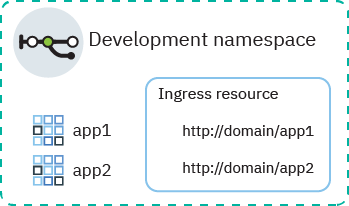
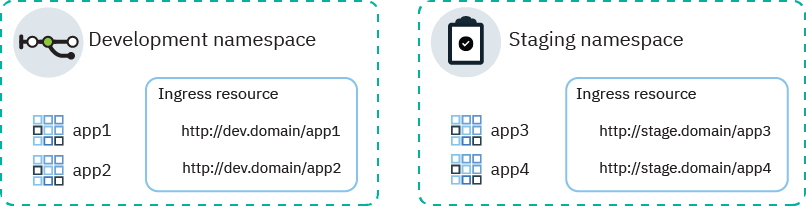

---

copyright:
  years: 2014, 2019
lastupdated: "2019-10-16"

keywords: kubernetes, iks, nginx, ingress controller

subcollection: containers

---

{:new_window: target="_blank"}
{:shortdesc: .shortdesc}
{:screen: .screen}
{:pre: .pre}
{:table: .aria-labeledby="caption"}
{:codeblock: .codeblock}
{:tip: .tip}
{:note: .note}
{:important: .important}
{:deprecated: .deprecated}
{:download: .download}
{:preview: .preview}


# Setting up Ingress
{: #ingress}

Expose multiple apps in your Kubernetes cluster by creating Ingress resources that are managed by the IBM-provided application load balancer in {{site.data.keyword.containerlong}}.
{:shortdesc}

## Sample YAMLs
{: #sample_ingress}

Use these sample YAML files to quickly get started with specifying your Ingress resource.
{: shortdesc}

**Ingress resource to publicly expose an app**</br>

Have you already completed the following?
- Deploy app
- Create app service
- Select domain name and TLS secret

You can use the following deployment YAML to create an Ingress resource:

```
apiVersion: extensions/v1beta1
kind: Ingress
metadata:
  name: myingressresource
spec:
  tls:
  - hosts:
    - <domain>
    secretName: <tls_secret_name>
  rules:
  - host: <domain>
    http:
      paths:
      - path: /<app1_path>
        backend:
          serviceName: <app1_service>
          servicePort: 80
      - path: /<app2_path>
        backend:
          serviceName: <app2_service>
          servicePort: 80
```
{: codeblock}

</br>

**Ingress resource to privately expose an app**</br>

Have you already completed the following?
- Enable private ALB
- Deploy app
- Create app service
- Register custom domain name and TLS secret

You can use the following deployment YAML to create an Ingress resource:

```
apiVersion: extensions/v1beta1
kind: Ingress
metadata:
  name: myingressresource
  annotations:
    ingress.bluemix.net/ALB-ID: "<private_ALB_ID_1>;<private_ALB_ID_2>"
spec:
  tls:
  - hosts:
    - <domain>
    secretName: <tls_secret_name>
  rules:
  - host: <domain>
    http:
      paths:
      - path: /<app1_path>
        backend:
          serviceName: <app1_service>
          servicePort: 80
      - path: /<app2_path>
        backend:
          serviceName: <app2_service>
          servicePort: 80
```
{: codeblock}

<br />


## Prerequisites
{: #config_prereqs}

Before you get started with Ingress, review the following prerequisites.
{:shortdesc}

- Setting up Ingress requires the following [{{site.data.keyword.cloud_notm}} IAM roles](/docs/containers?topic=containers-users#platform):
    - **Administrator** platform role for the cluster
    - **Manager** service role in all namespaces
- Ingress is available for standard clusters only and requires at least two worker nodes per zone to ensure high availability and that periodic updates are applied. If you have only one worker in a zone, the ALB cannot receive automatic updates. When automatic updates are rolled out to ALB pods, the pod is reloaded. However, ALB pods have anti-affinity rules to ensure that only one pod is scheduled to each worker node for high availability. Because there is only one ALB pod on one worker, the pod is not restarted so that traffic is not interrupted. The ALB pod is updated to the latest version only when you delete the old pod manually so that the new, updated pod can be scheduled.
- If a zone fails, you might see intermittent failures in requests to the Ingress ALB in that zone.
- If you restrict network traffic to edge worker nodes, ensure that at least two [edge worker nodes](/docs/containers?topic=containers-edge) are enabled in each zone so that ALBs deploy uniformly.
* Classic clusters: Enable a [Virtual Router Function (VRF)](/docs/infrastructure/direct-link?topic=direct-link-overview-of-virtual-routing-and-forwarding-vrf-on-ibm-cloud#overview-of-virtual-routing-and-forwarding-vrf-on-ibm-cloud) for your IBM Cloud infrastructure account. To enable VRF, [contact your IBM Cloud infrastructure account representative](/docs/infrastructure/direct-link?topic=direct-link-overview-of-virtual-routing-and-forwarding-vrf-on-ibm-cloud#how-you-can-initiate-the-conversion). To check whether a VRF is already enabled, use the `ibmcloud account show` command. If you cannot or do not want to enable VRF, enable [VLAN spanning](/docs/infrastructure/vlans?topic=vlans-vlan-spanning#vlan-spanning). When a VRF or VLAN spanning is enabled, the NLB 2.0 can route packets to various subnets in the account.

<br />


## Planning networking for single or multiple namespaces
{: #multiple_namespaces}

One Ingress resource is required per namespace where you have apps that you want to expose.
{:shortdesc}

### All apps are in one namespace
{: #one-ns}

If the apps in your cluster are all in the same namespace, one Ingress resource is required to define routing rules for the apps that are exposed there. For example, if you have `app1` and `app2` exposed by services in a development namespace, you can create an Ingress resource in the namespace. The resource specifies `domain.net` as the host and registers the paths that each app listens on with `domain.net`.
{: shortdesc}



### Apps are in multiple namespaces
{: #multi-ns}

If the apps in your cluster are in different namespaces, you must create one resource per namespace to define rules for the apps that are exposed there.
{: shortdesc}

However, you can define a hostname in only one resource. You cannot define the same hostname in multiple resources. To register multiple Ingress resources with the same hostname, you must use a wildcard domain. When a wildcard domain such as `*.domain.net` is registered, multiple subdomains can all resolve to the same host. Then, you can create an Ingress resource in each namespace and specify a different subdomain in each Ingress resource.

For example, consider the following scenario:
* You have two versions of the same app, `app1` and `app3`, for testing purposes.
* You deploy the apps in two different namespaces within the same cluster: `app1` into the development namespace, and `app3` into the staging namespace.

To use the same cluster ALB to manage traffic to these apps, you create the following services and resources:
* A Kubernetes service in the development namespace to expose `app1`.
* An Ingress resource in the development namespace that specifies the host as `dev.domain.net`.
* A Kubernetes service in the staging namespace to expose `app3`.
* An Ingress resource in the staging namespace that specifies the host as `stage.domain.net`.
</br>


Now, both URLs resolve to the same domain and are thus both serviced by the same ALB. However, because the resource in the staging namespace is registered with the `stage` subdomain, the Ingress ALB correctly routes requests from the `stage.domain.net/app3` URL to only `app3`.

{: #wildcard_tls}
The IBM-provided Ingress subdomain wildcard, `*.<cluster_name>.<region>.containers.appdomain.cloud`, is registered by default for your cluster. The IBM-provided TLS certificate is a wildcard certificate and can be used for the wildcard subdomain. If you want to use a custom domain, you must register the custom domain as a wildcard domain such as `*.custom_domain.net`. To use TLS, you must get a wildcard certificate.
{: note}

### Multiple domains within a namespace
{: #multi-domains}

Within an individual namespace, you can use one domain to access all the apps in the namespace. If you want to use different domains for the apps within an individual namespace, use a wildcard domain. When a wildcard domain such as `*.mycluster.us-south.containers.appdomain.cloud` is registered, multiple subdomains all resolve to the same host. Then, you can use one resource to specify multiple subdomain hosts within that resource. Alternatively, you can create multiple Ingress resources in the namespace and specify a different subdomain in each Ingress resource.
{: shortdesc}


The IBM-provided Ingress subdomain wildcard, `*.<cluster_name>.<region>.containers.appdomain.cloud`, is registered by default for your cluster. The IBM-provided TLS certificate is a wildcard certificate and can be used for the wildcard subdomain. If you want to use a custom domain, you must register the custom domain as a wildcard domain such as `*.custom_domain.net`. To use TLS, you must get a wildcard certificate.
{: note}

<br />


## Exposing apps that are inside your cluster to the public
{: #ingress_expose_public}

Expose apps that are inside your cluster to the public by using the public Ingress ALB.
{:shortdesc}

Before you begin:

* Review the Ingress [prerequisites](#config_prereqs).
* [Log in to your account. If applicable, target the appropriate resource group. Set the context for your cluster.](/docs/containers?topic=containers-cs_cli_install#cs_cli_configure)

### Step 1: Deploy apps and create app services
{: #public_inside_1}

Start by deploying your apps and creating Kubernetes services to expose them.
{: shortdesc}

1.  [Deploy your app to the cluster](/docs/containers?topic=containers-app#app_cli). Ensure that you add a label to your deployment in the metadata section of your configuration file, such as `app: code`. This label is needed to identify all pods where your app runs so that the pods can be included in the Ingress load balancing.

2.   Create a Kubernetes service for each app that you want to expose. Your app must be exposed by a Kubernetes service to be included by the cluster ALB in the Ingress load balancing.
      1.  Open your preferred editor and create a service configuration file that is named, for example, `myappservice.yaml`.
      2.  Define a service for the app that the ALB will expose.

          ```
          apiVersion: v1
          kind: Service
          metadata:
            name: myappservice
          spec:
            selector:
              <selector_key>: <selector_value>
            ports:
             - protocol: TCP
               port: 8080
          ```
          {: codeblock}

          <table>
          <thead>
          <th colspan=2> Understanding the ALB service YAML file components</th>
          </thead>
          <tbody>
          <tr>
          <td><code>selector</code></td>
          <td>Enter the label key (<em>&lt;selector_key&gt;</em>) and value (<em>&lt;selector_value&gt;</em>) pair that you want to use to target the pods where your app runs. To target your pods and include them in the service load balancing, ensure that the <em>&lt;selector_key&gt;</em> and <em>&lt;selector_value&gt;</em> are the same as the key/value pair in the <code>spec.template.metadata.labels</code> section of your deployment YAML.</td>
           </tr>
           <tr>
           <td><code>port</code></td>
           <td>The port that the service listens on.</td>
           </tr>
           </tbody></table>
      3.  Save your changes.
      4.  Create the service in your cluster. If apps are deployed in multiple namespaces in your cluster, ensure that the service deploys into the same namespace as the app that you want to expose.

          ```
          kubectl apply -f myappservice.yaml [-n <namespace>]
          ```
          {: pre}
      5.  Repeat these steps for every app that you want to expose.


### Step 2: Select an app domain
{: #public_inside_2}

When you configure the public ALB, you choose the domain that your apps will be accessible through.
{: shortdesc}

You can use the IBM-provided domain, such as `mycluster-12345.us-south.containers.appdomain.cloud/myapp`, to access your app from the internet. To use a custom domain instead, you can set up a CNAME record to map your custom domain to the IBM-provided domain or set up an A record with your DNS provider that uses the ALB's public IP address.

**To use the IBM-provided Ingress domain:**

Get the IBM-provided domain. Replace `<cluster_name_or_ID>` with the name of the cluster where the app is deployed.
```
ibmcloud ks cluster get --cluster <cluster_name_or_ID> | grep Ingress
```
{: pre}

Example output:
```
Ingress Subdomain:      mycluster-12345.us-south.containers.appdomain.cloud
Ingress Secret:         <tls_secret>
```
{: screen}

**To use a custom domain:**
1.    Create a custom domain. To register your custom domain, work with your Domain Name Service (DNS) provider or [{{site.data.keyword.cloud_notm}} DNS](/docs/infrastructure/dns?topic=dns-getting-started). If the apps that you want Ingress to expose are in different namespaces in one cluster, register the custom domain as a wildcard domain, such as `*.custom_domain.net`. Note that domains are limited to 255 characters or fewer.

2.  Define an alias for your custom domain by specifying the IBM-provided domain as a Canonical Name record (CNAME). To find the IBM-provided Ingress domain, run `ibmcloud ks cluster get --cluster <cluster_name>` and look for the **Ingress subdomain** field.

### Step 3: Select TLS termination
{: #public_inside_3}

After you choose the app domain, you choose whether to use TLS termination.
{: shortdesc}

The ALB load balances HTTP network traffic to the apps in your cluster. To also load balance incoming HTTPS connections, you can configure the ALB to decrypt the network traffic and forward the decrypted request to the apps that are exposed in your cluster.

* If you use the IBM-provided Ingress subdomain, you can use the IBM-provided TLS certificate, which is stored as a Kubernetes secret in the `default` namespace. IBM-provided TLS certificates are signed by LetsEncrypt and are fully managed by IBM. The certificates expire every 90 days and are automatically renewed 37 days before they expire. For more information about wildcard TLS certification, see [this note](#wildcard_tls).
* If you use a custom domain, you can use your own TLS certificate to manage TLS termination. The ALB first checks for a secret in the namespace that the app is in, then in `default`, and finally in `ibm-cert-store`. If you have apps in one namespace only, you can import or create a TLS secret for the certificate in that same namespace. If you have apps in multiple namespaces, import or create a TLS secret for the certificate in the `default` namespace so that the ALB can access and use the certificate in every namespace. In the Ingress resources that you define for each namespace, specify the name of the secret that is in the default namespace. For more information about wildcard TLS certification, see [this note](#wildcard_tls). **Note**: TLS certificates that contain pre-shared keys (TLS-PSK) are not supported.

**If you use the IBM-provided Ingress domain:**

Get the IBM-provided TLS secret for your cluster.
```
ibmcloud ks cluster get --cluster <cluster_name_or_ID> | grep Ingress
```
{: pre}

Example output:
```
Ingress Subdomain:      mycluster-12345.us-south.containers.appdomain.cloud
Ingress Secret:         <tls_secret>
```
{: screen}
</br>

**If you use a custom domain:**

If a TLS certificate is stored in {{site.data.keyword.cloudcerts_long_notm}} that you want to use, you can import its associated secret into your cluster by running the following command:

```
ibmcloud ks alb cert deploy --secret-name <secret_name> --cluster <cluster_name_or_ID> --cert-crn <certificate_crn>
```
{: pre}

Make sure that you do not create the secret with the same name as the IBM-provided Ingress secret. You can get the name of the IBM-provided Ingress secret by running `ibmcloud ks cluster get --cluster <cluster_name_or_ID> | grep Ingress`.
{: note}

When you import a certificate with this command, the certificate secret is created in a namespace called `ibm-cert-store`. A reference to this secret is then created in the `default` namespace, which any Ingress resource in any namespace can access. When the ALB is processing requests, it follows this reference to pick up and use the certificate secret from the `ibm-cert-store` namespace.

</br>

If you do not have a TLS certificate ready, follow these steps:
1. Generate a certificate authority (CA) cert and key from your certificate provider. If you have your own domain, purchase an official TLS certificate for your domain. Make sure the [CN ](https://support.dnsimple.com/articles/what-is-common-name/) is different for each certificate.
2. Convert the cert and key into base-64.
   1. Encode the cert and key into base-64 and save the base-64 encoded value in a new file.
      ```
      openssl base64 -in tls.key -out tls.key.base64
      ```
      {: pre}

   2. View the base-64 encoded value for your cert and key.
      ```
      cat tls.key.base64
      ```
      {: pre}

3. Create a secret YAML file using the cert and key.
     ```
     apiVersion: v1
     kind: Secret
     metadata:
       name: ssl-my-test
     type: Opaque
     data:
       tls.crt: <client_certificate>
       tls.key: <client_key>
     ```
     {: codeblock}

4. Create the certificate as a Kubernetes secret.
     ```
     kubectl apply -f ssl-my-test
     ```
     {: pre}
     Make sure that you do not create the secret with the same name as the IBM-provided Ingress secret. You can get the name of the IBM-provided Ingress secret by running `ibmcloud ks cluster get --cluster <cluster_name_or_ID> | grep Ingress`.
     {: note}


### Step 4: Create the Ingress resource
{: #public_inside_4}

Ingress resources define the routing rules that the ALB uses to route traffic to your app service.
{: shortdesc}

If your cluster has multiple namespaces where apps are exposed, one Ingress resource is required per namespace. However, each namespace must use a different host. You must register a wildcard domain and specify a different subdomain in each resource. For more information, see [Planning networking for single or multiple namespaces](#multiple_namespaces).
{: note}

1. Open your preferred editor and create an Ingress configuration file that is named, for example, `myingressresource.yaml`.

2. Define an Ingress resource in your configuration file that uses the IBM-provided domain or your custom domain to route incoming network traffic to the services that you created earlier.

    Example YAML that does not use TLS:
    ```
    apiVersion: extensions/v1beta1
    kind: Ingress
    metadata:
      name: myingressresource
    spec:
      rules:
      - host: <domain>
        http:
          paths:
          - path: /<app1_path>
            backend:
              serviceName: <app1_service>
              servicePort: 80
          - path: /<app2_path>
            backend:
              serviceName: <app2_service>
              servicePort: 80
    ```
    {: codeblock}

    Example YAML that uses TLS:
    ```
    apiVersion: extensions/v1beta1
    kind: Ingress
    metadata:
      name: myingressresource
    spec:
      tls:
      - hosts:
        - <domain>
        secretName: <tls_secret_name>
      rules:
      - host: <domain>
        http:
          paths:
          - path: /<app1_path>
            backend:
              serviceName: <app1_service>
              servicePort: 80
          - path: /<app2_path>
            backend:
              serviceName: <app2_service>
              servicePort: 80
    ```
    {: codeblock}

    <table>
    <thead>
    <th colspan=2> Understanding the YAML file components</th>
    </thead>
    <tbody>
    <tr>
    <td><code>tls.hosts</code></td>
    <td>To use TLS, replace <em>&lt;domain&gt;</em> with the IBM-provided Ingress subdomain or your custom domain.

    </br></br>
    <strong>Note:</strong><ul><li>If your apps are exposed by services in different namespaces in one cluster, append a wildcard subdomain to the beginning of the domain, such as `subdomain1.custom_domain.net` or `subdomain1.mycluster.us-south.containers.appdomain.cloud`. Use a unique subdomain for each resource that you create in the cluster.</li><li>Do not use &ast; for your host or leave the host property empty to avoid failures during Ingress creation.</li></ul></td>
    </tr>
    <tr>
    <td><code>tls.secretName</code></td>
    <td><ul><li>If you use the IBM-provided Ingress domain, replace <em>&lt;tls_secret_name&gt;</em> with the name of the IBM-provided Ingress secret.</li><li>If you use a custom domain, replace <em>&lt;tls_secret_name&gt;</em> with the secret that you created earlier that holds your custom TLS certificate and key. If you imported a certificate from {{site.data.keyword.cloudcerts_short}}, you can run <code>ibmcloud ks alb cert get --cluster <cluster_name_or_ID> --cert-crn <certificate_crn></code> to see the secrets that are associated with a TLS certificate.</li><ul><td>
    </tr>
    <tr>
    <td><code>host</code></td>
    <td>Replace <em>&lt;domain&gt;</em> with the IBM-provided Ingress subdomain or your custom domain.

    </br></br>
    <strong>Note:</strong><ul><li>If your apps are exposed by services in different namespaces in one cluster, append a wildcard subdomain to the beginning of the domain, such as `subdomain1.custom_domain.net` or `subdomain1.mycluster.us-south.containers.appdomain.cloud`. Use a unique subdomain for each resource that you create in the cluster.</li><li>Do not use &ast; for your host or leave the host property empty to avoid failures during Ingress creation.</li></ul></td>
    </tr>
    <tr>
    <td><code>path</code></td>
    <td>Replace <em>&lt;app_path&gt;</em> with a slash or the path that your app is listening on. The path is appended to the IBM-provided or your custom domain to create a unique route to your app. When you enter this route into a web browser, network traffic is routed to the ALB. The ALB looks up the associated service and sends network traffic to the service. The service then forwards the traffic to the pods where the app runs.
    </br></br>
    Many apps do not listen on a specific path, but use the root path and a specific port. In this case, define the root path as <code>/</code> and do not specify an individual path for your app. Examples: <ul><li>For <code>http://domain/</code>, enter <code>/</code> as the path.</li><li>For <code>http://domain/app1_path</code>, enter <code>/app1_path</code> as the path.</li></ul>
    <p class="tip">To configure Ingress to listen on a path that is different than the path that your app listens on, you can use the [rewrite annotation](/docs/containers?topic=containers-ingress_annotation#rewrite-path).</p></td>
    </tr>
    <tr>
    <td><code>serviceName</code></td>
    <td>Replace <em>&lt;app1_service&gt;</em> and <em>&lt;app2_service&gt;</em>, and so on, with the name of the services you created to expose your apps. If your apps are exposed by services in different namespaces in the cluster, include only app services that are in the same namespace. You must create one Ingress resource for each namespace where you have apps that you want to expose.</td>
    </tr>
    <tr>
    <td><code>servicePort</code></td>
    <td>The port that your service listens to. Use the same port that you defined when you created the Kubernetes service for your app.</td>
    </tr>
    </tbody></table>

3.  Create the Ingress resource for your cluster. Ensure that the resource deploys into the same namespace as the app services that you specified in the resource.

    ```
    kubectl apply -f myingressresource.yaml -n <namespace>
    ```
    {: pre}
4.   Verify that the Ingress resource was created successfully.

      ```
      kubectl describe ingress myingressresource
      ```
      {: pre}

      1. If messages in the events describe an error in your resource configuration, change the values in your resource file and reapply the file for the resource.


Your Ingress resource is created in the same namespace as your app services. Your apps in this namespace are registered with the cluster's Ingress ALB.

### Step 5: Access your app from the internet
{: #public_inside_5}

In a web browser, enter the URL of the app service to access.
{: shortdesc}

```
https://<domain>/<app1_path>
```
{: codeblock}

If you exposed multiple apps, access those apps by changing the path that is appended to the URL.

```
https://<domain>/<app2_path>
```
{: codeblock}

If you use a wildcard domain to expose apps in different namespaces, access those apps with their own subdomains.

```
http://<subdomain1>.<domain>/<app1_path>
```
{: codeblock}

```
http://<subdomain2>.<domain>/<app1_path>
```
{: codeblock}


Having trouble connecting to your app through Ingress? Try [debugging Ingress](/docs/containers?topic=containers-cs_troubleshoot_debug_ingress).
{: tip}

<br />


## Exposing apps that are outside your cluster to the public
{: #external_endpoint}

Expose apps that are outside your cluster to the public by including them in public Ingress ALB load balancing. Incoming public requests on the IBM-provided or your custom domain are forwarded automatically to the external app.
{: shortdesc}

Before you begin:

* Review the Ingress [prerequisites](#config_prereqs).
* Ensure that the external app that you want to include into the cluster load balancing can be accessed by using a public IP address.
* VPC clusters: In order to forward requests to the public external endpoint of your app, your VPC subnets must have a public gateway attached.
* [Log in to your account. If applicable, target the appropriate resource group. Set the context for your cluster.](/docs/containers?topic=containers-cs_cli_install#cs_cli_configure)

To expose apps that are outside your cluster to the public:

1.  Create a Kubernetes service for your cluster that will forward incoming requests to an external endpoint that you will create.
    1.  Open your preferred editor and create a service configuration file that is named, for example, `myexternalservice.yaml`.
    2.  Define a service for the app that the ALB will expose.

        ```
        apiVersion: v1
        kind: Service
        metadata:
          name: myexternalservice
        spec:
          ports:
           - protocol: TCP
             port: 8080
        ```
        {: codeblock}

        <table>
        <caption>Understanding the ALB service file components</caption>
        <thead>
        <th colspan=2> Understanding the YAML file components</th>
        </thead>
        <tbody>
        <tr>
        <td><code>metadata.name</code></td>
        <td>Replace <em><code>&lt;myexternalservice&gt;</code></em> with a name for your service.<p>Learn more about [securing your personal information](/docs/containers?topic=containers-security#pi) when you work with Kubernetes resources.</p></td>
        </tr>
        <tr>
        <td><code>port</code></td>
        <td>The port that the service listens on.</td>
        </tr></tbody></table>

    3.  Save your changes.
    4.  Create the Kubernetes service for your cluster.

        ```
        kubectl apply -f myexternalservice.yaml
        ```
        {: pre}
2.  Configure a Kubernetes endpoint that defines the external location of the app that you want to include into the cluster load balancing.
    1.  Open your preferred editor and create an endpoint configuration file that is named, for example, `myexternalendpoint.yaml`.
    2.  Define your external endpoint. Include all public IP addresses and ports that you can use to access your external app.

        ```
        kind: Endpoints
        apiVersion: v1
        metadata:
          name: myexternalservice
        subsets:
          - addresses:
              - ip: <external_IP1>
              - ip: <external_IP2>
            ports:
              - port: <external_port>
        ```
        {: codeblock}

        <table>
        <thead>
        <th colspan=2> Understanding the YAML file components</th>
        </thead>
        <tbody>
        <tr>
        <td><code>name</code></td>
        <td>Replace <em><code>&lt;myexternalendpoint&gt;</code></em> with the name of the Kubernetes service that you created earlier.</td>
        </tr>
        <tr>
        <td><code>ip</code></td>
        <td>Replace <em>&lt;external_IP&gt;</em> with the public IP addresses to connect to your external app.</td>
         </tr>
         <td><code>port</code></td>
         <td>Replace <em>&lt;external_port&gt;</em> with the port that your external app listens to.</td>
         </tbody></table>

    3.  Save your changes.
    4.  Create the Kubernetes endpoint for your cluster.

        ```
        kubectl apply -f myexternalendpoint.yaml
        ```
        {: pre}

3. Continue with the steps in "Exposing apps that are inside your cluster to the public", [Step 2: Select an app domain](#public_inside_2).

<br />


## Classic clusters: Exposing apps to a private network
{: #ingress_expose_private}

Expose apps to a private network by using the private Ingress ALBs in a classic cluster.
{:shortdesc}

To use a private ALB, you must first enable the private ALB. Because private VLAN-only classic clusters are not assigned an IBM-provided Ingress subdomain, no Ingress secret is created during cluster setup. To expose your apps to the private network, you must register your ALB with a custom domain and, optionally, import your own TLS certificate.

Before you begin:
* Review the Ingress [prerequisites](#config_prereqs).
* If you have a classic cluster with worker nodes that are connected to [a private VLAN only](/docs/containers?topic=containers-cs_network_planning#plan_private_vlan) you must configure a [DNS service that is available on the private network ](https://kubernetes.io/docs/tasks/administer-cluster/dns-custom-nameservers/).

### Step 1: Deploy apps and create app services
{: #private_1}

Start by deploying your apps and creating Kubernetes services to expose them.
{: shortdesc}

1.  [Deploy your app to the cluster](/docs/containers?topic=containers-app#app_cli). Ensure that you add a label to your deployment in the metadata section of your configuration file, such as `app: code`. This label is needed to identify all pods where your app runs so that the pods can be included in the Ingress load balancing.

2.   Create a Kubernetes service for each app that you want to expose. Your app must be exposed by a Kubernetes service to be included by the cluster ALB in the Ingress load balancing.
      1.  Open your preferred editor and create a service configuration file that is named, for example, `myappservice.yaml`.
      2.  Define a service for the app that the ALB will expose.

          ```
          apiVersion: v1
          kind: Service
          metadata:
            name: myappservice
          spec:
            selector:
              <selector_key>: <selector_value>
            ports:
             - protocol: TCP
               port: 8080
          ```
          {: codeblock}

          <table>
          <thead>
          <th colspan=2> Understanding the ALB service YAML file components</th>
          </thead>
          <tbody>
          <tr>
          <td><code>selector</code></td>
          <td>Enter the label key (<em>&lt;selector_key&gt;</em>) and value (<em>&lt;selector_value&gt;</em>) pair that you want to use to target the pods where your app runs. To target your pods and include them in the service load balancing, ensure that the <em>&lt;selector_key&gt;</em> and <em>&lt;selector_value&gt;</em> are the same as the key/value pair in the <code>spec.template.metadata.labels</code> section of your deployment YAML.</td>
           </tr>
           <tr>
           <td><code>port</code></td>
           <td>The port that the service listens on.</td>
           </tr>
           </tbody></table>
      3.  Save your changes.
      4.  Create the service in your cluster. If apps are deployed in multiple namespaces in your cluster, ensure that the service deploys into the same namespace as the app that you want to expose.

          ```
          kubectl apply -f myappservice.yaml [-n <namespace>]
          ```
          {: pre}
      5.  Repeat these steps for every app that you want to expose.


</br>

### Step 2: Enable the default private ALB
{: #private_ingress}

When you create a standard cluster, a private ALB is created in each zone that you have worker nodes and assigned a private IP address. However, the default private ALB in each zone is not automatically enabled. You must first enable each private ALB.
{:shortdesc}

1. Get the private ALB IDs for your cluster.
    ```
    ibmcloud ks alb ls --cluster <cluster_name>
    ```
    {: pre}

    The field **Status** for private ALBs is _disabled_.
    ```
    ALB ID                                            Enabled   Status     Type      ALB IP          Zone    Build                          ALB VLAN ID   NLB Version
    private-crdf253b6025d64944ab99ed63bb4567b6-alb1   false     disabled   private   -               dal10   ingress:411/ingress-auth:315   2234947       -
    public-crdf253b6025d64944ab99ed63bb4567b6-alb1    true      enabled    public    169.xx.xxx.xxx  dal10   ingress:411/ingress-auth:315   2234945       -
    ```
    {: screen}

2. Enable the private ALBs. Run this command for the ID of each private ALB that you want to enable. If you want to specify an IP address for the ALB, include the IP address in the `--user-ip` flag.
  ```
  ibmcloud ks alb configure vpc-classic --alb-id <private_ALB_ID> --enable
  ```
  {: pre}
  </br>

### Step 3: Map your custom domain
{: #private_3}

When you configure the private ALBs, you must expose your apps by using a custom domain.
{: shortdesc}

**Private VLAN-only classic clusters:**

1. Configure your own [DNS service that is available on your private network ](https://kubernetes.io/docs/tasks/administer-cluster/dns-custom-nameservers/).
2. Create a custom domain through your DNS provider. If the apps that you want Ingress to expose are in different namespaces in one cluster, register the custom domain as a wildcard domain, such as `*.custom_domain.net`.
3. Using your private DNS service, map your custom domain to the portable private IP addresses of the ALBs by adding the IP addresses as A records. To find the portable private IP addresses of the ALBs, run `ibmcloud ks alb get --alb-id <private_alb_ID>` for each ALB. </br>

**Private and public VLAN classic clusters:**

1.    Create a custom domain. To register your custom domain, work with your Domain Name Service (DNS) provider or [{{site.data.keyword.cloud_notm}} DNS](/docs/infrastructure/dns?topic=dns-getting-started). If the apps that you want Ingress to expose are in different namespaces in one cluster, register the custom domain as a wildcard domain, such as `*.custom_domain.net`. Note that domains are limited to 255 characters or fewer.

2.  Map your custom domain to the portable private IP addresses of the ALBs by adding the IP addresses as A records. To find the portable private IP addresses of the ALBs, run `ibmcloud ks alb get --alb-id  <private_alb_ID>` for each ALB.
</br>

### Step 4: Select TLS termination
{: #private_4}

After you map your custom domain, choose whether to use TLS termination.
{: shortdesc}

The ALB load balances HTTP network traffic to the apps in your cluster. To also load balance incoming HTTPS connections, you can configure the ALB to decrypt the network traffic and forward the decrypted request to the apps that are exposed in your cluster.

Because private VLAN-only clusters are not assigned an IBM-provided Ingress domain, no Ingress secret is created during the cluster setup. You can use your own TLS certificate to manage TLS termination.  The ALB first checks for a secret in the namespace that the app is in, then in `default`, and finally in `ibm-cert-store`. If you have apps in one namespace only, you can import or create a TLS secret for the certificate in that same namespace. If you have apps in multiple namespaces, import or create a TLS secret for the certificate in the `default` namespace so that the ALB can access and use the certificate in every namespace. In the Ingress resources that you define for each namespace, specify the name of the secret that is in the default namespace. For more information about wildcard TLS certification, see [this note](#wildcard_tls). **Note**: TLS certificates that contain pre-shared keys (TLS-PSK) are not supported.

If a TLS certificate is stored in {{site.data.keyword.cloudcerts_long_notm}} that you want to use, you can import its associated secret into your cluster by running the following command:

```
ibmcloud ks alb cert deploy --secret-name <secret_name> --cluster <cluster_name_or_ID> --cert-crn <certificate_crn>
```
{: pre}

When you import a certificate with this command, the certificate secret is created in a namespace called `ibm-cert-store`. A reference to this secret is then created in the `default` namespace, which any Ingress resource in any namespace can access. When the ALB is processing requests, it follows this reference to pick up and use the certificate secret from the `ibm-cert-store` namespace.
</br>

### Step 5: Create the Ingress resource
{: #private_5}

Ingress resources define the routing rules that the ALB uses to route traffic to your app service.
{: shortdesc}

If your cluster has multiple namespaces where apps are exposed, one Ingress resource is required per namespace. However, each namespace must use a different host. You must register a wildcard domain and specify a different subdomain in each resource. For more information, see [Planning networking for single or multiple namespaces](#multiple_namespaces).
{: note}

1. Open your preferred editor and create an Ingress configuration file that is named, for example, `myingressresource.yaml`.

2.  Define an Ingress resource in your configuration file that uses your custom domain to route incoming network traffic to the services that you created earlier.

    Example YAML that does not use TLS:
    ```
    apiVersion: extensions/v1beta1
    kind: Ingress
    metadata:
      name: myingressresource
      annotations:
        ingress.bluemix.net/ALB-ID: "<private_ALB_ID_1>;<private_ALB_ID_2>"
    spec:
      rules:
      - host: <domain>
        http:
          paths:
          - path: /<app1_path>
            backend:
              serviceName: <app1_service>
              servicePort: 80
          - path: /<app2_path>
            backend:
              serviceName: <app2_service>
              servicePort: 80
    ```
    {: codeblock}

    Example YAML that uses TLS:
    ```
    apiVersion: extensions/v1beta1
    kind: Ingress
    metadata:
      name: myingressresource
      annotations:
        ingress.bluemix.net/ALB-ID: "<private_ALB_ID_1>;<private_ALB_ID_2>"
    spec:
      tls:
      - hosts:
        - <domain>
        secretName: <tls_secret_name>
      rules:
      - host: <domain>
        http:
          paths:
          - path: /<app1_path>
            backend:
              serviceName: <app1_service>
              servicePort: 80
          - path: /<app2_path>
            backend:
              serviceName: <app2_service>
              servicePort: 80
    ```
    {: codeblock}

    <table>
    <thead>
    <th colspan=2> Understanding the YAML file components</th>
    </thead>
    <tbody>
    <tr>
    <td><code>ingress.bluemix.net/ALB-ID</code></td>
    <td>Replace <em>&lt;private_ALB_ID&gt;</em> with the ID for your private ALB. If you have a multizone cluster and enabled multiple private ALBs, include the ID of each ALB. Run <code>ibmcloud ks alb ls --cluster <my_cluster></code> to find the ALB IDs. For more information about this Ingress annotation, see [Private application load balancer routing](/docs/containers?topic=containers-ingress_annotation#alb-id).</td>
    </tr>
    <tr>
    <td><code>tls.hosts</code></td>
    <td>To use TLS, replace <em>&lt;domain&gt;</em> with your custom domain.</br></br><strong>Note:</strong><ul><li>If your apps are exposed by services in different namespaces in one cluster, append a wildcard subdomain to the beginning of the domain, such as `subdomain1.custom_domain.net`. Use a unique subdomain for each resource that you create in the cluster.</li><li>Do not use &ast; for your host or leave the host property empty to avoid failures during Ingress creation.</li></ul></td>
    </tr>
    <tr>
    <td><code>tls.secretName</code></td>
    <td>Replace <em>&lt;tls_secret_name&gt;</em> with the name of the secret that you created earlier and that holds your custom TLS certificate and key. If you imported a certificate from {{site.data.keyword.cloudcerts_short}}, you can run <code>ibmcloud ks alb cert get --cluster <cluster_name_or_ID> --cert-crn <certificate_crn></code> to see the secrets that are associated with a TLS certificate.
    </tr>
    <tr>
    <td><code>host</code></td>
    <td>Replace <em>&lt;domain&gt;</em> with your custom domain.
    </br></br>
    <strong>Note:</strong><ul><li>If your apps are exposed by services in different namespaces in one cluster, append a wildcard subdomain to the beginning of the domain, such as `subdomain1.custom_domain.net`. Use a unique subdomain for each resource that you create in the cluster.</li><li>Do not use &ast; for your host or leave the host property empty to avoid failures during Ingress creation.</li></ul></td>
    </td>
    </tr>
    <tr>
    <td><code>path</code></td>
    <td>Replace <em>&lt;app_path&gt;</em> with a slash or the path that your app is listening on. The path is appended to your custom domain to create a unique route to your app. When you enter this route into a web browser, network traffic is routed to the ALB. The ALB looks up the associated service and sends network traffic to the service. The service then forwards the traffic to the pods where the app runs.
    </br></br>
    Many apps do not listen on a specific path, but use the root path and a specific port. In this case, define the root path as <code>/</code> and do not specify an individual path for your app. Examples: <ul><li>For <code>http://domain/</code>, enter <code>/</code> as the path.</li><li>For <code>http://domain/app1_path</code>, enter <code>/app1_path</code> as the path.</li></ul>
    <p class="tip">To configure Ingress to listen on a path that is different than the path that your app listens on, you can use the [rewrite annotation](/docs/containers?topic=containers-ingress_annotation#rewrite-path).</p>
    </tr>
    <tr>
    <td><code>serviceName</code></td>
    <td>Replace <em>&lt;app1_service&gt;</em> and <em>&lt;app2_service&gt;</em>, and so on, with the name of the services you created to expose your apps. If your apps are exposed by services in different namespaces in the cluster, include only app services that are in the same namespace. You must create one Ingress resource for each namespace where you have apps that you want to expose.</td>
    </tr>
    <tr>
    <td><code>servicePort</code></td>
    <td>The port that your service listens to. Use the same port that you defined when you created the Kubernetes service for your app.</td>
    </tr>
    </tbody></table>

3.  Create the Ingress resource for your cluster. Ensure that the resource deploys into the same namespace as the app services that you specified in the resource.

    ```
    kubectl apply -f myingressresource.yaml -n <namespace>
    ```
    {: pre}
4.   Verify that the Ingress resource was created successfully.

      ```
      kubectl describe ingress myingressresource
      ```
      {: pre}

      1. If messages in the events describe an error in your resource configuration, change the values in your resource file and reapply the file for the resource.


Your Ingress resource is created in the same namespace as your app services. Your apps in this namespace are registered with the cluster's Ingress ALB.
</br>

### Step 6: Access your app from your private network
{: #private_6}

1. Before you can access your app, make sure that you can access a DNS service.
  * Public and private VLAN: To use the default external DNS provider, you must [configure edge nodes with public access](/docs/containers?topic=containers-edge#edge) and [configure a Virtual Router Appliance ](https://www.ibm.com/blogs/cloud-archive/2017/07/kubernetes-and-bluemix-container-based-workloads-part4/).
  * Private VLAN only: You must configure a [DNS service that is available on the private network ](https://kubernetes.io/docs/tasks/administer-cluster/dns-custom-nameservers/).

2. From within your private network firewall, enter the URL of the app service in a web browser.

```
https://<domain>/<app1_path>
```
{: codeblock}

If you exposed multiple apps, access those apps by changing the path that is appended to the URL.

```
https://<domain>/<app2_path>
```
{: codeblock}

If you use a wildcard domain to expose apps in different namespaces, access those apps with their own subdomains.

```
http://<subdomain1>.<domain>/<app1_path>
```
{: codeblock}

```
http://<subdomain2>.<domain>/<app1_path>
```
{: codeblock}


For a comprehensive tutorial on how to secure microservice-to-microservice communication across your clusters by using the private ALB with TLS, check out [this blog post ](https://medium.com/ibm-cloud/secure-microservice-to-microservice-communication-across-kubernetes-clusters-using-a-private-ecbe2a8d4fe2).
{: tip}

<br />


## VPC clusters: Exposing apps to a private network
{: #ingress_expose_vpc_private}

Expose apps to a private network by using the private Ingress ALBs in a VPC on Classic cluster.
{:shortdesc}

To use a private ALB, you must first enable the private ALB. Then, to expose your apps to the private network, you must create a DNS entry for your private ALB hostname.

Before you begin, review the Ingress [prerequisites](#config_prereqs).

### Step 1: Deploy apps and create app services
{: #vpc_private_1}

Start by deploying your apps and creating Kubernetes services to expose them.
{: shortdesc}

1.  [Deploy your app to the cluster](/docs/containers?topic=containers-app#app_cli). Ensure that you add a label to your deployment in the metadata section of your configuration file, such as `app: code`. This label is needed to identify all pods where your app runs so that the pods can be included in the Ingress load balancing.

2.   Create a Kubernetes service for each app that you want to expose. Your app must be exposed by a Kubernetes service to be included by the cluster ALB in the Ingress load balancing.
      1.  Open your preferred editor and create a service configuration file that is named, for example, `myappservice.yaml`.
      2.  Define a service for the app that the ALB will expose.

          ```
          apiVersion: v1
          kind: Service
          metadata:
            name: myappservice
          spec:
            selector:
              <selector_key>: <selector_value>
            ports:
             - protocol: TCP
               port: 8080
          ```
          {: codeblock}

          <table>
          <thead>
          <th colspan=2> Understanding the ALB service YAML file components</th>
          </thead>
          <tbody>
          <tr>
          <td><code>selector</code></td>
          <td>Enter the label key (<em>&lt;selector_key&gt;</em>) and value (<em>&lt;selector_value&gt;</em>) pair that you want to use to target the pods where your app runs. To target your pods and include them in the service load balancing, ensure that the <em>&lt;selector_key&gt;</em> and <em>&lt;selector_value&gt;</em> are the same as the key/value pair in the <code>spec.template.metadata.labels</code> section of your deployment YAML.</td>
           </tr>
           <tr>
           <td><code>port</code></td>
           <td>The port that the service listens on.</td>
           </tr>
           </tbody></table>
      3.  Save your changes.
      4.  Create the service in your cluster. If apps are deployed in multiple namespaces in your cluster, ensure that the service deploys into the same namespace as the app that you want to expose.

          ```
          kubectl apply -f myappservice.yaml [-n <namespace>]
          ```
          {: pre}
      5.  Repeat these steps for every app that you want to expose.


</br>

### Step 2: Enable the default private ALBs
{: #vpc_private_2}

When you create a standard cluster, a private ALB is created in each zone that you have worker nodes. However, the default private ALB in each zone is not automatically enabled. You must first enable each private ALB.
{:shortdesc}

1. Get the private ALB IDs for your cluster.
    ```
    ibmcloud ks alb ls --cluster <cluster_name>
    ```
    {: pre}

    The field **Status** for private ALBs is _disabled_.
    ```
    ALB ID                                Enabled    Status     Type      Load Balancer Hostname                 Zone         Build
    private-crbl25g33d0if1cmfn0p8g-alb1   false      disabled   private   -                                      us-south-1   ingress:524/ingress-auth:340
    private-crbl25g33d0if1cmfn0p8g-alb2   false      disabled   private   -                                      us-south-2   ingress:524/ingress-auth:340
    public-crbl25g33d0if1cmfn0p8g-alb1    true       enabled    public    0bcc2ab2-us-south.lb.appdomain.cloud   us-south-1   ingress:524/ingress-auth:340
    public-crbl25g33d0if1cmfn0p8g-alb2    true       enabled    public    0bcc2ab2-us-south.lb.appdomain.cloud   us-south-2   ingress:524/ingress-auth:340
    ```
    {: screen}

2. Enable the private ALBs. Run this command for the ID of each private ALB that you want to enable.
  ```
  ibmcloud ks alb configure vpc-classic --alb-id <private_ALB_ID> --enable
  ```
  {: pre}
  </br>

### Step 3: Create a subdomain to register the ALBs with a DNS entry and create an SSL certificate
{: #vpc_private_3}

When you enable the private ALBs, one private VPC load balancer is automatically created outside of your cluster in your VPC. The private VPC load balancer puts the private IP addresses of your private ALBs behind one hostname. You must create a DNS entry for this hostname by creating a subdomain. When you create the subdomain, {{site.data.keyword.cloud_notm}} also generates and maintains a wildcard SSL certificate for the subdomain for you.
{: shortdesc}

1. Get the hostname that is assigned to your private ALBs by the VPC load balancer. In the output, look for the **Load Balancer Hostname** field of your private ALBs.
  ```
  ibmcloud ks alb ls --cluster <cluster_name_or_ID>
  ```
  {: pre}

  Example output:
  ```
  ALB ID                                Enabled   Status    Type      Load Balancer Hostname                 Zone         Build
  private-crbl25g33d0if1cmfn0p8g-alb1   true      enabled   private   1234abcd-us-south.lb.appdomain.cloud   us-south-1   ingress:524/ingress-auth:340
  private-crbl25g33d0if1cmfn0p8g-alb2   true      enabled   private   1234abcd-us-south.lb.appdomain.cloud   us-south-2   ingress:524/ingress-auth:340
  ```
  {: screen}

2. Create a DNS subdomain for the private ALB hostname.
  ```
  ibmcloud ks nlb-dns create vpc-classic --cluster <cluster_name_or_id> --lb-host <vpc_lb_hostname>
  ```
  {: pre}

3. Verify that the subdomain is created.
  ```
  ibmcloud ks nlb-dns ls --cluster <cluster_name_or_id>
  ```
  {: pre}

  Example output:
  ```
  Subdomain                                                                               Load Balancer Hostname                        Health Monitor   SSL Cert Status           SSL Cert Secret Name
  mycluster-a1b2cdef345678g9hi012j3kl4567890-0001.us-south.containers.appdomain.cloud     ["1234abcd-us-south.lb.appdomain.cloud"]      None             created                   <certificate>
  ```
  {: screen}

4. Choose whether to use TLS termination for your ALBs. The ALB load balances HTTP network traffic to the apps in your cluster. To also load balance incoming HTTPS traffic, you can configure the ALB to decrypt the network traffic and forward the decrypted request to the apps that are exposed in your cluster. If you want to use TLS termination, note the name of the certificate in the output of the previous step.
</br>

### Step 4: Create the Ingress resource
{: #vpc_private_4}

Ingress resources define the routing rules that the ALB uses to route traffic to your app service.
{: shortdesc}

If your cluster has multiple namespaces where apps are exposed, one Ingress resource is required for each namespace. The Ingress resource determines the host that is appended to your app and that builds the URL to access your app. The Ingress host must be unique in each Ingress resource that you create. The DNS subdomain that you created in the previous step is registered as a wildcard domain. You can use this domain to build multiple Ingress hosts for your Ingress resource. For example, if your subdomain is `mycluster-a1b2cdef345678g9hi012j3kl4567890-0001.us-south.containers.appdomain.cloud`, you can build multiple Ingress hosts by prepending a custom value to the subdomain, such as `example1.mycluster-a1b2cdef345678g9hi012j3kl4567890-0001.us-south.containers.appdomain.cloud`.
{: note}

1. Open your preferred editor and create an Ingress configuration file that is named, for example, `myingressresource.yaml`.

2.  Define an Ingress resource in your configuration file that uses your custom domain to route incoming network traffic to the services that you created earlier.

    Example YAML that does not use TLS:
    ```
    apiVersion: extensions/v1beta1
    kind: Ingress
    metadata:
      name: myingressresource
      annotations:
        ingress.bluemix.net/ALB-ID: "<private_ALB_ID_1>;<private_ALB_ID_2>"
    spec:
      rules:
      - host: <domain>
        http:
          paths:
          - path: /<app1_path>
            backend:
              serviceName: <app1_service>
              servicePort: 80
          - path: /<app2_path>
            backend:
              serviceName: <app2_service>
              servicePort: 80
    ```
    {: codeblock}

    Example YAML that uses TLS:
    ```
    apiVersion: extensions/v1beta1
    kind: Ingress
    metadata:
      name: myingressresource
      annotations:
        ingress.bluemix.net/ALB-ID: "<private_ALB_ID_1>;<private_ALB_ID_2>"
    spec:
      tls:
      - hosts:
        - <domain>
        secretName: <tls_secret_name>
      rules:
      - host: <domain>
        http:
          paths:
          - path: /<app1_path>
            backend:
              serviceName: <app1_service>
              servicePort: 80
          - path: /<app2_path>
            backend:
              serviceName: <app2_service>
              servicePort: 80
    ```
    {: codeblock}

    <table>
    <thead>
    <th colspan=2> Understanding the YAML file components</th>
    </thead>
    <tbody>
    <tr>
    <td><code>ingress.bluemix.net/ALB-ID</code></td>
    <td>Replace <em>&lt;private_ALB_ID&gt;</em> with the ID for your private ALB. If you have a multizone cluster and enabled multiple private ALBs, include the ID of each ALB. Run <code>ibmcloud ks alb ls --cluster <my_cluster></code> to find the ALB IDs. For more information about this Ingress annotation, see [Private application load balancer routing](/docs/containers?topic=containers-ingress_annotation#alb-id).</td>
    </tr>
    <tr>
    <td><code>tls.hosts</code></td>
    <td>To use TLS, replace <em>&lt;domain&gt;</em> with your DNS subdomain.</br></br><strong>Note:</strong><ul><li>If your apps are exposed by services in different namespaces in one cluster, append a wildcard subdomain to the beginning of the domain, such as `subdomain1.mycluster-a1b2cdef345678g9hi012j3kl4567890-0001.us-south.containers.appdomain.cloud`. Use a unique subdomain for each resource that you create in the cluster.</li><li>Do not use &ast; for your host or leave the host property empty to avoid failures during Ingress creation.</li></ul></td>
    </tr>
    <tr>
    <td><code>tls.secretName</code></td>
    <td>Replace <em>&lt;tls_secret_name&gt;</em> with the name of the secret that you created earlier. To see the name of the certificate that was created for your DNS subdomain, run <code>ibmcloud ks nlb-dns ls --cluster <cluster_name_or_id></code>.
    </tr>
    <tr>
    <td><code>host</code></td>
    <td>Replace <em>&lt;domain&gt;</em> with your DNS subdomain.
    </br></br>
    <strong>Note:</strong><ul><li>If your apps are exposed by services in different namespaces in one cluster, append a wildcard subdomain to the beginning of the domain, such as `subdomain1.mycluster-a1b2cdef345678g9hi012j3kl4567890-0001.us-south.containers.appdomain.cloud`. Use a unique subdomain for each resource that you create in the cluster.</li><li>Do not use &ast; for your host or leave the host property empty to avoid failures during Ingress creation.</li></ul></td>
    </td>
    </tr>
    <tr>
    <td><code>path</code></td>
    <td>Replace <em>&lt;app_path&gt;</em> with a forward slash or the path that your app is listening on. The path is appended to your domain to create a unique route to your app. When you enter this route into a web browser, network traffic is routed to the ALB. The ALB looks up the associated service and sends network traffic to the service. The service then forwards the traffic to the pods where the app runs.
    </br></br>
    Many apps do not listen on a specific path, but use the root path and a specific port. In this case, define the root path as <code>/</code> and do not specify an individual path for your app. Examples: <ul><li>For <code>http://domain/</code>, enter <code>/</code> as the path.</li><li>For <code>http://domain/app1_path</code>, enter <code>/app1_path</code> as the path.</li></ul>
    <p class="tip">To configure Ingress to listen on a path that is different than the path that your app listens on, you can use the [rewrite annotation](/docs/containers?topic=containers-ingress_annotation#rewrite-path).</p></td>
    </tr>
    <tr>
    <td><code>serviceName</code></td>
    <td>Replace <em>&lt;app1_service&gt;</em> and <em>&lt;app2_service&gt;</em>, and so on, with the name of the services you created to expose your apps. If your apps are exposed by services in different namespaces in the cluster, include only app services that are in the same namespace. You must create one Ingress resource for each namespace where you have apps that you want to expose.</td>
    </tr>
    <tr>
    <td><code>servicePort</code></td>
    <td>The port that your service listens to. Use the same port that you defined when you created the Kubernetes service for your app.</td>
    </tr>
    </tbody></table>

3.  Create the Ingress resource for your cluster. Ensure that the resource deploys into the same namespace as the app services that you specified in the resource.

    ```
    kubectl apply -f myingressresource.yaml -n <namespace>
    ```
    {: pre}
4.   Verify that the Ingress resource was created successfully.

      ```
      kubectl describe ingress myingressresource
      ```
      {: pre}

      1. If messages in the events describe an error in your resource configuration, change the values in your resource file and reapply the file for the resource.


Your Ingress resource is created in the same namespace as your app services. Your apps in this namespace are registered with the cluster's Ingress ALB.
</br>

### Step 5: Access your app from your private network
{: #vpc_private_5}

From within your private network, enter the URL of the app service in a web browser.

```
https://<domain>/<app1_path>
```
{: codeblock}

If you exposed multiple apps, access those apps by changing the path that is appended to the URL.

```
https://<domain>/<app2_path>
```
{: codeblock}

If you use a wildcard domain to expose apps in different namespaces, access those apps with their own subdomains.

```
http://<subdomain1>.<domain>/<app1_path>
```
{: codeblock}

```
http://<subdomain2>.<domain>/<app1_path>
```
{: codeblock}

