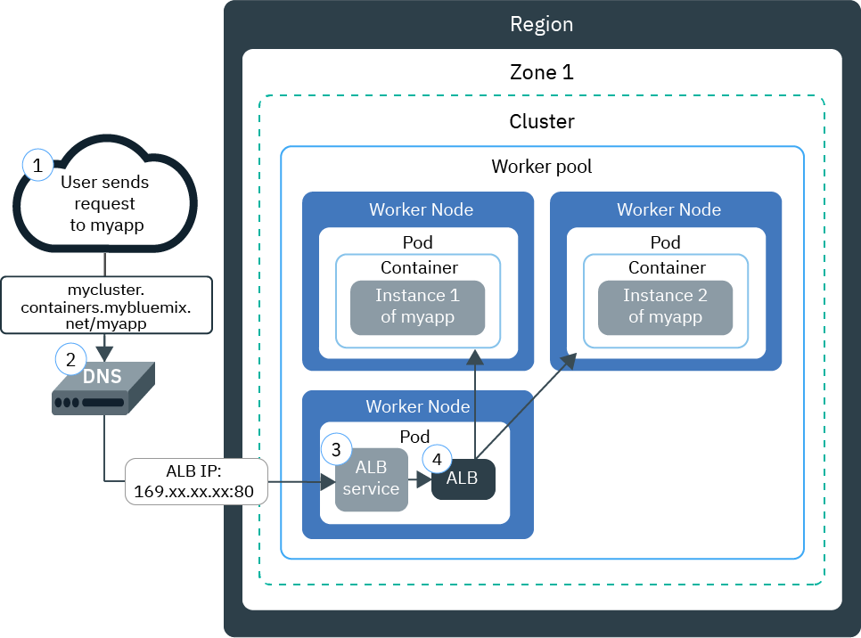
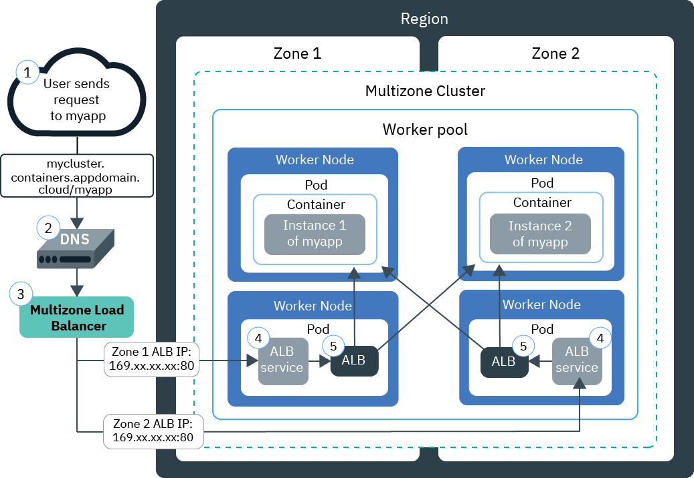

---

copyright:
  years: 2014, 2019
lastupdated: "2019-07-18"

keywords: kubernetes, iks, nginx, ingress controller

subcollection: containers

---

{:new_window: target="_blank"}
{:shortdesc: .shortdesc}
{:screen: .screen}
{:pre: .pre}
{:table: .aria-labeledby="caption"}
{:codeblock: .codeblock}
{:tip: .tip}
{:note: .note}
{:important: .important}
{:deprecated: .deprecated}
{:download: .download}
{:preview: .preview}


# About Ingress ALBs
{: #ingress-about}

Ingress is a Kubernetes service that balances network traffic workloads in your cluster by forwarding public or private requests to your apps. You can use Ingress to expose multiple app services to the public or to a private network by using a unique public or private route.
{: shortdesc}

## What comes with Ingress?
{: #ingress_components}

Ingress consists of three components: Ingress resources, application load balancers (ALBs), and the multizone load balancer (MZLB).
{: shortdesc}

### Ingress resource
{: #ingress-resource}

To expose an app by using Ingress, you must create a Kubernetes service for your app and register this service with Ingress by defining an Ingress resource. The Ingress resource is a Kubernetes resource that defines the rules for how to route incoming requests for apps. The Ingress resource also specifies the path to your app services, which are appended to the public route to form a unique app URL such as `mycluster.us-south.containers.appdomain.cloud/myapp1`.
{: shortdesc}

One Ingress resource is required per namespace where you have apps that you want to expose.
* If the apps in your cluster are all in the same namespace, one Ingress resource is required to define routing rules for the apps that are exposed there. Note that if you want to use different domains for the apps within the same namespace, you can use a wildcard domain to specify multiple subdomain hosts within one resource.
* If the apps in your cluster are in different namespaces, you must create one resource per namespace to define rules for the apps that are exposed there. You must use a wildcard domain and specify a different subdomain in each Ingress resource.

For more information, see [Planning networking for single or multiple namespaces](/docs/containers?topic=containers-ingress#multiple_namespaces).

As of 24 May 2018, the Ingress subdomain format changed for new clusters. The region or zone name included in the new subdomain format is generated based on the zone where the cluster was created. If you have pipeline dependencies on consistent app domain names, you can use your own custom domain instead of the IBM-provided Ingress subdomain.
{: note}

* All clusters created after 24 May 2018 are assigned a subdomain in the new format, `<cluster_name>.<region_or_zone>.containers.appdomain.cloud`.
* Single-zone clusters created before 24 May 2018 continue to use the assigned subdomain in the old format, `<cluster_name>.<region>.containers.mybluemix.net`.
* If you change a single-zone cluster created before 24 May 2018 to multizone by [adding a zone to the cluster](/docs/containers?topic=containers-add_workers#add_zone) for the first time, the cluster continues to use the assigned subdomain in the old format, `<cluster_name>.<region>.containers.mybluemix.net`, and is also assigned a subdomain in the new format, `<cluster_name>.<region_or_zone>.containers.appdomain.cloud`. Either subdomain can be used.

### Application load balancer (ALB)
{: #alb-about}

The application load balancer (ALB) is an external load balancer that listens for incoming HTTP, HTTPS, or TCP service requests. The ALB then forwards requests to the appropriate app pod according to the rules defined in the Ingress resource.
{: shortdesc}

When you create a standard cluster, {{site.data.keyword.containerlong_notm}} automatically creates a highly available ALB for your cluster and assigns a unique public route to it. The public route is linked to a portable public IP address that is provisioned into your IBM Cloud infrastructure account during cluster creation. A default private ALB is also automatically created, but is not automatically enabled.

**Multizone clusters**: When you add a zone to your cluster, a portable public subnet is added, and a new public ALB is automatically created and enabled on the subnet in that zone. All default public ALBs in your cluster share one public route, but have different IP addresses. A default private ALB is also automatically created in each zone, but is not automatically enabled.

### Multizone load balancer (MZLB)
{: #mzlb}

**Multizone clusters**: Whenever you create a multizone cluster or [add a zone to a single zone cluster](/docs/containers?topic=containers-add_workers#add_zone), a Cloudflare multizone load balancer (MZLB) is automatically created and deployed so that 1 MZLB exists for each region. The MZLB puts the IP addresses of your ALBs behind the same subdomain and enables health checks on these IP addresses to determine whether they are available or not.

For example, if you have worker nodes in 3 zones in the US-East region, the subdomain `yourcluster.us-east.containers.appdomain.cloud` has 3 ALB IP addresses. The MZLB health checks the public ALB IP in each zone of a region and keeps the DNS lookup results updated based on these health checks. For example, if your ALBs have IP addresses `1.1.1.1`, `2.2.2.2`, and `3.3.3.3`, a normal operation DNS lookup of your Ingress subdomain returns all 3 IPs, 1 of which the client accesses at random. If the ALB with IP address `3.3.3.3` becomes unavailable for any reason, such as due to zone failure, then the health check for that zone fails, the MZLB removes the failed IP from the subdomain, and the DNS lookup returns only the healthy `1.1.1.1` and `2.2.2.2` ALB IPs. The subdomain has a 30 second time to live (TTL), so after 30 seconds, new client apps can access only one of the available, healthy ALB IPs.

In rare cases, some DNS resolvers or client apps might continue to use the unhealthy ALB IP after the 30-second TTL. These client apps might experience a longer load time until the client app abandons the `3.3.3.3` IP and tries to connect to `1.1.1.1` or `2.2.2.2`. Depending on the client browser or client app settings, the delay can range from a few seconds to a full TCP timeout.

The MZLB load balances for public ALBs that use the IBM-provided Ingress subdomain only. If you use only private ALBs, you must manually check the health of the ALBs and update DNS lookup results. If you use public ALBs that use a custom domain, you can include the ALBs in MZLB load balancing by creating a CNAME in your DNS entry to forward requests from your custom domain to the IBM-provided Ingress subdomain for your cluster.

If you use Calico pre-DNAT network policies to block all incoming traffic to Ingress services, you must also whitelist [Cloudflare's IPv4 IPs ](https://www.cloudflare.com/ips/) that are used to check the health of your ALBs. For steps on how to create a Calico pre-DNAT policy to whitelist these IPs, see [Lesson 3 of the Calico network policy tutorial](/docs/containers?topic=containers-policy_tutorial#lesson3).
{: note}

<br />


## How are IPs assigned to Ingress ALBs?
{: #ips}

When you create a standard cluster, {{site.data.keyword.containerlong_notm}} automatically provisions a portable public subnet and a portable private subnet. By default, the cluster automatically uses:
* 1 portable public IP address from the portable public subnet for the default public Ingress ALB.
* 1 portable private IP address from the portable private subnet for the default private Ingress ALB.
{: shortdesc}

If you have a multizone cluster, a default public ALB and a default private ALB are automatically created in each zone. The IP addresses of your default public ALBs are all behind the same IBM-provided subdomain for your cluster.

Portable public and private IP addresses are static floating IPs and do not change when a worker node is removed. If the worker node is removed, a `Keepalived` daemon that constantly monitors the IP automatically reschedules the ALB pods that were on that worker to another worker node in that zone. The rescheduled ALB pods retain the same static IP address. For the life of the cluster, the ALB IP address in each zone does not change. If you remove a zone from a cluster, then the ALB IP address for that zone is removed.

To see the IPs assigned to your ALBs, you can run the following command.
```
ibmcloud ks albs --cluster <cluster_name_or_id>
```
{: pre}

For more information about what happens to ALB IPs in the event of a zone failure, see the definition for the [multizone load balancer component](#ingress_components).


<br />


## How does a request get to my app with Ingress in a single zone cluster?
{: #architecture-single}


The following diagram shows how Ingress directs communication from the internet to an app in a single-zone cluster:



1. A user sends a request to your app by accessing your app's URL. This URL is the public URL for your exposed app appended with the Ingress resource path, such as `mycluster.us-south.containers.appdomain.cloud/myapp`.

2. A DNS system service resolves the subdomain in the URL to the portable public IP address of the load balancer that exposes the ALB in your cluster.

3. Based on the resolved IP address, the client sends the request to the load balancer service that exposes the ALB.

4. The load balancer service routes the request to the ALB.

5. The ALB checks if a routing rule for the `myapp` path in the cluster exists. If a matching rule is found, the request is forwarded according to the rules that you defined in the Ingress resource to the pod where the app is deployed. The source IP address of the package is changed to the IP address of the public IP address of the worker node where the app pod is running. If multiple app instances are deployed in the cluster, the ALB load balances the requests between the app pods.

<br />


## How does a request get to my app with Ingress in a multizone cluster?
{: #architecture-multi}

The following diagram shows how Ingress directs communication from the internet to an app in a multizone cluster:



1. A user sends a request to your app by accessing your app's URL. This URL is the public URL for your exposed app appended with the Ingress resource path, such as `mycluster.us-south.containers.appdomain.cloud/myapp`.

2. A DNS system service, which acts as the global load balancer, resolves the subdomain in the URL to an available IP address that was reported as healthy by the MZLB. The MZLB continuously checks the portable public IP addresses of the load balancer services that expose public ALBs in each zone in your cluster. The IP addresses are resolved in a round-robin cycle, ensuring that requests are equally load balanced among the healthy ALBs in various zones.

3. The client sends the request to the IP address of the load balancer service that exposes an ALB.

4. The load balancer service routes the request to the ALB.

5. The ALB checks if a routing rule for the `myapp` path in the cluster exists. If a matching rule is found, the request is forwarded according to the rules that you defined in the Ingress resource to the pod where the app is deployed. The source IP address of the package is changed to the public IP address of the worker node where the app pod is running. If multiple app instances are deployed in the cluster, the ALB load balances the requests between app pods across all zones.
