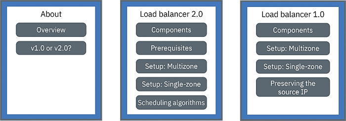

---

copyright:
  years: 2014, 2019
lastupdated: "2019-01-04"

---

{:new_window: target="_blank"}
{:shortdesc: .shortdesc}
{:screen: .screen}
{:pre: .pre}
{:table: .aria-labeledby="caption"}
{:codeblock: .codeblock}
{:tip: .tip}
{:note: .note}
{:important: .important}
{:deprecated: .deprecated}
{:download: .download}


# Exposing apps with load balancers
{: #loadbalancer}

Expose a port and use a portable IP address for a Layer 4 load balancer to access a containerized app.
{:shortdesc}

Load balancer services are available for standard clusters only and do not support TLS termination. If your app requires TLS termination, you can expose your app by using [Ingress](cs_ingress.html), or configure your app to manage the TLS termination.
{: note}

Choose one of the following options to get started:


<map name="image-map">
    <area target="" alt="Overview" title="Overview" href="#overview" coords="35,44,175,72" shape="rect">
    <area target="" alt="Comparison of version 1.0 and 2.0 load balancers" title="Comparison of version 1.0 and 2.0 load balancers" href="#comparison" coords="34,83,173,108" shape="rect">
    <area target="" alt="v2.0: Components and architecture (Beta)" title="v2.0: Components and architecture (Beta)" href="#planning_ipvs" coords="273,45,420,72" shape="rect">
    <area target="" alt="v2.0: Prerequisites" title="v2.0: Prerequisites" href="#ipvs_provision" coords="277,85,417,108" shape="rect">
    <area target="" alt="v2.0: Setting up a load balancer 2.0 in a multizone cluster" title="v2.0: Setting up a load balancer 2.0 in a multizone cluster" href="#ipvs_multi_zone_config" coords="276,122,417,147" shape="rect">
    <area target="" alt="v2.0: Setting up a load balancer 2.0 in a single-zone cluster" title="v2.0: Setting up a load balancer 2.0 in a single-zone cluster" href="#ipvs_single_zone_config" coords="277,156,419,184" shape="rect">
    <area target="" alt="v2.0: Scheduling algorithms" title="v2.0: Scheduling algorithms" href="#scheduling" coords="276,196,419,220" shape="rect">
    <area target="" alt="v1.0: Components and architecture" title="v1.0: Components and architecture" href="#planning" coords="519,47,668,74" shape="rect">
    <area target="" alt="v1.0: Setting up a load balancer 1.0 in a multizone cluster" title="v1.0: Setting up a load balancer 1.0 in a multizone cluster" href="#multi_zone_config" coords="520,85,667,110" shape="rect">
    <area target="" alt="v1.0: Setting up a load balancer 1.0 in a single-zone cluster" title="v1.0: Setting up a load balancer 1.0 in a single-zone cluster" href="#config" coords="520,122,667,146" shape="rect">
    <area target="" alt="v1.0: Enabling source IP preservation" title="v1.0: Enabling source IP preservation" href="#node_affinity_toleration" coords="519,157,667,194" shape="rect">
</map>

Already have the [prerequisites for a load balancer 2.0](#ipvs_provision) completed? You can use the following deployment YAML to create a new load balancer:

```
apiVersion: v1
kind: Service
metadata:
  name: myloadbalancer
  annotations:
    service.kubernetes.io/ibm-load-balancer-cloud-provider-ip-type: <public_or_private>
    service.kubernetes.io/ibm-load-balancer-cloud-provider-zone: "<zone>"
    service.kubernetes.io/ibm-load-balancer-cloud-provider-vlan: "<vlan_id>"
    service.kubernetes.io/ibm-load-balancer-cloud-provider-enable-features: "ipvs"
    service.kubernetes.io/ibm-load-balancer-cloud-provider-scheduler: "<algorithm>"
spec:
  type: LoadBalancer
  selector:
    <selector_key>: <selector_value>
  ports:
   - protocol: TCP
     port: 8080
  loadBalancerIP: <IP_address>
  externalTrafficPolicy: Local
```
{: codeblock}


## Overview
{: #overview}

When you create a standard cluster, {{site.data.keyword.containerlong}} automatically provisions a portable public subnet and a portable private subnet.
{: shortdesc}

* The portable public subnet provides 5 usable IP addresses. 1 portable public IP address is used by the default [public Ingress ALB](cs_ingress.html). The remaining 4 portable public IP addresses can be used to expose single apps to the internet by creating public load balancer services.
* The portable private subnet provides 5 usable IP addresses. 1 portable private IP address is used by the default [private Ingress ALB](cs_ingress.html#private_ingress). The remaining 4 portable private IP addresses can be used to expose single apps to a private network by creating private load balancer services.

Portable public and private IP addresses are static floating IPs and do not change when a worker node is removed. If the worker node that the load balancer IP address is on is removed, a Keepalived daemon that constantly monitors the IP automatically moves the IP to another worker node. You can assign any port to your load balancer. The load balancer service serves as the external entry point for incoming requests for the app. To access the load balancer service from the internet, use the public IP address of your load balancer and the assigned port in the format `<IP_address>:<port>`.

When you expose an app with a load balancer service, your app is automatically made available over the service's NodePorts too. [NodePorts](cs_nodeport.html) are accessible on every public and private IP address of every worker node within the cluster. To block traffic to NodePorts while you are using a load balancer service, see [Controlling inbound traffic to load balancer or NodePort services](cs_network_policy.html#block_ingress).

## Comparison of version 1.0 and 2.0 load balancers
{: #comparison}

When you create a load balancer, you can choose a version 1.0 or 2.0 load balancer. Note that version 2.0 load balancers are in beta.

**How are version 1.0 and 2.0 load balancers similar?**

Version 1.0 and 2.0 load balancers are both Layer 4 load balancers that live only in the Linux kernel space. Both versions run inside the cluster, and use worker node resources. Therefore, the available capacity of the load balancers is always dedicated to your own cluster. Additionally, both version of load balancers do not terminate the connection. Instead, they forward connections to an app pod.

**How are version 1.0 and 2.0 load balancers different?**

When a client sends a request to your app, the load balancer routes request packets to the worker node IP address where an app pod exists. Version 1.0 load balancers use network address translation (NAT) to rewrite the request packet's source IP address to the IP of worker node where a load balancer pod exists. When the worker node returns the app response packet, it uses that worker node IP where the load balancer exists. The load balancer must then send the response packet to the client. To prevent the IP address from being rewritten, you can [enable source IP preservation](#node_affinity_tolerations). However, source IP preservation requires load balancer pods and app pods to run on the same worker so that the request doesn't have to be forwarded to another worker. You must add node affinity and tolerations to app pods.

As opposed to version 1.0 load balancers, version 2.0 load balancers don't use NAT when forwarding requests to app pods on other workers. When a load balancer 2.0 routes a client request, it uses IP over IP (IPIP) to encapsulate the original request packet into another, new packet. This encapsulating IPIP packet has a source IP of the worker node where the load balancer pod is, which allows the original request packet to preserve the client IP as its source IP address. The worker node then uses direct server return (DSR) to send the app response packet to the client IP. The response packet skips the load balancer and is sent directly to the client, decreasing the amount of traffic that the load balancer must handle.

## v2.0: Components and architecture (Beta)
{: #planning_ipvs}

Load balancer 2.0 capabilities are in beta. To use a version 2.0 load balancer, you must [update your cluster's master and worker nodes](cs_cluster_update.html) to Kubernetes version 1.12 or later.
{: note}

The load balancer 2.0 is a Layer 4 load balancer that uses the Linux kernel's IP Virtual Server (IPVS). The load balancer 2.0 supports TCP and UDP, runs in front of multiple worker nodes, and uses IP over IP (IPIP) tunneling to distribute traffic that arrives to a single load balancer IP address across those worker nodes.

For more details, you can also check out this [blog post ](https://www.ibm.com/blogs/bluemix/2018/10/ibm-cloud-kubernetes-service-deployment-patterns-for-maximizing-throughput-and-availability/).

### Traffic flow in a single-zone cluster
{: #ipvs_single}

The following diagram shows how a load balancer 2.0 directs communication from the internet to an app in a single zone cluster.


1. A client request to your app uses the public IP address of your load balancer and the assigned port on the worker node. In this example, the load balancer has a virtual IP address of 169.61.23.130, which is currently on worker 10.73.14.25.

2. The load balancer encapsulates the client request packet (labeled as "CR" in the image) inside an IPIP packet (labeled as "IPIP"). The client request packet retains the client IP as its source IP address. The IPIP encapsulating packet uses the worker 10.73.14.25 IP as its source IP address.

3. The load balancer routes the IPIP packet to a worker that an app pod is on, 10.73.14.26. If multiple app instances are deployed in the cluster, the load balancer routes the requests between the workers where app pods are deployed.

4. Worker 10.73.14.26 unpacks the IPIP encapsulating packet, and then unpacks the client request packet. The client request packet is forwarded to the app pod on that worker node.

5. Worker 10.73.14.26 then uses the source IP address from the original request packet, the client IP, to return the app pod's response packet directly to the client.

### Traffic flow in a multizone cluster
{: #ipvs_multi}

The traffic flow through a multizone cluster follows the same path as [traffic through a single zone cluster](#ipvs_single). In a multizone cluster, the load balancer routes requests to the app instances in its own zone and to app instances in other zones. The following diagram shows how version 2.0 load balancers in each zone direct traffic from the internet to an app in a multizone cluster.


By default, each version 2.0 load balancer is set up in one zone only. You can achieve higher availability by deploying a version 2.0 load balancer in every zone where you have app instances.

<br />


## v2.0: Prerequisites
{: #ipvs_provision}

You cannot update an existing version 1.0 load balancer to 2.0. You must create a new version 2.0 load balancer. Note that you can run version 1.0 and 2.0 load balancers simultaneously in a cluster.

Before you create a version 2.0 load balancer, you must complete the following prerequisite steps.

1. [Update your cluster's master and worker nodes](cs_cluster_update.html) to Kubernetes version 1.12 or later.

2. To allow your load balancer 2.0 to forward requests to app pods in multiple zones, open a support case to request a configuration setting for your VLANs. **Important**: You must request this configuration for all public VLANs. If you request a new VLAN associated, you must open another ticket for that VLAN.
    1. Log in to the [{{site.data.keyword.Bluemix_notm}} console](https://cloud.ibm.com/).
    2. From the menu bar, click **Support**, click the **Manage cases** tab, and click **Create new case**.
    3. In the case fields, enter the following:
       * For type of support, select **Technical**.
       * For category, select **VLAN Spanning**.
       * For subject, enter **Public VLAN Network Question.**
    4. Add the following information to the description: "Please set up the network to allow capacity aggregation on the public VLANs associated with my account. The reference ticket for this request is: https://control.softlayer.com/support/tickets/63859145".
    5. Click **Submit**.

3. After your VLANs have been configured with capacity aggregation, enable [VLAN spanning](/docs/infrastructure/vlans/vlan-spanning.html#vlan-spanning) for your IBM Cloud infrastructure (SoftLayer) account. When VLAN spanning is enabled, the version 2.0 load balancer can route packets to various subnets in the account.

4. If you use [Calico pre-DNAT network policies](cs_network_policy.html#block_ingress) to manage traffic to the IP address of a version 2.0 load balancer, you must add the `applyOnForward: true` and `doNotTrack: true` fields to the `spec` section in the policies. `applyOnForward: true` ensures that the Calico policy is applied to the traffic as it is encapsulated and forwarded. `doNotTrack: true` ensures that the worker nodes can use DSR to return a response packet directly to the client without needing the connection to be tracked. For example, if you use a Calico policy to whitelist traffic from only specific IP addresses to your load balancer IP address, the policy looks similar to the following:
    ```
    apiVersion: projectcalico.org/v3
    kind: GlobalNetworkPolicy
    metadata:
      name: whitelist
    spec:
      applyOnForward: true
      doNotTrack: true
      ingress:
      - action: Allow
        destination:
          nets:
          - <loadbalancer_IP>/32
          ports:
          - 80
        protocol: TCP
        source:
          nets:
          - <client_address>/32
      preDNAT: true
      selector: ibm.role=='worker_public'
      order: 500
      types:
      - Ingress
    ```
    {: screen}

Next, you can follow the steps in [Setting up a load balancer 2.0 in a multizone cluster](#ipvs_multi_zone_config) or [in a single-zone cluster](#ipvs_single_zone_config).

<br />


## v2.0: Setting up a load balancer 2.0 in a multizone cluster
{: #ipvs_multi_zone_config}

**Before you begin**:

* **Important**: Complete the [load balancer 2.0 prerequisites](#ipvs_provision).
* To create public load balancers in multiple zones, at least one public VLAN must have portable subnets available in each zone. To create private load balancers in multiple zones, at least one private VLAN must have portable subnets available in each zone. You can add subnets by following the steps in [Configuring subnets for clusters](cs_subnets.html).
* If you restrict network traffic to edge worker nodes, ensure that at least 2 [edge worker nodes](cs_edge.html#edge) are enabled in each zone so that load balancers deploy uniformly.


To set up a load balancer 2.0 in a multizone cluster:
1.  [Deploy your app to the cluster](cs_app.html#app_cli). Ensure that you add a label to your deployment in the metadata section of your configuration file. This label is needed to identify all of the pods where your app is running so that they can be included in the load balancing.

2.  Create a load balancer service for the app that you want to expose to the public internet or a private network.
  1. Create a service configuration file that is named, for example, `myloadbalancer.yaml`.
  2. Define a load balancer service for the app that you want to expose. You can specify a zone, a VLAN, and an IP address.

      ```
      apiVersion: v1
      kind: Service
      metadata:
        name: myloadbalancer
        annotations:
          service.kubernetes.io/ibm-load-balancer-cloud-provider-ip-type: <public_or_private>
          service.kubernetes.io/ibm-load-balancer-cloud-provider-zone: "<zone>"
          service.kubernetes.io/ibm-load-balancer-cloud-provider-vlan: "<vlan_id>"
          service.kubernetes.io/ibm-load-balancer-cloud-provider-enable-features: "ipvs"
          service.kubernetes.io/ibm-load-balancer-cloud-provider-scheduler: "<algorithm>"
      spec:
        type: LoadBalancer
        selector:
          <selector_key>: <selector_value>
        ports:
         - protocol: TCP
           port: 8080
        loadBalancerIP: <IP_address>
        externalTrafficPolicy: Local
      ```
      {: codeblock}

      <table>
      <caption>Understanding the YAML file components</caption>
      <thead>
      <th colspan=2> Understanding the YAML file components</th>
      </thead>
      <tbody>
      <tr>
        <td><code>service.kubernetes.io/ibm-load-balancer-cloud-provider-ip-type:</code>
        <td>Annotation to specify a <code>private</code> or <code>public</code> load balancer.</td>
      </tr>
      <tr>
        <td><code>service.kubernetes.io/ibm-load-balancer-cloud-provider-zone:</code>
        <td>Annotation to specify the zone that the load balancer service deploys to. To see zones, run <code>ibmcloud ks zones</code>.</td>
      </tr>
      <tr>
        <td>`service.kubernetes.io/ibm-load-balancer-cloud-provider-vlan:`
        <td>Annotation to specify a VLAN that the load balancer service deploys to. To see VLANs, run <code>ibmcloud ks vlans --zone <zone></code>.</td>
      </tr>
      <tr>
        <td><code>service.kubernetes.io/ibm-load-balancer-cloud-provider-enable-features: "ipvs"</code>
        <td>Annotation to specify a version 2.0 load balancer.</td>
      </tr>
      <tr>
        <td><code>service.kubernetes.io/ibm-load-balancer-cloud-provider-scheduler:</code>
        <td>Optional: Annotation to specify the scheduling algorithm. Accepted values are <code>"rr"</code> for Round Robin (default) or <code>"sh"</code> for Source Hashing. For more information, see [2.0: Scheduling algorithms](#scheduling).</td>
      </tr>
      <tr>
        <td><code>selector</code></td>
        <td>The label key (<em>&lt;selector_key&gt;</em>) and value (<em>&lt;selector_value&gt;</em>) that you used in the <code>spec.template.metadata.labels</code> section of your app deployment YAML.</td>
      </tr>
      <tr>
        <td><code>port</code></td>
        <td>The port that the service listens on.</td>
      </tr>
      <tr>
        <td><code>loadBalancerIP</code></td>
        <td>Optional: To create a private load balancer or to use a specific portable IP address for a public load balancer, specify the IP address that you want to use. The IP address must be in the zone and VLAN that you specify in the annotations. If you do not specify an IP address:<ul><li>If your cluster is on a public VLAN, a portable public IP address is used. Most clusters are on a public VLAN.</li><li>If your cluster is on a private VLAN only, a portable private IP address is used.</li></ul></td>
      </tr>
      <tr>
        <td><code>externalTrafficPolicy: Local</code></td>
        <td>Set to <code>Local</code>.</td>
      </tr>
      </tbody></table>

      Example configuration file to create a load balancer 2.0 service in `dal12` that uses the Round Robin scheduling algorithm:

      ```
      apiVersion: v1
      kind: Service
      metadata:
        name: myloadbalancer
        annotations:
          service.kubernetes.io/ibm-load-balancer-cloud-provider-zone: "dal12"
          service.kubernetes.io/ibm-load-balancer-cloud-provider-enable-features: "ipvs"
          service.kubernetes.io/ibm-load-balancer-cloud-provider-scheduler: "rr"
      spec:
        type: LoadBalancer
        selector:
          app: nginx
        ports:
         - protocol: TCP
           port: 8080
        externalTrafficPolicy: Local
      ```
      {: codeblock}

  3. Optional: Configure a firewall by specifying the `loadBalancerSourceRanges` in the **spec** section. For more information, see the [Kubernetes documentation ](https://kubernetes.io/docs/tasks/access-application-cluster/configure-cloud-provider-firewall/).

  4. Create the service in your cluster.

      ```
      kubectl apply -f myloadbalancer.yaml
      ```
      {: pre}

3. Verify that the load balancer service was created successfully. It might take a few minutes for the load balancer service to be created properly and for the app to be available.

    ```
    kubectl describe service myloadbalancer
    ```
    {: pre}

    Example CLI output:

    ```
    Name:                   myloadbalancer
    Namespace:              default
    Labels:                 <none>
    Selector:               app=liberty
    Type:                   LoadBalancer
    Zone:                   dal10
    IP:                     172.21.xxx.xxx
    LoadBalancer Ingress:   169.xx.xxx.xxx
    Port:                   <unset> 8080/TCP
    NodePort:               <unset> 32040/TCP
    Endpoints:              172.30.xxx.xxx:8080
    Session Affinity:       None
    Events:
      FirstSeen	LastSeen	Count	From			SubObjectPath	Type	 Reason			          Message
      ---------	--------	-----	----			-------------	----	 ------			          -------
      10s		    10s		    1	    {service-controller }	  Normal CreatingLoadBalancer	Creating load balancer
      10s		    10s		    1	    {service-controller }		Normal CreatedLoadBalancer	Created load balancer
    ```
    {: screen}

    The **LoadBalancer Ingress** IP address is the portable IP address that was assigned to your load balancer service.

4.  If you created a public load balancer, access your app from the internet.
    1.  Open your preferred web browser.
    2.  Enter the portable public IP address of the load balancer and port.

        ```
        http://169.xx.xxx.xxx:8080
        ```
        {: codeblock}

5. To achieve high availability, repeat the above steps to add a load balancer 2.0 in each zone where you have app instances.

6. Optional: A load balancer service also makes your app available over the service's NodePorts. [NodePorts](cs_nodeport.html) are accessible on every public and private IP address for every node within the cluster. To block traffic to NodePorts while you are using a load balancer service, see [Controlling inbound traffic to load balancer or NodePort services](cs_network_policy.html#block_ingress).

## v2.0: Setting up a load balancer 2.0 in a single-zone cluster
{: #ipvs_single_zone_config}

**Before you begin**:

* **Important**: Complete the [load balancer 2.0 prerequisites](#ipvs_provision).
* You must have an available portable public or private IP address to assign to the load balancer service. For more information, see [Configuring subnets for clusters](cs_subnets.html).

To create a load balancer 2.0 service in a single-zone cluster:

1.  [Deploy your app to the cluster](cs_app.html#app_cli). Ensure that you add a label to your deployment in the metadata section of your configuration file. This label is needed to identify all pods where your app is running so that they can be included in the load balancing.
2.  Create a load balancer service for the app that you want to expose to the public internet or a private network.
    1.  Create a service configuration file that is named, for example, `myloadbalancer.yaml`.

    2.  Define a load balancer 2.0 service for the app that you want to expose.
        ```
        apiVersion: v1
        kind: Service
        metadata:
          name: myloadbalancer
          annotations:
            service.kubernetes.io/ibm-load-balancer-cloud-provider-ip-type: <public_or_private>
            service.kubernetes.io/ibm-load-balancer-cloud-provider-vlan: "<vlan_id>"
            service.kubernetes.io/ibm-load-balancer-cloud-provider-enable-features: "ipvs"
            service.kubernetes.io/ibm-load-balancer-cloud-provider-scheduler: "<algorithm>"
        spec:
          type: LoadBalancer
          selector:
            <selector_key>: <selector_value>
          ports:
           - protocol: TCP
             port: 8080
          loadBalancerIP: <IP_address>
          externalTrafficPolicy: Local
        ```
        {: codeblock}

        <table>
        <caption>Understanding the YAML file components</caption>
        <thead>
        <th colspan=2> Understanding the YAML file components</th>
        </thead>
        <tbody>
        <tr>
          <td>`service.kubernetes.io/ibm-load-balancer-cloud-provider-ip-type:`
          <td>Annotation to specify a <code>private</code> or <code>public</code> load balancer.</td>
        </tr>
        <tr>
          <td>`service.kubernetes.io/ibm-load-balancer-cloud-provider-vlan:`
          <td>Optional: Annotation to specify a VLAN that the load balancer service deploys to. To see VLANs, run <code>ibmcloud ks vlans --zone <zone></code>.</td>
        </tr>
        <tr>
          <td><code>service.kubernetes.io/ibm-load-balancer-cloud-provider-enable-features: "ipvs"</code>
          <td>Annotation to specify a load balancer 2.0.</td>
        </tr>
        <tr>
          <td><code>service.kubernetes.io/ibm-load-balancer-cloud-provider-scheduler:</code>
          <td>Optional: Annotation to specify a scheduling algorithm. Accepted values are <code>"rr"</code> for Round Robin (default) or <code>"sh"</code> for Source Hashing. For more information, see [2.0: Scheduling algorithms](#scheduling).</td>
        </tr>
        <tr>
          <td><code>selector</code></td>
          <td>The label key (<em>&lt;selector_key&gt;</em>) and value (<em>&lt;selector_value&gt;</em>) that you used in the <code>spec.template.metadata.labels</code> section of your app deployment YAML.</td>
        </tr>
        <tr>
          <td><code>port</code></td>
          <td>The port that the service listens on.</td>
        </tr>
        <tr>
          <td><code>loadBalancerIP</code></td>
          <td>Optional: To create a private load balancer or to use a specific portable IP address for a public load balancer, specify the IP address that you want to use. The IP address must be on the VLAN that you specify in the annotations. If you do not specify an IP address:<ul><li>If your cluster is on a public VLAN, a portable public IP address is used. Most clusters are on a public VLAN.</li><li>If your cluster is on a private VLAN only, a portable private IP address is used.</li></ul></td>
        </tr>
        <tr>
          <td><code>externalTrafficPolicy: Local</code></td>
          <td>Set to <code>Local</code>.</td>
        </tr>
        </tbody></table>

    3.  Optional: Configure a firewall by specifying the `loadBalancerSourceRanges` in the **spec** section. For more information, see the [Kubernetes documentation ](https://kubernetes.io/docs/tasks/access-application-cluster/configure-cloud-provider-firewall/).

    4.  Create the service in your cluster.

        ```
        kubectl apply -f myloadbalancer.yaml
        ```
        {: pre}

3.  Verify that the load balancer service was created successfully. It might take a few minutes for the service to be created and for the app to be available.

    ```
    kubectl describe service myloadbalancer
    ```
    {: pre}

    Example CLI output:

    ```
    Name:                   myloadbalancer
    Namespace:              default
    Labels:                 <none>
    Selector:               app=liberty
    Type:                   LoadBalancer
    Location:               dal10
    IP:                     172.21.xxx.xxx
    LoadBalancer Ingress:   169.xx.xxx.xxx
    Port:                   <unset> 8080/TCP
    NodePort:               <unset> 32040/TCP
    Endpoints:              172.30.xxx.xxx:8080
    Session Affinity:       None
    Events:
      FirstSeen	LastSeen	Count	From			SubObjectPath	Type	 Reason			          Message
      ---------	--------	-----	----			-------------	----	 ------			          -------
      10s		    10s		    1	    {service-controller }	  Normal CreatingLoadBalancer	Creating load balancer
      10s		    10s		    1	    {service-controller }		Normal CreatedLoadBalancer	Created load balancer
    ```
    {: screen}

    The **LoadBalancer Ingress** IP address is the portable IP address that was assigned to your load balancer service.

4.  If you created a public load balancer, access your app from the internet.
    1.  Open your preferred web browser.
    2.  Enter the portable public IP address of the load balancer and port.

        ```
        http://169.xx.xxx.xxx:8080
        ```
        {: codeblock}

5. Optional: A load balancer service also makes your app available over the service's NodePorts. [NodePorts](cs_nodeport.html) are accessible on every public and private IP address for every node within the cluster. To block traffic to NodePorts while you are using a load balancer service, see [Controlling inbound traffic to load balancer or NodePort services](cs_network_policy.html#block_ingress).

<br />


## v2.0: Scheduling algorithms
{: #scheduling}

Scheduling algorithms determine how a version 2.0 load balancer assigns network connections to your app pods. As client requests arrive to your cluster, the load balancer routes the request packets to worker nodes based on the scheduling algorithm. To use a scheduling algorithm, specify its Keepalived shortname in the scheduler annotation of your load balancer service configuration file: `service.kubernetes.io/ibm-load-balancer-cloud-provider-scheduler: "rr"`. Check the following lists to see which scheduling algorithms are supported in {{site.data.keyword.containerlong_notm}}. If you do not specify a scheduling algorithm, the Round Robin algorithm is used by default. For more information, see the [Keepalived documentation ](http://www.Keepalived.org/doc/scheduling_algorithms.html).

### Supported scheduling algorithms
{: #scheduling_supported}

<dl>
<dt>Round Robin (<code>rr</code>)</dt>
<dd>The load balancer cycles through the list of app pods when routing connections to worker nodes, treating each app pod equally. Round Robin is the default scheduling algorithm for version 2.0 load balancers.</dd>
<dt>Source Hashing (<code>sh</code>)</dt>
<dd>The load balancer generates a hash key based on the source IP address of the client request packet. The load balancer then looks up the hash key in a statically assigned hash table, and routes the request to the app pod that handles hashes of that range. This algorithm ensures that requests from a particular client are always directed to the same app pod.</br>**Note**: Kubernetes uses Iptables rules, which cause requests to be sent to a random pod on the worker. To use this scheduling algorithm, you must ensure that no more than one pod of your app is deployed per worker node. For example, if each pod has the label <code>run=&lt;app_name&gt;</code>, add the following anti-affinity rule to the <code>spec</code> section of your app deployment:</br>
<pre class="codeblock">
<code>
    spec:
      affinity:
        podAntiAffinity:
          preferredDuringSchedulingIgnoredDuringExecution:
          - weight: 100
            podAffinityTerm:
              labelSelector:
                matchExpressions:
                - key: run
                  operator: In
                  values:
                  - <APP_NAME>
              topologyKey: kubernetes.io/hostname</code></pre>

You can find the complete example in [this IBM Cloud deployment pattern blog ](https://www.ibm.com/blogs/bluemix/2018/10/ibm-cloud-kubernetes-service-deployment-patterns-4-multi-zone-cluster-app-exposed-via-loadbalancer-aggregating-whole-region-capacity/).</dd>
</dl>

### Unsupported scheduling algorithms
{: #scheduling_unsupported}

<dl>
<dt>Destination Hashing (<code>dh</code>)</dt>
<dd>The destination of the packet, which is the load balancer IP address and port, is used to determine which worker node handles the incoming request. However, the IP address and port for load balancers in {{site.data.keyword.containerlong_notm}} don't change. The load balancer is forced to keep the request within the same worker node that it is on, so only app pods on one worker handle all incoming requests.</dd>
<dt>Dynamic connection counting algorithms</dt>
<dd>The following algorithms depend on dynamic counting of connections between clients and load balancers. However, because direct service return (DSR) prevents load balancer 2.0 pods from being in the return packet path, load balancers don't keep track of established connections.<ul>
<li>Least Connection (<code>lc</code>)</li>
<li>Locality-Based Least Connection (<code>lblc</code>)</li>
<li>Locality-Based Least Connection with Replication (<code>lblcr</code>)</li>
<li>Never Queue (<code>nq</code>)</li>
<li>Shortest Expected Delay (<code>seq</code>)</li></ul></dd>
<dt>Weighted pod algorithms</dt>
<dd>The following algorithms depend on weighted app pods. However, in {{site.data.keyword.containerlong_notm}}, all app pods are assigned equal weight for load balancing.<ul>
<li>Weighted Least Connection (<code>wlc</code>)</li>
<li>Weighted Round Robin (<code>wrr</code>)</li></ul></dd></dl>

<br />


## v1.0: Components and architecture
{: #planning}

The TCP/UDP load balancer 1.0 uses Iptables, a Linux kernel feature, to load balance requests across an app's pods.
{: shortdesc}

### Traffic flow in a single-zone cluster
{: #v1_single}

The following diagram shows how a load balancer 1.0 directs communication from the internet to an app in a single-zone cluster.


1. A request to your app uses the public IP address of your load balancer and the assigned port on the worker node.

2. The request is automatically forwarded to the load balancer service's internal cluster IP address and port. The internal cluster IP address is accessible inside the cluster only.

3. `kube-proxy` routes the request to the Kubernetes load balancer service for the app.

4. The request is forwarded to the private IP address of the app pod. The source IP address of the request package is changed to the public IP address of the worker node where the app pod is running. If multiple app instances are deployed in the cluster, the load balancer routes the requests between the app pods.

### Traffic flow in a multizone cluster
{: #v1_multi}

The following diagram shows how a load balancer 1.0 directs communication from the internet to an app in a multizone cluster.


By default, each load balancer 1.0 is set up in one zone only. To achieve high availability, you must deploy a load balancer 1.0 in every zone where you have app instances. Requests are handled by the load balancers in various zones in a round-robin cycle. Additionally, each load balancer routes requests to the app instances in its own zone and to app instances in other zones.

<br />


## v1.0: Setting up a load balancer 1.0 in a multizone cluster
{: #multi_zone_config}

**Before you begin**:
* To create public load balancers in multiple zones, at least one public VLAN must have portable subnets available in each zone. To create private load balancers in multiple zones, at least one private VLAN must have portable subnets available in each zone. You can add subnets by following the steps in [Configuring subnets for clusters](cs_subnets.html).
* If you restrict network traffic to edge worker nodes, ensure that at least 2 [edge worker nodes](cs_edge.html#edge) are enabled in each zone so that load balancers deploy uniformly.
* Enable [VLAN spanning](/docs/infrastructure/vlans/vlan-spanning.html#vlan-spanning) for your IBM Cloud infrastructure (SoftLayer) account so your worker nodes can communicate with each other on the private network. To perform this action, you need the **Network > Manage Network VLAN Spanning** [infrastructure permission](cs_users.html#infra_access), or you can request the account owner to enable it. To check if VLAN spanning is already enabled, use the `ibmcloud ks vlan-spanning-get` [command](/docs/containers/cs_cli_reference.html#cs_vlan_spanning_get).


To set up a load balancer 1.0 service in a multizone cluster:
1.  [Deploy your app to the cluster](cs_app.html#app_cli). Ensure that you add a label to your deployment in the metadata section of your configuration file. This label is needed to identify all of the pods where your app is running so that they can be included in the load balancing.

2.  Create a load balancer service for the app that you want to expose to the public internet or a private network.
  1. Create a service configuration file that is named, for example, `myloadbalancer.yaml`.
  2. Define a load balancer service for the app that you want to expose. You can specify a zone, a VLAN, and an IP address.

      ```
      apiVersion: v1
      kind: Service
      metadata:
        name: myloadbalancer
        annotations:
          service.kubernetes.io/ibm-load-balancer-cloud-provider-ip-type: <public_or_private>
          service.kubernetes.io/ibm-load-balancer-cloud-provider-zone: "<zone>"
          service.kubernetes.io/ibm-load-balancer-cloud-provider-vlan: "<vlan_id>"
      spec:
        type: LoadBalancer
        selector:
          <selector_key>: <selector_value>
        ports:
         - protocol: TCP
           port: 8080
        loadBalancerIP: <IP_address>
      ```
      {: codeblock}

      <table>
      <caption>Understanding the YAML file components</caption>
      <thead>
      <th colspan=2> Understanding the YAML file components</th>
      </thead>
      <tbody>
      <tr>
        <td><code>service.kubernetes.io/ibm-load-balancer-cloud-provider-ip-type:</code>
        <td>Annotation to specify a <code>private</code> or <code>public</code> load balancer.</td>
      </tr>
      <tr>
        <td><code>service.kubernetes.io/ibm-load-balancer-cloud-provider-zone:</code>
        <td>Annotation to specify the zone that the load balancer service deploys to. To see zones, run <code>ibmcloud ks zones</code>.</td>
      </tr>
      <tr>
        <td>`service.kubernetes.io/ibm-load-balancer-cloud-provider-vlan:`
        <td>Annotation to specify a VLAN that the load balancer service deploys to. To see VLANs, run <code>ibmcloud ks vlans --zone <zone></code>.</td>
      </tr>
      <tr>
        <td><code>selector</code></td>
        <td>The label key (<em>&lt;selector_key&gt;</em>) and value (<em>&lt;selector_value&gt;</em>) that you used in the <code>spec.template.metadata.labels</code> section of your app deployment YAML.</td>
      </tr>
      <tr>
        <td><code>port</code></td>
        <td>The port that the service listens on.</td>
      </tr>
      <tr>
        <td><code>loadBalancerIP</code></td>
        <td>Optional: To create a private load balancer or to use a specific portable IP address for a public load balancer, specify the IP address that you want to use. The IP address must be on the VLAN and zone that you specify in the annotations. If you do not specify an IP address:<ul><li>If your cluster is on a public VLAN, a portable public IP address is used. Most clusters are on a public VLAN.</li><li>If your cluster is on a private VLAN only, a portable private IP address is used.</li></ul></td>
      </tr>
      </tbody></table>

      Example configuration file to create a private load balancer 1.0 service that uses a specified IP address on private VLAN `2234945` in `dal12`:

      ```
      apiVersion: v1
      kind: Service
      metadata:
        name: myloadbalancer
        annotations:
          service.kubernetes.io/ibm-load-balancer-cloud-provider-ip-type: private
          service.kubernetes.io/ibm-load-balancer-cloud-provider-zone: "dal12"
          service.kubernetes.io/ibm-load-balancer-cloud-provider-vlan: "2234945"
      spec:
        type: LoadBalancer
        selector:
          app: nginx
        ports:
         - protocol: TCP
           port: 8080
        loadBalancerIP: 172.21.xxx.xxx
      ```
      {: codeblock}

  3. Optional: Configure a firewall by specifying the `loadBalancerSourceRanges` in the **spec** section. For more information, see the [Kubernetes documentation ](https://kubernetes.io/docs/tasks/access-application-cluster/configure-cloud-provider-firewall/).

  4. Create the service in your cluster.

      ```
      kubectl apply -f myloadbalancer.yaml
      ```
      {: pre}

3. Verify that the load balancer service was created successfully. It might take a few minutes for the service to be created and for the app to be available.

    ```
    kubectl describe service myloadbalancer
    ```
    {: pre}

    Example CLI output:

    ```
    Name:                   myloadbalancer
    Namespace:              default
    Labels:                 <none>
    Selector:               app=liberty
    Type:                   LoadBalancer
    Zone:                   dal10
    IP:                     172.21.xxx.xxx
    LoadBalancer Ingress:   169.xx.xxx.xxx
    Port:                   <unset> 8080/TCP
    NodePort:               <unset> 32040/TCP
    Endpoints:              172.30.xxx.xxx:8080
    Session Affinity:       None
    Events:
      FirstSeen	LastSeen	Count	From			SubObjectPath	Type	 Reason			          Message
      ---------	--------	-----	----			-------------	----	 ------			          -------
      10s		    10s		    1	    {service-controller }	  Normal CreatingLoadBalancer	Creating load balancer
      10s		    10s		    1	    {service-controller }		Normal CreatedLoadBalancer	Created load balancer
    ```
    {: screen}

    The **LoadBalancer Ingress** IP address is the portable IP address that was assigned to your load balancer service.

4.  If you created a public load balancer, access your app from the internet.
    1.  Open your preferred web browser.
    2.  Enter the portable public IP address of the load balancer and port.

        ```
        http://169.xx.xxx.xxx:8080
        ```
        {: codeblock}        

5. If you choose to [enable source IP preservation for a version 1.0 load balancer service](#node_affinity_tolerations), ensure that app pods are scheduled onto the edge worker nodes by [adding edge node affinity to app pods](#edge_nodes). App pods must be scheduled onto edge nodes to receive incoming requests.

6. Repeat the above steps to add a version 1.0 load balancer in each zone.

7. Optional: A load balancer service also makes your app available over the service's NodePorts. [NodePorts](cs_nodeport.html) are accessible on every public and private IP address for every node within the cluster. To block traffic to NodePorts while you are using a load balancer service, see [Controlling inbound traffic to load balancer or NodePort services](cs_network_policy.html#block_ingress).

## v1.0: Setting up a load balancer 1.0 in a single-zone cluster
{: #config}

**Before you begin**:You must have an available portable public or private IP address to assign to the load balancer service. For more information, see [Configuring subnets for clusters](cs_subnets.html).

To create a load balancer 1.0 service in a single-zone cluster:

1.  [Deploy your app to the cluster](cs_app.html#app_cli). Ensure that you add a label to your deployment in the metadata section of your configuration file. This label is needed to identify all pods where your app is running so that they can be included in the load balancing.
2.  Create a load balancer service for the app that you want to expose to the public internet or a private network.
    1.  Create a service configuration file that is named, for example, `myloadbalancer.yaml`.

    2.  Define a load balancer service for the app that you want to expose.
        ```
        apiVersion: v1
        kind: Service
        metadata:
          name: myloadbalancer
          annotations:
            service.kubernetes.io/ibm-load-balancer-cloud-provider-ip-type: <public_or_private>
            service.kubernetes.io/ibm-load-balancer-cloud-provider-vlan: "<vlan_id>"
        spec:
          type: LoadBalancer
          selector:
            <selector_key>: <selector_value>
          ports:
           - protocol: TCP
             port: 8080
          loadBalancerIP: <IP_address>
          externalTrafficPolicy: Local
        ```
        {: codeblock}

        <table>
        <caption>Understanding the YAML file components</caption>
        <thead>
        <th colspan=2> Understanding the YAML file components</th>
        </thead>
        <tbody>
        <tr>
          <td>`service.kubernetes.io/ibm-load-balancer-cloud-provider-ip-type:`
          <td>Annotation to specify a <code>private</code> or <code>public</code> load balancer.</td>
        </tr>
        <tr>
          <td>`service.kubernetes.io/ibm-load-balancer-cloud-provider-vlan:`
          <td>Annotation to specify a VLAN that the load balancer service deploys to. To see VLANs, run <code>ibmcloud ks vlans --zone <zone></code>.</td>
        </tr>
        <tr>
          <td><code>selector</code></td>
          <td>The label key (<em>&lt;selector_key&gt;</em>) and value (<em>&lt;selector_value&gt;</em>) that you used in the <code>spec.template.metadata.labels</code> section of your app deployment YAML.</td>
        </tr>
        <tr>
          <td><code>port</code></td>
          <td>The port that the service listens on.</td>
        </tr>
        <tr>
          <td><code>loadBalancerIP</code></td>
          <td>Optional: To create a private load balancer or to use a specific portable IP address for a public load balancer, specify the IP address that you want to use. The IP address must be on the VLAN that you specify in the annotations. If you do not specify an IP address:<ul><li>If your cluster is on a public VLAN, a portable public IP address is used. Most clusters are on a public VLAN.</li><li>If your cluster is on a private VLAN only, a portable private IP address is used.</li></ul></td>
        </tr>
        </tbody></table>

        Example configuration file to create a private load balancer 1.0 service that uses a specified IP address on private VLAN `2234945`:

        ```
        apiVersion: v1
        kind: Service
        metadata:
          name: myloadbalancer
          annotations:
            service.kubernetes.io/ibm-load-balancer-cloud-provider-ip-type: private
            service.kubernetes.io/ibm-load-balancer-cloud-provider-vlan: "2234945"
        spec:
          type: LoadBalancer
          selector:
            app: nginx
          ports:
           - protocol: TCP
             port: 8080
          loadBalancerIP: 172.21.xxx.xxx
        ```
        {: codeblock}

    3.  Optional: Configure a firewall by specifying the `loadBalancerSourceRanges` in the **spec** section. For more information, see the [Kubernetes documentation ](https://kubernetes.io/docs/tasks/access-application-cluster/configure-cloud-provider-firewall/).

    4.  Create the service in your cluster.

        ```
        kubectl apply -f myloadbalancer.yaml
        ```
        {: pre}

3.  Verify that the load balancer service was created successfully. It might take a few minutes for the service to be created and for the app to be available.

    ```
    kubectl describe service myloadbalancer
    ```
    {: pre}

    Example CLI output:

    ```
    Name:                   myloadbalancer
    Namespace:              default
    Labels:                 <none>
    Selector:               app=liberty
    Type:                   LoadBalancer
    Location:               dal10
    IP:                     172.21.xxx.xxx
    LoadBalancer Ingress:   169.xx.xxx.xxx
    Port:                   <unset> 8080/TCP
    NodePort:               <unset> 32040/TCP
    Endpoints:              172.30.xxx.xxx:8080
    Session Affinity:       None
    Events:
      FirstSeen	LastSeen	Count	From			SubObjectPath	Type	 Reason			          Message
      ---------	--------	-----	----			-------------	----	 ------			          -------
      10s		    10s		    1	    {service-controller }	  Normal CreatingLoadBalancer	Creating load balancer
      10s		    10s		    1	    {service-controller }		Normal CreatedLoadBalancer	Created load balancer
    ```
    {: screen}

    The **LoadBalancer Ingress** IP address is the portable IP address that was assigned to your load balancer service.

4.  If you created a public load balancer, access your app from the internet.
    1.  Open your preferred web browser.
    2.  Enter the portable public IP address of the load balancer and port.

        ```
        http://169.xx.xxx.xxx:8080
        ```
        {: codeblock}

5. If you choose to [enable source IP preservation for a version 1.0 load balancer service](#node_affinity_tolerations), ensure that app pods are scheduled onto the edge worker nodes by [adding edge node affinity to app pods](#edge_nodes). App pods must be scheduled onto edge nodes to receive incoming requests.

6. Optional: A load balancer service also makes your app available over the service's NodePorts. [NodePorts](cs_nodeport.html) are accessible on every public and private IP address for every node within the cluster. To block traffic to NodePorts while you are using a load balancer service, see [Controlling inbound traffic to load balancer or NodePort services](cs_network_policy.html#block_ingress).

<br />


## v1.0: Enabling source IP preservation
{: #node_affinity_tolerations}

This feature is for version 1.0 load balancers only. The source IP address of client requests is preserved by default in version 2.0 load balancers.
{: note}

When a client request to your app is sent to your cluster, a load balancer service pod receives the request. If no app pod exists on the same worker node as the load balancer service pod, the load balancer forwards the request to an app pod on a different worker node. The source IP address of the package is changed to the public IP address of the worker node where the load balancer service pod is running.

To preserve the original source IP address of the client request, you can [enable source IP ](https://kubernetes.io/docs/tasks/access-application-cluster/create-external-load-balancer/#preserving-the-client-source-ip) for load balancer services. The TCP connection continues all the way to the app pods so that the app can see the actual source IP address of the initiator. Preserving the client’s IP is useful, for example, when app servers have to apply security and access-control policies.

After you enable the source IP, load balancer service pods must forward requests to app pods that are deployed to the same worker node only. Typically, load balancer service pods are also deployed to the worker nodes that the app pods are deployed to. However, some situations exist where the load balancer pods and app pods might not be scheduled onto the same worker node:

* You have edge nodes that are tainted so that only load balancer service pods can deploy to them. App pods are not permitted to deploy to those nodes.
* Your cluster is connected to multiple public or private VLANs, and your app pods might deploy to worker nodes that are connected only to one VLAN. Load balancer service pods might not deploy to those worker nodes because the load balancer IP address is connected to a different VLAN than the worker nodes.

To force your app to deploy to specific worker nodes where load balancer service pods can also deploy to, you must add affinity rules and tolerations to your app deployment.

### Adding edge node affinity rules and tolerations
{: #edge_nodes}

When you [label worker nodes as edge nodes](cs_edge.html#edge_nodes) and also [taint the edge nodes](cs_edge.html#edge_workloads), load balancer service pods deploy only to those edge nodes, and app pods cannot deploy to edge nodes. When source IP is enabled for the load balancer service, the load balancer pods on the edge nodes cannot forward incoming requests to your app pods on other worker nodes.
{:shortdesc}

To force your app pods to deploy to edge nodes, add an edge node [affinity rule ](https://kubernetes.io/docs/concepts/configuration/assign-pod-node/#node-affinity-beta-feature) and [toleration ](https://kubernetes.io/docs/concepts/configuration/taint-and-toleration/#concepts) to the app deployment.

Example deployment YAML file with edge node affinity and edge node toleration:

```
apiVersion: extensions/v1beta1
kind: Deployment
metadata:
  name: with-node-affinity
spec:
  template:
    spec:
      affinity:
        nodeAffinity:
          requiredDuringSchedulingIgnoredDuringExecution:
            nodeSelectorTerms:
            - matchExpressions:
              - key: dedicated
                operator: In
                values:
                - edge
      tolerations:
        - key: dedicated
          value: edge
...
```
{: codeblock}

Both the **affinity** and **tolerations** sections have `dedicated` as the `key` and `edge` as the `value`.

### Adding affinity rules for multiple public or private VLANs
{: #edge_nodes_multiple_vlans}

When your cluster is connected to multiple public or private VLANs, your app pods might deploy to worker nodes that are connected only to one VLAN. If the load balancer IP address is connected to a different VLAN than these worker nodes, load balancer service pods won't deploy to those worker nodes.
{:shortdesc}

When source IP is enabled, schedule app pods on worker nodes that are the same VLAN as the load balancer's IP address by adding an affinity rule to the app deployment.

Before you begin: [Log in to your account. Target the appropriate region and, if applicable, resource group. Set the context for your cluster](cs_cli_install.html#cs_cli_configure).

1. Get the IP address of the load balancer service. Look for the IP address in the **LoadBalancer Ingress** field.
    ```
    kubectl describe service <loadbalancer_service_name>
    ```
    {: pre}

2. Retrieve the VLAN ID that your load balancer service is connected to.

    1. List portable public VLANs for your cluster.
        ```
        ibmcloud ks cluster-get <cluster_name_or_ID> --showResources
        ```
        {: pre}

        Example output:
        ```
        ...

        Subnet VLANs
        VLAN ID   Subnet CIDR       Public   User-managed
        2234947   10.xxx.xx.xxx/29  false    false
        2234945   169.36.5.xxx/29   true     false
        ```
        {: screen}

    2. In the output under **Subnet VLANs**, look for the subnet CIDR that matches the load balancer IP address that you retrieved earlier and note the VLAN ID.

        For example, if the load balancer service IP address is `169.36.5.xxx`, the matching subnet in the example output of the previous step is `169.36.5.xxx/29`. The VLAN ID that the subnet is connected to is `2234945`.

3. [Add an affinity rule ](https://kubernetes.io/docs/concepts/configuration/assign-pod-node/#node-affinity-beta-feature) to the app deployment for the VLAN ID that you noted in the previous step.

    For example, if you have multiple VLANs but want your app pods to deploy to worker nodes on the `2234945` public VLAN only:

    ```
    apiVersion: extensions/v1beta1
    kind: Deployment
    metadata:
      name: with-node-affinity
    spec:
      template:
        spec:
          affinity:
            nodeAffinity:
              requiredDuringSchedulingIgnoredDuringExecution:
                nodeSelectorTerms:
                - matchExpressions:
                  - key: publicVLAN
                    operator: In
                    values:
                    - "2234945"
    ...
    ```
    {: codeblock}

    In the example YAML, the **affinity** section has `publicVLAN` as the `key` and `"2234945"` as the `value`.

4. Apply the updated deployment configuration file.
    ```
    kubectl apply -f with-node-affinity.yaml
    ```
    {: pre}

5. Verify that the app pods deployed to worker nodes connected to the designated VLAN.

    1. List the pods in your cluster. Replace `<selector>` with the label that you used for the app.
        ```
        kubectl get pods -o wide app=<selector>
        ```
        {: pre}

        Example output:
        ```
        NAME                   READY     STATUS              RESTARTS   AGE       IP               NODE
        cf-py-d7b7d94db-vp8pq  1/1       Running             0          15d       172.30.xxx.xxx   10.176.48.78
        ```
        {: screen}

    2. In the output, identify a pod for your app. Note the **NODE** ID of the worker node that the pod is on.

        In the example output of the previous step, the app pod `cf-py-d7b7d94db-vp8pq` is on worker node `10.176.48.78`.

    3. List the details for the worker node.

        ```
        kubectl describe node <worker_node_ID>
        ```
        {: pre}

        Example output:

        ```
        Name:                   10.xxx.xx.xxx
        Role:
        Labels:                 arch=amd64
                                beta.kubernetes.io/arch=amd64
                                beta.kubernetes.io/os=linux
                                failure-domain.beta.kubernetes.io/region=us-south
                                failure-domain.beta.kubernetes.io/zone=dal10
                                ibm-cloud.kubernetes.io/encrypted-docker-data=true
                                kubernetes.io/hostname=10.xxx.xx.xxx
                                privateVLAN=2234945
                                publicVLAN=2234967
        ...
        ```
        {: screen}

    4. In the **Labels** section of the output, verify that the public or private VLAN is the VLAN that you designated in previous steps.
