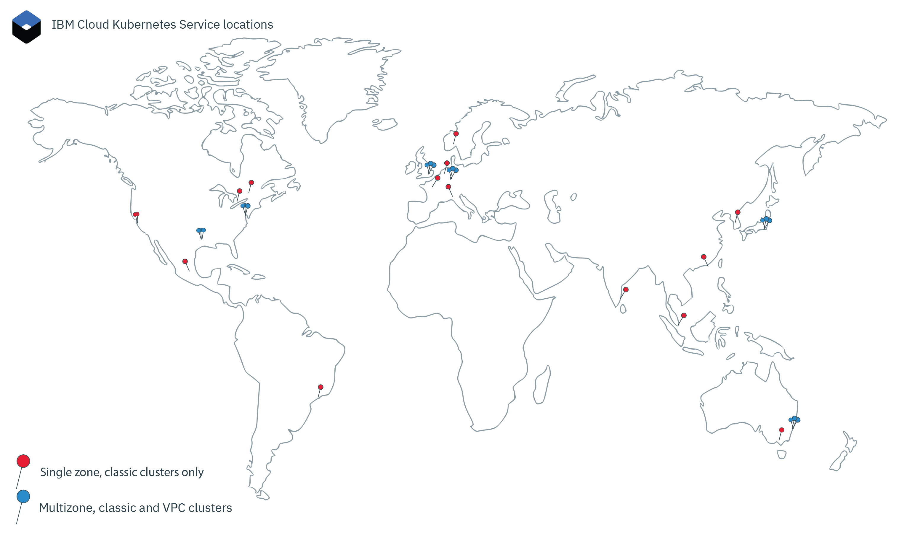

---

copyright:
  years: 2014, 2021
lastupdated: "2021-03-30"

keywords: kubernetes, iks, mzr, szr, multizone, multi az

subcollection: containers

---

{:DomainName: data-hd-keyref="APPDomain"}
{:DomainName: data-hd-keyref="DomainName"}
{:android: data-hd-operatingsystem="android"}
{:api: .ph data-hd-interface='api'}
{:apikey: data-credential-placeholder='apikey'}
{:app_key: data-hd-keyref="app_key"}
{:app_name: data-hd-keyref="app_name"}
{:app_secret: data-hd-keyref="app_secret"}
{:app_url: data-hd-keyref="app_url"}
{:authenticated-content: .authenticated-content}
{:beta: .beta}
{:c#: data-hd-programlang="c#"}
{:cli: .ph data-hd-interface='cli'}
{:codeblock: .codeblock}
{:curl: .ph data-hd-programlang='curl'}
{:deprecated: .deprecated}
{:dotnet-standard: .ph data-hd-programlang='dotnet-standard'}
{:download: .download}
{:external: target="_blank" .external}
{:faq: data-hd-content-type='faq'}
{:fuzzybunny: .ph data-hd-programlang='fuzzybunny'}
{:generic: data-hd-operatingsystem="generic"}
{:generic: data-hd-programlang="generic"}
{:gif: data-image-type='gif'}
{:go: .ph data-hd-programlang='go'}
{:help: data-hd-content-type='help'}
{:hide-dashboard: .hide-dashboard}
{:hide-in-docs: .hide-in-docs}
{:important: .important}
{:ios: data-hd-operatingsystem="ios"}
{:java: .ph data-hd-programlang='java'}
{:java: data-hd-programlang="java"}
{:javascript: .ph data-hd-programlang='javascript'}
{:javascript: data-hd-programlang="javascript"}
{:new_window: target="_blank"}
{:note .note}
{:note: .note}
{:objectc data-hd-programlang="objectc"}
{:org_name: data-hd-keyref="org_name"}
{:php: data-hd-programlang="php"}
{:pre: .pre}
{:preview: .preview}
{:python: .ph data-hd-programlang='python'}
{:python: data-hd-programlang="python"}
{:route: data-hd-keyref="route"}
{:row-headers: .row-headers}
{:ruby: .ph data-hd-programlang='ruby'}
{:ruby: data-hd-programlang="ruby"}
{:runtime: architecture="runtime"}
{:runtimeIcon: .runtimeIcon}
{:runtimeIconList: .runtimeIconList}
{:runtimeLink: .runtimeLink}
{:runtimeTitle: .runtimeTitle}
{:screen: .screen}
{:script: data-hd-video='script'}
{:service: architecture="service"}
{:service_instance_name: data-hd-keyref="service_instance_name"}
{:service_name: data-hd-keyref="service_name"}
{:shortdesc: .shortdesc}
{:space_name: data-hd-keyref="space_name"}
{:step: data-tutorial-type='step'}
{:subsection: outputclass="subsection"}
{:support: data-reuse='support'}
{:swift: .ph data-hd-programlang='swift'}
{:swift: data-hd-programlang="swift"}
{:table: .aria-labeledby="caption"}
{:term: .term}
{:tip: .tip}
{:tooling-url: data-tooling-url-placeholder='tooling-url'}
{:troubleshoot: data-hd-content-type='troubleshoot'}
{:tsCauses: .tsCauses}
{:tsResolve: .tsResolve}
{:tsSymptoms: .tsSymptoms}
{:tutorial: data-hd-content-type='tutorial'}
{:ui: .ph data-hd-interface='ui'}
{:unity: .ph data-hd-programlang='unity'}
{:url: data-credential-placeholder='url'}
{:user_ID: data-hd-keyref="user_ID"}
{:vbnet: .ph data-hd-programlang='vb.net'}
{:video: .video}
 


# Locations
{: #regions-and-zones}

You can deploy {{site.data.keyword.containerlong}} clusters worldwide. When you create a cluster, its resources remain in the location that you deploy the cluster to. To work with your cluster, you can access the service via a global API endpoint.
{: shortdesc}

{: caption="Figure 1. {{site.data.keyword.containerlong_notm}} locations" caption-side="bottom"}

## {{site.data.keyword.containerlong_notm}} locations
{: #locations}

{{site.data.keyword.cloud_notm}} resources are organized into a hierarchy of geographic locations. {{site.data.keyword.containerlong_notm}} is available in a subset of these locations, including worldwide multizone regions and single zone regions. Other {{site.data.keyword.cloud_notm}} services might be available globally or within a specific location.
{: shortdesc}

```
ibmcloud ks locations
```
{: pre}

### How locations are organized
{: #example_locations_org}

The following image is used as an example to explain how {{site.data.keyword.containerlong_notm}} locations are organized. For more information, see [Locations for resource deployment](/docs/overview?topic=overview-locations).
{: shortdesc}


|Type|Example|Description|
|--- |--- |--- |
|Geography|North America (`na`)|An organizational grouping that is based on geographic continents.|
|Country|Canada (`ca`)|The location's country within the geography.|
|Metro|Mexico City (`mex-cty`), Dallas (`dal`)|The name of a city where 1 or more data centers are located. A metro might have a multizone region, such as Dallas, or might have a single zone region, such as Mexico City. If you create a cluster in a multizone region, the Kubernetes master and worker nodes can be spread across zones for high availability.|
|Data center (zone)|Dallas 12 (`dal12`)|A physical location of the compute, network, and storage infrastructure and related cooling and power that host cloud services and applications. In a region, clusters can be spread across data centers, or zones, in an multizone architecture for high availability. Zones are isolated from each other, which ensures no shared single point of failure.|
{: caption="Organization of {{site.data.keyword.containerlong_notm}} locations."}
{: summary="The table shows organization of {{site.data.keyword.containerlong_notm}} locations. Rows are to be read from the left to right, with the location type in column one, an example of the type in column two, and the description in column three."}

### Classic multizone regions
{: #zones-mz}

 **Classic multizone**: If you create a classic cluster in a multizone region, the replicas of your highly available Kubernetes master are automatically spread across the data centers (zones). You have the option to spread your worker nodes across zones to protect your apps from a zone failure. To determine whether a location has a multizone region, your can run `ibmcloud ks locations` and look for the value in the `Multizone Metro` column.
{: shortdesc}

| Geography |  Country  | Metro | Data center |  Previous region  |
|-----|-----|-----|-----|-----|
| Asia Pacific | Australia | Sydney | syd01, syd04, syd05 | AP South (`ap-south`, `au-syd`) |
| Asia Pacific | Japan | Osaka`†` | osa21, osa22, osa23 | `jp-osa` |
| Asia Pacific | Japan | Tokyo | tok02, tok04, tok05 | AP North (`ap-north`, `jp-tok`) |
| Europe | Germany | Frankfurt | fra02, fra04, fra05 | EU Central (`eu-central`, `eu-de`) |
| Europe | United Kingdom | London | lon04, lon05`*`, lon06 | UK South (`uk-south`, `eu-gb`) |
| North America | United States | Dallas | dal10, dal12, dal13 | US South (`us-south`) |
| North America | United States | Washington, D.C. | wdc04, wdc06, wdc07 | US East (`us-east`) |
{: caption="Available multizone metro locations for classic clusters in {{site.data.keyword.containerlong_notm}}." caption-side="top"}
{: summary="The rows are read from left to right. The first column is the IBM Cloud geography of the location. The second column is where the country of the location. The third column is the metro that the location is in. The fourth column is the data center of the location. The fifth column is the name of the IBM Cloud region that the location is in."}

`*` lon05 replaces lon02. New clusters must use lon05, which supports highly available masters that are spread across zones.
{: note}

### Classic single zone regions
{: #zones-sz}

 **Classic single zone**: If you create a classic cluster in a single zone region, you can create multiple worker nodes but you cannot spread them across data centers (zones). The highly available master includes three replicas on separate hosts, but is not spread across zones.
{: shortdesc}

| Geography |  Country  | Metro | Data center |  Previous region  |
|-----|-----|-----|-----|-----|
| Asia Pacific | Australia | Sydney | syd01, syd04, syd05 | AP South (`ap-south`, `au-syd`) |
| Asia Pacific | China | Hong Kong<br>SAR of the PRC | hkg02 | AP North (`ap-north`, `jp-tok`) |
| Asia Pacific | India | Chennai | che01 | AP North (`ap-north`, `jp-tok`) |
| Asia Pacific | Japan | Osaka | osa21, osa22, osa23 | `jp-osa` |
| Asia Pacific | Japan | Tokyo | tok02, tok04, tok05 | AP North (`ap-north`, `jp-tok`) |
| Asia Pacific | Korea | Seoul | seo01 | AP North (`ap-north`, `jp-tok`) |
| Asia Pacific | Singapore | Singapore | sng01 | AP North (`ap-north`, `jp-tok`) |
| Europe | France | Paris | par01 | EU Central (`eu-central`, `eu-de`) |
| Europe | Germany | Frankfurt | fra02, fra04, fra05 | EU Central (`eu-central`, `eu-de`) |
| Europe | Italy | Milan | mil01 | EU Central (`eu-central`, `eu-de`) |
| Europe | The Netherlands | Amsterdam | ams03 | EU Central (`eu-central`, `eu-de`) |
| Europe | Norway | Oslo | osl01 | EU Central (`eu-central`, `eu-de`) |
| Europe | United Kingdom | London | lon02`*`, lon04, lon05`*`, lon06 | UK South (`uk-south`, `eu-gb`) |
| North America | Canada | Montreal | mon01 | US East (`us-east`) |
| North America | Canada | Toronto | tor01 | US East (`us-east`) |
| North America | Mexico | Mexico City | mex01 | US South (`us-south`) |
| North America | United States | Dallas | dal10, dal12, dal13 | US South (`us-south`) |
| North America | United States | Houston | hou02`†` | US South (`us-south`) |
| North America | United States | San Jose | sjc03, sjc04 | US South (`us-south`) |
| North America | United States | Washington, D.C. | wdc04, wdc06, wdc07 | US East (`us-east`) |
| South America | Brazil | São Paulo | sao01 | US South (`us-south`) |
{: caption="Available single zone data center locations for classic clusters in {{site.data.keyword.containerlong_notm}}." caption-side="top"}
{: summary="The rows are read from left to right. The first column is the IBM Cloud geography of the location. The second column is where the country of the location. The third column is the metro that the location is in. The fourth column is the data center of the location. The fifth column is the name of the IBM Cloud region that the location is in."}

<p class="note">`*` lon05 replaces lon02. New clusters must use lon05, which supports highly available masters that are spread across zones.<br><br>`†` hou02 supports free clusters that are created in US South, and is not available for standard, production clusters.</p>


### VPC multizone regions
{: #zones-vpc}

 **VPC regions and zones**: VPC resources are provisioned in a region, which is a separate group of zones within a metro. The zones are mapped to separate data centers to ensure that resources are distributed evenly across zones in a multizone architecture. In the API and CLI, zones use the regional zone name in the API and command line (`us-south-1`), but in the console, zones use by the data center location (`Dallas 1`). For the data center code that the VPC zone and location corresponds to, such as `us-south-1` and `DAL10`, see [Multizone regions](/docs/overview?topic=overview-locations#mzr-table).
{: shortdesc}

| Geography |  Country  | Metro | Region | Zone`*` | Location`*` |
|-----|-----|-----|-----|-----|
| Asia Pacific | Australia | Sydney | au-syd | au-syd-1<br>au-syd-2<br>au-syd-3 | Sydney 1<br>Sydney 2<br>Sydney 3|
| Asia Pacific | Japan | Tokyo | jp-tok | jp-tok-1<br>jp-tok-2<br>jp-tok-3 | Tokyo 1<br>Tokyo 2<br>Tokyo 3|
| Europe | Germany | Frankfurt | eu-de | eu-de-1<br>eu-de-2<br>eu-de-3 | Frankfurt 1<br>Frankfurt 2<br>Frankfurt 3|
| Europe | United Kingdom | London | eu-gb | eu-gb-1<br>eu-gb-2<br>eu-gb-3 | London 1<br>London 2<br>London 3|
| North America | United States | Dallas | us-south | us-south-1<br>us-south-2<br>us-south-3 | Dallas 1<br>Dallas 2<br>Dallas 3|
| North America | United States | Washington DC | us-east | us-east-1<br>us-east-2<br>us-east-3 | Washington DC 1<br>Washington DC 2<br>Washington DC 3|
{: caption="Available multizone metro locations for VPC clusters in {{site.data.keyword.containerlong_notm}}." caption-side="top"}
{: summary="The rows are read from left to right. The first column is the IBM Cloud geography of the location. The second column is where the country of the location. The third column is the metro that the location is in. The fourth column is the zone of the location. The fifth column is the name of the location."}

`*` For the data center code that the VPC zone and location corresponds to, such as `us-south-1` and `DAL10`, see [Multizone regions](/docs/overview?topic=overview-locations#mzr-table).
{: note}


### Resources in a single zone cluster
{: #regions_single_zone}

In a single zone cluster, your cluster's resources remain in the data center (zone) in which the cluster is deployed, but management operations might be routed through a regional endpoint.
{: shortdesc}

1.  Your cluster's resources, including the master and worker nodes, are in the same zone that you deployed the cluster to. When you initiate local container orchestration actions, such as `kubectl` commands, the information is exchanged between your master and worker nodes within the same zone.

2.  If you set up other cluster resources, such as storage, networking, compute, or apps running in pods, the resources and their data remain in the zone that you deployed your cluster to.

3.  When you initiate cluster management actions, such as using `ibmcloud ks` commands, basic information about the cluster (such as name, ID, user, the command) is routed through a regional endpoint via the global endpoint. Regional endpoints are located in the nearest multizone region, such as `mon01` to Washington, D.C.

### Resources in a multizone cluster
{: #regions_multizone}

In a multizone cluster, your cluster's resources are spread across multiple zones for higher availability.
{: shortdesc}

1.  Worker nodes are spread across multiple zones in the metro location to provide more availability for your cluster. The Kubernetes master replicas are also spread across zones. When you initiate local container orchestration actions, such as `kubectl` commands, the information is exchanged between your master and worker nodes through the global endpoint.

2.  Other cluster resources, such as storage, networking, compute, or apps running in pods, vary in how they deploy to the zones in your multizone cluster. For more information, review these topics:
    *   Setting up [file storage](/docs/containers?topic=containers-file_storage#add_file) and [block storage](/docs/containers?topic=containers-block_storage#add_block) in multizone clusters, or [choosing a multizone persistent storage solution](/docs/containers?topic=containers-storage_planning#persistent_storage_overview).
    *   [Enabling public or private access to an app by using a network load balancer (NLB) service in a multizone cluster](/docs/containers?topic=containers-loadbalancer#multi_zone_config).
    *   [Managing network traffic by using Ingress](/docs/containers?topic=containers-ingress-about).
    *   [Increasing the availability of your app](/docs/containers?topic=containers-app).

3.  When you initiate cluster management actions, such as using [`ibmcloud ks` commands](/docs/containers?topic=containers-cli-plugin-kubernetes-service-cli), basic information about the cluster (such as name, ID, user, the command) is routed through the global endpoint.


### Free clusters
{: #regions_free}

Free clusters are limited to specific locations and are available for only classic infrastructure, not VPC infrastructure. For more information about free clusters, see [the FAQ](/docs/containers?topic=containers-faqs#faq_free).
{: shortdesc}

**Creating a free cluster in the CLI**: You can create a free cluster in select regions only. Your cluster is created in a data center within the region that you target. You cannot specify the data center. The following regions are available.
* Frankfurt region in `ibmcloud ks init --host https://eu-de.containers.cloud.ibm.com`
* Dallas region in `ibmcloud ks init --host https://us-south.containers.cloud.ibm.com`

**Creating a free cluster in the {{site.data.keyword.cloud_notm}} console**: When you use the console, you cannot select a location. Your cluster is created in one of the following locations.
* Dallas region in North America
* Frankfurt region in Europe


<br />

## Accessing the global endpoint
{: #endpoint}

You can organize your resources across {{site.data.keyword.cloud_notm}} services by using {{site.data.keyword.cloud_notm}} locations (formerly called regions). For example, you can deploy an app to a cluster by using a private Docker image that is stored in your {{site.data.keyword.registrylong_notm}} of the same location. To access these resources, you can use the global endpoints and filter by location.
{: shortdesc}

### Logging in to {{site.data.keyword.cloud_notm}}
{: #login-ic}

When you log in to the {{site.data.keyword.cloud_notm}} (`ibmcloud`) command line, you are prompted to select a region. However, this region does not affect the {{site.data.keyword.containerlong_notm}} plug-in (`ibmcloud ks`) endpoint, which still uses the global endpoint. Note that you do still need to target the resource group that your cluster is in if it is not in the default resource group.
{: shortdesc}

To log in to the {{site.data.keyword.cloud_notm}} global API endpoint and target the resource group that your cluster is in:
```
ibmcloud login -a https://cloud.ibm.com -g <nondefault_resource_group_name>
```
{: pre}

### Logging in to {{site.data.keyword.containerlong_notm}}
{: #login-iks}

When you log in to {{site.data.keyword.cloud_notm}}, you can access the {{site.data.keyword.containershort_notm}}. To help you get started, check out the following resources for using the {{site.data.keyword.containerlong_notm}} CLI and API.
{: shortdesc}


**{{site.data.keyword.containerlong_notm}} CLI**:
* [Set up your CLI to use the `ibmcloud ks` plug-in](/docs/containers?topic=containers-cs_cli_install#cs_cli_install).
* [Configure your CLI to connect to a particular cluster and run `kubectl` commands](/docs/containers?topic=containers-cs_cli_install#cs_cli_configure).
By default, you are logged in to the global {{site.data.keyword.containerlong_notm}} endpoint, `https://containers.cloud.ibm.com`.

When you use the new global functionality in the {{site.data.keyword.containerlong_notm}} CLI, consider the following changes from the legacy region-based functionality.

* Listing resources:
  * When you list resources, such as with the `ibmcloud ks cluster ls`, `ibmcloud ks subnets`, or `ibmcloud ks zone ls` commands, resources in all locations are returned. To filter resources by a specific location, certain commands include a `--location` flag. For example, if you filter clusters for the `wdc` metro, multizone clusters in that metro and single-zone clusters in data centers (zones) within that metro are returned. If you filter clusters for the `wdc06` data center (zone), multizone clusters that have a worker node in that zone and single-zone clusters in that zone are returned.
    Example to filter by location:
    ```
    ibmcloud ks cluster ls -l dal -l seo
    ```
    {: pre}
  * Other commands do not return resources in all locations. To run `credential set/unset/get`, `api-key reset`, and `vlan spanning get` commands, you must specify a region in the `--region`.

* Working with resources:
  * When you use the global endpoint, you can work with resources that you have access permissions to in any location, even if you target one region and the resource that you want to work with is in another region.
  * If you have clusters with the same name in different regions, use the cluster ID when you run commands or set a region with the `ibmcloud ks init` command and use the cluster name when you run commands.

* Legacy functionality:
  * If you need to list and work with resources from one region only, you can use the `ibmcloud ks init` [command](/docs/containers?topic=containers-cli-plugin-kubernetes-service-cli#cs_init) to target a regional endpoint instead of the global endpoint.
    Example to target the US South regional endpoint:
    ```
    ibmcloud ks init --host https://us-south.containers.cloud.ibm.com
    ```
    {: pre}
  * To use the global functionality, you can use the `ibmcloud ks init` command again to target the global endpoint. Example to target the global endpoint again:
    ```
    ibmcloud ks init --host https://containers.cloud.ibm.com
    ```
    {: pre}

</br></br>
**{{site.data.keyword.containerlong_notm}} API**:
* [Get started with the API](/docs/containers?topic=containers-cs_api_install#cs_api).
* [View documentation on the API commands](https://containers.cloud.ibm.com/global/swagger-global-api/#/).
* Generate a client of the API to use in automation by using the [`swagger.json` API](https://containers.cloud.ibm.com/global/swagger-global-api/swagger.json).

To interact with the global {{site.data.keyword.containerlong_notm}} API, enter the command type and append `global/v1/command` to the endpoint.

Example of `GET /clusters` global API:
```
GET https://containers.cloud.ibm.com/global/v1/clusters
```
{: codeblock}

</br>

If you need to specify a region in an API call, remove the `/global` parameter from the path and pass the region name in the `X-Region` header. To list available regions, review the [Previous region](#zones-mz) column in the {{site.data.keyword.containerlong_notm}} locations table.

<br />


## Previous {{site.data.keyword.cloud_notm}} region and zone structure
{: #bluemix_regions}

Previously, your {{site.data.keyword.cloud_notm}} resources were organized into regions. Regions are a conceptual tool to organize zones, and can include zones (data centers) in different countries and geographies. The following table maps the previous {{site.data.keyword.cloud_notm}} regions, {{site.data.keyword.containerlong_notm}} regions, and {{site.data.keyword.containerlong_notm}} zones. Multizone-capable zones are in bold.
{: shortdesc}

Region-specific endpoints for {{site.data.keyword.containerlong_notm}} are deprecated. Use the [global endpoint](#endpoint) instead. If you must use regional endpoints, [use the `ibmcloud ks api` command](/docs/containers-cli-plugin?topic=containers-cli-plugin-kubernetes-service-cli#cs_cli_api).
{: deprecated}

By using {{site.data.keyword.containerlong_notm}} regions, you can create or access Kubernetes clusters in a region other than the {{site.data.keyword.cloud_notm}} region that you are logged in to. {{site.data.keyword.containerlong_notm}} region endpoints refer specifically to the {{site.data.keyword.containerlong_notm}}, not {{site.data.keyword.cloud_notm}} as a whole.

You might want to log in to another {{site.data.keyword.containerlong_notm}} region for the following reasons:
  * You created {{site.data.keyword.cloud_notm}} services or private Docker images in one region and want to use them with {{site.data.keyword.containerlong_notm}} in another region.
  * You want to access a cluster in a region that is different from the default {{site.data.keyword.cloud_notm}} region that you are logged in to.

To switch regions, use the `ibmcloud ks init` [command](/docs/containers?topic=containers-cli-plugin-kubernetes-service-cli#cs_init).

| {{site.data.keyword.containerlong_notm}} region | Corresponding {{site.data.keyword.cloud_notm}} regions | Available zones in the region |
| --- | --- | --- |
| AP North (standard clusters only) | Tokyo | che01, hkg02, seo01, sng01, **tok02, tok04, tok05** |
| AP South | Sydney | **syd01, syd04, syd05** |
| EU Central | Frankfurt | ams03, **fra02, fra04, fra05**, mil01, osl01, par01 |
| UK South | London | lon02, **lon04, lon05, lon06** |
| US East (standard clusters only) | Washington DC | mon01, tor01, **wdc04, wdc06, wdc07** |
| US South | Dallas | **dal10, dal12, dal13**, mex01, sjc03, sjc04, sao01 |
{: caption="Corresponding {{site.data.keyword.containershort}} and {{site.data.keyword.cloud_notm}} regions, with zones. Multizone-capable zones are in bold." caption-side="top"}


