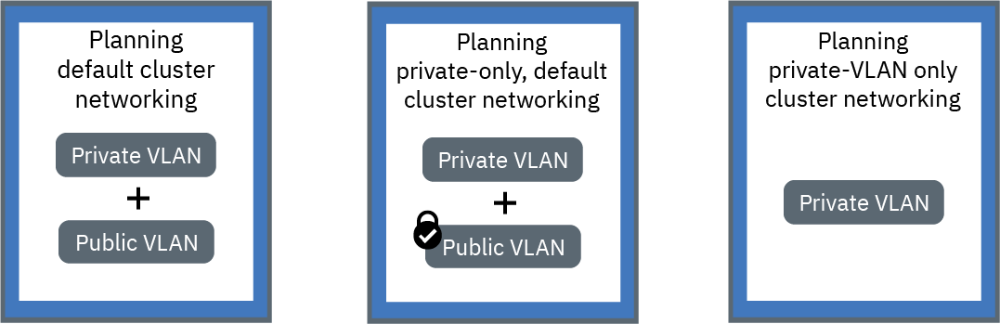

---

copyright:
  years: 2014, 2019
lastupdated: "2019-02-05"

---

{:new_window: target="_blank"}
{:shortdesc: .shortdesc}
{:screen: .screen}
{:pre: .pre}
{:table: .aria-labeledby="caption"}
{:codeblock: .codeblock}
{:tip: .tip}
{:note: .note}
{:important: .important}
{:deprecated: .deprecated}
{:download: .download}

# Planning in-cluster and private networking
{: #cs_network_cluster}

Plan a networking setup for your {{site.data.keyword.containerlong}} cluster.
{: shortdesc}

## Understanding in-cluster networking
{: #in-cluster}

All pods that are deployed to a worker node are assigned a private IP address in the 172.30.0.0/16 range and are routed between worker nodes only. To avoid conflicts, don't use this IP range on any nodes that communicate with your worker nodes. Worker nodes and pods can securely communicate on the private network by using private IP addresses. However, when a pod crashes or a worker node needs to be re-created, a new private IP address is assigned.
{: shortdesc}

By default, it's difficult to track changing private IP addresses for apps that must be highly available. Instead, you can use the built-in Kubernetes service discovery features to expose apps as cluster IP services on the private network. A Kubernetes service groups a set of pods and provides a network connection to these pods. This connection provides connectivity to other services in the cluster without exposing the actual private IP address of each pod. Services are assigned an in-cluster IP address that is accessible inside the cluster only.
* Older clusters: In clusters that were created before February 2018 in the dal13 zone or before October 2017 in any other zone, the services are assigned an IP from one of 254 IPs in the 10.10.10.0/24 range. If you hit the limit of 254 services and need more services, you must create a new cluster.
* Newer clusters: In clusters that were created after February 2018 in the dal13 zone or after October 2017 in any other zone, the services are assigned an IP from one of the 65,000 IPs in the 172.21.0.0/16 range.

To avoid conflicts, don't use this IP range on any nodes that communicate with your worker nodes. A DNS lookup entry is also created for the service and stored in the `kube-dns` component of the cluster. The DNS entry contains the name of the service, the namespace where the service was created, and the link to the assigned in-cluster IP address.

To access a pod behind a cluster service, apps can either use the in-cluster IP address of the service or send a request by using the name of the service. When you use the name of the service, the name is looked up in the `kube-dns` component and routed to the in-cluster IP address of the service. When a request reaches the service, the service forwards requests to the pods equally, independent of pods' in-cluster IP addresses and the worker node that they are deployed to.

 

## Understanding VLAN connections and network interfaces
{: #interfaces}

{{site.data.keyword.containerlong_notm}} provides IBM Cloud infrastructure (SoftLayer) VLANs that ensure quality network performance and network isolation for worker nodes. A VLAN configures a group of worker nodes and pods as if they were attached to the same physical wire. VLANs are dedicated to your {{site.data.keyword.Bluemix_notm}} account and not shared across IBM customers.
{: shortdesc}

By default, all clusters are connected to a private VLAN. The private VLAN determines the private IP address that is assigned to each worker node. Your workers have a private network interface and are accessible over the private network. When you create a cluster that is also connected to a public VLAN, your cluster has a public network interface too. The public VLAN allows the worker nodes to automatically and securely connect to the master. For more information about the default VLANs for your cluster, see [Default VLANs, subnets, and IPs for clusters](/docs/containers/cs_subnets.html#default_vlans_subnets).

Cluster networking setups can be defined by the cluster's network interfaces:

* **Default cluster networking**: A cluster with both a private and public network interface
* **Customized default cluster networking**: A cluster with both a private and public network interface and Calico network policies to block incoming public traffic
* **Private-only cluster networking**: A cluster with only a private network interface

Click one of the following setups to plan networking for your cluster:

<map name="home_map" id="home_map">
<area href="#both_vlans" alt="Planning default cluster networking" title="Planning default cluster networking" shape="rect" coords="-7, -8, 149, 211" />
<area href="#both_vlans_private" alt="Planning customized default cluster networking" title="Planning customized default cluster networking" shape="rect" coords="196, -1, 362, 210" />
<area href="#plan_setup_private_vlan" alt="Planning private-only cluster networking" title="Planning private-only cluster networking" shape="rect" coords="409, -10, 572, 218" />
</map>

 

## Planning default cluster networking
{: #both_vlans}

By default, {{site.data.keyword.containerlong_notm}} sets up your cluster with access to a public VLAN and a private VLAN.
{:shortdesc}

**What does my cluster get with this setup?**
* A public IP address for each worker node, which gives worker nodes a public network interface
* A private IP address for each worker node, which gives worker nodes a private network interface
* An automatic, secure OpenVPN connection between all worker nodes and the master

**Why might I use this setup?**

* You have an app that must be accessible to the public internet in a single-zone cluster.
* You have an app that must be accessible to the public internet in a multizone cluster. Because you must enable [VLAN spanning](/docs/containers/cs_subnets.html#subnet-routing) to create a multizone cluster, the cluster can communicate with other systems that are connected to any private VLAN in the same IBM Cloud account. To isolate your multizone cluster on the private network, you can use [Calico network policies](/docs/containers/cs_network_policy.html#isolate_workers).

**What are my options for managing public and private access to my cluster?**
 The following sections describe the capabilities across {{site.data.keyword.containerlong_notm}} that you can use to set up networking for clusters that are connected to a public and a private VLAN.

### Expose your apps with networking services
{: #both_vlans_services}

The public network interface for worker nodes is protected by [predefined Calico network policy settings](/docs/containers/cs_network_policy.html#default_policy) that are configured on every worker node during cluster creation. By default, all outbound network traffic is allowed for all worker nodes. Inbound network traffic is blocked except for a few ports. These ports are opened so that IBM can monitor network traffic and automatically install security updates for the Kubernetes master.
{: shortdesc}

If you want to expose your apps to the public or to a private network, you can create public or private NodePort, LoadBalancer, or Ingress services. For more information about each service, see [Choosing a NodePort, LoadBalancer, or Ingress service](/docs/containers/cs_network_planning.html#external).

### Optional: Isolate networking workloads to edge worker nodes
{: #both_vlans_edge}

Edge worker nodes can improve the security of your cluster by allowing fewer worker nodes to be accessed externally and by isolating the networking workload. To ensure that Ingress and load balancer pods are deployed to only specified worker nodes, [label worker nodes as edge nodes](cs_edge.html#edge_nodes). To also prevent other workloads from running on edge nodes, [taint the edge nodes](cs_edge.html#edge_workloads).

### Optional: Connect to an on-premises network or IBM Cloud Private by using strongSwan VPN
{: #both_vlans_vpn}

To securely connect your worker nodes and apps to an on-premises network, you can set up a [strongSwan IPSec VPN service ](https://www.strongswan.org/about.html). The strongSwan IPSec VPN service provides a secure end-to-end communication channel over the internet that is based on the industry-standard Internet Protocol Security (IPSec) protocol suite.
* To set up a secure connection between your cluster and an on-premises network, [configure and deploy the strongSwan IPSec VPN service](cs_vpn.html#vpn-setup) directly in a pod in your cluster.
* To set up a secure connection between your cluster and an IBM Cloud Private instance, see [Connecting your public and private cloud with the strongSwan VPN](cs_hybrid.html#hybrid_vpn).

 

## Planning customized default cluster networking
{: #both_vlans_private}

By default, {{site.data.keyword.containerlong_notm}} sets up your cluster with access to a public VLAN and a private VLAN. However, you can customize the default networking setup by using network policies to block public access.
{:shortdesc}

**What does my cluster get with this setup?**
* A public IP address for each worker node, which gives worker nodes a public network interface
* A private IP address for each worker node, which gives worker nodes a private network interface
* An automatic, secure OpenVPN connection between all worker nodes and the master

**Why might I use this setup?**

* You have an app in a single-zone cluster. You want to expose the app only to pods within the cluster or in other clusters that are connected to the same private VLAN.
* You have an app in a multizone cluster. You want to expose the app only to pods within the cluster or in other clusters that are connected to the same private VLANs as your cluster. However, because [VLAN spanning](/docs/containers/cs_subnets.html#subnet-routing) must be enabled for multizone clusters, other systems that are connected to any private VLAN in the same IBM Cloud account can access the cluster. You want to isolate your multizone cluster from other systems.

**What are my options for managing public and private access to my cluster?** The following sections describe the capabilities across {{site.data.keyword.containerlong_notm}} that you can use to set up private-only networking and lock down public networking for clusters that are connected to a public and a private VLAN.

### Expose your apps with private networking services and secure your cluster from public access with Calico network policies
{: #both_vlans_private_services}

The public network interface for worker nodes is protected by [predefined Calico network policy settings](/docs/containers/cs_network_policy.html#default_policy) that are configured on every worker node during cluster creation. By default, all outbound network traffic is allowed for all worker nodes. Inbound network traffic is blocked except for a few ports. These ports are opened so that IBM can monitor network traffic and automatically install security updates for the Kubernetes master.
{: shortdesc}

If you want to expose your apps over a private network only, you can create private NodePort, a LoadBalancer, or Ingress services. For more information about planning private external networking, see [Planning private external networking for a public and private VLAN setup](/docs/containers/cs_network_planning.html#private_both_vlans).

However, the default Calico network policies also allow inbound public network traffic from the internet to these services. You can create Calico policies to instead block all public traffic to the services. For example, a NodePort service opens a port on a worker node over both the private and public IP address of the worker node. A load balancer service with a portable private IP address opens a public NodePort on every worker node. You must create a [Calico preDNAT network policy](/docs/containers/cs_network_policy.html#block_ingress) to block public NodePorts.

As an example, say you created a private load balancer service. You also created a Calico preDNAT policy to block public traffic from reaching the public NodePorts opened by the load balancer. This private load balancer can be accessed by:
* [Any pod in that same cluster](#in-cluster)
* Any pod in any cluster that is connected to the same private VLAN
* If you have [VLAN spanning enabled](/docs/containers/cs_subnets.html#subnet-routing), any system that is connected to any of the private VLANs in the same IBM Cloud account
* If you're not in the IBM Cloud account but still behind the company firewall, any system through a VPN connection to the subnet that the load balancer IP is on
* If you're in a different IBM Cloud account, any system through a VPN connection to the subnet that the load balancer IP is on

### Isolate your cluster on the private network
{: #isolate}

If you have a multizone cluster, multiple VLANs for a single zone cluster, or multiple subnets on the same VLAN, you must [enable VLAN spanning](/docs/infrastructure/vlans/vlan-spanning.html#vlan-spanning) so that your worker nodes can communicate with each other on the private network. However, when VLAN spanning is enabled, any system that is connected to any of the private VLANs in the same IBM Cloud account can access your workers. You can isolate your multizone cluster from other systems on the private network by using [Calico network policies](/docs/containers/cs_network_policy.html#isolate_workers). These policies also allow ingress and egress for the private IP ranges and ports that you opened in your private firewall.
{: shortdesc}

### Optional: Isolate networking workloads to edge worker nodes
{: #both_vlans_private_edge}

Edge worker nodes can improve the security of your cluster by allowing fewer worker nodes to be accessed externally and by isolating the networking workload. To ensure that Ingress and load balancer pods are deployed to only specified worker nodes, [label worker nodes as edge nodes](cs_edge.html#edge_nodes). To also prevent other workloads from running on edge nodes, [taint the edge nodes](cs_edge.html#edge_workloads).

Then, use a [Calico preDNAT network policy](/docs/containers/cs_network_policy.html#block_ingress) to block traffic to public NodePorts on clusters that are running edge worker nodes. Blocking node ports ensures that the edge worker nodes are the only worker nodes that handle incoming traffic.

### Optional: Connect to an on-premises network or IBM Cloud Private by using strongSwan VPN
{: #both_vlans_private_vpn}

To securely connect your worker nodes and apps to an on-premises network, you can set up a [strongSwan IPSec VPN service ](https://www.strongswan.org/about.html). The strongSwan IPSec VPN service provides a secure end-to-end communication channel over the internet that is based on the industry-standard Internet Protocol Security (IPSec) protocol suite.
* To set up a secure connection between your cluster and an on-premises network, [configure and deploy the strongSwan IPSec VPN service](cs_vpn.html#vpn-setup) directly in a pod in your cluster.
* To set up a secure connection between your cluster and an IBM Cloud Private instance, see [Connecting your public and private cloud with the strongSwan VPN](cs_hybrid.html#hybrid_vpn).

 

## Planning private-only cluster networking
{: #plan_setup_private_vlan}

You can choose to [create a private-VLAN only cluster](/docs/containers/cs_clusters.html#clusters_cli) by including the `--private-only` flag in the CLI. When your worker nodes are connected to a private VLAN only, the worker nodes can't automatically connect to the master. You must use a gateway appliance to connect the worker nodes to the master. You can also use the gateway appliance as a firewall to secure your cluster from unwanted access.
{:shortdesc}

**What does my cluster get with this setup?**
* A private IP address for each worker node, which gives worker nodes a private network interface

**What does my cluster not get with this setup?**
* A public IP address for each worker node, which gives worker nodes a public network interface. The cluster is never available to the public.
* An automatic connection between all worker nodes and the master. You must provide this connection by [configuring a gateway appliance](#private_vlan_gateway).

**Why might I use this setup?**
 You have specific security requirements or need to create custom network policies and routing rules to provide dedicated network security. Note that using a gateway appliance incurs separate costs. For details, see the [documentation](/docs/infrastructure/fortigate-10g/explore-firewalls.html).

**What are my options for managing public and private access to my cluster?**
 The following sections describe the capabilities across {{site.data.keyword.containerlong_notm}} that you can use to set up networking for clusters that are connected to a private VLAN only.

### Configure a gateway appliance
{: #private_vlan_gateway}

If worker nodes are set up with a private VLAN only, you must configure an alternative solution for network connectivity between your worker nodes and the master. You can set up a firewall with custom network policies to provide dedicated network security for your standard cluster and to detect and remediate network intrusion. For example, you might choose to set up a [Virtual Router Appliance](/docs/infrastructure/virtual-router-appliance/about.html) or a [Fortigate Security Appliance](/docs/infrastructure/fortigate-10g/about.html) to act as your firewall and block unwanted traffic. When you set up a firewall, you must also [open up the required ports and IP addresses](/docs/containers/cs_firewall.html#firewall_outbound) for each region so that the master and the worker nodes can communicate.
{: shortdesc}

If you have an existing router appliance and then add a cluster, the new portable subnets that are ordered for the cluster aren't configured on the router appliance. In order to use networking services, you must enable routing between the subnets on the same VLAN by [enabling VLAN spanning](/docs/containers/cs_subnets.html#vra-routing).
{: important}

### Expose your apps with private networking services
{: #private_vlan_services}

To make your app accessible from a private network only, you can use private NodePort, LoadBalancer, or Ingress services. Because your worker nodes aren't connected to a public VLAN, no public traffic is routed to these services. You must also [open up the required ports and IP addresses](/docs/containers/cs_firewall.html#firewall_inbound) to permit inbound traffic to these services.
{: shortdesc}

For more information about each service, see [Choosing a NodePort, LoadBalancer, or Ingress service](/docs/containers/cs_network_planning.html#external).

### Optional: Connect to an on-premises database by using the gateway appliance
{: #private_vlan_vpn}

To securely connect your worker nodes and apps to an on-premises network, you must set up a VPN gateway. You can use the VRA or FSA that you previously set up to also configure an IPSec VPN endpoint. To configure a VRA, see [Setting up VPN connectivity with a VRA](/docs/containers/cs_vpn.html#vyatta).
{: shortdesc}

