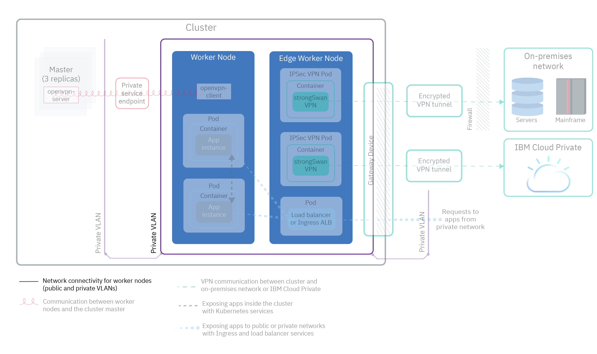
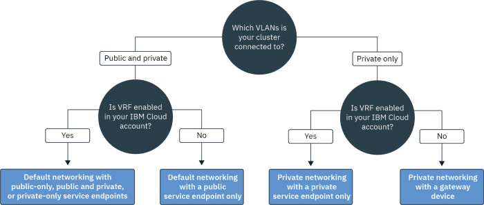
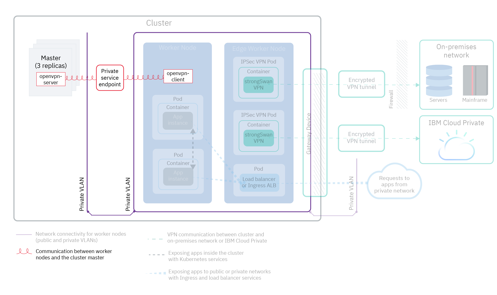

---

copyright:
  years: 2014, 2019
lastupdated: "2019-05-20"

---

{:new_window: target="_blank"}
{:shortdesc: .shortdesc}
{:screen: .screen}
{:pre: .pre}
{:table: .aria-labeledby="caption"}
{:codeblock: .codeblock}
{:tip: .tip}
{:note: .note}
{:important: .important}
{:deprecated: .deprecated}
{:download: .download}

# Planning your cluster network
{: #cs_network_ov}

Plan a networking setup for your {{site.data.keyword.containerlong}} cluster.
{: shortdesc}

This page helps you set up your cluster's network configuration. Looking for information about setting up networking for your app? See [Planning to expose your apps with in-cluster and external networking](/docs/containers?topic=containers-cs_network_planning).
{: tip}

## Understanding {{site.data.keyword.containerlong_notm}} network basics
{: #cs_network_ov_basics}

Before you start setting up your cluster network, it is important to understand the basic concepts of networking in {{site.data.keyword.containerlong_notm}} clusters.
{: shortdesc}

### Which cluster components must communicate with each other?
{: #cs_network_ov_basics_components}

When you create your cluster, you must choose a networking setup so that certain cluster components can communicate with each other.
{: shortdesc}

* All worker nodes must be connected to a VLAN in order to communicate with each other and with the Kubernetes master. To choose VLANs, see [Planning worker-to-worker communication](#cs_network_ov_worker).
* Communication must be permitted across multiple private VLANs to allow workers to connect with each other and the master. To enable a Virtual Router Function (VRF) or VLAN spanning, see [How are VLANs and subnets configured to ensure network segmentation?](#cs_network_ov_basics_segmentation).
* Your workers can communicate with the Kubernetes master securely over the public network or over the private network. To choose your worker-master communication channel, see [Planning master-to-worker communication](#cs_network_ov_master).

### How does networking work in {{site.data.keyword.containerlong_notm}}?
{: #cs_network_ov_basics_vlans}

{{site.data.keyword.containerlong_notm}} uses VLANs, subnets, and IP addresses to give cluster components network connectivity.
{: shortdesc}

**What are VLANs? What types of VLANs does {{site.data.keyword.containerlong_notm}} offer?** 

When you create a cluster, the cluster's worker nodes are connected automatically to a VLAN. A VLAN configures a group of worker nodes and pods as if they were attached to the same physical wire and provides a channel for connectivity among the workers and pods.
{: shortdesc}

<dl>
<dt>VLANs for free clusters</dt>
<dd>In free clusters, the cluster's worker nodes are connected to an IBM-owned public VLAN and private VLAN by default. Because IBM controls the VLANs, subnets, and IP addresses, you cannot create multizone clusters or add subnets to your cluster, and can use only NodePort services to expose your app.</dd>
<dt>VLANs for standard clusters</dt>
<dd>In standard clusters, the first time that you create a cluster in a zone, a public VLAN and a private VLAN in that zone are automatically provisioned for you in your IBM Cloud infrastructure (SoftLayer) account. For every subsequent cluster that you create in that zone, you must specify the VLAN pair that you want to use in that zone. You can reuse the same public and private VLANs that were created for you because multiple clusters can share VLANs. 
 You can either connect your worker nodes to both a public VLAN and the private VLAN, or to the private VLAN only. If you want to connect your worker nodes to a private VLAN only, you can use the ID of an existing private VLAN or [create a private VLAN](/docs/cli/reference/ibmcloud?topic=cloud-cli-manage-classic-vlans#sl_vlan_create) and use the ID during cluster creation.</dd></dl>

To see the VLANs that are provisioned in each zone for your account, run `ibmcloud ks vlans --zone <zone>.` To see the VLANs that one cluster is provisioned on, run `ibmcloud ks cluster-get --cluster <cluster_name_or_ID> --showResources` and look for the **Subnet VLANs** section.

IBM Cloud infrastructure (SoftLayer) manages the VLANs that are automatically provisioned when you create your first cluster in a zone. If you let a VLAN become unused, such as by removing all worker nodes from a VLAN, IBM Cloud infrastructure (SoftLayer) reclaims the VLAN. After, if you need a new VLAN, [contact {{site.data.keyword.Bluemix_notm}} support](/docs/infrastructure/vlans?topic=vlans-ordering-premium-vlans#ordering-premium-vlans).

**How does my choice of VLANs affect my cluster?** 

Your choice of VLAN connections determines how the Kubernetes master and worker nodes can communicate with each other in your cluster. For more information, see [Planning communication between worker nodes and the Kubernetes master](#cs_network_ov_master).

Your choice of VLAN connections also determines the network connectivity for your apps. For more information, see [Planning to expose your apps with in-cluster and external networking](/docs/containers?topic=containers-cs_network_planning).

### What are subnets? What types of subnets does {{site.data.keyword.containerlong_notm}} offer?
{: #cs_network_ov_basics_subnets}

In addition to worker nodes and pods, subnets are also automatically provisioned onto VLANs. Subnets provide network connectivity to your cluster components by assigning IP addresses to them.
{: shortdesc}

The following subnets are automatically provisioned on the default public and private VLANs:

**Public VLAN subnets**
* The primary public subnet determines the public IP addresses that are assigned to worker nodes during cluster creation. Multiple clusters on the same VLAN can share one primary public subnet.
* The portable public subnet is bound to one cluster only and provides the cluster with 8 public IP addresses. 3 IPs are reserved for IBM Cloud infrastructure (SoftLayer) functions. 1 IP is used by the default public Ingress ALB and 4 IPs can be used to create public network load balancer (NLB) services. Portable public IPs are permanent, fixed IP addresses that can be used to access NLBs over the internet. If you need more than 4 IPs for NLBs, see [Adding portable IP addresses](/docs/containers?topic=containers-subnets#adding_ips).

**Private VLAN subnets**
* The primary private subnet determines the private IP addresses that are assigned to worker nodes during cluster creation. Multiple clusters on the same VLAN can share one primary private subnet.
* The portable private subnet is bound to one cluster only and provides the cluster with 8 private IP addresses. 3 IPs are reserved for IBM Cloud infrastructure (SoftLayer) functions. 1 IP is used by the default private Ingress ALB and 4 IPs can be used to create private network load balancer (NLB) services. Portable private IPs are permanent, fixed IP addresses that can be used to access NLBs over a private network. If you need more than 4 IPs for private NLBs, see [Adding portable IP addresses](/docs/containers?topic=containers-subnets#adding_ips).

To see all of the subnets provisioned in your account, run `ibmcloud ks subnets`. To see the portable public and portable private subnets that are bound to one cluster, you can run `ibmcloud ks cluster-get --cluster <cluster_name_or_ID> --showResources` and look for the **Subnet VLANs** section.

In {{site.data.keyword.containerlong_notm}}, VLANs have a limit of 40 subnets. If you reach this limit, first check to see whether you can [reuse subnets in the VLAN to create new clusters](/docs/containers?topic=containers-subnets#subnets_custom). If you need a new VLAN, order one by [contacting {{site.data.keyword.Bluemix_notm}} support](/docs/infrastructure/vlans?topic=vlans-ordering-premium-vlans#ordering-premium-vlans). Then, [create a cluster](/docs/containers?topic=containers-cs_cli_reference#cs_cluster_create) that uses this new VLAN.
{: note}

### How are VLANs and subnets configured to ensure network segmentation?
{: #cs_network_ov_basics_segmentation}

Network segmentation describes the approach to divide a network into multiple sub-networks. Apps that run in one sub-network cannot see or access apps in another sub-network. For more information about network segmentation options and how they relate to VLANs, see [this cluster security topic](/docs/containers?topic=containers-security#network_segmentation).
{: shortdesc}

However, in several situations, components in your cluster must be permitted to communicate across multiple private VLANs. For example, if you want to create a multizone cluster, if you have multiple VLANs for a cluster, or if you have multiple subnets on the same VLAN, the worker nodes on different subnets in the same VLAN or in different VLANs cannot automatically communicate with each other. You must enable either a Virtual Router Function (VRF) or VLAN spanning for your IBM Cloud infrastructure (SoftLayer) account.

**What are Virtual Router Functions (VRF) and VLAN spanning?** 

<dl>
<dt>[Virtual Router Function (VRF)](/docs/infrastructure/direct-link?topic=direct-link-overview-of-virtual-routing-and-forwarding-vrf-on-ibm-cloud#overview-of-virtual-routing-and-forwarding-vrf-on-ibm-cloud)</dt>
<dd>A VRF enables all the VLANs and subnets in your infrastructure account to communicate with each other. Additionally, a VRF is required to allow your workers and master to communicate over the private service endpoint. To enable VRF, [contact your IBM Cloud infrastructure (SoftLayer) account representative](/docs/infrastructure/direct-link?topic=direct-link-overview-of-virtual-routing-and-forwarding-vrf-on-ibm-cloud#how-you-can-initiate-the-conversion). Note that VRF eliminates the VLAN spanning option for your account, because all VLANs are able to communicate unless you configure a gateway device to manage traffic.</dd>
<dt>[VLAN spanning](/docs/infrastructure/vlans?topic=vlans-vlan-spanning#vlan-spanning)</dt>
<dd>If you cannot or do not want to enable VRF, enable VLAN spanning. To perform this action, you need the **Network > Manage Network VLAN Spanning** [infrastructure permission](/docs/containers?topic=containers-users#infra_access), or you can request the account owner to enable it. To check if VLAN spanning is already enabled, use the `ibmcloud ks vlan-spanning-get --region <region>` [command](/docs/containers?topic=containers-cs_cli_reference#cs_vlan_spanning_get). Note that you cannot enable the private service endpoint if you choose to enable VLAN spanning instead of a VRF.</dd>
</dl>

**How does VRF or VLAN spanning affect network segmentation?** 

When VRF or VLAN spanning is enabled, any system that is connected to any of the private VLANs in the same {{site.data.keyword.Bluemix_notm}} account can communicate with workers. You can isolate your cluster from other systems on the private network by applying [Calico private network policies](/docs/containers?topic=containers-network_policies#isolate_workers). {{site.data.keyword.containerlong_notm}} is also compatible with all [IBM Cloud infrastructure (SoftLayer) firewall offerings ](https://www.ibm.com/cloud-computing/bluemix/network-security). You can set up a firewall, such as a [Virtual Router Appliance](/docs/infrastructure/virtual-router-appliance?topic=virtual-router-appliance-about-the-vra), with custom network policies to provide dedicated network security for your standard cluster and to detect and remediate network intrusion.

 

## Planning worker-to-worker communication
{: #cs_network_ov_worker}

All worker nodes must be connected to a VLAN in order to have a network interface. This network interface allows each worker node to send and receive information to other worker nodes.
{: shortdesc}

### What are my options for worker node VLAN connectivity?
{: #cs_network_ov_worker_options}

When you create your cluster, you can either connect your worker nodes to both a public VLAN and a private VLAN, or to a private VLAN only.
{: shortdesc}

**Why might I connect my cluster to a public and private VLAN?** 

For most cases, you can achieve network flexibility by creating a cluster that is connected to both a public and a private VLAN. For example:
* You have an app that must be accessible to the public internet.
* You have an app that you want to expose only to pods within the cluster or in other clusters that are connected to the same private VLAN. Several options are available to secure your app from the public interface, such as using Calico network policies or isolating external network workload to edge worker nodes.

The following image shows network connectivity for worker nodes that are connected to a public and private VLAN.

<figure>
 
 <figcaption>Network connectivity for worker nodes are connected to a public and private VLAN</figcaption>
</figure>

If you want to create a multizone cluster, if you have multiple VLANs for a cluster, or if you have multiple subnets on the same VLAN, the worker nodes on different subnets in the same VLAN or in different VLANs cannot automatically communicate with each other. You must enable either [VRF or VLAN spanning](#cs_network_ov_basics_segmentation) for your IBM Cloud infrastructure (SoftLayer) account. Choose VRF to enable the [private service endpoint for master-to-worker communication](#cs_network_ov_master_private). If you cannot or do not want to enable VRF, enable VLAN spanning.

**Why might I connect my cluster to a private VLAN only?** 

Create a private-VLAN only cluster if you have specific security requirements or need to create custom network policies and routing rules to provide dedicated network security.
{: shortdesc}

The following image shows network connectivity for worker nodes that are connected to a private VLAN only.

<figure>
 
 <figcaption>Network connectivity for worker nodes in a private networking setup</figcaption>
</figure>

If you want to create a multizone cluster, if you have multiple VLANs for a cluster, or if you have multiple subnets on the same VLAN, the worker nodes on different subnets in the same VLAN or in different VLANs cannot automatically communicate with each other. You must enable either [VRF or VLAN spanning](#cs_network_ov_basics_segmentation) for your IBM Cloud infrastructure (SoftLayer) account. Choose VRF to enable the [private service endpoint for master-to-worker communication](#cs_network_ov_master_private). If you cannot or do not want to enable VRF, you must enable VLAN spanning and also configure a gateway device for master-to-worker communication.

### Can I change my VLAN decision later? Do my worker node IP addresses change?
{: #cs_network_ov_worker_change}

You can change your VLAN setup by modifying the worker pools in your cluster. For more information, see [Changing your worker node VLAN connections](/docs/containers?topic=containers-cs_network_cluster#change-vlans).
{: shortdesc}

Your worker node is assigned an IP address on the public or private VLANs that your cluster uses. After the worker node is provisioned, the IP addresses do not change. For example, the worker node IP addresses persist across `reload`, `reboot`, and `update` operations. Additionally, the private IP address of the worker node is used for the worker node identity in most `kubectl` commands. If you change the VLANs that the worker pool uses, new worker nodes that are provisioned in that pool use the new VLANs for their IP addresses. Existing worker node IP addresses do not change, but you can choose to remove the worker nodes that use the old VLANs.

 

## Planning master-to-worker communication
{: #cs_network_ov_master}

When you create your cluster, you must choose how your worker nodes and Kubernetes master communicate to orchestrate your cluster configurations.
{: shortdesc}

A communication channel must be set up so that the Kubernetes master can manage your worker nodes. This communication setup depends on how you set up your VLAN connectivity. You might be able to allow your worker nodes and Kubernetes master to communicate by enabling public-only, public and private, or private-only service endpoints. To determine whether you can use service endpoints, follow this decision tree.

<map name="dt-image-map" id="dt-image-map">
  <area alt="Default networking with public, public and private, or private service endpoints" title="Default networking with public, public and private, or private service endpoints" href="#cs_network_ov_master_both" coords="0,296,195,354" shape="rect" />
  <area alt="Default networking with a public service endpoint only" title="Default networking with a public service endpoint only" href="#cs_network_ov_master_public" coords="220,295,353,352" shape="rect" />
  <area alt="Private networking with a private service endpoint only" title="Private networking with a private service endpoint only" href="#cs_network_ov_master_private" coords="393,294,524,356" shape="rect" />
  <area alt="Private networking with a gateway device" title="Private networking with a gateway device" href="#cs_network_ov_master_gateway" coords="579,294,697,354" shape="rect" />
</map>

Refer to the following sections for more information about each setup.

### Public service endpoint only
{: #cs_network_ov_master_public}

If worker nodes are set up with a private and a public VLAN, your worker nodes can automatically connect to the master over the public network through the public service endpoint. A VRF is not required in your {{site.data.keyword.Bluemix_notm}} account.
{: shortdesc}

The following image shows communication between workers nodes and the Kubernetes master through a public service endpoint.

<figure>
 
 <figcaption>Communication between workers nodes and the Kubernetes master through a public service endpoint</figcaption>
</figure>

**Communication between worker nodes and master** 
Communication is established securely over the public network through the public service endpoint. Workers securely talk to the master through TLS certificates, and the master talks to workers through an OpenVPN connection.

**Access to the master** 
The master is publicly accessible to authorized cluster users through the public service endpoint. Your cluster users can securely access your Kubernetes master over the internet to run `kubectl` commands, for example.

To set up the public service endpoint only during or after cluster creation, follow the steps in [Setting up the public service endpoint](/docs/containers?topic=containers-cs_network_cluster#set-up-public-se).

### Private service endpoint only
{: #cs_network_ov_master_private}

To make your master only privately accessible, you can enable the private service endpoint in clusters that run Kubernetes version 1.11 or later. A VRF is required in your {{site.data.keyword.Bluemix_notm}} account. When your cluster is connected to a private VLAN only, a private service endpoint prevents the need for a gateway device to securely connect to the master.
{: shortdesc}

The following image shows communication between workers nodes and the Kubernetes master through a private service endpoint.

<figure>
 
 <figcaption>Communication between workers nodes and the Kubernetes master through a private service endpoint</figcaption>
</figure>

**Communication between worker nodes and master** 
Communication is established over the private network through the private service endpoint.

**Access to the master** 
Your cluster users must be in your {{site.data.keyword.Bluemix_notm}} private network or connect to the private network through a VPN connection to access the master.

To set up the private service endpoint only during or after cluster creation, follow the steps in [Setting up the private service endpoint](/docs/containers?topic=containers-cs_network_cluster#set-up-private-se).

### Public and private service endpoints
{: #cs_network_ov_master_both}

To make your master publicly or privately accessible to cluster users, you can enable the public and private service endpoints in clusters that run Kubernetes version 1.11 or later. A VRF is required in your {{site.data.keyword.Bluemix_notm}} account.
{: shortdesc}

**Communication between worker nodes and master** 
Communication is established over both the private network through the private service endpoint and the public network through the public service endpoint. By routing half of the worker-to-master traffic over the public endpoint and half over the private endpoint, your master-to-worker communication is protected from potential outages of the public or private network.

**Access to the master** 
The master is privately accessible through the private service endpoint if authorized cluster users are in your {{site.data.keyword.Bluemix_notm}} private network or are connected to the private network through a VPN connection. Otherwise, the master is publicly accessible to authorized cluster users through the public service endpoint.

To set up the public and private service endpoints during cluster creation, follow the steps in [Setting up the private service endpoint](/docs/containers?topic=containers-cs_network_cluster#set-up-private-se). After cluster creation, you can enable the [public](/docs/containers?topic=containers-cs_network_cluster#set-up-public-se) or [private](/docs/containers?topic=containers-cs_network_cluster#set-up-private-se) service endpoint individually.

### Private networking with a gateway device
{: #cs_network_ov_master_gateway}

If worker nodes are set up with a private VLAN only and VRF is not enabled in your {{site.data.keyword.Bluemix_notm}} account, you must configure an alternative solution for network connectivity between your worker nodes and the master. You can set up a firewall with custom network policies to provide dedicated network security for your standard cluster and to detect and remediate network intrusion. For example, you might choose to set up a [Virtual Router Appliance](/docs/infrastructure/virtual-router-appliance?topic=virtual-router-appliance-about-the-vra) or a [Fortigate Security Appliance](/docs/services/vmwaresolutions/services?topic=vmware-solutions-fsa_considerations) to act as your firewall and block unwanted traffic. When you set up a firewall, you must also [open up the required ports and IP addresses](/docs/containers?topic=containers-firewall#firewall_outbound) for each region so that the master and the worker nodes can communicate.
{: shortdesc}

If you have an existing router appliance and then add a cluster, the new portable subnets that are ordered for the cluster aren't configured on the router appliance. In order to use networking services, you must enable routing between the subnets on the same VLAN by [enabling VLAN spanning](/docs/containers?topic=containers-subnets#vra-routing).
{: important}

## Planning cluster to on-premises network or {{site.data.keyword.icpfull_notm}} communication
{: #cs_network_ov_vpn}

Securely connect your worker nodes and apps to an on-premises network or {{site.data.keyword.icpfull_notm}} by setting up a strongSwan VPN connection service in your cluster.
{: shortdesc}

### Setting up a VPN connection for a public and private VLAN setup
{: #cs_network_ov_vpn_public}

<figure>
 
 <figcaption>VPN communication between a cluster and an on-premises network or {{site.data.keyword.icpfull_notm}} in a default networking setup</figcaption>
</figure>

To securely connect your worker nodes and apps to an on-premises network, you can set up a [strongSwan IPSec VPN service ](https://www.strongswan.org/about.html) directly in your cluster. The strongSwan IPSec VPN service provides a secure end-to-end communication channel over the internet that is based on the industry-standard Internet Protocol Security (IPSec) protocol suite.
* To set up a secure connection between your cluster and an on-premises network, [configure and deploy the strongSwan IPSec VPN service](/docs/containers?topic=containers-vpn#vpn-setup) directly in a pod in your cluster.
* To set up a secure connection between your cluster and an {{site.data.keyword.icpfull_notm}} instance, see [Connecting your public and private cloud with the strongSwan VPN](/docs/containers?topic=containers-hybrid_iks_icp#hybrid_vpn).

### Setting up a VPN connection for a private VLAN only setup
{: #cs_network_ov_vpn_private}

If your cluster is connected to a private VLAN only, you must set up an IPSec VPN endpoint on a VRA (Vyatta) or FSA gateway device. Then, you can configure [configure and deploy the strongSwan IPSec VPN service](/docs/containers?topic=containers-vpn#vpn-setup) in your cluster to use the VPN endpoint on your gateway. If you do not want to use strongSwan, you can [set up VPN connectivity directly with VRA](/docs/containers?topic=containers-vpn#vyatta).
{: shortdesc}

<figure>
 
 <figcaption>VPN communication between a cluster and an on-premises network or {{site.data.keyword.icpfull_notm}} through a gateway device in a private networking setup</figcaption>
</figure>

