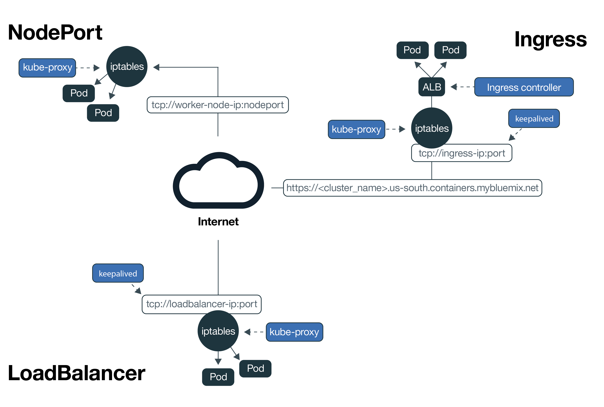
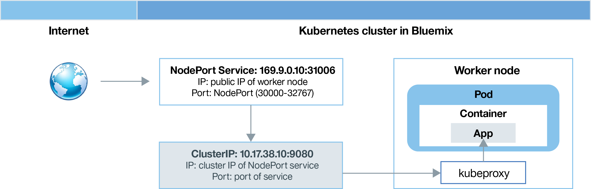
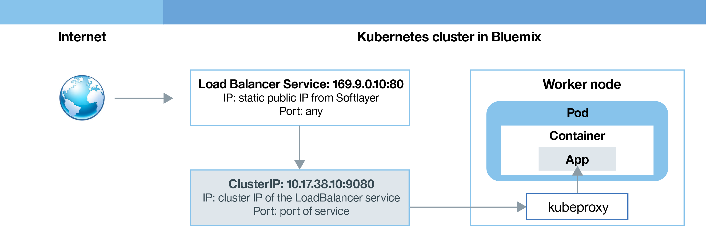
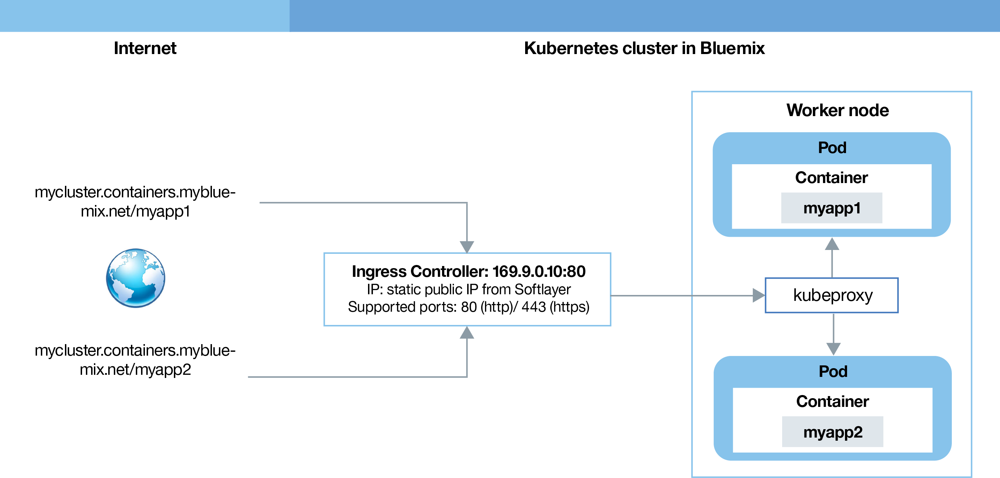

---

copyright:
  years: 2014, 2018
lastupdated: "2018-01-12"

---

{:new_window: target="_blank"}
{:shortdesc: .shortdesc}
{:screen: .screen}
{:pre: .pre}
{:table: .aria-labeledby="caption"}
{:codeblock: .codeblock}
{:tip: .tip}
{:download: .download}

# Planning external networking
{: #planning}

When you create a cluster, every cluster must be connected to a public VLAN. The public VLAN determines the public IP address that is assigned to a worker node during cluster creation.
{:shortdesc}

The public network interface for the worker nodes in both lite and standard clusters is protected by Calico network policies. These policies block most inbound traffic by default. However, inbound traffic that is necessary for Kubernetes to function is allowed, as are connections to NodePort, Loadbalancer, and Ingress services. For more information about these policies, inlcuding how to modify them, see [Network policies](cs_network_policy.html#network_policies).

|Cluster type|Manager of the public VLAN for the cluster|
|------------|------------------------------------------|
|Lite clusters in {{site.data.keyword.Bluemix_notm}}|{{site.data.keyword.IBM_notm}}|
|Standard clusters in {{site.data.keyword.Bluemix_notm}}|You in your IBM Cloud infrastructure (SoftLayer) account|
{: caption="VLAN management responsibilities" caption-side="top"}

For information about in-cluster network communication between worker nodes and pods, see [In-cluster networking](cs_secure.html#in_cluster_network). For information about securely connecting apps running in a Kubernetes cluster to an on-premises network or to apps that are external to your cluster, see [Setting up VPN connectivity](cs_vpn.html).

## Allowing public access to apps
{: #public_access}

To make an app publicly available to the internet, you must update your configuration file before you deploy the app into a cluster.
{:shortdesc}

*Kubernetes data plane in {{site.data.keyword.containershort_notm}}*

The diagram shows how Kubernetes carries user network traffic in {{site.data.keyword.containershort_notm}}. Depending on whether you created a lite or a standard cluster, different ways exist to make your app accessible from the internet.

<dl>
<dt><a href="#nodeport" target="_blank">NodePort service</a> (lite and standard clusters)</dt>
<dd>
 <ul>
  <li>Expose a public port on every worker node and use the public IP address of any worker node to publicly access your service in the cluster.</li>
  <li>Iptables is a Linux kernel feature that load balances requests across the app's pods, provides high performance networking routing, and provides network access control.</li>
  <li>The public IP address of the worker node is not permanent. When a worker node is removed or re-created, a new public IP address is assigned to the worker node.</li>
  <li>The NodePort service is great for testing public access. It can also be used if you only need public access for a short amount of time.</li>
 </ul>
</dd>
<dt><a href="#loadbalancer" target="_blank">LoadBalancer service</a> (standard clusters only)</dt>
<dd>
 <ul>
  <li>Every standard cluster is provisioned with 4 portable public and 4 portable private IP addresses that you can use to create an external TCP/ UDP load balancer for your app.</li>
  <li>Iptables is a Linux kernel feature that load balances requests across the app's pods, provides high performance networking routing, and provides network access control.</li>
  <li>The portable public IP address that is assigned to the load balancer is permanent and does not change when a worker node is re-created in the cluster.</li>
  <li>You can customize your load balancer by exposing any port that your app requires.</li></ul>
</dd>
<dt><a href="#ingress" target="_blank">Ingress</a> (standard clusters only)</dt>
<dd>
 <ul>
  <li>Expose multiple apps in your cluster by creating one external HTTP or HTTPS load balancer that uses a secured and unique public entrypoint to route incoming requests to your apps.</li>
  <li>You can use one public route to expose multiple apps in your cluster as services.</li>
  <li>Ingress consists of three main components: the Ingress resource, the Ingress controller, and the application load balancer.
   <ul>
    <li>The Ingress resource defines the rules for how to route and load balance incoming requests for an app.</li>
    <li>The Ingress controller enables the application load balancer, which listens for incoming HTTP or HTTPS service requests and forwards requests based on the rules defined for each Ingress resource.</li>
    <li>The application load balancer load balances requests across the apps's pods.
   </ul>
  <li>Use Ingress if you want to implement your own load balancer with custom routing rules and if you need SSL termination for your apps.</li>
 </ul>
</dd></dl>

To choose the best networking option for your application, you can follow this decision tree:

<map name="networking_map" id="networking_map">
<area href="/docs/containers/cs_nodeport.html#config" alt="Nodeport service" shape="circle" coords="52, 283, 45"/>
<area href="/docs/containers/cs_loadbalancer.html#config" alt="Loadbalancer service" shape="circle" coords="247, 419, 44"/>
<area href="/docs/containers/cs_ingress.html#config" alt="Ingress service" shape="circle" coords="445, 420, 45"/>
</map>

 

## Expose an app to the internet by using a NodePort service
{: #nodeport}

Expose a public port on your worker node and use the public IP address of the worker node to access your service in the cluster publicly from the internet.
{:shortdesc}

When you expose your app by creating a Kubernetes service of type NodePort, a NodePort in the range of 30000 - 32767 and an internal cluster IP address is assigned to the service. The NodePort service serves as the external entry point for incoming requests for your app. The assigned NodePort is publicly exposed in the kubeproxy settings of each worker node in the cluster. Every worker node starts listening on the assigned NodePort for incoming requests for the service. To access the service from the internet, you can use the public IP address of any worker node that was assigned during cluster creation and the NodePort in the format `<ip_address>:<nodeport>`. In addition to the public IP address, a NodePort service is available over the private IP address of a worker node.

The following diagram shows how communication is directed from the internet to an app when a NodePort service is configured.

As depicted in the diagram, when a request arrives at the NodePort service, it is automatically forwarded to the internal cluster IP of the service and further forwarded from the `kube-proxy` component to the private IP address of the pod where the app is deployed. The cluster IP is accessible inside the cluster only. If you have multiple replicas of your app running in different pods, the `kube-proxy` component load balances incoming requests across all replicas.

**Note:** The public IP address of the worker node is not permanent. When a worker node is removed or re-created, a new public IP address is assigned to the worker node. You can use the NodePort service for testing the public access for your app or when public access is needed for a short amount of time only. When you require a stable public IP address and more availability for your service, expose your app by using a [LoadBalancer service](#loadbalancer) or [Ingress](#ingress).

For instructions on how to create a service of type NodePort with {{site.data.keyword.containershort_notm}}, see [Configuring public access to an app by using the NodePort service type](cs_nodeport.html#config).

 

## Expose an app to the internet by using a LoadBalancer service
{: #loadbalancer}

Expose a port and use the public or private IP address for the load balancer to access the app.
{:shortdesc}

When you create a standard cluster, {{site.data.keyword.containershort_notm}} automatically requests five portable public and five portable private IP addresses and provisions them into your IBM Cloud infrastructure (SoftLayer) account during cluster creation. Two of the portable IP addresses, one public and one private, are used for [Ingress application load balancers](#ingress). Four portable public and four portable private IP addresses can be used to expose apps by creating a LoadBalancer service.

When you create a Kubernetes LoadBalancer service in a cluster on a public VLAN, an external load balancer is created. One of the four available public IP addresses is assigned to the load balancer. If no portable public IP address is available, the creation of your LoadBalancer service fails. The LoadBalancer service serves as the external entry point for incoming requests for the app. Unlike with NodePort services, you can assign any port to your load balancer and are not bound to a certain port range. The portable public IP address that is assigned to your LoadBalancer service is permanent and does not change when a worker node is removed or re-created. Therefore, the LoadBalancer service is more available than the NodePort service. To access the LoadBalancer service from the internet, use the public IP address of your load balancer and the assigned port in the format `<ip_address>:<port>`.

The following diagram shows how the LoadBalancer directs communication from the internet to an app:

As depicted in the diagram, when a request arrives at the LoadBalancer service, the request is automatically forwarded to the internal cluster IP address that is assigned to the LoadBalancer service during service creation. The cluster IP address is accessible inside the cluster only. From the cluster IP address, incoming requests are further forwarded to the `kube-proxy` component of your worker node. Then the requests are forwarded to the private IP address of the pod where the app is deployed. If you have multiple replicas of your app that are running in different pods, the `kube-proxy` component load balances incoming requests across all replicas.

If you use a LoadBalancer service, a node port is also available on each IP address of any worker node. To block access to node port while you are using a LoadBalancer service, see [Blocking incoming traffic](cs_network_policy.html#block_ingress).

Your options for IP addresses when you create a LoadBalancer service are as follows:

- If your cluster is on a public VLAN, a portable public IP address is used.
- If your cluster is available on a private VLAN only, then a portable private IP address is used.
- You can request a portable public or private IP address for a LoadBalancer service by adding an annotation to the configuration file: `service.kubernetes.io/ibm-load-balancer-cloud-provider-ip-type: <public_or_private>`.

For instructions on how to create a LoadBalancer service with {{site.data.keyword.containershort_notm}}, see [Configuring public access to an app by using the load balancer service type](cs_loadbalancer.html#config).

 

## Expose an app to the internet with Ingress
{: #ingress}

Ingress allows you to expose multiple services in your cluster and make them publicly available by using a single public entry point.
{:shortdesc}

Rather than creating a load balancer service for each app that you want to expose to the public, Ingress provides a unique public route that lets you forward public requests to apps inside and outside your cluster based on their individual paths. Ingress consists of two main components. The Ingress resource defines the rules for how to route incoming requests for an app. All Ingress resources must be registered with the Ingress controller that listens for incoming HTTP or HTTPS service requests and forwards requests based on the rules defined for each Ingress resource.

When you create a standard cluster, {{site.data.keyword.containershort_notm}} automatically creates a highly available Ingress controller for your cluster and assigns a unique public route with the format `<cluster_name>.<region>.containers.mybluemix.net` to it. The public route is linked to a portable public IP address that is provisioned into your IBM Cloud infrastructure (SoftLayer) account during cluster creation.

The following diagram shows how Ingress directs communication from the internet to an app:

To expose an app via Ingress, you must create a Kubernetes service for your app and register this service with the Ingress controller by defining an Ingress resource. The Ingress resource specifies the path that you want to append to the public route to form a unique URL for your exposed app, like for example: `mycluster.us-south.containers.mybluemix.net/myapp`. When you enter this route into your web browser, as depicted in the diagram, the request is sent to the linked portable public IP address of the Ingress controller. The Ingress controller checks if a routing rule for the `myapp` path in the `mycluster` cluster exists. If a matching rule is found, the request including the individual path is forwarded to the pod where the app is deployed, considering the rules that were defined in the original Ingress resource object. In order for the app to process incoming requests, make sure that your app listens on the individual path that you defined in the Ingress resource.

You can configure the Ingress controller to manage incoming network traffic for your apps for the following scenarios:

-   Use the IBM-provided domain without TLS termination
-   Use the IBM-provided domain with TLS termination
-   Use a custom domain with TLS termination
-   Use the IBM-provided or a custom domain with TLS termination to access apps outside your cluster
-   Use a private application load balancer and a custom domain without TLS termination
-   Use a private application load balancer and a customer domain with TLS termination
-   Add capabilities to your application load balancer by using annotations

For instructions on how to use Ingress with {{site.data.keyword.containershort_notm}}, see [Configuring public access to an app by using Ingress](cs_ingress.html#ingress).

 

