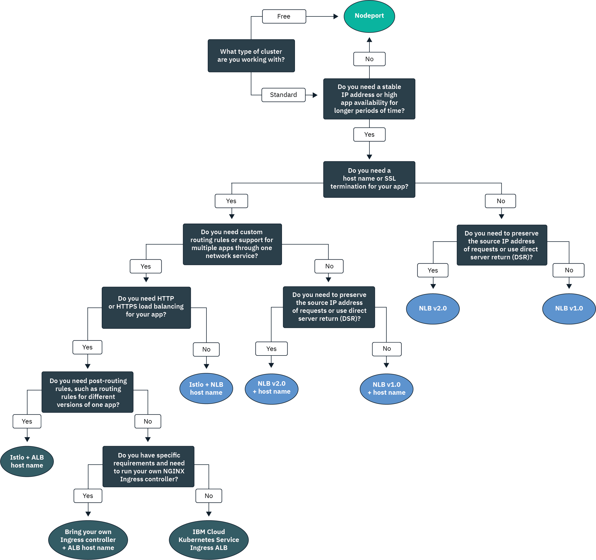

---

copyright:
  years: 2014, 2019
lastupdated: "2019-07-19"

keywords: kubernetes, iks

subcollection: containers

---

{:new_window: target="_blank"}
{:shortdesc: .shortdesc}
{:screen: .screen}
{:pre: .pre}
{:table: .aria-labeledby="caption"}
{:codeblock: .codeblock}
{:tip: .tip}
{:note: .note}
{:important: .important}
{:deprecated: .deprecated}
{:download: .download}
{:preview: .preview}

# Planning in-cluster and external networking for apps
{: #cs_network_planning}

With {{site.data.keyword.containerlong}}, you can manage in-cluster and external networking by making apps publicly or privately accessible.
{: shortdesc}

To quickly get started with app networking, follow this decision tree and click an option to see its setup docs:

<map name="networking_map" id="networking_map">
<area target="" href="/docs/containers?topic=containers-nodeport" alt="NodePort service" coords="52,254,78,260,93,270,101,285,92,302,72,314,49,318,19,309,0,281,18,263" shape="poly">
<area target="" href="/docs/containers?topic=containers-loadbalancer" alt="Network load balancer (NLB) service" coords="288,405,324,414,348,434,350,455,327,471,295,477,246,471,222,446,237,417" shape="poly">
<area target="" href="/docs/containers?topic=containers-ingress" alt="Ingress application load balancer (ALB) service" coords="532,405,568,410,593,427,600,448,582,468,554,477,508,476,467,463,454,441,474,419" shape="poly">
</map>

## Understanding load balancing for apps through Kubernetes service discovery
{: #in-cluster}

Kubernetes service discovery provides apps with a network connection by using network services and a local Kubernetes proxy.
{: shortdesc}

**Services** 
All pods that are deployed to a worker node are assigned a private IP address in the 172.30.0.0/16 range and are routed between worker nodes only. To avoid conflicts, don't use this IP range on any nodes that communicate with your worker nodes. Worker nodes and pods can securely communicate on the private network by using private IP addresses. However, when a pod crashes or a worker node needs to be re-created, a new private IP address is assigned.

Instead of trying to track changing private IP addresses for apps that must be highly available, you can use built-in Kubernetes service discovery features to expose apps as services. A Kubernetes service groups a set of pods and provides a network connection to these pods. The service selects the targeted pods that it routes traffic to via labels.

A service provides connectivity between your app pods and other services in the cluster without exposing the actual private IP address of each pod. Services are assigned an in-cluster IP address, the `clusterIP`, that is accessible inside the cluster only. This IP address is tied to the service for its entire lifespan and does not change while the service exists.
* Newer clusters: In clusters that were created after February 2018 in the dal13 zone or after October 2017 in any other zone, services are assigned an IP from one of the 65,000 IPs in the 172.21.0.0/16 range.
* Older clusters: In clusters that were created before February 2018 in the dal13 zone or before October 2017 in any other zone, services are assigned an IP from one of 254 IPs in the 10.10.10.0/24 range. If you hit the limit of 254 services and need more services, you must create a new cluster.

To avoid conflicts, don't use this IP range on any nodes that communicate with your worker nodes. A DNS lookup entry is also created for the service and stored in the `kube-dns` component of the cluster. The DNS entry contains the name of the service, the namespace where the service was created, and the link to the assigned in-cluster IP address.

**`kube-proxy`** 
To provide basic load balancing of all TCP and UDP network traffic for services, a local Kubernetes network proxy, `kube-proxy`, runs as a daemon on each worker node in the `kube-system` namespace. `kube-proxy` uses Iptables rules, a Linux kernel feature, to direct requests to the pod behind a service equally, independent of pods' in-cluster IP addresses and the worker node that they are deployed to.

For example, apps inside the cluster can access a pod behind a cluster service by using the service's in-cluster IP or by sending a request to the name of the service. When you use the name of the service, `kube-proxy` looks up the name in the cluster DNS provider and routes the request to the in-cluster IP address of the service.

If you use a service that provides both an internal cluster IP address and an external IP address, clients outside of the cluster can send requests to the service's external public or private IP address. `kube-proxy` forwards the requests to the service's in-cluster IP address and load balances between the app pods behind the service.

The following image demonstrates how Kubernetes forwards public network traffic through `kube-proxy` and NodePort, LoadBalancer, or Ingress services in {{site.data.keyword.containerlong_notm}}.

<figure>
 
 <figcaption>How Kubernetes forwards public network traffic through NodePort, LoadBalancer, and Ingress services in {{site.data.keyword.containerlong_notm}}</figcaption>
</figure>

 

## Understanding Kubernetes service types
{: #external}

Kubernetes supports four basic types of network services: `ClusterIP`, `NodePort`, `LoadBalancer`, and `Ingress`. `ClusterIP` services make your apps accessible internally to allow communication between pods in your cluster only. `NodePort`, `LoadBalancer`, and `Ingress` services make your apps externally accessible from the public internet or a private network.
{: shortdesc}

<dl>
<dt>[ClusterIP](https://kubernetes.io/docs/concepts/services-networking/service/#defining-a-service)</dt>
<dd>You can expose apps only as cluster IP services on the private network. A `clusterIP` service provides an in-cluster IP address that is accessible by other pods and services inside the cluster only. No external IP address is created for the app. To access a pod behind a cluster service, other apps in the cluster can either use the in-cluster IP address of the service or send a request by using the name of the service. When a request reaches the service, the service forwards requests to the pods equally, independent of pods' in-cluster IP addresses and the worker node that they are deployed to. Note that if you do not specify a `type` in a service's YAML configuration file, the `ClusterIP` type is created by default.</dd>

<dt>[NodePort](/docs/containers?topic=containers-nodeport)</dt>
<dd>When you expose apps with a NodePort service, a NodePort in the range of 30000 - 32767 and an internal cluster IP address is assigned to the service. To access the service from outside the cluster, you use the public or private IP address of any worker node and the NodePort in the format <code>&lt;IP_address&gt;:&lt;nodeport&gt;</code>. However, the public and private IP addresses of the worker node are not permanent. When a worker node is removed or re-created, a new public and a new private IP address are assigned to the worker node. NodePorts are ideal for testing public or private access or providing access for only a short amount of time.</dd>

<dt>[LoadBalancer (NLB)](/docs/containers?topic=containers-loadbalancer)</dt>
<dd>Every standard cluster is provisioned with four portable public and four portable private IP addresses that you can use to create a layer 4 TCP/UDP network load balancer (NLB) for your app. You can customize your NLB by exposing any port that your app requires. The portable public and private IP addresses that are assigned to the NLB are permanent and do not change when a worker node is re-created in the cluster. You can create a host name for your app that registers public NLB IP addresses with a DNS entry. You can also enable health check monitors on the NLB IPs for each host name.</dd>

<dt>[Ingress (ALB)](/docs/containers?topic=containers-ingress)</dt>
<dd>Expose multiple apps in a cluster by creating one layer 7 HTTP, HTTPS, or TCP Ingress application load balancer (ALB). The ALB uses a secured and unique public or private entry point, an Ingress subdomain, to route incoming requests to your apps. You can use one route to expose multiple apps in your cluster as services. Ingress consists of three components:<ul>
  <li>The Ingress resource defines the rules for how to route and load balance incoming requests for an app.</li>
  <li>The ALB listens for incoming HTTP, HTTPS, or TCP service requests. It forwards requests across the apps' pods based on the rules that you defined in the Ingress resource.</li>
  <li>The multizone load balancer (MZLB) handles all incoming requests to your apps and load balances the requests among the ALBs in the various zones. It also enables health checks on the ALB IP address in each zone.</li></ul></dd>
</dl>

 
The following table compares the features of each network service type.

|Characteristics|ClusterIP|NodePort|LoadBalancer (NLB)|Ingress (ALB)|
|---------------|---------|--------|------------|-------|
|Free clusters||| | |
|Standard clusters|||||
|Externally accessible| ||||
|Stable external IP| | |||
|External host name| | |||
|SSL termination| | |||
|HTTP(S) load balancing| | | ||
|Custom routing rules| | | ||
|Multiple apps per service| | | ||
{: caption="Characteristics of Kubernetes network service types" caption-side="top"}

To choose a load-balancing deployment pattern based on one or more of these network services, see [Choosing a deployment pattern for public external load balancing](#pattern_public) or [Choosing a deployment pattern for private external load balancing](#private_access).

 

## Planning public external load balancing
{: #public_access}

Publicly expose an app in your cluster to the internet.
{: shortdesc}

When you create a Kubernetes cluster in {{site.data.keyword.containerlong_notm}}, you can connect the cluster to a public VLAN. The public VLAN determines the public IP address that is assigned to each worker node, which provides each worker node with a public network interface. Public networking services connect to this public network interface by providing your app with a public IP address and, optionally, a public URL. When an app is publicly exposed, anyone that has the public service IP address or the URL that you set up for your app can send a request to your app. For this reason, expose as few apps as possible. Expose an app to the public only when you ready to accept traffic from external web clients or users.

The public network interface for worker nodes is protected by [predefined Calico network policy settings](/docs/containers?topic=containers-network_policies#default_policy) that are configured on every worker node during cluster creation. By default, all outbound network traffic is allowed for all worker nodes. Inbound network traffic is blocked except for a few ports. These ports are opened so that IBM can monitor network traffic and automatically install security updates for the Kubernetes master, and so that connections can be established to NodePort, LoadBalancer, and Ingress services. For more information about these policies, including how to modify them, see [Network policies](/docs/containers?topic=containers-network_policies#network_policies).

To make an app publicly available to the internet, choose a load-balancing deployment pattern for your app to create public NodePort, LoadBalancer, or Ingress services.

### Choosing a deployment pattern for public external load balancing
{: #pattern_public}

When it comes to exposing an app with a network service, you have several choices for deployment patterns. To quickly get started, follow the decision tree to choose a deployment pattern. For more information about each deployment pattern, why you might use it, and how to set it up, see the table following the decision tree. For basic information about the networking services that these deployment patterns use, see [Understanding Kubernetes service types](#external).
{: shortdesc}

<figure>
  
  <figcaption>Use this decision tree to choose the best networking deployment pattern for your app. See the following table for information about each deployment pattern.</figcaption>
</figure>

<table summary="This table reads left to right about the name, characteristics, use cases, and deployment steps of public network deployment patterns.">
<caption>Characteristics of public network deployment patterns in IBM Cloud Kubernetes Service</caption>
<col width="10%">
<col width="25%">
<col width="25%">
<thead>
<th>Name</th>
<th>Load-balancing method</th>
<th>Use case</th>
<th>Implementation</th>
</thead>
<tbody>
<tr>
<td>NodePort</td>
<td>Port on a worker node that exposes the app on the worker's public IP address</td>
<td>Test public access to one app or provide access for only a short amount of time.</td>
<td>[Create a public NodePort service](/docs/containers?topic=containers-nodeport#nodeport_config).</td>
</tr><tr>
<td>NLB v1.0 (+ host name)</td>
<td>Basic load balancing that exposes the app with an IP address or a host name</td>
<td>Quickly expose one app to the public with an IP address or a host name that supports SSL termination.</td>
<td><ol><li>Create a public network load balancer (NLB) 1.0 in a [single-](/docs/containers?topic=containers-loadbalancer#lb_config) or [multizone](/docs/containers?topic=containers-loadbalancer#multi_zone_config) cluster.</li><li>Optionally [register](/docs/containers?topic=containers-loadbalancer_hostname) a host name and health checks.</li></ol></td>
</tr><tr>
<td>NLB v2.0 (+ host name)</td>
<td>DSR load balancing that exposes the app with an IP address or a host name</td>
<td>Expose an app that might receive high levels of traffic to the public with an IP address or a host name that supports SSL termination.</td>
<td><ol><li>Complete the [prerequisites](/docs/containers?topic=containers-loadbalancer-v2#ipvs_provision).</li><li>Create a public NLB 2.0 in a [single-](/docs/containers?topic=containers-loadbalancer-v2#ipvs_single_zone_config) or [multizone](/docs/containers?topic=containers-loadbalancer-v2#ipvs_multi_zone_config) cluster.</li><li>Optionally [register](/docs/containers?topic=containers-loadbalancer_hostname) a host name and health checks.</li></ol></td>
</tr><tr>
<td>Istio + NLB host name</td>
<td>Basic load balancing that exposes the app with a host name and uses Istio routing rules</td>
<td>Implement Istio post-routing rules, such as rules for different versions of one app microservice, and expose an Istio-managed app with a public host name.</li></ol></td>
<td><ol><li>Install the [managed Istio add-on](/docs/containers?topic=containers-istio#istio_install).</li><li>Include your app in the [Istio service mesh](/docs/containers?topic=containers-istio#istio_sidecar).</li><li>Register the default Istio load balancer with [a host name](/docs/containers?topic=containers-istio#istio_expose).</li></ol></td>
</tr><tr>
<td>Ingress ALB</td>
<td>HTTPS load balancing that exposes the app with a host name and uses custom routing rules</td>
<td>Implement custom routing rules and SSL termination for multiple apps.</td>
<td><ol><li>Create an [Ingress service](/docs/containers?topic=containers-ingress#ingress_expose_public) for the public ALB.</li><li>Customize ALB routing rules with [annotations](/docs/containers?topic=containers-ingress_annotation).</li></ol></td>
</tr><tr>
<td>Bring your own Ingress controller + ALB or NLB host name</td>
<td>HTTPS load balancing with a custom Ingress controller that exposes the app with the IBM-provided ALB host name and uses custom routing rules</td>
<td>Implement custom routing rules or other specific requirements for custom tuning for multiple apps.</td>
<td>[Deploy your Ingress controller and leverage an IBM-provided host name](/docs/containers?topic=containers-ingress-user_managed).</td>
</tr>
</tbody>
</table>

Still want more details about the load-balancing deployment patterns that are available in {{site.data.keyword.containerlong_notm}}? Check out this [blog post ](https://www.ibm.com/blogs/bluemix/2018/10/ibm-cloud-kubernetes-service-deployment-patterns-for-maximizing-throughput-and-availability/).
{: tip}

 

## Planning private external load balancing
{: #private_access}

Privately expose an app in your cluster to the private network only.
{: shortdesc}

When you deploy an app in a Kubernetes cluster in {{site.data.keyword.containerlong_notm}}, you might want to make the app accessible to only users and services that are on the same private network as your cluster. Private load balancing is ideal for making your app available to requests from outside the cluster without exposing the app to the general public. You can also use private load balancing to test access, request routing, and other configurations for your app before you later expose your app to the public with public network services.

As an example, say that you create a private NLB for your app. This private NLB can be accessed by:
* Any pod in that same cluster.
* Any pod in any cluster in the same {{site.data.keyword.cloud_notm}} account.
* If you have [VRF or VLAN spanning](/docs/containers?topic=containers-subnets#basics_segmentation) enabled, any system that is connected to any of the private VLANs in the same {{site.data.keyword.cloud_notm}} account.
* If you're not in the {{site.data.keyword.cloud_notm}} account but still behind the company firewall, any system through a VPN connection to the subnet that the NLB IP is on
* If you're in a different {{site.data.keyword.cloud_notm}} account, any system through a VPN connection to the subnet that the NLB IP is on.

To make an app available over a private network only, choose a load-balancing deployment pattern based on your cluster's VLAN setup:
* [Public and private VLAN setup](#private_both_vlans)
* [Private VLAN only setup](#plan_private_vlan)

### Setting up private load balancing in a public and private VLAN setup
{: #private_both_vlans}

When your worker nodes are connected to both a public and a private VLAN, you can make your app accessible from a private network only by creating private NodePort, LoadBalancer, or Ingress services. Then, you can create Calico policies to block public traffic to the services.
{: shortdesc}

The public network interface for worker nodes is protected by [predefined Calico network policy settings](/docs/containers?topic=containers-network_policies#default_policy) that are configured on every worker node during cluster creation. By default, all outbound network traffic is allowed for all worker nodes. Inbound network traffic is blocked except for a few ports. These ports are opened so that IBM can monitor network traffic and automatically install security updates for the Kubernetes master, and so that connections can be established to NodePort, LoadBalancer, and Ingress services.

Because the default Calico network policies allow inbound public traffic to these services, you can create Calico policies to instead block all public traffic to the services. For example, a NodePort service opens a port on a worker node over both the private and public IP address of the worker node. An NLB service with a portable private IP address opens a public NodePort on every worker node. You must create a [Calico preDNAT network policy](/docs/containers?topic=containers-network_policies#block_ingress) to block public NodePorts.

Check out the following load-balancing deployment patterns for private networking:

|Name|Load-balancing method|Use case|Implementation|
|----|---------------------|--------|--------------|
|NodePort|Port on a worker node that exposes the app on the worker's private IP address|Test private access to one app or provide access for only a short amount of time.|<ol><li>[Create a NodePort service](/docs/containers?topic=containers-nodeport).</li><li>A NodePort service opens a port on a worker node over both the private and public IP address of the worker node. You must use a [Calico preDNAT network policy](/docs/containers?topic=containers-network_policies#block_ingress) to block traffic to the public NodePorts.</li></ol>|
|NLB v1.0|Basic load balancing that exposes the app with a private IP address|Quickly expose one app to a private network with a private IP address.|<ol><li>[Create a private NLB service](/docs/containers?topic=containers-loadbalancer).</li><li>An NLB with a portable private IP address still has a public node port open on every worker node. Create a [Calico preDNAT network policy](/docs/containers?topic=containers-network_policies#block_ingress) to block traffic to the public NodePorts.</li></ol>|
|NLB v2.0|DSR load balancing that exposes the app with a private IP address|Expose an app that might receive high levels of traffic to a private network with an IP address.|<ol><li>[Create a private NLB service](/docs/containers?topic=containers-loadbalancer).</li><li>An NLB with a portable private IP address still has a public node port open on every worker node. Create a [Calico preDNAT network policy](/docs/containers?topic=containers-network_policies#block_ingress) to block traffic to the public NodePorts.</li></ol>|
|Ingress ALB|HTTPS load balancing that exposes the app with a host name and uses custom routing rules|Implement custom routing rules and SSL termination for multiple apps.|<ol><li>[Disable the public ALB.](/docs/containers?topic=containers-cli-plugin-kubernetes-service-cli#cs_alb_configure)</li><li>[Enable the private ALB and create an Ingress resource](/docs/containers?topic=containers-ingress#ingress_expose_private).</li><li>Customize ALB routing rules with [annotations](/docs/containers?topic=containers-ingress_annotation).</li></ol>|
{: caption="Characteristics of network deployment patterns for a public and a private VLAN setup" caption-side="top"}

 

### Setting up private load balancing for a private VLAN only setup
{: #plan_private_vlan}

When your worker nodes are connected to a private VLAN only, you can make your app externally accessible from a private network only by creating private NodePort, LoadBalancer, or Ingress services.
{: shortdesc}

If your cluster is connected to a private VLAN only and you enable the master and worker nodes to communicate through a private-only service endpoint, you cannot automatically expose your apps to a private network. You must set up a gateway device, such as a [VRA (Vyatta)](/docs/infrastructure/virtual-router-appliance?topic=virtual-router-appliance-about-the-vra) or an [FSA](/docs/services/vmwaresolutions/services?topic=vmware-solutions-fsa_considerations) to act as your firewall and block or allow traffic. Because your worker nodes aren't connected to a public VLAN, no public traffic is routed to NodePort, LoadBalancer, or Ingress services. However, you must open up the required ports and IP addresses in your gateway device firewall to permit inbound traffic to these services.

Check out the following load-balancing deployment patterns for private networking:

|Name|Load-balancing method|Use case|Implementation|
|----|---------------------|--------|--------------|
|NodePort|Port on a worker node that exposes the app on the worker's private IP address|Test private access to one app or provide access for only a short amount of time.|<ol><li>[Create a NodePort service](/docs/containers?topic=containers-nodeport).</li><li>In your private firewall, open the port that you configured when you deployed the service to the private IP addresses for all of the worker nodes to allow traffic to. To find the port, run `kubectl get svc`. The port is in the 20000-32000 range.</li></ol>|
|NLB v1.0|Basic load balancing that exposes the app with a private IP address|Quickly expose one app to a private network with a private IP address.|<ol><li>[Create a private NLB service](/docs/containers?topic=containers-loadbalancer).</li><li>In your private firewall, open the port that you configured when you deployed the service to the NLB's private IP address.</li></ol>|
|NLB v2.0|DSR load balancing that exposes the app with a private IP address|Expose an app that might receive high levels of traffic to a private network with an IP address.|<ol><li>[Create a private NLB service](/docs/containers?topic=containers-loadbalancer).</li><li>In your private firewall, open the port that you configured when you deployed the service to the NLB's private IP address.</li></ol>|
|Ingress ALB|HTTPS load balancing that exposes the app with a host name and uses custom routing rules|Implement custom routing rules and SSL termination for multiple apps.|<ol><li>Configure a [DNS service that is available on the private network ](https://kubernetes.io/docs/tasks/administer-cluster/dns-custom-nameservers/).</li><li>[Enable the private ALB and create an Ingress resource](/docs/containers?topic=containers-ingress#private_ingress).</li><li>In your private firewall, open port 80 for HTTP or port 443 for HTTPS to the IP address for the private ALB.</li><li>Customize ALB routing rules with [annotations](/docs/containers?topic=containers-ingress_annotation).</li></ol>|
{: caption="Characteristics of network deployment patterns for a private VLAN only setup" caption-side="top"}
