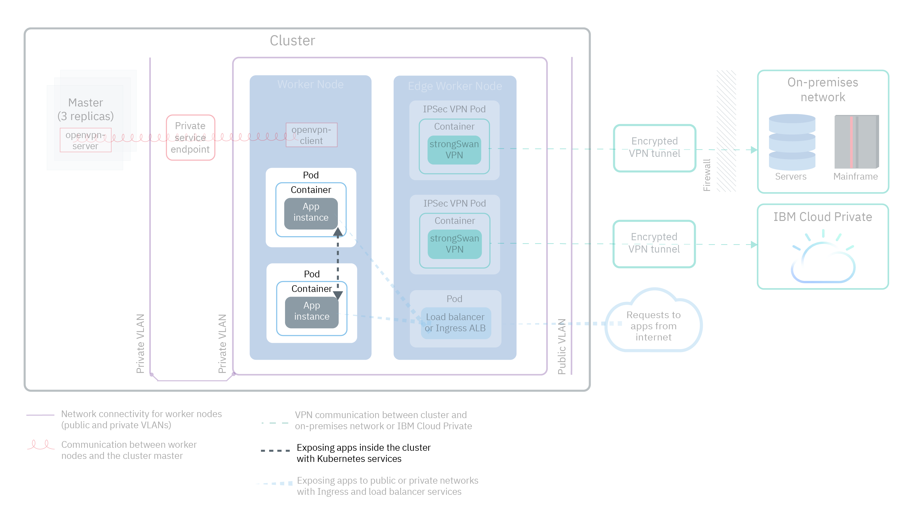
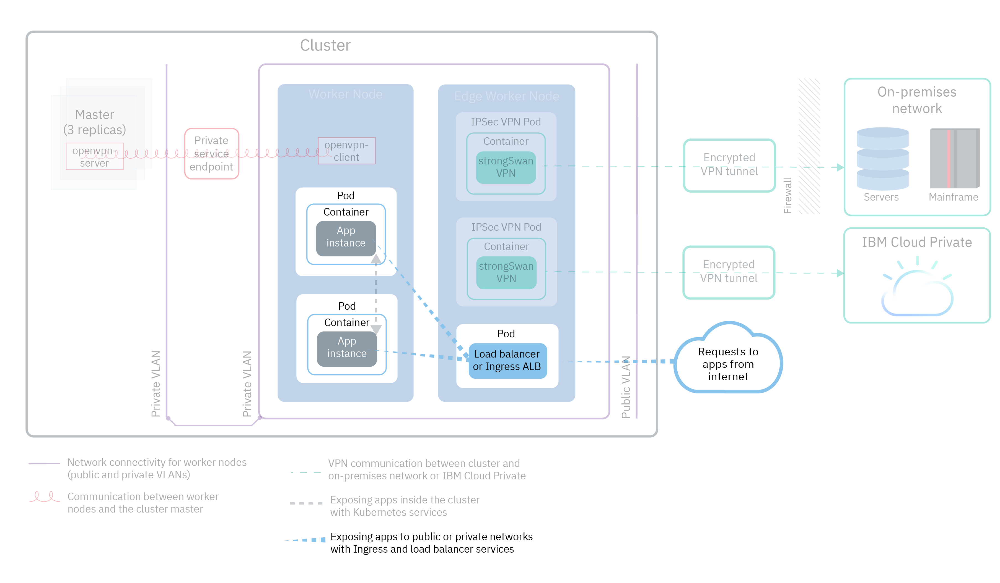
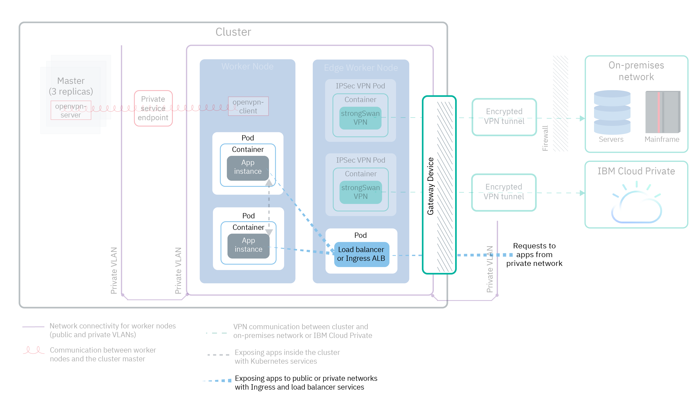

---

copyright:
  years: 2014, 2019
lastupdated: "2019-04-01"

keywords: kubernetes, iks

subcollection: containers

---

{:new_window: target="_blank"}
{:shortdesc: .shortdesc}
{:screen: .screen}
{:pre: .pre}
{:table: .aria-labeledby="caption"}
{:codeblock: .codeblock}
{:tip: .tip}
{:note: .note}
{:important: .important}
{:deprecated: .deprecated}
{:download: .download}

# Planning to expose your apps with in-cluster and external networking
{: #cs_network_planning}

With {{site.data.keyword.containerlong}}, you can manage in-cluster and external networking by making apps publicly or privately accessible.
{: shortdesc}

## Exposing apps to traffic inside the cluster through Kubernetes services
{: #in-cluster}

Create Kubernetes discovery services to allow communication between pods in your cluster.
{: shortdesc}

<figure>
 
 <figcaption>Exposing apps inside the cluster with Kubernetes services</figcaption>
</figure>

All pods that are deployed to a worker node are assigned a private IP address in the 172.30.0.0/16 range and are routed between worker nodes only. To avoid conflicts, don't use this IP range on any nodes that communicate with your worker nodes. Worker nodes and pods can securely communicate on the private network by using private IP addresses. However, when a pod crashes or a worker node needs to be re-created, a new private IP address is assigned.

By default, it's difficult to track changing private IP addresses for apps that must be highly available. Instead, you can use the built-in Kubernetes service discovery features to expose apps as cluster IP services on the private network. A Kubernetes service groups a set of pods and provides a network connection to these pods. This connection provides connectivity to other services in the cluster without exposing the actual private IP address of each pod. Services are assigned an in-cluster IP address that is accessible inside the cluster only.
* Older clusters: In clusters that were created before February 2018 in the dal13 zone or before October 2017 in any other zone, the services are assigned an IP from one of 254 IPs in the 10.10.10.0/24 range. If you hit the limit of 254 services and need more services, you must create a new cluster.
* Newer clusters: In clusters that were created after February 2018 in the dal13 zone or after October 2017 in any other zone, the services are assigned an IP from one of the 65,000 IPs in the 172.21.0.0/16 range.

To avoid conflicts, don't use this IP range on any nodes that communicate with your worker nodes. A DNS lookup entry is also created for the service and stored in the `kube-dns` component of the cluster. The DNS entry contains the name of the service, the namespace where the service was created, and the link to the assigned in-cluster IP address.

To access a pod behind a cluster service, apps can either use the in-cluster IP address of the service or send a request by using the name of the service. When you use the name of the service, the name is looked up in the `kube-dns` component and routed to the in-cluster IP address of the service. When a request reaches the service, the service forwards requests to the pods equally, independent of pods' in-cluster IP addresses and the worker node that they are deployed to.

 

## Choosing a NodePort, LoadBalancer, or Ingress service to expose apps to traffic outside the cluster
{: #external}

To make your apps externally accessible from the public internet or a private network, {{site.data.keyword.containerlong_notm}} supports three networking services.
{:shortdesc}

**[NodePort service](/docs/containers?topic=containers-nodeport)** (free and standard clusters)
* Expose a port on every worker node and use the public or private IP address of any worker node to access your service in the cluster.
* Iptables is a Linux kernel feature that load balances requests across the app's pods, provides high-performance networking routing, and provides network access control.
* The public and private IP addresses of the worker node are not permanent. When a worker node is removed or re-created, a new public and a new private IP address are assigned to the worker node.
* The NodePort service is great for testing public or private access. It can also be used if you need public or private access for only a short amount of time.

**[LoadBalancer service](/docs/containers?topic=containers-loadbalancer)** (standard clusters only)
* Every standard cluster is provisioned with four portable public and four portable private IP addresses that you can use to create an external TCP/UDP load balancer for your app. You can customize your load balancer by exposing any port that your app requires.
* Iptables is a Linux kernel feature that load balances requests across the app's pods, provides high-performance networking routing, and provides network access control.
* The portable public and private IP addresses that are assigned to the load balancer are permanent and do not change when a worker node is re-created in the cluster.

**[Ingress](/docs/containers?topic=containers-ingress)** (standard clusters only)
* Expose multiple apps in a cluster by creating one external HTTP, HTTPS, or TCP application load balancer (ALB). The ALB uses a secured and unique public or private entry point, an Ingress subdomain, to route incoming requests to your apps.
* You can use one route to expose multiple apps in your cluster as services.
* Ingress consists of three components:
  * The Ingress resource defines the rules for how to route and load balance incoming requests for an app.
  * The ALB listens for incoming HTTP, HTTPS, or TCP service requests. It forwards requests across the apps' pods based on the rules that you defined in the Ingress resource.
  * The multizone load balancer (MZLB) handles all incoming requests to your apps and load balances the requests among the ALBs in the various zones. It also enables health checks on the ALB IP address in each zone.
* Use Ingress if you need to implement your own ALB with custom routing rules and need SSL termination for your apps.

To choose the best networking service for your app, you can follow this decision tree and click one of the options to get started.

<map name="networking_map" id="networking_map">
<area href="/docs/containers?topic=containers-nodeport" alt="Nodeport service" shape="circle" coords="52, 283, 45"/>
<area href="/docs/containers?topic=containers-loadbalancer" alt="LoadBalancer service" shape="circle" coords="247, 419, 44"/>
<area href="/docs/containers?topic=containers-ingress" alt="Ingress service" shape="circle" coords="445, 420, 45"/>
</map>

Want more details about the load balancing deployment patterns that are available in {{site.data.keyword.containerlong_notm}}? Check out this [blog post ](https://www.ibm.com/blogs/bluemix/2018/10/ibm-cloud-kubernetes-service-deployment-patterns-for-maximizing-throughput-and-availability/).
{: tip}

 

## Planning public external networking for a public and private VLAN setup
{: #public_access}

When you create a Kubernetes cluster in {{site.data.keyword.containerlong_notm}}, you can connect the cluster to a public VLAN. The public VLAN determines the public IP address that is assigned to each worker node, which provides each worker node with a public network interface.
{:shortdesc}

<figure>
 
 <figcaption>Exposing apps to a public network in a default networking setup</figcaption>
</figure>

The public network interface for worker nodes is protected by [predefined Calico network policy settings](/docs/containers?topic=containers-network_policies#default_policy) that are configured on every worker node during cluster creation.

By default, all outbound network traffic is allowed for all worker nodes. Inbound network traffic is blocked except for a few ports. These ports are opened so that IBM can monitor network traffic and automatically install security updates for the Kubernetes master, and so that connections can be established to NodePort, LoadBalancer, and Ingress services. For more information about these policies, including how to modify them, see [Network policies](/docs/containers?topic=containers-network_policies#network_policies).

To make an app publicly available to the internet, you can create a NodePort, LoadBalancer, or Ingress service. To compare each service, see [Choosing a NodePort, LoadBalancer, or Ingress service](#external).

The following diagram shows how Kubernetes forwards public network traffic in {{site.data.keyword.containerlong_notm}}.

 

## Planning private external networking for a public and private VLAN setup
{: #private_both_vlans}

When your worker nodes are connected to both a public and a private VLAN, you can make your app accessible from a private network only by creating private NodePort, LoadBalancer, or Ingress services. Then, you can create Calico policies to block public traffic to the services.
{: shortdesc}

The public network interface for worker nodes is protected by [predefined Calico network policy settings](/docs/containers?topic=containers-network_policies#default_policy) that are configured on every worker node during cluster creation. By default, all outbound network traffic is allowed for all worker nodes. Inbound network traffic is blocked except for a few ports. These ports are opened so that IBM can monitor network traffic and automatically install security updates for the Kubernetes master, and so that connections can be established to NodePort, LoadBalancer, and Ingress services.

If you want to expose your apps over a private network only, you can create private NodePort, a LoadBalancer, or Ingress services.

**NodePort**
* [Create a NodePort service](/docs/containers?topic=containers-nodeport). In addition to the public IP address, a NodePort service is available over the private IP address of a worker node.
* A NodePort service opens a port on a worker node over both the private and public IP address of the worker node. You must use a [Calico preDNAT network policy](/docs/containers?topic=containers-network_policies#block_ingress) to block the public NodePorts.

**LoadBalancer**
* [Create a private LoadBalancer service](/docs/containers?topic=containers-loadbalancer).
* A load balancer service with a portable private IP address still has a public node port open on every worker node. You must use a [Calico preDNAT network policy](/docs/containers?topic=containers-network_policies#block_ingress) to block public node ports on it.

**Ingress**
* When you create a cluster, one public and one private Ingress application load balancer (ALB) are created automatically. Because the public ALB is enabled and the private ALB is disabled by default, you must [disable the public ALB](/docs/containers?topic=containers-cs_cli_reference#cs_alb_configure) and [enable the private ALB](/docs/containers?topic=containers-ingress#private_ingress).
* Then, [create a private Ingress service](/docs/containers?topic=containers-ingress#ingress_expose_private).

Because the default Calico network policies allow inbound public traffic to these services, you can create Calico policies to instead block all public traffic to the services. For example, a NodePort service opens a port on a worker node over both the private and public IP address of the worker node. A load balancer service with a portable private IP address opens a public NodePort on every worker node. You must create a [Calico preDNAT network policy](/docs/containers?topic=containers-network_policies#block_ingress) to block public NodePorts.

As an example, say that you created a private load balancer service. You also created a Calico preDNAT policy to block public traffic from reaching the public NodePorts opened by the load balancer. This private load balancer can be accessed by:
* Any pod in that same cluster
* Any pod in any cluster in the same {{site.data.keyword.Bluemix_notm}} account
* If you have [VLAN spanning enabled](/docs/containers?topic=containers-subnets#subnet-routing), any system that is connected to any of the private VLANs in the same {{site.data.keyword.Bluemix_notm}} account
* If you're not in the {{site.data.keyword.Bluemix_notm}} account but still behind the company firewall, any system through a VPN connection to the subnet that the load balancer IP is on
* If you're in a different {{site.data.keyword.Bluemix_notm}} account, any system through a VPN connection to the subnet that the load balancer IP is on.

 

## Planning private external networking for a private VLAN only setup
{: #plan_private_vlan}

When your worker nodes are connected to a private VLAN only and you enable the master and worker nodes to communicate through [a gateway device](/docs/containers?topic=containers-cs_network_ov#cs_network_ov_master_gateway), you can make your app accessible from a private network only by creating private NodePort, LoadBalancer, or Ingress services.
{: shortdesc}

<figure>
 
 <figcaption>Exposing apps to a private network in a private networking setup</figcaption>
</figure>

Because your worker nodes aren't connected to a public VLAN, no public traffic is routed to these services. You must also [open up the required ports and IP addresses](/docs/containers?topic=containers-firewall#firewall_inbound) in your gateway device firewall to permit inbound traffic to these services.

**NodePort**:
* [Create a private NodePort service](/docs/containers?topic=containers-nodeport). The service is available over the private IP address of a worker node.
* In your private firewall, open the port that you configured when you deployed the service to the private IP addresses for all of the worker nodes to allow traffic to. To find the port, run `kubectl get svc`. The port is in the 20000-32000 range.

**LoadBalancer**
* [Create a private LoadBalancer service](/docs/containers?topic=containers-loadbalancer). If your cluster is available on a private VLAN only, one of the four available portable private IP addresses is used.
* In your private firewall, open the port that you configured when you deployed the service to the load balancer service's private IP address.

**Ingress**:
* You must configure a [DNS service that is available on the private network ](https://kubernetes.io/docs/tasks/administer-cluster/dns-custom-nameservers/).
* When you create a cluster, a private Ingress application load balancer (ALB) is created automatically but is not enabled by default. You must [enable the private ALB](/docs/containers?topic=containers-ingress#private_ingress).
* Then, [create a private Ingress service](/docs/containers?topic=containers-ingress#ingress_expose_private).
* In your private firewall, open port 80 for HTTP or port 443 for HTTPS to the IP address for the private ALB.

If your cluster is connected to a private VLAN only and you enable the master and worker nodes to communicate through a private-only service endpoint, you cannot expose your apps to a private network. You must set up a gateway device, such as a [VRA](/docs/infrastructure/virtual-router-appliance?topic=virtual-router-appliance-about-the-vra) or an [FSA](/docs/services/vmwaresolutions/services?topic=vmware-solutions-fsa_considerations) to act as your firewall and block unwanted traffic. If you do not want to set up a gateway device, you can [create a worker pool](/docs/containers?topic=containers-clusters#add_pool) that is connected to public and private VLANs. Then, you can label these worker nodes as edge nodes and use Calico policies to block all unwanted public traffic. For more information, see [Isolate networking workloads to edge worker nodes](/docs/containers?topic=containers-cs_network_planning#both_vlans_private_edge).
{: note}

