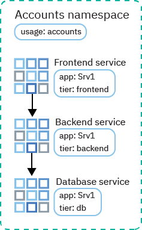
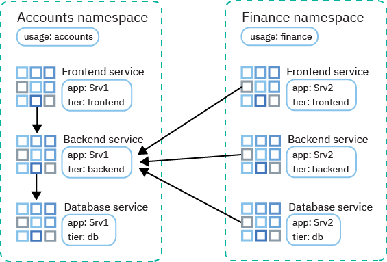

---

copyright:
  years: 2014, 2021
lastupdated: "2021-08-11"

keywords: kubernetes, iks, calico, egress, rules

subcollection: containers

---

{:DomainName: data-hd-keyref="APPDomain"}
{:DomainName: data-hd-keyref="DomainName"}
{:android: data-hd-operatingsystem="android"}
{:api: .ph data-hd-interface='api'}
{:apikey: data-credential-placeholder='apikey'}
{:app_key: data-hd-keyref="app_key"}
{:app_name: data-hd-keyref="app_name"}
{:app_secret: data-hd-keyref="app_secret"}
{:app_url: data-hd-keyref="app_url"}
{:audio: .audio}
{:authenticated-content: .authenticated-content}
{:beta: .beta}
{:c#: .ph data-hd-programlang='c#'}
{:c#: data-hd-programlang="c#"}
{:cli: .ph data-hd-interface='cli'}
{:codeblock: .codeblock}
{:curl: #curl .ph data-hd-programlang='curl'}
{:curl: .ph data-hd-programlang='curl'}
{:deprecated: .deprecated}
{:dotnet-standard: .ph data-hd-programlang='dotnet-standard'}
{:download: .download}
{:external: .external target="_blank"}
{:external: target="_blank" .external}
{:faq: data-hd-content-type='faq'}
{:fuzzybunny: .ph data-hd-programlang='fuzzybunny'}
{:generic: data-hd-operatingsystem="generic"}
{:generic: data-hd-programlang="generic"}
{:gif: data-image-type='gif'}
{:go: .ph data-hd-programlang='go'}
{:help: data-hd-content-type='help'}
{:hide-dashboard: .hide-dashboard}
{:hide-in-docs: .hide-in-docs}
{:important: .important}
{:ios: data-hd-operatingsystem="ios"}
{:java: #java .ph data-hd-programlang='java'}
{:java: .ph data-hd-programlang='java'}
{:java: data-hd-programlang="java"}
{:javascript: .ph data-hd-programlang='javascript'}
{:javascript: data-hd-programlang="javascript"}
{:middle: .ph data-hd-position='middle'}
{:navgroup: .navgroup}
{:new_window: target="_blank"}
{:node: .ph data-hd-programlang='node'}
{:note: .note}
{:objectc: .ph data-hd-programlang='Objective C'}
{:objectc: data-hd-programlang="objectc"}
{:org_name: data-hd-keyref="org_name"}
{:php: .ph data-hd-programlang='PHP'}
{:php: data-hd-programlang="php"}
{:pre: .pre}
{:preview: .preview}
{:python: .ph data-hd-programlang='python'}
{:python: data-hd-programlang="python"}
{:right: .ph data-hd-position='right'}
{:route: data-hd-keyref="route"}
{:row-headers: .row-headers}
{:ruby: .ph data-hd-programlang='ruby'}
{:ruby: data-hd-programlang="ruby"}
{:runtime: architecture="runtime"}
{:runtimeIcon: .runtimeIcon}
{:runtimeIconList: .runtimeIconList}
{:runtimeLink: .runtimeLink}
{:runtimeTitle: .runtimeTitle}
{:screen: .screen}
{:script: data-hd-video='script'}
{:service: architecture="service"}
{:service_instance_name: data-hd-keyref="service_instance_name"}
{:service_name: data-hd-keyref="service_name"}
{:shortdesc: .shortdesc}
{:space_name: data-hd-keyref="space_name"}
{:step: data-tutorial-type='step'}
{:step: data-tutorial-type='step'} 
{:subsection: outputclass="subsection"}
{:support: data-reuse='support'}
{:swift: #swift .ph data-hd-programlang='swift'}
{:swift: .ph data-hd-programlang='swift'}
{:swift: data-hd-programlang="swift"}
{:table: .aria-labeledby="caption"}
{:term: .term}
{:terraform: .ph data-hd-interface='terraform'}
{:tip: .tip}
{:tooling-url: data-tooling-url-placeholder='tooling-url'}
{:topicgroup: .topicgroup}
{:troubleshoot: data-hd-content-type='troubleshoot'}
{:tsCauses: .tsCauses}
{:tsResolve: .tsResolve}
{:tsSymptoms: .tsSymptoms}
{:tutorial: data-hd-content-type='tutorial'}
{:ui: .ph data-hd-interface='ui'}
{:unity: .ph data-hd-programlang='unity'}
{:url: data-credential-placeholder='url'}
{:user_ID: data-hd-keyref="user_ID"}
{:vbnet: .ph data-hd-programlang='vb.net'}
{:video: .video}
  
  

# Classic: Controlling traffic with network policies
{: #network_policies}

 This network policy information is specific to classic clusters. For network policy information for VPC clusters, see [Controlling traffic with VPC access control lists](/docs/containers?topic=containers-vpc-network-policy).
{: note}

Every {{site.data.keyword.containerlong}} cluster is set up with a network plug-in called Calico. Default network policies are set up to secure the public network interface of every worker node in the cluster.
{: shortdesc}

You can use Calico and Kubernetes to create network policies for a cluster. With Kubernetes network policies, you can specify the network traffic that you want to allow or block to and from a pod within a cluster. To set more advanced network policies such as blocking inbound (ingress) traffic to network load balancer (NLB) services, use Calico network policies.


<dl>
<dt>Kubernetes network policies</dt>
<dd>[Kubernetes network policies ](https://kubernetes.io/docs/concepts/services-networking/network-policies/) specify how pods can communicate with other pods and with external endpoints. Both incoming and outgoing network traffic can be allowed or blocked based on protocol, port, and source or destination IP addresses. Traffic can also be filtered based on pod and namespace labels. Kubernetes network policies are applied by using `kubectl` commands or the Kubernetes APIs. When a Kubernetes network policy is applied, it is automatically converted into a Calico network policy so that Calico can apply it as an `Iptables` rule. The Calico network policy name has the `knp.default` prefix. To update the policy in the future, update the Kubernetes policy, and the updates are automatically applied to the Calico network policy.</dd>
<dt>Calico network policies</dt>
<dd>[Calico network policies ](https://docs.projectcalico.org/security/protect-hosts) are a superset of the Kubernetes network policies and are applied by using `calicoctl` commands. Calico policies add the following features.
  <ul><li>Allow or block network traffic on specific network interfaces regardless of the Kubernetes pod source or destination IP address or CIDR.</li>
  <li>Allow or block network traffic for pods across namespaces.</li>
  <li>[Block inbound traffic to Kubernetes LoadBalancer or NodePort services](#block_ingress).</li></ul></dd>
</dl>


Calico enforces these policies, including any Kubernetes network policies that are automatically converted to Calico policies, by setting up Linux Iptables rules on the Kubernetes worker nodes. Iptables rules serve as a firewall for the worker node to define the characteristics that the network traffic must meet to be forwarded to the targeted resource.

<br />

## Default Calico and Kubernetes network policies
{: #default_policy}
{: help}
{: support}

When a cluster with a public VLAN is created, a `HostEndpoint` resource with the `ibm.role: worker_public` label is created automatically for each worker node and its public network interface. To protect the public network interface of a worker node, default Calico policies are applied to any host endpoint with the `ibm.role: worker_public` label.
{: shortdesc}

A `HostEndpoint` resource with the `ibm.role: worker_private` label is also created automatically for each worker node and its private network interface. To protect the private network interface of a worker node, default Calico policies are applied to any host endpoint with the `ibm.role: worker_private` label.

These default Calico host policies allow all outbound network traffic and allow inbound traffic to specific cluster components, such as Kubernetes NodePort, LoadBalancer, and Ingress services. Any other inbound network traffic from the internet to your worker nodes that isn't specified in the default policies is blocked. The default policies don't affect pod to pod traffic.

Trying out a [gateway-enabled cluster](/docs/containers?topic=containers-plan_clusters#gateway)? The default Calico host policies are applied to the worker nodes in the gateway worker pool because they are the only worker nodes that are attached to the public network.
{: tip}

Do not remove policies that are applied to a host endpoint unless you fully understand the policy. Be sure that you do not need the traffic that is being allowed by the policy.
{: important}

Review the following default Calico host policies that are automatically applied to your cluster.

|Calico policy|Description|
|--- |--- |
|`allow-all-outbound`|Allows all outbound traffic on the public network.|
|`allow-all-private-default`| Allows all inbound and outbound traffic on the private network.|
|`allow-bigfix-port`|Allows incoming traffic on port 52311 to the BigFix app to allow necessary worker node updates.|
|`allow-icmp`|Allows incoming ICMP packets (pings).|
|`allow-node-port-dnat`|Allows incoming network load balancer (NLB), Ingress application load balancer (ALB), and NodePort service traffic to the pods that those services are exposing. Note: You don't need to specify the exposed ports because Kubernetes uses destination network address translation (DNAT) to forward the service requests to the correct pods. That forwarding takes place before the host endpoint policies are applied in Iptables.|
|`allow-sys-mgmt`|Allows incoming connections for specific IBM Cloud infrastructure systems that are used to manage the worker nodes.|
|`allow-vrrp`|Allows VRRP packets, which are used to monitor and move virtual IP addresses between worker nodes.|
{: caption="Default Calico host policies for each cluster"}
{: summary="The first row in the table spans both columns. Read the rest of the rows from left to right, with the Calico policy in column one and the description in column two."}

Default Kubernetes policies that limits access to the Kubernetes Dashboard are also created. Kubernetes policies don't apply to the host endpoint, but at the pod-level instead, and to all classic and VPC clusters.

|Kubernetes policy|Description|
|--- |--- |
| `dashboard-metrics-scraper` | **Kubernetes 1.20 or later**: Provided in the `kube-system` namespace: Blocks all pods from accessing the Kubernetes Dashboard metrics scraper. This policy does not prevent the Kubernetes Dashboard from accessing the dashboard metrics. Further, this policy does not impact accessing the dashboard metrics from the {{site.data.keyword.cloud_notm}} console or from using `kubectl proxy`. If a pod requires access to the dashboard metrics scraper, deploy the pod in a namespace that has the `dashboard-metrics-scraper-policy: allow` label. |
|`kubernetes-dashboard`|Provided in the `kube-system` namespace: Blocks all pods from accessing the Kubernetes Dashboard. This policy does not impact accessing the dashboard from the {{site.data.keyword.cloud_notm}} console or by using `kubectl proxy`. If a pod requires access to the dashboard, deploy the pod in a namespace that has the `kubernetes-dashboard-policy: allow` label.|
{: caption="Default Kubernetes policies for each cluster"}
{: summary="The first row in the table spans both columns. Read the rest of the rows from left to right, with the Kubernetes policy in column one and the description in column two."}

<br />

## Installing and configuring the Calico CLI
{: #cli_install}

To view, manage, and add Calico policies, install and configure the Calico CLI.
{: shortdesc}

1. Set the context for your cluster to run Calico commands.
  * Kubernetes version 1.19 and later:
    1. Download the `kubeconfig` configuration file for your cluster.
      ```
      ibmcloud ks cluster config --cluster <cluster_name_or_ID>
      ```
      {: pre}
    2. Set the `DATASTORE_TYPE` environment variable to `kubernetes`.
      ```
      export DATASTORE_TYPE=kubernetes
      ```
      {: pre}
  * Kubernetes version 1.18 and earlier: Download the `kubeconfig` configuration file for your cluster. Include the `--network` option to download the keys to access your infrastructure portfolio and run Calico commands on your worker nodes.
    ```
    ibmcloud ks cluster config --cluster <cluster_name_or_ID> --network
    ```
    {: pre}

2. If corporate network policies use proxies or firewalls to prevent access from your local system to public endpoints, [allow TCP access for Calico commands](/docs/containers?topic=containers-firewall#firewall).

3. Install the Calico CLI, `calicoctl`, according to your operating system.
    * **Linux and OS X**:
      1. [Download the version of the Calico CLI that matches your operating system](https://github.com/projectcalico/calicoctl/releases){: external}.<p class="tip">For OS X, you might need to manually allow the downloaded file to be opened and run by navigating to **System Preferences** > **Security & Privacy** > **General**.</p>

      2. Move the file to the `/usr/local/bin` directory.
          ```
          mv <filepath>/<filename> /usr/local/bin/calicoctl
          ```
          {: pre}

      3. Make the file an executable file.
          ```
          chmod +x /usr/local/bin/calicoctl
          ```
          {: pre}

      4. Create the `/etc/calico` directory.
          ```
          sudo mkdir /etc/calico
          ```
          {: pre}

      5. Move the Calico configuration file that you previously downloaded to the directory.
          ```
          sudo mv /Users/<user>/.bluemix/plugins/container-service/clusters/<cluster_name>-admin/calicoctl.cfg /etc/calico
          ```
          {: pre}

    * **Windows**:
      1. [Download the Calico CLI](https://github.com/projectcalico/calicoctl/releases){: external}. When you save the file, rename it to `calicoctl.exe` and save it in the same directory as the {{site.data.keyword.cloud_notm}} CLI. This setup saves you some file path changes when you run commands later.

      2. Set the `KUBECONFIG` environment variable to the appropriate configuration file.
          * Kubernetes version 1.19 and later: Set the environment variable to the configuration file for your cluster.
            ```
            export KUBECONFIG=./.bluemix/plugins/container-service/clusters/<cluster_name>-<hash>/kube-config.yaml
            ```
            {: pre}
          * Kubernetes version 1.18 and earlier: Set the environment variable to the network configuration file that you got in step 1.
            ```
            export KUBECONFIG=./.bluemix/plugins/container-service/clusters/<cluster_name>-<hash>/calicoctl.cfg
            ```
            {: pre}

4. Verify that the Calico configuration is working correctly.
    ```
    calicoctl get nodes
    ```
    {: pre}

    Example output:
    ```
    NAME
    10.176.48.106
    10.176.48.107
    10.184.58.23
    10.184.58.42
    ...
    ```
    {: screen}

Changing the Calico plug-in, components, or default Calico settings is not supported. For example, do not deploy a new Calico plug-in version, or modify the daemon sets or deployments for the Calico components, default `IPPool` resources, or Calico nodes. Instead, you can follow the documentation to [change the Calico MTU](/docs/containers?topic=containers-kernel#calico-mtu) or to [disable the port map plug-in for the Calico CNI](/docs/containers?topic=containers-kernel#calico-portmap) if necessary.
{: important}


## Viewing network policies
{: #view_policies}

View the details for default and any added network policies that are applied to your cluster.
{: shortdesc}

Before you begin, [install and configure the Calico CLI, and set the context for your cluster to run Calico commands](#cli_install).

1. View the Calico host endpoint.
    ```
    calicoctl get hostendpoint -o yaml
    ```
    {: pre}

2. View all of the Calico and Kubernetes network policies that were created for the cluster. This list includes policies that might not be applied to any pods or hosts yet. For a network policy to be enforced, a Kubernetes resource must be found that matches the selector that was defined in the Calico network policy.

    [Network policies](https://docs.projectcalico.org/reference/resources/networkpolicy){: external} are scoped to specific namespaces:
    ```
    calicoctl get NetworkPolicy --all-namespaces -o wide
    ```
    {: pre}

    [Global network policies](https://docs.projectcalico.org/reference/resources/globalnetworkpolicy){: external} are not scoped to specific namespaces:
    ```
    calicoctl get GlobalNetworkPolicy -o wide
    ```
    {: pre}

3. View details for a network policy.
    ```
    calicoctl get NetworkPolicy -o yaml <policy_name> --namespace <policy_namespace>
    ```
    {: pre}

4. View the details of all global network policies for the cluster.
    ```
    calicoctl get GlobalNetworkPolicy -o yaml
    ```
    {: pre}

<br />

## Adding network policies
{: #adding_network_policies}

In most cases, the default policies do not need to be changed. Only advanced scenarios might require changes. If you find that you must make changes, you can create your own network policies.
{: shortdesc}

To create Kubernetes network policies, see the [Kubernetes network policy documentation](https://kubernetes.io/docs/concepts/services-networking/network-policies/){: external}.

To create Calico policies, use the following steps. Before you begin, [install and configure the Calico CLI, and set the context for your cluster to run Calico commands](#cli_install).

1. Define your Calico [network policy](https://docs.projectcalico.org/reference/resources/networkpolicy){: external} or [global network policy](https://docs.projectcalico.org/reference/resources/globalnetworkpolicy){: external} by creating a configuration script (`.yaml`) with Calico v3 policy syntax. These configuration files include the selectors that describe what pods, namespaces, or hosts that these policies apply to. Refer to these [sample Calico policies](https://docs.projectcalico.org/security/tutorials/kubernetes-policy-advanced){: external} to help you create your own.

2. Apply the policies to the cluster. If you use a Windows machine, include the `--config=<filepath>/calicoctl.cfg` flag.
    ```
    calicoctl apply -f policy.yaml [--config=<filepath>/calicoctl.cfg]
    ```
    {: pre}

<br />

## Controlling inbound traffic to NLB or NodePort services
{: #block_ingress}

[By default](#default_policy), Kubernetes NodePort and LoadBalancer services are designed to make your app available on all public and private cluster interfaces. However, you can use Calico policies to block incoming traffic to your services based on traffic source or destination.
{: shortdesc}

Default Kubernetes and Calico policies are difficult to apply to protecting Kubernetes NodePort and LoadBalancer services due to the DNAT Iptables rules generated for these services. However, pre-DNAT policies prevent specified traffic from reaching your apps because they generate and apply Iptables rules before Kubernetes uses regular DNAT to forward traffic to pods.

Some common uses for Calico pre-DNAT network policies:

- Block traffic to public node ports of a private network load balancer (NLB) service: An NLB service makes your app available over the NLB IP address and port and makes your app available over the service's node ports. Node ports are accessible on every IP address (public and private) for every node within the cluster.
- Block traffic to public node ports on clusters that are running [edge worker nodes](/docs/containers?topic=containers-edge#edge): Blocking node ports ensures that the edge worker nodes are the only worker nodes that handle incoming traffic.
- Block traffic from certain source IP addresses or CIDRs
- Allow traffic from only certain source IP addresses or CIDRs, and block all other traffic

To see how to allow or block source IP addresses, try the [Using Calico network policies to block traffic tutorial](/docs/containers?topic=containers-policy_tutorial#policy_tutorial). For more example Calico network policies that control traffic to and from your cluster, you can check out the [stars policy demo](https://docs.projectcalico.org/security/tutorials/kubernetes-policy-demo/kubernetes-demo){: external} and the [advanced network policy](https://docs.projectcalico.org/security/tutorials/kubernetes-policy-advanced){: external}.
{: tip}

Before you begin, [install and configure the Calico CLI, and set the context for your cluster to run Calico commands](#cli_install).

1. Define a Calico pre-DNAT network policy for ingress (inbound traffic) access to Kubernetes services.
    * Use [Calico v3 policy syntax](https://docs.projectcalico.org/reference/resources/networkpolicy){: external}.
    * If you manage traffic to an [NLB 2.0](/docs/containers?topic=containers-loadbalancer-about#planning_ipvs), you must include the `applyOnForward: true` and `doNotTrack: true` fields to the `spec` section of the policy.

        Example resource that blocks traffic to all public node ports:

        ```yaml
        apiVersion: projectcalico.org/v3
        kind: GlobalNetworkPolicy
        metadata:
          name: deny-nodeports
        spec:
          applyOnForward: true
          preDNAT: true
          ingress:
          - action: Deny
            destination:
              ports:
              - 30000:32767
            protocol: TCP
            source: {}
          - action: Deny
            destination:
              ports:
              - 30000:32767
            protocol: UDP
            source: {}
          selector: ibm.role=='worker_public'
          order: 1100
          types:
          - Ingress
        ```
        {: codeblock}

        Example resource that allows traffic from only a specified source CIDR to an NLB 2.0:

        ```yaml
        apiVersion: projectcalico.org/v3
        kind: GlobalNetworkPolicy
        metadata:
          name: allowlist
        spec:
          applyOnForward: true
          doNotTrack: true
          ingress:
          - action: Allow
            destination:
              nets:
              - <loadbalancer_IP>/32
              ports:
              - 80
            protocol: TCP
            source:
              nets:
              - <client_address>/32
          selector: ibm.role=='worker_public'
          order: 500
          types:
          - Ingress
        ```
        {: codeblock}

        Example resource that allows traffic from only a specified source CIDR to an NLB 1.0:

        ```yaml
        apiVersion: projectcalico.org/v3
        kind: GlobalNetworkPolicy
        metadata:
          name: allowlist
        spec:
          applyOnForward: true
          preDNAT: true
          ingress:
          - action: Allow
            destination:
              nets:
              - <loadbalancer_IP>/32
              ports:
              - 80
            protocol: TCP
            source:
              nets:
              - <client_address>/32
          selector: ibm.role=='worker_public'
          order: 500
          types:
          - Ingress
        ```
        {: codeblock}

2. Apply the Calico preDNAT network policy. If you use a Windows machine, include the `--config=<filepath>/calicoctl.cfg` flag. It takes about 1 minute for the policy changes to be applied throughout the cluster.

    ```
    calicoctl apply -f deny-nodeports.yaml [--config=<filepath>/calicoctl.cfg]
    ```
    {: pre}

3. Optional: In multizone clusters, a multizone load balancer (MZLB) health checks the Ingress application load balancers (ALBs) in each zone of your cluster and keeps the DNS lookup results updated based on these health checks. If you use pre-DNAT policies to block all incoming traffic to Ingress services, you must allow inbound access on port 80 to your ALBs from the [CIDRs of the region where your cluster is located](https://github.com/IBM-Cloud/kube-samples/tree/master/control-plane-ips){: external}, and for classic clusters only, [Akamai's source IP addresses](https://github.com/IBM-Cloud/kube-samples/tree/master/akamai/gtm-liveness-test){: external} so that the Kubernetes control plane can check the health of your routers. For steps on how to create a Calico pre-DNAT policy to allow these IP addresses, see Lesson 3 of the [Calico network policy tutorial](/docs/containers?topic=containers-policy_tutorial#lesson3).

  <p class="important">From 07 to 31 July 2021, the DNS provider is changed from Cloudflare to Akamai for all `containers.appdomain.cloud`, `containers.mybluemix.net`, and `containers.cloud.ibm.com` domains for all clusters in {{site.data.keyword.containerlong_notm}}. If you currently allow inbound traffic to your classic cluster from the Cloudflare source IP addresses, you must also allow inbound traffic from the [Akamai source IP addresses](https://github.com/IBM-Cloud/kube-samples/tree/master/akamai/gtm-liveness-test){: external} before 07 July. After the migration completes on 31 July, you can remove the Cloudflare IP address rules. For more information, see the [announcement](https://cloud.ibm.com/notifications?selected=1621697674798){: external}.</p>

## Isolating clusters on the public network
{: #isolate_workers_public}

You can isolate your cluster on the public network by applying [Calico public network policies](https://github.com/IBM-Cloud/kube-samples/tree/master/calico-policies/public-network-isolation){: external}.
{: shortdesc}

This set of Calico policies work in conjunction with the [default Calico policies](#default_policy) to block most public network traffic of a cluster while allowing communication that is necessary for the cluster to function to specific subnets. To see a list of the ports that are opened by these policies and a list of the policies that are included, see the [README for the Calico public network policies](https://github.com/IBM-Cloud/kube-samples/blob/master/calico-policies/public-network-isolation/README.md){: external}.

When you apply the egress pod policies that are included in this policy set, only network traffic to the subnets and ports that are specified in the pod policies is permitted. All traffic to any subnets or ports that are not specified in the policies is blocked for all pods in all namespaces. Because only the ports and subnets that are necessary for the pods to function in {{site.data.keyword.containerlong_notm}} are specified in these policies, your pods cannot send network traffic over the internet until you add or change the Calico policy to allow them to.
{: important}

Whenever new locations for {{site.data.keyword.containerlong_notm}} and other {{site.data.keyword.cloud_notm}} are enabled, the subnets for these locations are added to the Calico policies. Be sure to [watch the GitHub repository](https://github.com/IBM-Cloud/kube-samples/tree/master/calico-policies/public-network-isolation){: external} for any updates to these policies and keep your local isolation policies up-to-date.
{: note}

Trying out a [gateway-enabled cluster](/docs/containers?topic=containers-plan_clusters#gateway)? These Calico policies are applied only to the worker nodes in the `gateway` worker pool because they are the only worker nodes that have a host endpoint with the `ibm.role: worker_public` label.
{: tip}

Before you begin, [install and configure the Calico CLI, and set the context for your cluster to run Calico commands](#cli_install).

1. Clone the `IBM-Cloud/kube-samples` repository.

    ```
    git clone https://github.com/IBM-Cloud/kube-samples.git
    ```
    {: pre}

2. Navigate to the public policy directory for the region that your cluster is in. Example command for a cluster in US South:

    ```
    cd <filepath>/IBM-Cloud/kube-samples/calico-policies/public-network-isolation/us-south
    ```
    {: pre}

3. Review each policy for any changes you might need to make. For example, if you specified a custom subnet when you created your cluster that provides the private IP addresses for your pods, you must specify that CIDR instead of the `172.30.0.0/16` CIDR in the `allow-ibm-ports-public.yaml` policy.

3. Apply the policies.

    ```
    calicoctl apply -f allow-egress-pods-public.yaml
    calicoctl apply -f allow-ibm-ports-public.yaml
    calicoctl apply -f allow-public-service-endpoint.yaml
    calicoctl apply -f deny-all-outbound-public.yaml
    ```
    {: pre}

4. Optional: To allow your worker nodes to access other {{site.data.keyword.cloud_notm}} services over the public network, apply the `allow-public-services.yaml` and `allow-public-services-pods.yaml` policies. The policy allows access to the IP addresses for {{site.data.keyword.registrylong_notm}}, and if the services are available in the region, {{site.data.keyword.la_full_notm}} and {{site.data.keyword.mon_full_notm}}. To access other {{site.data.keyword.cloud_notm}} services, you must manually add the subnets for those services to this policy.

    ```
    calicoctl apply -f allow-public-services.yaml
    calicoctl apply -f allow-public-services-pods.yaml
    ```
    {: pre}

5. Verify that the policies are applied.

    ```
    calicoctl get GlobalNetworkPolicies -o yaml
    ```
    {: pre}

6. Optional: If you must allow traffic that is not specified by these policies, [create and apply Calico policies](#adding_network_policies) to allow this traffic. For example, if you use any in-cluster webhooks, you must add policies to ensure that the webhooks can make the required connections. You also must create policies for any non-local services that extend the Kubernetes API. You can find these services by running `kubectl get apiservices`.

<br />

## Isolating clusters on the private network
{: #isolate_workers}

You can isolate your cluster from other systems on the private network by applying [Calico private network policies](https://github.com/IBM-Cloud/kube-samples/tree/master/calico-policies/private-network-isolation/calico-v3){: external}.
{: shortdesc}

This set of Calico policies and host endpoints can isolate the private network traffic of a cluster from other resources in the account's private network, while allowing communication on the private network that is necessary for the cluster to function. For example, when you enable [VRF or VLAN spanning](/docs/containers?topic=containers-plan_clusters#worker-worker) to allow worker nodes to communicate with each other on the private network, any instance that is connected to any of the private VLANs in the same {{site.data.keyword.cloud_notm}} account can communicate with your worker nodes.

To see a list of the ports that are opened by these policies and a list of the policies that are included, see the [README for the Calico private network policies](https://github.com/IBM-Cloud/kube-samples/blob/master/calico-policies/private-network-isolation/README.md){: external}.

When you apply the egress pod policies that are included in this policy set, only network traffic to the subnets and ports that are specified in the pod policies is permitted. All traffic to any subnets or ports that are not specified in the policies is blocked for all pods in all namespaces. Because only the ports and subnets that are necessary for the pods to function in {{site.data.keyword.containerlong_notm}} are specified in these policies, your pods cannot send network traffic over the private network until you add or change the Calico policy to allow them to.
{: important}

Whenever new locations for {{site.data.keyword.containerlong_notm}} and other {{site.data.keyword.cloud_notm}} are enabled, the subnets for these locations are added to the Calico policies. Be sure to [watch the GitHub repository](https://github.com/IBM-Cloud/kube-samples/tree/master/calico-policies/private-network-isolation){: external} for any updates to these policies and keep your local isolation policies up-to-date.
{: note}

Before you begin, [install and configure the Calico CLI, and set the context for your cluster to run Calico commands](#cli_install).

1. Clone the `IBM-Cloud/kube-samples` repository.

    ```
    git clone https://github.com/IBM-Cloud/kube-samples.git
    ```
    {: pre}

2. Navigate to the `calico-v3` private policy directory for the region that your cluster is in. Example command for a cluster in US South:
    
    ```
    cd <filepath>/IBM-Cloud/kube-samples/calico-policies/private-network-isolation/calico-v3/us-south
    ```
    {: pre}

3. Review each policy for any changes you might need to make. For example, if you specified a custom subnet when you created your cluster that provides the private IP addresses for your pods, you must specify that CIDR instead of the `172.30.0.0/16` CIDR in the `allow-all-workers-private.yaml` policy.

4. Apply the policies.

    ```
    calicoctl apply -f allow-all-workers-private.yaml
    calicoctl apply -f allow-egress-pods-private.yaml
    calicoctl apply -f allow-ibm-ports-private.yaml
    calicoctl apply -f allow-icmp-private.yaml
    calicoctl apply -f allow-private-service-endpoint.yaml
    calicoctl apply -f allow-sys-mgmt-private.yaml
    calicoctl apply -f deny-all-private-default.yaml
    ```
    {: pre}

6. Optional: To allow your workers and pods to access {{site.data.keyword.registrylong_notm}} over the private network, apply the `allow-private-services.yaml` and `allow-private-services-pods.yaml` policies. To access other {{site.data.keyword.cloud_notm}} services that support private cloud service endpoints, you must manually add the subnets for those services to this policy.

    ```
    calicoctl apply -f allow-private-services.yaml
    calicoctl apply -f allow-private-services-pods.yaml
    ```
    {: pre}

7. Optional: To expose your apps with private network load balancers (NLBs) or Ingress application load balancers (ALBs), you must open the VRRP protocol by applying the `allow-vrrp-private` policy.

    ```
    calicoctl apply -f allow-vrrp-private.yaml
    ```
    {: pre}
  
    You can further control access to networking services by creating [Calico pre-DNAT policies](/docs/containers?topic=containers-network_policies#block_ingress). In the pre-DNAT policy, ensure that you use `selector: ibm.role=='worker_private'` to apply the policy to the workers' private host endpoints.
    {: tip}

8. Verify that the policies are applied.

    ```
    calicoctl get GlobalNetworkPolicies -o yaml
    ```
    {: pre}

9. Optional: If you must allow traffic that is not specified by these policies, [create and apply Calico policies](#adding_network_policies) to allow this traffic. For example, if you use any in-cluster webhooks, you must add policies to ensure that the webhooks can make the required connections. You also must create policies for any non-local services that extend the Kubernetes API. You can find these services by running `kubectl get apiservices`.

<br />

## Controlling traffic between pods
{: #isolate_services}

Kubernetes policies protect pods from internal network traffic. You can create simple Kubernetes network policies to isolate app microservices from each other within a namespace or across namespaces.
{: shortdesc}

By default, any pod has access to any other pod in the cluster. Additionally, any pod has access to any services that are exposed by the pod network, such as a metrics service, the cluster DNS, the API server, or any services that you manually create in your cluster.

If most or all pods do not require access to specific pods or services, and you want to ensure that pods by default cannot access those pods or services, you can create a Kubernetes network policy to block ingress traffic to those pods or services. For example, any pod can access the metrics endpoints on the CoreDNS pods. To block unnecessary access, you can apply a policy such as the following, which allows all ingress to TCP and UDP port 53 so that pods can access the CoreDNS functionality. However, it blocks all other ingress, such as any attempts to gather metrics from the CoreDNS pods, except from pods or services in namespaces that have the `coredns-metrics-policy: allow` label, or from pods in the `kube-system` namespace that have the `coredns-metrics-policy: allow` label.
```yaml
apiVersion: networking.k8s.io/v1
kind: NetworkPolicy
metadata:
  name: coredns-metrics
  namespace: kube-system
spec:
  ingress:
  - from:
    - namespaceSelector:
        matchLabels:
          coredns-metrics-policy: allow
    - podSelector:
        matchLabels:
          coredns-metrics-policy: allow
  - ports:
    - port: 53
      protocol: TCP
    - port: 53
      protocol: UDP
  podSelector:
    matchLabels:
      k8s-app: kube-dns
  policyTypes:
  - Ingress
```
{: codeblock}

For more information about how Kubernetes network policies control pod-to-pod traffic and for more example policies, see the [Kubernetes documentation](https://kubernetes.io/docs/concepts/services-networking/network-policies/){: external}.
{: tip}

### Isolate app services within a namespace
{: #services_one_ns}

The following scenario demonstrates how to manage traffic between app microservices within one namespace.
{: shortdesc}

An Accounts team deploys multiple app services in one namespace, but they need isolation to permit only necessary communication between the microservices over the public network. For the app `Srv1`, the team has front end, back end, and database services. They label each service with the `app: Srv1` label and the `tier: frontend`, `tier: backend`, or `tier: db` label.



The Accounts team wants to allow traffic from the front end to the back end, and from the back end to the database. They use labels in their network policies to designate which traffic flows are permitted between microservices.

First, they create a Kubernetes network policy that allows traffic from the front end to the back end:

```yaml
kind: NetworkPolicy
apiVersion: networking.k8s.io/v1
metadata:
  name: backend-allow
spec:
  podSelector:
    matchLabels:
      app: Srv1
      tier: backend
  ingress:
  - from:
    - podSelector:
        matchLabels:
          app: Srv1
          Tier: frontend
```
{: codeblock}

The `spec.podSelector.matchLabels` section lists the labels for the Srv1 back-end service so that the policy applies only _to_ those pods. The `spec.ingress.from.podSelector.matchLabels` section lists the labels for the Srv1 front-end service so that ingress is permitted only _from_ those pods.

Then, they create a similar Kubernetes network policy that allows traffic from the back end to the database:

```yaml
kind: NetworkPolicy
apiVersion: networking.k8s.io/v1
metadata:
  name: db-allow
spec:
  podSelector:
    matchLabels:
      app: Srv1
      tier: db
  ingress:
  - from:
    - podSelector:
        matchLabels:
          app: Srv1
          Tier: backend
  ```
  {: codeblock}

The `spec.podSelector.matchLabels` section lists the labels for the Srv1 database service so that the policy applies only _to_ those pods. The `spec.ingress.from.podSelector.matchLabels` section lists the labels for the Srv1 back-end service so that ingress is permitted only _from_ those pods.

Traffic can now flow from the front end to the back end, and from the back end to the database. The database can respond to the back end, and the back end can respond to the front end, but no reverse traffic connections can be established.

### Isolate app services between namespaces
{: #services_across_ns}

The following scenario demonstrates how to manage traffic between app microservices across multiple namespaces.
{: shortdesc}

Services that are owned by different subteams need to communicate, but the services are deployed in different namespaces within the same cluster. The Accounts team deploys front end, back end, and database services for the app Srv1 in the accounts namespace. The Finance team deploys front end, back end, and database services for the app Srv2 in the finance namespace. Both teams label each service with the `app: Srv1` or `app: Srv2` label and the `tier: frontend`, `tier: backend`, or `tier: db` label. They also label the namespaces with the `usage: accounts` or `usage: finance` label.



The Finance team's Srv2 needs to call information from the Accounts team's Srv1 back end. So the Accounts team creates a Kubernetes network policy that uses labels to allow all traffic from the finance namespace to the Srv1 back end in the accounts namespace. The team also specifies the port 3111 to isolate access through that port only.

```yaml
kind: NetworkPolicy
apiVersion: networking.k8s.io/v1
metadata:
  Namespace: accounts
  name: accounts-allow
spec:
  podSelector:
    matchLabels:
      app: Srv1
      Tier: backend
  ingress:
  - from:
    - NamespaceSelector:
        matchLabels:
          usage: finance
      ports:
        port: 3111
```
{: codeblock}

The `spec.podSelector.matchLabels` section lists the labels for the Srv1 back-end service so that the policy applies only _to_ those pods. The `spec.ingress.from.NamespaceSelector.matchLabels` section lists the label for the finance namespace so that ingress is permitted only _from_ services in that namespace.

Traffic can now flow from finance microservices to the accounts Srv1 back end. The accounts Srv1 back end can respond to finance microservices, but can't establish a reverse traffic connection.

In this example, all traffic from all microservices in the finance namespace is permitted. You can't allow traffic from specific app pods in another namespace because `podSelector` and `namespaceSelector` can't be combined.

<br />

## Logging denied traffic
{: #log_denied}

To log denied traffic requests to certain pods in your cluster, you can create a Calico log network policy.
{: shortdesc}

When you set up network policies to limit traffic to app pods, traffic requests that are not permitted by these policies are denied and dropped. In some scenarios, you might want more information about denied traffic requests. For example, you might notice some unusual traffic that is continuously being denied by one of your network policies. To monitor the potential security threat, you can set up logging to record every time that the policy denies an attempted action on specified app pods.

This section shows you how to log traffic that is denied by a Kubernetes network policy. To log traffic that is denied by a Calico network policy, see [Lesson 5 of the Calico network policy tutorial](/docs/containers?topic=containers-policy_tutorial#lesson5).
{: tip}

Before you begin, [install and configure the Calico CLI, and set the context for your cluster to run Calico commands](#cli_install).

1. Create or use an existing Kubernetes network policy that blocks or limits incoming traffic.

    1. Create a Kubernetes network policy. For example, to control traffic between pods, you might use the following example Kubernetes policy that is named `access-nginx` that limits access to an NGINX app. Incoming traffic to pods that are labeled "run=nginx" is allowed only from pods with the "run=access" label. All other incoming traffic to the "run=nginx" app pods is blocked.
    
       ```yaml
        kind: NetworkPolicy
       apiVersion: networking.k8s.io/v1
       metadata:
         name: access-nginx
       spec:
         podSelector:
           matchLabels:
             run: nginx
         ingress:
           - from:
             - podSelector:
                 matchLabels:
                   run: access
       ```
       {: codeblock}

   2. Apply the policy. The Kubernetes policy is automatically converted to a Calico `NetworkPolicy` so that Calico can apply it as `Iptables` rules. The Calico network policy name has the `knp.default` prefix. To update the policy in the future, update the Kubernetes policy and the updates are automatically applied to the Calico network policy.
   
      ```
      kubectl apply -f <policy_name>.yaml
      ```
      {: pre}

   3. Review the syntax of the automatically created Calico policy and copy the value of the `spec.selector` field. If you use a Windows machine, include the `--config=<filepath>/calicoctl.cfg` flag.
      ```
      calicoctl get policy -o yaml knp.default.<policy_name> [--config=<filepath>/calicoctl.cfg]
      ```
      {: pre}

      For example, after the Kubernetes policy is applied and converted to a Calico NetworkPolicy, the `access-nginx` policy has the following Calico v3 syntax. The `spec.selector` field has the value `projectcalico.org/orchestrator == 'k8s' && run == 'nginx'`.
      ```
      apiVersion: projectcalico.org/v3
      kind: NetworkPolicy
      metadata:
        name: knp.default.access-nginx
      spec:
        ingress:
        - action: Allow
          destination: {}
          source:
            selector: projectcalico.org/orchestrator == 'k8s' && run == 'access'
        order: 1000
        selector: projectcalico.org/orchestrator == 'k8s' && run == 'nginx'
        types:
        - Ingress
      ```
      {: screen}

2. To log all the traffic that is denied by the policy you created in the previous step, create a Calico NetworkPolicy named `log-denied-packets`. For example, the following log policy uses the same pod selector as the example `access-nginx` Kubernetes policy described in step 1, which adds this policy to the Calico Iptables rule chain. By using a higher-order number, such as `3000`, you can ensure that this rule is added to the end of the Iptables rule chain. Any request packet from the `run=access`-labeled pod that matches the `access-nginx` policy rule is accepted by the `run=nginx`-labeled pods. However, when packets from any other source try to match the low-order `access-nginx` policy rule, they are denied. Those packets then try to match the high-order `log-denied-packets` policy rule. `log-denied-packets` logs any packets that arrive to it, so only packets that were denied by the `run=nginx`-labeled pods are logged. After the packets' attempts are logged, the packets are dropped.

    ```yaml
    apiVersion: projectcalico.org/v3
    kind: NetworkPolicy
    metadata:
      name: log-denied-packets
    spec:
      types:
      - Ingress
      ingress:
      - action: Log
        destination: {}
        source: {}
      selector: projectcalico.org/orchestrator == 'k8s' && run == 'nginx'
      order: 3000
    ```
    {: codeblock}

    | Component | Description |
    |------|---------------------|
    | `types` | This `Ingress` policy applies to all incoming traffic requests. The value `Ingress` is a general term for all incoming traffic, and does not refer to traffic only from the IBM Ingress ALB. |
    | `ingress` | `action`: The `Log` action writes a log entry for any requests that match this policy to the `/var/log/syslog` path on the worker node. `destination`: No destination is specified because the `selector` applies this policy to all pods with a certain label. `source`: This policy applies to requests from any source. |
    | `selector` | Replace <selector> with the same selector in the `spec.selector` field that you used in your policy from step 1. For example, by using the selector `selector: projectcalico.org/orchestrator == 'k8s' && run == 'nginx'`, this policy's rule is added to the same Iptables chain as the `access-nginx` sample Kubernetes network policy rule in step 1. This policy applies only to incoming network traffic to pods that use the same selector label. |
    | `order` | Calico policies have orders that determine when they are applied to incoming request packets. Policies with lower orders, such as `1000`, are applied first. Policies with higher orders are applied after the lower-order policies. For example, a policy with a very high order, such as `3000`, is effectively applied last after all the lower-order policies have been applied.</br></br>Incoming request packets go through the Iptables rules chain and try to match rules from lower-order policies first. If a packet matches any rule, the packet is accepted. However, if a packet doesn't match any rule, it arrives at the last rule in the Iptables rules chain with the highest order. To make sure that this policy is the last policy in the chain, use a much higher order, such as `3000`, than the policy you created in step 1. | 
    {: caption="Understanding the log policy YAML components"}
    {: summary="The columns are read from left to right. The first column has the parameter of the YAML file. The second column describes the parameter."}

3. Apply the policy. If you use a Windows machine, include the `--config=<filepath>/calicoctl.cfg` flag.

    ```
    calicoctl apply -f log-denied-packets.yaml [--config=<filepath>/calicoctl.cfg]
    ```
    {: pre}

4. Generate log entries by sending requests that are not allowed by the policy that you created in step 1. For example, try to ping the pod that is protected by the network policy from a pod or an IP address that is not permitted.

5. Check for log entries that are written to the `/var/log/syslog` path. The DST (destination) or SRC (source) IP addresses in the log entry might be different than expected due to proxies, Network Address Translation (NAT), and other networking processes. The log entry looks similar to the following.

    ```
    Sep 5 14:34:40 <worker_hostname> kernel: [158271.044316] calico-packet: IN=eth1 OUT= MAC=08:00:27:d5:4e:57:0a:00:27:00:00:00:08:00 SRC=192.XXX.XX.X DST=192.XXX.XX.XX LEN=60 TOS=0x00 PREC=0x00 TTL=64 ID=52866 DF PROTO=TCP SPT=42962 DPT=22 WINDOW=29200 RES=0x00 SYN URGP=0
    ```
    {: screen}

6. Optional: Forward the logs from `/var/log/syslog` to [{{site.data.keyword.la_full}}](/docs/containers?topic=containers-health#logging) or to [an external syslog server](/docs/containers?topic=containers-health#configuring).


