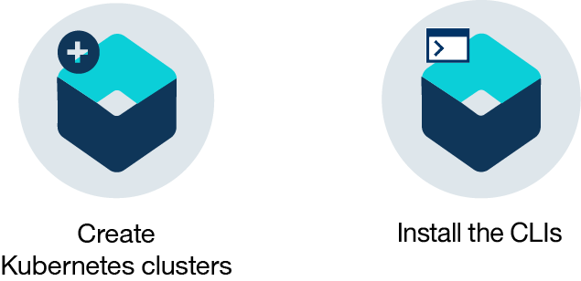
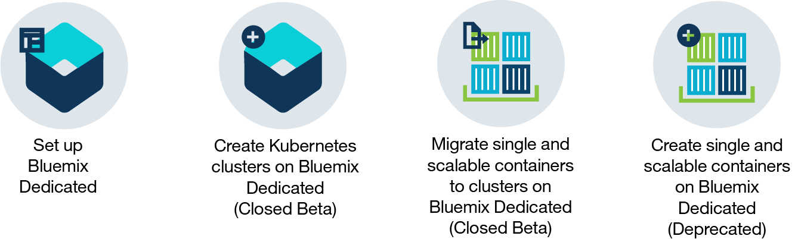
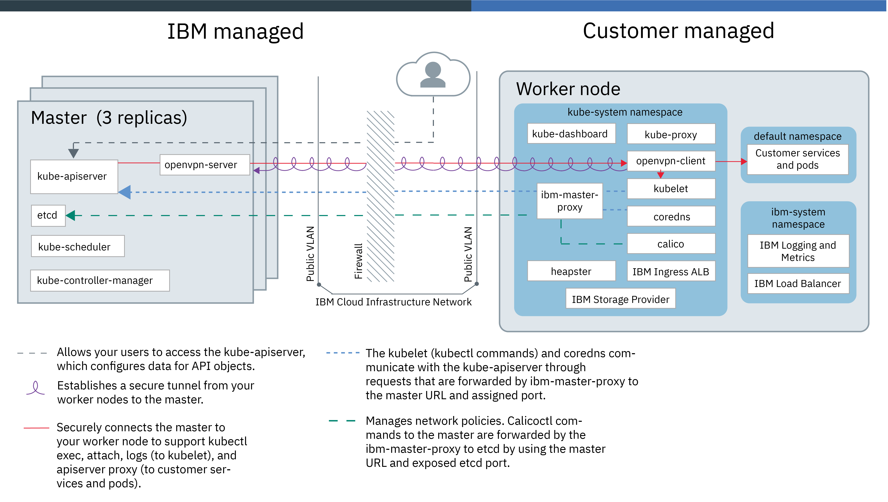
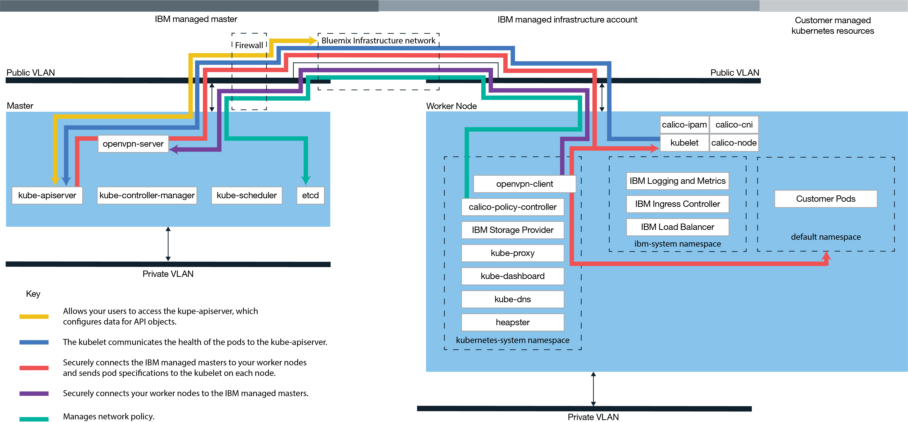

---

copyright:
  years: 2014, 2017
lastupdated: "2017-11-02"

---

{:new_window: target="_blank"}
{:shortdesc: .shortdesc}
{:screen: .screen}
{:pre: .pre}
{:table: .aria-labeledby="caption"}
{:codeblock: .codeblock}
{:tip: .tip}
{:download: .download}

# About {{site.data.keyword.containerlong_notm}}
{: #cs_ov}

{{site.data.keyword.containershort}} combines Docker and Kubernetes to deliver powerful tools, an intuitive user experience, and built-in security and isolation to automate the deployment, operation, scaling, and monitoring of containerized apps over a cluster of independent compute hosts by using the Kubernetes APIs.
{:shortdesc}

 

## Docker containers
{: #cs_ov_docker}

Docker is an open source project that was released by dotCloud in 2013. Built on features of the existing Linux container technology (LXC), Docker became a software platform that you can use to build, test, deploy, and scale apps quickly. Docker packages software into standardized units that are called containers that include all of the elements that an app needs to run.
{:shortdesc}

Review these concepts to learn about basic Docker concepts.

<dl>
<dt>Container</dt>
<dd>A container is a standard way to package an app and all its dependencies so that the app can be moved between environments and run without changes. Unlike virtual machines, containers do not virtualize a device, its operating system, and the underlying hardware. Only the app code, run time, system tools, libraries, and settings are packaged inside the container. Containers run as isolated processes on the compute host where they are deployed to and share the host operating system and its hardware resources. This approach makes a container more lightweight, portable, and efficient than a virtual machine.</dd>
<dt>Image</dt>
<dd>Every container is based on a Docker image and is considered to be an instance of an image. An image is built from a Dockerfile, which is a file that contains instructions how to build the image, and any build artifacts, such as an app, the app's configuration, and its dependencies.</dd>
<dt>Registry</dt>
<dd>An image registry is a place where you store, retrieve, and share Docker images. Images that are stored in a registry can either be publicly available (public registry) or accessible by a small group of users only (private registry). {{site.data.keyword.containershort_notm}} offers public images, such as ibmliberty that you can use to get started with Docker and Kubernetes to create your first containerized app in a cluster. When it comes to enterprise applications, use a private registry like the one provided in {{site.data.keyword.Bluemix_notm}} to protect your images from being used and changed by unauthorized users.

  
When you want to deploy a container from an image, you must make sure that the image is stored in either a public or private image registry.</dd>
</dl>

### Key benefits of using containers
{: #container_benefits}

<dl>
<dt>Containers are agile</dt>
<dd>Containers simplify system administration by providing standardized environments for development and production teams. The engine's lightweight run time enables rapid scale-up and scale-down in response to changes in demand. They help remove the complexity of managing different operating system platforms and underlying infrastructure. Containers help you deploy and run any app on any infrastructure, quickly and reliably.</dd>
<dt>Containers are small</dt>
<dd>You can fit more containers in the amount of space that a single virtual machine would require.</dd>
<dt>Containers are portable</dt>
<dd>Build an image for another container by using another image as the base. Let someone else do the bulk of the work on an image and tweak it for your use. You can also migrate app code from a staging environment to a production environment quickly. The migration process can be automated with tools such as the Delivery Pipeline or UrbanCode Deploy.</dd>
</dl>

 

## Kubernetes basics
{: #kubernetes_basics}

Kubernetes was developed by Google as part of the Borg project and handed off to the open source community in 2014. Kubernetes combines more than 15 years of Google research in running a containerized infrastructure with production work loads, open source contributions, and Docker container management tools to provide an isolated and secure app platform that is portable, extensible, and self-healing in case of failovers.
{:shortdesc}

Learn about the basics of how Kubernetes works with a little terminology.

<dl>
<dt>Cluster</dt>
<dd>A Kubernetes cluster consists of one or more virtual machines that are called worker nodes. Every worker node represents a compute host where you can deploy, run, and manage containerized apps. Worker nodes are managed by a Kubernetes master that centrally controls and monitors all Kubernetes resources in the cluster. When you deploy a containerized app, the Kubernetes master decides where to deploy the app, taking into account the deployment requirements and available capacity in the cluster.</dd>
<dt>Pod</dt>
<dd>Every containerized app that is deployed into a Kubernetes cluster is deployed, run, and managed by a pod. Pods represent the smallest deployable units in a Kubernetes cluster and are used to group containers that must be treated as a single unit. In most cases, a container is deployed to its own pod. However, an app might require a container and other helper containers to be deployed into one pod so that those containers can be addressed by using the same private IP address.</dd>
<dt>Deployment</dt>
<dd>A deployment is a Kubernetes resource where you specify your containers and other Kubernetes resources that are required to run your app, such as persistent storage, services, or annotations. Deployments are documented in a Kubernetes deployment script. When you run a deployment, the Kubernetes master deploys the specified containers into pods taking into account the capacity that is available on the worker nodes of the cluster. Other Kubernetes resources are created and configured as specified in the deployment script.

  
You can use a deployment to define update strategies for your app, which includes the number of pods that you want to add during a rolling update and the number of pods that can be unavailable at a time. When you perform a rolling update, the deployment checks whether the revision is working and stops the rollout when failures are detected.</dd>
<dt>Service</dt>
<dd>A Kubernetes service groups a set of pods and provides network connection to these pods for other services in the cluster without exposing the actual private IP address of each pod. You can use a service to make your app available within your cluster or to the public internet.

  
To learn more about Kubernetes terminology, try the <a href="cs_tutorials.html#cs_cluster_tutorial" target="_blank">tutorial</a>.</dd>
</dl>

 

## Benefits of using clusters
{: #cs_ov_benefits}

Each cluster is deployed on shared or dedicated virtual machines that provide native Kubernetes and {{site.data.keyword.IBM_notm}} added capabilities.
{:shortdesc}

|Benefit|Description|
|-------|-----------|
|Single-tenant Kubernetes clusters with compute, network, and storage infrastructure isolation|<ul><li>Create your own customized infrastructure that meets the requirement of your business and development environment.</li><li>Provision a dedicated and secured Kubernetes master, worker nodes, virtual networks, and storage by using the resources provided by IBM Cloud infrastructure (SoftLayer).</li><li>Store persistent data, share data between Kubernetes pods, and restore data when needed with the integrated and secure volume service.</li><li>Fully managed Kubernetes master that is continuously monitored and updated by {{site.data.keyword.IBM_notm}} to keep your cluster available.</li><li>Benefit from full support for all native Kubernetes APIs.</li></ul>|
|Image security compliance with Vulnerability Advisor|<ul><li>Set up your own secured Docker private image registry where images are stored and shared by all users in the organization.</li><li>Benefit from automatic scanning of images in your private {{site.data.keyword.Bluemix_notm}} registry.</li><li>Review recommendations specific to the operating system used in the image to fix potential vulnerabilities.</li></ul>|
|Automatic scaling of apps|<ul><li>Define custom policies to scale up and scale down apps based on CPU and memory consumption.</li></ul>|
|Continuous monitoring of the cluster health|<ul><li>Use the cluster dashboard to quickly see and manage the health of your cluster, worker nodes, and container deployments.</li><li>Find detailed consumption metrics by using {{site.data.keyword.monitoringlong}} and quickly expand your cluster to meet work loads.</li><li>Review logging information by using {{site.data.keyword.loganalysislong}} to see detailed cluster activities.</li></ul>|
|Automatic recovery of unhealthy containers|<ul><li>Continuous health checks on containers that are deployed on a worker node.</li><li>Automatic re-creation of containers in case of failures.</li></ul>|
|Service discovery and service management|<ul><li>Centrally register app services to make them available to other apps in your cluster without exposing them publicly.</li><li>Discover registered services without keeping track of changing IP addresses or container IDs and benefit from automatic routing to available instances.</li></ul>|
|Secure exposure of services to the public|<ul><li>Private overlay networks with full load balancer and Ingress support to make your apps publicly available and balance workloads across multiple worker nodes without keeping track of changing IP addresses inside your cluster.</li><li>Choose between a public IP address, an {{site.data.keyword.IBM_notm}} provided route, or your own custom domain to access services in your cluster from the internet.</li></ul>|
|{{site.data.keyword.Bluemix_notm}} service integration|<ul><li>Add extra capabilities to your app through the integration of {{site.data.keyword.Bluemix_notm}} services, such as Watson APIs, Blockchain, data services, or Internet of Things, and help cluster users to simplify the app development and container management process.</li></ul>|
{: caption="Table 1. Benefits of using clusters with {{site.data.keyword.containerlong_notm}}" caption-side="top"}

 

## Cloud environments
{: #cs_ov_environments}

You can choose the {{site.data.keyword.Bluemix_notm}} cloud environment on which to deploy clusters and containers.
{:shortdesc}

### {{site.data.keyword.Bluemix_notm}} Public
{: #public_environment}

Deploy clusters into the public cloud environment ([https://console.bluemix.net ](https://console.bluemix.net)) and connect to any service in the {{site.data.keyword.Bluemix_notm}} catalog.

With clusters in {{site.data.keyword.Bluemix_notm}} Public, you can choose the level of hardware isolation for the worker nodes in your cluster. Use dedicated hardware for available physical resources to be dedicated to your cluster only, or shared hardware to allow physical resources to be shared with clusters from other {{site.data.keyword.IBM_notm}} customers. You might choose a dedicated cluster in the {{site.data.keyword.Bluemix_notm}} Public environment when you want isolation for your cluster, but you do not require such isolation for the other {{site.data.keyword.Bluemix_notm}} services that you use.

Click one of the following options to get started:

    <map name="public_options" id="public_options">
    <area href="container_index.html#clusters" alt="Getting started with Kubernetes clusters in {{site.data.keyword.Bluemix_notm}}
" title="Getting started with Kubernetes clusters in {{site.data.keyword.Bluemix_notm}}
" shape="rect" coords="-5, -6, 123, 154" />
    <area href="cs_classic.html#cs_classic" alt="Running single and scalable containers in {{site.data.keyword.containershort_notm}}" title="Running single and scalable containers in I{{site.data.keyword.containershort_notm}}" shape="rect" coords="181, -5, 320, 161" />
    </map>

### {{site.data.keyword.Bluemix_dedicated_notm}}
{: #dedicated_environment}

Deploy clusters (Closed Beta) or single and scalable containers in a dedicated cloud environment (`https://<my-dedicated-cloud-instance>.bluemix.net`) and connect with the preselected {{site.data.keyword.Bluemix_notm}} services that are also running there.

Clusters with {{site.data.keyword.Bluemix_dedicated_notm}} are equivalent to clusters that are created with dedicated hardware in {{site.data.keyword.Bluemix_notm}} Public. Available physical resources are dedicated to your cluster only and are not shared with clusters from other {{site.data.keyword.IBM_notm}} customers. For both Public and for Dedicated, the public API endpoint is used to create clusters. However, with {{site.data.keyword.Bluemix_notm}} Dedicated, the most significant differences are as followed.

*   {{site.data.keyword.IBM_notm}} owns and manages the IBM Cloud infrastructure (SoftLayer) account that the worker nodes, VLANs, and subnets are deployed into, rather than in an account that is owned by you.
*   Specifications for those VLANs and subnets are determined when the Dedicated environment is created, not when the cluster is created.

You might choose to set up an {{site.data.keyword.Bluemix_dedicated_notm}} environment when you want isolation for your cluster and you also require such isolation for the other {{site.data.keyword.Bluemix_notm}} services that you use.

Click one of the following options to get started:

    <map name="dedicated_options" id="dedicated_options">
    <area href="#setup_dedicated" alt="Setting up {{site.data.keyword.containershort_notm}} on {{site.data.keyword.Bluemix_dedicated_notm}} (Closed Beta)" title="Setting up {{site.data.keyword.containershort_notm}} on {{site.data.keyword.Bluemix_dedicated_notm}} (Closed Beta)" shape="rect" coords="-5, -15, 100, 153" />
    <area href="container_index.html#dedicated" alt="Getting started with Kubernetes clusters in {{site.data.keyword.Bluemix_notm}} Dedicated (Closed Beta)" title="Getting started with Kubernetes clusters in {{site.data.keyword.Bluemix_dedicated_notm}} (Closed Beta)" shape="rect" coords="153, -10, 276, 182" />
    <area href="cs_classic.html#cs_classic" alt="Running single and scalable containers in {{site.data.keyword.containershort_notm}}" title="Running single and scalable containers in {{site.data.keyword.containershort_notm}}" shape="rect" coords="317, -11, 436, 188" />
    <area href="container_ha.html#container_group_ui" alt="Running long-term services as container groups from the {{site.data.keyword.Bluemix_notm}} GUI" title="Running long-term services as container groups from the {{site.data.keyword.Bluemix_notm}} GUI" shape="rect" coords="485, -1, 600, 173" />
    </map>

### Differences in cluster management between the cloud environments
{: #env_differences}

|Area|{{site.data.keyword.Bluemix_notm}} Public|{{site.data.keyword.Bluemix_dedicated_notm}} (Closed Beta)|
|--|--------------|--------------------------------|
|Cluster creation|Create a lite cluster or specify the following details for a standard cluster:<ul><li>Cluster type</li><li>Name</li><li>Location</li><li>Machine type</li><li>Number of worker nodes</li><li>Public VLAN</li><li>Private VLAN</li><li>Hardware</li></ul>|Specify the following details for a standard cluster:<ul><li>Name</li><li>Kubernetes version</li><li>Machine type</li><li>Number of worker nodes</li></ul>
**Note:** The VLANs and Hardware settings are pre-defined during the creation of the {{site.data.keyword.Bluemix_notm}} environment.
|
|Cluster hardware and ownership|In standard clusters, the hardware can be shared by other {{site.data.keyword.IBM_notm}} customers or dedicated to you only. The public and private VLANs are owned and managed by you in your IBM Cloud infrastructure (SoftLayer) account.|In clusters on {{site.data.keyword.Bluemix_dedicated_notm}}, the hardware is always dedicated. The public and private VLANs are owned and managed by IBM for you. Location is pre-defined for the {{site.data.keyword.Bluemix_notm}} environment.|
|Service binding with a cluster|Use the [bx cs cluster-service-bind](cs_cluster.html#cs_cluster_service) command to bind a Kubernetes secret to the cluster.|Create a [JSON key file](cs_cluster.html#binding_dedicated) for the service credentials, and then create a Kubernetes secret from that file to bind to the cluster.|
|Load balancer and Ingress networking|During the provisioning of standard clusters, the following actions occur automatically.<ul><li>A public portable subnet is bound to your cluster and assigned to your IBM Cloud infrastructure (SoftLayer) account.</li><li>One portable public IP address is used for a highly available Ingress controller and a unique public route is assigned in the format &lt;cluster_name&gt;.containers.mybluemix.net. You can use this route to expose multiple apps to the public.</li><li>Four portable public IP addresses are assigned to the cluster that can be used to expose apps to the public via load balancer services. Additional subnets can be requested through your IBM Cloud infrastructure (SoftLayer) account.</li></ul>|When you create your Dedicated account, you make the following decisions:<ul><li>How many subnets you want</li><li>The type of subnets you want, either load balancer or Ingress. {{site.data.keyword.IBM_notm}} creates the subnets and performs the network management tasks for you. Depending on your selections, an Ingress controller might be created and a public route might be assigned. Additional subnets can be requested by [opening a support ticket](/docs/support/index.html#contacting-support) to create the subnet, and then use the [`bx cs cluster-subnet-add`](cs_cli_reference.html#cs_cluster_subnet_add) command to add the subnet to the cluster.|
|NodePort networking|Expose a public port on your worker node and use the public IP address of the worker node to publicly access your service in the cluster.|All public IP addresses of the workers nodes are blocked by a firewall. However, for {{site.data.keyword.Bluemix_notm}} services that are added to the cluster, the node port can be accessed via a public IP address or a private IP address.|
|Persistent storage|Use [dynamic provisioning](cs_apps.html#cs_apps_volume_claim) or [static provisioning](cs_cluster.html#cs_cluster_volume_create) of volumes.|Use [dynamic provisioning](cs_apps.html) of volumes.</li></ul>|
|Image registry URL in {{site.data.keyword.registryshort_notm}}|<ul><li>US-South and US-East: <code>registry.ng bluemix.net</code></li><li>UK-South: <code>registry.eu-gb.bluemix.net</code></li><li>EU-Central (Frankfurt): <code>registry.eu-de.bluemix.net</code></li><li>Australia (Sydney): <code>registry.au-syd.bluemix.net</code></li></ul>|<ul><li>For new namespaces, use the same region-based registries that are defined for {{site.data.keyword.Bluemix_notm}} Public.</li><li>For namespaces that were set up for single and scalable containers in {{site.data.keyword.Bluemix_dedicated_notm}}, use <code>registry.&lt;dedicated_domain&gt;</code></li></ul>|
|Accessing the registry|See the options in [Using private and public image registries with {{site.data.keyword.containershort_notm}}](cs_cluster.html#cs_apps_images).|<ul><li>For new namespaces, see the options in [Using private and public image registries with {{site.data.keyword.containershort_notm}}](cs_cluster.html#cs_apps_images).</li><li>For namespaces that were set up for single and scalable groups, [use a token and create a Kubernetes secret](cs_dedicated_tokens.html#cs_dedicated_tokens) for authentication.</li></ul>|
{: caption="Table 2. Feature differences between {{site.data.keyword.Bluemix_notm}} Public and {{site.data.keyword.Bluemix_dedicated_notm}}" caption-side="top"}

### Setting up {{site.data.keyword.containershort_notm}} on {{site.data.keyword.Bluemix_dedicated_notm}} (Closed Beta)
{: #setup_dedicated}

Administrators must add the IBM administrator ID and users of your organization to the Dedicated environment.

Before you begin, [set up an {{site.data.keyword.Bluemix_dedicated_notm}} environment](/docs/dedicated/index.html#setupdedicated).

To set up your Dedicated environment to use clusters:

1.  Add the provided IBM administrator ID to the environment.
    1.  Select your {{site.data.keyword.Bluemix_dedicated_notm}} account.
    2.  From the menu bar, click **Manage > Security > Identity and Access**. The Users window displays a list of users with their email addresses and status for the selected account.
    3.  Click **Invite users**.
    4.  In **Email address or existing IBMid**, enter the following email address: `cfsdl@us.ibm.com`.
    5.  In the **Access** section, expand **Identity and Access enabled services**.
    6.  From the **Services** drop-down list, select **{{site.data.keyword.containershort_notm}}**.
    7.  From the **Roles** drop-down list, select **Administrator**.
    8.  Click **Invite users**.
2.  [Create IBMids for the end users of your {{site.data.keyword.Bluemix_notm}} account. ](https://www.ibm.com/account/us-en/signup/register.html)
3.  [Add the users from the previous step to your {{site.data.keyword.Bluemix_notm}} account.](cs_cluster.html#add_users)
4.  Access your {{site.data.keyword.Bluemix_dedicated_notm}} account through the Public console and start creating clusters.
    1.  Log in to {{site.data.keyword.Bluemix_notm}} Public console ([https://console.bluemix.net ](https://console.bluemix.net)) with your IBMid.
    2.  From the account menu, select your {{site.data.keyword.Bluemix_dedicated_notm}} account. The console is updated with the services and information for your {{site.data.keyword.Bluemix_dedicated_notm}} instance.
    3.  From the catalog for your {{site.data.keyword.Bluemix_dedicated_notm}} instance, select **Containers** and click **Kubernetes cluster**.
    For more information about creating a cluster, see [Creating Kubernetes clusters from the GUI in {{site.data.keyword.Bluemix_dedicated_notm}} (Closed Beta)](cs_cluster.html#creating_ui_dedicated).
5. If your local system or your corporate network controls public internet endpoints by using proxies or firewalls, see [Opening required ports and IP addresses in your firewall](cs_security.html#opening_ports) for more information about how to allow outbound traffic.

 

## Service architecture
{: #cs_ov_architecture}

Each worker node is set up with an {{site.data.keyword.IBM_notm}} managed Docker Engine, separate compute resources, networking, and volume service, as well as built-in security features that provide isolation, resource management capabilities, and worker node security compliance. The worker node communicates with the master by using secure TLS certificates and openVPN connection.
{:shortdesc}

*Figure 1. Kubernetes architecture and networking in the {{site.data.keyword.containershort_notm}}*

### {{site.data.keyword.Bluemix_dedicated_notm}}
{: #dedicated_architecture}

*Figure 2. Kubernetes architecture and networking in the {{site.data.keyword.Bluemix_dedicated_notm}}*

 

## Abuse of containers
{: #cs_terms}

Clients cannot misuse {{site.data.keyword.containershort_notm}}.
{:shortdesc}

Misuse includes:

*   Any illegal activity
*   Distribution or execution of malware
*   Harming {{site.data.keyword.containershort_notm}} or interfering with anyone's use of {{site.data.keyword.containershort_notm}}
*   Harming or interfering with anyone's use of any other service or system
*   Unauthorized access to any service or system
*   Unauthorized modification of any service or system
*   Violation of the rights of others

See [Cloud Services terms](/docs/navigation/notices.html#terms) for overall terms of use.
