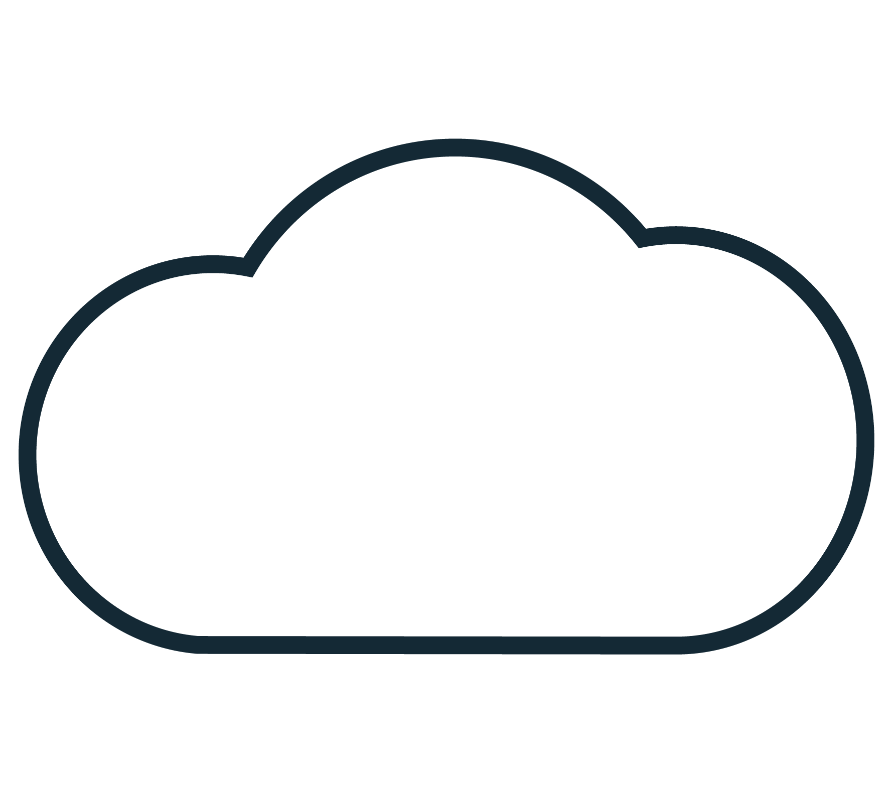

---

copyright:
  years: 2014, 2020
lastupdated: "2020-09-09"

keywords: kubernetes, iks, containers

subcollection: containers

---

{:DomainName: data-hd-keyref="APPDomain"}
{:DomainName: data-hd-keyref="DomainName"}
{:android: data-hd-operatingsystem="android"}
{:apikey: data-credential-placeholder='apikey'}
{:app_key: data-hd-keyref="app_key"}
{:app_name: data-hd-keyref="app_name"}
{:app_secret: data-hd-keyref="app_secret"}
{:app_url: data-hd-keyref="app_url"}
{:authenticated-content: .authenticated-content}
{:beta: .beta}
{:c#: data-hd-programlang="c#"}
{:codeblock: .codeblock}
{:curl: .ph data-hd-programlang='curl'}
{:deprecated: .deprecated}
{:dotnet-standard: .ph data-hd-programlang='dotnet-standard'}
{:download: .download}
{:external: target="_blank" .external}
{:faq: data-hd-content-type='faq'}
{:fuzzybunny: .ph data-hd-programlang='fuzzybunny'}
{:generic: data-hd-operatingsystem="generic"}
{:generic: data-hd-programlang="generic"}
{:gif: data-image-type='gif'}
{:go: .ph data-hd-programlang='go'}
{:help: data-hd-content-type='help'}
{:hide-dashboard: .hide-dashboard}
{:hide-in-docs: .hide-in-docs}
{:important: .important}
{:ios: data-hd-operatingsystem="ios"}
{:java: #java .ph data-hd-programlang='java'}
{:java: .ph data-hd-programlang='java'}
{:java: data-hd-programlang="java"}
{:javascript: .ph data-hd-programlang='javascript'}
{:javascript: data-hd-programlang="javascript"}
{:new_window: target="_blank"}
{:note: .note}
{:objectc data-hd-programlang="objectc"}
{:org_name: data-hd-keyref="org_name"}
{:php: data-hd-programlang="php"}
{:pre: .pre}
{:preview: .preview}
{:python: .ph data-hd-programlang='python'}
{:python: data-hd-programlang="python"}
{:route: data-hd-keyref="route"}
{:row-headers: .row-headers}
{:ruby: .ph data-hd-programlang='ruby'}
{:ruby: data-hd-programlang="ruby"}
{:runtime: architecture="runtime"}
{:runtimeIcon: .runtimeIcon}
{:runtimeIconList: .runtimeIconList}
{:runtimeLink: .runtimeLink}
{:runtimeTitle: .runtimeTitle}
{:screen: .screen}
{:script: data-hd-video='script'}
{:service: architecture="service"}
{:service_instance_name: data-hd-keyref="service_instance_name"}
{:service_name: data-hd-keyref="service_name"}
{:shortdesc: .shortdesc}
{:space_name: data-hd-keyref="space_name"}
{:step: data-tutorial-type='step'}
{:subsection: outputclass="subsection"}
{:support: data-reuse='support'}
{:swift: #swift .ph data-hd-programlang='swift'}
{:swift: .ph data-hd-programlang='swift'}
{:swift: data-hd-programlang="swift"}
{:table: .aria-labeledby="caption"}
{:term: .term}
{:tip: .tip}
{:tooling-url: data-tooling-url-placeholder='tooling-url'}
{:troubleshoot: data-hd-content-type='troubleshoot'}
{:tsCauses: .tsCauses}
{:tsResolve: .tsResolve}
{:tsSymptoms: .tsSymptoms}
{:tutorial: data-hd-content-type='tutorial'}
{:unity: .ph data-hd-programlang='unity'}
{:url: data-credential-placeholder='url'}
{:user_ID: data-hd-keyref="user_ID"}
{:vb.net: .ph data-hd-programlang='vb.net'}
{:video: .video}

# Learning path for administrators
{: #learning-path-admin}

Following a curated learning path through {{site.data.keyword.containerlong}} to create a Kubernetes cluster, manage the cluster's resources and lifecycle, and use the powerful tools of {{site.data.keyword.containerlong_notm}} to secure, manage, and monitor your cluster workloads.
{: shortdesc}

  

    <a href = "#admin_plan">
      

        
        
<strong>Plan your environment</strong>

        
Plan a highly available cluster with capacity for app workloads.

      

    </a>
  

  

      <a href = "#admin_cluster">
      

        
        
<strong>Create a cluster</strong>

        
Create a cluster according to your planned setup.

      

    </a>
  

  

    <a href = "#admin_network">
      

        
        
<strong>Manage the network</strong>

        
Configure cluster connectivity to other networks or manage cluster subnets.

      

    </a>
  

  

    <a href = "#admin_secure">
      

        
        
<strong>Secure your cluster</strong>

        
Protect the cluster infrastructure and network and isolate compute resources.

      

    </a>
  

  

    <a href = "#admin_health">
      

        
        
<strong>Log and monitor</strong>

        
Improve your cluster's health and performance with logging and monitoring.

      

    </a>
  

  

    <a href = "#admin_registry">
      

        
        
<strong>Add a registry and CI/CD</strong>

        
Set up an image registry and a continuous integration and delivery pipeline.

      

    </a>
  

  

    <a href = "#admin_storage">
      

        
        
<strong>Add storage</strong>

        
Plan and add highly available persistent storage for your app data.

      

    </a>
  

  

    <a href = "#admin_integrate">
      

        
        
<strong>Add integrations</strong>

        
Enhance cluster capabilities by integrating external and catalog services.

      

    </a>
  

  

    <a href = "#admin_lifecycle">
      

        
        
<strong>Manage the lifecycle</strong>

        
Manage your cluster and components through all cluster lifecycle phases.

      

    </a>
  

## Plan your environment
{: #admin_plan}

Start by designing a cluster for maximum availability and capacity for your workloads.
{: shortdesc}

1. **Environment strategy**:
  1. Define your [Kubernetes strategy](/docs/containers?topic=containers-strategy) for the cluster, such as deciding how many clusters to create for your environments.
  2. Plan your [security strategy](/docs/containers?topic=containers-security#network_segmentation), such as ensuring network segmentation and workload isolation.

2. **Cluster setup**: After you plan your environment, plan the setup for a specific cluster.
  1. Choose a [supported infrastructure provider](/docs/containers?topic=containers-infrastructure_providers).
  2. Plan your [cluster network setup](/docs/containers?topic=containers-plan_clusters).
  3. Plan your cluster for [high availability](/docs/containers?topic=containers-ha_clusters).
  4. Plan your [worker node setup](/docs/containers?topic=containers-planning_worker_nodes).

 

## Create a cluster
{: #admin_cluster}

Create a cluster with infrastructure, network, and availability setups that are customized to your use case and cloud environment.
{: shortdesc}

1. **Firewall**: If you have corporate firewalls, make sure that you [open the required ports and IP addresses](/docs/containers?topic=containers-firewall#corporate) to work with {{site.data.keyword.containerlong_notm}}.
2. **CLI and API**:
  1. [Set up the CLIs](/docs/containers?topic=containers-cs_cli_install) that are necessary to create and work with clusters. As you work with your cluster, refer to the [command reference](/docs/containers?topic=containers-cli-plugin-kubernetes-service-cli) and keep track of CLI version updates with the [CLI changelog](/docs/containers?topic=containers-cs_cli_changelog).
  2. Optionally set up [automated deployments with the API](/docs/containers?topic=containers-cs_api_install). As you work with your cluster, refer to the [IBM Cloud Kubernetes Service API reference](https://containers.cloud.ibm.com/global/swagger-global-api/#/) and [Community Kubernetes API reference](https://kubernetes.io/docs/reference/).
3. **Cluster deployment**:
  1. [Create the cluster](/docs/containers?topic=containers-clusters).
  2. After the cluster is ready, [access your cluster](/docs/containers?topic=containers-access_cluster).
  3. Spread your cluster across availability zones by [adding worker nodes and zones to your cluster](/docs/containers?topic=containers-add_workers).
4. **User access**:
  1. Make sure that your authorized cluster users can now also access the cluster by planning your user access strategy.
    1. [Pick the right access policy and role for your users](/docs/containers?topic=containers-users#access_roles).
    2. [Understand access roles for individual or groups of users in {{site.data.keyword.cloud_notm}} IAM](/docs/containers?topic=containers-users#iam_individuals_groups).
    3. [Choose the scope of user access to cluster instances, Kubernetes namespace, or resource groups](/docs/containers?topic=containers-users#resource_groups).
  2. Allow users to create apps or audit your cluster activity by [assigning cluster access](/docs/containers?topic=containers-users#platform). To see specific permissions and actions that you can grant users, see the [user access permissions reference](/docs/containers?topic=containers-access_reference).

 Need help? Check out [Troubleshooting clusters and masters](/docs/containers?topic=containers-cs_troubleshoot) and [Troubleshooting worker nodes](/docs/containers?topic=containers-cs_troubleshoot_clusters).

 

## Manage the network
{: #admin_network}

Review the following optional topics to manage the network connectivity of your cluster components and connections to other networks. For example, you might need to connect the workloads in your cluster to workloads in another private network. Or, you might return to this section later if you need to make more portable IP addresses available for load balancer services that expose apps in your cluster.
{: shortdesc}

* **Connections to other networks and workloads**:
  * Set up VPN connectivity between your [classic cluster](/docs/containers?topic=containers-vpn) or [VPC cluster](/docs/containers?topic=containers-vpc-vpnaas) and remote network environments, other VPCs, and more.
  * To route responses from your cluster back to your on-premises network in VPN solutions that preserve the request source IP address, add [custom static routes](/docs/containers?topic=containers-static-routes) to worker nodes for on-premises subnets.
* **Subnets, service endpoints, and VLANs**:
  * Add or change the available subnets and IP addresses for your [classic cluster](/docs/containers?topic=containers-subnets) or [VPC cluster](/docs/containers?topic=containers-vpc-subnets).
  * Change the [service endpoints that your Kubernetes master is accessible through](/docs/containers?topic=containers-cs_network_cluster).
  *  Classic clusters: Change the [VLAN connections for your worker nodes](/docs/containers?topic=containers-cs_network_cluster#change-vlans).

 Need help? Check out [Troubleshooting cluster networking](/docs/containers?topic=containers-cs_troubleshoot_network#cs_troubleshoot_network).

 

## Secure your cluster
{: #admin_secure}

Use built-in security features to protect your cluster infrastructure and network communication, isolate your compute resources, and ensure security compliance across your infrastructure components and container deployments.
{: shortdesc}

1. **Security strategy**: Start by reviewing all [security options](/docs/containers?topic=containers-security) that are available for your cluster.
2. **Network security**:
  *  Classic clusters:
    1. To isolate networking workloads, you can restrict network traffic to [edge worker nodes](/docs/containers?topic=containers-edge).
    2. Set up a firewall by using a [gateway appliance](/docs/containers?topic=containers-firewall#vyatta_firewall) or [Calico network policies](/docs/containers?topic=containers-network_policies).
  *  VPC clusters: Control traffic to and from your cluster with [VPC access control lists (ACLs)](/docs/containers?topic=containers-vpc-network-policy). If you create multiple clusters that use the same subnets in one VPC, use [Calico network policies](/docs/containers?topic=containers-network_policies#isolate_workers) to isolate your clusters on the private network instead.
3. **Workload security**:
  1. [Encrypt sensitive information](/docs/containers?topic=containers-encryption) in the cluster, such as the master's local disk and secrets.
  2. Set up a [private image registry](/docs/containers?topic=containers-security#images_registry) for your developers, such as the one provided by {{site.data.keyword.registryshort}}, to control access to the registry and the image content that can be pushed.
  3. [Set pod priority](/docs/containers?topic=containers-pod_priority) to indicate the relative priority of the pods that make up your cluster's workload.
  4. Authorize who can create and update pods by configuring [pod security policies (PSPs)](/docs/containers?topic=containers-psp).

 

## Logging and monitoring
{: #admin_health}

Set up logging and monitoring to help you troubleshoot issues and improve the health and performance of your Kubernetes clusters and apps.
{: shortdesc}

1. **Cluster and app logging**: [Choose a logging solution](/docs/containers?topic=containers-health#logging_overview), such as {{site.data.keyword.la_full}}, to monitor container logs as well as user-initiated administrative activities.
2. **Audit logging**: [Forwarding Kubernetes API audit logs to IBM Log Analysis with LogDNA](/docs/containers?topic=containers-health#webhook_logdna)
3. **Monitoring**: [Choose a monitoring solution](/docs/containers?topic=containers-health#view_metrics), such as {{site.data.keyword.mon_full}}, to gain operational visibility into the performance and health of your apps.

 Need help? Check out [Troubleshooting logging and monitoring](/docs/containers?topic=containers-cs_troubleshoot_health#cs_troubleshoot_health).

 

## Add a registry and CI/CD
{: #admin_registry}

Set up an image registry and a continuous integration and delivery (CI/CD) pipeline for your cluster.
{: shortdesc}

1.  **Registry**: Choose and set up an [image registry](/docs/containers?topic=containers-registry) so that developers can pull images from the registry in their app deployment YAML files.
2.  **CI/CD**:
  * Review available [options for automating app deployment](/docs/containers?topic=containers-cicd).
  * Set up toolchains with [{{site.data.keyword.deliverypipelinelong}}](/docs/containers?topic=containers-cicd#continuous-delivery-pipeline).

## Add storage
{: #admin_storage}

Plan and add highly available persistent storage based on your app requirements, the type of data that you want to store, and how often you want to access this data.
{: shortdesc}

1. **Storage basics**: Start by understanding the [basics of Kubernetes storage](/docs/containers?topic=containers-kube_concepts).
2. **Requirements**: Determine your [requirements for a storage solution](/docs/containers?topic=containers-storage_planning).
3. **Choose a solution**: Using your storage requirements, choose a storage solution by comparing [non-persistent](/docs/containers?topic=containers-storage_planning#non_persistent_overview), [single-zone persistent](/docs/containers?topic=containers-storage_planning#single_zone_persistent_storage), or [multizone persistent](/docs/containers?topic=containers-storage_planning#persistent_storage_overview) storage.

 Need help? Check out [Troubleshooting persistent storage](/docs/containers?topic=containers-cs_troubleshoot_storage#cs_troubleshoot_storage).

 

## Add integrations
{: #admin_integrate}

Enhance cluster capabilities by integrating various external services and catalog services with your Kubernetes cluster.
{: shortdesc}

1. **Review supported integrations**:
  * [All supported integrations](/docs/containers?topic=containers-supported_integrations)
  * [{{site.data.keyword.containerlong_notm}} partners](/docs/containers?topic=containers-service-partners)
  * [{{site.data.keyword.cloud_notm}} services and third-party integrations](/docs/containers?topic=containers-ibm-3rd-party-integrations)
2. **Add services to your cluster**:
  * [Adding services by using managed add-ons](/docs/containers?topic=containers-managed-addons)
  * [Adding services by using Helm](/docs/containers?topic=containers-helm)
  * [Adding services by using {{site.data.keyword.cloud_notm}} service binding](/docs/containers?topic=containers-service-binding)

 Need help? Check out [Troubleshooting apps and integrations](/docs/containers?topic=containers-cs_troubleshoot_clusters).

 

## Manage the lifecycle
{: #admin_lifecycle}

Manage your cluster and worker nodes through each phase of the cluster lifecycle.
{: shortdesc}

* **Autoscaling**: [Automatically increase or decrease the number of worker nodes](/docs/containers?topic=containers-ca) based on the sizing needs of your scheduled workloads.
* **Updating**: Keep your environment up-to-date by frequently [updating clusters, worker nodes, and cluster components](/docs/containers?topic=containers-update). While you update, refer to these version reference pages:
  * [Version information and update actions](/docs/containers?topic=containers-cs_versions)
  * [Version changelog](/docs/containers?topic=containers-changelog)
  * [Fluentd and Ingress ALB changelog](/docs/containers?topic=containers-cluster-add-ons-changelog)
* **Removing**: [Remove clusters and clean up related resources](/docs/containers?topic=containers-remove).

 Need help? Check out troubleshooting [clusters and masters](/docs/containers?topic=containers-cs_troubleshoot), [worker nodes](/docs/containers?topic=containers-cs_troubleshoot_clusters), or the [cluster autoscaler](/docs/containers?topic=containers-troubleshoot_cluster_autoscaler).

