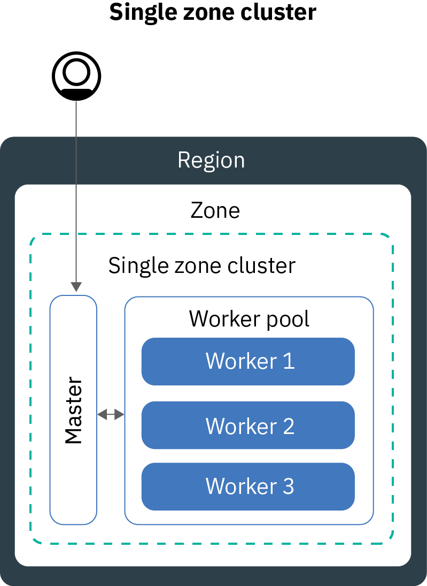
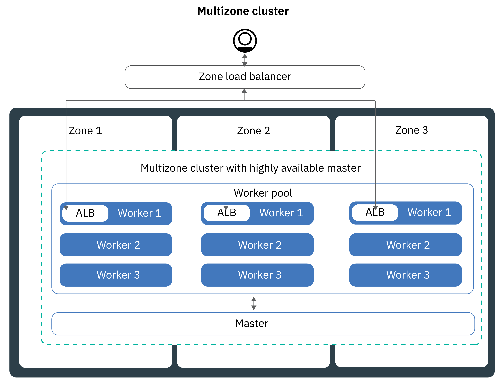
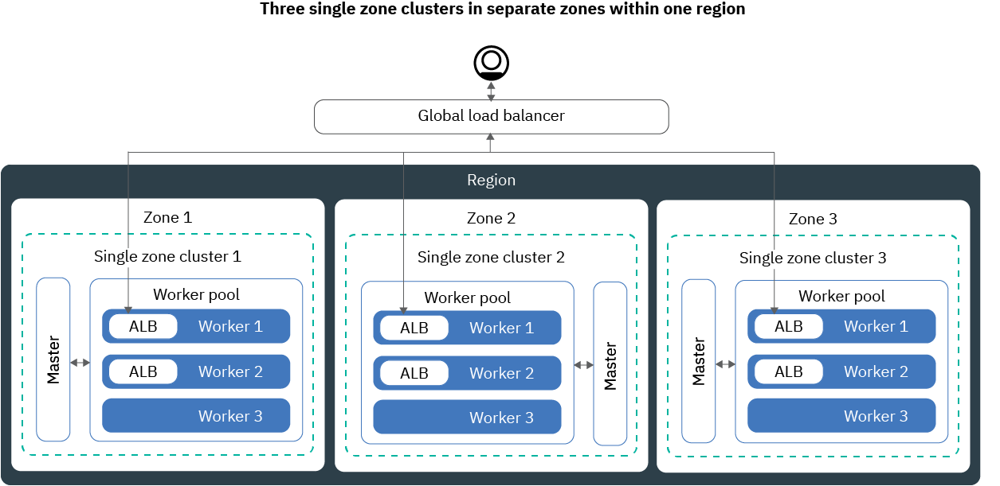

---

copyright:
  years: 2014, 2019
lastupdated: "2019-07-19"

keywords: kubernetes, iks, multi az, multi-az, szr, mzr

subcollection: containers

---

{:new_window: target="_blank"}
{:shortdesc: .shortdesc}
{:screen: .screen}
{:pre: .pre}
{:table: .aria-labeledby="caption"}
{:codeblock: .codeblock}
{:tip: .tip}
{:note: .note}
{:important: .important}
{:deprecated: .deprecated}
{:download: .download}
{:preview: .preview}


# Planning your cluster for high availability
{: #ha_clusters}

Design your standard community Kubernetes or OpenShift cluster for maximum availability and capacity for your app with {{site.data.keyword.containerlong}}.
{: shortdesc}

Your users are less likely to experience downtime when you distribute your apps across multiple worker nodes, zones, and clusters. Built-in capabilities, like load balancing and isolation, increase resiliency against potential failures with hosts, networks, or apps. Review these potential cluster setups that are ordered with increasing degrees of availability.


1. A [single zone cluster](#single_zone) with multiple worker nodes in a worker pool.
2. A [multizone cluster](#multizone) that spreads worker nodes across zones within one region.
3. **Clusters that are connected to public and private VLANs only**: [Multiple clusters](#multiple_clusters) that are set up across zones or regions and that are connected via a global load balancer.

## Single zone cluster
{: #single_zone}

To improve availability for your app and to allow failover for the case that one worker node is not available in your cluster, add additional worker nodes to your single zone cluster.
{: shortdesc}



By default, your single zone cluster is set up with a worker pool that is named `default`. The worker pool groups worker nodes with the same configuration, such as the machine type, that you defined during cluster creation. You can add more worker nodes to your cluster by [resizing an existing worker pool](/docs/containers?topic=containers-add_workers#resize_pool) or by [adding a new worker pool](/docs/containers?topic=containers-add_workers#add_pool).

When you add more worker nodes, app instances can be distributed across multiple worker nodes. If one worker node goes down, app instances on available worker nodes continue to run. Kubernetes automatically reschedules pods from unavailable worker nodes to ensure performance and capacity for your app. To ensure that your pods are evenly distributed across worker nodes, implement [pod affinity](https://kubernetes.io/docs/concepts/configuration/assign-pod-node/#inter-pod-affinity-and-anti-affinity-beta-feature).

**Can I convert my single zone cluster to a multizone cluster?**</br>
If the cluster is in one of the [supported multizone metro locations](/docs/containers?topic=containers-regions-and-zones#zones), yes. See [Updating from stand-alone worker nodes to worker pools](/docs/containers?topic=containers-update#standalone_to_workerpool).


**Do I have to use multizone clusters?**</br>
No. You can create as many single zone clusters as you like. Indeed, you might prefer single zone clusters for simplified management or if your cluster must reside in a specific [single zone city](/docs/containers?topic=containers-regions-and-zones#zones).

**Can I have a highly available master in a single zone?**</br>
Yes. In a single zone, your master is highly available and includes replicas on separate physical hosts for your Kubernetes API server, etcd, scheduler, and controller manager to protect against an outage such as during a master update. To protect against a zonal failure, you can:
* [Create a cluster in a multizone-capable zone](#multizone), where the master is spread across zones.
* [Create multiple clusters that are connected to public and private VLANs](#multiple_clusters) and connect them with a global load balancer.

## Multizone cluster
{: #multizone}

With {{site.data.keyword.containerlong_notm}}, you can create multizone clusters. Your users are less likely to experience downtime when you distribute your apps across multiple worker nodes and zones by using a worker pool. Built-in capabilities, such as load balancing, increase resiliency against potential zone failures with hosts, networks, or apps. If resources in one zone go down, your cluster workloads still operate in the other zones.
{: shortdesc}

**What is a worker pool?**</br>
A worker pool is a collection of worker nodes with the same flavor, such as machine type, CPU, and memory. When you create a cluster, a default worker pool is automatically created for you. To spread the worker nodes in your pool across zones, add worker nodes to the pool, or update worker nodes, you can use new `ibmcloud ks worker-pool` commands.

**Can I still use stand-alone worker nodes?**</br>
The previous cluster setup of stand-alone worker nodes is supported, but deprecated. Be sure to [add a worker pool to your cluster](/docs/containers?topic=containers-planning_worker_nodes#add_pool), and then [use worker pools](/docs/containers?topic=containers-update#standalone_to_workerpool) to organize your worker nodes instead of stand-alone worker nodes.

**Can I convert my single zone cluster to a multizone cluster?**</br>
If the cluster is in one of the [supported multizone metro locations](/docs/containers?topic=containers-regions-and-zones#zones), yes. See [Updating from stand-alone worker nodes to worker pools](/docs/containers?topic=containers-update#standalone_to_workerpool).


### Tell me more about the multizone cluster setup
{: #mz_setup}



You can add additional zones to your cluster to replicate the worker nodes in your worker pools across multiple zones within one region. Multizone clusters are designed to evenly schedule pods across worker nodes and zones to assure availability and failure recovery. If worker nodes are not spread evenly across the zones or capacity is insufficient in one of the zones, the Kubernetes scheduler might fail to schedule all requested pods. As a result, pods might go into a **Pending** state until enough capacity is available. If you want to change the default behavior to make Kubernetes scheduler distribute pods across zones in a best effort distribution, use the `preferredDuringSchedulingIgnoredDuringExecution` [pod affinity policy](https://kubernetes.io/docs/concepts/configuration/assign-pod-node/#inter-pod-affinity-and-anti-affinity-beta-feature).

**Why do I need worker nodes in three zones?** </br>
Distributing your work load across three zones ensures high availability for your app in case one or two zones are not available, but it also makes your cluster setup more cost-efficient. Why is that, you ask? Here is an example.

Let's say you need a worker node with six cores to handle the workload for your app. To make your cluster more available, you have the following options:

- **Duplicate your resources in another zone:** This option leaves you with two worker nodes, each with six cores in each zone for a total of 12 cores. </br>
- **Distribute resources across three zones:** With this option, you deploy three cores per zone, which leaves you with a total capacity of nine cores. To handle your workload, two zones must be up at a time. If one zone is unavailable, the other two zones can handle your workload. If two zones are unavailable, the three remaining cores are up to handle your workload. Deploying three cores per zone means smaller machines and hence reduced cost for you.</br>

**How is my Kubernetes master set up?** </br>
When you create a cluster in a [multizone metro location](/docs/containers?topic=containers-regions-and-zones#zones), a highly available Kubernetes master is automatically deployed and three replicas are spread across the zones of the metro. For example, if the cluster is in `dal10`, `dal12`, or `dal13` zones, the replicas of the Kubernetes master are spread across each zone in the Dallas multizone metro.

**What happens if the Kubernetes master becomes unavailable?** </br>
The [Kubernetes master](/docs/containers?topic=containers-ibm-cloud-kubernetes-service-technology#architecture) is the main component that keeps your cluster up and running. The master stores cluster resources and their configurations in the etcd database that serves as the single point of truth for your cluster. The Kubernetes API server is the main entry point for all cluster management requests from the worker nodes to the master, or when you want to interact with your cluster resources.<br><br>If a master failure occurs, your workloads continue to run on the worker nodes, but you cannot use `kubectl` commands to work with your cluster resources or view the cluster health until the Kubernetes API server in the master is back up. If a pod goes down during the master outage, the pod cannot be rescheduled until the worker node can reach the Kubernetes API server again.<br><br>During a master outage, you can still run `ibmcloud ks` commands against the {{site.data.keyword.containerlong_notm}} API to work with your infrastructure resources, such as worker nodes or VLANs. If you change the current cluster configuration by adding or removing worker nodes to the cluster, your changes do not happen until the master is back up.

Do not restart or reboot a worker node during a master outage. This action removes the pods from your worker node. Because the Kubernetes API server is unavailable, the pods cannot be rescheduled onto other worker nodes in the cluster.
{: important}


To protect your cluster against a Kubernetes master failure or in regions where multizone clusters are not available, you can [set up multiple clusters that are connected to public and private VLANs and connect them with a global load balancer](#multiple_clusters).

**Do I have to do anything so that the master can communicate with the workers across zones?**</br>
Yes. If you have multiple VLANs for a cluster, multiple subnets on the same VLAN, or a multizone cluster, you must enable a [Virtual Router Function (VRF)](/docs/infrastructure/direct-link?topic=direct-link-overview-of-virtual-routing-and-forwarding-vrf-on-ibm-cloud#overview-of-virtual-routing-and-forwarding-vrf-on-ibm-cloud) for your IBM Cloud infrastructure account so your worker nodes can communicate with each other on the private network. To enable VRF, [contact your IBM Cloud infrastructure account representative](/docs/infrastructure/direct-link?topic=direct-link-overview-of-virtual-routing-and-forwarding-vrf-on-ibm-cloud#how-you-can-initiate-the-conversion). If you cannot or do not want to enable VRF, enable [VLAN spanning](/docs/infrastructure/vlans?topic=vlans-vlan-spanning#vlan-spanning). To perform this action, you need the **Network > Manage Network VLAN Spanning** [infrastructure permission](/docs/containers?topic=containers-users#infra_access), or you can request the account owner to enable it. To check whether VLAN spanning is already enabled, use the `ibmcloud ks vlan-spanning-get --region <region>` [command](/docs/containers?topic=containers-cli-plugin-kubernetes-service-cli#cs_vlan_spanning_get).

**How do I let my users access my app from the public Internet?**</br>
You can expose your apps by using an Ingress application load balancer (ALB) or load balancer service.

- **Ingress application load balancer (ALB)** By default, public ALBs are automatically created and enabled in each zone in your cluster. A Cloudflare multizone load balancer (MZLB) for your cluster is also automatically created and deployed so that 1 MZLB exists for each region. The MZLB puts the IP addresses of your ALBs behind the same host name and enables health checks on these IP addresses to determine whether they are available or not. For example, if you have worker nodes in 3 zones in the US-East region, the host name `yourcluster.us-east.containers.appdomain.cloud` has 3 ALB IP addresses. The MZLB health checks the public ALB IP in each zone of a region and keeps the DNS lookup results updated based on these health checks. For more information, see [Ingress components and architecture](/docs/containers?topic=containers-ingress-about#ingress_components).

- **Load balancer services:** Load balancer services are set up in one zone only. Incoming requests to your app are routed from that one zone to all app instances in other zones. If this zone becomes unavailable, then your app might not be reachable from the internet. You can set up additional load balancer services in other zones to account for a single zone failure. For more information, see highly available [load balancer services](/docs/containers?topic=containers-loadbalancer#multi_zone_config).

**Can I set up persistent storage for my multizone cluster?**</br>
For highly available persistent storage, use a cloud service such as [{{site.data.keyword.cloudant_short_notm}}](/docs/services/Cloudant?topic=cloudant-getting-started#getting-started) or [{{site.data.keyword.cos_full_notm}}](/docs/services/cloud-object-storage?topic=cloud-object-storage-about-ibm-cloud-object-storage). You can also try a software-defined storage (SDS) solution such as [Portworx](/docs/containers?topic=containers-portworx#portworx) that uses [SDS machines](/docs/containers?topic=containers-planning_worker_nodes#sds). For more information, see [Comparison of persistent storage options for multizone clusters](/docs/containers?topic=containers-storage_planning#persistent_storage_overview).

NFS file and block storage are not sharable across zones. Persistent volumes can be used only in the zone where the actual storage device is located. If you have existing NFS file or block storage in your cluster that you want to continue to use, you must apply region and zone labels to existing persistent volumes. These labels help the kube-scheduler to determine where to schedule an app that uses the persistent volume. Run the following command and replace `<mycluster>` with your cluster name.

```
bash <(curl -Ls https://raw.githubusercontent.com/IBM-Cloud/kube-samples/master/file-pv-labels/apply_pv_labels.sh) <mycluster>
```
{: pre}

**I created my multizone cluster. Why is there still only one zone? How do I add zones to my cluster?**</br>
If you [create your multizone cluster with the CLI](/docs/containers?topic=containers-clusters#clusters_ui), the cluster is created, but you must add zones to the worker pool to complete the process. To span across multiple zones, your cluster must be in a [multizone metro location](/docs/containers?topic=containers-regions-and-zones#zones). To add a zone to your cluster and spread worker nodes across zones, see [Adding a zone to your cluster](/docs/containers?topic=containers-add_workers#add_zone).

### What are some changes from how I currently manage my clusters?
{: #mz_new_ways}

With the introduction of worker pools, you can use a new set of APIs and commands to manage your cluster. You can see these new commands in the [CLI documentation page](/docs/containers?topic=containers-cli-plugin-kubernetes-service-cli), or in your terminal by running `ibmcloud ks help`.
{: shortdesc}

The following table compares the old and new methods for a few common cluster management actions.
<table summary="The table shows the description of the new way to perform multizone commands. Rows are to be read from the left to right, with the description in column one, the old way in column two, and the new multizone way in column three.">
<caption>New methods for multizone worker pool commands.</caption>
  <thead>
  <th>Description</th>
  <th>Old stand-alone worker nodes</th>
  <th>New multizone worker pools</th>
  </thead>
  <tbody>
    <tr>
    <td>Add worker nodes to the cluster.</td>
    <td><p class="deprecated"><code>ibmcloud ks worker-add</code> to add stand-alone worker nodes.</p></td>
    <td><ul><li>To add different machine types than your existing pool, create a new worker pool: <code>ibmcloud ks worker-pool-create</code> [command](/docs/containers?topic=containers-cli-plugin-kubernetes-service-cli#cs_worker_pool_create).</li>
    <li>To add worker nodes to an existing pool, resize the number of nodes per zone in the pool: <code>ibmcloud ks worker-pool-resize</code> [command](/docs/containers?topic=containers-cli-plugin-kubernetes-service-cli#cs_worker_pool_resize).</li></ul></td>
    </tr>
    <tr>
    <td>Remove worker nodes from the cluster.</td>
    <td><code>ibmcloud ks worker-rm</code>, which you can still use to delete a troublesome worker node from your cluster.</td>
    <td><ul><li>If your worker pool is unbalanced, for example after you remove a worker node), rebalance it: <code>ibmcloud ks worker-pool-rebalance</code> [command](/docs/containers?topic=containers-cli-plugin-kubernetes-service-cli#cs_rebalance).</li>
    <li>To reduce the number of worker nodes in a pool, resize the number per zone (minimum value of `1`): <code>ibmcloud ks worker-pool-resize</code> [command](/docs/containers?topic=containers-cli-plugin-kubernetes-service-cli#cs_worker_pool_resize).</li></ul></td>
    </tr>
    <tr>
    <td>Use a new VLAN for worker nodes.</td>
    <td><p class="deprecated">Add a new worker node that uses the new private or public VLAN: <code>ibmcloud ks worker-add</code>.</p></td>
    <td>Set the worker pool to use a different public or private VLAN than what it previously used: <code>ibmcloud ks zone-network-set</code> [command](/docs/containers?topic=containers-cli-plugin-kubernetes-service-cli#cs_zone_network_set).</td>
    </tr>
  </tbody>
  </table>

## Multiple public clusters connected with a global load balancer
{: #multiple_clusters}

To protect your app from a Kubernetes master failure and for regions where multizone clusters are not available, you can create multiple clusters in different zones within a region and connect them with a global load balancer.
{: shortdesc}

To connect multiple clusters with a global load balancer, the clusters must be connected to public and private VLANs.
{: note}



To balance your workload across multiple clusters, you must set up a global load balancer and add the public IP addresses of your application load balancers (ALBs) or load balancer services to your domain. By adding these IP addresses, you can route incoming traffic between your clusters. For the global load balancer to detect if one of your clusters is unavailable, consider adding a ping-based health check to every IP address. When you set up this check, your DNS provider regularly pings the IP addresses that you added to your domain. If one IP address becomes unavailable, then traffic is not sent to this IP address anymore. However, Kubernetes does not automatically restart pods from the unavailable cluster on worker nodes in available clusters. If you want Kubernetes to automatically restart pods in available clusters, consider setting up a [multizone cluster](#multizone).

**Why do I need 3 clusters in three zones?** </br>
Similar to using [3 zones in multizone clusters](#multizone), you can provide more availability to your app by setting up three clusters across zones. You can also reduce costs by purchasing smaller machines to handle your workload.

**What if I want to set up multiple clusters across regions?** </br>
You can set up multiple clusters in different regions of one geolocation (such as US South and US East) or across geolocations (such as US South and EU Central). Both setups offer the same level of availability for your app, but also add complexity when it comes to data sharing and data replication. For most cases, staying within the same geolocation is sufficient. But if you have users across the world, it might be better to set up a cluster where your users are so that your users do not experience long waiting times when they send a request to your app.

**To set up a global load balancer for multiple clusters:**

1. [Create clusters](/docs/containers?topic=containers-clusters#clusters) in multiple zones or regions.
2. If you have multiple VLANs for a cluster, multiple subnets on the same VLAN, or a multizone cluster, you must enable a [Virtual Router Function (VRF)](/docs/infrastructure/direct-link?topic=direct-link-overview-of-virtual-routing-and-forwarding-vrf-on-ibm-cloud#overview-of-virtual-routing-and-forwarding-vrf-on-ibm-cloud) for your IBM Cloud infrastructure account so your worker nodes can communicate with each other on the private network. To enable VRF, [contact your IBM Cloud infrastructure account representative](/docs/infrastructure/direct-link?topic=direct-link-overview-of-virtual-routing-and-forwarding-vrf-on-ibm-cloud#how-you-can-initiate-the-conversion). If you cannot or do not want to enable VRF, enable [VLAN spanning](/docs/infrastructure/vlans?topic=vlans-vlan-spanning#vlan-spanning). To perform this action, you need the **Network > Manage Network VLAN Spanning** [infrastructure permission](/docs/containers?topic=containers-users#infra_access), or you can request the account owner to enable it. To check whether VLAN spanning is already enabled, use the `ibmcloud ks vlan-spanning-get --region <region>` [command](/docs/containers?topic=containers-cli-plugin-kubernetes-service-cli#cs_vlan_spanning_get).
3. In each cluster, expose your app by using an [application load balancer (ALB)](/docs/containers?topic=containers-ingress#ingress_expose_public) or [network load balancer (NLB)](/docs/containers?topic=containers-loadbalancer) service.
4. For each cluster, list the public IP addresses for your ALBs or NLB services.
   - To list the IP address of all public enabled ALBs in your cluster:
     ```
     ibmcloud ks albs --cluster <cluster_name_or_id>
     ```
     {: pre}

   - To list the IP address for your NLB service:
     ```
     kubectl describe service <myservice>
     ```
     {: pre}

     The **Load Balancer Ingress** IP address is the portable IP address that was assigned to your NLB service.

4.  Set up a global load balancer by using {{site.data.keyword.cloud_notm}} Internet Services (CIS) or set up your own global load balancer.

    **To use a CIS global load balancer**:
    1.  Set up the service by following steps 1 - 5 in [Getting Started with {{site.data.keyword.cloud_notm}} Internet Services (CIS)](/docs/infrastructure/cis?topic=cis-getting-started#getting-started). These steps walk you through provisioning the service instance, adding your app domain, and configuring your name servers, and creating DNS records. Create a DNS record for each ALB or NLB IP address that you collected. These DNS records map your app domain to all of your cluster ALBs or NLBs, and ensure that requests to your app domain are forwarded to your clusters in a round-robin cycle.
    2. [Add health checks](/docs/infrastructure/cis?topic=cis-set-up-and-configure-your-load-balancers#add-a-health-check) for the ALBs or NLBs. You can use the same health check for the ALBs or NLBs in all of your clusters, or create specific health checks to use for specific clusters.
    3. [Add an origin pool](/docs/infrastructure/cis?topic=cis-set-up-and-configure-your-load-balancers#add-a-pool) for each cluster by adding the cluster's ALB or NLB IPs. For example, if you have 3 clusters that each have two ALBs, create three origin pools that each have twp ALB IP addresses. Add a health check to each origin pool that you create.
    4. [Add a global load balancer](/docs/infrastructure/cis?topic=cis-set-up-and-configure-your-load-balancers#set-up-and-configure-your-load-balancers).

    **To use your own global load balancer**:
    1. Configure your domain to route incoming traffic to your ALB or NLB services by adding the IP addresses of all public enabled ALBs and NLB services to your domain.
    2. For each IP address, enable a ping-based health check so that your DNS provider can detect unhealthy IP addresses. If an unhealthy IP address is detected, traffic is not routed to this IP address anymore.
