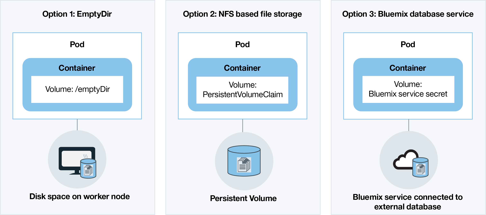

---

copyright:
  years: 2014, 2017
lastupdated: "2017-11-03"

---

{:new_window: target="_blank"}
{:shortdesc: .shortdesc}
{:screen: .screen}
{:pre: .pre}
{:table: .aria-labeledby="caption"}
{:codeblock: .codeblock}
{:tip: .tip}
{:download: .download}


# Planning clusters and apps
{: #cs_planning}

{{site.data.keyword.containershort_notm}} offers several options to configure and customize your Kubernetes cluster to meet the functional and non-functional requirements of your organization. Some of these configurations cannot be changed after a cluster is created. Knowing these configurations in advance can help to ensure that all the resources, such as memory, disk space, and IP addresses are available to the development team.
{:shortdesc}

<br />


## Comparison of lite and standard clusters
{: #cs_planning_cluster_type}

You can create a lite cluster to get familiar and test Kubernetes capabilities or create a standard cluster to get started implementing your apps with the full Kubernetes capabilities.
{:shortdesc}

|Characteristics|Lite clusters|Standard clusters|
|---------------|-------------|-----------------|
|[Available in {{site.data.keyword.Bluemix_notm}} Public](cs_ov.html#public_environment)|||
|[In-cluster networking](#cs_planning_private_network)|||
|[Public network app access by a NodePort service](#cs_nodeport)|||
|[User access management](cs_cluster.html#cs_cluster_user)|||
|[{{site.data.keyword.Bluemix_notm}} service access from the cluster and apps](cs_cluster.html#cs_cluster_service)|||
|[Disk space on worker node for storage](#cs_planning_apps_storage)|||
|[Persistent NFS file-based storage with volumes](#cs_planning_apps_storage)| ||
|[Public or private network app access by a load balancer service](#cs_loadbalancer)| ||
|[Public network app access by an Ingress service](#cs_ingress)| ||
|[Portable public IP addresses](cs_apps.html#cs_cluster_ip_subnet)| ||
|[Available in {{site.data.keyword.Bluemix_dedicated_notm}} (Closed Beta)](cs_ov.html#dedicated_environment)| ||
{: caption="Table 1. Differences between lite and standard clusters" caption-side="top"}

<br />


## Cluster configuration
{: #cs_planning_cluster_config}

Use standard clusters to increase app availability. Your users are less likely to experience downtime when you distribute your setup across multiple worker nodes and clusters. Built-in capabilities, like load balancing and isolation, increase resiliency against potential failures with hosts, networks, or apps.
{:shortdesc}

Review these potential cluster setups that are ordered with increasing degrees of availability:

[](../api/content/containers/images/cs_cluster_ha_roadmap.png)

1.  One cluster with multiple worker nodes
2.  Two clusters that run in different locations in the same region, each with multiple worker nodes
3.  Two clusters that run in different regions, each with multiple worker nodes

Learn more about how you can use these techniques to increase the availability of your cluster:

<dl>
<dt>Include enough worker nodes to spread out app instances</dt>
<dd>For high availability, allow your app developers to spread their containers across multiple worker nodes per cluster. Three worker nodes allow for the downtime of one worker node to occur without interrupting the usage of the app. You can specify how many worker nodes to include when you create a cluster from the [{{site.data.keyword.Bluemix_notm}} GUI](cs_cluster.html#cs_cluster_ui) or the [CLI](cs_cluster.html#cs_cluster_cli). Kubernetes limits the maximum number of worker nodes that you can have in a cluster. Review [worker node and pod quotas ](https://kubernetes.io/docs/admin/cluster-large/) for more information.
<pre class="codeblock">
<code>bx cs cluster-create --location &lt;dal10&gt; --workers 3 --public-vlan &lt;my_public_vlan_id&gt; --private-vlan &lt;my_private_vlan_id&gt; --machine-type &lt;u1c.2x4&gt; --name &lt;my_cluster&gt;</code>
</pre>
</dd>
<dt>Spread apps across clusters</dt>
<dd>Create multiple clusters, each with multiple worker nodes. If an outage occurs with one cluster, users can still access an app that is also deployed in another cluster.
<p>Cluster 1:</p>
<pre class="codeblock">
<code>bx cs cluster-create --location &lt;dal10&gt; --workers 3 --public-vlan &lt;my_public_vlan_id&gt; --private-vlan &lt;my_private_vlan_id&gt; --machine-type &lt;u1c.2x4&gt; --name &lt;my_cluster1&gt;</code>
</pre>
<p>Cluster 2:</p>
<pre class="codeblock">
<code>bx cs cluster-create --location &lt;dal12&gt; --workers 3 --public-vlan &lt;my_public_vlan_id&gt; --private-vlan &lt;my_private_vlan_id&gt; --machine-type &lt;u1c.2x4&gt;  --name &lt;my_cluster2&gt;</code>
</pre>
</dd>
<dt>Spread apps across clusters in different regions</dt>
<dd>When you spread applications across clusters in different regions, you can allow load balancing to occur based on the region the user is in. If the cluster, hardware, or even an entire location in one region goes down, traffic is routed to the container that is deployed in another location.
<p><strong>Important:</strong> After you configure your custom domain, you might use these commands to create the clusters.</p>
<p>Location 1:</p>
<pre class="codeblock">
<code>bx cs cluster-create --location &lt;dal10&gt; --workers 3 --public-vlan &lt;my_public_vlan_id&gt; --private-vlan &lt;my_private_vlan_id&gt; --machine-type &lt;u1c.2x4&gt; --name &lt;my_cluster1&gt;</code>
</pre>
<p>Location 2:</p>
<pre class="codeblock">
<code>bx cs cluster-create --location &lt;ams03&gt; --workers 3 --public-vlan &lt;my_public_vlan_id&gt; --private-vlan &lt;my_private_vlan_id&gt; --machine-type &lt;u1c.2x4&gt; --name &lt;my_cluster2&gt;</code>
</pre>
</dd>
</dl>

<br />


## Worker node configuration
{: #cs_planning_worker_nodes}

A Kubernetes cluster consists of virtual machine worker nodes and is centrally monitored and managed by the Kubernetes master. Cluster admins must decide how to set up the cluster of worker nodes to ensure that cluster users have all the resources to deploy and run apps in the cluster.
{:shortdesc}

When you create a standard cluster, worker nodes are ordered in IBM Cloud infrastructure (SoftLayer) on your behalf and set up in {{site.data.keyword.Bluemix_notm}}. Every worker node is assigned a unique worker node ID and domain name that must not be changed after the cluster is created. Depending on the level of hardware isolation that you choose, worker nodes can be set up as shared or dedicated nodes. Every worker node is provisioned with a specific machine type that determines the number of vCPUs, memory, and disk space that are available to the containers that are deployed to the worker node. Kubernetes limits the maximum number of worker nodes that you can have in a cluster. Review [worker node and pod quotas ](https://kubernetes.io/docs/admin/cluster-large/) for more information.


### Hardware for worker nodes
{: #shared_dedicated_node}

Every worker node is set up as a virtual machine on physical hardware. When you create a standard cluster in {{site.data.keyword.Bluemix_notm}} Public, you must choose whether you want the underlying hardware to be shared by multiple {{site.data.keyword.IBM_notm}} customers (multi tenancy) or to be dedicated to you only (single tenancy).
{:shortdesc}

In a multi-tenant set up, physical resources, such as CPU and memory, are shared across all virtual machines that are deployed to the same physical hardware. To ensure that every virtual machine can run independently, a virtual machine monitor, also referred to as the hypervisor, segments the physical resources into isolated entities and allocates them as dedicated resources to a virtual machine (hypervisor isolation).

In a single-tenant set up, all physical resources are dedicated to you only. You can deploy multiple worker nodes as virtual machines on the same physical host. Similar to the multi-tenant set up, the hypervisor assures that every worker node gets its share of the available physical resources.

Shared nodes are usually cheaper than dedicated nodes because the costs for the underlying hardware are shared among multiple customers. However, when you decide between shared and dedicated nodes, you might want to check with your legal department to discuss the level of infrastructure isolation and compliance that your app environment requires.

When you create a lite cluster, your worker node is automatically provisioned as a shared node in the {{site.data.keyword.IBM_notm}} IBM Cloud infrastructure (SoftLayer) account.

When you create a cluster in {{site.data.keyword.Bluemix_dedicated_notm}}, a single-tenant set up only is used and all physical resources are dedicated to you only. You deploy multiple worker nodes as virtual machines on the same physical host.

<br />


## Cluster management responsibilities
{: #responsibilities}

Review the responsibilities that you share with IBM to manage your clusters. To review responsibilities for clusters that are managed in {{site.data.keyword.Bluemix_dedicated_notm}} environments, see [Differences in cluster management between the cloud environments](cs_ov.html#env_differences) instead.
{:shortdesc}

**IBM is responsible for:**

- Deploying the master, worker nodes, and management components within the cluster, such as Ingress controller, at cluster creation time
- Managing the updates, monitoring, and recovery of the Kubernetes master for the cluster
- Monitoring the health of the worker nodes and providing automation for the update and recovery of those worker nodes
- Performing automation tasks against your infrastructure account, including adding worker nodes, removing worker nodes, and creating a default subnet
- Managing, updating, and recovering operational components within the cluster, such as the Ingress controller and the storage plug-in
- Provisioning of storage volumes when requested by persistent volume claims
- Providing security settings on all worker nodes

<br />
**You are responsible for:**

- [Deploying and managing Kubernetes resources, such as pods, services, and deployments, within the cluster](cs_apps.html#cs_apps_cli)
- [Leveraging the capabilities of the service and Kubernetes to ensure high availability of apps](cs_planning.html#highly_available_apps)
- [Adding or removing capacity by using the CLI to add or remove worker nodes](cs_cli_reference.html#cs_worker_add)
- [Creating public and private VLANs in IBM Cloud infrastructure (SoftLayer) for network isolation of your cluster ](https://knowledgelayer.softlayer.com/topic/vlans)
- [Ensuring that all worker nodes have network connectivity to the Kubernetes master URL](cs_security.html#opening_ports) <p>**Note**: If a worker node has both public and private VLANs, then network connectivity is configured. If the worker node has a private VLAN only set up, then a vyatta is required to provide network connectivity.</p>
- [Updating the master kube-apiserver and worker nodes when Kubernetes major or minor version updates are available](cs_cluster.html#cs_cluster_update)
- [Taking action to recover troubled worker nodes by running `kubectl` commands, such as `cordon` or `drain`, and by running `bx cs` commands, such as `reboot`, `reload`, or `delete`](cs_cli_reference.html#cs_worker_reboot)
- [Adding or removing additional subnets in IBM Cloud infrastructure (SoftLayer) as needed](cs_cluster.html#cs_cluster_subnet)
- [Backing up and restoring data in persistent storage in IBM Cloud infrastructure (SoftLayer) ](../services/RegistryImages/ibm-backup-restore/index.html#ibmbackup_restore_starter)

<br />


## Deployments
{: #highly_available_apps}

The more widely you distribute your setup across multiple worker nodes and clusters, the less likely your users are to experience downtime with your app.
{:shortdesc}

Review these potential app set ups that are ordered with increasing degrees of availability:

[](../api/content/containers/images/cs_app_ha_roadmap.png)

1.  A deployment with n+2 pods that are managed by a replica set.
2.  A deployment with n+2 pods that are managed by a replica set and spread across multiple nodes (anti-affinity) in the same location.
3.  A deployment with n+2 pods that are managed by a replica set and spread across multiple nodes (anti-affinity) in different locations.
4.  A deployment with n+2 pods that are managed by a replica set and spread across multiple nodes (anti-affinity) in different regions.

Learn more about the techniques to increase the availability of your app:

<dl>
<dt>Use deployments and replica sets to deploy your app and its dependencies</dt>
<dd>A deployment is a Kubernetes resource that you can use to declare all components of your app and its dependencies. By describing the single components rather than writing down all necessary steps and the order to create them, you can concentrate on how your app should look like when it is running.
</br></br>
When you deploy more than one pod, a replica set is automatically created for your deployments that monitors the pods and assures that the desired number of pods is up and running at all times. When a pod goes down, the replica set replaces the unresponsive pod with a new one.
</br></br>
You can use a deployment to define update strategies for your app including the number of pods that you want to add during a rolling update and the number of pods that can be unavailable at a time. When you perform a rolling update, the deployment checks whether or not the revision is working and stops the rollout when failures are detected.
</br></br>
Deployments also provide the possibility to concurrently deploy multiple revisions with different flags, so you can for example test a deployment first before you decide to push it to production.
</br></br>
Every deployment keeps track of the revisions that were deployed. You can use this history of revisions to roll back to a previous version when you encounter that your updates are not working as expected.</dd>
<dt>Include enough replicas for your app's workload, plus two</dt>
<dd>To make your app even more highly available and more resilient to failure, consider including extra replicas than the minimum to handle the expected workload. Extra replicas can handle the workload in case a pod crashes and the replica set has not yet recovered the crashed pod. For protection against two simultaneous failures, include two extra replicas. This set up is an N+2 pattern, where N is the number of replicas to handle incoming workload and +2 is an extra two replicas. You can have as many pods as you want in a cluster, as long as the cluster has enough space for them.</dd>
<dt>Spread pods across multiple nodes (anti-affinity)</dt>
<dd>When you create your deployment, each pod might be deployed to the same worker node. This setup where pods exist on the same worker node is known as affinity or co-location. To protect your app from a worker node failure, you can enforce your deployment to spread the pods across multiple worker nodes by using the <strong>podAntiAffinity</strong> option. This option is available for standard clusters only.

</br></br>
<strong>Note:</strong> The following YAML file enforces that every pod is deployed to a different worker node. When you have more replicas defined than you have available worker nodes in your cluster, only the number of replicas is deployed that can fulfill the anti-affinity requirement. Any additional replicas remain in a pending state until additional worker nodes are added to the cluster.

<pre class="codeblock">
<code>apiVersion: extensions/v1beta1
kind: Deployment
metadata:
  name: wasliberty
spec:
  replicas: 3
  template:
    metadata:
      labels:
        app: wasliberty
    spec:
      affinity:
        podAntiAffinity:
          preferredDuringSchedulingIgnoredDuringExecution:
          - weight: 100
            podAffinityTerm:
              labelSelector:
                matchExpressions:
                - key: app
                  operator: In
                  values:
                  - wasliberty
              topologyKey: kubernetes.io/hostname
      containers:
      - name: wasliberty
        image: registry.&lt;region&gt;.bluemix.net/ibmliberty
        ports:
        - containerPort: 9080
---
apiVersion: v1
kind: Service
metadata:
  name: wasliberty
  labels:
    app: wasliberty
spec:
  ports:
    # the port that this service should serve on
  - port: 9080
  selector:
    app: wasliberty
  type: NodePort</code></pre>

</dd>
<dt>Distribute pods across multiple locations or regions</dt>
<dd>To protect your app from a location or region failure, you can create a second cluster in another location or region and use a deployment YAML to deploy a duplicate replica set for your app. By adding a shared route and load balancer in front of your clusters, you can spread your work load across locations and regions. For more information about sharing a route between clusters, see <a href="cs_cluster.html#cs_cluster" target="_blank">High availability of clusters</a>.

For more detail, review the options for <a href="cs_planning.html#cs_planning_cluster_config" target="_blank">highly available deployments</a>.</dd>
</dl>


### Minimal app deployment
{: #minimal_app_deployment}

A basic app deployment in a lite or standard cluster might include the following components.
{:shortdesc}

<a href="../api/content/containers/images/cs_app_tutorial_components1.png"></a>

Configuration file example for a minimal app.
```
apiVersion: extensions/v1beta1
kind: Deployment
metadata:
  name: ibmliberty
spec:
  replicas: 1
  template:
    metadata:
      labels:
        app: ibmliberty
    spec:
      containers:
      - name: ibmliberty
        image: registry.<region>.bluemix.net/ibmliberty:latest
---
apiVersion: v1
kind: Service
metadata:
  name: ibmliberty-service
  labels:
    app: ibmliberty
spec:
  selector:
    run: ibmliberty
  type: NodePort
  ports:
   - protocol: TCP
     port: 9080
```
{: codeblock}

<br />


## In-cluster networking
{: #cs_planning_private_network}

Secured, in-cluster network communication between worker nodes and pods is realized with private virtual local area networks (VLANs). A VLAN configures a group of worker nodes and pods as if they were attached to the same physical wire.
{:shortdesc}

When you create a cluster, every cluster is automatically connected to a private VLAN. The private VLAN determines the private IP address that is assigned to a worker node during cluster creation.

|Cluster type|Manager of the private VLAN for the cluster|
|------------|-------------------------------------------|
|Lite clusters in {{site.data.keyword.Bluemix_notm}} Public|{{site.data.keyword.IBM_notm}}|
|Standard clusters in {{site.data.keyword.Bluemix_notm}} Public|You in your IBM Cloud infrastructure (SoftLayer) account <p>**Tip:** To have access to all VLANs in your account, turn on [VLAN Spanning ](https://knowledgelayer.softlayer.com/procedure/enable-or-disable-vlan-spanning).</p>|
|Standard clusters in {{site.data.keyword.Bluemix_dedicated_notm}}|{{site.data.keyword.IBM_notm}}|
{: caption="Table 2. Private VLAN management responsibilities" caption-side="top"}

All pods that are deployed to a worker node are also assigned a private IP address. Pods are assigned an IP in the 172.30.0.0/16 private address range and are routed between worker nodes only. To avoid conflicts, do not use this IP range on any nodes that will communicate with your worker nodes. Worker nodes and pods can securely communicate on the private network by using the private IP addresses. However, when a pod crashes or a worker node needs to be re-created, a new private IP address is assigned.

Because it is difficult to track changing private IP addresses for apps that must be highly available, you can use the built-in Kubernetes service discovery features and expose apps as cluster IP services on the private network in the cluster. A Kubernetes service groups a set of pods and provides network connection to these pods for other services in the cluster without exposing the actual private IP address of each pod. When you create a cluster IP service, a private IP address is assigned to that service from the 10.10.10.0/24 private address range. As with the pod private address range, do not use this IP range on any nodes that will communicate with your worker nodes. This IP address is accessible inside the cluster only. You cannot access this IP address from the internet. At the same time, a DNS lookup entry is created for the service and stored in the kube-dns component of the cluster. The DNS entry contains the name of the service, the namespace where the service was created, and the link to the assigned private cluster IP address.

If an app in the cluster needs to access a pod that lies behind a cluster IP service, it can either use the private cluster IP address that was assigned to the service or send a request by using the name of the service. When you use the name of the service, the name is looked up in the kube-dns component and routed to the private cluster IP address of the service. When a request reaches the service, the service ensures that all requests are equally forwarded to the pods, independent of their private IP addresses and the worker node they are deployed to.

For more information about how to create a service of type cluster IP, see [Kubernetes services ](https://kubernetes.io/docs/concepts/services-networking/service/#publishing-services---service-types).

<br />


## Public networking
{: #cs_planning_public_network}

When you create a cluster, every cluster must be connected to a public VLAN. The public VLAN determines the public IP address that is assigned to a worker node during cluster creation.
{:shortdesc}

The public network interface for the worker nodes in both lite and standard clusters is protected by Calico network policies. These policies block most inbound traffic by default, including SSH. However, inbound traffic that is necessary for Kubernetes to function is allowed, as are connections to NodePort, Loadbalancer, and Ingress services. For more information about these policies, inlcuding how to modify them, see [Network policies](cs_security.html#cs_security_network_policies).

|Cluster type|Manager of the public VLAN for the cluster|
|------------|------------------------------------------|
|Lite clusters in {{site.data.keyword.Bluemix_notm}} Public|{{site.data.keyword.IBM_notm}}|
|Standard clusters in {{site.data.keyword.Bluemix_notm}} Public|You in your IBM Cloud infrastructure (SoftLayer) account|
|Standard clusters in {{site.data.keyword.Bluemix_dedicated_notm}}|{{site.data.keyword.IBM_notm}}|
{: caption="Table 3. VLAN management responsibilities" caption-side="top"}

Depending on whether you created a lite or standard cluster, you can choose between the following options to expose an app to the public.

-   [NodePort service](#cs_nodeport) (lite and standard clusters)
-   [LoadBalancer service](#cs_loadbalancer) (standard clusters only)
-   [Ingress](#cs_ingress) (standard clusters only)


### Expose an app to the internet by using a NodePort service
{: #cs_nodeport}

Expose a public port on your worker node and use the public IP address of the worker node to access your service in the cluster publicly from the internet.
{:shortdesc}

[](../api/content/containers/images/cs_nodeport.png)

When you expose your app by creating a Kubernetes service of type NodePort, a NodePort in the range of 30000 - 32767 and an internal cluster IP address is assigned to the service. The NodePort service serves as the external entry point for incoming requests for your app. The assigned NodePort is publicly exposed in the kubeproxy settings of each worker node in the cluster. Every worker node starts listening on the assigned NodePort for incoming requests for the service. To access the service from the internet, you can use the public IP address of any worker node that was assigned during cluster creation and the NodePort in the format `<ip_address>:<nodeport>`. In addition to the public IP address, a NodePort service is available over the private IP address of a worker node.

When a request arrives at the NodePort service, it is automatically forwarded to the internal cluster IP of the service and further forwarded from the kubeproxy component to the private IP address of the pod where the app is deployed. The cluster IP is accessible inside the cluster only. If you have multiple replicas of your app running in different pods, the kubeproxy component load balances incoming requests across all replicas.

**Note:** The public IP address of the worker node is not permanent. When a worker node is removed or re-created, a new public IP address is assigned to the worker node. You can use the NodePort service for testing the public access for your app or when public access is needed for a short amount of time only. When you require a stable public IP address and more availability for your service, expose your app by using a [LoadBalancer service](#cs_loadbalancer) or [Ingress](#cs_ingress).

For more information about how to create a service of type NodePort with {{site.data.keyword.containershort_notm}}, see [Configuring public access to an app by using the NodePort service type](cs_apps.html#cs_apps_public_nodeport).


### Expose an app to the internet by using a LoadBalancer service
{: #cs_loadbalancer}

Expose a port and use the public or private IP address for the load balancer to access the app.

[](../api/content/containers/images/cs_loadbalancer.png)

When you create a standard cluster, {{site.data.keyword.containershort_notm}} automatically requests five portable public and five private IP addresses and provisions them into your IBM Cloud infrastructure (SoftLayer) account during cluster creation. Two of the portable IP addresses, one public and one private, are used for the [Ingress controller](#cs_ingress). Four portable public and Four private IP addresses can be used to expose apps by creating a LoadBalancer service.

When you create a Kubernetes LoadBalancer service in a cluster on a public VLAN, an external load balancer is created. One of the four available public IP addresses is assigned to the load balancer. If no portable public IP address is available, the creation of your LoadBalancer service fails. The LoadBalancer service serves as the external entry point for incoming requests for the app. Unlike with NodePort services, you can assign any port to your load balancer and are not bound to a certain port range. The portable public IP address that is assigned to your LoadBalancer service is permanent and does not change when a worker node is removed or re-created. Therefore, the LoadBalancer service is more available than the NodePort service. To access the LoadBalancer service from the internet, use the public IP address of your load balancer and the assigned port in the format `<ip_address>:<port>`.

When a request arrives at the LoadBalancer service, the request is automatically forwarded to the internal cluster IP address that is assigned to the LoadBalancer service during service creation. The cluster IP address is accessible inside the cluster only. From the cluster IP address, incoming requests are further forwarded to the `kube-proxy` component of your worker node. Then the requests are forwarded to the private IP address of the pod where the app is deployed. If you have multiple replicas of your app that are running in different pods, the `kube-proxy` component load balances incoming requests across all replicas.

If you use a LoadBalancer service, a node port is also available on each IP address of any worker node. To block access to node port while you are using a LoadBalancer service, see [Blocking incoming traffic](cs_security.html#cs_block_ingress).

Your options for IP addresses when you create a LoadBalancer service are as follows:

- If your cluster is on a public VLAN, a portable public IP address is used.
- If your cluster is available on a private VLAN only, then a portable private IP address is used.
- You can request a portable public or private IP address for a LoadBalancer service by adding an annotation to the configuration file: `service.kubernetes.io/ibm-load-balancer-cloud-provider-ip-type: <public_or_private>`.

For more information about how to create a LoadBalancer service with {{site.data.keyword.containershort_notm}}, see [Configuring public access to an app by using the load balancer service type](cs_apps.html#cs_apps_public_load_balancer).

### Expose an app to the internet with Ingress
{: #cs_ingress}

Ingress allows you to expose multiple services in your cluster and make them publicly available by using a single public entry point.

[](../api/content/containers/images/cs_ingress.png)

Rather than creating a load balancer service for each app that you want to expose to the public, Ingress provides a unique public route that lets you forward public requests to apps inside and outside your cluster based on their individual paths. Ingress consists of two main components. The Ingress resource defines the rules for how to route incoming requests for an app. All Ingress resources must be registered with the Ingress controller that listens for incoming HTTP or HTTPS service requests and forwards requests based on the rules defined for each Ingress resource.

When you create a standard cluster, {{site.data.keyword.containershort_notm}} automatically creates a highly available Ingress controller for your cluster and assigns a unique public route with the format `<cluster_name>.<region>.containers.mybluemix.net` to it. The public route is linked to a portable public IP address that is provisioned into your IBM Cloud infrastructure (SoftLayer) account during cluster creation.

To expose an app via Ingress, you must create a Kubernetes service for your app and register this service with the Ingress controller by defining an Ingress resource. The Ingress resource specifies the path that you want to append to the public route to form a unique URL for your exposed app, like for example: `mycluster.us-south.containers.mybluemix.net/myapp`. When you enter this route into your web browser, the request is sent to the linked portable public IP address of the Ingress controller. The Ingress controller checks if a routing rule for the `myapp` path in the `mycluster` cluster exists. If a matching rule is found, the request including the individual path is forwarded to the pod where the app is deployed, considering the rules that were defined in the original Ingress resource object. In order for the app to process incoming requests, make sure that your app listens on the individual path that you defined in the Ingress resource.

You can configure the Ingress controller to manage incoming network traffic for your apps for the following scenarios:

-   Use the IBM-provided domain without TLS termination
-   Use the IBM-provided domain and TLS certificate with TLS termination
-   Use your custom domain and TLS certificate to do TLS termination
-   Use the IBM-provided or your custom domain and TLS certificates to access apps outside your cluster
-   Add capabilities to your Ingress controller by using annotations

For more information about how to use Ingress with {{site.data.keyword.containershort_notm}}, see [Configuring public access to an app by using the Ingress controller](cs_apps.html#cs_apps_public_ingress).

<br />


## User access management
{: #cs_planning_cluster_user}

You can grant access to a cluster for other users in your organization to ensure that only authorized users can work with the cluster and deploy apps to the cluster.
{:shortdesc}

For more information, see [Managing users and access to a cluster in {{site.data.keyword.containershort_notm}}](cs_cluster.html#cs_cluster_user).

<br />


## Image registries
{: #cs_planning_images}

A Docker image is the basis for every container that you create. An image is created from a Dockerfile, which is a file that contains instructions to build the image. A Dockerfile might reference build artifacts in its instructions that are stored separately, such as an app, the app's configuration, and its dependencies.
{:shortdesc}

Images are typically stored in a registry that can either be accessible by the public (public registry) or set up with limited access for a small group of users (private registry). Public registries, such as Docker Hub, can be used to get started with Docker and Kubernetes to create your first containerized app in a cluster. But when it comes to enterprise applications, use a private registry, like the one provided in {{site.data.keyword.registryshort_notm}} to protect your images from being used and changed by unauthorized users. Private registries must be set up by the cluster admin to ensure that the credentials to access the private registry are available to the cluster users.

You can use multiple registries with {{site.data.keyword.containershort_notm}} to deploy apps to your cluster.

|Registry|Description|Benefit|
|--------|-----------|-------|
|[{{site.data.keyword.registryshort_notm}}](/docs/services/Registry/index.html)|With this option, you can set up your own secured Docker image repository in {{site.data.keyword.registryshort_notm}} where you can safely store and share images between cluster users.|<ul><li>Manage access to images in your account.</li><li>Use {{site.data.keyword.IBM_notm}} provided images and sample apps, such as {{site.data.keyword.IBM_notm}} Liberty, as a parent image and add your own app code to it.</li><li>Automatic scanning of images for potential vulnerabilities by Vulnerability Advisor, including OS specific recommendations to fix them.</li></ul>|
|Any other private registry|Connect any existing private registry to your cluster by creating an [imagePullSecret ](https://kubernetes.io/docs/concepts/containers/images/). The secret is used to securely save your registry URL and credentials in a Kubernetes secret.|<ul><li>Use existing private registries independent of their source (Docker Hub, organization owned registries, or other private Cloud registries).</li></ul>|
|Public Docker Hub|Use this option to directly use existing public images from Docker Hub when no Dockerfile changes are needed. <p>**Note:** Keep in mind that this option might not meet your organization's security requirements, like access management, vulnerability scanning, or app privacy.</p>|<ul><li>No additional set up is needed for your cluster.</li><li>Includes a variety of open-source applications.</li></ul>|
{: caption="Table 4. Public and private image registry options" caption-side="top"}

After you set up an image registry, cluster users can use the images for their app deployments to the cluster.

For more information about how to access a public or private registry and use an image to create your container, see [Using private and public image registries with {{site.data.keyword.containershort_notm}}](cs_cluster.html#cs_apps_images).

<br />


## Persistent data storage
{: #cs_planning_apps_storage}

A container is, by design, short-lived. However, you can choose between several options to persist data for the case of a container failover and to share data between containers.
{:shortdesc}

[](../api/content/containers/images/cs_planning_apps_storage.png)

|Option|Description|
|------|-----------|
|Option 1: Use `/emptyDir` to persist data using the available disk space on the worker node<p>This feature is available for lite and standard clusters.</p>|With this option, you can create an empty volume on the disk space of your worker node that is assigned to a pod. The container in that pod can read from and write to that volume. Because the volume is assigned to one specific pod, data cannot be shared with other pods in a replica set.<p>An `/emptyDir` volume and its data are removed when the assigned pod is permanently deleted from the worker node.</p><p>**Note:** If the container inside the pod crashes, the data in the volume is still available on the worker node.</p><p>For more information, see [Kubernetes volumes ](https://kubernetes.io/docs/concepts/storage/volumes/).</p>|
|Option 2: Create a persistent volume claim to provision NFS based persistent storage for your deployment<p>This feature is available for standard clusters only.</p>|With this option, you can have persistent storage of app and container data through an unlimited number of NFS file shares and persistent volumes. You create a [persistent volume claim](cs_apps.html) to initiate a request for NFS based file storage. {{site.data.keyword.containershort_notm}} provides predefined storage classes that define the range of sizes of the storage, IOPS, and the read and write permissions for the volume. You can choose between these storage classes when you create your persistent volume claim. After you submit a persistent volume claim, {{site.data.keyword.containershort_notm}} dynamically provisions a persistent volume that is hosted on NFS based file storage. [You can mount the persistent volume claim](cs_apps.html#cs_apps_volume_claim) as a volume to your pod to allow the container in your pod to read from and write to the volume. Persistent volumes can be shared across pods in the same replica set or with other pods in the same cluster.<p>When a container crashes or a pod is removed from a worker node, the data is not removed and can still be accessed by other pods that mount the volume. Persistent volume claims are hosted on persistent storage but do not have backups. If you require a backup of your data, create a manual backup.</p><p>**Note:** Persistent NFS file share storage is charged on a monthly basis. If you provision persistent storage for your cluster and remove it immediately, you still have to pay the monthly charge for the persistent storage, even if you used it only for a short amount of time.</p>|
|Option 3: Bind an {{site.data.keyword.Bluemix_notm}} database service to your pod<p>This feature is available for lite and standard clusters.</p>|With this option, you can persist and access data by using an {{site.data.keyword.Bluemix_notm}} database cloud service. When you bind the {{site.data.keyword.Bluemix_notm}} service to a namespace in your cluster, a Kubernetes secret is created. The Kubernetes secret holds confidential information about the service, such as the URL to the service, your user name, password. You can mount the secret as a secret volume to your pod and access the service by using the credentials in the secret. By mounting the secret volume to other pods, you can also share data between pods.<p>When a container crashes or a pod is removed from a worker node, the data is not removed and can still be accessed by other pods that mount the secret volume.</p><p>Most {{site.data.keyword.Bluemix_notm}} database services provide disk space for a small amount of data at no cost, so you can test its features.</p><p>For more information about how to bind an {{site.data.keyword.Bluemix_notm}} service to a pod, see [Adding {{site.data.keyword.Bluemix_notm}} services for apps in {{site.data.keyword.containershort_notm}}](cs_apps.html#cs_apps_service).</p>|
{: caption="Table 5. Persistent data storage options for deployments in Kubernetes clusters" caption-side="top"}

<br />


## Monitoring tools
{: #cs_planning_health}

You can use the standard Kubernetes and Docker features to monitor the health of your clusters and apps. To find logs for troubleshooting issues with your clusters and apps, see [Configuring cluster logging](cs_cluster.html#cs_logging).
{:shortdesc}

<dl>
<dt>Cluster details page in {{site.data.keyword.Bluemix_notm}}</dt>
<dd>{{site.data.keyword.containershort_notm}} provides information about the health and capacity of your cluster and the usage of your cluster resources. You can use this GUI to scale out your cluster, work with your persistent storage, and add additional capabilities to your cluster through {{site.data.keyword.Bluemix_notm}} service binding. To view the cluster details page, go to your **{{site.data.keyword.Bluemix_notm}} Dashboard** and select a cluster.</dd>
<dt>Kubernetes dashboard</dt>
<dd>The Kubernetes dashboard is an administrative web interface that you can use to review the health of your worker nodes, find Kubernetes resources, deploy containerized apps, and to troubleshoot apps based on logging and monitoring information. For more information about how to access your Kubernetes dashboard, see [Launching the Kubernetes dashboard for {{site.data.keyword.containershort_notm}}](cs_apps.html#cs_cli_dashboard).</dd>
<dt>{{site.data.keyword.monitoringlong_notm}}</dt>
<dd>For standard clusters, metrics are located in the {{site.data.keyword.Bluemix_notm}} space that was logged in to when the Kubernetes cluster was created. Container metrics are collected automatically for all containers that are deployed in a cluster. These metrics are sent and are made available through Grafana. For more information on metrics, see [Monitoring for the {{site.data.keyword.containershort_notm}}](/docs/services/cloud-monitoring/containers/monitoring_containers_ov.html#monitoring_bmx_containers_ov).<p>To access the Grafana dashboard, go to one of the following URLs and select the {{site.data.keyword.Bluemix_notm}} organization and space where you created the cluster.<ul><li>US-South and US-East: https://metrics.ng.bluemix.net</li><li>UK-South: https://metrics.eu-gb.bluemix.net</li></ul></p></dd></dl>

### Other health monitoring tools
{: #cs_planning_health_tools}

You can configure other tools for additional logging and monitoring capabilities.
<dl>
<dt>Prometheus</dt>
<dd>Prometheus is an open source monitoring, logging, and alerting tool that was specifically designed for Kubernetes to retrieve detailed information about the cluster, worker nodes, and deployment health based on the Kubernetes logging information. For setup information, see [Integrating services with {{site.data.keyword.containershort_notm}}](#cs_planning_integrations).</dd>
</dl>

<br />


## Integrations
{: #cs_planning_integrations}

You can use various external services and services in the {{site.data.keyword.Bluemix_notm}} Catalog with a standard cluster in {{site.data.keyword.containershort_notm}}.
{:shortdesc}

<table summary="Summary for accessibility">
<caption>Table 6. Integration options for clusters and apps in Kubernetes</caption>
<thead>
<tr>
<th>Service</th>
<th>Description</th>
</tr>
</thead>
<tbody>
<tr>
<td>Blockchain</td>
<td>Deploy a publicly available development environment for IBM Blockchain to a Kubernetes cluster in {{site.data.keyword.containerlong_notm}}. Use this environment to develop and customize your own blockchain network to deploy apps that share an immutable ledger for recording the history of transactions. For more information, see <a href="https://ibm-blockchain.github.io" target="_blank">Develop in a cloud sandbox
IBM Blockchain Platform </a>. </td>
</tr>
<tr>
<td>Continuous Delivery</td>
<td>Automate your app builds and container deployments to Kubernetes clusters by using a toolchain. For setup information, see the blog <a href="https://developer.ibm.com/recipes/tutorials/deploy-kubernetes-pods-to-the-bluemix-container-service-using-devops-pipelines/" target="_blank">Deploy Kubernetes pods to the {{site.data.keyword.containerlong_notm}} using DevOps Pipelines </a>. </td>
</tr>
<tr>
<td>Helm</td>
<td> <a href="https://helm.sh/" target="_blank">Helm </a> is a Kubernetes package manager. Create Helm Charts to define, install, and upgrade complex Kubernetes applications running in {{site.data.keyword.containerlong_notm}} clusters. Learn more about how you can <a href="https://developer.ibm.com/recipes/tutorials/increase-deployment-velocity-with-kubernetes-helm-charts/" target="_blank">increase deployment velocity with Kubernetes Helm Charts </a>. </td>
</tr>
<tr>
<td>Istio</td>
<td>Istio is an open source service that gives developers a way to connect, secure, manage, and monitor a network of microservices, also known a service mesh, on cloud orchestration platforms like Kubernetes. Istio provides the capability to manage network traffic, load balance across microservices, enforce access policies, and verify service identity on the service mesh. To install Istio on your Kubernetes cluster in {{site.data.keyword.containershort_notm}}, see the <a href="https://istio.io/docs/tasks/installing-istio.html" target="_blank">installation topic </a> in the Istio documentation. To review a sample developer journey about how to use Istio with Kubernetes, see <a href="https://developer.ibm.com/code/journey/manage-microservices-traffic-using-istio/" target="_blank">Manage microservices traffic using Istio </a>.</td>
</tr>
<tr>
<td>Prometheus</td>
<td>Prometheus is an open source monitoring, logging, and alerting tool that was specifically designed for Kubernetes to retrieve detailed information about the cluster, worker nodes, and deployment health based on the Kubernetes logging information. The CPU, memory, I/O, and network activity of all running containers in a cluster are collected and can be used in custom queries or alerts to monitor performance and workloads in your cluster.
<p>To use Prometheus:</p>
<ol>
<li>Install Prometheus by following <a href="https://github.com/coreos/prometheus-operator/tree/master/contrib/kube-prometheus" target="_blank">the CoreOS instructions </a>.
<ol>
<li>When you run the export command, use your kube-system namespace. <p><code>export NAMESPACE=kube-system hack/cluster-monitoring/deploy</code></p></li>
</ol>
</li>
<li>After Prometheus is deployed in your cluster, edit the Prometheus data source in Grafana to refer to <code>prometheus.kube-system:30900</code>.</li>
</ol>
</td>
</tr>
<tr>
<td>Weave Scope</td>
<td>Weave Scope provides a visual diagram of your resources within a Kubernetes cluster, including services, pods, containers, processes, nodes, and more. Weave Scope provides interactive metrics for CPU and memory and also provides tools to tail and exec into a container.<p>For more information, see [Visualizing Kubernetes cluster resources with Weave Scope and {{site.data.keyword.containershort_notm}}](cs_cluster.html#cs_weavescope).</p></li></ol>
</td>
</tr>
</tbody>
</table>

<br />


## Access the IBM Cloud infrastructure (SoftLayer) portfolio
{: #cs_planning_unify_accounts}

To create a standard Kubernetes cluster, you must have access to the IBM Cloud infrastructure (SoftLayer) portfolio. This access is needed to request paid infrastructure resources, such as worker nodes, portable public IP addresses, or persistent storage for your cluster.
{:shortdesc}

{{site.data.keyword.Bluemix_notm}} Pay-As-You-Go accounts that were created after automatic account linking was enabled are already set up with access to the IBM Cloud infrastructure (SoftLayer) portfolio, so that you can purchase infrastructure resources for your cluster without additional configuration.

Users with other {{site.data.keyword.Bluemix_notm}} account types or users that have an existing IBM Cloud infrastructure (SoftLayer) account that is not linked to their {{site.data.keyword.Bluemix_notm}} account, must configure their accounts to create standard clusters.

Review the following table to find available options for each account type.

|Account type|Description|Available options to create a standard cluster|
|------------|-----------|----------------------------------------------|
|Free trial or standard accounts|Free trial or standard accounts can provision 1 lite cluster and cannot provision a standard cluster. <p>To create a standard cluster, you have two options.</p>|<ul><li>Option 1: [Upgrade your free trial account to an {{site.data.keyword.Bluemix_notm}} Pay-As-You-Go account](/docs/pricing/billable.html#upgradetopayg) that is set up with access to the IBM Cloud infrastructure (SoftLayer) portfolio.</li><li>Option 2: [Link your free trial account to an existing IBM Cloud infrastructure (SoftLayer) account](/docs/pricing/linking_accounts.html#unifyingaccounts).<p>After linking both accounts, your free trial account is automatically upgraded to a Pay-As-You-Go account. When you link your accounts, you are billed through {{site.data.keyword.Bluemix_notm}} for both, {{site.data.keyword.Bluemix_notm}} and IBM Cloud infrastructure (SoftLayer) resources.</p><p>**Note:** The IBM Cloud infrastructure (SoftLayer) account that you link must be set up with Super User permissions.</p></li></ul>|
|Older Pay-As-You-Go accounts|Pay-As-You-Go accounts that were created before automatic account linking was available, did not come with access to the IBM Cloud infrastructure (SoftLayer) portfolio.<p>If you have an existing IBM Cloud infrastructure (SoftLayer) account, you cannot link this account to an older Pay-As-You-Go account.</p>|<ul><li>Option 1: [Create a new Pay-As-You-Go account](/docs/pricing/billable.html#billable) that is set up with access to the IBM Cloud infrastructure (SoftLayer) portfolio. When you choose this option, you have two separate {{site.data.keyword.Bluemix_notm}} accounts and billings.<p>If you want to continue using your old Pay-As-You-Go account to create standard clusters, you can use your new Pay-As-You-Go account to generate an API key to access the IBM Cloud infrastructure (SoftLayer) portfolio. Then, you must set the API key for your old Pay-As-You-Go account. For more information, see [Generating an API key for old Pay-As-You-Go and Subscription accounts](#old_account). Keep in mind that IBM Cloud infrastructure (SoftLayer) resources are billed through your new Pay-As-You-Go account.</p></li><li>Option 2: If you already have an existing IBM Cloud infrastructure (SoftLayer) account that you want to use, you can [set your credentials](cs_cli_reference.html#cs_credentials_set) for your {{site.data.keyword.Bluemix_notm}} account.<p>**Note:** The IBM Cloud infrastructure (SoftLayer) account that you use with your {{site.data.keyword.Bluemix_notm}} account must be set up with Super User permissions.</p></li></ul>|
|Subscription accounts|Subscription accounts are not set up with access to the IBM Cloud infrastructure (SoftLayer) portfolio.|<ul><li>Option 1: [Create a new Pay-As-You-Go account](/docs/pricing/billable.html#billable) that is set up with access to the IBM Cloud infrastructure (SoftLayer) portfolio. When you choose this option, you have two separate {{site.data.keyword.Bluemix_notm}} accounts and billings.<p>If you want to continue using your Subscription account to create standard clusters, you can use your new Pay-As-You-Go account to generate an API key to access the IBM Cloud infrastructure (SoftLayer) portfolio. Then, you must set the API key for your Subscription account. For more information, see [Generating an API key for old Pay-As-You-Go and Subscription accounts](#old_account). Keep in mind that IBM Cloud infrastructure (SoftLayer) resources are billed through your new Pay-As-You-Go account.</p></li><li>Option 2: If you already have an existing IBM Cloud infrastructure (SoftLayer) account that you want to use, you can [set your credentials](cs_cli_reference.html#cs_credentials_set) for your {{site.data.keyword.Bluemix_notm}} account.<p>**Note:** The IBM Cloud infrastructure (SoftLayer) account that you use with your {{site.data.keyword.Bluemix_notm}} account must be set up with Super User permissions.</p></li></ul>|
|IBM Cloud infrastructure (SoftLayer) accounts, no {{site.data.keyword.Bluemix_notm}} account|To create a standard cluster, you must have an {{site.data.keyword.Bluemix_notm}} account.|<ul><li>Option 1: [Create a new Pay-As-You-Go account](/docs/pricing/billable.html#billable) that is set up with access to the IBM Cloud infrastructure (SoftLayer) portfolio. When you choose this option, a new IBM Cloud infrastructure (SoftLayer) is created for you. You have two separate IBM Cloud infrastructure (SoftLayer) accounts and billing.</li><li>Option 2: [Create a free trial account](/docs/pricing/free.html#pricing) and [link it to your existing IBM Cloud infrastructure (SoftLayer) account](/docs/pricing/linking_accounts.html#unifyingaccounts). After linking both accounts, your free trial account is automatically upgraded to a Pay-As-You-Go account. When you link your accounts, you are billed through {{site.data.keyword.Bluemix_notm}} for both, {{site.data.keyword.Bluemix_notm}} and IBM Cloud infrastructure (SoftLayer) resources.<p>**Note:** The IBM Cloud infrastructure (SoftLayer) account that you link must be set up with Super User permissions.</p></li></ul>|
{: caption="Table 7. Available options to create standard clusters with accounts that are not linked to an IBM Cloud infrastructure (SoftLayer) account" caption-side="top"}


### Generating an IBM Cloud infrastructure (SoftLayer) API key to use with {{site.data.keyword.Bluemix_notm}} accounts
{: #old_account}

If you want to continue using your old Pay-As-You-Go or Subscription account to create standard clusters, you must generate an API key with your new Pay-As-You-Go account and set the API key for your old account.
{:shortdesc}

Before you begin, create an {{site.data.keyword.Bluemix_notm}} Pay-As-You-Go account that is automatically set up with access to the IBM Cloud infrastructure (SoftLayer) portfolio.

1.  Log in to the [IBM Cloud infrastructure (SoftLayer) portal ](https://control.softlayer.com/) by using the {{site.data.keyword.ibmid}} and password that you created for your new Pay-As-You-Go account.
2.  Select **Account**, and then **Users**.
3.  Click **Generate** to generate an IBM Cloud infrastructure (SoftLayer) API key for your new Pay-As-You-Go account.
4.  Copy the API key.
5.  From the CLI, log in to {{site.data.keyword.Bluemix_notm}} by using the {{site.data.keyword.ibmid}} and password of your old Pay-As-You-Go or Subscription account.

  ```
  bx login
  ```
  {: pre}

6.  Set the API key that you generated earlier to access the IBM Cloud infrastructure (SoftLayer) portfolio. Replace `<API_KEY>` with the API key and `<USERNAME>` with the {{site.data.keyword.ibmid}} of your new Pay-As-You-Go account.

  ```
  bx cs credentials-set --infrastructure-api-key <API_KEY> --infrastructure-username <USERNAME>
  ```
  {: pre}

7.  Start [creating standard clusters](cs_cluster.html#cs_cluster_cli).

**Note:** To review your API key after you generated it, follow step 1 and 2, and then in the **API key** section, click on **View** to see the API key for your user ID.
