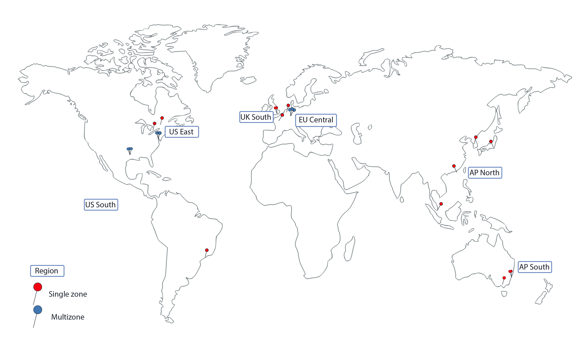

---

copyright:
  years: 2014, 2018
lastupdated: "2018-12-12"

---

{:new_window: target="_blank"}
{:shortdesc: .shortdesc}
{:screen: .screen}
{:pre: .pre}
{:table: .aria-labeledby="caption"}
{:codeblock: .codeblock}
{:tip: .tip}
{:note: .note}
{:important: .important}
{:deprecated: .deprecated}
{:download: .download}

# Regions and zones
{: #regions-and-zones}

A region is a specific geographical location where you can deploy apps, services, and other {{site.data.keyword.Bluemix}} resources. [{{site.data.keyword.Bluemix_notm}} regions](#bluemix_regions) differ from [{{site.data.keyword.containerlong}} regions](#container_regions). Regions consist of one or more zones, which are physical data centers that host the compute, network, and storage resources and related cooling and power that host services and applications. Zones are isolated from each other, which ensures no shared single point of failure.
{:shortdesc}



_{{site.data.keyword.containerlong_notm}} regions and zones_

{{site.data.keyword.Bluemix_notm}} is hosted worldwide. Services within {{site.data.keyword.Bluemix_notm}} might be available globally, or within a specific region. When you create a Kubernetes cluster in {{site.data.keyword.containerlong_notm}}, its resources remain in the region that you deploy the cluster to.

You can create standard clusters in every supported {{site.data.keyword.containerlong_notm}} region. Free clusters are available only in select regions.
{: note}

| {{site.data.keyword.containerlong_notm}} region | Corresponding {{site.data.keyword.Bluemix_notm}} location |
| --- | --- |
| AP North (standard clusters only) | Tokyo |
| AP South | Sydney |
| EU Central | Frankfurt |
| UK South | London |
| US East (standard clusters only) | Washington DC |
| US South | Dallas |
{: caption="Table: Supported Kubernetes Service regions and corresponding IBM Cloud locations." caption-side="top"}

<br />


## Locations in {{site.data.keyword.Bluemix_notm}}
{: #bluemix_regions}

You can organize your resources across {{site.data.keyword.Bluemix_notm}} services by using {{site.data.keyword.Bluemix_notm}} locations, also called regions. For example, you can create a Kubernetes cluster by using a private Docker image that is stored in your {{site.data.keyword.registryshort_notm}} of the same location.
{:shortdesc}

To check which {{site.data.keyword.Bluemix_notm}} location you are currently in, run `ibmcloud info` and review the **Region** field.

{{site.data.keyword.Bluemix_notm}} locations can be accessed by specifying the region API endpoint when you log in. If you do not specify a region endpoint, you are automatically logged in to the region that is closest to you.

For example, you can use the following commands to log in to {{site.data.keyword.Bluemix_notm}} region API endpoints:

  * Dallas
      ```
      ibmcloud login -a api.ng.bluemix.net
      ```
      {: pre}

  * Washington DC
      ```
      ibmcloud login -a api.us-east.bluemix.net
      ```
      {: pre}

  * Sydney and Tokyo
      ```
      ibmcloud login -a api.au-syd.bluemix.net
      ```
      {: pre}

  * Frankfurt
      ```
      ibmcloud login -a api.eu-de.bluemix.net
      ```
      {: pre}

  * London
      ```
      ibmcloud login -a api.eu-gb.bluemix.net
      ```
      {: pre}

<br />


## Regions in {{site.data.keyword.containerlong_notm}}
{: #container_regions}

By using {{site.data.keyword.containerlong_notm}} regions, you can create or access Kubernetes clusters in a region other than the {{site.data.keyword.Bluemix_notm}} region that you are logged in to. {{site.data.keyword.containerlong_notm}} region endpoints refer specifically to the {{site.data.keyword.containerlong_notm}}, not {{site.data.keyword.Bluemix_notm}} as a whole.
{:shortdesc}

You can create standard clusters in every supported {{site.data.keyword.containerlong_notm}} region. Free clusters are available only in select regions.
{: note}

Supported {{site.data.keyword.containerlong_notm}} regions:
  * AP North (standard clusters only)
  * AP South
  * EU Central
  * UK South
  * US East (standard clusters only)
  * US South

You can access the {{site.data.keyword.containerlong_notm}} through one global endpoint: `https://containers.bluemix.net/v1`.
* To check which {{site.data.keyword.containerlong_notm}} region you are currently in, run `ibmcloud ks region`.
* To retrieve a list of available regions and their endpoints, run `ibmcloud ks regions`.

To use the API with the global endpoint, in all your requests, pass the region name in the `X-Region` header.
{: tip}

### Logging in to a different {{site.data.keyword.containerlong_notm}} region
{: #container_login_endpoints}

You can change regions by using the {{site.data.keyword.containerlong_notm}} CLI.
{:shortdesc}

You might want to log in to another {{site.data.keyword.containerlong_notm}} region for the following reasons:
  * You created {{site.data.keyword.Bluemix_notm}} services or private Docker images in one region and want to use them with {{site.data.keyword.containerlong_notm}} in another region.
  * You want to access a cluster in a region that is different from the default {{site.data.keyword.Bluemix_notm}} region that you are logged in to.

To quickly switch regions, run [`ibmcloud ks region-set`](cs_cli_reference.html#cs_region-set).

### Using {{site.data.keyword.containerlong_notm}} API commands
{: #containers_api}

To interact with the {{site.data.keyword.containerlong_notm}} API, enter the command type and append `/v1/command` to the global endpoint.
{:shortdesc}

Example of `GET /clusters` API:
  ```
  GET https://containers.bluemix.net/v1/clusters
  ```
  {: codeblock}

</br>

To use the API with the global endpoint, in all your requests, pass the region name in the `X-Region` header. To list available regions, run `ibmcloud ks regions`.
{: tip}

To view documentation on the API commands, view [https://containers.bluemix.net/swagger-api/](https://containers.bluemix.net/swagger-api/).

## Zones in {{site.data.keyword.containerlong_notm}}
{: #zones}

Zones are physical data centers that are available within an {{site.data.keyword.Bluemix_notm}} region. Regions are a conceptual tool to organize zones, and can include zones (data centers) in different countries. The following table displays the zones available by region.
{:shortdesc}

* **Multizone Metro City**: Worker nodes in clusters that are created in a multizone metro city can be spread across zones. Additionally, if you create a Kubernetes version 1.10 or later cluster in a multizone metro city **except Sydney (AP South)**, the highly available masters are spread across zones.
* **Single Zone City**: Worker nodes in clusters that are created in a single zone city stay within one zone. You cannot spread worker nodes across multiple zones. The highly available master includes three replicas on separate hosts, but is not spread across zones.

<table summary="The table shows the zones available by regions. Rows are to be read from the left to right, with the region in column one, the multizone metro cities in column two, and the single zone cities in column three.">
<caption>Available single and multizones by region.</caption>
  <thead>
  <th>Region</th>
  <th>Multizone Metro City</th>
  <th>Single Zone City</th>
  </thead>
  <tbody>
    <tr>
      <td>AP North</td>
      <td>Tokyo: tok02, tok04, tok05</td>
      <td><p>Chennai: che01</p>
      <p>Hong Kong S.A.R. of the PRC: hkg02</p>
      <p>Seoul: seo01</p>
      <p>Singapore: sng01</p></td>
    </tr>
    <tr>
      <td>AP South</td>
      <td>Sydney: syd01, syd04, syd05</td>
      <td>Melbourne: mel01</td>
    </tr>
    <tr>
      <td>EU Central</td>
      <td>Frankfurt: fra02, fra04, fra05</td>
      <td><p>Amsterdam: ams03</p>
      <p>Milan: mil01</p>
      <p>Oslo: osl01</p>
      <p>Paris: par01</p>
      </td>
    </tr>
    <tr>
      <td>UK South</td>
      <td>London: lon04, lon05`*`, lon06</td>
      <td></td>
    </tr>
    <tr>
      <td>US East</td>
      <td>Washington DC: wdc04, wdc06, wdc07</td>
      <td><p>Montreal: mon01</p>
      <p>Toronto: tor01</p></td>
    </tr>
    <tr>
      <td>US South</td>
      <td>Dallas: dal10, dal12, dal13</td>
      <td><p>San Jose: sjc03, sjc04</p><p>São Paulo: sao01</p></td>
    </tr>
  </tbody>
</table>

`*` lon05 replaces lon02. New clusters must use lon05, and only lon05 supports highly available masters spread across zones.
{: note}

### Single-zone clusters
{: #single_zone}

In a single-zone cluster, your cluster's resources remain in the zone in which the cluster is deployed. The following image highlights the relationship of single-zone cluster components within an example region of US East:


_Understanding where your single-zone cluster resources are._

1.  Your cluster's resources, including the master and worker nodes, are in the same zone that you deployed the cluster to. When you initiate local container orchestration actions, such as `kubectl` commands, the information is exchanged between your master and worker nodes within the same zone.

2.  If you set up other cluster resources, such as storage, networking, compute, or apps running in pods, the resources and their data remain in the zone that you deployed your cluster to.

3.  When you initiate cluster management actions, such as using `ibmcloud ks` commands, basic information about the cluster (such as name, ID, user, the command) is routed through a regional endpoint.

### Multizone clusters
{: #multizone}

In a multizone cluster, the master node is deployed in a multizone-capable zone and your cluster's resources are spread across multiple zones.

1.  Worker nodes are spread across multiple zones in one region to provide more availability for your cluster. The master remains in the same multizone-capable zone that you deployed the cluster to. When you initiate local container orchestration actions, such as `kubectl` commands, the information is exchanged between your master and worker nodes through a regional endpoint.

2.  Other cluster resources, such as storage, networking, compute, or apps running in pods, vary in how they deploy to the zones in your multizone cluster. For more information, review these topics:
    * Setting up [file storage](cs_storage_file.html#add_file) and [block storage](cs_storage_block.html#add_block) in multizone clusters
    * [Enabling public or private access to an app by using a LoadBalancer service in a multizone cluster](cs_loadbalancer.html#multi_zone_config)
    * [Managing network traffic by using Ingress](cs_ingress.html#planning)
    * [Increasing the availability of your app](cs_app.html#increase_availability)

3.  When you initiate cluster management actions, such as using [`ibmcloud ks` commands](cs_cli_reference.html#cs_cli_reference), basic information about the cluster (such as name, ID, user, the command) is routed through a regional endpoint.
