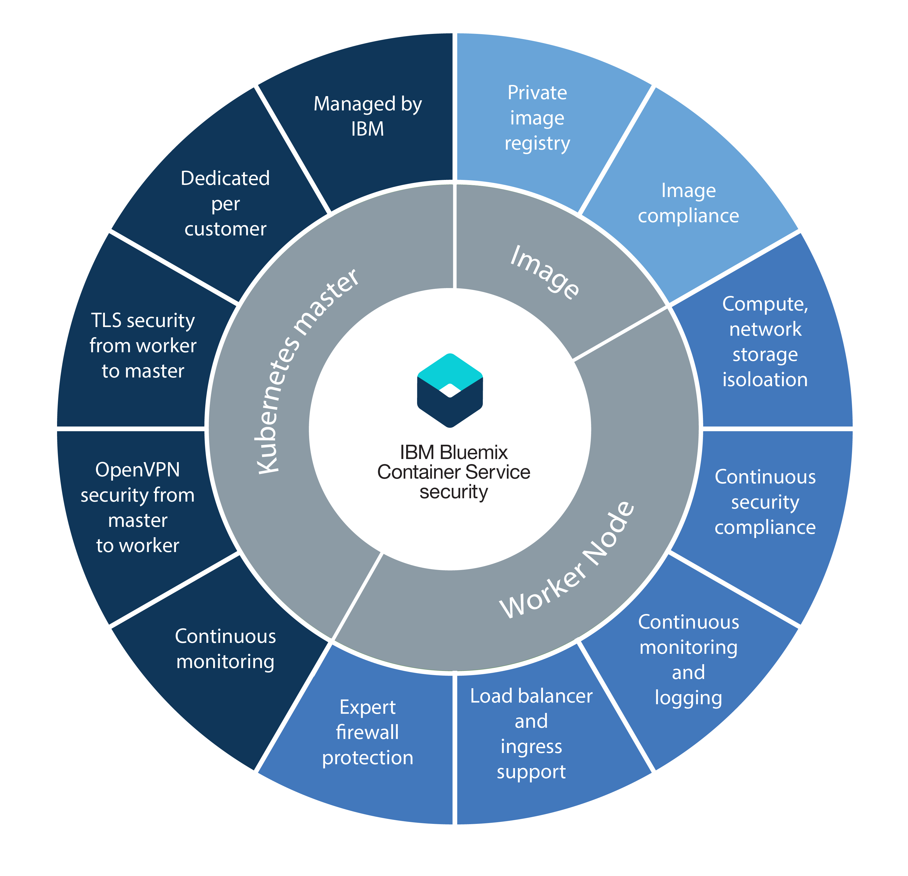

---

copyright:
  years: 2014, 2018
lastupdated: "2018-01-11"

---

{:new_window: target="_blank"}
{:shortdesc: .shortdesc}
{:screen: .screen}
{:pre: .pre}
{:table: .aria-labeledby="caption"}
{:codeblock: .codeblock}
{:tip: .tip}
{:download: .download}

# Security for {{site.data.keyword.containerlong_notm}}
{: #security}

You can use built-in security features for risk analysis and security protection. These features help you to protect your cluster infrastructure and network communication, isolate your compute resources, and ensure security compliance across your infrastructure components and container deployments.
{: shortdesc}

## Security by cluster component
{: #cluster}

Each {{site.data.keyword.containerlong_notm}} cluster has security features that are built in to its [master](#master) and [worker](#worker) nodes. If you have a firewall, need to access load balancing from outside the cluster, or want to run `kubectl` commands from your local system when corporate network policies prevent access to public internet endpoints, [open ports in your firewall](cs_firewall.html#firewall). If you want to connect apps in your cluster to an on-premises network or to other apps external to your cluster, [set up VPN connectivity](cs_vpn.html#vpn).
{: shortdesc}

In the following diagram, you can see security features that are grouped by Kubernetes master, worker nodes, and container images.

  <table summary="The first row in the table spans both columns. The remaining rows are to be read left to right, with the server location in column one and IP addresses to match in column two.">
  <thead>
  <th colspan=2> Built-in cluster security settings in {{site.data.keyword.containershort_notm}}</th>
  </thead>
  <tbody>
    <tr>
      <td>Kubernetes master</td>
      <td>The Kubernetes master in each cluster is managed by IBM and is highly available. It includes {{site.data.keyword.containershort_notm}} security settings that ensure security compliance and secure communication to and from the worker nodes. Updates are performed by IBM as required. The dedicated Kubernetes master centrally controls and monitors all Kubernetes resources in the cluster. Based on the deployment requirements and capacity in the cluster, the Kubernetes master automatically schedules your containerized apps to deploy across available worker nodes. For more information, see [Kubernetes master security](#master).</td>
    </tr>
    <tr>
      <td>Worker node</td>
      <td>Containers are deployed on worker nodes that are dedicated to a cluster and that ensure compute, network, and storage isolation for IBM customers. {{site.data.keyword.containershort_notm}} provides built-in security features to keep your worker nodes secure on the private and public network and to ensure worker node security compliance. For more information, see [Worker node security](#worker). In addition, you can add [Calico network policies](cs_network_policy.html#network_policies) to further specify the network traffic that you want to allow or block to and from a pod on a worker node. </td>
     </tr>
     <tr>
      <td>Images</td>
      <td>As the cluster admin, you can set up your own secure Docker image repository in {{site.data.keyword.registryshort_notm}} where you can store and share Docker images between your cluster users. To ensure safe container deployments, every image in your private registry is scanned by Vulnerability Advisor. Vulnerability Advisor is a component of {{site.data.keyword.registryshort_notm}} that scans for potential vulnerabilities, makes security recommendations, and provides instructions to resolve vulnerabilities. For more information, see [Image security in {{site.data.keyword.containershort_notm}}](#images).</td>
    </tr>
  </tbody>
</table>

 

## Kubernetes master
{: #master}

Review the built-in Kubernetes master security features to protect the Kubernetes master and to secure the cluster network communication.
{: shortdesc}

<dl>
  <dt>Fully managed and dedicated Kubernetes master</dt>
    <dd>Every Kubernetes cluster in {{site.data.keyword.containershort_notm}} is controlled by a dedicated Kubernetes master that is managed by IBM in an IBM-owned IBM Cloud infrastructure (SoftLayer) account. The Kubernetes master is set up with the following dedicated components that are not shared with other IBM customers.
    <ul><li>etcd data store: Stores all Kubernetes resources of a cluster, such as Services, Deployments, and Pods. Kubernetes ConfigMaps and Secrets are app data that are stored as key value pairs so that they can be used by an app that runs in a pod. Data in etcd is stored on an encrypted disk that is managed by IBM and is encrypted via TLS when sent to a pod to assure data protection and integrity.</li>
    <li>kube-apiserver: Serves as the main entry point for all requests from the worker node to the Kubernetes master. The kube-apiserver validates and processes requests and can read from and write to the etcd data store.</li>
    <li>kube-scheduler: Decides where to deploy pods, taking into account capacity and performance needs, hardware and software policy constraints, anti-affinity specifications, and workload requirements. If no worker node can be found that matches the requirements, the pod is not deployed in the cluster.</li>
    <li>kube-controller-manager: Responsible for monitoring replica sets, and creating corresponding pods to achieve the desired state.</li>
    <li>OpenVPN: {{site.data.keyword.containershort_notm}}-specific component to provide secured network connectivity for all Kubernetes master to worker node communication.</li></ul></dd>
  <dt>TLS secured network connectivity for all worker node to Kubernetes master communication</dt>
    <dd>To secure the network communication to the Kubernetes master, {{site.data.keyword.containershort_notm}} generates TLS certificates that encrypts the communication to and from the kube-apiserver and etcd data store components for every cluster. These certificates are never shared across clusters or across Kubernetes master components.</dd>
  <dt>OpenVPN secured network connectivity for all Kubernetes master to worker node communication</dt>
    <dd>Although Kubernetes secures the communication between the Kubernetes master and worker nodes by using the `https` protocol, no authentication is provided on the worker node by default. To secure this communication, {{site.data.keyword.containershort_notm}} automatically sets up an OpenVPN connection between the Kubernetes master and the worker node when the cluster is created.</dd>
  <dt>Continuous Kubernetes master network monitoring</dt>
    <dd>Every Kubernetes master is continuously monitored by IBM to control and remediate process level Denial-Of-Service (DOS) attacks.</dd>
  <dt>Kubernetes master node security compliance</dt>
    <dd>{{site.data.keyword.containershort_notm}} automatically scans every node where the Kubernetes master is deployed for vulnerabilities found in Kubernetes and OS-sepcific security fixes that need to be applied to assure master node protection. If vulnerabilities are found, {{site.data.keyword.containershort_notm}} automatically applies fixes and resolves vulnerabilities on behalf of the user.</dd>
</dl>

 

## Worker nodes
{: #worker}

Review the built-in worker node security features to protect the worker node environment and to assure resource, network and storage isolation.
{: shortdesc}

<dl>
  <dt>Compute, network and storage infrastructure isolation</dt>
    <dd>When you create a cluster, virtual machines are provisioned as worker nodes in the customer IBM Cloud infrastructure (SoftLayer) account or in the dedicated IBM Cloud infrastructure (SoftLayer) account by IBM. Worker nodes are dedicated to a cluster and do not host workloads of other clusters.
 Every {{site.data.keyword.Bluemix_notm}} account is set up with IBM Cloud infrastructure (SoftLayer) VLANs to assure quality network performance and isolation on the worker nodes.
 
To persist data in your cluster, you can provision dedicated NFS based file storage from IBM Cloud infrastructure (SoftLayer) and leverage the built-in data security features of that platform.
</dd>
  <dt>Secured worker node set up</dt>
    <dd>Every worker node is set up with an Ubuntu operating system that cannot be changed by the user. To protect the operating system of the worker nodes from potential attacks, every worker node is configured with expert firewall settings that are enforced by Linux iptable rules.
 All containers that run on Kubernetes are protected by predefined Calico network policy settings that are configured on every worker node during cluster creation. This set up ensures secure network communication between worker nodes and pods. To further restrict the actions that a container can perform on the worker node, users can choose to configure [AppArmor policies ](https://kubernetes.io/docs/tutorials/clusters/apparmor/) on the worker nodes.

 SSH access is disabled on the worker node. If you want to install additional features on your worker node, you can use [Kubernetes daemon sets ](https://kubernetes.io/docs/concepts/workloads/controllers/daemonset) for everything that you want to run on every worker node, or [Kubernetes jobs ](https://kubernetes.io/docs/concepts/workloads/controllers/jobs-run-to-completion/) for any one-time action you must execute.
</dd>
  <dt>Kubernetes worker node security compliance</dt>
    <dd>IBM works with internal and external security advisory teams to address potential security compliance vulnerabilities. IBM maintains access to the worker nodes in order to deploy updates and security patches to the operating system.
 <b>Important</b>: Reboot your worker nodes on a regular basis to ensure the installation of the updates and security patches that are automatically deployed to the operating system. IBM does not reboot your worker nodes.
</dd>
  <dt id="encrypted_disks">Encrypted disk</dt>
  <dd>By default, {{site.data.keyword.containershort_notm}} provides two local SSD encrypted data partitions for all worker nodes when the worker nodes are provisioned. The first partition is not encrypted, and the second partition mounted to _/var/lib/docker_ is unlocked by using LUKS encryption keys. Each worker in each Kubernetes cluster has its own unique LUKS encryption key, managed by {{site.data.keyword.containershort_notm}}. When you create a cluster or add a worker node to an existing cluster, the keys are pulled securely and then discarded after the encrypted disk is unlocked.
  
<b>Note</b>: Encryption can impact disk I/O performance. For workloads that require high-performance disk I/O, test a cluster with encryption both enabled and disabled to help you decide whether to turn off encryption.

  </dd>
  <dt>Support for IBM Cloud infrastructure (SoftLayer) network firewalls</dt>
    <dd>{{site.data.keyword.containershort_notm}} is compatible with all [IBM Cloud infrastructure (SoftLayer) firewall offerings ](https://www.ibm.com/cloud-computing/bluemix/network-security). On {{site.data.keyword.Bluemix_notm}} Public, you can set up a firewall with custom network policies to provide dedicated network security for your cluster and to detect and remediate network intrusion. For example, you might choose to set up a [Vyatta ](https://knowledgelayer.softlayer.com/topic/vyatta-1) to act as your firewall and block unwanted traffic. When you set up a firewall, [you must also open up the required ports and IP addresses](cs_firewall.html#firewall) for each region so that the master and the worker nodes can communicate.</dd>
  <dt>Keep services private or selectively expose services and apps to the public internet</dt>
    <dd>You can choose to keep your services and apps private and leverage the built-in security features described in this topic to assure secured communication between worker nodes and pods. To expose services and apps to the public internet, you can leverage the Ingress and load balancer support to securely make your services publicly available.</dd>
  <dt>Securely connect your worker nodes and apps to an on-premises data center</dt>
  <dd>To connect your worker nodes and apps to an on-premises data center, you can configure a VPN IPSec endpoint with a Strongswan service or with a Vyatta Gateway Appliance or a Fortigate Appliance. <ul><li><b>Strongswan IPSec VPN Service</b>: You can set up a [Strongswan IPSec VPN service ](https://www.strongswan.org/) that securely connects your Kubernetes cluster with an on-premises network. The Strongswan IPSec VPN service provides a secure end-to-end communication channel over the internet that is based on the industry-standard Internet Protocol Security (IPsec) protocol suite. To set up a secure connection between your cluster and an on-premises network, you must have an IPsec VPN gateway or IBM Cloud infrastructure (SoftLayer) server installed in your on-premises data center. Then you can [configure and deploy the Strongswan IPSec VPN service](cs_vpn.html#vpn) in a Kubernetes pod.</li><li><b>Vyatta Gateway Appliance or Fortigate Appliance</b>: If you have a larger cluster, you might choose to set up a Vyatta Gateway Appliance or Fortigate Appliance to configure an IPSec VPN endpoint. For more information, see this blog post on [Connecting a cluster to an on-premise data center ](https://www.ibm.com/blogs/bluemix/2017/07/kubernetes-and-bluemix-container-based-workloads-part4/).</li></ul></dd>
  <dt>Continuous monitoring and logging of cluster activity</dt>
    <dd>For standard clusters, all cluster-related events, such as adding a worker node, rolling update progress, or capacity usage information can be logged and monitored by {{site.data.keyword.containershort_notm}} and sent to {{site.data.keyword.loganalysislong_notm}} and {{site.data.keyword.monitoringlong_notm}}. For information about setting up logging and monitoring, see [Configuring cluster logging](/docs/containers/cs_health.html#logging) and [Configuring cluster monitoring](/docs/containers/cs_health.html#monitoring).</dd>
</dl>

 

## Images
{: #images}

Manage the security and integrity of your images with built-in security features.
{: shortdesc}

<dl>
<dt>Secured Docker private image repository in {{site.data.keyword.registryshort_notm}}</dt>
<dd>You can set up your own Docker image repository in a multi-tenant, highly available, and scalable private image registry that is hosted and managed by IBM to build, securely store, and share Docker images across cluster users.</dd>

<dt>Image security compliance</dt>
<dd>When you use {{site.data.keyword.registryshort_notm}}, you can leverage the built-in security scanning that is provided by Vulnerability Advisor. Every image that is pushed to your namespace is automatically scanned for vulnerabilities against a database of known CentOS, Debian, Red Hat, and Ubuntu issues. If vulnerabilities are found, Vulnerability Advisor provides instructions for how to resolve them to assure image integrity and security.</dd>
</dl>

To view the vulnerability assessment for your images, [review the Vulnerability Advisor documentation](/docs/services/va/va_index.html#va_registry_cli).

 

## In-cluster networking
{: #in_cluster_network}

Secured, in-cluster network communication between worker nodes and pods is realized with private virtual local area networks (VLANs). A VLAN configures a group of worker nodes and pods as if they were attached to the same physical wire.
{:shortdesc}

When you create a cluster, every cluster is automatically connected to a private VLAN. The private VLAN determines the private IP address that is assigned to a worker node during cluster creation.

|Cluster type|Manager of the private VLAN for the cluster|
|------------|-------------------------------------------|
|Lite clusters in {{site.data.keyword.Bluemix_notm}}|{{site.data.keyword.IBM_notm}}|
|Standard clusters in {{site.data.keyword.Bluemix_notm}}|You in your IBM Cloud infrastructure (SoftLayer) account 
**Tip:** To have access to all VLANs in your account, turn on [VLAN Spanning ](https://knowledgelayer.softlayer.com/procedure/enable-or-disable-vlan-spanning).
|

All pods that are deployed to a worker node are also assigned a private IP address. Pods are assigned an IP in the 172.30.0.0/16 private address range and are routed between worker nodes only. To avoid conflicts, do not use this IP range on any nodes that will communicate with your worker nodes. Worker nodes and pods can securely communicate on the private network by using the private IP addresses. However, when a pod crashes or a worker node needs to be re-created, a new private IP address is assigned.

Because it is difficult to track changing private IP addresses for apps that must be highly available, you can use the built-in Kubernetes service discovery features and expose apps as cluster IP services on the private network in the cluster. A Kubernetes service groups a set of pods and provides network connection to these pods for other services in the cluster without exposing the actual private IP address of each pod. When you create a cluster IP service, a private IP address is assigned to that service from the 10.10.10.0/24 private address range. As with the pod private address range, do not use this IP range on any nodes that will communicate with your worker nodes. This IP address is accessible inside the cluster only. You cannot access this IP address from the internet. At the same time, a DNS lookup entry is created for the service and stored in the kube-dns component of the cluster. The DNS entry contains the name of the service, the namespace where the service was created, and the link to the assigned private cluster IP address.

If an app in the cluster needs to access a pod that lies behind a cluster IP service, it can either use the private cluster IP address that was assigned to the service or send a request by using the name of the service. When you use the name of the service, the name is looked up in the kube-dns component and routed to the private cluster IP address of the service. When a request reaches the service, the service ensures that all requests are equally forwarded to the pods, independent of their private IP addresses and the worker node they are deployed to.

For more information about how to create a service of type cluster IP, see [Kubernetes services ](https://kubernetes.io/docs/concepts/services-networking/service/#publishing-services---service-types).

For information about securely connecting apps in a Kubernetes cluster to an on-premises network, see [Setting up VPN connectivity](cs_vpn.html#vpn). For information about exposing your apps for external network communication, see [Planning external networking](cs_network_planning.html#planning).
