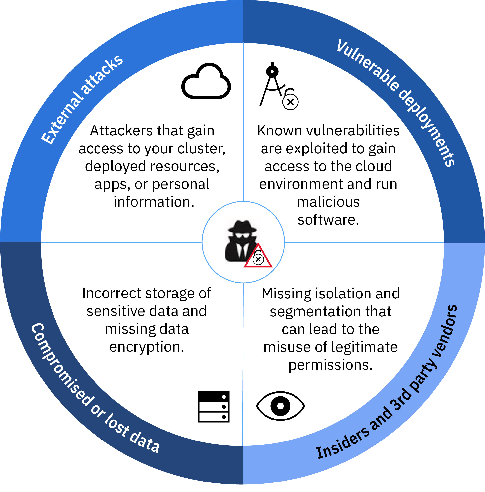
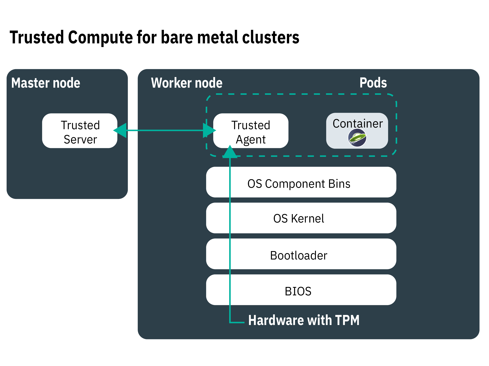

---

copyright:
  years: 2014, 2018
lastupdated: "2018-12-07"

---

{:new_window: target="_blank"}
{:shortdesc: .shortdesc}
{:screen: .screen}
{:pre: .pre}
{:table: .aria-labeledby="caption"}
{:codeblock: .codeblock}
{:tip: .tip}
{:note: .note}
{:important: .important}
{:deprecated: .deprecated}
{:download: .download}

# Security for {{site.data.keyword.containerlong_notm}}
{: #security}

You can use built-in security features in {{site.data.keyword.containerlong}} for risk analysis and security protection. These features help you to protect your Kubernetes cluster infrastructure and network communication, isolate your compute resources, and ensure security compliance across your infrastructure components and container deployments.
{: shortdesc}

## Overview of security threats for your cluster
{: #threats}

To protect your cluster from being compromised, you must understand potential security threats for your cluster and what you can do to reduce the exposure to vulnerabilities.
{: shortdesc}

Cloud security and the protection of your systems, infrastructure, and data against attacks became very important over the last couple of years as companies continue to move their workloads into the public cloud. A cluster consists of several components that each can put your environment at risk for malicious attacks. To protect your cluster against these security threats, you must make sure that you apply the latest {{site.data.keyword.containerlong_notm}} and Kubernetes security features and updates in all cluster components.

These components include:
- [Kubernetes API server and etcd data store](#apiserver)
- [Worker nodes](#workernodes)
- [Network](#network)
- [Persistent storage](#storage)
- [Monitoring and Logging](#monitoring_logging)
- [Container images and registry](#images_registry)
- [Container isolation and security](#container)
- [Personal information](#pi)

## Kubernetes API server and etcd
{: #apiserver}

The Kubernetes API server and etcd are the most vulnerable components that run in your Kubernetes master. If an unauthorized user or system gets access to your Kubernetes API server, the user or system can change settings, manipulate, or take control of your cluster, which puts your cluster at risk for malicious attacks.
{: shortdesc}

To protect your Kubernetes API server and etcd data store, you must secure and limit the access to your Kubernetes API server for both human users and Kubernetes service accounts.

**How is access to my Kubernetes API server granted?**  
By default, Kubernetes requires every request to go through several stages before access to the API server is granted:

<ol><li><strong>Authentication: </strong>Validates the identity of a registered user or service account.</li><li><strong>Authorization: </strong>Limits the permissions of authenticated users and service accounts to ensure that they can access and operate only the cluster components that you want them to.</li><li><strong>Admission control: </strong>Validates or mutates requests before they are processed by the Kubernetes API server. Many Kubernetes features require admission controllers in order to properly function.</li></ol>

**What does {{site.data.keyword.containerlong_notm}} do to secure my Kubernetes API server and etcd data store?**  
The following image shows the default cluster security settings that address authentication, authorization, admission control, and secure connectivity between the Kubernetes master and worker nodes.

<table>
<caption>Kubernetes API server and etcd security</caption>
  <thead>
  <th>Security feature</th>
  <th>Description</th>
  </thead>
  <tbody>
    <tr>
      <td>Fully managed and dedicated Kubernetes master</td>
      <td>
Every Kubernetes cluster in {{site.data.keyword.containerlong_notm}} is controlled by a dedicated Kubernetes master that is managed by IBM in an IBM-owned IBM Cloud infrastructure (SoftLayer) account. The Kubernetes master is set up with the following dedicated components that are not shared with other IBM customers.

        <ul><li><strong>etcd data store:</strong> Stores all Kubernetes resources of a cluster, such as `Services`, `Deployments`, and `Pods`. Kubernetes `ConfigMaps` and `Secrets` are app data that is stored as key value pairs so that they can be used by an app that runs in a pod. In clusters that run Kubernetes version 1.10 or later, data in etcd is stored on the local disk of the Kubernetes master and is backed up to {{site.data.keyword.cos_full_notm}}. Data is encrypted during transit to {{site.data.keyword.cos_full_notm}} and at rest. You can choose to enable encryption for your etcd data on the local disk of your Kubernetes master by [enabling {{site.data.keyword.keymanagementservicelong_notm}} encryption](cs_encrypt.html#encryption) for your cluster. Etcd data for clusters that run an earlier version of Kubernetes is stored on an encrypted disk that is managed by IBM and backed up daily. When etcd data is sent to a pod, data is encrypted via TLS to ensure data protection and integrity.</li>
          <li><strong>kube-apiserver:</strong> Serves as the main entry point for all cluster management requests from the worker node to the Kubernetes master. The kube-apiserver validates and processes requests and can read from and write to the etcd data store.</li>
          <li><strong>kube-scheduler:</strong> Decides where to deploy pods, considering the capacity and performance needs, hardware and software policy constraints, anti-affinity specifications, and workload requirements. If no worker node can be found that matches the requirements, the pod is not deployed in the cluster.</li>
          <li><strong>kube-controller-manager:</strong> Responsible for monitoring replica sets, and creating corresponding pods to achieve the desired state.</li>
          <li><strong>OpenVPN:</strong> {{site.data.keyword.containerlong_notm}}-specific component to provide secured network connectivity for all Kubernetes master to worker node communication. Kubernetes master to worker node communication is initiated by the user and includes <code>kubectl</code> commands, such as <code>logs</code>, <code>attach</code>, <code>exec</code>, and <code>top</code>.</li></ul></td>
    </tr>
    <tr>
    <td>Continuous monitoring by IBM Site Reliability Engineers (SREs)</td>
    <td>The Kubernetes master, including all the master components, compute, networking, and storage resources is continuously monitored by IBM Site Reliability Engineers (SREs). The SREs apply the latest security standards, detect and remediate malicious activities, and work to ensure reliability and availability of {{site.data.keyword.containerlong_notm}}. </td>
    </tr>
    <tr>
      <td>Secure communication via TLS</td>
      <td>To use {{site.data.keyword.containerlong_notm}} you must authenticate with the service by using your credentials. When you are authenticated, {{site.data.keyword.containerlong_notm}} generates TLS certificates that encrypt the communication to and from the Kubernetes API server and etcd data store to ensure a secure end-to-end communication between the worker nodes and the Kubernetes master. These certificates are never shared across clusters or across Kubernetes master components. </td>
    </tr>
    <tr>
      <td>OpenVPN connectivity to worker nodes</td>
      <td>Although Kubernetes secures the communication between the Kubernetes master and worker nodes by using the <code>https</code> protocol, no authentication is provided on the worker node by default. To secure this communication, {{site.data.keyword.containerlong_notm}} automatically sets up an OpenVPN connection between the Kubernetes master and the worker node when the cluster is created.</td>
    </tr>
    <tr>
      <td>Fine-grained access control</td>
      <td>As the account administrator you can [grant access to other users for {{site.data.keyword.containerlong_notm}}](cs_users.html#users) by using {{site.data.keyword.Bluemix_notm}} Identity and Access Management (IAM). {{site.data.keyword.Bluemix_notm}} IAM provides secure authentication with the {{site.data.keyword.Bluemix_notm}} platform, {{site.data.keyword.containerlong_notm}}, and all the resources in your account. Setting up proper user roles and permissions is key to limit who can access your resources and to limit the damage a user can do when legitimate permissions are misused.   You can select from the following pre-defined user roles that determine the set of actions that the user can perform: <ul><li><strong>Platform roles:</strong> Determine the cluster and worker node related actions that a user can perform in {{site.data.keyword.containerlong_notm}}.</li><li><strong>Infrastructure roles:</strong> Determine the permissions to order, update, or remove infrastructure resources, such as worker nodes, VLANs, or subnets.</li><li><strong>Kubernetes RBAC roles:</strong> Determine the `kubectl` commands that users can execute when they are authorized to access a cluster. RBAC roles are automatically set up for the default namespace of a cluster. To use the same RBAC roles in other namespaces, you can copy RBAC roles from the default namespace.  </li></ul>   Instead of using the pre-defined user roles, you can choose to [customize infrastructure permissions](cs_users.html#infra_access) or [set up your own RBAC roles](cs_users.html#rbac) to add a more fine-grained access control. </td>
    </tr>
    <tr>
      <td>Admission controllers</td>
      <td>Admission controllers are implemented for specific features in Kubernetes and {{site.data.keyword.containerlong_notm}}. With admission controllers, you can set up policies in your cluster that determine if a particular action in the cluster is allowed or not. In the policy, you can specify conditions when a user cannot perform an action, even if this action is part of the general permissions that you assigned the user by using RBAC. Therefore, admission controllers can provide an extra layer of security for your cluster before an API request is processed by the Kubernetes API server.    When you create a cluster, {{site.data.keyword.containerlong_notm}} automatically installs the following [Kubernetes admission controllers ](https://kubernetes.io/docs/admin/admission-controllers/) in the Kubernetes master, which cannot be changed by the user: <ul>
      <li>DefaultTolerationSeconds</li>
      <li>DefaultStorageClass</li>
      <li>GenericAdmissionWebhook (Kubernetes 1.8)</li>
      <li>Initializers</li>
      <li>LimitRanger</li>
      <li>MutatingAdmissionWebhook (Kubernetes 1.9 and later)</li>
      <li>NamespaceLifecycle</li>
      <li>PersistentVolumeLabel</li>
      <li>[PodSecurityPolicy](cs_psp.html#ibm_psp) (Kubernetes 1.8.13, 1.9.8, or 1.10.3 and later)</li>
      <li>[Priority](cs_pod_priority.html#pod_priority) (Kubernetes 1.11.2 or later</li>
      <li>ResourceQuota</li>
      <li>ServiceAccount</li>
      <li>StorageObjectInUseProtection (Kubernetes 1.10 and later)</li>
      <li>ValidatingAdmissionWebhook (Kubernetes 1.9 and later)</li></ul> 
      You can [install your own admission controllers in the cluster ](https://kubernetes.io/docs/reference/access-authn-authz/extensible-admission-controllers/#admission-webhooks) or choose from the optional admission controllers that {{site.data.keyword.containerlong_notm}} provides: <ul><li><strong>[Container image security enforcer](/docs/services/Registry/registry_security_enforce.html#security_enforce):</strong> Use this admission controller to enforce Vulnerability Advisor policies in your cluster to block deployments from vulnerable images.</li></ul> 
If you manually installed admission controllers and you do not want to use them anymore, make sure to remove them entirely. If admission controllers are not entirely removed, they might block all actions that you want to perform on the cluster.
</td>
    </tr>
  </tbody>
</table>

## Worker node
{: #workernodes}

Worker nodes carry the deployments and services that make up your app. When you host workloads in the public cloud, you want to ensure that your app is protected from being accessed, changed or monitored by an unauthorized user or software.
{: shortdesc}

**Who owns the worker node and am I responsible to secure it?**  
The ownership of a worker node depends on the type of cluster that you create. Worker nodes in free clusters are provisioned in to the IBM Cloud infrastructure (SoftLayer) account that is owned by IBM. You can deploy apps to the worker node but cannot change settings or install extra software on the worker node. Due to limited capacity and limited {{site.data.keyword.containerlong_notm}} features, do not run production workloads on free clusters. Consider using standard clusters for your production workloads.

Worker nodes in standard clusters are provisioned in to the IBM Cloud infrastructure (SoftLayer) account that is associated with your public or dedicated {{site.data.keyword.Bluemix_notm}} account. The worker nodes are dedicated to your account and you are responsible to request timely updates to the worker nodes to ensure that the worker node OS and {{site.data.keyword.containerlong_notm}} components apply the latest security updates and patches.

Use the `ibmcloud ks worker-update` [command](cs_cli_reference.html#cs_worker_update) regularly (such as monthly) to deploy updates and security patches to the operating system and to update the Kubernetes version. When updates are available, you are notified when you view information about the master and worker nodes in the {{site.data.keyword.Bluemix_notm}} console or CLI, such as with the `ibmcloud ks clusters` or `ibmcloud ks workers <cluster_name>` commands.
{: important}

**How does my worker node setup look like?** 
The following image shows the components that are set up for every worker node to protect your worker node from malicious attacks.

The image does not include components that ensure secure end-to-end communication to and from the worker node. See [network security](#network) for more information.
{: note}

<table>
<caption>Worker node security setup</caption>
  <thead>
  <th>Security feature</th>
  <th>Description</th>
  </thead>
  <tbody>
    <tr><td>CIS compliant Linux image</td><td>Every worker node is set up with an Ubuntu operating system that implements the benchmarks that are published by the Center of Internet Security (CIS). The Ubuntu operating system cannot be changed by the user or the owner of the machine. To review the current Ubuntu version, run <code>kubectl get nodes -o wide</code>. IBM works with internal and external security advisory teams to address potential security compliance vulnerabilities. Security updates and patches for the operating system are made available through {{site.data.keyword.containerlong_notm}} and must be installed by the user to keep the worker node secure.
{{site.data.keyword.containerlong_notm}} uses an Ubuntu Linux kernel for worker nodes. You can run containers based on any Linux distribution in {{site.data.keyword.containerlong_notm}}. Verify with your container image vendor if they support the container image to be run on Ubuntu Linux kernels.
</td></tr>
    <tr>
    <td>Continuous monitoring by Site Reliability Engineers (SREs) </td>
    <td>The Linux image that is installed on your worker nodes is continuously monitored by IBM Site Reliability Engineers (SREs) to detect vulnerabilities and security compliance issues. To address vulnerabilities, SREs create security patches and fix packs for your worker nodes. Make sure to apply these patches when they are available to ensure a secure environment for your worker nodes and the apps that you run on top of them.</td>
    </tr>
    <tr>
  <td>Compute isolation</td>
  <td>Worker nodes are dedicated to a cluster and do not host workloads of other clusters. When you create a standard cluster, you can choose to provision your worker nodes as [physical machines (bare metal) or as virtual machines](cs_clusters_planning.html#planning_worker_nodes) that run on shared or dedicated physical hardware. The worker node in a free cluster is automatically provisioned as a virtual, shared node in the IBM Cloud infrastructure (SoftLayer) account that is owned by IBM.</td>
</tr>
<tr>
<td>Option to deploy bare metal</td>
<td>If you choose to provision your worker nodes on bare metal physical servers (instead of virtual server instances), you have additional control over the compute host, such as the memory or CPU. This setup eliminates the virtual machine hypervisor that allocates physical resources to virtual machines that run on the host. Instead, all of a bare metal machine's resources are dedicated exclusively to the worker, so you don't need to worry about "noisy neighbors" sharing resources or slowing down performance. Bare metal servers are dedicated to you, with all its resources available for cluster usage.</td>
</tr>
<tr>
  <td id="trusted_compute">Option for Trusted Compute</td>
    <td>When you deploy your cluster on bare metal that supports Trusted Compute, you can [enable trust](cs_cli_reference.html#cs_cluster_feature_enable). The Trusted Platform Module (TPM) chip is enabled on each bare metal worker node in the cluster that supports Trusted Compute (including future nodes that you add to the cluster). Therefore, after you enable trust, you cannot later disable it for the cluster. A trust server is deployed on the master node, and a trust agent is deployed as a pod on the worker node. When your worker node starts up, the trust agent pod monitors each stage of the process.
The hardware is at the root of trust, which sends measurements by using the TPM. TPM generates encryption keys that are used for securing the transmission of the measurement data throughout the process. The trust agent passes along to the trust server the measurement of each component in the startup process: from the BIOS firmware that interacts with the TPM hardware to the bootloader and OS kernel. Then, the trusted agent compares these measurements with the expected values in the trusted server to attest whether the startup was valid. The trusted compute process does not monitor other pods in your worker nodes, such as applications.

For example, if an unauthorized user gains access to your system and modifies the OS kernel with extra logic to collect data, the trust agent detects this change and marks the node's as untrusted With trusted compute, you can verify your worker nodes against tampering.

    
Trusted Compute is available for select bare metal machine types. For example, `mgXc` GPU flavors do not support Trusted Compute.

    

</td>
  </tr>
    <tr>
  <td id="encrypted_disk">Encrypted disks</td>
    <td>By default, every worker node is provisioned with two local SSD encrypted data partitions. The first partition contains the kernel image that is used to boot the worker node and is not encrypted. The second partition holds the container file system and is unlocked by using LUKS encryption keys. Each worker node in each Kubernetes cluster has its own unique LUKS encryption key, managed by {{site.data.keyword.containerlong_notm}}. When you create a cluster or add a worker node to an existing cluster, the keys are pulled securely and then discarded after the encrypted disk is unlocked. 
Encryption can impact disk I/O performance. For workloads that require high-performance disk I/O, test a cluster with encryption both enabled and disabled to help you decide whether to turn off encryption.
</td>
      </tr>
    <tr>
      <td>Expert AppArmor policies</td>
      <td>Every worker node is set up with security and access policies that are enforced by [AppArmor ](https://wiki.ubuntu.com/AppArmor) profiles that are loaded into the worker node during bootstrapping. AppArmor profiles cannot be changed by the user or owner of the machine. </td>
    </tr>
    <tr>
      <td>SSH disabled</td>
      <td>By default, SSH access is disabled on the worker node to protect your cluster from malicious attacks. When SSH access is disabled, access to the cluster is forced via the Kubernetes API server. The Kubernetes API server requires every request to be checked against the policies that are set in the authentication, authorization, and admission control module before the request is executed in the cluster.     If you have a standard cluster and you want to install more features on your worker node, you can choose between the add-ons that are provided by {{site.data.keyword.containerlong_notm}} or use [Kubernetes daemon sets ](https://kubernetes.io/docs/concepts/workloads/controllers/daemonset/) for everything that you want to run on every worker node. For any one-time action that you must execute, use [Kubernetes jobs ](https://kubernetes.io/docs/concepts/workloads/controllers/jobs-run-to-completion/).</td>
    </tr>
  </tbody>
  </table>

## Network
{: #network}
The classic approach to protect a company's network is to set up a firewall and block any unwanted network traffic to your apps. While this is still true, research shows that many malicious attacks come from insiders or authorized users who misuse their assigned permissions.
{: shortdesc}

To protect your network and limit the range of damage that a user can do when access to a network is granted, you must make sure that your workloads are as isolated as possible and that you limit the number of apps and worker nodes that are publicly exposed.

**What network traffic is allowed for my cluster by default?** 
All containers are protected by [predefined Calico network policy settings](cs_network_policy.html#default_policy) that are configured on every worker node during cluster creation. By default, all outbound network traffic is allowed for all worker nodes. Inbound network traffic is blocked, except a few ports that are opened so that network traffic can be monitored by IBM and for IBM to automatically install security updates for the Kubernetes master. Access from the Kubernetes master to the worker node's kubelet is secured by an OpenVPN tunnel. For more information, see the [{{site.data.keyword.containerlong_notm}} architecture](cs_tech.html).

If you want to allow incoming network traffic from the internet, you must expose your apps with a [NodePort service, a LoadBalancer service, or an Ingress application load balancer](cs_network_planning.html#planning).  

**What is network segmentation and how can I set it up for a cluster?**  
Network segmentation describes the approach to divide a network into multiple sub-networks. You can group apps and related data to be accessed by a specific group in your organization. Apps that run in one sub-network cannot see or access apps in another sub-network. Network segmentation also limits the access that is provided to an insider or third party software and can limit the range of malicious activities.   

{{site.data.keyword.containerlong_notm}} provides IBM Cloud infrastructure (SoftLayer) VLANs that ensure quality network performance and network isolation for worker nodes. A VLAN configures a group of worker nodes and pods as if they were attached to the same physical wire. VLANs are dedicated to your {{site.data.keyword.Bluemix_notm}} account and not shared across IBM customers. If you have multiple VLANs for a cluster, multiple subnets on the same VLAN, or a multizone cluster, you must enable [VLAN spanning](/docs/infrastructure/vlans/vlan-spanning.html#vlan-spanning) for your IBM Cloud infrastructure (SoftLayer) account so your worker nodes can communicate with each other on the private network. To perform this action, you need the **Network > Manage Network VLAN Spanning** [infrastructure permission](cs_users.html#infra_access), or you can request the account owner to enable it. To check if VLAN spanning is already enabled, use the `ibmcloud ks vlan-spanning-get` [command](/docs/containers/cs_cli_reference.html#cs_vlan_spanning_get). If you are using {{site.data.keyword.BluDirectLink}}, you must instead use a [Virtual Router Function (VRF)](/docs/infrastructure/direct-link/subnet-configuration.html#more-about-using-vrf). To enable VRF, contact your IBM Cloud infrastructure (SoftLayer) account representative.

VLAN spanning is an {{site.data.keyword.Bluemix_notm}} account setting and can be either turned on or off. When turned on, all clusters in your account can see and talk to each other. To check if VLAN spanning is already enabled, use the `ibmcloud ks vlan-spanning-get` [command](cs_cli_reference.html#cs_vlan_spanning_get). While this might be useful for some scenarios, VLAN spanning removes network segmentation for your clusters.

Review the following table to see your options for how to achieve network segmentation when VLAN spanning is turned on.

|Security feature|Description|
|-------|----------------------------------|
|Set up custom network policies with Calico|You can use the built-in Calico interface to [set up custom Calico network policies](cs_network_policy.html#network_policies) for your worker nodes. For example, you can allow or block network traffic on specific network interfaces, for specific pods, or services. To set up custom network policies, you must [install the <code>calicoctl</code> CLI](cs_network_policy.html#cli_install).|
|Support for IBM Cloud infrastructure (SoftLayer) network firewalls|{{site.data.keyword.containerlong_notm}} is compatible with all [IBM Cloud infrastructure (SoftLayer) firewall offerings ](https://www.ibm.com/cloud-computing/bluemix/network-security). On {{site.data.keyword.Bluemix_notm}} Public, you can set up a firewall with custom network policies to provide dedicated network security for your standard cluster and to detect and remediate network intrusion. For example, you might choose to set up a [Virtual Router Appliance](/docs/infrastructure/virtual-router-appliance/about.html) to act as your firewall and block unwanted traffic. When you set up a firewall, [you must also open up the required ports and IP addresses](cs_firewall.html#firewall) for each region so that the master and the worker nodes can communicate.|
{: caption="Network segmentation options" caption-side="top"}

**What else can I do to reduce the surface for external attacks?** 
The more apps or worker nodes that you expose publicly, the more steps you must take to prevent external malicious attacks. Review the following table to find options for how to keep apps and worker nodes private.

|Security feature|Description|
|-------|----------------------------------|
|Limit the number of exposed apps|By default, your apps and services that run within the cluster are not reachable over the public internet. You can choose if you want to expose your apps to the public, or if you want your apps and services be reachable on the private network only. When you keep your apps and services private, you can leverage the built-in security features to assure secured communication between worker nodes and pods. To expose services and apps to the public internet, you can leverage the [Ingress and load balancer support](cs_network_planning.html#planning) to securely make your services publicly available. Ensure that only necessary services are exposed, and re-visit the list of exposed apps on a regular basis to ensure that they are still valid. |
|Keep worker nodes private|When you create a cluster, every cluster is automatically connected to a private VLAN. The private VLAN determines the private IP address that is assigned to a worker node. You can choose to keep your worker nodes private by connecting them to a private VLAN only. Private VLANs in free clusters are managed by IBM, and private VLANs in standard clusters are managed by you in your IBM Cloud infrastructure (SoftLayer) account.   <strong>Attention:</strong> Keep in mind that in order to communicate with the Kubernetes master and for {{site.data.keyword.containerlong_notm}} to properly function, you must configure public connectivity to [specific URLs and IP addresses](cs_firewall.html#firewall_outbound). To set up this public connectivity, you can configure a firewall, such as a [Virtual Router Appliance](/docs/infrastructure/virtual-router-appliance/about.html), in front of your worker nodes and enable network traffic to these URLs and IP addresses.|
|Limit public internet connectivity with edge nodes|By default, every worker node is configured to accept app pods and associated load balancer or ingress pods. You can label worker nodes as [edge nodes](cs_edge.html#edge) to force load balancer and ingress pods to be deployed to these worker nodes only. In addition, you can [taint your worker nodes](cs_edge.html#edge_workloads) so that app pods cannot schedule onto the edge nodes. With edge nodes, you can isolate the networking workload on fewer worker nodes in your cluster and keep other worker nodes in the cluster private.|
{: caption="Private services and worker node options" caption-side="top"}

**What if I want to connect my cluster to an on-prem data center?** 
To connect your worker nodes and apps to an on-prem data center, you can configure a [VPN IPSec endpoint with a strongSwan service, a Virtual Router Appliance, or with a Fortigate Security Appliance](cs_vpn.html#vpn).

### LoadBalancer and Ingress services
{: #network_lb_ingress}

You can use LoadBalancer and Ingress networking services to connect your apps to the public internet or to external private networks. Review the following optional settings for load balancers and Ingress ALBs that you can use to meet backend app security requirements or encrypt traffic as it moves through your cluster.

**Can I use security groups to manage my cluster's network traffic?**  
To use Ingress and LoadBalancer services, use [Calico and Kubernetes policies](cs_network_policy.html) to manage network traffic into and out of your cluster. Do not use IBM Cloud infrastructure (SoftLayer) [security groups](/docs/infrastructure/security-groups/sg_overview.html#about-security-groups). IBM Cloud infrastructure (SoftLayer) security groups are applied to the network interface of a single virtual server to filter traffic at the hypervisor level. However, security groups do not support the VRRP protocol, which {{site.data.keyword.containerlong_notm}} uses to manage the LoadBalancer IP address. If the VRRP protocol is not present to manage the LoadBalancer IP, Ingress and LoadBalancer services do not work properly. If you are not using Ingress or LoadBalancer services and want to completely isolate your worker node from the public, you can use security groups.

**How can I secure the source IP within the cluster?**  
By default, the source IP address of the client request is not preserved. When a client request to your app is sent to your cluster, the request is routed to a pod for the load balancer service that exposes the ALB. If no app pod exists on the same worker node as the load balancer service pod, the load balancer forwards the request to an app pod on a different worker node. The source IP address of the package is changed to the public IP address of the worker node where the app pod is running.

Preserving the client’s IP is useful, for example, when app servers have to apply security and access-control policies. To preserve the original source IP address of the client request, you can enable source IP preservation for [loadbalancers](cs_loadbalancer.html#node_affinity_tolerations) or [Ingress ALBs](cs_ingress.html#preserve_source_ip).

**How can I encrypt traffic with TLS?**  
The Ingress service offers TLS termination at two points in the traffic flow:
* [Decrypt package upon arrival](cs_ingress.html#public_inside_2): By default, the Ingress ALB load balances HTTP network traffic to the apps in your cluster. To also load balance incoming HTTPS connections, you can configure the ALB to decrypt the network traffic and forward the decrypted request to the apps that are exposed in your cluster. If you are using the IBM-provided Ingress subdomain, you can use the IBM-provided TLS certificate. If you are using a custom domain, you can use your own TLS certificate to manage TLS termination.
* [Re-encrypt package before it's forwarded to upstream apps](cs_annotations.html#ssl-services): The ALB decrypts HTTPS requests before forwarding traffic to your apps. If you have apps that require HTTPS and need traffic to be encrypted before it is forwarded to those upstream apps, you can use the `ssl-services` annotation. If your upstream apps can handle TLS, you can optionally provide a certificate that is contained in a one-way or mutual-authentication TLS secret.

To secure the service-to-service communication, you can use [Istio's mutual TLS authentication ](https://istio.io/docs/concepts/security/mutual-tls/). Istio is an open source service that gives developers a way to connect, secure, manage, and monitor a network of microservices, also known a service mesh, on cloud orchestration platforms like Kubernetes.

## Persistent storage
{: #storage}

When you provision persistent storage to store data in your cluster, your data is automatically encrypted at no additional cost when it is stored in your file share or block storage. The encryption includes snapshots and replicated storage.
{: shortdesc}

For more information about how data is encrypted for the specific storage type, see the following links.
- [NFS file storage](/docs/infrastructure/FileStorage/block-file-storage-encryption-rest.html#securing-your-data-provider-managed-encryption-at-rest)
- [Block storage](/docs/infrastructure/BlockStorage/block-file-storage-encryption-rest.html#securing-your-data-provider-managed-encryption-at-rest)  

You can also use an {{site.data.keyword.Bluemix_notm}} database service, such as [{{site.data.keyword.cloudant}} NoSQL DB](/docs/services/Cloudant/getting-started.html#getting-started-with-cloudant), to persist data in a managed database outside the cluster. Data that is stored with a cloud database service can be accessed across clusters, zones, and regions. For security-related information about IBM Cloudant NoSQL DB, see the [service documentation](/docs/services/Cloudant/offerings/security.html#security).

## Monitoring and logging
{: #monitoring_logging}

The key to detect malicious attacks in your cluster is the proper monitoring and logging of all the events that happen in the cluster. Monitoring and logging can also help you understand the cluster capacity and availability of resources for your app so that you can plan accordingly to protect your apps from a downtime.
{: shortdesc}

**Does IBM monitor my cluster?** 
Every Kubernetes master is continuously monitored by IBM to control and remediate process level Denial-Of-Service (DOS) attacks. {{site.data.keyword.containerlong_notm}} automatically scans every node where the Kubernetes master is deployed for vulnerabilities that are found in Kubernetes and OS-specific security fixes. If vulnerabilities are found, {{site.data.keyword.containerlong_notm}} automatically applies fixes and resolves vulnerabilities on behalf of the user to ensure master node protection.  

**What information is logged?** 
For standard clusters, you can [set up log forwarding](/docs/containers/cs_health.html#logging) for all cluster-related events from different sources to {{site.data.keyword.loganalysislong_notm}} or to another external server so that you can filter and analyze your logs. These sources include logs from:

- **Containers**: Logs that are written to STDOUT or STDERR.
- **Apps**: Logs that are written to a specific path inside your app.
- **Workers**: Logs from the Ubuntu operating system that are sent to /var/log/syslog and /var/log/auth.log.
- **Kubernetes API server**: Every cluster-related action that is sent to the Kubernetes API server is logged for auditing reasons, including the time, the user, and the affected resource. For more information, see [Kubernetes audit logs ](https://kubernetes.io/docs/tasks/debug-application-cluster/audit/)
- **Kubernetes system components**: Logs from the `kubelet`, the `kube-proxy`, and other components that run in the `kube-system` namespace.
- **Ingress**: Logs for an Ingress application load balancer that manages the network traffic that comes into a cluster.

You can choose what events you want to log for your cluster and where you want to forward your logs to. To detect malicious activities and to verify the health of your cluster, you must continuously analyze your logs.

**How can I monitor the health and performance of my cluster?** 
You can verify the capacity and performance of your cluster by monitoring your cluster components and compute resources, such as CPU and memory usage. {{site.data.keyword.containerlong_notm}} automatically sends metrics for standard clusters to {{site.data.keyword.monitoringlong}} so that you can [see and analyze them in Grafana](cs_health.html#view_metrics).

You can also use built-in tools, such as the {{site.data.keyword.containerlong_notm}} details page, the Kubernetes dashboard, or [set up third party integrations](cs_integrations.html#health_services), such as Prometheus, Weave Scope, and others.

**How can I audit events that happen in my cluster?** 
You can [set up {{site.data.keyword.cloudaccesstraillong}} in your {{site.data.keyword.containerlong_notm}} cluster](cs_at_events.html#at_events). For more information, view the [{{site.data.keyword.cloudaccesstrailshort}} documentation](/docs/services/cloud-activity-tracker/activity_tracker_ov.html#activity_tracker_ov).

**What are my options to enable trust in my cluster?**  
By default, {{site.data.keyword.containerlong_notm}} provides many features for your cluster components so that you can deploy your containerized apps in a security-rich environment. Extend your level of trust in your cluster to better ensure that what happens within your cluster is what you intended to happen. You can implement trust in your cluster in various ways, as shown in the following diagram.

1.  **{{site.data.keyword.containerlong_notm}} with Trusted Compute**: On bare metal worker nodes, you can enable trust. The trust agent monitors the hardware startup process and reports any changes so that you can verify your bare metal worker nodes against tampering. With Trusted Compute, you can deploy your containers on verified bare metal hosts so that your workloads run on trusted hardware. Note that some bare metal machines, such as GPU, do not support Trusted Compute. [Learn more about how Trusted Compute works](#trusted_compute).

2.  **Content Trust for your images**: Ensure the integrity of your images by enabling content trust in your {{site.data.keyword.registryshort_notm}}. With trusted content, you can control who can sign images as trusted. After trusted signers push an image to your registry, users can pull the signed content so that they can verify the source of the image. For more information, see [Signing images for trusted content](/docs/services/Registry/registry_trusted_content.html#registry_trustedcontent).

3.  **Container Image Security Enforcement (beta)**: Create an admission controller with custom policies so that you can verify container images before you deploy them. With Container Image Security Enforcement, you control where the images are deployed from and ensure that they meet [Vulnerability Advisor](/docs/services/va/va_index.html) policies or [content trust](/docs/services/Registry/registry_trusted_content.html#registry_trustedcontent) requirements. If a deployment does not meet the policies that you set, security enforcement prevents modifications to your cluster. For more information, see [Enforcing container image security (beta)](/docs/services/Registry/registry_security_enforce.html#security_enforce).

4.  **Container Vulnerability Scanner**: By default, Vulnerability Advisor scans images that are stored in {{site.data.keyword.registryshort_notm}}. To check the status of live containers that are running in your cluster, you can install the container scanner. For more information, see [Installing the container scanner](/docs/services/va/va_index.html#va_install_container_scanner).

5.  **Network analytics with Security Advisor (preview)**: With {{site.data.keyword.Bluemix_notm}} Security Advisor, you can centralize security insights from {{site.data.keyword.Bluemix_notm}} services such as Vulnerability Advisor and {{site.data.keyword.cloudcerts_short}}. When you enable Security Advisor in your cluster, you can view reports about suspicious incoming and outgoing network traffic. For more information, see [Network Analytics](/docs/services/security-advisor/network-analytics.html#network-analytics). To install, see [Setting up monitoring of suspicious clients and server IP addresses for a Kubernetes cluster](/docs/services/security-advisor/setup_cluster.html).

6.  **{{site.data.keyword.cloudcerts_long_notm}} (beta)**: If you have a cluster in US South and want to [expose your app by using a custom domain with TLS](cs_ingress.html#ingress_expose_public), you can store your TLS certificate in {{site.data.keyword.cloudcerts_short}}. Expired or about-to-expire certificates can also reported in your Security Advisor dashboard. For more information, see [Getting started with {{site.data.keyword.cloudcerts_short}}](/docs/services/certificate-manager/index.html#gettingstarted).

## Image and registry
{: #images_registry}

Every deployment is based on an image that holds the instructions for how to spin up the container that runs your app. These instructions include the operating system inside the container and extra software that you want to install. To protect your app, you must protect the image and establish checks the ensure the image's integrity.
{: shortdesc}

**Should I use a public or a private registry to store my images?**  
Public registries, such as Docker Hub, can be used to get started with Docker images and Kubernetes to create your first containerized app in a cluster. But when it comes to enterprise applications, avoid registries that you don't know or don't trust to protect your cluster from malicious images. Keep your images in a private registry, like the one provided in {{site.data.keyword.registryshort_notm}} and make sure to control access to the registry and the image content that can be pushed.

**Why is it important to check images against vulnerabilities?**  
Research shows that most malicious attacks leverage known software vulnerabilities and weak system configurations. When you deploy a container from an image, the container spins up with the OS and extra binaries that you described in the image. Just like you protect your virtual or physical machine, you must eliminate known vulnerabilities in the OS and binaries that you use inside the container to protect your app from being accessed by unauthorized users.  

To protect your apps, consider establishing a process within your team to address the following areas:

1. **Scan images before they deploy into production:**  
Make sure to scan every image before you deploy a container from it. If vulnerabilities are found, consider eliminating the vulnerabilities or block deployment for those images. Establish a process where the content of the image must be approved and where you can only deploy images that pass the vulnerability checks.

2. **Regularly scan running containers:**  
Even if you deployed a container from an image that passes the vulnerability check, the operating system or binaries that run in the container might get vulnerable over time. To protect your app, you must ensure that running containers are regularly scanned so that you can detect and remediate vulnerabilities. Depending on the app, to add extra security, you can establish a process that takes down vulnerable containers after they are detected.

**How can {{site.data.keyword.registryshort_notm}} help me to protect my images and deployment process?**  

<table>
<caption>Security for images and deployments</caption>
  <thead>
    <th>Security feature</th>
    <th>Description</th>
  </thead>
  <tbody>
    <tr>
      <td>Secured Docker private image repository in {{site.data.keyword.registryshort_notm}}</td>
      <td>Set up your own Docker [image repository](/docs/services/Registry/index.html#index) in a multi-tenant, highly available, and scalable private image registry that is hosted and managed by IBM. By using the registry, you can build, securely store, and share Docker images across cluster users.   Learn more about [securing your personal information](cs_secure.html#pi) when you work with container images.</td>
    </tr>
    <tr>
      <td>Push images with trusted content only</td>
      <td>Ensure the integrity of your images by enabling [content trust](/docs/services/Registry/registry_trusted_content.html#registry_trustedcontent) in your image repository. With trusted content, you can control who can sign images as trusted and push images to a specific registry namespace. After trusted signers push an image to a registry namespace, users can pull the signed content so that they can verify the publisher and the integrity of the image.</td>
    </tr>
    <tr>
      <td>Automatic vulnerability scans</td>
      <td>When you use {{site.data.keyword.registryshort_notm}}, you can leverage the built-in security scanning that is provided by [Vulnerability Advisor](/docs/services/va/va_index.html#va_registry_cli). Every image that is pushed to your registry namespace is automatically scanned for vulnerabilities against a database of known CentOS, Debian, Red Hat, and Ubuntu issues. If vulnerabilities are found, Vulnerability Advisor provides instructions for how to resolve them to assure image integrity and security.</td>
    </tr>
    <tr>
      <td>Block deployments from vulnerable images or untrusted users</td>
      <td>Create an admission controller with custom policies so that you can verify container images before you deploy them. With [Container Image Security Enforcement](/docs/services/Registry/registry_security_enforce.html#security_enforce), you control where the images are deployed from and ensure that they meet Vulnerability Advisor policies or content trust requirements. If a deployment does not meet the policies that you set, the admission controller blocks the deployment in your cluster.</td>
    </tr>
    <tr>
      <td>Live scanning of containers</td>
      <td>In order to detect vulnerabilities in running containers, you can install the [ibmcloud-container-scanner](/docs/services/va/va_index.html#va_install_container_scanner). Similar to the images, you can set up the container scanner to monitor the containers for vulnerabilities in all cluster namespaces. When vulnerabilities are found, update the source image and re-deploy the container.</td>
    </tr>
  </tbody>
  </table>

## Container isolation and security
{: #container}

**What is a Kubernetes namespace and why should I use it?**  
Kubernetes namespaces are a way to virtually partition a cluster and provide isolation for your deployments and the groups of users that want to move their workload onto the cluster. With namespaces, you can organize resources across worker nodes and also across zones in multizone clusters.  

Every cluster is set up with the following namespaces:
- **default:** The namespace where everything is deployed to that does not define a specific namespace. When you assign the Viewer, Editor, or Operator platform role to a user, the user can access the default namespace, but not the `kube-system`, `ibm-system`, or `ibm-cloud-cert` namespaces.
- **kube-system and ibm-system:** This namespace holds deployments and services that are required for Kubernetes and {{site.data.keyword.containerlong_notm}} to manage the cluster. Cluster admins can use this namespace to make a Kubernetes resource available across namespaces.
- **ibm-cloud-cert:** This namespace is used for resources that are related to {{site.data.keyword.cloudcerts_long_notm}}.
- **kube-public:** This namespace can be accessed by all users, even if they are not authenticated with the cluster. Be cautious to deploy resources into this namespace as you might be putting your cluster at risk to get compromised.

Cluster admins can set up additional namespaces in the cluster and customize them to their needs.

For every namespace that you have in the cluster, make sure to set up proper [RBAC policies](cs_users.html#rbac) to limit access to this namespace, control what gets deployed, and to set proper [resource quotas ](https://kubernetes.io/docs/concepts/policy/resource-quotas/) and [limit ranges ](https://kubernetes.io/docs/tasks/administer-cluster/memory-default-namespace/).
{: important}

**Should I set up a single-tenant or a multi-tenant cluster?**  
In a single-tenant cluster, you create one cluster for every group of people that must run workloads in a cluster. Usually, this team is responsible to manage the cluster and to properly configure and secure it. Multi-tenant clusters use multiple namespaces to isolate tenants and their workloads.

Single-tenant and multi-tenant clusters provide the same level of isolation for your workloads and come with roughly the same costs. The option that is right for you depends on the number of teams that must run workloads in a cluster, their service requirements, and the size of the service.

A single-tenant cluster might be your option if you have a lot of teams with complex services that each must have control over the lifecycle of the cluster. This includes having the freedom to decide when a cluster is updated or what resources can be deployed to the cluster. Keep in mind that managing a cluster requires in-depth Kubernetes and infrastructure knowledge to ensure cluster capacity and security for your deployments.  

Multi-tenant clusters come with the advantage that you can use the same service name in different namespaces which might come in handy when you plan to use namespaces to separate your prod, staging, and dev environment. While multi-tenant clusters usually require less people to manage and administer the cluster, they often add more complexity in the following areas:

- **Access:** When you set up multiple namespaces, you must configure proper RBAC policies for each namespace to ensure resource isolation. RBAC policies are complex and require in-depth Kubernetes knowledge.
- **Compute resource limitation:** To ensure that every team has the necessary resources to deploy services and run apps in the cluster, you must set up [resource quotas](https://kubernetes.io/docs/concepts/policy/resource-quotas/) for every namespace. Resource quotas determine the deployment constraints for a namespace, such as the number of Kubernetes resources that you can deploy, and the amount of CPU and memory that can be consumed by those resources. After you set a quota, users must include resource requests and limits in their deployments.
- **Shared cluster resources:** If you run multiple tenants in one cluster, some cluster resources, such as the Ingress application load balancer or available portable IP addresses are shared across tenants. Smaller services might have a hard time using shared resources if they must compete against large services in the cluster.
- **Updates:** You can run one Kubernetes API version at a time only. All apps that run in a cluster must comply with the current Kubernetes API version independent of the team that owns the app. When you want to update a cluster, you must ensure that all teams are ready to switch to a new Kubernetes API version and that apps are updated to work with the new Kubernetes API version. This also means that individual teams have less control over the Kubernetes API version they want to run.
- **Changes in cluster setup:** If you want to change the cluster setup or reschedule workloads onto new worker nodes, you must roll out this change across tenants. This roll out requires more reconciliation and testing than in a single-tenant cluster.
- **Communication process:** When you manage multiple tenants, consider setting up a communication process so that tenants know where to go when an issue with the cluster exists, or when they need more resources for their services. This communication process also includes informing your tenants about all changes in the cluster setup or planned updates.

**What else can I do to protect my container?**

|Security feature|Description|
|-------|----------------------------------|
|Limit the number of privileged containers|Containers run as a separate Linux process on the compute host that is isolated from other processes. Although users have root access inside the container, the permissions of this user are limited outside the container to protect other Linux processes, the host file system, and host devices. Some apps require access to the host file system or advanced permissions to run properly. You can run containers in privileged mode to allow the container the same access as the processes running on the compute host.
Keep in mind that privileged containers can cause huge damage to the cluster and the underlying compute host if they become compromised. Try to limit the number of containers that run in privileged mode and consider changing the configuration for your app so that the app can run without advanced permissions. If you want to block privileged containers from running in your cluster, consider setting up custom [pod security policies](cs_psp.html#customize_psp).
|
|Set CPU and memory limits for containers|Every container requires a specific amount of CPU and memory to properly start and to continue to run. You can define [Kubernetes resource requests and resource limits ](https://kubernetes.io/docs/concepts/configuration/manage-compute-resources-container/) for your containers to limit the amount of CPU and memory that the container can consume. If no limits for CPU and memory are set, and the container is busy, the container uses all the resources that are available. This high consumption of resources might affect other containers on the worker node that do not have enough resources to properly start or run, and puts your worker node at risk for denial-of-service attacks.|
|Apply OS security settings to pods|You can add the [<code>securityContext</code> section ](https://kubernetes.io/docs/tasks/configure-pod-container/security-context/) to your pod deployment to apply Linux-specific security settings to the pod or a specific container inside the pod. Security settings include the control over the user ID and group ID that runs scripts inside the container, such as the entrypoint script, or the user ID and group IP that own the volume mount path.   <strong>Tip:</strong> If you want to use <code>securityContext</code> to set the <code>runAsUser</code> user ID or <code>fsGroup</code> group ID, consider using block storage when you [create persistent storage](cs_storage_block.html#add_block). NFS storage does not support <code>fsGroup</code>, and <code>runAsUser</code> must be set at the container level, not the pod level. |
{: caption="Other security protections" caption-side="top"}

## Storing personal information
{: #pi}

You are responsible for ensuring the security of your personal information in Kubernetes resources and container images. Personal information includes your name, address, phone number, email address, or other information that might identify, contact, or locate you, your customers, or anyone else.
{: shortdesc}

<dl>
  <dt>Use a Kubernetes secret to store personal information</dt>
  <dd>Only store personal information in Kubernetes resources that are designed to hold personal information. For example, do not use your name in the name of a Kubernetes namespace, deployment, service, or config map. For proper protection and encryption, store personal information in <a href="cs_encrypt.html#secrets">Kubernetes secrets</a> instead.</dd>

  <dt>Use a Kubernetes `imagePullSecret` to store image registry credentials</dt>
  <dd>Do not store personal information in container images or registry namespaces. For proper protection and encryption, store registry credentials in <a href="cs_images.html#other">Kubernetes imagePullSecrets</a> and other personal information in <a href="cs_encrypt.html#secrets">Kubernetes secrets</a> instead. Remember that if personal information is stored in a previous layer of an image, deleting an image might not be sufficient to delete this personal information.</dd>
  </dl>

To set up encryption for your secrets, see [Encrypting Kubernetes secrets by using {{site.data.keyword.keymanagementserviceshort}}](cs_encrypt.html#keyprotect).
