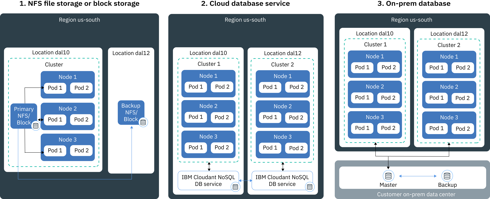

---

copyright:
  years: 2014, 2018
lastupdated: "2018-02-12"

---

{:new_window: target="_blank"}
{:shortdesc: .shortdesc}
{:screen: .screen}
{:pre: .pre}
{:table: .aria-labeledby="caption"}
{:codeblock: .codeblock}
{:tip: .tip}
{:download: .download}


# Saving data in your cluster
{: #storage}
You can persist data to share data between app instances and to protect your data from being lost if a component in your cluster fails.

## Planning highly available storage
{: #planning}

In {{site.data.keyword.containerlong_notm}} you can choose from several options to store your app data and share data across pods in your cluster. However, not all storage options offer the same level of persistence and availability in case a component in your cluster or a whole site fails.
{: shortdesc}

### Non-persistent data storage options
{: #non_persistent}

You can use non-persistent storage options if your data is not required to be persistently stored, so that you can recover it after a component in your cluster fails, or if data does not need to be shared across app instances. Non-persistent storage options can also be used to unit-test your app components or try out new features.
{: shortdesc}

The following image shows available non-persistent data storage options in {{site.data.keyword.containerlong_notm}}. These options are available for free and standard clusters.
<p>
</p>

<table summary="The table shows non-persistent storage options. Rows are to be read from the left to right, with the number of the option in column one, the title of the otion in column two and a description in column three." style="width: 100%">
  <thead>
  <th>Option</th>
  <th>Description</th>
  </thead>
  <tbody>
    <tr>
      <td>1. Inside the container or pod</td>
      <td>Containers and pods are, by design, short-lived and can fail unexpectedly. However, you can write data to the local file system of the container to store data throughout the lifecycle of the container. Data inside a container cannot be shared with other containers or pods and is lost when the container crashes or is removed. For more information, see [Storing data in a container](https://docs.docker.com/storage/).</td>
    </tr>
  <tr>
    <td>2. On the worker node</td>
    <td>Every worker node is set up with primary and secondary storage that is determined by the machine type that you select for your worker node. The primary storage is used to store data from the operating system and can be accessed by using a [Kubernetes <code>hostPath</code> volume ](https://kubernetes.io/docs/concepts/storage/volumes/#hostpath). The secondary storage is used to store data in <code>/var/lib/docker</code>, the directory that all the container data is written to. You can access the secondary storage by using a [Kubernetes <code>emptyDir</code> volume ](https://kubernetes.io/docs/concepts/storage/volumes/#emptydir)<br/><br/>While <code>hostPath</code> volumes are used to mount files from the worker node file system to your pod, <code>emptyDir</code> creates an empty directory that is assigned to a pod in your cluster. All containers in that pod can read from and write to that volume. Because the volume is assigned to one specific pod, data cannot be shared with other pods in a replica set.<br/><br/><p>A <code>hostPath</code> or <code>emptyDir</code> volume and its data are removed when: <ul><li>The worker node is deleted.</li><li>The worker node is reloaded or updated.</li><li>The cluster is deleted.</li><li>The {{site.data.keyword.Bluemix_notm}} account reaches a suspended state. </li></ul></p><p>In addtion, data in an <code>emptyDir</code> volume is removed when: <ul><li>The assigned pod is permanently deleted from the worker node.</li><li>The assigned pod is scheduled on another worker node.</li></ul></p><p><strong>Note:</strong> If the container inside the pod crashes, the data in the volume is still available on the worker node.</p></td>
    </tr>
    </tbody>
    </table>

### Persistent data storage options for high availability
{: persistent}

The main challenge when you create highly available stateful apps is to persist data across multiple app instances in multiple locations, and to keep data in sync at all times. For high available data, you want to make sure that you have a master database with multiple instances that are spread across multiple data centers or even multiple regions, and that data in this master is continuously replicated. All instances in your cluster must read from and write to this master database. In case one instance of the master is down, other instances can take over the workload, so that you do not experience downtime for your apps.
{: shortdesc}

The following image shows the options that you have in {{site.data.keyword.containerlong_notm}} to make your data highly available in a standard cluster. The option that is right for you depends on the following factors:
  * **The type of app that you have:** For example, you might have an app that must store data on a file basis rather than inside a database.
  * **Legal requirements for where to store and route the data:** For example, you might be obligated to store and route data in the United States only and you cannot use a service that is located in Europe.
  * **Backup and restore options:** Every storage options comes with capabilities to backup and restore data. Check that available backup and restore options meet the requirements of your disaster recovery plan, such as the frequency of backups or the capabilities of storing data outside your primary data center.
  * **Global replication:** For high availability, you might want to set up multiple instances of storage that are distributed and replicated across data centers worldwide.

<br/>


<table summary="The table shows persistent storage options. Rows are to be read from the left to right, with the number of the option in column one, the title of the otion in column two and a description in column three.">
  <thead>
  <th>Option</th>
  <th>Description</th>
  </thead>
  <tbody>
  <tr>
  <td>1. NFS file storage</td>
  <td>With this option, you can persist app and container data by using Kubernetes persistent volumes. Volumes are hosted on [Endurance and Performance NFS-based file storage ](https://www.ibm.com/cloud/file-storage/details) which can be used for apps that store data on a file basis rather than in a database. File storage is encrypted at REST and clustered by IBM to provide high availability.<p>{{site.data.keyword.containershort_notm}} provides predefined storage classes that define the range of sizes of the storage, IOPS, the delete policy, and the read and write permissions for the volume. To initiate a request for NFS-based file storage, you must create a [persistent volume claim](cs_storage.html#create). After you submit a persistent volume claim, {{site.data.keyword.containershort_notm}} dynamically provisions a persistent volume that is hosted on NFS-based file storage. [You can mount the persistent volume claim](cs_storage.html#app_volume_mount) as a volume to your deployment to allow the containers to read from and write to the volume. </p><p>Persistent volumes are provisioned in the data center where the worker node is located. You can share data across the same replica set or with other deployments in the same cluster. You cannot share data across clusters when they are located in different data centers or regions. </p><p>By default, NFS storage is not backed up automatically. You can set up a periodic backup for your cluster by using the provided [backup and restore mechanisms](cs_storage.html#backup_restore). When a container crashes or a pod is removed from a worker node, the data is not removed and can still be accessed by other deployments that mount the volume. </p><p><strong>Note:</strong> Persistent NFS file share storage is charged on a monthly basis. If you provision persistent storage for your cluster and remove it immediately, you still pay the monthly charge for the persistent storage, even if you used it only for a short amount of time.</p></td>
  </tr>
  <tr>
    <td>2. Cloud database service</td>
    <td>With this option, you can persist data by using an {{site.data.keyword.Bluemix_notm}} database cloud service, such as [IBM Cloudant NoSQL DB](/docs/services/Cloudant/getting-started.html#getting-started-with-cloudant). Data that is stored with this option can be accessed across clusters, locations, and regions. <p> You can choose to configure a single database instance that all your apps access, or to [set up multiple instances across data centers and replication](/docs/services/Cloudant/guides/active-active.html#configuring-cloudant-nosql-db-for-cross-region-disaster-recovery) between the instances for higher availability. In IBM Cloudant NoSQL database, data is not backed up automatically. You can use the provided [backup and restore mechanisms](/docs/services/Cloudant/guides/backup-cookbook.html#cloudant-nosql-db-backup-and-recovery) to protect your data from a site failure.</p> <p> To use a service in your cluster, you must [bind the {{site.data.keyword.Bluemix_notm}} service](cs_integrations.html#adding_app) to a namespace in your cluster. When you bind the service to the cluster, a Kubernetes secret is created. The Kubernetes secret holds confidential information about the service, such as the URL to the service, your user name, and password. You can mount the secret as a secret volume to your pod and access the service by using the credentials in the secret. By mounting the secret volume to other pods, you can also share data between pods. When a container crashes or a pod is removed from a worker node, the data is not removed and can still be accessed by other pods that mount the secret volume. <p>Most {{site.data.keyword.Bluemix_notm}} database services provide disk space for a small amount of data at no cost, so you can test its features.</p></td>
  </tr>
  <tr>
    <td>3. On-prem database</td>
    <td>If your data must be stored on-site for legal reasons, you can [set up a VPN connection](cs_vpn.html#vpn) to your on-premise database and use existing storage, backup and replication mechanisms in your data center.</td>
  </tr>
  </tbody>
  </table>

{: caption="Table. Persistent data storage options for deployments in Kubernetes clusters" caption-side="top"}

<br />


## Using existing NFS file shares in clusters
{: #existing}

If you already have existing NFS file shares in your IBM Cloud infrastructure (SoftLayer) account that you want to use with Kubernetes, you can do so by creating persistent volumes on your existing NFS file share. A persistent volume is a piece of actual hardware that serves as a Kubernetes cluster resource and can be consumed by the cluster user.
{:shortdesc}

Kubernetes differentiates between persistent volumes that represent the actual hardware and persistent volume claims that are requests for storage usually initiated by the cluster user. The following diagram illustrates the relationship between persistent volumes and persistent volume claims.


 As depicted in the diagram, to enable existing NFS file shares to be used with Kubernetes, you must create persistent volumes with a certain size and access mode and create a persistent volume claim that matches the persistent volume specification. If persistent volume and persistent volume claim match, they are bound to each other. Only bound persistent volume claims can be used by the cluster user to mount the volume to a deployment. This process is referred to as static provisioning of persistent storage.

Before you begin, make sure that you have an existing NFS file share that you can use to create your persistent volume.

**Note:** Static provisioning of persistent storage only applies to existing NFS file shares. If you do not have existing NFS file shares, cluster users can use the [dynamic provisioning](cs_storage.html#create) process to add persistent volumes.

To create a persistent volume and matching persistent volume claim, follow these steps.

1.  In your IBM Cloud infrastructure (SoftLayer) account, look up the ID and path of the NFS file share where you want to create your persistent volume object. In addition, authorize the file storage to the subnets in the cluster. This authorization gives your cluster access to the storage.
    1.  Log in to your IBM Cloud infrastructure (SoftLayer) account.
    2.  Click **Storage**.
    3.  Click **File Storage** and from the **Actions** menu, select **Authorize Host**.
    4.  Click **Subnets**. After you authorize, every worker node on the subnet has access to the file storage.
    5.  Select the subnet of your cluster's public VLAN from the menu and click **Submit**. If you need to find the subnet, run `bx cs cluster-get <cluster_name> --showResources`.
    6.  Click the name of the file storage.
    7.  Make note the **Mount Point** field. The field is displayed as `<server>:/<path>`.
2.  Create a storage configuration file for your persistent volume. Include the server and path from the file storage **Mount Point** field.

    ```
    apiVersion: v1
    kind: PersistentVolume
    metadata:
     name: mypv
    spec:
     capacity:
       storage: "20Gi"
     accessModes:
       - ReadWriteMany
     nfs:
       server: "nfslon0410b-fz.service.networklayer.com"
       path: "/IBM01SEV8491247_0908"
    ```
    {: codeblock}

    <table>
    <caption>Table. Understanding the YAML file components</caption>
    <thead>
    <th colspan=2> Understanding the YAML file components</th>
    </thead>
    <tbody>
    <tr>
    <td><code>name</code></td>
    <td>Enter the name of the persistent volume object that you want to create.</td>
    </tr>
    <tr>
    <td><code>storage</code></td>
    <td>Enter the storage size of the existing NFS file share. The storage size must be written in gigabytes, for example, 20Gi (20 GB) or 1000Gi (1 TB), and the size must match the size of the existing file share.</td>
    </tr>
    <tr>
    <td><code>accessMode</code></td>
    <td>Access modes define the way that the persistent volume claim can be mounted to a worker node.<ul><li>ReadWriteOnce (RWO): The persistent volume can be mounted to deployments in a single worker node only. Containers in deployments that are mounted to this persistent volume can read from and write to the volume.</li><li>ReadOnlyMany (ROX): The persistent volume can be mounted to deployments that are hosted on multiple worker nodes. Deployments that are mounted to this persistent volume can only read from the volume.</li><li>ReadWriteMany (RWX): This persistent volume can be mounted to deployments that are hosted on multiple worker nodes. Deployments that are mounted to this persistent volume can read from and write to the volume.</li></ul></td>
    </tr>
    <tr>
    <td><code>server</code></td>
    <td>Enter the NFS file share server ID.</td>
    </tr>
    <tr>
    <td><code>path</code></td>
    <td>Enter the path to the NFS file share where you want to create the persistent volume object.</td>
    </tr>
    </tbody></table>

3.  Create the persistent volume object in your cluster.

    ```
    kubectl apply -f <yaml_path>
    ```
    {: pre}

    Example

    ```
    kubectl apply -f deploy/kube-config/pv.yaml
    ```
    {: pre}

4.  Verify that the persistent volume is created.

    ```
    kubectl get pv
    ```
    {: pre}

5.  Create another configuration file to create your persistent volume claim. In order for the persistent volume claim to match the persistent volume object that you created earlier, you must choose the same value for `storage` and `accessMode`. The `storage-class` field must be empty. If any of these fields do not match the persistent volume, then a new persistent volume is created automatically instead.

    ```
    kind: PersistentVolumeClaim
    apiVersion: v1
    metadata:
     name: mypvc
     annotations:
       volume.beta.kubernetes.io/storage-class: ""
    spec:
     accessModes:
       - ReadWriteMany
     resources:
       requests:
         storage: "20Gi"
    ```
    {: codeblock}

6.  Create your persistent volume claim.

    ```
    kubectl apply -f deploy/kube-config/mypvc.yaml
    ```
    {: pre}

7.  Verify that your persistent volume claim is created and bound to the persistent volume object. This process can take a few minutes.

    ```
    kubectl describe pvc mypvc
    ```
    {: pre}

    Your output looks similar to the following.

    ```
    Name: mypvc
    Namespace: default
    StorageClass:	""
    Status: Bound
    Volume: pvc-0d787071-3a67-11e7-aafc-eef80dd2dea2
    Labels: <none>
    Capacity: 20Gi
    Access Modes: RWX
    Events:
      FirstSeen LastSeen Count From        SubObjectPath Type Reason Message
      --------- -------- ----- ----        ------------- -------- ------ -------
      3m 3m 1 {ibm.io/ibmc-file 31898035-3011-11e7-a6a4-7a08779efd33 } Normal Provisioning External provisioner is provisioning volume for claim "default/my-persistent-volume-claim"
      3m 1m	 10 {persistentvolume-controller } Normal ExternalProvisioning cannot find provisioner "ibm.io/ibmc-file", expecting that a volume for the claim is provisioned either manually or via external software
      1m 1m 1 {ibm.io/ibmc-file 31898035-3011-11e7-a6a4-7a08779efd33 } Normal ProvisioningSucceeded	Successfully provisioned volume pvc-0d787071-3a67-11e7-aafc-eef80dd2dea2
    ```
    {: screen}


You successfully created a persistent volume object and bound it to a persistent volume claim. Cluster users can now [mount the persistent volume claim](#app_volume_mount) to their deployments and start reading from and writing to the persistent volume object.

<br />


## Creating persistent storage for apps
{: #create}

Create a persistent volume claim (pvc) to provision NFS file storage for your cluster. Then, mount this claim to a deployment to ensure that data is available even if the pods crash or shut down.
{:shortdesc}

The NFS file storage that backs the persistent volume is clustered by IBM in order to provide high availability for your data. The storage classes describe the types of storage offerings available and define aspects such as the data retention policy, size in gigabytes, and IOPS when you create your persistent volume.

**Note**: If you have a firewall, [allow egress access](cs_firewall.html#pvc) for the IBM Cloud infrastructure (SoftLayer) IP ranges of the locations (data centers) that your clusters are in, so that you can create persistent volume claims.


1.  Review the available storage classes. {{site.data.keyword.containerlong}} provides eight pre-defined storage classes so that the cluster admin does not have to create any storage classes. The `ibmc-file-bronze` storage class is the same as the `default` storage class.

    ```
    kubectl get storageclasses
    ```
    {: pre}

    ```
    $ kubectl get storageclasses
    NAME                         TYPE
    default                      ibm.io/ibmc-file
    ibmc-file-bronze (default)   ibm.io/ibmc-file
    ibmc-file-custom             ibm.io/ibmc-file
    ibmc-file-gold               ibm.io/ibmc-file
    ibmc-file-retain-bronze      ibm.io/ibmc-file
    ibmc-file-retain-custom      ibm.io/ibmc-file
    ibmc-file-retain-gold        ibm.io/ibmc-file
    ibmc-file-retain-silver      ibm.io/ibmc-file
    ibmc-file-silver             ibm.io/ibmc-file
    ```
    {: screen}

2.  Decide if you want to save your data and the NFS file share after you delete the pvc, called the reclaim policy. If you want to keep your data, then choose a `retain` storage class. If you want the data and your file share to be deleted when you delete the pvc, choose a storage class without `retain`.

3.  Review the IOPS of a storage class and the available storage sizes.

    - The bronze, silver, and gold storage classes use [Endurance storage ](https://knowledgelayer.softlayer.com/topic/endurance-storage) and have a single defined IOPS per GB for each class. The total IOPS depends on the size of the storage. For example, a 1000Gi pvc at 4 IOPS per GB has a total of 4000 IOPS.

      **Example command to describe storage class**:

      ```
      kubectl describe storageclasses ibmc-file-silver
      ```
      {: pre}

      The **parameters** field provides the IOPS per GB associated with the storage class and the available sizes in gigabytes.

      ```
      Parameters:	iopsPerGB=4,sizeRange=20Gi,40Gi,80Gi,100Gi,250Gi,500Gi,1000Gi,2000Gi,4000Gi,8000Gi,12000Gi
      ```
      {: screen}

    - The custom storage classes use [Performance storage ](https://knowledgelayer.softlayer.com/topic/performance-storage) and have discrete options for total IOPS and size.

    **Example command to describe custom storage class**:

    ```
    kubectl describe storageclasses ibmc-file-retain-custom
    ```
    {: pre}

    The **parameters** field provides the IOPS associated with the storage class and the available sizes in gigabytes. For example, a 40Gi pvc can select IOPS that is a multiple of 100 that is in the range of 100 - 2000 IOPS.

    ```
    Parameters:	Note=IOPS value must be a multiple of 100,reclaimPolicy=Retain,sizeIOPSRange=20Gi:[100-1000],40Gi:[100-2000],80Gi:[100-4000],100Gi:[100-6000],1000Gi[100-6000],2000Gi:[200-6000],4000Gi:[300-6000],8000Gi:[500-6000],12000Gi:[1000-6000]
    ```
    {: screen}

4. Create a configuration file to define your persistent volume claim and save the configuration as a `.yaml` file.

    **Example for bronze, silver, gold storage classes**:

    ```
    apiVersion: v1
    kind: PersistentVolumeClaim
    metadata:
      name: mypvc
      annotations:
        volume.beta.kubernetes.io/storage-class: "ibmc-file-silver"

    spec:
      accessModes:
        - ReadWriteMany
      resources:
        requests:
          storage: 20Gi
    ```
    {: codeblock}

    **Example for custom storage classes**:

    ```
    apiVersion: v1
    kind: PersistentVolumeClaim
    metadata:
      name: mypvc
      annotations:
        volume.beta.kubernetes.io/storage-class: "ibmc-file-retain-custom"

    spec:
      accessModes:
        - ReadWriteMany
      resources:
        requests:
          storage: 40Gi
          iops: "500"
    ```
    {: codeblock}

    <table>
    <thead>
    <th colspan=2> Understanding the YAML file components</th>
    </thead>
    <tbody>
    <tr>
    <td><code>metadata/name</code></td>
    <td>Enter the name of the persistent volume claim.</td>
    </tr>
    <tr>
    <td><code>metadata/annotations</code></td>
    <td>Specify the storage class for the persistent volume:
      <ul>
      <li>ibmc-file-bronze / ibmc-file-retain-bronze : 2 IOPS per GB.</li>
      <li>ibmc-file-silver / ibmc-file-retain-silver: 4 IOPS per GB.</li>
      <li>ibmc-file-gold / ibmc-file-retain-gold: 10 IOPS per GB.</li>
      <li>ibmc-file-custom / ibmc-file-retain-custom: Multiple values of IOPS available.</li>
      <p>If you do not specify a storage class, the persistent volume is created with the bronze storage class.</p></td>
    </tr>
    <tr>
    <td><code>spec/accessModes</code>
    <code>resources/requests/storage</code></td>
    <td>If you choose a size other than one that is listed, the size is rounded up. If you select a size larger than the largest size, then the size is rounded down.</td>
    </tr>
    <tr>
    <td><code>spec/accessModes</code>
    <code>resources/requests/iops</code></td>
    <td>This option is for ibmc-file-custom / ibmc-file-retain-custom only. Specify the total IOPS for the storage. To see all options, run `kubectl describe storageclasses ibmc-file-custom`. If you choose an IOPS other than one that is listed, the IOPS is rounded up.</td>
    </tr>
    </tbody></table>

5.  Create the persistent volume claim.

    ```
    kubectl apply -f <local_file_path>
    ```
    {: pre}

6.  Verify that your persistent volume claim is created and bound to the persistent volume. This process can take a few minutes.

    ```
    kubectl describe pvc mypvc
    ```
    {: pre}

    Example output:

    ```
    Name:		mypvc
    Namespace:	default
    StorageClass:	""
    Status:		Bound
    Volume:		pvc-0d787071-3a67-11e7-aafc-eef80dd2dea2
    Labels:		<none>
    Capacity:	20Gi
    Access Modes:	RWX
    Events:
      FirstSeen	LastSeen	Count	From								SubObjectPath	Type		Reason			Message
      ---------	--------	-----	----								-------------	--------	------			-------
      3m		3m		1	{ibm.io/ibmc-file 31898035-3011-11e7-a6a4-7a08779efd33 }			Normal		Provisioning		External provisioner is provisioning volume for claim "default/my-persistent-volume-claim"
      3m		1m		10	{persistentvolume-controller }							Normal		ExternalProvisioning	cannot find provisioner "ibm.io/ibmc-file", expecting that a volume for the claim is provisioned either manually or via external software
      1m		1m		1	{ibm.io/ibmc-file 31898035-3011-11e7-a6a4-7a08779efd33 }			Normal		ProvisioningSucceeded	Successfully provisioned volume pvc-0d787071-3a67-11e7-aafc-eef80dd2dea2

    ```
    {: screen}

6.  {: #app_volume_mount}To mount the persistent volume claim to your deployment, create a configuration file. Save the configuration as a `.yaml` file.

    ```
    apiVersion: extensions/v1beta1
    kind: Deployment
    metadata:
     name: <deployment_name>
    replicas: 1
    template:
     metadata:
       labels:
         app: <app_name>
    spec:
     containers:
     - image: <image_name>
       name: <container_name>
       volumeMounts:
       - mountPath: /<file_path>
         name: <volume_name>
     volumes:
     - name: <volume_name>
       persistentVolumeClaim:
         claimName: <pvc_name>
    ```
    {: codeblock}

    <table>
    <thead>
    <th colspan=2> Understanding the YAML file components</th>
    </thead>
    <tbody>
    <tr>
    <td><code>metadata/name</code></td>
    <td>The name of the deployment.</td>
    </tr>
    <tr>
    <td><code>template/metadata/labels/app</code></td>
    <td>A label for the deployment.</td>
    </tr>
    <tr>
    <td><code>spec/containers/image</code></td>
    <td>The name of the image that you want to use. To list available images in your {{site.data.keyword.registryshort_notm}} account, run `bx cr image-list`.</td>
    </tr>
    <tr>
    <td><code>spec/containers/name</code></td>
    <td>The name of the container that you want to deploy to your cluster.</td>
    </tr>
    <tr>
    <td><code>spec/containers/volumeMounts/mountPath</code></td>
    <td>The absolute path of the directory to where the volume is mounted inside the container.</td>
    </tr>
    <tr>
    <td><code>spec/containers/volumeMounts/name</code></td>
    <td>The name of the volume to mount to your pod.</td>
    </tr>
    <tr>
    <td><code>volumes/name</code></td>
    <td>The name of the volume to mount to your pod. Typically this name is the same as <code>volumeMounts/name</code>.</td>
    </tr>
    <tr>
    <td><code>volumes/persistentVolumeClaim/claimName</code></td>
    <td>The name of the persistent volume claim that you want to use as your volume. When you mount the volume to the pod, Kubernetes identifies the persistent volume that is bound to the persistent volume claim and enables the user to read from and write to the persistent volume.</td>
    </tr>
    </tbody></table>

8.  Create the deployment and mount the persistent volume claim.

    ```
    kubectl apply -f <local_yaml_path>
    ```
    {: pre}

9.  Verify that the volume is successfully mounted.

    ```
    kubectl describe deployment <deployment_name>
    ```
    {: pre}

    The mount point is in the **Volume Mounts** field and the volume is in the **Volumes** field.

    ```
     Volume Mounts:
          /var/run/secrets/kubernetes.io/serviceaccount from default-token-tqp61 (ro)
          /volumemount from myvol (rw)
    ...
    Volumes:
      myvol:
        Type:	PersistentVolumeClaim (a reference to a PersistentVolumeClaim in the same namespace)
        ClaimName:	mypvc
        ReadOnly:	false

    ```
    {: screen}


<br />


## Setting up backup and restore solutions for NFS file shares
{: #backup_restore}

File shares are provisioned into the same location (data center) as your cluster and are clustered by {{site.data.keyword.IBM_notm}} to provide high availability. However, file shares are not backed up automatically and might be inaccessible if the entire location fails. To protect your data from being lost or damaged, you can set up periodic backups of your NFS file shares that you can use to restore your data when needed.
{: shortdesc}

Review the following backup and restore options for your NFS file shares:

<dl>
  <dt>Set up periodic snapshots of your NFS file share</dt>
  <dd>You can set up [periodic snapshots](/docs/infrastructure/FileStorage/snapshots.html#working-with-snapshots) for your NFS file share, which is a read-only image of an NFS file share that captures the state of the volume at a point in time. Snapshots are stored on the same file share within the same location. You can restore data from a snapshot if a user accidentally removes important data from the volume.</dd>
  <dt>Replicate snapshots to an NFS file share in another location (data center)</dt>
 <dd>To protect your data from a location failure, you can [replicate snapshots](/docs/infrastructure/FileStorage/replication.html#working-with-replication) to an NFS file share that is set up in another location. Data can be replicated from the primary NFS file share to the backup NFS file share only. You cannot mount a replicated NFS file share to a cluster. When your primary NFS file share fails, you can manually set your backup NFS file share to be the primary one. Then, you can mount it to your cluster. After your primary NFS file share is restored, you can restore the data from the backup NFS file share.</dd>
  <dt>Backup data to Object Storage</dt>
  <dd>You can use the [**ibm-backup-restore image**](/docs/services/RegistryImages/ibm-backup-restore/index.html#ibmbackup_restore_starter) to spin up a backup and restore pod in your cluster. This pod contains a script to run a one-time or periodic backup for any persistent volume claim in your cluster. Data is stored in your {{site.data.keyword.objectstoragefull}} instance that you set up in a location. To make your data even more highly available and protect your app from a location failure, set up a second {{site.data.keyword.objectstoragefull}} instance and replicate data across locations. If you need to restore data from your {{site.data.keyword.objectstoragefull}} instance, use the restore script that is provided with the image.</dd>
  </dl>

## Adding non-root user access to persistent storage
{: #nonroot}

Non-root users do not have write permission on the volume mount path for NFS-backed storage. To grant write permission, you must edit the Dockerfile of the image to create a directory on the mount path with the correct permission.
{:shortdesc}

Before you begin, [target your CLI](cs_cli_install.html#cs_cli_configure) to your cluster.

If you are designing an app with a non-root user that requires write permission to the volume, you must add the following processes to your Dockerfile and entrypoint script:

-   Create a non-root user.
-   Temporarily add the user to the root group.
-   Create a directory in the volume mount path with the correct user permissions.

For {{site.data.keyword.containershort_notm}}, the default owner of the volume mount path is the owner `nobody`. With NFS storage, if the owner does not exist locally in the pod, then the `nobody` user is created. The volumes are set up to recognize the root user in the container, which for some apps, is the only user inside a container. However, many apps specify a non-root user other than `nobody` that writes to the container mount path. Some apps specify that the volume must be owned by the root user. Typically apps do not use the root user due to security concerns. However, if your app requires a root user you can contact [{{site.data.keyword.Bluemix_notm}} support](/docs/get-support/howtogetsupport.html#getting-customer-support) for assistance.


1.  Create a Dockerfile in a local directory. This example Dockerfile is creating a non-root user named `myguest`.

    ```
    FROM registry.<region>.bluemix.net/ibmliberty:latest

    # Create group and user with GID & UID 1010.
    # In this case your are creating a group and user named myguest.
    # The GUID and UID 1010 is unlikely to create a conflict with any existing user GUIDs or UIDs in the image.
    # The GUID and UID must be between 0 and 65536. Otherwise, container creation fails.
    RUN groupadd --gid 1010 myguest
    RUN useradd --uid 1010 --gid 1010 -m --shell /bin/bash myguest

    ENV MY_USER=myguest

    COPY entrypoint.sh /sbin/entrypoint.sh
    RUN chmod 755 /sbin/entrypoint.sh

    EXPOSE 22
    ENTRYPOINT ["/sbin/entrypoint.sh"]
    ```
    {: codeblock}

2.  Create the entrypoint script in the same local folder as the Dockerfile. This example entrypoint script is specifying `/mnt/myvol` as the volume mount path.

    ```
    #!/bin/bash
    set -e

    # This is the mount point for the shared volume.
    # By default the mount point is owned by the root user.
    MOUNTPATH="/mnt/myvol"
    MY_USER=${MY_USER:-"myguest"}

    # This function creates a subdirectory that is owned by
    # the non-root user under the shared volume mount path.
    create_data_dir() {
      #Add the non-root user to primary group of root user.
      usermod -aG root $MY_USER

      # Provide read-write-execute permission to the group for the shared volume mount path.
      chmod 775 $MOUNTPATH

      # Create a directory under the shared path owned by non-root user myguest.
      su -c "mkdir -p ${MOUNTPATH}/mydata" -l $MY_USER
      su -c "chmod 700 ${MOUNTPATH}/mydata" -l $MY_USER
      ls -al ${MOUNTPATH}

      # For security, remove the non-root user from root user group.
      deluser $MY_USER root

      # Change the shared volume mount path back to its original read-write-execute permission.
      chmod 755 $MOUNTPATH
      echo "Created Data directory..."
    }

    create_data_dir

    # This command creates a long-running process for the purpose of this example.
    tail -F /dev/null
    ```
    {: codeblock}

3.  Log in to {{site.data.keyword.registryshort_notm}}.

    ```
    bx cr login
    ```
    {: pre}

4.  Build the image locally. Remember to replace _&lt;my_namespace&gt;_ with the namespace to your private images registry. Run `bx cr namespace-get` if you need to find your namespace.

    ```
    docker build -t registry.<region>.bluemix.net/<my_namespace>/nonroot .
    ```
    {: pre}

5.  Push the image to your namespace in {{site.data.keyword.registryshort_notm}}.

    ```
    docker push registry.<region>.bluemix.net/<my_namespace>/nonroot
    ```
    {: pre}

6.  Create a persistent volume claim by creating a configuration `.yaml` file. This example uses a lower performance storage class. Run `kubectl get storageclasses` to see available storage classes.

    ```
    apiVersion: v1
    kind: PersistentVolumeClaim
    metadata:
      name: mypvc
      annotations:
        volume.beta.kubernetes.io/storage-class: "ibmc-file-bronze"
    spec:
      accessModes:
        - ReadWriteMany
      resources:
        requests:
          storage: 20Gi
    ```
    {: codeblock}

7.  Create the persistent volume claim.

    ```
    kubectl apply -f <local_file_path>
    ```
    {: pre}

8.  Create a configuration file to mount the volume and run the pod from the nonroot image. The volume mount path `/mnt/myvol` matches the mount path that is specified in the Dockerfile. Save the configuration as a `.yaml` file.

    ```
    apiVersion: v1
    kind: Pod
    metadata:
     name: mypod
    spec:
     containers:
     - image: registry.<region>.bluemix.net/<my_namespace>/nonroot
       name: mycontainer
       volumeMounts:
       - mountPath: /mnt/myvol
         name: myvol
     volumes:
     - name: myvol
       persistentVolumeClaim:
         claimName: mypvc
    ```
    {: codeblock}

9.  Create the pod and mount the persistent volume claim to your pod.

    ```
    kubectl apply -f <local_yaml_path>
    ```
    {: pre}

10. Verify that the volume is successfully mounted to your pod.

    ```
    kubectl describe pod mypod
    ```
    {: pre}

    The mount point is listed in the **Volume Mounts** field and the volume is listed in the **Volumes** field.

    ```
     Volume Mounts:
          /var/run/secrets/kubernetes.io/serviceaccount from default-token-tqp61 (ro)
          /mnt/myvol from myvol (rw)
    ...
    Volumes:
      myvol:
        Type:	PersistentVolumeClaim (a reference to a PersistentVolumeClaim in the same namespace)
        ClaimName:	mypvc
        ReadOnly:	false

    ```
    {: screen}

11. Log in to the pod after the pod is running.

    ```
    kubectl exec -it mypod /bin/bash
    ```
    {: pre}

12. View permissions of your volume mount path.

    ```
    ls -al /mnt/myvol/
    ```
    {: pre}

    ```
    root@instance-006ff76b:/# ls -al /mnt/myvol/
    total 12
    drwxr-xr-x 3 root    root    4096 Jul 13 19:03 .
    drwxr-xr-x 3 root    root    4096 Jul 13 19:03 ..
    drwx------ 2 myguest myguest 4096 Jul 13 19:03 mydata
    ```
    {: screen}

    This output shows that root has read, write, and execute permissions on the volume mount path `mnt/myvol/`, but the non-root myguest user has permission to read and write to the `mnt/myvol/mydata` folder. Because of these updated permissions, the non-root user can now write data to the persistent volume.


