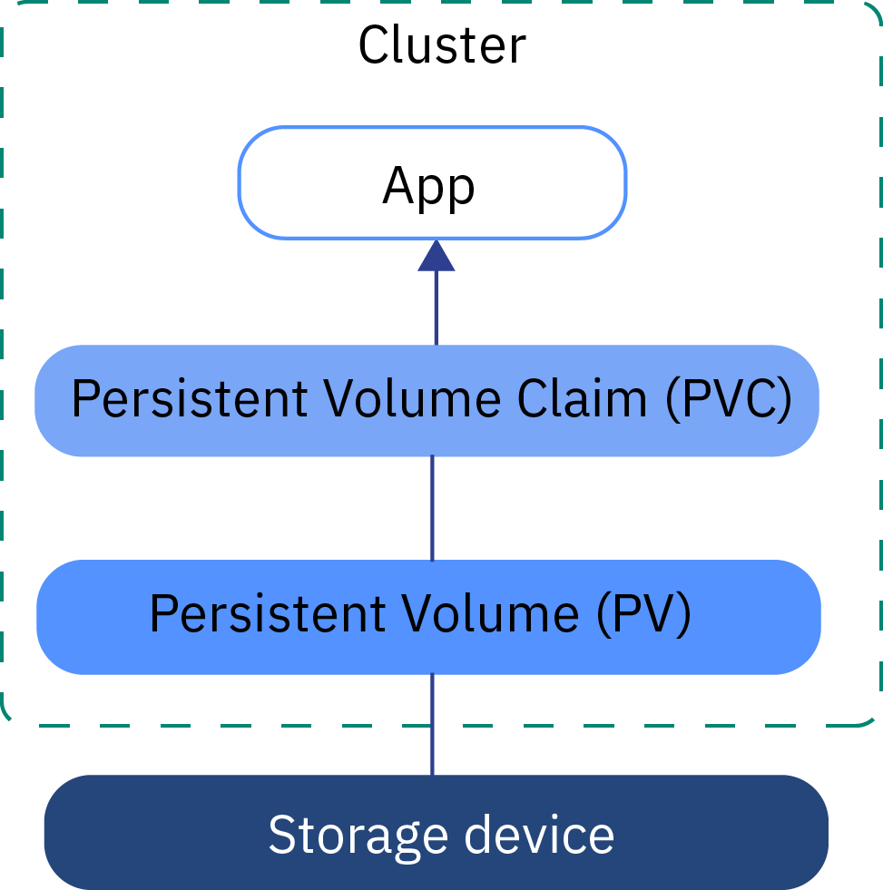
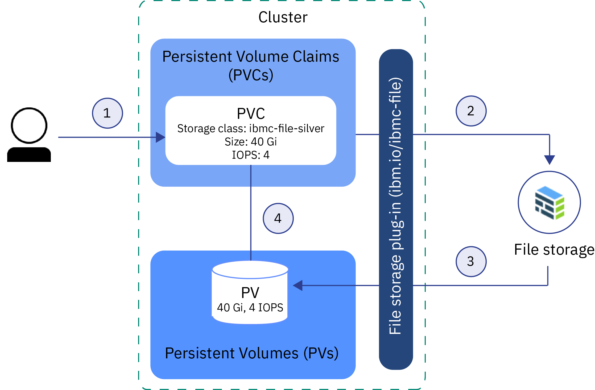
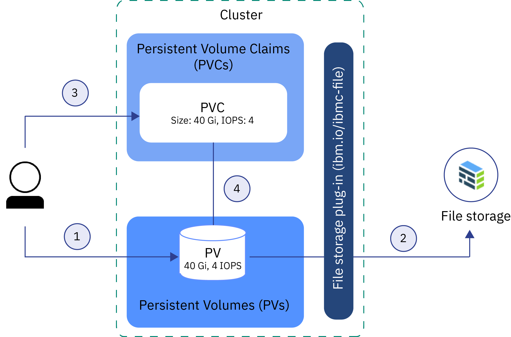

---

copyright:
  years: 2014, 2018
lastupdated: "2018-11-19"

---

{:new_window: target="_blank"}
{:shortdesc: .shortdesc}
{:screen: .screen}
{:pre: .pre}
{:table: .aria-labeledby="caption"}
{:codeblock: .codeblock}
{:tip: .tip}
{:note: .note}
{:important: .important}
{:deprecated: .deprecated}
{:download: .download}


# Understanding Kubernetes storage basics
{: #kube_concepts}

## Persistent volumes and persistent volume claims
{: #pvc_pv}

Before you get started with provisioning storage, it is important to understand the Kubernetes concepts of a persistent volume and a persistent volume claim and how they work together in a cluster.
{: shortdesc}

The following image shows the storage components in a Kubernetes cluster.



- **Cluster**</br> By default, every cluster is set up with a plug-in to [provision file storage](cs_storage_file.html#add_file). You can choose to install other add-ons, such as the one for [block storage](cs_storage_block.html). To use storage in a cluster, you must create a persistent volume claim, a persistent volume and a physical storage instance. When you delete the cluster, you have the option to delete related storage instances.
- **App**</br> To read from and write to your storage instance, you must mount the persistent volume claim (PVC) to your app. Different storage types have different read-write rules. For example, you can mount multiple pods to the same PVC for file storage. Block storage comes with a RWO (ReadWriteOnce) access mode so that you can mount the storage to one pod only.
- **Persistent volume claim (PVC)** </br> A PVC is the request to provision persistent storage with a specific type and configuration. To specify the persistent storage flavor that you want, you use [Kubernetes storage classes](#storageclasses). The cluster admin can define storage classes, or you can choose from one of the predefined storage classes in {{site.data.keyword.containerlong_notm}}. When you create a PVC, the request is sent to the {{site.data.keyword.Bluemix}} storage provider. Depending on the configuration that is defined in the storage class, the physical storage device is ordered and provisioned into your IBM Cloud infrastructure (SoftLayer) account. If the requested configuration does not exist, the storage is not created.
- **Persistent volume (PV)** </br> A PV is a virtual storage instance that is added as a volume to the cluster. The PV points to a physical storage device in your IBM Cloud infrastructure (SoftLayer) account and abstracts the API that is used to communicate with the storage device. To mount a PV to an app, you must have a matching PVC. Mounted PVs appear as a folder inside the container's file system.
- **Physical storage** </br> A physical storage instance that you can use to persist your data. {{site.data.keyword.containerlong_notm}} provides high availability for physical storage instances. However, data that is stored on a physical storage instance is not backed up automatically. Depending on the type of storage that you use, different methods exist to set up backup and restore solutions.

For more information about how to create and use PVCs, PVs, and the physical storage device, see:
- [Dynamic provisioning](#dynamic_provisioning)
- [Static provisioning](#static_provisioning)

## Dynamic provisioning
{: #dynamic_provisioning}

Use dynamic provisioning if you want to give developers the freedom to provision storage when they need it.
{: shortdesc}

**How does it work?**</br>

Dynamic provisioning is a feature that is native to Kubernetes and that allows a cluster developer to order storage with a pre-defined type and configuration without knowing all the details about how to provision the physical storage device. To abstract the details for the specific storage type, the cluster admin must create [storage classes](#storageclasses) that the developer can use, or use the storage classes that are provided with the {{site.data.keyword.Bluemix}} storage plug-ins.

To order the storage, you must create a PVC. The PVC determines the specification for the storage that you want to provision. After the PVC is created, the storage device and the PV are automatically created for you.  

The following image shows how file storage is dynamically provisioned in a cluster. This sample flow works similarly with other storage types, such as block storage.

**Sample flow for dynamic provisioning of file storage with the pre-defined silver storage class**



1. The user creates a persistent volume claim (PVC) that specifies the storage type, storage class, size in gigabytes, number of IOPS, and billing type. The storage class determines the type of storage that is provisioned and the allowed ranges for size and IOPS. Creating a PVC in a cluster automatically triggers the storage plug-in for the requested type of storage to provision storage with the given specification.
2. The storage device is automatically ordered and provisioned into your IBM Cloud infrastructure (SoftLayer) account. The billing cycle for your storage device starts.
3. The storage plug-in automatically creates a persistent volume (PV) in the cluster, a virtual storage device that points to the actual storage device in your IBM Cloud infrastructure (SoftLayer) account.
4. The PVC and PV are automatically connected to each other. The status of the PVC and the PV changes to `Bound`. You can now use the PVC to mount persistent storage to your app. If you delete the PVC, the PV and related storage instance are also deleted. </br>

**When do I use dynamic provisioning?**</br>

Review the following common use cases for dynamic provisioning:
1. **Provision storage when needed:** Instead of pre-providing persistent storage for developers and paying for storage that is not used, you can give developers the freedom to provision storage when they need it. To determine the type of storage that the developer can provision, you can define [storage classes](#storageclasses).
2. **Automate the creation of PVC, PV, and storage device:** You want to automatically provision and deprovision storage without manual intervention from a cluster admin.
3. **Create and delete storage often:** You have an app or set up a continuous delivery pipeline that creates and removes persistent storage regularly. Persistent storage that is dynamically provisioned with a non-retaining storage class can be removed by deleting the PVC.

For more information about how to dynamically provision persistent storage, see:
- [File storage](cs_storage_file.html#add_file)
- [Block storage](cs_storage_block.html#add_block)

## Static provisioning
{: #static_provisioning}

If you have an existing persistent storage device in your IBM Cloud infrastructure (SoftLayer) account, you can use static provisioning to make the storage instance available to your cluster.
{: shortdesc}

**How does it work?**</br>

Static provisioning is a feature that is native to Kubernetes and that allows cluster admins to make existing storage devices available to a cluster. As a cluster admin, you must know the details of the storage device, its supported configurations, and mount options.  

To make existing storage available to a cluster user, you must manually create the storage device, a PV, and a PVC.  

The following image shows how to statically provision file storage in a cluster. This sample flow works similar with other storage types, such as block storage.

**Sample flow for static provisioning of file storage**



1. The cluster admin gathers all the details about the existing storage device and creates a persistent volume (PV) in the cluster.
2. Based on the storage details in the PV, the storage plug-in connects the PV with the storage device in your IBM Cloud infrastructure (SoftLayer) account.
3. The cluster admin or a developer creates a PVC. Because the PV and the storage device already exist, no storage class is specified in the PVC.
4. After the PVC is created, the storage plug-in tries to match the PVC to an existing PV. The PVC and the PV match when the same values for the size, IOPS, and access mode are used in the PVC and the PV. When PVC and PV match, the status of the PVC and the PV changes to `Bound`. You can now use the PVC to mount persistent storage to your app. When you delete the PVC, the PV and the physical storage instance are not removed. You must remove the PVC, PV, and the physical storage instance separately.  </br>

**When do I use static provisioning?**</br>

Review the following common use cases for static provisioning of persistent storage:
1. **Make retained data available to the cluster:** You provisioned persistent storage with a retain storage class by using dynamic provisioning. You removed the PVC, but the PV, the physical storage in IBM Cloud infrastructure (SoftLayer), and the data still exist. You want to access the retained data from an app in your cluster.
2. **Use an existing storage device:** You provisioned persistent storage directly in your IBM Cloud infrastructure (SoftLayer) account and want to use this storage device in your cluster.
3. **Share persistent storage across clusters in the same zone:** You provisioned persistent storage for your cluster. To share the same persistent storage instance with other clusters in the same zone, you must manually create the PV and matching PVC in the other cluster. **Note:** Sharing persistent storage across clusters is available only if the cluster and the storage instance are located in the same zone. 
4. **Share persistent storage across namespaces in the same cluster:** You provisioned persistent storage in a namespace of your cluster. You want to use the same storage instance for an app pod that is deployed to a different namespace in your cluster.

For more information about how to statically provision storage, see:
- [File storage](cs_storage_file.html#predefined_storageclass)
- [Block storage](cs_storage_block.html#predefined_storageclass)

## Storage classes
{: #storageclasses}

To dynamically provision persistent storage, you must define the type and configuration of the storage that you want.
{: shortdesc}

A Kubernetes storage class is used to abstract the underlying storage platform that is supported in {{site.data.keyword.Bluemix_notm}} so that you do not have to know all the details about supported sizes, IOPS, or retention policies to successfully provision persistent storage in a cluster. {{site.data.keyword.containerlong_notm}} provides pre-defined storage classes for every type of storage that is supported. Each storage class is designed to abstract the supported storage tier while giving you the choice to decide on the size, IOPS, and retention policy that you want.

For the pre-defined storage class specifications, see:
- [File storage](cs_storage_file.html#storageclass_reference)
- [Block storage](cs_storage_block.html#storageclass_reference)

Not finding what you are looking for? You can also create your own customized storage class to provision the type of storage that you want.
{: tip}

### Customizing a storage class
{: #customized_storageclass}

If you cannot use one of the provided storage classes, you can create your own customized storage class.
{: shortdesc}

1. Create a customized storage class. You can start by using one of the pre-defined storage classes, or check out our sample customized storage classes.
   - Pre-defined storage classes:
     - [File storage](cs_storage_file.html#storageclass_reference)
     - [Block storage](cs_storage_block.html#storageclass_reference)
   - Sample customized storage classes:
     - [File storage](cs_storage_file.html#custom_storageclass)
     - [Block storage](cs_storage_block.html#custom_storageclass)

2. Create the customized storage class.
   ```
   kubectl apply -f <local_file_path>
   ```
   {: pre}

3.  Verify that the customized storage class is created.
    ```
    kubectl get storageclasses                                                        
    ```
    {: pre}

4. Create a persistent volume claim (PVC) to dynamically provision storage with your customized storage class.
   - [File storage](cs_storage_file.html#add_file)
   - [Block storage](cs_storage_block.html#add_block)

5. Verify that your PVC is created and bound to a persistent volume (PV). This process might take a few minutes to complete.
   ```
   kubectl get pvc
   ```
   {: pre}

### Changing or updating to a different storage class
{: #update_storageclass}

When you dynamically provision persistent storage by using a storage class, you provision persistent storage with a specific configuration. You cannot change the name of the storage class or the type of storage that you provisioned. However, you have the option to scale your storage as shows in the following table. 
{: shortdesc}

<table> 
<caption>Overview of scaling options for {{site.data.keyword.containerlong_notm}} storage solutions</caption>
<thead>
<th>Storage solution</th>
<th>Scaling options</th>
</thead>
<tbody>
<tr>
<td>File storage</td>
<td>You can increase your storage size and assigned IOPS by [modifying your existing volume](cs_storage_file.html#change_storage_configuration). </td>
</tr>
<tr>
<td>Block storage</td>
<td>You can increase your storage size and assigned IOPS by [modifying your existing volume](cs_storage_block.html#change_storage_configuration). </td>
</tr>
<tr>
<td>Object storage</td>
<td>Your volume automatically scales in size and you are charged based on your actual consumption. However, you cannot change the performance attributes of your volume as they are defined in the storage class that you used to create your bucket in {{site.data.keyword.cos_full_notm}}. To change to a different storage class, you must provision a new bucket by using the storage class that you want. Then, copy your data from the old bucket to the new one. </td>
</tr>
</tbody>
</table>


## Preparing existing storage for multizone usage with Kubernetes labels
{: #multizone}

If you updated your cluster from a single-zone to a multizone cluster and had existing persistent volumes (PVs), add the Kubernetes zone and region labels to your PVs. The labels assure that pods that mount this storage are deployed to the zone where the persistent storage exists.
{:shortdesc}

These steps are required only if you had existing PVs that were created before multizone capabilities were available. PVs that were created after multizone was available already include the Kubernetes region and the zone label.
{: note}

Use a script to find all the PVs in your cluster and apply the Kubernetes `failure-domain.beta.kubernetes.io/region` and `failure-domain.beta.kubernetes.io/zone` labels. If the PV already has the labels, the script does not overwrite the existing values.

Before you begin:
- [Target the Kubernetes CLI to the cluster](cs_cli_install.html#cs_cli_configure).
- If you have multiple VLANs for a cluster, multiple subnets on the same VLAN, or a multizone cluster, you must enable [VLAN spanning](/docs/infrastructure/vlans/vlan-spanning.html#vlan-spanning) for your IBM Cloud infrastructure (SoftLayer) account so your worker nodes can communicate with each other on the private network. To perform this action, you need the **Network > Manage Network VLAN Spanning** [infrastructure permission](cs_users.html#infra_access), or you can request the account owner to enable it. To check if VLAN spanning is already enabled, use the `ibmcloud ks vlan-spanning-get` [command](/docs/containers/cs_cli_reference.html#cs_vlan_spanning_get). If you are using {{site.data.keyword.BluDirectLink}}, you must instead use a [Virtual Router Function (VRF)](/docs/infrastructure/direct-link/subnet-configuration.html#more-about-using-vrf). To enable VRF, contact your IBM Cloud infrastructure (SoftLayer) account representative.

To update existing PVs:

1.  Apply the multizone labels to your PVs by running the script.  Replace <mycluster> with the name of your cluster. When prompted, confirm the update of your PVs.

    ```
    bash <(curl -Ls https://raw.githubusercontent.com/IBM-Cloud/kube-samples/master/file-pv-labels/apply_pv_labels.sh) <mycluster>
    ```
    {: pre}

    **Example output**:

    ```
    Retrieving cluster storage...
    OK

    Name:			mycluster
    ID:			  myclusterID1234
    State:			normal
    ...
    Addons
    Name                   Enabled
    storage-watcher-pod    true
    basic-ingress-v2       true
    customer-storage-pod   true
    us-south
    kube-config-dal10-storage.yml
    storage.yml
    dal10\n
    The persistent volumes which do not have region and zone labels will be updated with REGION=
    us-south and ZONE=dal10. Are you sure to continue (y/n)?y
    persistentvolume "pvc-ID-123456" labeled
    persistentvolume "pvc-ID-789101" labeled
    ['failure-domain.beta.kubernetes.io/region' already has a value (us-south), and --overwrite is false, 'failure-domain.beta.kubernetes.io/zone' already has a value (dal10), and --overwrite is false]
    ['failure-domain.beta.kubernetes.io/region' already has a value (us-south), and --overwrite is false, 'failure-domain.beta.kubernetes.io/zone' already has a value (dal10), and --overwrite is false]
    \nSuccessfully applied labels to persistent volumes which did not have region and zone labels.
    ```
    {: screen}

2.  Verify that the labels were applied to your PVs.

    1.  Look in the output of the previous command for the IDs of PVs that were labeled.

        ```
        persistentvolume "pvc-ID-123456" labeled
        persistentvolume "pvc-ID-789101" labeled
        ```
        {: screen}

    2.  Review the region and zone labels for your PVs.

        ```
        kubectl describe pv pvc-ID-123456
        ```
        {: pre}

        **Example output**:
        ```
        Name:		pvc-ID-123456
        Labels:		CapacityGb=4
        		Datacenter=dal10
            ...
        		failure-domain.beta.kubernetes.io/region=us-south
        		failure-domain.beta.kubernetes.io/zone=dal10
            ...
        ```
        {: screen}

**What's next?**

Now that you labeled your existing PVs, you can mount the PV to your multizone cluster. See the following links for more information.
- Use [existing NFS file storage](cs_storage_file.html#existing_file)
- Use [existing block storage](cs_storage_block.html#existing_block)
