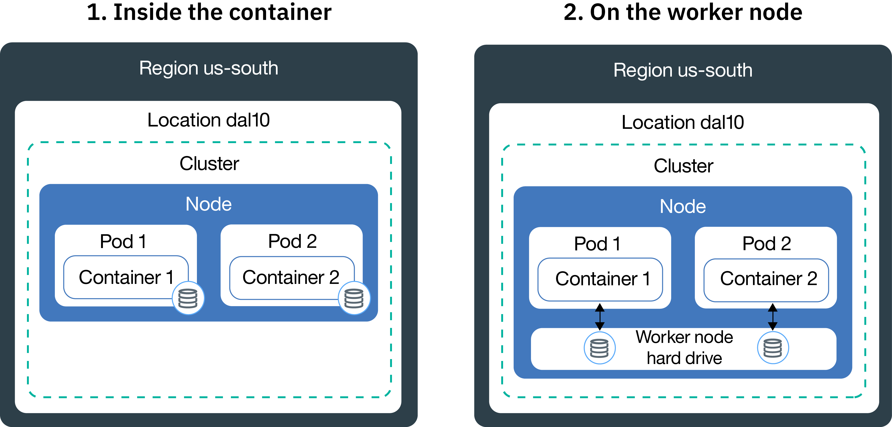

---

copyright:
  years: 2014, 2020
lastupdated: "2020-08-10"

keywords: kubernetes, iks

subcollection: containers

---

{:DomainName: data-hd-keyref="APPDomain"}
{:DomainName: data-hd-keyref="DomainName"}
{:android: data-hd-operatingsystem="android"}
{:apikey: data-credential-placeholder='apikey'}
{:app_key: data-hd-keyref="app_key"}
{:app_name: data-hd-keyref="app_name"}
{:app_secret: data-hd-keyref="app_secret"}
{:app_url: data-hd-keyref="app_url"}
{:authenticated-content: .authenticated-content}
{:beta: .beta}
{:c#: data-hd-programlang="c#"}
{:codeblock: .codeblock}
{:curl: .ph data-hd-programlang='curl'}
{:deprecated: .deprecated}
{:dotnet-standard: .ph data-hd-programlang='dotnet-standard'}
{:download: .download}
{:external: target="_blank" .external}
{:faq: data-hd-content-type='faq'}
{:fuzzybunny: .ph data-hd-programlang='fuzzybunny'}
{:generic: data-hd-operatingsystem="generic"}
{:generic: data-hd-programlang="generic"}
{:gif: data-image-type='gif'}
{:go: .ph data-hd-programlang='go'}
{:help: data-hd-content-type='help'}
{:hide-dashboard: .hide-dashboard}
{:hide-in-docs: .hide-in-docs}
{:important: .important}
{:ios: data-hd-operatingsystem="ios"}
{:java: #java .ph data-hd-programlang='java'}
{:java: .ph data-hd-programlang='java'}
{:java: data-hd-programlang="java"}
{:javascript: .ph data-hd-programlang='javascript'}
{:javascript: data-hd-programlang="javascript"}
{:new_window: target="_blank"}
{:note: .note}
{:objectc data-hd-programlang="objectc"}
{:org_name: data-hd-keyref="org_name"}
{:php: data-hd-programlang="php"}
{:pre: .pre}
{:preview: .preview}
{:python: .ph data-hd-programlang='python'}
{:python: data-hd-programlang="python"}
{:route: data-hd-keyref="route"}
{:row-headers: .row-headers}
{:ruby: .ph data-hd-programlang='ruby'}
{:ruby: data-hd-programlang="ruby"}
{:runtime: architecture="runtime"}
{:runtimeIcon: .runtimeIcon}
{:runtimeIconList: .runtimeIconList}
{:runtimeLink: .runtimeLink}
{:runtimeTitle: .runtimeTitle}
{:screen: .screen}
{:script: data-hd-video='script'}
{:service: architecture="service"}
{:service_instance_name: data-hd-keyref="service_instance_name"}
{:service_name: data-hd-keyref="service_name"}
{:shortdesc: .shortdesc}
{:space_name: data-hd-keyref="space_name"}
{:step: data-tutorial-type='step'}
{:subsection: outputclass="subsection"}
{:support: data-reuse='support'}
{:swift: #swift .ph data-hd-programlang='swift'}
{:swift: .ph data-hd-programlang='swift'}
{:swift: data-hd-programlang="swift"}
{:table: .aria-labeledby="caption"}
{:term: .term}
{:tip: .tip}
{:tooling-url: data-tooling-url-placeholder='tooling-url'}
{:troubleshoot: data-hd-content-type='troubleshoot'}
{:tsCauses: .tsCauses}
{:tsResolve: .tsResolve}
{:tsSymptoms: .tsSymptoms}
{:tutorial: data-hd-content-type='tutorial'}
{:unity: .ph data-hd-programlang='unity'}
{:url: data-credential-placeholder='url'}
{:user_ID: data-hd-keyref="user_ID"}
{:vb.net: .ph data-hd-programlang='vb.net'}
{:video: .video}

# Planning highly available persistent storage
{: #storage_planning}

## Choosing a storage solution
{: #choose_storage_solution}

Before you can decide what type of storage is the right solution for your {{site.data.keyword.containerlong}} clusters, you must understand the {{site.data.keyword.cloud_notm}} infrastructure provider, your app requirements, the type of data that you want to store, and how often you want to access this data.

1. Decide whether your data must be permanently stored, or if your data can be removed at any time.
   - **Persistent storage:** Your data must still be available, even if the container, the worker node, or the cluster is removed. Use persistent storage in the following scenarios:
       - Stateful apps
       - Core business data
       - Data that must be available due to legal requirements, such as a defined retention period
       - Auditing
       - Data that must be accessed and shared across app instances
   - **Non-persistent storage:** Your data can be removed when the container, the worker node, or the cluster is removed. Non-persistent storage is typically used for logging information, such as system logs or container logs, development testing, or when you want to access data from the host's file system. To find an overview of available non-persistent storage options, see [Comparison of non-persistent storage options](#non_persistent_overview).

2. If you must persist your data, analyze if your app requires a specific type of storage. When you use an existing app, the app might be designed to store data in one of the following ways:  
   - **In a file system:** The data can be stored as a file in a directory. For example, you could store this file on your local hard disk. Some apps require data to be stored in a specific file system, such as `nfs` or `ext4` to optimize the data store and achieve performance goals.
   - **In a database:** The data must be stored in a database that follows a specific schema. Some apps come with a database interface that you can use to store your data. For example, WordPress is optimized to store data in a MySQL database. In these cases, the type of storage is selected for you.

3. If your app does not have a limitation on the type of storage that you must use, determine the type of data that you want to store.
   - **Structured data:** Data that you can store in a relational database where you have a table with columns and rows. Data in tables can be connected by using keys and is usually easy to access due to the pre-defined data model. Examples are phone numbers, account numbers, Social Security numbers, or postal codes.
   - **Semi-structured data:** Data that does not fit into a relational database, but that comes with some organizational properties that you can use to read and analyze this data more easily. Examples are markup language files such as CSV, XML, or JSON.  
   - **Unstructured data:** Data that does not follow an organizational pattern and that is so complex that you cannot store it in a relational database with pre-defined data models. To access this data, you need advanced tools and software. Examples are e-mail messages, videos, photos, audio files, presentations, social media data, or web pages.

   If you have structured and unstructured data, try to store each data type separately in a storage solution that is designed for this data type. Using an appropriate storage solution for your data type eases up access to your data and gives you the benefits of performance, scalability, durability, and consistency.
   {: tip}

4. Analyze how you want to access your data. Storage solutions are usually designed and optimized to support read or write operations.  
   - **Read-only:** You do not want to write or change your data. Your data is read-only.
   - **Read and write:** You want to read, write, and change your data. For data that is read and written, it is important to understand if the operations are read-heavy, write-heavy, or balanced.

5. Determine the frequency that your data is accessed. Understanding the frequency of data access can help you understand the performance that you require for your storage. For example, data that is accessed frequently usually resides on fast storage.
   - **Hot data:** Data that is accessed frequently. Common use cases are web or mobile apps.
   - **Cool or warm data:** Data that is accessed infrequently, such as once a month or less. Common use cases are archives, short-term data retention, or disaster recovery.
   - **Cold data:** Data that is rarely accessed, if at all. Common use cases are archives, long-term backups, historical data.
   - **Frozen data:** Data that is not accessed and that you need to keep due to legal reasons.

   If you cannot predict the frequency or the frequency does not follow a strict pattern, determine whether your workloads are read-heavy, write-heavy, or balanced. Then, look at the storage option that fits your workload and investigate what storage tier gives you the flexibility that you need. For example, {{site.data.keyword.cos_full_notm}} provides a `flex` storage class that considers how frequent data is accessed in a month and takes into account this measurement to optimize your monthly billing.
   {: tip}

6. Investigate if your data must be shared across multiple app instances, zones, or regions.
   - **Access across pods:** When you use Kubernetes persistent volumes to access your storage, you can determine the number of pods that can mount the volume at the same time. Some storage solutions, such as block storage, can be accessed by one pod at a time only. With other storage solutions, you can share volume across multiple pods.
   - **Access across zones and regions:** You might require your data to be accessible across zones or regions. Some storage solutions, such as file and block storage, are data center-specific and cannot be shared across zones in a multizone cluster setup.

   If you want to make your data accessible across zones or regions, make sure to consult your legal department to verify that your data can be stored in multiple zones or a different country.
   {: note}

7. Understand other storage characteristics that impact your choice.
   - **Consistency:** The guarantee that a read operation returns the latest version of a file. Storage solutions can provide `strong consistency` when you are guaranteed to always receive the latest version of a file, or `eventual consistency` when the read operation might not return the latest version. You often find eventual consistency in geographically distributed systems where a write operation first must be replicated across all instances.
   - **Performance:** The time that it takes to complete a read or write operation.
   - **Durability:** The guarantee that a write operation that is committed to your storage survives permanently and does not get corrupted or lost, even if gigabytes or terabytes of data are written to your storage at the same time.
   - **Resiliency:** The ability to recover from an outage and continue operations, even if a hardware or software component failed. For example, your physical storage experiences a power outage, a network outage, or is destroyed during a natural disaster.
   - **Availability:** The ability to provide access to your data, even if a data center or a region is unavailable. Availability for your data is usually achieved by adding redundancy and setting up failover mechanisms.
   - **Scalability:** The ability to extend capacity and customize performance based on your needs.
   - **Encryption:** The masking of data to prevent visibility when data is accessed by an unauthorized user.

8. [Review available persistent storage solutions](#persistent_storage_overview) and pick the solution that best fits your app and data requirements.

 

## Comparison of non-persistent storage options
{: #non_persistent_overview}

You can use non-persistent storage options if your data is not required to be persistently stored or if you want to unit-test your app components.
{: shortdesc}

The following image shows available non-persistent data storage options in {{site.data.keyword.containerlong_notm}}. These options are available for free and standard clusters.

<table>
<thead>
<th style="text-align:left">Characteristics</th>
<th style="text-align:left">Inside the container</th>
<th style="text-align:left">On the worker node's primary or secondary disk</th>
</thead>
<tbody>
<tr>
<td style="text-align:left">Multizone capable</td>
<td style="text-align:left">No</td>
<td style="text-align:left">No</td>
</tr>
<tr>
<td style="text-align:left">Supported in VPC clusters</td>
<td style="text-align:left">Yes</td>
<td style="text-align:left">Yes</td>
</tr>
<tr>
<td style="text-align:left">Data types</td>
<td style="text-align:left">All</td>
<td style="text-align:left">All</td>
</tr>
<tr>
<td style="text-align:left">Capacity</td>
<td style="text-align:left">Limited to the worker node's available secondary disk. To limit the amount of secondary storage that is consumed by your pod, use resource requests and limits for [ephemeral storage ](https://kubernetes.io/docs/concepts/configuration/manage-resources-containers/#local-ephemeral-storage).</td>
<td style="text-align:left">Limited to the worker node's available space on the primary (`hostPath`) or secondary disk (`emptyDir`). To limit the amount of secondary storage that is consumed by your pod, use resource requests and limits for [ephemeral storage ](https://kubernetes.io/docs/concepts/configuration/manage-resources-containers/#local-ephemeral-storage).</td>
</tr>
<tr>
<td style="text-align:left">Data access pattern</td>
<td style="text-align:left">Read and write operations of any frequency</td>
<td style="text-align:left">Read and write operations of any frequency</td>
</tr>
<tr>
<td style="text-align:left">Access</td>
<td style="text-align:left">Via the container's local file system</td>
<td style="text-align:left"><ul style="margin:0px 0px 0px 20px; padding:0px"><li style="margin:0px; padding:0px">Via [Kubernetes <code>hostPath</code> volume ](https://kubernetes.io/docs/concepts/storage/volumes/#hostpath) for access to worker node primary storage. </li><li style="margin:0px; padding:0px">Via [Kubernetes <code>emptyDir</code> volume ](https://kubernetes.io/docs/concepts/storage/volumes/#emptydir) for access to worker node secondary storage.</li></ul></td>
</tr>
<tr>
<td style="text-align:left">Performance</td>
<td style="text-align:left">High</td>
<td style="text-align:left">High with lower latency when you use SSD</td>
</tr>
<tr>
<td style="text-align:left">Consistency</td>
<td style="text-align:left">Strong</td>
<td style="text-align:left">Strong</td>
</tr>
<tr>
<td style="text-align:left">Resiliency</td>
<td style="text-align:left">Low</td>
<td style="text-align:left">Low</td>
</tr>
<tr>
<td style="text-align:left">Availability</td>
<td style="text-align:left">Specific to the container</td>
<td style="text-align:left">Specific to the worker node</td>
</tr>
<tr>
<td style="text-align:left">Scalability</td>
<td style="text-align:left">Difficult to extend as limited to the worker node's secondary disk capacity</td>
<td style="text-align:left">Difficult to extend as limited to the worker node's primary and secondary disk capacity</td>
</tr>
<tr>
<td style="text-align:left">Durability</td>
<td style="text-align:left">Data is lost when the container crashes or is removed. </td>
<td style="text-align:left">Data in <code>hostPath</code> or <code>emptyDir</code> volumes is lost when: <ul><li>The worker node is deleted.</li><li>The worker node is reloaded or updated.</li><li>The cluster is deleted.</li><li>The {{site.data.keyword.cloud_notm}} account reaches a suspended state. </li></ul>

In addition, data in an <code>emptyDir</code> volume is removed when: <ul><li>The assigned pod is permanently deleted from the worker node.</li><li>The assigned pod is scheduled on another worker node.</li></ul>
</tr>
<tr>
<td style="text-align:left">Common use cases</td>
<td style="text-align:left"><ul style="margin:0px 0px 0px 20px; padding:0px"><li style="margin:0px; padding:0px">Local image cache</li><li style="margin:0px; padding:0px">Container logs</li></ul></td>
<td style="text-align:left"><ul style="margin:0px 0px 0px 20px; padding:0px"><li style="margin:0px; padding:0px">High-performance local cache</li><li style="margin:0px; padding:0px">Access files from the worker node file system</li><li style="margin:0px; padding:0px">Unit tests</li></ul></td>
</tr>
<tr>
<td style="text-align:left">Non-ideal use cases</td>
<td style="text-align:left"><ul style="margin:0px 0px 0px 20px; padding:0px"><li style="margin:0px; padding:0px">Persistent data storage</li><li style="margin:0px; padding:0px">Sharing data between containers</li></ul></td>
<td style="text-align:left"><ul style="margin:0px 0px 0px 20px; padding:0px"><li style="margin:0px; padding:0px">Persistent data storage</li></ul></td>
</tr>
</tbody>
</table>

 

## Comparison of persistent storage options for single zone clusters
{: #single_zone_persistent_storage}

If you have a single zone cluster, you can choose between the following options in {{site.data.keyword.containerlong_notm}} that provide fast access to your data. For higher availability, use a storage option that is designed for [geographically distributed data](#persistent_storage_overview) and, if possible for your requirements, create a multizone cluster.
{: shortdesc}

Persistent data storage options are available for standard clusters only.
{: note}

The following image shows the options that you have in {{site.data.keyword.containerlong_notm}} to permanently store your data in a single cluster.

<table>
<thead>
<th style="text-align:left">Characteristics</th>
<th style="text-align:left">Classic File Storage</th>
<th style="text-align:left">Classic Block Storage / VPC Block Storage</th>
</thead>
<tbody>
<tr>
<td style="text-align:left">Multizone-capable</td>
<td style="text-align:left">No, as specific to a data center. Data cannot be shared across zones, unless you implement your own data replication.</td>
<td style="text-align:left">No, as specific to a data center. Data cannot be shared across zones, unless you implement your own data replication.</td>
</tr>
<tr>
<td style="text-align:left">Supported in VPC clusters</td>
<td style="text-align:left">No</td>
<td style="text-align:left">Yes</td>
</tr>
<tr>
<td style="text-align:left">Ideal data types</td>
<td style="text-align:left">All</td>
<td style="text-align:left">All</td>
</tr>
<tr>
<td style="text-align:left">Data usage pattern</td>
<td style="text-align:left"><ul style="margin:0px 0px 0px 20px; padding:0px"><li style="margin:0px; padding:0px">Random read-write operations</li><li style="margin:0px; padding:0px">Sequential read-write operations</li></ul></td>
<td style="text-align:left"><ul style="margin:0px 0px 0px 20px; padding:0px"><li style="margin:0px; padding:0px">Random read-write operations</li><li style="margin:0px; padding:0px">Write-intensive workloads</li></ul></td>
</tr>
<tr>
<td style="text-align:left">Access</td>
<td style="text-align:left">Via file system on mounted volume</td>
<td style="text-align:left">Via file system on mounted volume</td>
</tr>
<tr>
<td style="text-align:left">Supported Kubernetes access writes</td>
<td style="text-align:left"><ul style="margin:0px 0px 0px 20px; padding:0px"><li style="margin:0px; padding:0px">ReadWriteMany (RWX)</li><li style="margin:0px; padding:0px"> ReadOnlyMany (ROX)</li><li style="margin:0px; padding:0px">ReadWriteOnce (RWO)</li></ul></td>
<td style="text-align:left"><ul style="margin:0px 0px 0px 20px; padding:0px"><li style="margin:0px; padding:0px">ReadWriteOnce (RWO)</li></ul></td>
</tr>
<tr>
<td style="text-align:left">Performance</td>
<td style="text-align:left">Predictable due to assigned IOPS and size. IOPS are shared between the pods that access the volume.</td>
<td style="text-align:left">Predictable due to assigned IOPS and size. IOPS are not shared between pods. </td>
</tr>
<tr>
<td style="text-align:left">Consistency</td>
<td style="text-align:left">Strong</td>
<td style="text-align:left">Strong</td>
</tr>
<tr>
<td style="text-align:left">Durability</td>
<td style="text-align:left">High</td>
<td style="text-align:left">High</td>
</tr>
<tr>
<td style="text-align:left">Resiliency</td>
<td style="text-align:left">Medium as specific to a data center. File storage server is clustered by IBM with redundant networking.</td>
<td style="text-align:left">Medium as specific to a data center. Block storage server is clustered by IBM with redundant networking.</td>
</tr>
<tr>
<td style="text-align:left">Availability</td>
<td style="text-align:left">Medium as specific to a data center.</td>
<td style="text-align:left">Medium as specific to a data center.</td>
</tr>
<tr>
<td style="text-align:left">Scalability</td>
<td style="text-align:left">Difficult to extend beyond the data center. You cannot change an existing storage tier. </td>
<td style="text-align:left">Difficult to extend beyond the data center. You cannot change an existing storage tier.</td>
</tr>
<tr>
<td style="text-align:left">Encryption</td>
<td style="text-align:left">At rest</td>
<td style="text-align:left"><strong>Classic Block Storage</strong>: Encryption at rest. <strong>VPC Block Storage</strong>: Encryption in transit with Key Protect.</td>
</tr>
<tr>
<td style="text-align:left">Backup and recovery</td>
<td style="text-align:left"><ul style="margin:0px 0px 0px 20px; padding:0px"><li style="margin:0px; padding:0px">Set up periodic snapshots</li><li style="margin:0px; padding:0px">Replicate snapshots</li><li style="margin:0px; padding:0px">Duplicate storage</li><li style="margin:0px; padding:0px">Back up data to {{site.data.keyword.cos_full_notm}}</li><li style="margin:0px; padding:0px">Copy data to and from pod and containers ([kubectl cp ](https://kubernetes.io/docs/reference/kubectl/overview/#cp) command)</li></ul></td>
   <td style="text-align:left"><strong>Classic Block Storage</strong>: <ul style="margin:0px 0px 0px 20px; padding:0px"><li style="margin:0px; padding:0px">Set up periodic snapshots</li><li style="margin:0px; padding:0px">Replicate snapshots</li><li style="margin:0px; padding:0px">Duplicate storage</li><li style="margin:0px; padding:0px">Back up data to {{site.data.keyword.cos_full_notm}}</li><li style="margin:0px; padding:0px">Copy data to and from pod and containers ([kubectl cp ](https://kubernetes.io/docs/reference/kubectl/overview/#cp) command)</li></ul>

<strong>VPC Block Storage</strong>: Kubernetes [`kubectl cp` ](https://kubernetes.io/docs/reference/kubectl/overview/#cp) command
</td>
</tr>
<tr>
<td style="text-align:left">Common use cases</td>
<td style="text-align:left"><ul style="margin:0px 0px 0px 20px; padding:0px"><li style="margin:0px; padding:0px">Mass or single file storage</li><li style="margin:0px; padding:0px">File sharing across a single zone cluster</li></ul></td>
<td style="text-align:left"><ul style="margin:0px 0px 0px 20px; padding:0px"><li style="margin:0px; padding:0px">Stateful sets</li><li style="margin:0px; padding:0px">Backing storage when you run your own database</li><li style="margin:0px; padding:0px">High-performance access for single pods</li></ul></td>
</tr>
<tr>
<td style="text-align:left">Non-ideal use cases</td>
<td style="text-align:left"><ul style="margin:0px 0px 0px 20px; padding:0px"><li style="margin:0px; padding:0px">Multizone clusters</li><li style="margin:0px; padding:0px">Geographically distributed data</li></ul></td>
<td style="text-align:left"><ul style="margin:0px 0px 0px 20px; padding:0px"><li style="margin:0px; padding:0px">Multizone clusters</li><li style="margin:0px; padding:0px">Geographically distributed data</li><li style="margin:0px; padding:0px">Sharing data across multiple app instances</li></ul></td>
</tr>
</tbody>
</table>

 

## Comparison of persistent storage options for multizone clusters
{: #persistent_storage_overview}

If you have a multizone cluster, choose between the following persistent storage options to access your data from worker nodes that are spread across zones.
{: shortdesc}

Persistent data storage options are available for standard clusters only.

Looking to connect your cluster to an on-prem database instead? See [Setting up VPN connectivity to your cluster](/docs/containers?topic=containers-vpn#vpn).
{: tip}

The following image shows the options that you have in {{site.data.keyword.containerlong_notm}} to permanently store your data in a multizone cluster and make your data highly available. You can use these options in a single zone cluster, but you might not get the high availability benefits that your app requires.

<table>
<thead>
<th style="text-align:left">Characteristics</th>
<th style="text-align:left">Object Storage</th>
<th style="text-align:left">SDS (Portworx)</th>
<th style="text-align:left">{{site.data.keyword.cloud_notm}} Databases</th>
</thead>
<tbody>
<tr>
<td style="text-align:left">Multizone-capable</td>
<td style="text-align:left">Yes</td>
<td style="text-align:left">Yes</td>
<td style="text-align:left">Yes</td>
</tr>
<tr>
<td style="text-align:left">Supported in VPC clusters</td>
<td style="text-align:left">Yes</td>
   <td style="text-align:left">Yes</td>
<td style="text-align:left">Yes</td>
</tr>
<tr>
<td style="text-align:left">Ideal data types</td>
<td style="text-align:left">Semi-structured and unstructured data</td>
<td style="text-align:left">All</td>
<td style="text-align:left">Depends on the DBaaS</td>
</tr>
<tr>
<td style="text-align:left">Data usage pattern</td>
<td style="text-align:left"><ul style="margin:0px 0px 0px 20px; padding:0px"><li style="margin:0px; padding:0px">Read-intensive workloads</li><li style="margin:0px; padding:0px">Few or no write operations</li></ul></td>
<td style="text-align:left"><ul style="margin:0px 0px 0px 20px; padding:0px"><li style="margin:0px; padding:0px">Write-intensive workloads</li><li style="margin:0px; padding:0px">Random read and write operation</li><li style="margin:0px; padding:0px">Sequential read and write operations</li></ul></td>
<td style="text-align:left"><ul style="margin:0px 0px 0px 20px; padding:0px"><li style="margin:0px; padding:0px">Read-write-intensive workloads</li></ul></td>
</tr>
<tr>
<td style="text-align:left">Access</td>
<td style="text-align:left">Via file system on mounted volume (plug-in) or via REST API from your app</td>
<td style="text-align:left">Via file system on mounted volume or NFS client access to the volume</td>
<td style="text-align:left">Via REST API from your app</td>
</tr>
<tr>
<td style="text-align:left">Supported Kubernetes access writes</td>
<td style="text-align:left"><ul style="margin:0px 0px 0px 20px; padding:0px"><li style="margin:0px; padding:0px">ReadWriteMany (RWX)</li><li style="margin:0px; padding:0px"> ReadOnlyMany (ROX)</li><li style="margin:0px; padding:0px">ReadWriteOnce (RWO)</li></ul></td>
   <td style="text-align:left">All</td>
<td style="text-align:left"><ul style="margin:0px 0px 0px 20px; padding:0px"><li style="margin:0px; padding:0px">N/A as accessed from the app directly</li></ul></td>
</tr>
<tr>
<td style="text-align:left">Performance</td>
<td style="text-align:left">High for read operations. Predictable due to assigned IOPS and size when you use non-SDS machines.</td>
<td style="text-align:left"><ul style="margin:0px 0px 0px 20px; padding:0px"><li style="margin:0px; padding:0px">Close to bare metal performance for sequential read and write operations when you use SDS machines. </li><li style="margin:0px; padding:0px">Provides [profiles ](https://docs.portworx.com/portworx-install-with-kubernetes/storage-operations/create-pvcs/dynamic-provisioning/#using-dynamic-provisioning) to run high-performance databases</li><li style="margin:0px; padding:0px">Possibility to create a storage layer with different performance profiles that your app can choose from.</li></ul> </td>
<td style="text-align:left">High if deployed to the same data center as your app.</td>
</tr>
<tr>
<td style="text-align:left">Consistency</td>
<td style="text-align:left">Eventual</td>
   <td style="text-align:left">Strong</td>
<td style="text-align:left">Depends on the DBaaS</td>
</tr>
<tr>
<td style="text-align:left">Durability</td>
<td style="text-align:left">Very high as data slices are dispersed across a cluster of storage
nodes. Every node stores only a part of the data. </td>
<td style="text-align:left">Very high as three copies of your data are maintained at all times.</td>
<td style="text-align:left">High</td>
</tr>
<tr>
<td style="text-align:left">Resiliency</td>
<td style="text-align:left">High as data slices are dispersed across three zones or regions. Medium, when set up in a single zone only.</td>
<td style="text-align:left">High when set up with replication across three zones. Medium, when you store data in a single zone only.</td>
<td style="text-align:left">Depends on the DBaaS and your setup. </td>
</tr>
<tr>
<td style="text-align:left">Availability</td>
<td style="text-align:left">High due to the distribution across zones or regions. </td>
<td style="text-align:left">High when you replicate data across three worker nodes in different zones.</td>
<td style="text-align:left">High if you set up multiple instances. </td>
</tr>
<tr>
<td style="text-align:left">Scalability</td>
<td style="text-align:left">Scales automatically</td>
<td style="text-align:left">Increase volume capacity by resizing the volume. To increase overall storage layer capacity, you must add worker nodes or remote block storage. Both scenarios require monitoring of capacity by the user. </td>
<td style="text-align:left">Scales automatically</td>
</tr>
<tr>
<td style="text-align:left">Encryption</td>
<td style="text-align:left">In transit and at rest</td>
<td style="text-align:left">Bring your own key to protect your data in transit and at rest with {{site.data.keyword.keymanagementservicelong_notm}}. </td>
<td style="text-align:left">At rest</td>
</tr>
<tr>
<td style="text-align:left">Backup and recovery</td>
<td style="text-align:left">Data is automatically replicated across multiple nodes for high durability. For more information, see the SLA in the [{{site.data.keyword.cos_full_notm}} service terms ](https://www-03.ibm.com/software/sla/sladb.nsf/sla/bm-7857-03).  You can also use the  Kubernetes [`kubectl cp` ](https://kubernetes.io/docs/reference/kubectl/overview/#cp) command to copy data to and from pod and containers.</td>
<td style="text-align:left">Use local or cloud snapshots to save the current state of a volume. For more information, see [Create and use local snapshots ](https://docs.portworx.com/portworx-install-with-kubernetes/storage-operations/create-snapshots/). You can also use the  Kubernetes [`kubectl cp` ](https://kubernetes.io/docs/reference/kubectl/overview/#cp) command to copy data to and from pod and containers.</td>
<td style="text-align:left">Depends on the DBaaS</td>
</tr>
<tr>
<td style="text-align:left">Common use cases</td>
<td style="text-align:left"><ul style="margin:0px 0px 0px 20px; padding:0px"><li style="margin:0px; padding:0px">Multizone clusters</li><li style="margin:0px; padding:0px">Geographically distributed data</li><li style="margin:0px; padding:0px">Static big data</li><li style="margin:0px; padding:0px">Static multimedia content</li><li style="margin:0px; padding:0px">Web apps</li><li style="margin:0px; padding:0px">Backups</li><li style="margin:0px; padding:0px">Archives</li></ul></td>
<td style="text-align:left"><ul style="margin:0px 0px 0px 20px; padding:0px"><li style="margin:0px; padding:0px">Stateful sets</li><li style="margin:0px; padding:0px">Geographically distributed data</li><li style="margin:0px; padding:0px">Common storage solution when you run apps across multiple cloud providers</li><li style="margin:0px; padding:0px">Backing storage when you run your own database</li><li style="margin:0px; padding:0px">High-performance access for single pods</li><li style="margin:0px; padding:0px">Shared storage access across multiple pods and worker nodes</li></ul></td>
<td style="text-align:left"><ul style="margin:0px 0px 0px 20px; padding:0px"><li style="margin:0px; padding:0px">Multizone clusters</li><li style="margin:0px; padding:0px">Relational and non-relational databases</li><li style="margin:0px; padding:0px">Geographically distributed data</li></ul></td>
</tr>
<tr>
<td style="text-align:left">Non-ideal use cases</td>
<td style="text-align:left"><ul style="margin:0px 0px 0px 20px; padding:0px"><li style="margin:0px; padding:0px">Write-intensive workloads</li><li style="margin:0px; padding:0px">Random write operations</li><li style="margin:0px; padding:0px">Incremental data updates</li><li style="margin:0px; padding:0px">Transaction databases</li></ul></td>
   <td style="text-align:left">N/A</td>
<td style="text-align:left"><ul style="margin:0px 0px 0px 20px; padding:0px"><li style="margin:0px; padding:0px">App that is designed to write to a file system</li></ul></td>
</tr>
</tbody>
</table>

