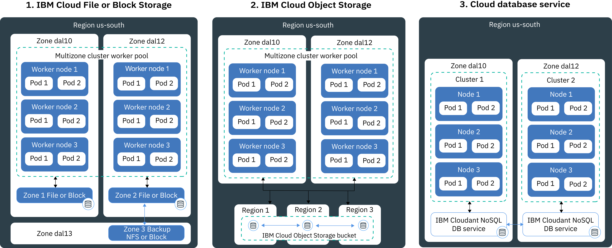

---

copyright:
  years: 2014, 2018
lastupdated: "2018-08-10"

---

{:new_window: target="_blank"}
{:shortdesc: .shortdesc}
{:screen: .screen}
{:pre: .pre}
{:table: .aria-labeledby="caption"}
{:codeblock: .codeblock}
{:tip: .tip}
{:download: .download}

# Planning highly available persistent storage
{: #storage_planning}

## Non-persistent data storage options
{: #non_persistent}

You can use non-persistent storage options if your data is not required to be persistently stored or if data does not need to be shared across app instances. Non-persistent storage options can also be used to unit-test your app components or try out new features.
{: shortdesc}

The following image shows available non-persistent data storage options in {{site.data.keyword.containerlong_notm}}. These options are available for free and standard clusters.

<table summary="The table shows non-persistent storage options. Rows are to be read from the left to right, with the number of the option in column one, the title of the option in column two, and a description in column three." style="width: 100%">
<caption>Non-persistent storage options</caption>
  <thead>
  <th>Option</th>
  <th>Description</th>
  </thead>
  <tbody>
    <tr>
      <td>1. Inside the container or pod</td>
      <td>Containers and pods are, by design, short-lived and can fail unexpectedly. However, you can write data to the local file system of the container to store data throughout the lifecycle of the container. Data inside a container cannot be shared with other containers or pods and is lost when the container crashes or is removed. For more information, see [Storing data in a container](https://docs.docker.com/storage/).</td>
    </tr>
  <tr>
    <td>2. On the worker node</td>
    <td>Every worker node is set up with primary and secondary storage that is determined by the machine type that you select for your worker node. The primary storage is used to store data from the operating system and can be accessed by using a [Kubernetes <code>hostPath</code> volume ](https://kubernetes.io/docs/concepts/storage/volumes/#hostpath). The secondary storage is used to store data from the `kubelet` and the container runtime engine. You can access the secondary storage by using a [Kubernetes <code>emptyDir</code> volume ](https://kubernetes.io/docs/concepts/storage/volumes/#emptydir). To limit the amount of secondary storage that you want to make available to your pod, you can use resource requests and limits for [ephemeral storage ](https://kubernetes.io/docs/concepts/configuration/manage-compute-resources-container/#local-ephemeral-storage).   While <code>hostPath</code> volumes are used to mount files from the worker node file system to your pod, <code>emptyDir</code> creates an empty directory that is assigned to a pod in your cluster. All containers in that pod can read from and write to that volume. Because the volume is assigned to one specific pod, data cannot be shared with other pods in a replica set.  
Data in <code>hostPath</code> or <code>emptyDir</code> volumes are removed when: <ul><li>The worker node is deleted.</li><li>The worker node is reloaded or updated.</li><li>The cluster is deleted.</li><li>The {{site.data.keyword.Bluemix_notm}} account reaches a suspended state. </li></ul>

In addition, data in an <code>emptyDir</code> volume is removed when: <ul><li>The assigned pod is permanently deleted from the worker node.</li><li>The assigned pod is scheduled on another worker node.</li></ul>

<strong>Note:</strong> If the container inside the pod crashes, the data in the volume is still available on the worker node.
</td>
    </tr>
    </tbody>
    </table>

## Persistent data storage options for high availability
{: #persistent}

The main challenge when you create highly available stateful apps is to persist data across multiple app instances in multiple zones, and to keep data in sync always. For highly available data, you want to make sure that you have a master database with multiple instances that are spread across multiple data centers or even multiple regions. This master database must continuously be replicated to keep a single source of truth. All instances in your cluster must read from and write to this master database. In case one instance of the master is down, other instances take over the workload so that you do not experience downtime for your apps.
{: shortdesc}

The following image shows the options that you have in {{site.data.keyword.containerlong_notm}} to make your data highly available in a standard cluster. The option that is right for you depends on the following factors:
  * **The type of app that you have:** For example, you might have an app that must store data on a file basis rather than inside a database.
  * **Legal requirements for where to store and route the data:** For example, you might be obligated to store and route data in the United States only and you cannot use a service that is located in Europe.
  * **Backup and restore options:** Every storage option comes with capabilities to back up and restore data. Check that available backup and restore options meet the requirements of your disaster recovery plan, such as the frequency of backups or the capabilities of storing data outside your primary data center.
  * **Global replication:** For high availability, you might want to set up multiple storage instances that are distributed and replicated across data centers worldwide.

 

<table summary="The table shows persistent storage options. Rows are to be read from the left to right, with the number of the option in column one, the title of the option in column two, and a description in column three." style="width: 100%">
<caption>Persistent storage options</caption>
  <thead>
  <th>Option</th>
  <th>Description</th>
  </thead>
  <tbody>
  <tr>
  <td>1. NFS or block storage</td>
  <td>With this option, you can persist app and container data within the same zone by using Kubernetes persistent volumes.   <strong>How can I provision file or block storage?</strong> To provision file storage and block storage in a cluster, you [use persistent volumes (PVs) and persistent volume claims (PVCs)](cs_storage_basics.html#pvc_pv). PVCs and PVs are Kubernetes concepts that abstract the API to provision the physical file or block storage device. You can create PVCs and PVs by using [dynamic](cs_storage_basics.html#dynamic_provisioning) or [static](cs_storage_basics.html#static_provisioning) provisioning.   <strong>Can I use file or block storage in a multizone cluster?</strong>  File and block storage devices are specific to a zone and cannot be shared across zones or regions. To use this type of storage in a cluster, you must have at least one worker node in the same zone as your storage.   If you [dynamically provision](cs_storage_basics.html#dynamic_provisioning) file and block storage in a cluster that spans multiple zones, the storage is provisioned in only 1 zone that is selected on a round-robin basis. To provision persistent storage in all zones of your multizone cluster, repeat the steps to provision dynamic storage for each zone. For example, if your cluster spans zones `dal10`, `dal12`, and `dal13`, the first time that you dynamically provision persistent storage might provision the storage in `dal10`. Create two more PVCs to cover `dal12` and `dal13`.   <strong>What if I want to share data across zones?</strong> If you want to share data across zones, use a cloud database service, such as [{{site.data.keyword.cloudant_short_notm}}](/docs/services/Cloudant/getting-started.html#getting-started-with-cloudant) or [{{site.data.keyword.cos_full_notm}}](/docs/services/cloud-object-storage/about-cos.html#about-ibm-cloud-object-storage). </td>
  </tr>
  <tr id="cloud-db-service">
    <td>2. Cloud database service</td>
    <td>With this option, you can persist data by using an {{site.data.keyword.Bluemix_notm}} database service, such as [IBM Cloudant NoSQL DB](/docs/services/Cloudant/getting-started.html#getting-started-with-cloudant).   <strong>Can I use a cloud database service for my multizone cluster?</strong> With a cloud database service, the data is stored outside the cluster in the specified service instance. The service instance is provisioned into one zone. However, every service instance comes with an external interface that you can use to access your data. When you use a database service for a multizone cluster, you can share data across clusters, zones, and regions. To make your service instance more available, you can choose to set up multiple instances across zones and replication between the instances for higher availability.   <strong>How can I add a cloud database service to my cluster?</strong> To use a service in your cluster, you must [bind the {{site.data.keyword.Bluemix_notm}} service](cs_integrations.html#adding_app) to a namespace in your cluster. When you bind the service to the cluster, a Kubernetes secret is created. The Kubernetes secret holds confidential information about the service, such as the URL to the service, your user name, and password. You can mount the secret as a secret volume to your pod and access the service by using the credentials in the secret. By mounting the secret volume to other pods, you can also share data between pods. When a container crashes or a pod is removed from a worker node, the data is not removed and can still be accessed by other pods that mount the secret volume.   Most {{site.data.keyword.Bluemix_notm}} database services provide disk space for a small amount of data at no cost, so you can test its features.
</td>
  </tr>
  <tr>
    <td>3. On-prem database</td>
    <td>If your data must be stored onsite for legal reasons, you can [set up a VPN connection](cs_vpn.html#vpn) to your on-prem database and use existing storage, backup, and replication mechanisms in your data center.</td>
  </tr>
  </tbody>
  </table>

{: caption="Table. Persistent data storage options for deployments in Kubernetes clusters" caption-side="top"}
