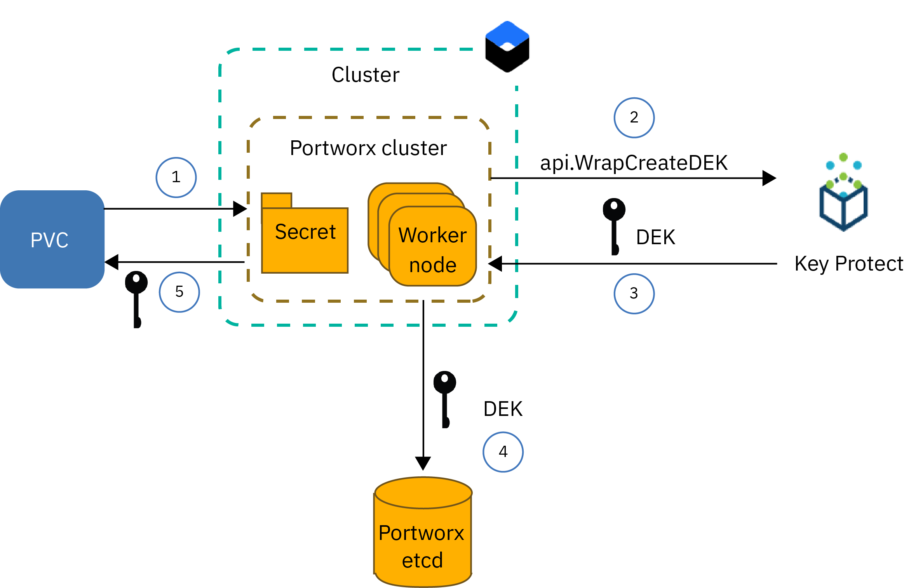
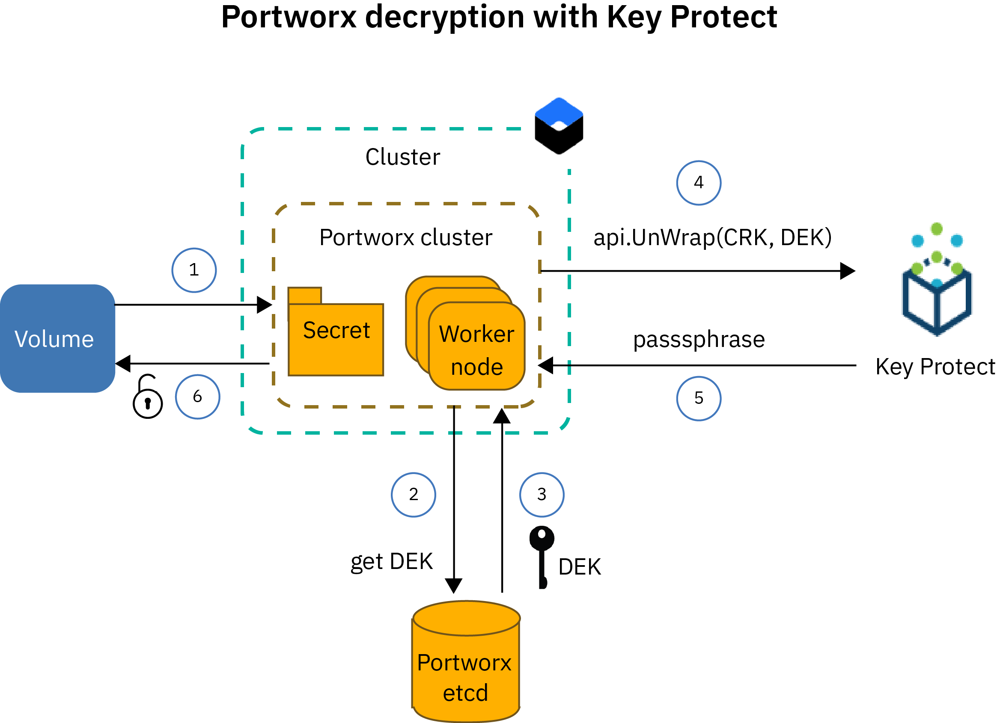

---

copyright:
  years: 2014, 2019
lastupdated: "2019-10-09"

keywords: openshift, roks, rhoks, rhos

subcollection: openshift

---

{:new_window: target="_blank"}
{:shortdesc: .shortdesc}
{:screen: .screen}
{:pre: .pre}
{:table: .aria-labeledby="caption"}
{:codeblock: .codeblock}
{:tip: .tip}
{:note: .note}
{:important: .important}
{:deprecated: .deprecated}
{:download: .download}
{:preview: .preview}

# Storing data on software-defined storage (SDS) with Portworx
{: #portworx}

[Portworx ](https://portworx.com/products/introduction/) is a highly available software-defined storage solution that you can use to manage local persistent storage for your containerized databases and other stateful apps, or to share data between pods across multiple zones.
{: shortdesc}


Portworx is supported only in classic {{site.data.keyword.containerlong_notm}} clusters, and is not available in VPC on Classic clusters.
{: important}


## About Portworx

Review frequently asked questions to learn more about Portworx and how Portworx provides highly available persistent storage management for your containerized apps. 
{: shortdesc}

**What is software-defined storage (SDS)?** </br>
An SDS solution abstracts storage devices of various types, sizes, or from different vendors that are attached to the worker nodes in your cluster. Worker nodes with available storage on hard disks are added as a node to a storage cluster. In this cluster, the physical storage is virtualized and presented as a virtual storage pool to the user. The storage cluster is managed by the SDS software. If data must be stored on the storage cluster, the SDS software decides where to store the data for highest availability. Your virtual storage comes with a common set of capabilities and services that you can leverage without caring about the actual underlying storage architecture.

**How does Portworx work?** </br>
Portworx aggregates available storage that is attached to your worker nodes and creates a unified persistent storage layer for containerized databases or other stateful apps that you want to run in the cluster. By using volume replication of each container-level volume across multiple worker nodes, Portworx ensures data persistence and data accessibility across zones.

Portworx also comes with additional features that you can use for your stateful apps, such as volume snapshots, volume encryption, isolation, and an integrated Storage Orchestrator for Kubernetes (Stork) to ensure optimal placement of volumes in the cluster. For more information, see the [Portworx documentation ](https://docs.portworx.com/).

**What worker node flavor in {{site.data.keyword.containerlong_notm}} is the right one for Portworx?** </br>
{{site.data.keyword.containerlong_notm}} provides bare metal worker node flavors that are optimized for [software-defined storage (SDS) usage](/docs/containers?topic=containers-planning_worker_nodes#sds). These flavors also come with one or more raw, unformatted, and unmounted local disks that you can use for your Portworx storage layer. Portworx offers best performance when you use SDS Ubuntu 18 worker node machines that come with 10 Gbps network speed.

**What if I want to run Portworx on non-SDS worker nodes?** </br>
You can install Portworx on non-SDS worker node flavors, but you might not get the performance benefits that your app requires. Non-SDS worker nodes can be virtual or bare metal. If you want to use virtual machines, use a worker node flavor of `b3c.16x64` or better. Virtual machines with a flavor of `b3c.4x16` or `u3c.2x4` do not provide the required resources for Portworx to work properly. Keep in mind that virtual machines come with 1000 Mbps that is not sufficient for ideal performance of Portworx. Bare metal machines come with sufficient compute resources and network speed for Portworx, but you must [add raw, unformatted, and unmounted block storage](#create_block_storage) before you can use these machines.

If your classic cluster has deprecated x1c or older Ubuntu 16 x2c worker node flavors, update your cluster to have [Ubuntu 18 x3c worker nodes](/docs/containers?topic=containers-update#machine_type).
{: tip}

**How can I make sure that my data is stored highly available?** </br>
You need at least three worker nodes in your Portworx cluster so that Portworx can replicate your data across nodes. By replicating your data across worker nodes, Portworx can ensure that your stateful app can be rescheduled to a different worker node in case of a failure without losing data. For even higher availability, use a [multizone cluster](/docs/containers?topic=containers-ha_clusters#multizone) and replicate your volumes across SDS worker nodes in 3 or more zones.

**What volume topology offers the best performance for my pods?** </br>
One of the biggest challenges when you run stateful apps in a cluster is to make sure that your container can be rescheduled onto another host if the container or the entire host fails. In Docker, when a container must be rescheduled onto a different host, the volume does not move to the new host. Portworx can be configured to run `hyper-converged` to ensure that your compute resources and the storage are always placed onto the same worker node. When your app must be rescheduled, Portworx moves your app to a worker node where one of your volume replicas resides to ensure local-disk access speed and best performance for your stateful app. Running `hyper-converged` offers the best performance for your pods, but requires storage to be available on all worker nodes in your cluster.

You can also choose to use only a subset of worker nodes for your Portworx storage layer. For example, you might have a worker pool with SDS worker nodes that come with local raw block storage, and another worker pool with virtual worker nodes that do not come with local storage. When you install Portworx, a Portworx pod is scheduled onto every worker node in your cluster as part of a daemon set. Because your SDS worker nodes have local storage, these worker nodes are included into the Portworx storage layer only. Your virtual worker nodes are not included as a storage node because of the missing local storage. However, when you deploy an app pod to your virtual worker node, this pod can still access data that is physically stored on an SDS worker node by using the Portworx daemon set pod. This setup is referred to as `storage-heavy` and offers slightly slower performance than the `hyper-converged` setup because the virtual worker node must talk to the SDS worker node over the private network to access the data.

**What do I need to provision Portworx?** </br>
{{site.data.keyword.containerlong_notm}} provides worker node flavors that are optimized for SDS usage and that come with one or more raw, unformatted, and unmounted local disks that you can use to store your data. Portworx offers best performance when you use [SDS worker node machines](/docs/containers?topic=containers-planning_worker_nodes#sds) that come with 10 Gbps network speed. However, you can install Portworx on non-SDS worker node flavors, but you might not get the performance benefits that your app requires. Make sure to review the [minimum hardware requirements ](https://docs.portworx.com/start-here-installation/) to install Portworx. 

**What limitations must I plan for?** </br>
Portworx is available for standard clusters that are set up with public network connectivity. If your cluster cannot access the public network, such as a private cluster behind a firewall or a cluster with only the private service endpoint that is  enabled, you cannot use Portworx in your cluster, unless you open up all egress network traffic on TCP port 443, or enable the public service endpoint.


All set? Let's start with [creating a cluster with an SDS worker pool of at least three worker nodes](/docs/containers?topic=containers-clusters#clusters_ui). If you want to include non-SDS worker nodes into your Portworx cluster, [add raw block storage](#create_block_storage) to each worker node. After your cluster is prepared, [install Portworx](#install_portworx) in your cluster and create your first hyper-converged storage cluster.  

## Creating raw, unformatted, and unmounted block storage for non-SDS worker nodes
{: #create_block_storage} 

Portworx runs best when you use worker node flavors that are optimized for [software-defined storage (SDS) usage](/docs/containers?topic=containers-planning_worker_nodes#sds). However, if you can't or don't want to use SDS worker nodes, you can choose to install Portworx on non-SDS worker node flavors. Keep in mind that non-SDS worker nodes are not optimized for Portworx and might not offer the performance benefits that your app requires.
{: shortdesc}

To include non-SDS worker nodes into your Portworx cluster, you must add raw, unformatted, and unmounted block storage devices to your worker nodes by using the {{site.data.keyword.cloud_notm}} Block Volume Attacher plug-in. Raw block storage cannot be provisioned by using Kubernetes persistent volume claims (PVCs) as the block storage device is automatically formatted by {{site.data.keyword.containerlong_notm}}. Portworx supports block storage only. Non-SDS worker nodes that mount file or object storage cannot be used for the Portworx data layer.

If you have SDS worker node flavors in your cluster and want to use these worker nodes only to create your Portworx storage layer, then you can skip this step entirely and continue with [Setting up your Portworx database](#portworx_database).
{: note}

1. [Install the {{site.data.keyword.cloud_notm}} Block Volume Attacher plug-in](/docs/containers?topic=containers-utilities#block_storage_attacher).
2. If you want to add block storage with the same configuration to all your worker nodes, [automatically add block storage](/docs/containers?topic=containers-utilities#automatic_block) with the {{site.data.keyword.cloud_notm}} Block Volume Attacher plug-in. To add block storage with a different configuration, add block storage to a subset of worker nodes only, or to have more control over the provisioning process, [manually add block storage](/docs/containers?topic=containers-utilities#manual_block).
3. [Attach the block storage](/docs/containers?topic=containers-utilities#attach_block) to your worker nodes.

## Setting up a Databases for etcd service instance for Portworx metadata
{: #portworx_database}

Set up a [Databases for etcd](/docs/services/databases-for-etcd?topic=databases-for-etcd-getting-started) service instance to create a key-value store for the Portworx cluster metadata.
{: shortdesc}

The Portworx key-value store serves as the single source of truth for your Portworx cluster. If the key-value store is not available, then you cannot work with your Portworx cluster to access or store your data. Existing data is not changed or removed when the Portworx database is unavailable.

Databases for etcd is a managed etcd service that securely stores and replicates your data across three storage instances to provide high availability and resiliency for your data. For more information, see the [Databases for etcd getting started tutorial](/docs/services/databases-for-etcd?topic=databases-for-etcd-getting-started#getting-started).

1. Make sure that you have the [`Administrator` platform access role in {{site.data.keyword.cloud_notm}} Identity and Access Management (IAM)](/docs/iam?topic=iam-iammanidaccser#iammanidaccser) for the Databases for etcd service.  

2. Provision your Databases for etcd service instance.
   1. Open the [Databases for etcd catalog page](https://cloud.ibm.com/catalog/services/databases-for-etcd)
   2. Enter a name for your service instance, such as `px-etcd`.
   3. Select the region where you want to deploy your service instance. For optimal performance, choose the region that your cluster is in.
   4. Select the same resource group that your cluster is in.
   5. Use the following settings for the initial memory and disk allocation: 
      * **Initial memory allocation:** 8GB/member (24GB total)
      * **Initial disk allocation:** 128GB/member (384GB total)
      * **Initial CPU allocation:** 3 dedicated cores/member (9 cores total)
      * **Database version:** 3.3
   6. Choose if you want to use the default {{site.data.keyword.keymanagementserviceshort}} service instance or your own.
   5. Review the pricing plan.
   6. Click **Create** to start setting up your service instance. The setup might take a few minutes to complete.
3. Create service credentials for your Databases for etcd service instance. 
   1. In the navigation on the service details page, click **Service Credentials**.
   2. Click **New credentials**.
   3. Enter a name for your service credentials and click **Add**.

4. {: #databases_credentials}Retrieve your service credentials and certificate.
   1. From the navigation on the service details page, select **Service credentials**. 
   2. Find the credentials that you want to use, and from the **Actions** column in the service credentials table, click **View credentials**.
   3. Find the `grp.authentication` section of your service credentials and note the **`username`** and **`password`**. 

      Example output for user name and password:
      ```
      "grpc": {
      "authentication": {
        "method": "direct",
        "password": "123a4567ab89cde09876vaa543a2bc2a10a123456bcd123456f0a7895aab1de",
        "username": "ibm_cloud_1abd2e3f_g12h_3bc4_1234_5a6bc7890ab"
      }
      ```
      {: screen}
   3. Find the `composed` section of your service credentials and note the etcd **`--endpoints`**. You need this information when you install Portworx. 

      Example output for `--endpoints`:
      ```
      --endpoints=https://1ab234c5-12a1-1234-a123-123abc45cde1.123456ab78cd9ab1234a456740ab123c.databases.appdomain.cloud:32059
      ```
      {: screen}

   4. Find the `certificate` section of your service credentials and note the **`certificate_base64`**.

      Example output for `certificate`:
      ```
      "certificate": {
        "certificate_base64": "AB0cAB1CDEaABcCEFABCDEF1ACB3ABCD1ab2AB0cAB1CDEaABcCEFABCDEF1ACB3ABCD1ab2AB0cAB1CDEaABcCEFABCDEF1ACB3ABCD1ab2..."
      ```
      {: screen}
      
5. Encode your user name and password to base64. 
   ```
   echo -n "<username_or_password>" | base64
   ```
   {: pre}

6. Create a Kubernetes secret for your certificate.
   1. Create a configuration file for your secret.
      ```
      apiVersion: v1
      kind: Secret
      metadata:
        name: px-etcd-certs
        namespace: kube-system
      type: Opaque
      data:
        ca.pem: <certificate_base64>
        username: <username_base64>
        password: <password_base64>
      ```
      {: codeblock}

   2. Create the secret in your cluster.
      ```
      kubectl apply -f secret.yaml
      ```
      {: pre}

6. Choose if you want to [set up encryption for your volumes with {{site.data.keyword.keymanagementservicelong_notm}}](#encrypt_volumes). If you don't want to set up {{site.data.keyword.keymanagementservicelong_notm}} encryption for your volumes, continue with [installing Portworx in your cluster](#install_portworx). 

## Setting up volume encryption with {{site.data.keyword.keymanagementservicelong_notm}}
{: #encrypt_volumes}

To protect your data in a Portworx volume, you can encrypt your cluster's volumes with {{site.data.keyword.keymanagementservicelong_notm}}.
{: shortdesc}

{{site.data.keyword.keymanagementservicelong_notm}} helps you to provision encrypted keys that are secured by FIPS 140-2 Level 2 certified cloud-based hardware security modules (HSMs). You can use these keys to securely protect your data from unauthorized users. You can choose between using one encryption key to encrypt all your volumes in a cluster or using one encryption key for each volume. Portworx uses this key to encrypt data at rest and during transit when data is sent to a different worker node. For more information, see [Volume encryption ](https://docs.portworx.com/portworx-install-with-kubernetes/storage-operations/create-pvcs/create-encrypted-pvcs/#volume-encryption). For higher security, set up per-volume encryption.

If you don't want to use {{site.data.keyword.keymanagementservicelong_notm}} root keys to encrypt your volumes, you can select **Kubernetes Secret** as your Portworx secret store type during the Portworx installation. This setting gives you the option to store your own custom encryption key in a Kubernetes secret after you installed Portworx. For more information, see the [Portworx documentation ](https://docs.portworx.com/key-management/kubernetes-secrets/#configuring-kubernetes-secrets-with-portworx). 
{: tip}

Review the following information:
- Overview of the [Portworx volume encryption workflow](#px_encryption) with {{site.data.keyword.keymanagementservicelong_notm}} for per-volume encryption
- Overview of the [Portworx volume decryption workflow](#decryption) with {{site.data.keyword.keymanagementservicelong_notm}} for per-volume encryption
- [Setting up per-volume encryption](#setup_encryption) for your Portworx volumes.

### Portworx per-volume encryption workflow
{: #px_encryption}

The following image illustrates the encryption workflow in Portworx with {{site.data.keyword.keymanagementservicelong_notm}} when you set up per-volume encryption.
{: shortdesc}



1. The user creates a PVC with a Portworx storage class and requests the storage to be encrypted.
2. Portworx invokes the {{site.data.keyword.keymanagementservicelong_notm}} API `WrapCreateDEK` to create a passphrase by using the customer root key (CRK) that is stored in the Portworx secret.
3. The {{site.data.keyword.keymanagementservicelong_notm}} service instance generates a 256-bit passphrase and wraps the passphrase in the DEK. The DEK is returned to the Portworx cluster.
4. The Portworx cluster uses the passphrase to encrypt the volume.
5. The Portworx cluster stores the DEK in plain text in the Portworx etcd database, associates the volume ID with the DEK, and removes the passphrase from its memory.

### Portworx per-volume decryption workflow
{: #decryption}

The following image illustrates the decryption workflow in Portworx with {{site.data.keyword.keymanagementservicelong_notm}} when you set up per-volume encryption.



1. Kubernetes sends a request to decrypt an encrypted volume.
2. Portworx requests the DEK for the volume from the Portworx etcd database.
3. The Portworx etcd looks up the DEK and returns the DEK to the Portworx cluster.
4. The Portworx cluster calls the {{site.data.keyword.keymanagementservicelong_notm}} API `UnWrapDEK` by providing the DEK and the root key (CRK) that is stored in the Portworx secret.
5. {{site.data.keyword.keymanagementservicelong_notm}} unwraps the DEK to extract the passphrase and returns the passphrase to the Portworx cluster.
6. The Portworx cluster uses the passphrase to decrypt the volume. After the volume is decrypted, the passphrase is removed from the Portworx cluster.  

### Enabling per-volume encryption for your Portworx volumes
{: #setup_encryption}

Follow these steps to set up encryption for your Portworx volumes with {{site.data.keyword.keymanagementservicelong_notm}}.
{: shortdesc}

1. Make sure that you are [assigned the `Editor` platform access role and the `Writer` service access role](/docs/services/key-protect?topic=key-protect-manage-access#manage-access) in {{site.data.keyword.cloud_notm}} Identity and Access Management for {{site.data.keyword.keymanagementservicelong_notm}}.

2. Create an {{site.data.keyword.keymanagementservicelong_notm}} service instance.
   1. Open the [{{site.data.keyword.keymanagementservicelong_notm}} catalog page](https://cloud.ibm.com/catalog/services/key-protect).
   2. In the **Service name** field, enter a name for your service instance.
   3. Select the region where you want to deploy your service instance. For optimal performance, choose the region that your cluster is in.
   4. Select the resource group that your cluster is in.
   5. Review the pricing plan.
   6. Click **Create** to create your service instance. When the creation is finished, the service details page opens.

3. Create an {{site.data.keyword.keymanagementservicelong_notm}} root key.
   1. From the service details page, select **Manage**.
   2. Click **Add key**.
   3. Enter the **Name** of your key and select **Root key** from the **Key type** drop-down list.
   4. Click **Create key**.
   5. Note the ID of the root key that you created.

4. Retrieve the **GUID** of your service instance.
   ```
   ibmcloud resource service-instance <service_instance_name_or_ID>
   ```
   {: pre}

   Example output:
   ```
   Retrieving service instance portworx in resource group default under account IBM as nspies@us.ibm.com...
   OK

   Name:                  portworx   
   ID:                    crn:v1:bluemix:public:kms:us-south:a/1ab123ab3c456789cde1f1234ab1cd123:a1a2b345-1d12-12ab-a12a-1abc2d3e1234::   
   GUID:                  a1a2b345-1d12-12ab-a12a-1abc2d3e1234  
   Location:              us-south   
   Service Name:          kms   
   Service Plan Name:     tiered-pricing   
   Resource Group Name:   default   
   State:                 active   
   Type:                  service_instance   
   Sub Type:                 
   Tags:                     
   Created at:            2018-10-30T20:24:54Z   
   Updated at:            2018-10-30T20:24:54Z  
   ```
   {: screen}

5. [Create a service ID for your account](/docs/iam?topic=iam-serviceids#serviceids).  

6. [Assign your service ID permissions](/docs/iam?topic=iam-serviceidpolicy#serviceidpolicy) to your {{site.data.keyword.keymanagementservicelong_notm}} service instance.

7. [Create an API key for your service ID](/docs/iam?topic=iam-serviceidapikeys#serviceidapikeys). This API key is used by Portworx to access the {{site.data.keyword.keymanagementservicelong_notm}} API.

8. [Retrieve the {{site.data.keyword.keymanagementservicelong_notm}} API endpoint](/docs/services/key-protect?topic=key-protect-regions#regions) for the region where you created your service instance. Make sure that you note your API endpoint in the format `https://<api_endpoint>`.

9. Encode the {{site.data.keyword.keymanagementservicelong_notm}} GUID, API key, root key, and {{site.data.keyword.keymanagementservicelong_notm}} API endpoint to base64 and note all the base64 encoded values. Repeat this command for each parameter to retrieve the base64 encoded value.
   ```
   echo -n "<value>" | base64
   ```
   {: pre}

10. Create a namespace in your cluster that is called `portworx`. 
    ```
    kubectl create ns portworx
    ```
    {: pre}

11. Create a Kubernetes secret that is named `px-ibm` in the `portworx` namespace of your cluster to store your {{site.data.keyword.keymanagementservicelong_notm}} information.
    1. Create a configuration file for your Kubernetes secret with the following content.
       ```
       apiVersion: v1
       kind: Secret
       metadata:
         name: px-ibm
         namespace: portworx
       type: Opaque
       data:
         IBM_SERVICE_API_KEY: <base64_apikey>
         IBM_INSTANCE_ID: <base64_guid>
         IBM_CUSTOMER_ROOT_KEY: <base64_rootkey>
	     IBM_BASE_URL: <base64_kp_api_endpoint>
       ```
       {: codeblock}
 
       <table>
       <caption>Understanding the YAML file components</caption>
        <thead>
       <th colspan=2> Understanding the YAML file components</th>
       </thead>
       <tbody>
       <tr>
       <td><code>metadata.name</code></td>
       <td>Enter <code>px-ibm</code> as the name for your Kubernetes secret. If you use a different name, Portworx does not recognize the secret during installation. </td>
       </tr>
       <tr>
       <td><code>data.IBM_SERVICE_API_KEY</code></td>
       <td>Enter the base64 encoded {{site.data.keyword.keymanagementservicelong_notm}} API key that you retrieved earlier.  </td>
       </tr>
       <tr>
       <td><code>data.IBM_INSTANCE_ID</code></td>
       <td>Enter the base64 encoded {{site.data.keyword.keymanagementservicelong_notm}} GUID that you retrieved earlier. </td>
       </tr>
       <tr>
       <td><code>data.IBM_CUSTOMER_ROOT_KEY</code></td>
       <td>Enter the base64 encoded {{site.data.keyword.keymanagementservicelong_notm}} root key that you retrieved earlier. </td>
       </tr>
       <tr>
       <td><code>data.IBM_BASE_URL</code></td>
       <td>Enter the base64 encoded API endpoint of your {{site.data.keyword.keymanagementservicelong_notm}} service instance. </td>
       </tr>
       </tbody>
       </table>

    2. Create the secret in the `portworx` namespace of your cluster.
       ```
       kubectl apply -f secret.yaml
       ```
       {: pre}

    3. Verify that the secret is created successfully.
       ```
       kubectl get secrets -n portworx
       ```
       {: pre}

12. If you set up encryption before your installed Portworx, you can now [install Portworx in your cluster](#add_portworx_storage). To add encryption to your cluster after you installed Portworx, update the Portworx daemon set to add `"-secret_type"` and `"ibm-kp"` as additional arguments to the Portworx container definition.
    1. Update the Portworx daemon set.
       ```
       kubectl edit daemonset portworx -n kube-system
       ```
       {: pre}

       Example updated daemon set:
       ```
       containers:
        - args:
        - -c
        - testclusterid
        - -s
        - /dev/sdb
        - -x
        - kubernetes
        - -secret_type
        - ibm-kp
        name: portworx
       ```
       {: codeblock}

       After you edit the daemon set, the Portworx pods are restarted and automatically update the `config.json` file on the worker node to reflect that change.

    2. List the Portworx pods in your `kube-system` namespace.
       ```
       kubectl get pods -n kube-system | grep portworx
       ```
       {: pre}

    3. Log in to one of your Portworx pods.
       ```
       kubectl exec -it <pod_name> -it -n kube-system
       ```
       {: pre}

    4. Navigate in to the `pwx` directory.
       ```
       cd etc/pwx
       ```
       {: pre}

    5. Review the `config.json` file to verify that `"secret_type": "ibm-kp"` is added to the **secret** section of your CLI output.
       ```
       cat config.json
       ```
       {: pre}

       Example output:
       ```
       {
       "alertingurl": "",
       "clusterid": "px-kp-test",
       "dataiface": "",
       "kvdb": [
          "etcd:https://portal-ssl748-34.bmix-dal-yp-12a2312v5-123a-44ac-b8f7-5d8ce1d123456.123456789.composedb.com:56963",
          "etcd:https://portal-ssl735-35.bmix-dal-yp-12a2312v5-123a-44ac-b8f7-5d8ce1d123456.12345678.composedb.com:56963"
       ],
       "mgtiface": "",
       "password": "ABCDEFGHIJK",
       "scheduler": "kubernetes",
       "secret": {
         "cluster_secret_key": "",
         "secret_type": "ibm-kp"
       },
       "storage": {
         "devices": [
          "/dev/sdc1"
         ],
         "journal_dev": "",
         "max_storage_nodes_per_zone": 0,
         "system_metadata_dev": ""
       },
       "username": "root",
       "version": "1.0"
       }
       ```
       {: screen}

    6. Exit the pod.

Check out how to [encrypt the secrets in your cluster](/docs/containers?topic=containers-encryption#keyprotect), including the secret where you stored your {{site.data.keyword.keymanagementserviceshort}} CRK for your Portworx storage cluster.
{: tip}


## Installing Portworx in your cluster
{: #install_portworx}

Provision a Portworx service instance from the {{site.data.keyword.cloud_notm}} catalog. After you create the service instance, the latest Portworx enterprise edition (`px-enterprise`) is installed on your cluster by using Helm. In addition, [Stork ](https://docs.portworx.com/portworx-install-with-kubernetes/storage-operations/stork/) is also installed on your {{site.data.keyword.containerlong_notm}} cluster. Stork is the Portworx storage scheduler. With Stork, you can co-locate pods with their data and create and restore snapshots of Portworx volumes.
{: shortdesc}

Looking for instructions about how to update or remove Portworx? See [Updating Portworx](#update_portworx) and [Removing Portworx](#remove_portworx).
{: tip}

Before you begin:
- Make sure that you have the right [permissions](/docs/containers?topic=containers-clusters#cluster_prepare) to create a an {{site.data.keyword.containerlong_notm}} cluster. 
- [Create or use an existing cluster](/docs/containers?topic=containers-clusters#clusters_ui).
- If you want to use non-SDS worker nodes for your Portworx storage layer, [add an unformatted block storage device to your non-SDS worker node](#create_block_storage).
- Create a [Databases for etcd service instance](#portworx_database) to store the Portworx configuration and metadata.
- Decide whether you want to encrypt your Portworx volumes with {{site.data.keyword.keymanagementservicelong_notm}}. To encrypt your volumes, you must [set up an {{site.data.keyword.keymanagementservicelong_notm}} service instance and store your service information in a Kubernetes secret](#encrypt_volumes).
- Make sure that you [copied the image pull secrets from the `default` to the `kube-system` namespace](/docs/containers?topic=containers-images#copy_imagePullSecret) so that you can pull images from {{site.data.keyword.registryshort}}. Make sure that you [add the image pull secrets to the Kubernetes service account](/docs/containers?topic=containers-images#store_imagePullSecret) of the `kube-system` namespace. 
- [Log in to your account. If applicable, target the appropriate resource group. Set the context for your cluster.](/docs/containers?topic=containers-cs_cli_install#cs_cli_configure)

To install Portworx:

1.  [Follow the instructions](/docs/containers?topic=containers-helm#public_helm_install) to install the Helm client version 2.14.3 or higher on your local machine, and install the Helm server (tiller) with a service account in your cluster.

2.  Verify that tiller is installed with a service account.

    ```
    kubectl get serviceaccount -n kube-system tiller
    ```
    {: pre}

    Example output:

    ```
    NAME                                 SECRETS   AGE
    tiller                               1         2m
    ```
    {: screen}

3. [Retrieve the etcd endpoint, and the name of the Kubernetes secret](#databases_credentials) that you created for your Databases for etcd service instance.
4. Open the Portworx service from the [{{site.data.keyword.cloud_notm}} catalog ](https://cloud.ibm.com/catalog/services/portworx-enterprise) and complete the fields as follows: 
   1. Select the region where your {{site.data.keyword.containerlong_notm}} cluster is located. 
   2. Review the Portworx pricing information. 
   3. Enter a name for your Portworx service instance. 
   4. Select the resource group that your cluster is in. 
   5. Enter the name of the cluster where you want to install Portworx as a tag. After you create the Portworx service instance, you cannot see the cluster that you installed Portworx into. To find the cluster more easily later, make sure that you enter the cluster name and any additional information as tags. 
   6. Enter an {{site.data.keyword.cloud_notm}} API key to retrieve the list of clusters that you have access to. If you don't have an API key, see [Managing user API keys](/docs/iam?topic=iam-userapikey). After you enter the API key, the **Kubernetes or OpenShift cluster name** field appears at the bottom of the page. 
   7. Enter a unique name for the Portworx cluster that is created within your {{site.data.keyword.containerlong_notm}} cluster. 
   8. In the **Etcd API endpoints** field, enter the API endpoint of your Databases for etcd service instance that you retrieved earlier. Make sure to enter endpoint in the format `"etcd:<etcd_endpoint1>;etcd:<etcd_endpoint2>"`. If you have more than one endpoint, include all endpoints and separate them with a semicolon (`;`).
   9. In the **Etcd secret name** field, enter the name of the Kubernetes secret that you created in your cluster to store the Databases for etcd service credentials. 
   10. From the **Kubernetes or OpenShift cluster name** drop down list, select the cluster where you want to install Portworx. If your cluster is not listed, make sure that you selected the correct {{site.data.keyword.cloud_notm}} region. If the region is correct, verify that you have the correct [permissions](/docs/containers?topic=containers-clusters#cluster_prepare) to view and work with your cluster. 
   11. Optional: From the **Portworx secret store type** drop down list, choose the secret store type that you want to use to store the volume encryption key. 
       - **Kubernetes Secret**: Choose this option if you want to store your own custom key to encrypt your volumes in a Kubernetes Secret in your cluster. The secret must not be present before you install Portworx. You can create the secret after you install Portworx. For more information, see the [Portworx documentation ](https://docs.portworx.com/key-management/kubernetes-secrets/#configuring-kubernetes-secrets-with-portworx). 
       - **{{site.data.keyword.keymanagementservicelong_notm}}**: Choose this option if you want to use root keys in {{site.data.keyword.keymanagementservicelong_notm}} to encrypt your volumes. Make sure that you follow the [instructions](#setup_encryption) to create your {{site.data.keyword.keymanagementservicelong_notm}} service instance, and to store the credentials for how to access your service instance in a Kubernetes secret in the `portworx` namespace before you install Portworx.        
5. Click **Create** to start the Portworx installation in your cluster. This process might take a few minutes to complete. The service details page opens with instructions for how to verify your Portworx installation, create a persistent volume claim (PVC), and mount the PVC to an app. 
6. From the [{{site.data.keyword.cloud_notm}} resource list](https://cloud.ibm.com/resources), find the Portworx service that you created. 
7. Review the **Status** column to see if the installation succeeds or fails. The status might take a few minutes to update. 
8. If the **Status** changes to `Provision failure`, follow the [instructions](/docs/containers?topic=containers-cs_troubleshoot_storage#debug-portworx) to start troubleshooting why your installation failed. 
9. If the **Status** changes to `Provisioned`, verify that your Portworx installation completed successfully and that all your local disks were recognized and added to the Portworx storage layer. 
   1. List the Portworx pods in the `kube-system` namespace. The installation is successful when you see one or more `portworx`, `stork`, and `stork-scheduler` pods. The number of pods equals the number of worker nodes that are included in your Portworx cluster. All pods must be in a `Running` state.
      ```
      kubectl get pods -n kube-system | grep 'portworx\|stork'
      ```
      {: pre}
   
      Example output:
      ```
      portworx-594rw                          1/1       Running     0          20h
      portworx-rn6wk                          1/1       Running     0          20h
      portworx-rx9vf                          1/1       Running     0          20h
      stork-6b99cf5579-5q6x4                  1/1       Running     0          20h
      stork-6b99cf5579-slqlr                  1/1       Running     0          20h
      stork-6b99cf5579-vz9j4                  1/1       Running     0          20h
      stork-scheduler-7dd8799cc-bl75b         1/1       Running     0          20h
      stork-scheduler-7dd8799cc-j4rc9         1/1       Running     0          20h
      stork-scheduler-7dd8799cc-knjwt         1/1       Running     0          20h
      ```
      {: screen}
   
   2. Log in to one of your `portworx` pods and list the status of your Portworx cluster.
      ```
      kubectl exec <portworx_pod> -it -n kube-system -- /opt/pwx/bin/pxctl status
      ```
      {: pre}
   
      Example output:
      ```
      Status: PX is operational
      License: Trial (expires in 30 days)
      Node ID: 10.176.48.67
      IP: 10.176.48.67
 	   Local Storage Pool: 1 pool
	   POOL	IO_PRIORITY	RAID_LEVEL	USABLE	USED	STATUS	ZONE	REGION
      	0	LOW		raid0		20 GiB	3.0 GiB	Online	dal10	us-south
       Local Storage Devices: 1 device
       Device	Path						Media Type		Size		Last-Scan
     	   0:1	/dev/mapper/3600a09803830445455244c4a38754c66	STORAGE_MEDIUM_MAGNETIC	20 GiB		17 Sep 18 20:36 UTC
      	   total							-			20 GiB
       Cluster Summary
	   Cluster ID: mycluster
           Cluster UUID: a0d287ba-be82-4aac-b81c-7e22ac49faf5
	   Scheduler: kubernetes
	   Nodes: 2 node(s) with storage (2 online), 1 node(s) without storage (1 online)
	      IP		ID		StorageNode	Used	Capacity	Status	StorageStatus	Version		Kernel			OS
	      10.184.58.11	10.184.58.11	Yes		3.0 GiB	20 GiB		Online	Up		1.5.0.0-bc1c580	4.4.0-133-generic	Ubuntu 16.04.5 LTS
	      10.176.48.67	10.176.48.67	Yes		3.0 GiB	20 GiB		Online	Up (This node)	1.5.0.0-bc1c580	4.4.0-133-generic	Ubuntu 16.04.5 LTS
	      10.176.48.83	10.176.48.83	No		0 B	0 B		Online	No Storage	1.5.0.0-bc1c580	4.4.0-133-generic	Ubuntu 16.04.5 LTS
       Global Storage Pool
	      Total Used    	:  6.0 GiB
	      Total Capacity	:  40 GiB
      ```
      {: screen}

   3. Verify that all worker nodes that you wanted to include in your Portworx storage layer are included by reviewing the **StorageNode** column in the **Cluster Summary** section of your CLI output. Worker nodes that are included in the storage layer are displayed with `Yes` in the **StorageNode** column.

      Because Portworx runs as a daemon set in your cluster, new worker nodes that you add to your cluster are automatically inspected for raw block storage and added to the Portworx data layer.
      {: note}

   4. Verify that each storage node is listed with the correct amount of raw block storage by reviewing the **Capacity** column in the **Cluster Summary** section of your CLI output.

   5. Review the Portworx I/O classification that was assigned to the disks that are part of the Portworx cluster. During the setup of your Portworx cluster, every disk is inspected to determine the performance profile of the device. The profile classification depends on how fast the network is that your worker node is connected to and the type of storage device that you have. Disks of SDS worker nodes are classified as `high`. If you manually attach disks to a virtual worker node, then these disks are classified as `low` due to the lower network speed that comes with virtual worker nodes.
      ```
      kubectl exec -it <portworx_pod> -n kube-system -- /opt/pwx/bin/pxctl cluster provision-status
      ```
      {: pre}

      Example output:
      ```
      NODE		NODE STATUS	POOL	POOL STATUS	IO_PRIORITY	SIZE	AVAILABLE	USED	PROVISIONED	RESERVEFACTOR	ZONE	REGION		RACK
      10.184.58.11	Up		0	Online		LOW		20 GiB	17 GiB		3.0 GiB	0 B		0		dal12	us-south	default
      10.176.48.67	Up		0	Online		LOW		20 GiB	17 GiB		3.0 GiB	0 B		0		dal10	us-south	default
      10.176.48.83	Up		0	Online		HIGH		3.5 TiB	3.5 TiB		10 GiB	0 B		0		dal10	us-south	default
      ```
      {: screen}

### Updating Portworx in your cluster
{: #update_portworx}

You can upgrade Portworx to the latest version.
{: shortdesc}

1. Find the installation name of your Portworx Helm chart.
   ```
   helm list | grep portworx
   ```
   {: pre}

   Example output:
   ```
   <helm_chart_name>            1       	Mon Sep 17 16:33:01 2018	DEPLOYED	portworx-1.0.0     default     
   ```
   {: screen}

2. Update your Portworx Helm chart.
   ```
   helm upgrade <helm_chart_name> ./charts/community/portworx/
   ```
   {: pre}

### Removing Portworx from your cluster
{: #remove_portworx}

If you do not want to use Portworx in your cluster, you can uninstall the Helm chart.
{: shortdesc}

1. Find the installation name of your Portworx Helm chart.
   ```
   helm list | grep portworx
   ```
   {: pre}

   Example output:
   ```
   <helm_chart_name>            1       	Mon Sep 17 16:33:01 2018	DEPLOYED	portworx-1.0.0     default     
   ```
   {: screen}

2. Delete Portworx by removing the Helm chart.
   ```
   helm delete --purge <helm_chart_name>
   ```
   {: pre}

3. Verify that the Portworx pods are removed.
   ```
   kubectl get pod -n kube-system | grep 'portworx\|stork'
   ```
   {: pre}

   The removal of the pods is successful if no pods are displayed in your CLI output.
   
4. Remove the Portworx service instance from your {{site.data.keyword.cloud_notm}} account.
   1. From the [{{site.data.keyword.cloud_notm}} resource list](https://cloud.ibm.com/resources), find the Portworx service that you created. 
   2. From the actions menu, click **Delete.
   3. Confirm the deletion of the service instance by clicking **Delete**. 

## Creating a Portworx volume
{: #add_portworx_storage}

Start creating Portworx volumes by using [Kubernetes dynamic provisioning](/docs/containers?topic=containers-kube_concepts#dynamic_provisioning).
{: shortdesc}

1. List available storage classes in your cluster and check whether you can use an existing Portworx storage class that was set up during the Portworx installation. The pre-defined storage classes are optimized for database usage and to share data across pods.
   ```
   kubectl get storageclasses | grep portworx
   ```
   {: pre}

   To view the details of a storage class, run `kubectl describe storageclass <storageclass_name>`.
   {: tip}

2. If you don't want to use an existing storage class, create a customized storage class. For a full list of supported options that you can specify in your storage class, see [Using Dynamic Provisioning ](https://docs.portworx.com/portworx-install-with-kubernetes/storage-operations/create-pvcs/dynamic-provisioning/#using-dynamic-provisioning). 
   1. Create a configuration file for your storage class. 
      ```
      kind: StorageClass
      apiVersion: storage.k8s.io/v1
      metadata:
        name: <storageclass_name>
      provisioner: kubernetes.io/portworx-volume
      parameters:
        repl: "<replication_factor>"
        secure: "<true_or_false>"
        priority_io: "<io_priority>"
        shared: "<true_or_false>"
      ```
      {: codeblock}

      <table>
      <caption>Understanding the YAML file components</caption>
      <thead>
      <th colspan=2> Understanding the YAML file components</th>
      </thead>
      <tbody>
      <tr>
      <td><code>metadata.name</code></td>
      <td>Enter a name for your storage class. </td>
      </tr>
      <tr>
      <td><code>parameters.repl</code></td>
      <td>Enter the number of replicas for your data that you want to store across different worker nodes. Allowed numbers are `1`,`2`, or `3`. For example, if you enter `3`, then your data is replicated across three different worker nodes in your Portworx cluster. To store your data highly available, use a multizone cluster and replicate your data across three worker nodes in different zones. <strong>Note: </strong>You must have enough worker nodes to fulfill your replication requirement. For example, if you have two worker nodes, but you specify three replicas, then the creation of the PVC with this storage class fails. </td>
      </tr>
      <tr>
      <td><code>parameters.secure</code></td>
      <td>Specify whether you want to encrypt the data in your volume with {{site.data.keyword.keymanagementservicelong_notm}}. Choose between the following options: <ul><li><strong>true</strong>: Enter <code>true</code> to enable encryption for your Portworx volumes. To encrypt volumes, you must have an {{site.data.keyword.keymanagementservicelong_notm}} service instance and a Kubernetes secret that holds your customer root key. For more information about how to set up encryption for Portworx volumes, see [Encrypting your Portworx volumes](#encrypt_volumes). </li><li><strong>false</strong>: When you enter <code>false</code>, your Portworx volumes are not encrypted. </li></ul> If you do not specify this option, your Portworx volumes are not encrypted by default. <strong>Note:</strong> You can choose to enable volume encryption in your PVC, even if you disabled encryption in your storage class. The setting that you make in the PVC take precedence over the settings in the storage class.  </td>
      </tr>
      <tr>
      <td><code>parameters.priority_io</code></td>
      <td>Enter the Portworx I/O priority that you want to request for your data. Available options are `high`, `medium`, and `low`. During the setup of your Portworx cluster, every disk is inspected to determine the performance profile of the device. The profile classification depends on the network bandwidth of your worker node and the type of storage device that you have. Disks of SDS worker nodes are classified as `high`. If you manually attach disks to a virtual worker node, then these disks are classified as `low` due to the lower network speed that comes with virtual worker nodes. </br><br> When you create a PVC with a storage class, the number of replicas that you specify in <code>parameters/repl</code> takes precedence over the I/O priority. For example, when you specify three replicas that you want to store on high-speed disks, but you have only one worker node with a high-speed disk in your cluster, then your PVC creation still succeeds. Your data is replicated across both high and low speed disks. </td>
      </tr>
      <tr>
      <td><code>parameters.shared</code></td>
      <td>Define whether you want to allow multiple pods to access the same volume. Choose between the following options: <ul><li><strong>True: </strong>If you set this option to <code>true</code>, then you can access the same volume by multiple pods that are distributed across worker nodes in different zones. </li><li><strong>False: </strong>If you set this option to <code>false</code>, you can access the volume from multiple pods only if the pods are deployed onto the worker node that attaches the physical disk that backs the volume. If your pod is deployed onto a different worker node, the pod cannot access the volume.</li></ul></td>
      </tr>
      </tbody>
      </table>

   2. Create the storage class.
      ```
      kubectl apply -f storageclass.yaml
      ```
      {: pre}

   3. Verify that the storage class is created.
      ```
      kubectl get storageclasses
      ```
      {: pre}

2. Create a persistent volume claim (PVC). 
   1. Create a configuration file for your PVC.
      ```
      kind: PersistentVolumeClaim
      apiVersion: v1
      metadata:
        name: mypvc
      spec:
        accessModes:
          - <access_mode>
        resources:
          requests:
            storage: <size>
        storageClassName: portworx-shared-sc
      ```
      {: codeblock}

      <table>
      <caption>Understanding the YAML file components</caption>
      <thead>
      <th colspan=2> Understanding the YAML file components</th>
      </thead>
      <tbody>
      <tr>
      <td><code>metadata.name</code></td>
      <td>Enter a name for your PVC, such as <code>mypvc</code>. </td>
      </tr>
      <tr>
      <td><code>spec.accessModes</code></td>
      <td>Enter the [Kubernetes access mode ](https://kubernetes.io/docs/concepts/storage/persistent-volumes/#access-modes) that you want to use. </td>
      </tr>
      <tr>
      <td><code>resources.requests.storage</code></td>
      <td>Enter the amount of storage in gigabytes that you want to assign from your Portworx cluster. For example, to assign 2 gigabytes from your Portworx cluster, enter `2Gi`. The amount of storage that you can specify is limited by the amount of storage that is available in your Portworx cluster. If you specified a replication factor in your storage class that is higher than 1, then the amount of storage that you specify in your PVC is reserved on multiple worker nodes.   </td>
      </tr>
      <tr>
      <td><code>spec.storageClassName</code></td>
      <td>Enter the name of the storage class that you chose or created earlier and that you want to use to provision your PV. The example YAML file uses the <code>portworx-shared-sc</code> storage class. </td>
      </tr>
      </tbody>
      </table>

   2. Create your PVC.
      ```
      kubectl apply -f pvc.yaml
      ```
      {: pre}

   3. Verify that your PVC is created and bound to a persistent volume (PV). This process might take a few minutes.
      ```
      kubectl get pvc
      ```
      {: pre}
      
## Mounting the volume to your app
{: #mount_pvc}

To access the storage from your app, you must mount the PVC to your app.
{: shortdesc}

1. Create a configuration file for a deployment that mounts the PVC.

   For tips on how to deploy a stateful set with Portworx, see [StatefulSets ](https://docs.portworx.com/portworx-install-with-kubernetes/application-install-with-kubernetes/cassandra/). The Portworx documentation also includes examples for how to deploy [Cassandra ](https://docs.portworx.com/portworx-install-with-kubernetes/application-install-with-kubernetes/cassandra/), [Kafka ](https://docs.portworx.com/portworx-install-with-kubernetes/application-install-with-kubernetes/kafka-with-zookeeper/), [ElasticSearch with Kibana ](https://docs.portworx.com/portworx-install-with-kubernetes/application-install-with-kubernetes/elastic-search-and-kibana/), and [WordPress with MySQL ](https://docs.portworx.com/portworx-install-with-kubernetes/application-install-with-kubernetes/wordpress/).
   {: tip}

   ```
   apiVersion: apps/v1
   kind: Deployment
   metadata:
     name: <deployment_name>
     labels:
       app: <deployment_label>
   spec:
     selector:
       matchLabels:
         app: <app_name>
     template:
       metadata:
         labels:
           app: <app_name>
       spec:
         schedulerName: stork
         containers:
         - image: <image_name>
           name: <container_name>
	   securityContext:
             fsGroup: <group_ID>
           volumeMounts:
           - name: <volume_name>
             mountPath: /<file_path>
         volumes:
         - name: <volume_name>
           persistentVolumeClaim:
             claimName: <pvc_name>
   ```
   {: codeblock}

   <table>
    <caption>Understanding the YAML file components</caption>
    <thead>
    <th colspan=2> Understanding the YAML file components</th>
    </thead>
    <tbody>
        <tr>
    <td><code>metadata.labels.app</code></td>
    <td>A label for the deployment.</td>
      </tr>
      <tr>
        <td><code>spec.selector.matchLabels.app</code> <br/> <code>spec.template.metadata.labels.app</code></td>
        <td>A label for your app.</td>
      </tr>
    <tr>
    <td><code>template.metadata.labels.app</code></td>
    <td>A label for the deployment.</td>
      </tr>
    <tr>
    <td><code>spec.schedulerName</code></td>
    <td>Use [Stork ](https://docs.portworx.com/portworx-install-with-kubernetes/storage-operations/stork/) as the scheduler for your Portworx cluster. With Stork, you can co-locate pods with their data, provides seamless migration of pods in case of storage errors and makes it easier to create and restore snapshots of Portworx volumes. </td>
    </tr>
    <tr>
    <td><code>spec.containers.image</code></td>
    <td>The name of the image that you want to use. To list available images in your {{site.data.keyword.registryshort_notm}} account, run <code>ibmcloud cr image-list</code>.</td>
    </tr>
    <tr>
    <td><code>spec.containers.name</code></td>
    <td>The name of the container that you want to deploy to your cluster.</td>
    </tr>
    <tr>
    <td><code>spec.containers.securityContext.fsGroup</code></td>
    <td>Optional: To access your storage with a non-root user, specify the [security context ](https://kubernetes.io/docs/tasks/configure-pod-container/security-context/) for your pod and define the set of users that you want to grant access in the `fsGroup` section on your deployment YAML. For more information, see [Accessing Portworx volumes with a non-root user ](https://docs.portworx.com/portworx-install-with-kubernetes/storage-operations/create-pvcs/access-via-non-root-users/). </td>
    </tr>
    <tr>
    <td><code>spec.containers.volumeMounts.mountPath</code></td>
    <td>The absolute path of the directory to where the volume is mounted inside the container. If you want to share a volume between different apps, you can specify [volume sub paths ](https://kubernetes.io/docs/concepts/storage/volumes/#using-subpath) for each of your apps.</td>
    </tr>
    <tr>
    <td><code>spec.containers.volumeMounts.name</code></td>
    <td>The name of the volume to mount to your pod.</td>
    </tr>
    <tr>
    <td><code>volumes.name</code></td>
    <td>The name of the volume to mount to your pod. Typically this name is the same as <code>volumeMounts/name</code>.</td>
    </tr>
    <tr>
    <td><code>volumes.persistentVolumeClaim.claimName</code></td>
    <td>The name of the PVC that binds the PV that you want to use. </td>
    </tr>
    </tbody></table>

2. Create your deployment.
   ```
   kubectl apply -f deployment.yaml
   ```
   {: pre}

3. Verify that the PV is successfully mounted to your app.
   ```
   kubectl describe deployment <deployment_name>
   ```
   {: pre}

   The mount point is in the **Volume Mounts** field and the volume is in the **Volumes** field.
   ```
    Volume Mounts:
         /var/run/secrets/kubernetes.io/serviceaccount from default-token-tqp61 (ro)
         /volumemount from myvol (rw)
   ...
   Volumes:
     myvol:
       Type:	PersistentVolumeClaim (a reference to a PersistentVolumeClaim in the same namespace)
       ClaimName:	mypvc
       ReadOnly:	false
   ```
   {: screen}

4. Verify that you can write data to your Portworx cluster.
   1. Log in to the pod that mounts your PV.
      ```
      kubectl exec <pod_name> -it bash
      ```
      {: pre}

   2. Navigate to your volume mount path that you defined in your app deployment.
   3. Create a text file.
      ```
      echo "This is a test" > test.txt
      ```
      {: pre}

   4. Read the file that you created.
      ```
      cat test.txt
      ```
      {: pre}

## Exploring other Portworx features
{: #features}

<dl>
<dt>Using existing Portworx volumes</dt>
<dd>If you have an existing Portworx volume that you created manually or that was not automatically deleted when you deleted the PVC, you can statically provision the corresponding PV and PVC and use this volume with your app. For more information, see [Using existing volumes ](https://docs.portworx.com/portworx-install-with-kubernetes/storage-operations/create-pvcs/using-preprovisioned-volumes/#using-the-portworx-volume). </dd>
<dt>Running stateful sets on Portworx</dt>
<dd>If you have a stateful app that you want to deploy as a stateful set into your cluster, you can set up your stateful set to use storage from your Portworx cluster. For more information, see [Create a MySQL StatefulSet ](https://docs.portworx.com/portworx-install-with-kubernetes/application-install-with-kubernetes/cassandra/#create-a-mysql-statefulset). </dd>
<dt>Running your pods hyperconverged</dt>
<dd>You can configure your Portworx cluster to schedule pods on the same worker node where the pod's volume resides. This setup is also referred to as `hyperconverged` and can improve the data storage performance. For more information, see [Run pods on same host as a volume  ](https://docs.portworx.com/portworx-install-with-kubernetes/storage-operations/hyperconvergence/).</dd>
<dt>Creating snapshots of your Portworx volumes</dt>
<dd>You can save the current state of a volume and its data by creating a Portworx snapshot. Snapshots can be stored on your local Portworx cluster or in the Cloud. For more information, see [Create and use local snapshots ](https://docs.portworx.com/portworx-install-with-kubernetes/storage-operations/create-snapshots/). </dd>
	<dt>Monitoring and managing your Portworx cluster with Lighthouse</dt>
	<dd>[Lighthouse ](https://docs.portworx.com/reference/lighthouse/) is an intuitive, graphical tool to help you manage and monitor your Portworx clusters and volume snapshots. With Lighthouse, you can view the health of your Portworx cluster, including the number of available storage nodes, volumes and available capacity, and analyze your data in Prometheus, Grafana, or Kibana. </dd>
</dl>

## Cleaning up your Portworx volumes and cluster
{: #portworx_cleanup}

Remove a [Portworx volume](#remove_pvc), a [storage node](#remove_storage_node_cluster), or the [entire Portworx cluster](#remove_storage_node_cluster) if you do not need it anymore.
{: shortdesc}

### Removing Portworx volumes from apps
{: #remove_pvc}

When you added storage from your Portworx cluster to your app, you have three main components: the Kubernetes persistent volume claim (PVC) that requested the storage, the Kubernetes persistent volume (PV) that is mounted to your pod and described in the PVC, and the Portworx volume that blocks space on the physical disks of your Portworx cluster. To remove storage from your app, you must remove all components.
{: shortdesc}

1. List the PVCs in your cluster and note the **NAME** of the PVC, and the name of the PV that is bound to the PVC and shown as **VOLUME**.
    ```
    kubectl get pvc
    ```
    {: pre}

    Example output:
    ```
    NAME                  STATUS    VOLUME                                     CAPACITY   ACCESSMODES   STORAGECLASS            AGE
    px-pvc		  Bound     pvc-06886b77-102b-11e8-968a-f6612bb731fb   20Gi       RWO           px-high                 78d
    ```
    {: screen}

2. Review the **`ReclaimPolicy`** for the storage class.
   ```
   kubectl describe storageclass <storageclass_name>
   ```
   {: pre}

   If the reclaim policy says `Delete`, your PV and the data on your physical storage in your Portworx cluster are removed when you remove the PVC. If the reclaim policy says `Retain`, or if you provisioned your storage without a storage class, then your PV and your data are not removed when you remove the PVC. You must remove the PVC, PV, and the data separately.

3. Remove any pods that mount the PVC.
   1. List the pods that mount the PVC.
      ```
      kubectl get pods --all-namespaces -o=jsonpath='{range .items[*]}{"\n"}{.metadata.name}{":\t"}{range .spec.volumes[*]}{.persistentVolumeClaim.claimName}{" "}{end}{end}' | grep "<pvc_name>"
      ```
      {: pre}

      Example output:
      ```
      blockdepl-12345-prz7b:	claim1-block-bronze  
      ```
      {: screen}

      If no pod is returned in your CLI output, you do not have a pod that uses the PVC.

   2. Remove the pod that uses the PVC.

      If the pod is part of a deployment, remove the deployment.
      {: tip}

      ```
      kubectl delete pod <pod_name>
      ```
      {: pre}

   3. Verify that the pod is removed.
      ```
      kubectl get pods
      ```
      {: pre}

4. Remove the PVC.
   ```
   kubectl delete pvc <pvc_name>
   ```
   {: pre}

5. Review the status of your PV. Use the name of the PV that you retrieved earlier as **VOLUME**.
   ```
   kubectl get pv <pv_name>
   ```
   {: pre}

   When you remove the PVC, the PV that is bound to the PVC is released. Depending on how you provisioned your storage, your PV goes into a `Deleting` state if the PV is deleted automatically, or into a `Released` state, if you must manually delete the PV. **Note**: For PVs that are automatically deleted, the status might briefly say `Released` before it is deleted. Rerun the command after a few minutes to see whether the PV is removed.

6. If your PV is not deleted, manually remove the PV.
   ```
   kubectl delete pv <pv_name>
   ```
   {: pre}

7. Verify that the PV is removed.
   ```
   kubectl get pv
   ```
   {: pre}

8. Verify that your Portworx volume is removed. Log in to one of your Portworx pods in your cluster to list your volumes. To find available Portworx pods, run `kubectl get pods -n kube-system | grep portworx`.
   ```
   kubectl exec <portworx-pod>  -it -n kube-system -- /opt/pwx/bin/pxctl volume list
   ```
   {: pre}

9. If your Portworx volume is not removed, manually remove the volume.
   ```
   kubectl exec <portworx-pod>  -it -n kube-system -- /opt/pwx/bin/pxctl volume delete <volume_ID>
   ```
   {: pre}

### Removing a worker node from your Portworx cluster or the entire Portworx cluster
{: #remove_storage_node_cluster}

You can exclude worker nodes from your Portworx cluster or remove the entire Portworx cluster if you do not want to use Portworx anymore.
{: shortdesc}

Removing your Portworx cluster removes all the data from your Portworx cluster. Make sure to [create a snapshot for your data and save this snapshot to the cloud ](https://docs.portworx.com/portworx-install-with-kubernetes/storage-operations/create-snapshots/).
{: important}

- **Remove a worker node from the Portworx cluster:** If you want to remove a worker node that runs Portworx and stores data in your Portworx cluster,  you must migrate existing pods to remaining worker nodes and then uninstall Portworx from the node. For more information, see [Decommission a Portworx node in Kubernetes ](https://docs.portworx.com/portworx-install-with-kubernetes/operate-and-maintain-on-kubernetes/uninstall/decommission-a-node/)
- **Remove the entire Portworx cluster:** You can remove a Portworx cluster by using the [`kubectl exec <portworx-pod>  -it -n kube-system -- /opt/pwx/bin/pxctl cluster-delete` command ](https://docs.portworx.com/reference/cli/#pxctl-cluster-delete) or by [uninstalling the Portworx Helm chart](#remove_portworx).

## Getting help and support
{: #portworx_help}

If you run into an issue with using Portworx or you want to chat about Portworx configurations for your specific use case, post a question in the `portworx-on-iks` channel in the [{{site.data.keyword.containerlong_notm}} Slack ](https://ibm-container-service.slack.com/). Log in to Slack by using your IBM ID. If you do not use an IBM ID for your {{site.data.keyword.cloud_notm}} account, [request an invitation to this Slack ](https://cloud.ibm.com/kubernetes/slack).


 
