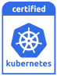

---

copyright:
  years: 2014, 2019
lastupdated: "2019-10-17"

keywords: kubernetes, iks, docker, containers

subcollection: containers

---

{:new_window: target="_blank"}
{:shortdesc: .shortdesc}
{:screen: .screen}
{:pre: .pre}
{:table: .aria-labeledby="caption"}
{:codeblock: .codeblock}
{:tip: .tip}
{:note: .note}
{:important: .important}
{:deprecated: .deprecated}
{:download: .download}
{:preview: .preview}

# {{site.data.keyword.containerlong_notm}} technology
{: #ibm-cloud-kubernetes-service-technology}

Learn more about the technology behind {{site.data.keyword.containerlong}}.
{:shortdesc}

## Docker containers
{: #docker_containers}

Built on existing Linux container technology (LXC), the open source project that is named Docker defined templates for how to package software into standardized units, called containers, that include all of the elements that an app needs to run. {{site.data.keyword.containerlong_notm}} uses `containerd` as the container runtime to deploy containers from Docker container images into your cluster.
{:shortdesc}

Learn about some basic Docker concepts:

<dl>
<dt>Image</dt>
<dd>A container image is the base for every container that you want to run. Container images are built from a Dockerfile, a text file that defines how to build the image and which build artifacts to include in it, such as the app, the app's configuration, and its dependencies. Images are always built from other images, making them quick to configure. Let someone else do the bulk of the work on an image and then tweak it for your use.</dd>
<dt>Registry</dt>
<dd>An image registry is a place to store, retrieve, and share container images. Images that are stored in a registry can either be publicly available (public registry) or accessible by a small group of users (private registry). {{site.data.keyword.containerlong_notm}} offers public images, such as ibmliberty, that you can use to create your first containerized app. When it comes to enterprise applications, use a private registry like the one that is provided in {{site.data.keyword.cloud_notm}} to protect your images from being used by unauthorized users.
</dd>
<dt>Container</dt>
<dd>Every container is created from an image. A container is a packaged app with all of its dependencies so that the app can be moved between environments and run without changes. Unlike virtual machines, containers do not virtualize a device, its operating system, and the underlying hardware. Only the app code, run time, system tools, libraries, and settings are packaged inside the container. Containers run as isolated processes on Ubuntu compute hosts and share the host operating system and its hardware resources. This approach makes a container more lightweight, portable, and efficient than a virtual machine.</dd>
</dl>

### Key benefits of using containers
{: #container_benefits}

<dl>
<dt>Containers are agile</dt>
<dd>Containers simplify system administration by providing standardized environments for development and production deployments. The lightweight run time enables rapid scale-up and scale-down of deployments. Remove the complexity of managing different operating system platforms and their underlying infrastructures by using containers to help you deploy and run any app on any infrastructure quickly and reliably.</dd>
<dt>Containers are small</dt>
<dd>You can fit many containers in the amount of space that a single virtual machine requires.</dd>
<dt>Containers are portable</dt>
<dd>
<ul>
  <li>Reuse pieces of images to build containers. </li>
  <li>Move app code quickly from staging to production environments.</li>
  <li>Automate your processes with continuous delivery tools.</li>
  </ul>
  </dd>

Learn more about [securing your personal information](/docs/containers?topic=containers-security#pi) when you work with container images.

Ready to gain deeper knowledge of Docker? <a href="https://cognitiveclass.ai/courses/docker-essentials" target="_blank">Learn how Docker and {{site.data.keyword.containerlong_notm}} work together by completing this course.</a>

</dl>

 

## Kubernetes clusters
{: #kubernetes_basics}

The open source project that is named Kubernetes combines running a containerized infrastructure with production work loads, open source contributions, and Docker container management tools. The Kubernetes infrastructure provides an isolated and secure app platform for managing containers that is portable, extensible, and self-healing in case of failovers.
{:shortdesc}

Learn about some basic Kubernetes concepts as shown in the following diagram.

<dl>
<dt>Account</dt>
<dd>Your account refers to your {{site.data.keyword.cloud_notm}} account.</dd>

<dt>Cluster</dt>
<dd>A Kubernetes cluster consists of one or more compute hosts that are called worker nodes. Worker nodes are managed by a Kubernetes master that centrally controls and monitors all Kubernetes resources in the cluster. So when you deploy the resources for a containerized app, the Kubernetes master decides which worker node to deploy those resources on, accounting for the deployment requirements and available capacity in the cluster. Kubernetes resources include services, deployments, and pods.</dd>

<dt>Service</dt>
<dd>A service is a Kubernetes resource that groups a set of pods and provides network connectivity to these pods without exposing the actual private IP address of each pod. You can use a service to make your app available within your cluster or to the public internet.
</dd>

<dt>Deployment</dt>
<dd>A deployment is a Kubernetes resource where you might specify information about other resources or capabilities that are required to run your app, such as services, persistent storage, or annotations. You document a deployment in a configuration YAML file, and then apply it to the cluster. The Kubernetes master configures the resources and deploys containers into pods on the worker nodes with available capacity.
  
Define update strategies for your app, including the number of pods that you want to add during a rolling update and the number of pods that can be unavailable at a time. When you perform a rolling update, the deployment checks whether the update is working and stops the rollout when failures are detected.</dd>

<dt>Pod</dt>
<dd>Every containerized app that is deployed into a cluster is deployed, run, and managed by a Kubernetes resource that is called a pod. Pods represent small deployable units in a Kubernetes cluster and are used to group the containers that must be treated as a single unit. In most cases, each container is deployed in its own pod. However, an app might require a container and other helper containers to be deployed into one pod so that those containers can be addressed by using the same private IP address.</dd>

<dt>App</dt>
<dd>An app might refer to a complete app or a component of an app. You might deploy components of an app in separate pods or separate worker nodes.</dd>

Learn more about [securing your personal information](/docs/containers?topic=containers-security#pi) when you work with Kubernetes resources.

Ready to gain deeper knowledge of Kubernetes?

<ul><li><a href="/docs/containers?topic=containers-cs_cluster_tutorial#cs_cluster_tutorial" target="_blank">Expand your terminology knowledge with the Creating clusters tutorial</a>.</li>
<li><a href="https://cognitiveclass.ai/courses/kubernetes-course" target="_blank">Learn how Kubernetes and {{site.data.keyword.containerlong_notm}} work together by completing this course.</a></li></ul>

</dl>

 

## Service architecture
{: #architecture}

In a Kubernetes cluster that runs on {{site.data.keyword.containerlong_notm}}, your containerized apps are hosted on compute hosts that are called worker nodes. To be more specific, the apps run in pods and the pods are hosted on worker nodes. Worker nodes are managed by the Kubernetes master. The communication setup between the Kubernetes master and the worker nodes depends on how you set up your IBM Cloud infrastructure network: an account with a public service endpoint, or a VRF-enabled account with public and private service endpoints.
{: shortdesc}

### Classic cluster architecture
{: #architecture_classic}

The following image shows the components of your cluster and how they interact in an account when only the [public service endpoint is enabled](/docs/containers?topic=containers-plan_clusters#workeruser-master).
{: shortdesc}

 The following architectural overviews are specific to the classic infrastructure provider. For an architectural overview for the VPC infrastructure provider, see [VPC cluster architecture](#architecture_vpc).
{: note}

<figure>
 
 <figcaption>{{site.data.keyword.containerlong_notm}} architecture when only the public service endpoint is enabled</figcaption>
</figure>

The following image shows the components of your cluster and how they interact in a VRF-enabled account when the [public and private service endpoints are enabled](/docs/containers?topic=containers-plan_clusters#workeruser-master).

<figure>
 
 <figcaption>{{site.data.keyword.containerlong_notm}} architecture when public and private service endpoints are enabled</figcaption>
</figure>

What's the difference between the Kubernetes master and a worker node? Glad you asked.

<dl>
  <dt>Kubernetes master</dt>
    <dd>The Kubernetes master is tasked with managing all compute, network, and storage resources in the cluster. The Kubernetes master ensures that your containerized apps and services are equally deployed to the worker nodes in the cluster. Depending on how you configure your app and services the master determines the worker node that has sufficient resources to fulfill the app's requirements.  The following table describes the components of the Kubernetes master.
    <table>
    <caption>Components of the Kubernetes master</caption>
    <thead>
    <th>Master component</th>
    <th>Description</th>
    </thead>
    <tbody>
    <tr>
    <td>kube-apiserver</td>
    <td>The Kubernetes API server serves as the main entry point for all cluster management requests from the worker node to the Kubernetes master. The Kubernetes API server validates and processes requests that change the state of Kubernetes resources, such as pods or services, and stores this state in etcd.</td>
    </tr>
    <tr>
    <td>`openvpn-server`</td>
    <td>The OpenVPN server works with the OpenVPN client to securely connect the master to the worker node. This connection supports `apiserver proxy` calls to your pods and services, and `kubectl exec`, `attach`, and `logs` calls to the kubelet.</td>
    </tr>
    <tr>
    <td>`etcd`</td>
    <td>`etcd` is a highly available key value store that stores the state of all Kubernetes resources of a cluster, such as services, deployments, and pods. Data in etcd is backed up to an encrypted storage instance that IBM manages.</td>
    </tr>
    <tr>
    <td>`kube-scheduler`</td>
    <td>The Kubernetes scheduler watches for newly created pods and decides where to deploy them based on capacity, performance needs, policy constraints, anti-affinity specifications, and workload requirements. If no worker node can be found that matches the requirements, the pod is not deployed in the cluster.</td>
    </tr>
    <tr>
    <td>`kube-controller-manager`</td>
    <td>The Kubernetes controller manager is a daemon that watches the state of cluster resources, such as replica sets. When the state of a resource changes, for example if a pod in a replica set goes down, the controller manager initiates correcting actions to achieve the required state.</td>
    </tr>
    </tbody></table></dd>
  <dt>Worker node</dt>
    <dd>Each worker node is a physical machine (bare metal) or a virtual machine that runs on physical hardware in the cloud environment. When you provision a worker node, you determine the resources that are available to the containers that are hosted on that worker node. Out of the box, your worker nodes are set up with an {{site.data.keyword.IBM_notm}}-managed Docker Engine, separate compute resources, networking, and a volume service. The built-in security features provide isolation, resource management capabilities, and worker node security compliance.  
Modifying default worker node components such as `kubelet` is not supported and might cause unexpected results.
The following table describes the components of a worker node.
    <table>
    <caption>Components of worker nodes</caption>
    <thead>
    <th>Worker component</th>
    <th>Namespace</th>
    <th>Description</th>
    </thead>
    <tbody>
    <tr>
    <td>`ibm-master-proxy`</td>
    <td>`kube-system`</td>
    <td>The `ibm-master-proxy` forwards requests from the worker node to the IP addresses of the highly available master replicas. In single zone clusters, the master has three replicas on separate hosts with one master IP address and domain name. For clusters that are in a multizone-capable zone, the master has three replicas that are spread across zones. As such, each master has its own IP address that is registered with DNS, with one domain name for the entire cluster master.</td>
    </tr>
    <tr>
    <td>`openvpn-client`</td>
    <td>`kube-system`</td>
    <td>The OpenVPN client works with the OpenVPN server to securely connect the master to the worker node. This connection supports `apiserver proxy` calls to your pods and services, and `kubectl exec`, `attach`, and `logs` calls to the kubelet.</td>
    </tr>
    <tr>
    <td>`kubelet`</td>
    <td>`kube-system`</td>
    <td>The kubelet is a pod that runs on every worker node and is responsible for monitoring the health of pods that run on the worker node and for watching the events that the Kubernetes API server sends. Based on the events, the kubelet creates or removes pods, ensures liveness and readiness probes, and reports back the status of the pods to the Kubernetes API server.</td>
    </tr>
    <tr>
    <td>`coredns`</td>
    <td>`kube-system`</td>
    <td>By default, Kubernetes schedules a CoreDNS pod (or KubeDNS pod in version 1.12 and earlier) and service on the cluster. Containers automatically use the DNS service's IP to resolve DNS names in their searches for other pods and services.</td>
    </tr>
    <tr>
    <td>`calico`</td>
    <td>`kube-system`</td>
    <td>Calico manages network policies for your cluster, and comprises a few components as follows.
    <ul>
    <li>**`calico-cni`**: The Calico container network interface (CNI) manages the network connectivity of containers and removes allocated resources when a container is deleted.</li>
    <li>**`calico-ipam`**: The Calico IPAM manages IP address assignment for containers.</li>
    <li>**`calico-node`**: The Calico node is a container that bundles together the various components that are required for networking containers with Calico.</li>
    <li>**`calico-policy-controller`**: The Calico policy controller watches inbound and outbound network traffic for compliance with set network policies. If the traffic is not allowed in the cluster, access to the cluster is blocked. The Calico policy controller is also used to create and set network policies for a cluster.</li></ul></td>
    </tr>
    <tr>
    <td>`kube-proxy`</td>
    <td>`kube-system`</td>
    <td>The Kubernetes network proxy is a daemon that runs on every worker node and that forwards or load balances TCP and UDP network traffic for services that run in the cluster.</td>
    </tr>
    <tr>
    <td>`kube-dashboard`</td>
    <td>`kube-system`</td>
    <td>The Kubernetes dashboard is a web-based GUI that allows users to manage and troubleshoot the cluster and applications that run in the cluster.</td>
    </tr>
    <tr>
    <td>`heapster`</td>
    <td>`kube-system`</td>
    <td>Heapster is a cluster-wide aggregator of monitoring and event data. The Heapster pod discovers all nodes in the cluster and queries usage information from each node's kubelet. You can find utilization graphs in the Kubernetes dashboard.</td>
    </tr>
    <tr>
    <td>Ingress ALB</td>
    <td>`kube-system`</td>
    <td>Ingress is a Kubernetes service that you can use to balance network traffic workloads in your cluster by forwarding public or private requests to multiple apps in your cluster. To expose your apps over the public or private network, you must create an Ingress resource to register your apps with the Ingress application load balancer (ALB). Multiple apps can then be accessed by using a single URL or IP address.</td>
    </tr>
    <tr>
    <td>Storage provider</td>
    <td>`kube-system`</td>
    <td>Every cluster is set up with a plug-in to provision file storage. You can choose to install other add-ons, such as block storage.</td>
    </tr>
    <tr>
    <td>Logging and metrics</td>
    <td>`ibm-system`</td>
    <td>You can use the {{site.data.keyword.la_full}} and {{site.data.keyword.mon_full}} services to expand your collection and retention capabilities when working with logs and metrics.</td>
    </tr>
    <tr>
    <td>Load balancer</td>
    <td>`ibm-system`</td>
    <td>A load balancer is a Kubernetes service that can be used to balance network traffic workloads in your cluster by forwarding public or private requests to an app.</td>
    </tr>
    <tr>
    <td>App pods and services</td>
    <td>`default`</td>
    <td>In the <code>default</code> namespace or in namespaces that you create, you can deploy apps in pods and services to communicate with those pods.</td>
    </tr>
    </tbody></table></dd>
</dl>

Want to see how {{site.data.keyword.containerlong_notm}} can be used with other products and services? Check out some of the [integrations](/docs/containers?topic=containers-supported_integrations#supported_integrations).
{: tip}

### VPC cluster architecture
{: #architecture_vpc}

The following diagram and table describe the default components that are set up in an {{site.data.keyword.containerlong_notm}} VPC cluster architecture.
{: shortdesc}

 The following architectural overviews are specific to the VPC infrastructure provider. For an architectural overview for the classic infrastructure provider, see [Classic cluster architecture](#architecture_classic).
{: note}

| Component | Description |
|:-----------------|:-----------------|
| Master |  Master components, including the API server and etcd, have three replicas and are spread across zones for even higher availability. Masters include the same components as described in the community Kubernetes architecture. |
| Worker node |  With {{site.data.keyword.containerlong_notm}}, the virtual machines that your cluster manages are instances that are called worker nodes. These worker nodes belong to you, and you manage them through the automation tools that are provided by {{site.data.keyword.containerlong_notm}}, such as the API, CLI, or console. Unlike classic clusters, you do not see VPC Gen 1 compute worker nodes in your infrastructure portal or separate infrastructure bill, but instead manage all maintenance and billing activity for the worker nodes from {{site.data.keyword.containerlong_notm}}.  Worker nodes include the same components as described in the Classic architecture. Community Kubernetes worker nodes run on Ubuntu 16.64, 18.64. |
| Cluster networking | Your worker nodes are created in a VPC subnet in the zone that you specify. By default, the public and private service endpoints for your cluster are enabled. Communication between the master and worker nodes is over the private network. Authenticated external users can communicate with the master over the public network, such as to run `kubectl` commands. You can optionally set up your cluster to communicate with on-prem services by setting up a VPN gateway appliance on the private network. |
| App networking | You can create a Kubernetes `LoadBalancer` service for your apps in the cluster, which automatically provisions a VPC load balancer in your VPC outside the cluster. The load balancer is multizonal and routes requests for your app through the private NodePorts that are automatically opened on your worker nodes. For more information, see [Exposing apps with VPC load balancers](/docs/containers?topic=containers-vpc-lbaas).  Calico is used as the cluster networking policy fabric. |
| Storage | You can set up only block persistent storage. Block storage is available as a cluster add-on. For more information, see [Storing data on IBM Block Storage for {{site.data.keyword.cloud_notm}}](/docs/containers?topic=containers-block_storage). |

 

## Service limitations
{: #tech_limits}

{{site.data.keyword.containerlong_notm}} and the Kubernetes open source project come with default service settings and limitations to ensure security, convenience, and basic functionality. Some of the limitations you might be able to change where noted. If you anticipate reaching the following {{site.data.keyword.containerlong_notm}} limitations, contact the IBM team in the [internal ](https://ibm-argonauts.slack.com/messages/C4S4NUCB1) or [external Slack ](https://ibm-container-service.slack.com).
{: shortdesc}

 The following limitations are specific to the classic infrastructure provider. For limitations that are specific to the VPC infrastructure provider, see [VPC cluster limitations](#vpc_ks_limits) in the VPC clusters tutorial.
{: note}

<table summary="This table contains information on the {{site.data.keyword.containerlong_notm}} limitations. Columns are read from left to right. In the first column is the type of limitation and in the second column is the description of the limitation.">
<caption>{{site.data.keyword.containerlong_notm}} limitations</caption>
<thead>
  <tr>
    <th>Type</th>
    <th>Description</th>
  </tr>
</thead>
<tbody>
  <tr>
    <td>API rate limits</td>
    <td>100 requests per 10 seconds to the {{site.data.keyword.containerlong_notm}} API for each unique source IP address.</td>
  </tr>
  <tr>
    <td>Worker node capacity</td>
    <td>Worker nodes are available in [select flavors](/docs/containers?topic=containers-planning_worker_nodes#shared_dedicated_node) of compute resources.</td>
  </tr>
  <tr>
    <td>Worker node host access</td>
    <td>For security, you cannot SSH into the worker node compute host.</td>
  </tr>
  <tr>
    <td>Maximum number of worker nodes</td>
    <td>If you plan to exceed 900 per cluster, contact the {{site.data.keyword.containerlong_notm}} team in the [internal ](https://ibm-argonauts.slack.com/messages/C4S4NUCB1) or [external Slack ](https://ibm-container-service.slack.com) first.  If you see an IBM Cloud infrastructure capacity limit on the number of instances per data center or that are ordered each month, contact your IBM Cloud infrastructure representative.</td>
  </tr>
  <tr>
    <td>Maximum number of pods</td>
    <td>110 per worker node.  
    **For worker nodes that run Kubernetes 1.13.7_1527, 1.14.3_1524, or later**: Worker nodes with more than 11 CPU cores can support 10 pods per core, up to a limit of 250 pods per worker node.
      The number of pods includes `kube-system` and `ibm-system` pods that run on the worker node. For improved performance, consider limiting the number of pods that you run per compute core so that you do not overuse the worker node. For example, on a worker node with a `b3c.4x16` flavor, you might run 10 pods per core that use no more than 75% of the worker node total capacity.</td>
  </tr>
  <tr>
    <td>Maximum number of Kubernetes services</td>
    <td>65,000 IPs per cluster in the 172.21.0.0/16 range that you can assign to Kubernetes services within the cluster.</td>
  </tr>
  <tr>
    <td>Ingress application load balancer (ALB) traffic</td>
    <td>32,768 connections per second.</td>
  </tr>
  <tr>
    <td>Storage volumes</td>
    <td>250 combined total of volumes of IBM Cloud infrastructure file and block storage instances per account.  If you mount more than this amount, you might see an "out of capacity" message when you provision persistent volumes and need to contact your IBM Cloud infrastructure representative. For more FAQs, see the [file](/docs/infrastructure/FileStorage?topic=FileStorage-file-storage-faqs#how-many-volumes-can-i-provision-) and [block](/docs/infrastructure/BlockStorage?topic=BlockStorage-block-storage-faqs#how-many-instances-can-share-the-use-of-a-block-storage-volume-) storage docs.</td>
  </tr>
  <tr>
    <td>Kubernetes pod logs</td>
    <td>To check the logs for individual app pods, you can use the terminal to run `kubectl logs <pod name>`. Do not use the Kubernetes dashboard to stream logs for your pods, which might cause a disruption in your access to the Kubernetes dashboard.</td>
  </tr>
</tbody>
</table>

 

## VPC cluster limitations
{: #vpc_ks_limits}

VPC Generation 1 compute clusters in {{site.data.keyword.containerlong_notm}} is released with the following limitations.
{: shortdesc}

**Compute**:
* You can have up to 100 worker nodes across all VPC clusters per account.
* Only certain flavors are available for worker node virtual machines.
* Bare metal machines are not supported.
* You cannot update or reload worker nodes. Instead, you can delete the worker node and rebalance the worker pool with the `ibmcloud ks worker replace` command.
* Cluster autoscaling is not supported.

**Container platforms**: VPC clusters are available for only community Kubernetes clusters, not OpenShift clusters.

**Load balancing for apps**: See [Exposing apps with VPC load balancers: Limitations](/docs/containers?topic=containers-vpc-lbaas#lbaas_limitations)

**Location**: VPC clusters are available in the following [multizone metro locations](/docs/containers?topic=containers-regions-and-zones#zones): Dallas, Frankfurt, London, Sydney, and Tokyo.

**Security groups** You cannot use [VPC security groups](/docs/infrastructure/security-groups?topic=security-groups-about-ibm-security-groups#about-ibm-security-groups) to control traffic for your cluster. VPC security groups are applied to the network interface of a single virtual server to filter traffic at the hypervisor level. However, the worker nodes of your VPC cluster exist in a service account and are not listed in the VPC infrastructure dashboard. You cannot attach a security group to your worker nodes instances.

**Storage**:
* You can set up VPC Block Storage and {{site.data.keyword.cos_full_notm}} only.
* VPC Block Storage is available as a cluster add-on. For more information, see [Storing data on VPC Block Storage](/docs/containers?topic=containers-vpc-block). Make sure to [attach a public gateway to all the VPC subnets](/docs/vpc-on-classic?topic=vpc-on-classic-creating-a-vpc-using-the-ibm-cloud-cli#step-5-attach-a-public-gateway) that the cluster uses so that you can provision VPC Block Storage.
* {{site.data.keyword.cos_full_notm}} is available as a Helm chart. For more information, see [Storing data on {{site.data.keyword.cos_full_notm}}](/docs/openshift?topic=openshift-object_storage).
* File storage and Portworx software-defined storage (SDS) are not available.

**strongSwan VPN service**: Only [outbound VPN connections from the cluster](/docs/containers?topic=containers-vpn#strongswan_3) can be established. Additionally, because VPC clusters do not support UDP load balancers, the following `config.yaml` options are not supported for use in strongSwan Helm charts in VPC clusters:
  * `enableServiceSourceIP`
  * `loadBalancerIP`
  * `zoneLoadBalancer`
  * `connectUsingLoadBalancerIP`

**Versions**: VPC clusters must run Kubernetes version 1.15 or later.

**Virtual Private Cloud**: See [Known limitations](/docs/vpc-on-classic?topic=vpc-on-classic-known-limitations).

**v2 API**: VPC clusters use the [{{site.data.keyword.containerlong_notm}} v2 API](/docs/containers?topic=containers-cs_api_install#api_about). The v2 API is currently under development, with only a limited number of API operations currently available. You can run certain v1 API operations against the VPC cluster, such as `GET /v1/clusters` or `ibmcloud ks cluster ls`, but not all the information that a Classic cluster has is returned or you might experience unexpected results. For supported VPC v2 operations, see the [CLI reference topic for VPC commands](/docs/containers?topic=containers-cli-plugin-kubernetes-service-cli#cli_classic_vpc_about).
