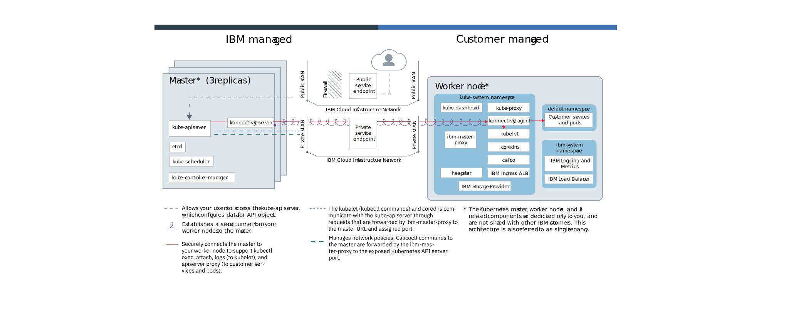

---

copyright:
  years: 2014, 2023
lastupdated: "2023-01-04"

keywords: kubernetes, docker, containers

subcollection: containers

---

{{site.data.keyword.attribute-definition-list}}

# Architecture and dependencies of the service
{: #service-arch}

Review sample cluster architectures and the components that are created in your [classic](#architecture_classic) or [VPC](#architecture_vpc) cluster.
{: shortdesc}

## Classic cluster
{: #architecture_classic}

The following architectural overviews are specific to the classic infrastructure provider. For an architectural overview for the VPC infrastructure provider, see [VPC cluster architecture](#architecture_vpc).
{: note}

### Non-VRF or VRF-enabled account with public cloud service endpoint only
{: #no-vrf-public-endpoint}

The following image shows the components of your cluster and how they interact in a non-VRF or VRF-enabled account when only the [public cloud service endpoint is enabled](/docs/containers?topic=containers-plan_basics#workeruser-master).
{: shortdesc}

{: caption="Figure 1. Cluster architecture when only the public cloud service endpoint is enabled" caption-side="bottom"}

### VRF-enabled account with private and public cloud service endpoints
{: #vrf-both-endpoints}

The following image shows the components of your cluster and how they interact in a VRF-enabled account when the [public and private cloud service endpoints are enabled](/docs/containers?topic=containers-plan_basics#workeruser-master).
{: shortdesc}

{: caption="Figure 1. Cluster architecture when public and private cloud service endpoints are enabled" caption-side="bottom"}

### Kubernetes master components
{: #master-components}

The Kubernetes master is tasked with managing all compute, network, and storage resources in the cluster, and ensures that your containerized apps and services are equally deployed to the worker nodes in the cluster. Depending on how you configure your app and services the master determines the worker node that has sufficient resources to fulfill the app's requirements.
{: shortdesc}

The Kubernetes master and all the master components are dedicated only to you, and are not shared with other IBM customers.  
{: note}

The following table describes the components of the Kubernetes master.

`kube-apiserver`
:   The Kubernetes API server serves as the main entry point for all cluster management requests from the worker node to the Kubernetes master. The Kubernetes API server validates and processes requests that change the state of Kubernetes resources, such as pods or services, and stores this state in etcd.

`openvpn-server` (Kubernetes version 1.20 or earlier) or `konnectivity-server` (Kubernetes version 1.21 or later)
:   The OpenVPN or Konnectivity server works with the OpenVPN client or Konnectivity agent to securely connect the master to the worker node. This connection supports `apiserver proxy` calls to your pods and services, and `kubectl exec`, `attach`, and `logs` calls to the kubelet.

`etcd`
:   `etcd` is a highly available key value store that stores the state of all Kubernetes resources of a cluster, such as services, deployments, and pods. Data in etcd is backed up to an encrypted storage instance that IBM manages.

`kube-scheduler`
:   The Kubernetes scheduler watches for newly created pods and decides where to deploy them based on capacity, performance needs, policy constraints, anti-affinity specifications, and workload requirements. If no worker node can be found that matches the requirements, the pod is not deployed in the cluster.

`kube-controller-manager`
:   The Kubernetes controller manager is a daemon that watches the state of cluster resources, such as replica sets. When the state of a resource changes, for example if a pod in a replica set goes down, the controller manager initiates correcting actions to achieve the required state.

### Worker node components
{: #worker-components}

Each worker node is a physical machine (bare metal) or a virtual machine that runs on physical hardware in the cloud environment. When you provision a worker node, you determine the resources that are available to the containers that are hosted on that worker node. Out of the box, your worker nodes are set up with an {{site.data.keyword.IBM_notm}}-managed container runtime, separate compute resources, networking, and a volume service. The built-in security features provide isolation, resource management capabilities, and worker node security compliance.
{: shortdesc}

The worker nodes and all the worker node components are dedicated only to you, and are not shared with other IBM customers. However, if you use a worker node virtual machine, the underlying hardware might be shared with other customers depending on the level of hardware isolation that you choose. For more information, see [Virtual machines](/docs/containers?topic=containers-planning_worker_nodes#vm).   
{: note}

Modifying default worker node components such as the `kubelet` is not supported and might cause unexpected results.
{: note}

The following tables describe the components of a worker node.

### `kube-system` namespace
{: #kube-system-ns-resources}

`ibm-master-proxy`
:   The `ibm-master-proxy` forwards requests from the worker node to the IP addresses of the highly available master replicas. In single zone clusters, the master has three replicas on separate hosts with one master IP address and domain name. For clusters that are in a multizone-capable zone, the master has three replicas that are spread across zones. As such, each master has its own IP address that is registered with DNS, with one domain name for the entire cluster master.

`openvpn-client` (Kubernetes version 1.20 or earlier) or `konnectivity-agent` (Kubernetes version 1.21 or later)
:   The OpenVPN client or Konnectivity agent works with the OpenVPN or Konnectivity server to securely connect the master to the worker node. This connection supports `apiserver proxy` calls to your pods and services, and `kubectl exec`, `attach`, and `logs` calls to the kubelet.

`kubelet`
:   The kubelet is a pod that runs on every worker node and is responsible for monitoring the health of pods that run on the worker node and for watching the events that the Kubernetes API server sends. Based on the events, the kubelet creates or removes pods, ensures liveness and readiness probes, and reports back the status of the pods to the Kubernetes API server.

`coredns`
:   By default, Kubernetes schedules a CoreDNS pod (or KubeDNS pod in version 1.12 and earlier) and service on the cluster. Containers automatically use the DNS service's IP to resolve DNS names in their searches for other pods and services.

`calico`
:   Calico manages network policies for your cluster, and comprises a few components as follows.
:   `calico-cni`: The Calico container network interface (CNI) manages the network connectivity of containers and removes allocated resources when a container is deleted.
:   `calico-ipam`: The Calico IPAM manages IP address assignment for containers.
:   `calico-node`: The Calico node is a container that bundles together the various components that are required for networking containers with Calico.
:   `calico-policy-controller`: The Calico policy controller watches inbound and outbound network traffic for compliance with set network policies. If the traffic is not allowed in the cluster, access to the cluster is blocked. The Calico policy controller is also used to create and set network policies for a cluster.

`kube-proxy`
:   The Kubernetes network proxy is a daemon that runs on every worker node and that forwards or load balances TCP and UDP network traffic for services that run in the cluster.

`kube-dashboard`
:   The Kubernetes dashboard is a web-based GUI that allows users to manage and troubleshoot the cluster and applications that run in the cluster.

`heapster`
:   Heapster is a cluster-wide aggregator of monitoring and event data. The Heapster pod discovers all nodes in the cluster and queries usage information from each node's kubelet. You can find utilization graphs in the Kubernetes dashboard.

Ingress ALB
:   Ingress is a Kubernetes service that you can use to balance network traffic workloads in your cluster by forwarding public or private requests to multiple apps in your cluster. To expose your apps over the public or private network, you must create an Ingress resource to register your apps with the Ingress application load balancer (ALB). Multiple apps can then be accessed by using a single URL or IP address.

Storage provider
:   Every cluster is set up with a plug-in to provision file storage. You can choose to install other add-ons, such as block storage.

### `ibm-system` namespace
{: #ibm-system-ns-resources}

Logging and metrics
:   You can use the {{site.data.keyword.la_full}} and {{site.data.keyword.mon_full}} services to expand your collection and retention capabilities when working with logs and metrics.
Load balancer

:   A load balancer is a Kubernetes service that can be used to balance network traffic workloads in your cluster by forwarding public or private requests to an app.

### `default` namespace
{: #default-ns-resources}

App pods and services
:   In the `default` namespace or in namespaces that you create, you can deploy apps in pods and services to communicate with those pods.

## VPC cluster
{: #architecture_vpc}

The following diagram and table describe the default components that are set up in an {{site.data.keyword.containerlong_notm}} VPC cluster architecture.
{: shortdesc}

The following architectural overviews are specific to the VPC infrastructure provider. For an architectural overview for the classic infrastructure provider, see [Classic cluster architecture](#architecture_classic).
{: note}

{: caption="Figure 1. Kubernetes cluster in a VPC" caption-side="bottom"}

| Component | Description |
|:-----------------|:-----------------|
| Master |  [Master components](#master-components), including the API server and etcd, have three replicas and are spread across zones for even higher availability. Masters include the same components as described in the community Kubernetes architecture. The master and all the master components are dedicated only to you, and are not shared with other IBM customers.  |
| Worker node |  With {{site.data.keyword.containerlong_notm}}, the virtual machines that your cluster manages are instances that are called worker nodes. These worker nodes virtual machines and all the worker node components are dedicated to you only and are not shared with other IBM customers. However, the underlying hardware is shared with other IBM customers. For more information, see [Virtual machines](/docs/containers?topic=containers-planning_worker_nodes#vm).  You manage the worker nodes through the automation tools that are provided by {{site.data.keyword.containerlong_notm}}, such as the API, CLI, or console. Unlike classic clusters, you don't see VPC compute worker nodes in your infrastructure portal or separate infrastructure bill, but instead manage all maintenance and billing activity for the worker nodes from {{site.data.keyword.containerlong_notm}}. Worker nodes include the same [components](#worker-components) as described in the Classic architecture. Community Kubernetes worker nodes run on Ubuntu 18.04 x86_64, 16.04 x86_64 (deprecated). |
| Cluster networking | Your worker nodes are created in a VPC subnet in the zone that you specify. By default, the public and private cloud service endpoints for your cluster are enabled. Communication between the master and worker nodes is over the private network. Authenticated external users can communicate with the master over the public network, such as to run `kubectl` commands. You can optionally set up your cluster to communicate with on-prem services by setting up a VPC VPN on the private network. |
| App networking | You can create a Kubernetes `LoadBalancer` service for your apps in the cluster, which automatically provisions a VPC load balancer in your VPC outside the cluster. The load balancer is multizonal and routes requests for your app through the private NodePorts that are automatically opened on your worker nodes. For more information, see [Exposing apps with VPC load balancers](/docs/containers?topic=containers-vpc-lbaas). Calico is used as the cluster networking policy fabric. |
| Storage | You can set up only block persistent storage. Block storage is available as a cluster add-on. For more information, see [Storing data on IBM Block Storage for {{site.data.keyword.cloud_notm}}](/docs/containers?topic=containers-block_storage). |
{: caption="Table 1. Kubernetes cluster in a VPC" caption-side="bottom"}

## Overview of personal and sensitive data storage and removal options
{: #ibm-data}

Review what information is stored with IBM when you use {{site.data.keyword.containerlong_notm}}, how this data is stored and encrypted, and how you can permanently remove this information.
{: shortdesc}

### What information is stored with IBM when using {{site.data.keyword.containerlong_notm}}?
{: #pi-info}

For each cluster that you create with {{site.data.keyword.containerlong_notm}}, IBM stores the information that is described in the following table:

|Information type|Data|
|-------|----------|
|Personal information|The email address of the {{site.data.keyword.cloud_notm}} account that created the cluster.|
|Sensitive information|  - The TLS certificate and secret that is used for the assigned Ingress subdomain.  \n - The certificate authority that is used for the TLS certificate.  \n - The certificate authority, private keys, and TLS certificates for the Kubernetes master components, including the Kubernetes API server, etcd data store, and VPN.  \n - A customer root key in {{site.data.keyword.keymanagementservicelong_notm}} for each {{site.data.keyword.cloud_notm}} account that is used to encrypt personal and sensitive information.|
{: caption="Table 1. Information that is stored with IBM" caption-side="bottom"}

### How is my information stored and encrypted?
{: #pi-storage}

All information is stored in an etcd database and backed up every 8 hours to {{site.data.keyword.cos_full_notm}}. The etcd database and {{site.data.keyword.cos_short}} service instance are owned and managed by the {{site.data.keyword.cloud_notm}} SRE team. For each {{site.data.keyword.cloud_notm}} account, a customer root key in {{site.data.keyword.keymanagementservicelong_notm}} is created that is managed by the {{site.data.keyword.containerlong_notm}} service team. This root key is used to encrypt all personal and sensitive information in etcd and in {{site.data.keyword.cos_short}}.

### Where is my information stored?
{: #pi-location}

The location where your information is stored depends on the location your cluster is in. By default, your data is stored in the {{site.data.keyword.containerlong_notm}} multizone metro area that is closest to your cluster. However, {{site.data.keyword.containerlong_notm}} might decide to store your data in a different multizone metro area to optimize the utilization of available compute resources. If you create your cluster in a non-multizone metro area, your data is still stored in the closest multizone metro area. This location might be in a different country than the one where you created your cluster. Make sure that your information can reside in a different country before you create your cluster in a non-multizone metro area.

The data that you create and own is always stored in the same location as the cluster. For more information about what data you can create in your cluster, how this data is encrypted, and how you can protect this data, see [Protecting sensitive information in your cluster](/docs/containers?topic=containers-encryption).
{: note}

### How can I remove my information?
{: #pi-removal}

Review your options to remove your information from {{site.data.keyword.containerlong_notm}}.
{: shortdesc}

Removing personal and sensitive information is permanent and not reversible. Make sure that you want to permanently remove your information before you proceed.
{: important}

Is my data removed when I remove the cluster?
:   Deleting a cluster does not remove all information from {{site.data.keyword.containerlong_notm}}. When you delete a cluster, cluster-specific information is removed from the etcd instance that is managed by IBM. However, your information still exists in the {{site.data.keyword.cos_full_notm}} backup and can still be accessed by the IBM service team by using the account-specific customer root key in {{site.data.keyword.keymanagementservicelong_notm}} that IBM owns and manages.

What options do I have to permanently remove my data?
:   To remove that data that IBM stores, choose between the following options. Note that removing your personal and sensitive information requires all your clusters to be deleted as well. Make sure that you backed up your app data before your proceed.

- **Open an {{site.data.keyword.cloud_notm}} support case**: Contact IBM Support to remove your personal and sensitive information from {{site.data.keyword.containerlong_notm}}. For more information, see [Getting support](/docs/get-support?topic=get-support-using-avatar).
- **End your {{site.data.keyword.cloud_notm}} subscription**: After you end your {{site.data.keyword.cloud_notm}} subscription, {{site.data.keyword.containerlong_notm}} removes the customer root key in {{site.data.keyword.keymanagementservicelong_notm}} that IBM created and managed for you as well as all the personal and sensitive information from the etcd data store and {{site.data.keyword.cos_short}} backup.

