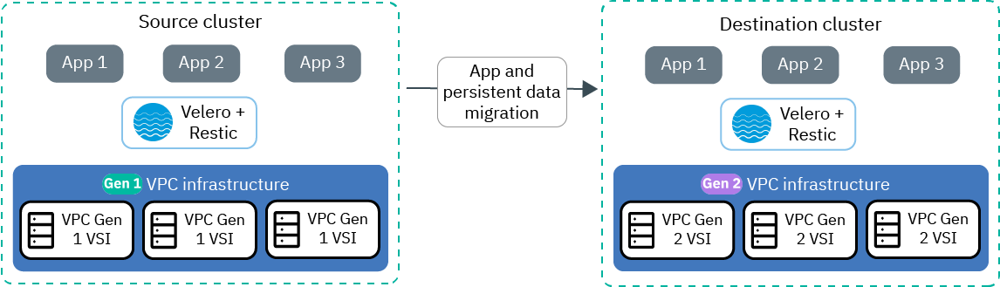

---

copyright:
  years: 2014, 2021
lastupdated: "2021-01-19"

keywords: kubernetes, iks

subcollection: containers

content-type: tutorial
services: containers, vpc, cloud-object-storage
account-plan:
completion-time: 90m

---

{:DomainName: data-hd-keyref="APPDomain"}
{:DomainName: data-hd-keyref="DomainName"}
{:android: data-hd-operatingsystem="android"}
{:api: .ph data-hd-interface='api'}
{:apikey: data-credential-placeholder='apikey'}
{:app_key: data-hd-keyref="app_key"}
{:app_name: data-hd-keyref="app_name"}
{:app_secret: data-hd-keyref="app_secret"}
{:app_url: data-hd-keyref="app_url"}
{:authenticated-content: .authenticated-content}
{:beta: .beta}
{:c#: data-hd-programlang="c#"}
{:cli: .ph data-hd-interface='cli'}
{:codeblock: .codeblock}
{:curl: .ph data-hd-programlang='curl'}
{:deprecated: .deprecated}
{:dotnet-standard: .ph data-hd-programlang='dotnet-standard'}
{:download: .download}
{:external: target="_blank" .external}
{:faq: data-hd-content-type='faq'}
{:fuzzybunny: .ph data-hd-programlang='fuzzybunny'}
{:generic: data-hd-operatingsystem="generic"}
{:generic: data-hd-programlang="generic"}
{:gif: data-image-type='gif'}
{:go: .ph data-hd-programlang='go'}
{:help: data-hd-content-type='help'}
{:hide-dashboard: .hide-dashboard}
{:hide-in-docs: .hide-in-docs}
{:important: .important}
{:ios: data-hd-operatingsystem="ios"}
{:java: .ph data-hd-programlang='java'}
{:java: data-hd-programlang="java"}
{:javascript: .ph data-hd-programlang='javascript'}
{:javascript: data-hd-programlang="javascript"}
{:new_window: target="_blank"}
{:note .note}
{:note: .note}
{:objectc data-hd-programlang="objectc"}
{:org_name: data-hd-keyref="org_name"}
{:php: data-hd-programlang="php"}
{:pre: .pre}
{:preview: .preview}
{:python: .ph data-hd-programlang='python'}
{:python: data-hd-programlang="python"}
{:route: data-hd-keyref="route"}
{:row-headers: .row-headers}
{:ruby: .ph data-hd-programlang='ruby'}
{:ruby: data-hd-programlang="ruby"}
{:runtime: architecture="runtime"}
{:runtimeIcon: .runtimeIcon}
{:runtimeIconList: .runtimeIconList}
{:runtimeLink: .runtimeLink}
{:runtimeTitle: .runtimeTitle}
{:screen: .screen}
{:script: data-hd-video='script'}
{:service: architecture="service"}
{:service_instance_name: data-hd-keyref="service_instance_name"}
{:service_name: data-hd-keyref="service_name"}
{:shortdesc: .shortdesc}
{:space_name: data-hd-keyref="space_name"}
{:step: data-tutorial-type='step'}
{:subsection: outputclass="subsection"}
{:support: data-reuse='support'}
{:swift: .ph data-hd-programlang='swift'}
{:swift: data-hd-programlang="swift"}
{:table: .aria-labeledby="caption"}
{:term: .term}
{:tip: .tip}
{:tooling-url: data-tooling-url-placeholder='tooling-url'}
{:troubleshoot: data-hd-content-type='troubleshoot'}
{:tsCauses: .tsCauses}
{:tsResolve: .tsResolve}
{:tsSymptoms: .tsSymptoms}
{:tutorial: data-hd-content-type='tutorial'}
{:ui: .ph data-hd-interface='ui'}
{:unity: .ph data-hd-programlang='unity'}
{:url: data-credential-placeholder='url'}
{:user_ID: data-hd-keyref="user_ID"}
{:vbnet: .ph data-hd-programlang='vb.net'}
{:video: .video}


# Migrating cluster resources from VPC Gen 1 to VPC Gen 2
{: #vpc_migrate_tutorial}
{: toc-content-type="tutorial"}
{: toc-services="containers, vpc, cloud-object-storage"}
{: toc-completion-time="90m"}

Move your workloads from {{site.data.keyword.containerlong}} clusters on VPC Generation 1 compute to clusters on VPC Generation 2 compute.
{: shortdesc}

  With **{{site.data.keyword.containerlong_notm}} clusters on VPC Generation 2 compute**, you can create your cluster on VPC infrastructure in the next generation of the {{site.data.keyword.cloud_notm}} platform, in your [Virtual Private Cloud](/docs/vpc?topic=vpc-about-vpc).

As of 01 September 2020, VPC Generation 1 compute is deprecated. If you did not create any VPC Gen 1 resources before this date, you can no longer provision any VPC Gen 1 resources. If you created any VPC Gen 1 resources before this date, you can continue to provision and use VPC Gen 1 resources until 26 February 2021, when all service for VPC Gen 1 ends. On 31 March 2021, any remaining VPC Gen 1 worker nodes are automatically deleted. To ensure continued support, create new VPC clusters on Generation 2 compute only. For more information, see [About Migrating from VPC (Gen 1) to VPC (Gen 2)](/docs/vpc-on-classic?topic=vpc-on-classic-migrating-faqs).
{: deprecated}

## Objectives
{: #vpc_ks_objectives}

In this tutorial, you complete the following objectives:
* Create a Gen 2 Virtual Private Cloud (VPC) and replicate your VPC Gen 1 resources in your Gen 2 VPC.
* Create an {{site.data.keyword.containerlong_notm}} cluster in your Gen 2 VPC.
* Use the [Velero](https://velero.io/){: external} and [Restic](https://restic.net/){: external} open source projects to back up your VPC Gen 1 resources, including app workloads and persistent data, to an {{site.data.keyword.cos_full}} bucket.
* Restore the resources from the VPC Gen 1 cluster to the VPC Gen 2 cluster.



## Audience
{: #vpc_ks_audience}

This tutorial is for administrators who want to migrate cluster workloads off of VPC generation 1 compute and onto VPC generation 2 compute.
{: shortdesc}

## Prerequisites
{: #vpc_ks_prereqs}

**Permissions**
* Ensure that you have the following {{site.data.keyword.cloud_notm}} IAM access policies.
  * [**Administrator** platform role for VPC Infrastructure](/docs/vpc?topic=vpc-managing-user-permissions-for-vpc-resources).
  * [**Administrator** platform role](/docs/containers?topic=containers-users#platform) for {{site.data.keyword.containerlong_notm}}.
  * [**Writer** or **Manager** service role](/docs/containers?topic=containers-users#platform) for {{site.data.keyword.containerlong_notm}}.
  * [**Administrator** platform role](/docs/containers?topic=containers-users#platform) for Container Registry.
  * [**Writer** or **Manager** service role](/docs/containers?topic=containers-users#platform) for {{site.data.keyword.cos_full_notm}}.
* Make sure that the API key for the region and resource group that you plan to create the VPC Gen 2 cluster in is set up with the correct [infrastructure permissions](/docs/containers?topic=containers-users#api_key).

<br>
**Command-line tools**
* [Install the {{site.data.keyword.cloud_notm}} CLI (`ibmcloud`), {{site.data.keyword.containershort_notm}}plug-in (`ibmcloud ks`), and {{site.data.keyword.registrylong_notm}} plug-in (`ibmcloud cr`)](/docs/containers?topic=containers-cs_cli_install#cs_cli_install_steps).
* Make sure that the [`kubectl` version](/docs/containers?topic=containers-cs_cli_install#kubectl) matches the Kubernetes version of your existing VPC Gen 1 cluster.
* Update your {{site.data.keyword.containerlong_notm}} plug-in to the latest version.
  ```
  ibmcloud plugin update kubernetes-service
  ```
  {: pre}
* To work with VPC, install the `infrastructure-service` plug-in. The prefix for running commands is `ibmcloud is`.
  ```
  ibmcloud plugin install infrastructure-service
  ```
  {: pre}
* To work with {{site.data.keyword.cos_full_notm}}, install the `cloud-object-storage` plug-in. The prefix for running commands is `ibmcloud cos`.
  ```
  ibmcloud plugin install cloud-object-storage
  ```
  {: pre}
* Install the Velero command-line tool. On Mac OS, run the following command. For other installation options, see the [Velero documentation](https://velero.io/docs/v1.4/basic-install/#install-the-cli){: external}.
  ```
  brew install velero
  ```
  {: pre}

<br />

## Plan your migration to VPC Gen 2
{: #vpc_migrate_plan}
{: step}

Start by gathering information about your existing Gen 1 VPC, resources, and cluster, and planning your Gen 2 VPC, resources, and cluster.
{: shortdesc}

1. Review the differences between VPC Gen 1 and Gen 2, such as changes in VPC architecture, VPC quotas and limitations, and limitations for {{site.data.keyword.containerlong_notm}} clusters on VPC infrastructure.
  * [VPC Gen 2 overview and architecture](/docs/vpc?topic=vpc-about-vpc)
  * [VPC Gen 2 quotas and limitations](/docs/vpc?topic=vpc-quotas)
  * [Limitations for {{site.data.keyword.containerlong_notm}} clusters on VPC Gen 2 compute](/docs/containers?topic=containers-limitations#ks_vpc_gen2_limits)

2. Get information about your Gen 1 VPC and plan your Gen 2 VPC.
  1. Target the region for your Gen 1 VPC.
    ```
    ibmcloud target -r <region>
    ```
    {: pre}
  2. Target VPC Gen 1.
    ```
    ibmcloud is target --gen 1
    ```
    {: pre}
  3. Get the ID for your Gen 1 VPC.
    ```
    ibmcloud is vpcs
    ```
    {: pre}
  4. Note information about your Gen 1 VPC that you also want to use to create your Gen 2 VPC, such as the region, resource group, whether the VPC has classic access, and any resource tags.
    ```
    ibmcloud is vpc <VPC_ID>
    ```
    {: pre}

3. Get information about your VPC Gen 1 subnets and plan your VPC Gen 2 subnets.
  1. List your VPC Gen 1 subnets and get the IDs for each subnet that your VPC Gen 1 cluster is attached to.
    ```
    ibmcloud is subnets
    ```
    {: pre}
  2. For each subnet that your cluster is attached to, note information that you also want to use to create your Gen 2 subnets, such as the CIDR if you used custom prefixes, the total IP address count, the ACL ID, security group ID, whether a public gateway is attached, and the zone. For more information about how VPC subnets are used in {{site.data.keyword.containerlong_notm}}, see [Configuring VPC subnets](/docs/containers?topic=containers-vpc-subnets).
    ```
    ibmcloud is subnet <subnet_ID>
    ```
    {: pre}

4. Optional: If you modified the default access control list (ACL) for your Gen 1 VPC that is applied to all subnets in the VPC, or if you manually created an ACL for each subnet that your cluster is attached to, use the ACL IDs from the output of the previous step to list the rules for ACLs. In the output, copy the list of inbound and outbound rules for each ACL. For more information about how VPC ACLs are used in {{site.data.keyword.containerlong_notm}}, see [Controlling traffic with ACLs, security groups, and network policies](/docs/containers?topic=containers-vpc-network-policy#acls).
  ```
  ibmcloud is nwacl <ACL_ID>
  ```
  {: pre}

4. Optional: If you modified the default security group for your Gen 1 VPC that is applied to all worker nodes in the VPC, use the security group ID from the output of step 3 to list the rules for the security group. In the output, copy the list of inbound and outbound rules. For more information about how VPC security groups are used in {{site.data.keyword.containerlong_notm}}, see [Controlling traffic with ACLs, security groups, and network policies](/docs/containers?topic=containers-vpc-network-policy#security_groups).
  ```
  ibmcloud is sg <security_group_ID>
  ```
  {: pre}

5. Optional: If you configured a VPN connection to your Gen 1 VPC and also need to access your Gen 2 VPC by using the VPC VPN, get information about your VPC Gen 1 VPN gateways for each subnet that your cluster is attached to. For more information about how to configure a VPC VPN connection, see [Setting up VPC VPN connectivity](/docs/containers?topic=containers-vpc-vpnaas).
  1. Get the IDs of the gateways that you created for each subnet that your cluster is attached to.
    ```
    ibmcloud is vpns
    ```
    {: pre}
  2. Note information that you also want to use to create your Gen 2 VPN gateways, such as the connection details, the dead peer detection details, and any policies.
    ```
    ibmcloud is vpn <gateway_ID>
    ```
    {: pre}

6. Get information about your VPC Gen 1 cluster and plan your VPC Gen 2 cluster.
  1. List your cluster details and note information that you also want to use to create your VPC Gen 2 cluster, such as the resource group, the number of worker nodes, the worker zones, and whether the public service endpoint is enabled.
    ```
    ibmcloud ks cluster get -c <gen1_cluster_name_or_ID>
    ```
    {: pre}
  2. Get the flavors of the worker nodes in your VPC Gen 1 cluster.
    ```
    ibmcloud ks worker ls -c <gen1_cluster_name_or_ID>
    ```
    {: pre}
  3. Verify that the same [worker node flavors are supported for {{site.data.keyword.containerlong_notm}} clusters on VPC Gen 2 compute](/docs/containers?topic=containers-planning_worker_nodes#vpc-gen2-worker-vm-flavors). If the worker node flavor is not supported, you must choose a supported flavor for your VPC Gen 2 worker nodes.

<br />

## Create your Gen 2 VPC, resources, and cluster
{: #vpc_migrate_create_gen2}
{: step}

Using the details that you gathered, create your Gen 2 VPC, resources, and cluster.
{: shortdesc}

1. Create a Gen 2 VPC.
  1. Target VPC Gen 2.
    ```
    ibmcloud is target --gen 2
    ```
    {: pre}
  2. Create the Gen 2 VPC. Include any details that you gathered in the previous lesson in optional flags. For more information, see the [VPC CLI command reference](/docs/vpc?topic=vpc-infrastructure-cli-plugin-vpc-reference#vpc-create).
    ```
    ibmcloud is vpc-create <VPC_name> [--resource-group-name <RG_name>] [--classic-access]
    ```
    {: pre}
  3. Verify that the Gen 2 VPC is created, and get the VPC ID.
    ```
    ibmcloud is vpcs
    ```
    {: pre}

2. Create your VPC Gen 2 subnets.
  1. Create a subnet for your cluster. Include the details that you gathered in the previous lesson in flags. For more information, see the [VPC CLI command reference](/docs/vpc?topic=vpc-infrastructure-cli-plugin-vpc-reference#subnet-create).
    ```
    ibmcloud is subnet-create <subnet_name> <VPC_ID> (--zone <zone> --ipv4-address-count <number_of_IPs> | --ipv4-cidr-block <CIDR>)
    ```
    {: pre}
  2. Repeat the previous step to create a subnet in each zone that you want to attach to your cluster.
  3. Verify that the subnets are created in your Gen 2 VPC, and get the ID of each subnet.
    ```
    ibmcloud is subnets
    ```
    {: pre}

3. VPC Gen 2 clusters that run Kubernetes version 1.18 or earlier only: To allow any traffic requests to apps that you deploy on your worker nodes, modify the VPC's default security group.
    1. List your security groups. For the **VPC** that you created, note the ID of the default security group.
      ```
      ibmcloud is security-groups
      ```
      {: pre}

    2. Add a security group rule to allow inbound TCP traffic on ports 30000-32767.
      ```
      ibmcloud is security-group-rule-add <security_group_ID> inbound tcp --port-min 30000 --port-max 32767
      ```
      {: pre}

    3. If you require VPC VPN access or classic infrastructure access into this cluster, add a security group rule to allow inbound UDP traffic on ports 30000-32767.
      ```
      ibmcloud is security-group-rule-add <security_group_ID> inbound udp --port-min 30000 --port-max 32767
      ```
      {: pre}

4. Optional: To modify the default ACL for your VPC that is applied to all subnets in the VPC, or to create an ACL for each subnet that you created in this VPC, follow the steps in [Controlling traffic with ACLs](/docs/containers?topic=containers-vpc-network-policy#acls) to modify the default VPC ACL or create an ACL for each subnet.

5. Optional: To access your Gen 2 VPC by using the VPC VPN, follow the steps in [Setting up VPC VPN connectivity](/docs/vpc?topic=vpc-creating-a-vpc-using-the-ibm-cloud-console#vpn-ui) to create a VPN gateway for each subnet that you created for this cluster in this VPC.

6. Create your cluster on VPC Gen 2 compute. For more information about the options for this command, see the [{{site.data.keyword.containerlong_notm}} CLI reference](/docs/containers?topic=containers-cli-plugin-kubernetes-service-cli#cli_cluster-create-vpc-gen2).
  ```
  ibmcloud ks cluster create vpc-gen2 --name <gen2_cluster_name> --zone <vpc_zone> --vpc-id <vpc_ID> --subnet-id <vpc_subnet_ID> --flavor <worker_flavor> [--version <major.minor.patch>] --workers <number_workers_per_zone> [--disable-public-service-endpoint]
  ```
  {: pre}

</br>
While the cluster is creating, continue to the next step.

<br />

## Set up an {{site.data.keyword.cos_short}} bucket
{: #vpc_migrate_cos}
{: step}

Create an {{site.data.keyword.cos_full_notm}} service instance and bucket to store the Velero backups of your cluster resources.
{: shortdesc}

1. Choose an existing {{site.data.keyword.cos_full_notm}} instance or set up a new {{site.data.keyword.cos_full_notm}} instance. For more information, see the [{{site.data.keyword.cos_short}} documentation](/docs/cloud-object-storage/basics?topic=cloud-object-storage-provision).
  * To list the CRN of existing instances, find the **Resource ID** of your {{site.data.keyword.cos_short}} instance.
    ```
    ibmcloud resource service-instances --long
    ```
    {: pre}
  * To create a standard {{site.data.keyword.cos_short}} instance, run the following command and note the **Resource ID** in the output.
    ```
    ibmcloud resource service-instance-create <name> cloud-object-storage standard global
    ```
    {: pre}

2. Create HMAC credentials for this {{site.data.keyword.cos_short}} instance.
  ```
  ibmcloud resource service-key-create <key_name> Writer --instance-name "<cos_instance_name>" --parameters '{"HMAC":true}'
  ```
  {: pre}

  Example output:
  ```
  Name:          demotest
  ID:            <CRN>
  Created At:    Tue Aug 11 18:50:28 UTC 2020
  State:         active
  Credentials:
                 apikey:                   <apikey>
                 cos_hmac_keys:
                                           access_key_id:       aaaa1111bbbb2222cccc3333dddd4444
                                           secret_access_key:   eeee5555ffff6666gggg7777hhhh8888iiii9999jjjj0000

                 endpoints:                https://control.cloud-object-storage.cloud.ibm.com/v2/endpoints
                 ...
  ```
  {: screen}

3. In the `cos_hmac_keys:` section of the output, copy the **access_key_id** and the **secret_access_key**.

4. Using the `access_key_id` and `secret_access_key` values, locally create a file that is named `os-cred-for-velero`. In the file, format the field names such as the following:
   ```
   [default]
   aws_access_key_id=aaaa1111bbbb2222cccc3333dddd4444
   aws_secret_access_key=eeee5555ffff6666gggg7777hhhh8888iiii9999jjjj0000
   ```
   {: codeblock}

5. Create an {{site.data.keyword.cos_short}} bucket in the region where your VPC clusters exist, such as `us-south`. For more information, see the [{{site.data.keyword.cos_short}} CLI command reference](/docs/cloud-object-storage?topic=cloud-object-storage-cli-plugin-ic-cos-cli#ic-create-bucket).
  ```
  ibmcloud cos create-bucket --bucket <bucket_name> --region <region> --ibm-service-instance-id <instance_crn>
  ```
  {: pre}

<br />

## Create a Velero backup of your Gen 1 cluster
{: #vpc_migrate_velero_gen1}
{: step}

Set up Velero on your VPC Gen 1 cluster and create backups to {{site.data.keyword.cos_full_notm}} of your resources in each namespace.
{: shortdesc}

1. Target your VPC Gen 1 cluster and verify that its components are healthy.
  1. Target your VPC Gen 1 cluster.
    ```
    ibmcloud ks cluster config -c <gen1_cluster_name_or_ID>
    ```
    {: pre}
  2. Verify that the VPC CSI driver add-on has a **Health State** of `normal`.
    ```
    ibmcloud ks cluster addon ls --cluster <gen1_cluster_name_or_ID>
    ```
    {: pre}

    Example output:
    ```
    Name                   Version   Health State   Health Status
    vpc-block-csi-driver   2.0.3     normal         Addon Ready
    ```
    {: screen}

2. Install the Velero server and Restic in your VPC Gen 1 cluster. Replace `<bucket_region>` with the region for your bucket.
  ```
  velero install --provider aws --bucket <bucket_name> --secret-file ./os-cred-for-velero --use-restic --use-volume-snapshots=false --plugins velero/velero-plugin-for-aws:v1.0.0 --backup-location-config region=<bucket_region>,s3ForcePathStyle="true",s3Url=https://s3.<bucket_region>.cloud-object-storage.appdomain.cloud
  ```
  {: pre}

4. Verify that the Velero and Restic pods are `Running` and that the number of Restic pods matches the number of worker nodes in your cluster.
  ```
  kubectl get pods -n velero
  ```
  {: pre}

  Example output for a cluster with three worker nodes:
  ```
  NAME                      READY   STATUS    RESTARTS   AGE
  restic-cxsl6              1/1     Running   0          5s
  restic-f8wzv              1/1     Running   0          5s
  restic-n5c7h              1/1     Running   0          5s
  velero-68f47744f5-cc6cx   1/1     Running   0          5s
  ```
  {: screen}

5. For **each** app, annotate the apps pods with the `backup.velero.io/backup-volumes` annotation to make your app pods and your app's persistent data available for Velero to back up.
  1. Get names of the pods for an app.
    ```
    kubectl get pods -n <namespace>
    ```
    {: pre}
  2. Get the names of your volumes for each PVC claim for this app.
    ```
    kubectl describe deploy <app_deploy_name> -n <namespace>
    ```
    {: pre}
  3. Annotate each pod for this app with the volume names. Separate volume names with commas.
    ```
    kubectl annotate pod <pod_name> backup.velero.io/backup-volumes=<volume_1_name>,<volume_2_name> -n <namespace>
    ```
    {: pre}

6. Use Velero to create a backup of the resources across all of your namespaces to your {{site.data.keyword.cos_full_notm}} bucket.
  1. Create a backup of your VPC Gen 1 cluster. When you create a backup, the Velero server in your cluster queries your cluster master's API server for resources in each namespace. The backup contains all Kubernetes resources that are created in a namespace, including your app deployments that are annotated for persistent data.<p class="note">All IBM-created namespaces are listed in the `--exclude-namespaces` flag because these namespaces and their resources are already created in your VPC Gen 2 cluster. If you created your own resources in any of these namespaces, such as in `default`, you can either move your resources to a different namespace first before you run this command, or keep your resources in the namespace and remove the namespace from the `--exclude-namespaces` flag. If you choose to remove a namespace from the `--exclude-namespaces` flag, the resources in the VPC Gen 1 backup do not overwrite the resources of the same name in the VPC Gen 2 cluster.</p>
    ```
    velero backup create <backup_name> --exclude-namespaces velero,default,kube-system,ibm-cert-store,ibm-operators,ibm-system,kube-node-lease,kube-public
    ```
    {: pre}
  2. Verify that the backup has a **STATUS** of `Completed`. Note that it can take a few minutes for the backup to complete.
    ```
    velero backup get
    ```
    {: pre}

    Example output:
    ```
    NAME          STATUS      ERRORS   WARNINGS   CREATED                         EXPIRES   STORAGE LOCATION   SELECTOR
    backup-demo   Completed   0        0          2020-08-12 12:57:09 -0500 CDT   29d       default            <none>
    ```
    {: screen}
  3. Optional: Review the logs for the backup.
    ```
    velero backup describe <backup_name>
    ```
    {: pre}
  4. Optional: Review the contents of the backup in your {{site.data.keyword.cos_short}} bucket.
    ```
    ibmcloud cos list-objects --bucket <bucket_name> --region <bucket_region>
    ```
    {: pre}

<br />

## Restore a Velero backup to your Gen 2 cluster
{: #vpc_migrate_velero_gen2}
{: step}

Set up Velero on your VPC Gen 2 cluster and restore the backups of your resources that you created in {{site.data.keyword.cos_full_notm}}.
{: shortdesc}

1. Target your VPC Gen 2 cluster and verify that its components are healthy.
  1. Verify that your VPC Gen 2 cluster is created and that the cluster **State** is **normal**.
    ```
    ibmcloud ks cluster get -c <gen2_cluster_name_or_ID>
    ```
    {: pre}
  2. Verify that the VPC CSI driver add-on has a **Health State** of `normal`.
    ```
    ibmcloud ks cluster addon ls --cluster <gen2_cluster_name_or_ID>
    ```
    {: pre}

    Example output:
    ```
    Name                   Version   Health State   Health Status
    vpc-block-csi-driver   2.0.3     normal         Addon Ready
    ```
    {: screen}
  3. Target your VPC Gen 2 cluster.
    ```
    ibmcloud ks cluster config -c <gen2_cluster_name_or_ID>
    ```
    {: pre}

2. Install the Velero server and Restic in your cluster. Replace `<bucket_region>` with the region for your bucket.
  ```
  velero install --provider aws --bucket <bucket_name> --secret-file ./os-cred-for-velero --use-restic --use-volume-snapshots=false --plugins velero/velero-plugin-for-aws:v1.0.0 --backup-location-config region=<bucket_region>,s3ForcePathStyle="true",s3Url=https://s3.<bucket_region>.cloud-object-storage.appdomain.cloud
  ```
  {: pre}

4. Verify that the Velero and Restic pods are `Running` and that the number of Restic pods matches the number of worker nodes in your cluster.
  ```
  kubectl get pods -n velero
  ```
  {: pre}

  Example output for a cluster with three worker nodes:
  ```
  NAME                      READY   STATUS    RESTARTS   AGE
  restic-cxsl6              1/1     Running   0          5s
  restic-f8wzv              1/1     Running   0          5s
  restic-n5c7h              1/1     Running   0          5s
  velero-68f47744f5-cc6cx   1/1     Running   0          5s
  ```
  {: screen}

5. Restore the backup to your VPC Gen 2 cluster.
  1. Restore the backup of your VPC Gen 1 cluster.
    ```
    velero restore create <restore_name> --from-backup <backup_name>
    ```
    {: pre}
  2. Verify that the restoration has a **STATUS** of `Completed`. Note that it can take several minutes for the restoration to complete.
    ```
    velero restore get
    ```
    {: pre}

    Example output:
    ```
    NAME           BACKUP        STATUS       ERRORS   WARNINGS   CREATED                         SELECTOR
    demo-restore   demo-backup   Completed    0        0          2020-08-12 13:17:53 -0500 CDT   <none>
    ```
    {: screen}
  3. Check the logs for the restoration. In the **Warnings** section of the output, warnings for each namespace are listed for any resources that were not restored.
    ```
    velero restore describe default-restore
    ```
    {: pre}
  4. Verify that the namespaces and resources for each namespace are created and running in your VPC Gen 2 cluster.
    * Namespaces:
      ```
      kubectl get ns
      ```
      {: pre}
    * Resources in each namespace:
      ```
      kubectl get all -n <namespace>
      ```
      {: pre}

<br />

## What's next?
{: #vpc_migrate_whats-next}

* Optional: If you no longer need the Velero backups, you can clean up your resources.
  * To uninstall Velero, run the following commands on your VPC Gen 1 and Gen 2 clusters:
    ```
    kubectl delete namespace/velero clusterrolebinding/velero
    kubectl delete crds -l component=velero
    ```
    {: pre}
  * To delete your {{site.data.keyword.cos_short}} bucket:
    ```
    ibmcloud cos delete-bucket --bucket <bucket_name> --region (ap | eu | us)
    ```
    {: pre}
* If you created VPC subnets in multiple zones for your VPC Gen 2 cluster, [spread your worker nodes by adding a zone to your cluster](/docs/containers?topic=containers-add_workers#vpc_pools).
* For other common tasks to finish setting up your VPC Gen 2 cluster, check out the learning paths for [administrators](/docs/containers?topic=containers-learning-path-admin) and [developers](/docs/containers?topic=containers-learning-path-dev).
