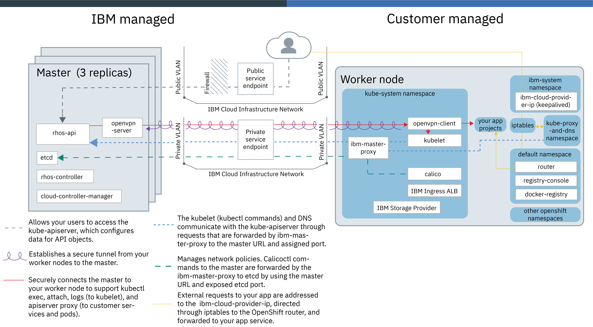

---

copyright:
  years: 2014, 2019
lastupdated: "2019-07-19"

keywords: kubernetes, iks, oks, iro, openshift, red hat, red hat openshift, rhos, roks, rhoks

subcollection: containers

---

{:new_window: target="_blank"}
{:shortdesc: .shortdesc}
{:screen: .screen}
{:pre: .pre}
{:table: .aria-labeledby="caption"}
{:codeblock: .codeblock}
{:tip: .tip}
{:note: .note}
{:important: .important}
{:deprecated: .deprecated}
{:download: .download}
{:preview: .preview}
{:tsSymptoms: .tsSymptoms}
{:tsCauses: .tsCauses}
{:tsResolve: .tsResolve}

# Tutorial: Creating an IBM Cloud Red Hat OpenShift Container Platform cluster (beta)
{: #openshift_tutorial} 

Red Hat OpenShift on IBM Cloud is available as a beta to test out OpenShift clusters. Not all the features of {{site.data.keyword.containerlong}} are available during the beta. Also, any OpenShift beta clusters that you create remain for only 30 days after the beta ends and Red Hat OpenShift on IBM Cloud becomes generally available.
{: preview}

With the **Red Hat OpenShift on IBM Cloud beta**, you can create {{site.data.keyword.containerlong_notm}} clusters with worker nodes that come installed with the Red Hat OpenShift on IBM Cloud Container Platform orchestration software. You get all the [advantages of managed {{site.data.keyword.containerlong_notm}}](/docs/containers?topic=containers-responsibilities_iks) for your cluster infrastructure environment, while using the [OpenShift tooling and catalog ](https://docs.openshift.com/container-platform/3.11/welcome/index.html) that runs on Red Hat Enterprise Linux for your app deployments.
{: shortdesc}

OpenShift worker nodes are available for paid accounts and standard clusters only. Red Hat OpenShift on IBM Cloud supports OpenShift version 3.11 only, which includes Kubernetes version 1.11. The operating system is Red Hat Enterprise Linux 7.
{: note}

## Objectives
{: #openshift_objectives}

In the tutorial lessons, you create a standard Red Hat OpenShift on IBM Cloud cluster, open the OpenShift console, access built-in OpenShift components, deploy an app that uses {{site.data.keyword.cloud_notm}} services in an OpenShift project, and expose the app on an OpenShift route so that external users can access the service.
{: shortdesc}

This page also includes information about the OpenShift cluster architecture, beta limitations, and how to give feedback and get support.

## Time required
{: #openshift_time}
45 minutes

## Audience
{: #openshift_audience}

This tutorial is for cluster administrators who want to learn how to create a Red Hat OpenShift on IBM Cloud cluster for the first time.
{: shortdesc}

## Prerequisites
{: #openshift_prereqs}

*   Ensure that you have the following {{site.data.keyword.cloud_notm}} IAM access policies.
    *   The [**Administrator** platform role](/docs/containers?topic=containers-users#platform) for {{site.data.keyword.containerlong_notm}}
    *   The [**Writer** or **Manager** service role](/docs/containers?topic=containers-users#platform) for {{site.data.keyword.containerlong_notm}}
    *   The [**Administrator** platform role](/docs/containers?topic=containers-users#platform) for {{site.data.keyword.registrylong_notm}}
*    Make sure that the [API key](/docs/containers?topic=containers-users#api_key) for the {{site.data.keyword.cloud_notm}} region and resource group is set up with the correct infrastructure permissions, **Super User**, or the [minimum roles](/docs/containers?topic=containers-access_reference#infra) to create a cluster.
*   Install the command-line tools.
    *   [Install the {{site.data.keyword.cloud_notm}} CLI (`ibmcloud`), {{site.data.keyword.containershort_notm}} plug-in (`ibmcloud ks`), and {{site.data.keyword.registryshort_notm}} plug-in (`ibmcloud cr`)](/docs/containers?topic=containers-cs_cli_install#cs_cli_install_steps).
    *   [Install the OpenShift Origin (`oc`) and Kubernetes (`kubectl`) CLIs](/docs/containers?topic=containers-cs_cli_install#cli_oc).

<br />


## Architectural overview
{: #openshift_architecture}

The following diagram and table describe the default components that are set up in a Red Hat OpenShift on IBM Cloud architecture.
{: shortdesc}



| Master components| Description |
|:-----------------|:-----------------|
| Replicas | Master components, including the OpenShift Kubernetes API server and etcd data store have three replicas and, if located in a multizone metro, are spread across zones for even higher availability. The master components are backed up every 8 hours.|
| `rhos-api` | The OpenShift Kubernetes API server serves as the main entry point for all cluster management requests from the worker node to the master. The API server validates and processes requests that change the state of Kubernetes resources, such as pods or services, and stores this state in the etcd data store.|
| `openvpn-server` | The OpenVPN server works with the OpenVPN client to securely connect the master to the worker node. This connection supports `apiserver proxy` calls to your pods and services, and `kubectl exec`, `attach`, and `logs` calls to the kubelet.|
| `etcd` | etcd is a highly available key value store that stores the state of all Kubernetes resources of a cluster, such as services, deployments, and pods. Data in etcd is backed up to an encrypted storage instance that IBM manages.|
| `rhos-controller` | The OpenShift controller manager watches for newly created pods and decides where to deploy them based on capacity, performance needs, policy constraints, anti-affinity specifications, and workload requirements. If no worker node can be found that matches the requirements, the pod is not deployed in the cluster. The controller also watches the state of cluster resources, such as replica sets. When the state of a resource changes, for example if a pod in a replica set goes down, the controller manager initiates correcting actions to achieve the required state. The `rhos-controller` functions as both the scheduler and controller manager in a community Kubernetes configuration. |
| `cloud-controller-manager` | The cloud controller manager manages cloud provider-specific components such as the {{site.data.keyword.cloud_notm}} load balancer.|
{: caption="Table 1. OpenShift master components." caption-side="top"}
{: #rhos-components-1}
{: tab-title="Master"}
{: tab-group="rhos-components"}
{: class="simple-tab-table"}

| Worker node components| Description |
|:-----------------|:-----------------|
| Operating System | Red Hat OpenShift on IBM Cloud worker nodes run on the Red Hat Enterprise Linux 7 operating system. |
| Projects | OpenShift organizes your resources into projects, which are Kubernetes namespaces with annotations, and includes many more components than community Kubernetes clusters to run OpenShift features such as the catalog. Select components of projects are described in the following rows. For more information, see [Projects and users ](https://docs.openshift.com/container-platform/3.11/architecture/core_concepts/projects_and_users.html).|
| `kube-system` | This namespace includes many components that are used to run Kubernetes on the worker node.<ul><li>**`ibm-master-proxy`**: The `ibm-master-proxy` is a daemon set that forwards requests from the worker node to the IP addresses of the highly available master replicas. In single zone clusters, the master has three replicas on separate hosts. For clusters that are in a multizone-capable zone, the master has three replicas that are spread across zones. A highly available load balancer forwards requests to the master domain name to the master replicas.</li><li>**`openvpn-client`**: The OpenVPN client works with the OpenVPN server to securely connect the master to the worker node. This connection supports `apiserver proxy` calls to your pods and services, and `kubectl exec`, `attach`, and `logs` calls to the kubelet.</li><li>**`kubelet`**: The kubelet is a worker node agent that runs on every worker node and is responsible for monitoring the health of pods that run on the worker node and for watching the events that the Kubernetes API server sends. Based on the events, the kubelet creates or removes pods, ensures liveness and readiness probes, and reports back the status of the pods to the Kubernetes API server.</li><li>**`calico`**: Calico manages network policies for your cluster, and includes a few components to manage container network connectivity, IP address assignment, and network traffic control.</li><li>**Other components**: The `kube-system` namespace also includes components to manage IBM-provided resources such as storage plug-ins for file and block storage, ingress application load balancer (ALB), `fluentd` logging, and `keepalived`.</li></ul>|
| `ibm-system` | This namespace includes the `ibm-cloud-provider-ip` deployment that works with `keepalived` to provide health checking and Layer 4 load balancing for requests to app pods.|
| `kube-proxy-and-dns`| This namespace includes the components to validate incoming network traffic against the `iptables` rules that are set up on the worker node, and proxies requests that are allowed to enter or leave the cluster.|
| `default` | This namespace is used if you do not specify a namespace or create a project for your Kubernetes resources. In addition, the default namespace includes the following components to support your OpenShift clusters.<ul><li>**`router`**: OpenShift uses [routes ](https://docs.openshift.com/container-platform/3.11/architecture/networking/routes.html) to expose an app's service on a host name so that external clients can reach the service. The router maps the service to the host name.</li><li>**`docker-registry`** and **`registry-console`**: OpenShift provides an internal [container image registry ](https://docs.openshift.com/container-platform/3.11/install_config/registry/index.html) that you can use to locally manage and view images through the console. Alternatively, you can set up the private {{site.data.keyword.registrylong_notm}}.</li></ul>|
| Other projects | Other components are installed in various namespaces by default to enable functionality such as logging, monitoring, and the OpenShift console.<ul><li><code>ibm-cert-store</code></li><li><code>kube-public</code></li><li><code>kube-service-catalog</code></li><li><code>openshift</code></li><li><code>openshift-ansible-service-broker</code></li><li><code>openshift-console</code></li><li><code>openshift-infra</code></li><li><code>openshift-monitoring</code></li><li><code>openshift-node</code></li><li><code>openshift-template-service-broker</code></li><li><code>openshift-web-console</code></li></ul>|
{: caption="Table 2. OpenShift worker node components." caption-side="top"}
{: #rhos-components-2}
{: tab-title="Worker nodes"}
{: tab-group="rhos-components"}
{: class="simple-tab-table"}

<br />


## Lesson 1: Creating a Red Hat OpenShift on IBM Cloud cluster
{: #openshift_create_cluster}

You can create a Red Hat OpenShift on IBM Cloud cluster in {{site.data.keyword.containerlong_notm}} by using the [console](#openshift_create_cluster_console) or [CLI](#openshift_create_cluster_cli). To learn about what components are set up when you create a cluster, see the [Architecture overview](#openshift_architecture). OpenShift is available for only standard clusters. You can learn more about the price of standard clusters in the [frequently asked questions](/docs/containers?topic=containers-faqs#charges).
{:shortdesc}

Any OpenShift clusters that you create during the beta remain for 30 days after the beta ends and Red Hat OpenShift on IBM Cloud becomes generally available.
{: important}

### Creating a cluster with the console
{: #openshift_create_cluster_console}

Create a standard OpenShift cluster in the {{site.data.keyword.containerlong_notm}} console.
{: shortdesc}

Before you begin, [complete the prerequisites](#openshift_prereqs) to make sure that you have the appropriate permissions to create a cluster.

1.  Create a cluster.
    1.  Log in to your [{{site.data.keyword.cloud_notm}} account ](https://cloud.ibm.com/).
    2.  From the hamburger menu , select **Kubernetes** and then click **Create cluster**.
    3.  Choose your cluster setup details and name. For the beta, OpenShift clusters are available only as standard clusters that are located in Washington, DC and London data centers.
        *   For **Select a plan**, choose **Standard**.
        *   For the **Cluster type and version**, choose **OpenShift**. Red Hat OpenShift on IBM Cloud supports OpenShift version 3.11 only, which includes Kubernetes version 1.11. The operating system is Red Hat Enterprise Linux 7.
        *   Fill out your cluster name, resource group, and tags.
        *   For the **Location**, set the geography to **North America** or **Europe**, select either a **Single zone** or **Multizone** availability, and then select **Washington, DC** or **London** worker zones.
        *   For **Default worker pool**, choose an available flavor for your worker nodes, ideally with at least 4 cores and 16 GB RAM.
        *   Set a number of worker nodes to create per zone, such as 3.
    4.  To finish, click **Create cluster**.<p class="note">Your cluster creation might take some time to complete. After the cluster state shows **Normal**, the cluster network and load-balancing components take about 10 more minutes to deploy and update the cluster domain that you use for the OpenShift web console and other routes. Wait until the cluster is ready before continuing to the next step by checking that the **Ingress subdomain** follows a pattern of `<cluster_name>.<region>.containers.appdomain.cloud`.</p>
2.  From the cluster details page, click **OpenShift web console**.
3.  From the dropdown menu in the OpenShift container platform menu bar, click **Application Console**. The Application Console lists all project namespaces in your cluster. You can navigate to a namespace to view your applications, builds, and other Kubernetes resources.
4.  To complete the next lesson by working in the terminal: From the OpenShift web console menu bar, click your profile **IAM#user.name@email.com > Copy Login Command**. Paste the copied `oc` login command into your terminal to authenticate via the CLI.

### Creating a cluster with the CLI
{: #openshift_create_cluster_cli}

Create a standard OpenShift cluster by using the {{site.data.keyword.cloud_notm}} CLI.
{: shortdesc}

Before you begin, [complete the prerequisites](#openshift_prereqs) to make sure that you have the appropriate permissions to create a cluster, the `ibmcloud` CLI and plug-ins, and the `oc` and `kubectl` CLIs.

1.  Log in to the account that you set up to create OpenShift clusters. Target the **us-east** or **eu-gb** region and the resource group. If you have a federated account, include the `--sso` flag.
    ```
    ibmcloud login -r (us-east|eu-gb) [-g default] [--sso]
    ```
    {: pre}
2.  Create a cluster.
    ```
    ibmcloud ks cluster-create --name <name> --location <zone> --kube-version <openshift_version> --machine-type <worker_node_flavor> --workers <number_of_worker_nodes_per_zone> --public-vlan <public_VLAN_ID> --private-vlan <private_VLAN_ID>
    ```
    {: pre}

    Example command to create a cluster with three workers nodes that have four cores and 16 GB memory in Washington, DC.

    ```
    ibmcloud ks cluster-create --name my_openshift --location wdc04 --kube-version 3.11_openshift --machine-type b3c.4x16.encrypted  --workers 3 --public-vlan <public_VLAN_ID> --private-vlan <private_VLAN_ID>
    ```
    {: pre}

    <table summary="The first row in the table spans both columns. The rest of the rows should be read left to right, with the command component in column one and the matching description in column two.">
    <caption>cluster-create components</caption>
    <thead>
    <th colspan=2> Understanding this command's components</th>
    </thead>
    <tbody>
    <tr>
    <td><code>cluster-create</code></td>
    <td>The command to create a classic infrastructure cluster in your {{site.data.keyword.cloud_notm}} account.</td>
    </tr>
    <tr>
    <td><code>--name <em>&lt;name&gt;</em></code></td>
    <td>Enter a name for your cluster. The name must start with a letter, can contain letters, numbers, and hyphen (-), and must be 35 characters or fewer. Use a name that is unique across {{site.data.keyword.cloud_notm}} regions.</td>
    </tr>
    <tr>
    <td><code>--location <em>&lt;zone&gt;</em></code></td>
    <td>Specify the zone where you want to create your cluster. For the beta, available zones are `wdc04, wdc06, wdc07, lon04, lon05,` or `lon06`.</p></td>
    </tr>
    <tr>
      <td><code>--kube-version <em>&lt;openshift_version&gt;</em></code></td>
      <td>You must choose a supported OpenShift version. OpenShift versions include a Kubernetes version that differs from the Kubernetes versions that are available on community Kubernetes Ubuntu clusters. To list available OpenShift versions, run `ibmcloud ks versions`. To create a cluster with the latest the patch version, you can specify just the major and minor version, such as ` 3.11_openshift`.<br><br>Red Hat OpenShift on IBM Cloud supports OpenShift version 3.11 only, which includes Kubernetes version 1.11. The operating system is Red Hat Enterprise Linux 7.</td>
    </tr>
    <tr>
    <td><code>--machine-type <em>&lt;worker_node_flavor&gt;</em></code></td>
    <td>Choose a machine type. You can deploy your worker nodes as virtual machines on shared or dedicated hardware, or as physical machines on bare metal. Available physical and virtual machines types vary by the zone in which you deploy the cluster. To list available machine-types, run `ibmcloud ks machine-types --zone <zone>`.</td>
    </tr>
    <tr>
    <td><code>--workers <em>&lt;number_of_worker_nodes_per_zone&gt;</em></code></td>
    <td>The number of worker nodes to include in the cluster. You might want to specify at least three worker nodes so that your cluster has enough resources to run the default components and for high availability. If the <code>--workers</code> option is not specified, one worker node is created.</td>
    </tr>
    <tr>
    <td><code>--public-vlan <em>&lt;public_vlan_id&gt;</em></code></td>
    <td>If you already have a public VLAN set up in your IBM Cloud infrastructure account for that zone, enter the ID of the public VLAN. To check available VLANs, run `ibmcloud ks vlans --zone <zone>`. <br><br>If you do not have a public VLAN in your account, do not specify this option. {{site.data.keyword.containerlong_notm}} automatically creates a public VLAN for you.</td>
    </tr>
    <tr>
    <td><code>--private-vlan <em>&lt;private_vlan_id&gt;</em></code></td>
    <td>If you already have a private VLAN set up in your IBM Cloud infrastructure account for that zone, enter the ID of the private VLAN. To check available VLANs, run `ibmcloud ks vlans --zone <zone>`. <br><br>If you do not have a private VLAN in your account, do not specify this option. {{site.data.keyword.containerlong_notm}} automatically creates a private VLAN for you.</td>
    </tr>
    </tbody></table>
3.  List your cluster details. Review the cluster **State**, check the **Ingress Subdomain**, and note the **Master URL**.<p class="note">Your cluster creation might take some time to complete. After the cluster state shows **Normal**, the cluster network and load-balancing components take about 10 more minutes to deploy and update the cluster domain that you use for the OpenShift web console and other routes. Wait until the cluster is ready before continuing to the next step by checking that the **Ingress Subdomain** follows a pattern of `<cluster_name>.<region>.containers.appdomain.cloud`.</p>
    ```
    ibmcloud ks cluster-get --cluster <cluster_name_or_ID>
    ```
    {: pre}
4.  Download the configuration files to connect to your cluster.
    ```
    ibmcloud ks cluster-config --cluster <cluster_name_or_ID>
    ```
    {: pre}

    When the download of the configuration files is finished, a command is displayed that you can copy and paste to set the path to the local Kubernetes configuration file as an environment variable.

    Example for OS X:

    ```
    export KUBECONFIG=/Users/<user_name>/.bluemix/plugins/kubernetes-service/clusters/<cluster_name>/kube-config-<datacenter>-<cluster_name>.yml
    ```
    {: screen}
5.  In your browser, navigate to the address of your **Master URL** and append `/console`. For example, `https://c0.containers.cloud.ibm.com:23652/console`.
6.  From the OpenShift web console menu bar, click your profile **IAM#user.name@email.com > Copy Login Command**. Paste the copied `oc` login command into your terminal to authenticate via the CLI.<p class="tip">Save your cluster master URL to access the OpenShift console later. In future sessions, you can skip the `cluster-config` step and copy the login command from the console instead.</p>
7.  Verify that the `oc` commands run properly with your cluster by checking the version.

    ```
    oc version
    ```
    {: pre}

    Example output:

    ```
    oc v3.11.0+0cbc58b
    kubernetes v1.11.0+d4cacc0
    features: Basic-Auth

    Server https://c0.containers.cloud.ibm.com:23652
    openshift v3.11.98
    kubernetes v1.11.0+d4cacc0
    ```
    {: screen}

    If you cannot perform operations that require Administrator permissions, such as listing all the worker nodes or pods in a cluster, download the TLS certificates and permission files for the cluster administrator by running the `ibmcloud ks cluster-config --cluster <cluster_name_or_ID> --admin` command.
    {: tip}

<br />


## Lesson 2: Accessing built-in OpenShift services
{: #openshift_access_oc_services}

Red Hat OpenShift on IBM Cloud comes with built-in services that you can use to help operate your cluster, such as the OpenShift console, Prometheus, and Grafana. For the beta, to access these services, you can use the local host of a [route ](https://docs.openshift.com/container-platform/3.11/architecture/networking/routes.html). The default route domain names follow a cluster-specific pattern of `<service_name>-<namespace>.<cluster_name>-<random_ID>.<region>.containers.appdomain.cloud`.
{:shortdesc}

You can access the built-in OpenShift service routes from the [console](#openshift_services_console) or [CLI](#openshift_services_cli). You might want to use the console to navigate through Kubernetes resources in one project. By using the CLI, you can list resources such as routes across projects.

### Accessing built-in OpenShift services from the console
{: #openshift_services_console}
1.  From the OpenShift web console, in the dropdown menu in the OpenShift container platform menu bar, click **Application Console**.
2.  Select the **default** project, then in the navigation pane, click **Applications > Pods**.
3.  Verify that the **router** pods are in a **Running** status. The router functions as the ingress point for external network traffic. You can use the router to publicly expose the services in your cluster on the router's external IP address by using a route. The router listens on the public host network interface, unlike your app pods that listen only on private IPs. The router proxies external requests for route host names to the IPs of the app pods that are identified by the service that you associated with the route host name.
4.  From the **default** project navigation pane, click **Applications > Deployments** and then click the **registry-console** deployment. Your OpenShift cluster comes with an internal registry that you can use to manage local images for your deployments. To view your images, click **Applications > Routes** and open the registry console **Hostname** URL.
5.  In the OpenShift container platform menu bar, from the dropdown menu, click **Cluster Console**.
6.  From the navigation pane, expand **Monitoring**.
7.  Click the built-in monitoring tool that you want to access, such as **Dashboards**. The Grafana route opens, `https://grafana-openshift-monitoring.<cluster_name>-<random_ID>.<region>.containers.appdomain.cloud`.<p class="note">The first time that you access the host name, you might need to authenticate, such as by clicking **Log in with OpenShift** and authorizing access to your IAM identity.</p>

### Accessing built-in OpenShift services from the CLI
{: #openshift_services_cli}

1.  From the **Application Console** or **Service Console** view in the OpenShift  web console, click your profile **IAM#user.name@email.com > Copy Login Command** and paste the login command into your terminal to authenticate.
    ```
    oc login https://c1-e.<region>.containers.cloud.ibm.com:<port> --token=<access_token>
    ```
    {: pre}
2.  Verify that your router is deployed. The router functions as the ingress point for external network traffic. You can use the router to publicly expose the services in your cluster on the router's external IP address by using a route. The router listens on the public host network interface, unlike your app pods that listen only on private IPs. The router proxies external requests for route host names to the IPs of the app pods that are identified by the service that you associated with the route host name.
    ```
    oc get svc router -n default
    ```
    {: pre}

    Example output:
    ```
    NAME      TYPE           CLUSTER-IP               EXTERNAL-IP     PORT(S)                      AGE
    router    LoadBalancer   172.21.xxx.xxx   169.xx.xxx.xxx   80:30399/TCP,443:32651/TCP                      5h
    ```
    {: screen}
2.  Get the **Host/Port** host name of the service route that you want to access. For example, you might want to access your Grafana dashboard to check metrics on your cluster's resource usage. The default route domain names follow a cluster-specific pattern of `<service_name>-<namespace>.<cluster_name>-<random_ID>.<region>.containers.appdomain.cloud`.
    ```
    oc get route --all-namespaces
    ```
    {: pre}

    Example output:
    ```
    NAMESPACE                          NAME                HOST/PORT                                                                    PATH                  SERVICES            PORT               TERMINATION          WILDCARD
    default                            registry-console    registry-console-default.<cluster_name>-<random_ID>.<region>.containers.appdomain.cloud                              registry-console    registry-console   passthrough          None
    kube-service-catalog               apiserver           apiserver-kube-service-catalog.<cluster_name>-<random_ID>.<region>.containers.appdomain.cloud                        apiserver           secure             passthrough          None
    openshift-ansible-service-broker   asb-1338            asb-1338-openshift-ansible-service-broker.<cluster_name>-<random_ID>.<region>.containers.appdomain.cloud            asb                 1338               reencrypt            None
    openshift-console                  console             console.<cluster_name>-<random_ID>.<region>.containers.appdomain.cloud                                              console             https              reencrypt/Redirect   None
    openshift-monitoring               alertmanager-main   alertmanager-main-openshift-monitoring.<cluster_name>-<random_ID>.<region>.containers.appdomain.cloud                alertmanager-main   web                reencrypt            None
    openshift-monitoring               grafana             grafana-openshift-monitoring.<cluster_name>-<random_ID>.<region>.containers.appdomain.cloud                          grafana             https              reencrypt            None
    openshift-monitoring               prometheus-k8s      prometheus-k8s-openshift-monitoring.<cluster_name>-<random_ID>.<region>.containers.appdomain.cloud                   prometheus-k8s      web                reencrypt
    ```
    {: screen}
3.  In your web browser, open the route that you want to access, for example: `https://grafana-openshift-monitoring.<cluster_name>-<random_ID>.<region>.containers.appdomain.cloud`. The first time that you access the host name, you might need to authenticate, such as by clicking **Log in with OpenShift** and authorizing access to your IAM identity.

<br>
Now you're in the built-in OpenShift app! For example, if you're in Grafana, you might check out your namespace CPU usage or other graphs. To access other built-in tools, open their route host names.

<br />


## Lesson 3: Deploying an app to your OpenShift cluster
{: #openshift_deploy_app}

With Red Hat OpenShift on IBM Cloud, you can create a new app and expose your app service via an OpenShift router for external users to use.
{: shortdesc}

If you took a break from the last lesson and started a new terminal, make sure that you log back in to your cluster. Open your OpenShift web console at `https://<master_URL>/console`. For example, `https://c0.containers.cloud.ibm.com:23652/console`. Then from the menu bar, click your profile **IAM#user.name@email.com > Copy Login Command** and paste the copied `oc` login command into your terminal to authenticate via the CLI.
{: tip}

1.  Create a project for your Hello World app. A project is an OpenShift version of a Kubernetes namespace with additional annotations.
    ```
    oc new-project hello-world
    ```
    {: pre}
2.  Build the sample app [from the source code ](https://github.com/IBM/container-service-getting-started-wt). With the OpenShift `new-app` command, you can refer to a directory in a remote repository that contains the Dockerfile and app code to build your image. The command builds the image, stores the image in the local Docker registry, and creates the app deployment configurations (`dc`) and services (`svc`). For more information about creating new apps, [see the OpenShift docs ](https://docs.openshift.com/container-platform/3.11/dev_guide/application_lifecycle/new_app.html).
    ```
    oc new-app --name hello-world https://github.com/IBM/container-service-getting-started-wt --context-dir="Lab 1"
    ```
    {: pre}
3.  Verify that the sample Hello World app components are created.
    1.  List the **hello-world** services and note the service name. Your app listens for traffic on these internal cluster IP addresses unless you create a route for the service so that the router can forward external traffic requests to the app.
        ```
        oc get svc -n hello-world
        ```
        {: pre}

        Example output:
        ```
        NAME          TYPE        CLUSTER-IP       EXTERNAL-IP   PORT(S)    AGE
        hello-world   ClusterIP   172.21.xxx.xxx   <nones>       8080/TCP   31m
        ```
        {: screen}
    2.  List the pods. Pods with `build` in the name are jobs that **Completed** as part of the new app build process. Make sure that the **hello-world** pod status is **Running**.
        ```
        oc get pods -n hello-world
        ```
        {: pre}

        Example output:
        ```
        NAME                READY     STATUS             RESTARTS   AGE
        hello-world-9cv7d   1/1       Running            0          30m
        hello-world-build   0/1       Completed          0          31m
        ```
        {: screen}
4.  Set up a route so that you can publicly access the hello world service. By default, the host name is in the format of `<service_name>-<namespace>.<cluster_name>-<random_ID>.<region>.containers.appdomain.cloud`. If you want to customize the host name, include the `--hostname=<hostname>` flag.
    1.  Create a route for the **hello-world** service.
        ```
        oc create route edge --service=hello-world -n hello-world
        ```
        {: pre}
    2.  Get the route host name address from the **Host/Port** output.
        ```
        oc get route -n hello-world
        ```
        {: pre}
        Example output:
        ```
        NAME          HOST/PORT                         PATH                                        SERVICES      PORT       TERMINATION   WILDCARD
        hello-world   hello-world-hello.world.<cluster_name>-<random_ID>.<region>.containers.appdomain.cloud    hello-world   8080-tcp   edge/Allow    None
        ```
        {: screen}
5.  Access your app.
    ```
    curl https://hello-world-hello-world.<cluster_name>-<random_ID>.<region>.containers.appdomain.cloud
    ```
    {: pre}

    Example output:
    ```
    Hello world from hello-world-9cv7d! Your app is up and running in a cluster!
    ```
    {: screen}
6.  **Optional** To clean up the resources that you created in this lesson, you can use the labels that are assigned to each app.
    1.  List all the resources for each app in the `hello-world` project.
        ```
        oc get all -l app=hello-world -o name -n hello-world
        ```
        {: pre}
        Example output:
        ```
        pod/hello-world-1-dh2ff
        replicationcontroller/hello-world-1
        service/hello-world
        deploymentconfig.apps.openshift.io/hello-world
        buildconfig.build.openshift.io/hello-world
        build.build.openshift.io/hello-world-1
        imagestream.image.openshift.io/hello-world
        imagestream.image.openshift.io/node
        route.route.openshift.io/hello-world
        ```
        {: screen}
    2.  Delete all the resources that you created.
        ```
        oc delete all -l app=hello-world -n hello-world
        ```
        {: pre}


<br />


## Lesson 4: Setting up LogDNA and Sysdig add-ons to monitor cluster health
{: #openshift_logdna_sysdig}

Because OpenShift sets up stricter [Security Context Constraints (SCC) ](https://docs.openshift.com/container-platform/3.11/admin_guide/manage_scc.html) by default than community Kubernetes, you might find that some apps or cluster add-ons that you use on community Kubernetes cannot be deployed on OpenShift in the same way. In particular, many images require to run as a `root` user or as a privileged container, which is prevented in OpenShift by default. In this lesson, you learn how to modify the default SCCs by creating privileged security accounts and updating the `securityContext` in the pod specification to use two popular {{site.data.keyword.containerlong_notm}} add-ons: {{site.data.keyword.la_full_notm}} and {{site.data.keyword.mon_full_notm}}.
{: shortdesc}

Before you begin, log in to your cluster as an administrator.
1.  Open your OpenShift console at `https://<master_URL>/console`. For example, `https://c0.containers.cloud.ibm.com:23652/console`.
2.  From the OpenShift web console menu bar, click your profile **IAM#user.name@email.com > Copy Login Command** and paste the copied `oc` login command into your terminal to authenticate via the CLI.
3.  Download the admin configuration files for your cluster.
    ```
    ibmcloud ks cluster-config --cluster <cluster_name_or_ID> --admin
    ```
    {: pre}

    When the download of the configuration files is finished, a command is displayed that you can copy and paste to set the path to the local Kubernetes configuration file as an environment variable.

    Example for OS X:

    ```
    export KUBECONFIG=/Users/<user_name>/.bluemix/plugins/kubernetes-service/clusters/<cluster_name>/kube-config-<datacenter>-<cluster_name>.yml
    ```
    {: screen}
4.  Continue the lesson to set up [{{site.data.keyword.la_short}}](#openshift_logdna) and [{{site.data.keyword.mon_short}}](#openshift_sysdig).

### Lesson 4a: Setting up LogDNA
{: #openshift_logdna}

Set up a project and privileged service account for {{site.data.keyword.la_full_notm}}. Then, create a {{site.data.keyword.la_short}} instance in your {{site.data.keyword.cloud_notm}} account. To integrate your {{site.data.keyword.la_short}} instance with your OpenShift cluster, you must modify the daemon set that is deployed to use the privileged service account to run as root.
{: shortdesc}

1.  Set up the project and privileged service account for LogDNA.
    1.  As a cluster administrator, create a `logdna` project.
        ```
        oc adm new-project logdna
        ```
        {: pre}
    2.  Target the project so that the subsequent resources that you create are in the `logdna` project namespace.
        ```
        oc project logdna
        ```
        {: pre}
    3.  Create a service account for the `logdna` project.
        ```
        oc create serviceaccount logdna
        ```
        {: pre}
    4.  Add a privileged security context constraint to the service account for the `logdna` project.<p class="note">If you want to check what authorization the `privileged` SCC policy gives the service account, run `oc describe scc privileged`. For more information about SCCs, see the [OpenShift docs ](https://docs.openshift.com/container-platform/3.11/admin_guide/manage_scc.html).</p>
        ```
        oc adm policy add-scc-to-user privileged -n logdna -z logdna
        ```
        {: pre}
2.  Create your {{site.data.keyword.la_full_notm}} instance in the same resource group as your cluster. Select a pricing plan that determines the retention period for your logs, such as `lite` which retains logs for 0 days. The region does not have to match the region of your cluster. For more information, see [Provisioning an instance](/docs/services/Log-Analysis-with-LogDNA/tutorials?topic=LogDNA-provision) and [Pricing plans](/docs/services/Log-Analysis-with-LogDNA?topic=LogDNA-about#overview_pricing_plans).
    ```
    ibmcloud resource service-instance-create <service_instance_name> logdna (lite|7-days|14-days|30-days) <region> [-g <resource_group>]
    ```
    {: pre}

    Example command:
    ```
    ibmcloud resource service-instance-create logdna-openshift logdna lite us-south
    ```
    {: pre}

    In the output, note the service instance **ID**, which is in the format `crn:v1:bluemix:public:logdna:<region>:<ID_string>::`.
    ```
    Service instance <name> was created.

    Name:         <name>   
    ID:           crn:v1:bluemix:public:logdna:<region>:<ID_string>::   
    GUID:         <guid>   
    Location:     <region>   
    ...
    ```
    {: screen}    
3.  Get your {{site.data.keyword.la_short}} instance ingestion key. The LogDNA ingestion key is used to open a secure web socket to the LogDNA ingestion server and to authenticate the logging agent with the {{site.data.keyword.la_short}} service.
    1.  Create a service key for your LogDNA instance.
        ```
        ibmcloud resource service-key-create <key_name> Administrator --instance-id <logdna_instance_ID>
        ```
        {: pre}
    2.  Note the **ingestion_key** of your service key.
        ```
        ibmcloud resource service-key <key_name>
        ```
        {: pre}

        Example output:
        ```
        Name:          <key_name>  
        ID:            crn:v1:bluemix:public:logdna:<region>:<ID_string>::    
        Created At:    Thu Jun  6 21:31:25 UTC 2019   
        State:         active   
        Credentials:                                   
                       apikey:                   <api_key_value>      
                       iam_apikey_description:   Auto-generated for key <ID>     
                       iam_apikey_name:          <key_name>       
                       iam_role_crn:             crn:v1:bluemix:public:iam::::role:Administrator      
                       iam_serviceid_crn:        crn:v1:bluemix:public:iam-identity::<ID_string>     
                       ingestion_key:            111a11aa1a1a11a1a11a1111aa1a1a11    
        ```
        {: screen}
4.  Create a Kubernetes secret to store your LogDNA ingestion key for your service instance.
    ```
     oc create secret generic logdna-agent-key --from-literal=logdna-agent-key=<logDNA_ingestion_key>
    ```
    {: pre}
5.  Create a Kubernetes daemon set to deploy the LogDNA agent on every worker node of your Kubernetes cluster. The LogDNA agent collects logs with the extension `*.log` and extensionless files that are stored in the `/var/log` directory of your pod. By default, logs are collected from all namespaces, including `kube-system`, and automatically forwarded to the {{site.data.keyword.la_short}} service.
    ```
    oc create -f https://assets.us-south.logging.cloud.ibm.com/clients/logdna-agent-ds.yaml
    ```
    {: pre}
6.  Edit the LogDNA agent daemon set configuration to refer to the service account that you previously created and to set the security context to privileged.
    1.  Download a local copy of the configuration file to edit.
        ```
        oc get ds logdna-agent -n logdna -o yaml > logdna-ds.yaml
        ```
        {: pre}
    2.  In the configuration file, add the following specifications.
        *   In `spec.template.spec`, add `serviceAccount: logdna`.
        *   In `spec.template.spec.containers`, add `securityContext: privileged: true`.
        *   If you created your {{site.data.keyword.la_short}} instance in a region other than `us-south`, update the `spec.template.spec.containers.env` environment variable values for the `LDAPIHOST` and `LDLOGHOST` with the `<region>`.

        Example:
        ```
        apiVersion: extensions/v1beta1
        kind: DaemonSet
        spec:
          ...
          template:
            ...
            spec:
              serviceAccount: logdna
              containers:
              - securityContext:
                  privileged: true
                ...
                env:
                - name: LOGDNA_AGENT_KEY
                  valueFrom:
                    secretKeyRef:
                      key: logdna-agent-key
                      name: logdna-agent-key
                - name: LDAPIHOST
                  value: api.<region>.logging.cloud.ibm.com
                - name: LDLOGHOST
                  value: logs.<region>.logging.cloud.ibm.com
              ...
        ```
        {: screen}
    3.  Save the configuration file and apply your changes.
        ```
        oc apply -f logdna-ds.yaml
        ```
        {: pre}
7.  Verify that the `logdna-agent` pod on each node is in a **Running** status.
    ```
    oc get pods
    ```
    {: pre}
8.  From the [{{site.data.keyword.cloud_notm}} Observability > Logging console](https://cloud.ibm.com/observe/logging), in the row for your {{site.data.keyword.la_short}} instance, click **View LogDNA**. The LogDNA dashboard opens. After a few minutes, your cluster's logs are displayed, and you can begin to analyze your logs.

For more information about how to use {{site.data.keyword.la_short}}, see the [Next steps docs](/docs/services/Log-Analysis-with-LogDNA?topic=LogDNA-kube#kube_next_steps).

### Lesson 4b: Setting up Sysdig
{: #openshift_sysdig}

Create an {{site.data.keyword.mon_full_notm}} instance in your {{site.data.keyword.cloud_notm}} account. To integrate your {{site.data.keyword.mon_short}} instance with your OpenShift cluster, you must run a script that creates a project and privileged service account for the Sysdig agent.
{: shortdesc}

1.  Create your {{site.data.keyword.mon_full_notm}} instance in the same resource group as your cluster. Select a pricing plan that determines the retention period for your logs, such as `lite`. The region does not have to match the region of your cluster. For more information, see [Provisioning an instance](/docs/services/Monitoring-with-Sysdig?topic=Sysdig-provision).
    ```
    ibmcloud resource service-instance-create <service_instance_name> sysdig-monitor (lite|graduated-tier) <region> [-g <resource_group>]
    ```
    {: pre}

    Example command:
    ```
    ibmcloud resource service-instance-create sysdig-openshift sysdig-monitor lite us-south
    ```
    {: pre}

    In the output, note the service instance **ID**, which is in the format `crn:v1:bluemix:public:logdna:<region>:<ID_string>::`.
    ```
    Service instance <name> was created.

    Name:         <name>   
    ID:           crn:v1:bluemix:public:sysdig-monitor:<region>:<ID_string>::   
    GUID:         <guid>   
    Location:     <region>   
    ...
    ```
    {: screen}    
2.  Get your {{site.data.keyword.mon_short}} instance access key. The Sysdig access key is used to open a secure web socket to the Sysdig ingestion server and to authenticate the monitoring agent with the {{site.data.keyword.mon_short}} service.
    1.  Create a service key for your Sysdig instance.
        ```
        ibmcloud resource service-key-create <key_name> Administrator --instance-id <sysdig_instance_ID>
        ```
        {: pre}
    2.  Note the **Sysdig Access Key** and **Sysdig Collector Endpoint** of your service key.
        ```
        ibmcloud resource service-key <key_name>
        ```
        {: pre}

        Example output:
        ```
        Name:          <key_name>  
        ID:            crn:v1:bluemix:public:sysdig-monitor:<region>:<ID_string>::    
        Created At:    Thu Jun  6 21:31:25 UTC 2019   
        State:         active   
        Credentials:                                   
                       Sysdig Access Key:           11a1aa11-aa1a-1a1a-a111-11a11aa1aa11      
                       Sysdig Collector Endpoint:   ingest.<region>.monitoring.cloud.ibm.com      
                       Sysdig Customer Id:          11111      
                       Sysdig Endpoint:             https://<region>.monitoring.cloud.ibm.com  
                       apikey:                   <api_key_value>      
                       iam_apikey_description:   Auto-generated for key <ID>     
                       iam_apikey_name:          <key_name>       
                       iam_role_crn:             crn:v1:bluemix:public:iam::::role:Administrator      
                       iam_serviceid_crn:        crn:v1:bluemix:public:iam-identity::<ID_string>       
        ```
        {: screen}
3.  Run the script to set up an `ibm-observe` project with a privileged service account and a Kubernetes daemon set to deploy the Sysdig agent on every worker node of your Kubernetes cluster. The Sysdig agent collects metrics such as the worker node CPU usage, worker node memory usage, HTTP traffic to and from your containers, and data about several infrastructure components.

    In the following command, replace <code><sysdig_access_key></code> and <code><sysdig_collector_endpoint></code> with the values from the service key that you created earlier. For <code>&lt;tag&gt;</code>, you can associate tags with your Sysdig agent, such as `role:service,location:us-south` to help you identify the environment that the metrics come from.

    ```
    curl -sL https://ibm.biz/install-sysdig-k8s-agent | bash -s -- -a <sysdig_access_key> -c <sysdig_collector_endpoint> -t <tag> -ac 'sysdig_capture_enabled: false' --openshift
    ```
    {: pre}

    Example output:
    ```
    * Detecting operating system
    * Downloading Sysdig cluster role yaml
    * Downloading Sysdig config map yaml
    * Downloading Sysdig daemonset v2 yaml
    * Creating project: ibm-observe
    * Creating sysdig-agent serviceaccount in project: ibm-observe
    * Creating sysdig-agent access policies
    * Creating sysdig-agent secret using the ACCESS_KEY provided
    * Retreiving the IKS Cluster ID and Cluster Name
    * Setting cluster name as <cluster_name>
    * Setting ibm.containers-kubernetes.cluster.id 1fbd0c2ab7dd4c9bb1f2c2f7b36f5c47
    * Updating agent configmap and applying to cluster
    * Setting tags
    * Setting collector endpoint
    * Adding additional configuration to dragent.yaml
    * Enabling Prometheus
    configmap/sysdig-agent created
    * Deploying the sysdig agent
    daemonset.extensions/sysdig-agent created
    ```
    {: screen}

4.  Verify that the `sydig-agent` pods on each node show that **1/1** pods are ready and that each pod has a **Running** status.
    ```
    oc get pods
    ```
    {: pre}

    Example output:
    ```
    NAME                 READY     STATUS    RESTARTS   AGE
    sysdig-agent-qrbcq   1/1       Running   0          1m
    sysdig-agent-rhrgz   1/1       Running   0          1m
    ```
    {: screen}
5.  From the [{{site.data.keyword.cloud_notm}} Observability > Monitoring console](https://cloud.ibm.com/observe/logging), in the row for your {{site.data.keyword.mon_short}} instance, click **View Sysdig**. The Sysdig dashboard opens, and you can begin to analyze your cluster metrics.

For more information about how to use {{site.data.keyword.mon_short}}, see the [Next steps docs](/docs/services/Monitoring-with-Sysdig?topic=Sysdig-kubernetes_cluster#kubernetes_cluster_next_steps).

### Optional: Cleaning up
{: #openshift_logdna_sysdig_cleanup}

Remove the {{site.data.keyword.la_short}} and {{site.data.keyword.mon_short}} instances from your cluster and {{site.data.keyword.cloud_notm}} account. Note that unless you store the logs and metrics in [persistent storage](/docs/services/Log-Analysis-with-LogDNA?topic=LogDNA-archiving), you cannot access this information after you delete the instances from your account.
{: shortdesc}

1.  Clean up the {{site.data.keyword.la_short}} and {{site.data.keyword.mon_short}} instances in your cluster by removing the projects that you created for them. When you delete a project, its resources such as service accounts and daemon sets are also removed.
    ```
    oc delete project logdna
    ```
    {: pre}
    ```
    oc delete project ibm-observe
    ```
    {: pre}
2.  Remove the instances from your {{site.data.keyword.cloud_notm}} account.
    *   [Removing a {{site.data.keyword.la_short}} instance](/docs/services/Log-Analysis-with-LogDNA?topic=LogDNA-remove).
    *   [Removing a {{site.data.keyword.mon_short}} instance](/docs/services/Monitoring-with-Sysdig?topic=Sysdig-remove).

<br />


## Limitations
{: #openshift_limitations}

The Red Hat OpenShift on IBM Cloud beta is released with the following limitations.
{: shortdesc}

**Cluster**:
*   You can create only standard clusters, not free clusters. Instead, you can create a free Kubernetes cluster, and then re-deploy the apps you try out in the Kubernetes cluster to your OpenShift cluster.
*   Locations are available in two multizone metro areas, Washington, DC and London. Supported zones are `wdc04, wdc06, wdc07, lon04, lon05,` and `lon06`.
*   You cannot create a cluster with worker nodes that run multiple operating systems, such as OpenShift on Red Hat Enterprise Linux and community Kubernetes on Ubuntu.
*   The [cluster autoscaler](/docs/containers?topic=containers-ca) is not supported because it requires Kubernetes version 1.12 or later. OpenShift 3.11 includes only Kubernetes version 1.11.


**Storage**:
*   {{site.data.keyword.cloud_notm}} file, block, and cloud object storage are supported. Portworx software-defined storage (SDS) is not supported.
*   Because of the way that {{site.data.keyword.cloud_notm}} NFS file storage configures Linux user permissions, you might encounter errors when you use file storage. If so, you might need to configure [OpenShift Security Context Constraints ](https://docs.openshift.com/container-platform/3.11/admin_guide/manage_scc.html) or use a different storage type.

**Networking**:
*   Calico is used as the networking policy provider instead of OpenShift SDN. To use Calico, you must download and edit the configuration file to use the master endpoint.
    1.  Download the Calico configuration file for your cluster. Note the file path in the output.
        ```
        ibmcloud ks cluster-config --cluster <cluster_name_or_ID> --network
        ```
        {: pre}

        Example output:
        ```
        The configuration for <cluster_name> was downloaded successfully.

        Network Config:

        /Users/<user_name>/.bluemix/plugins/container-service/clusters/<cluster_name>-admin/calicoctl.cfg
        ```
        {: screen}
    2.  Open the `calicoctl.cfg` file. In the `etcdEndpoints` field, remove the `-e` in the endpoint URL. For example, change `https://c1-e.<region>.containers.cloud.ibm.com:20357` to `https://c1.<region>.containers.cloud.ibm.com:20357`.
    3.  Save the `calicoctl.cfg` file.
    4.  Verify that Calico can connect to the cluster by listing the worker nodes. Depending on how Calico is set up on your operating system, you might need to include the file path to your `calicoctl.cfg` file in the `--config` flag.
        ```
        calicoctl get nodes --config <filepath_to_calicoctl.cfg>
        ```
        {: pre}
    5.  Repeat these steps each time that you need to download the Calico configuration file.

**Add-ons, integrations, and other services**:
*   {{site.data.keyword.containerlong_notm}} add-ons such as Istio, Knative, and the Kubernetes terminal are not available.
*   Helm charts are not certified to work in OpenShift clusters, except {{site.data.keyword.cloud_notm}} Object Storage.

**Apps**:
*   OpenShift sets up stricter security settings by default than community Kubernetes. For more information, see the OpenShift docs for [Managing Security Context Constraints (SCC) ](https://docs.openshift.com/container-platform/3.11/admin_guide/manage_scc.html).
*   For example, apps that are configured to run as root might fail, with the pods in a `CrashLoopBackOff` status. To resolve this issue, you can either modify the default security context constraints or use an image that does not run as root.
*   OpenShift are set up by default with a local Docker registry. If you want to use images that are stored in your remote private {{site.data.keyword.registrylong_notm}} `icr.io` domain names, you must create the secrets for each global and regional registry yourself. You can [copy the `default-<region>-icr-io` secrets](/docs/containers?topic=containers-images#copy_imagePullSecret) from the `default` namespace to the namespace that you want to pull images from, or [create your own secret](/docs/containers?topic=containers-images#other_registry_accounts). Then, [add the image pull secret](/docs/containers?topic=containers-images#use_imagePullSecret) to your deployment configuration or to the namespace service account.
*   The OpenShift console is used instead of the Kubernetes dashboard.

<br />


## What's next?
{: #openshift_next}

For more information about working with your apps and routing services, see the [OpenShift Developer Guide](https://docs.openshift.com/container-platform/3.11/dev_guide/index.html).

<br />


## Feedback and questions
{: #openshift_support}

During the beta, Red Hat OpenShift on IBM Cloud clusters are not covered by IBM Support nor Red Hat Support. Any support that is provided is to help you evaluate the product in preparation for its general availability.
{: important}

For any questions or feedback, post in Slack.
*   If you are an external user, post in the [#openshift ](https://ibm-container-service.slack.com/messages/CKCJLJCH4) channel.
*   If you are an IBMer, use the [#iks-openshift-users ](https://ibm-argonauts.slack.com/messages/CJH0UPN2D) channel.

If you do not use an IBMid for your {{site.data.keyword.cloud_notm}} account, [request an invitation](https://bxcs-slack-invite.mybluemix.net/) to this Slack.
{: tip}

## Troubleshooting
{: #openshift_troubleshoot}

Review some known issues or common error messages that you might encounter when trying out the Red Hat OpenShift on IBM Cloud beta.
{: shortdesc}

### Missing permissions to create clusters
{: #rhoks_ts_cluster_permissions}

{: tsSymptoms}
You do not have permissions to create a cluster.

{: tsCauses}
To create an OpenShift cluster, you must have the same permissions as you need to create a community Kubernetes cluster. The required permissions include infrastructure credentials for the region and resource group and {{site.data.keyword.cloud_notm}} Identity and Access Management (IAM) **Administrator** permissions.

{: tsResolve}
Review [Assigning cluster access](https://cloud.ibm.com/docs/containers?topic=containers-users) to learn how to set up infrastructure credentials for a region and resource group and how to assign users access through IAM.

<br />

### OpenVPN server error due to ingress IP address for NLB
{: #rhoks_ts_openvpn_subnet}

{: tsSymptoms}
You see the following error message.
```
CAE003: Unable to determine the ingress IP address for the network load balancer.
```
{: screen}

{: tsCauses}
The OpenVPN server could not be configured because the router IP address that is created for the network load balancer (NLB) could not be found. The router might not have been assigned an IP address because your cluster does not have a subnet with available portable IP addresses, or the Ingress setup did not complete.

{: tsResolve}

**Verify that your cluster has available subnets.**
1.  Check that your cluster has a **Subnet CIDR** for public and private subnets. If you set up a private VLAN-only cluster, you might only have a private subnet.
    ```
    ibmcloud ks cluster-get --cluster <cluster_name_or_ID> --showResources
    ```
    {: pre}

    Example output:
    ```
    Name:                           <cluster_name>   
    ...

    Subnet VLANs
    VLAN ID   Subnet CIDR        Public   User-managed   
    2345678   10.xxx.xx.xxx/29   false    false   
    2876543   169.xx.xxx.xxx/29  true     false
    ```
    {: screen}
2.  If the cluster does not have a subnet, [create a subnet for the cluster](/docs/containers?topic=containers-subnets#request) or [add an existing subnet from your account to the cluster](/docs/containers?topic=containers-subnets#add-existing).
3.  If the cluster does have a subnet, [check for available portable IP addresses](/docs/containers?topic=containers-subnets#review_ip) and if necessary, [add more portable IP address by adding a subnet](/docs/containers?topic=containers-subnets#adding_ips).
4.  Refresh the master to restart the OpenVPN setup so that it uses the available subnet.
    ```
    ibmcloud ks cluster-refresh --cluster <cluster_name_or_ID>
    ```
    {: pre}

**Verify that the Ingress setup completed successfully.**
1.  Check that the `ibm-cloud-provider-ip-*` pods for Ingress are in a **Running** status.
    ```
    oc get pods -n kube-system | grep alb
    ```
    {: pre}
2.  If a pod is not running, review the **Events** in the pod details to troubleshoot the issue further.
    ```
    oc describe pod -n kube-system <pod_name>
    ```
    {: pre}
3.  After you resolve the Ingress pod issue, refresh the master to restart the Ingress setup.
    ```
    ibmcloud ks cluster-refresh --cluster <cluster_name_or_ID>
    ```
    {: pre}

<br />

### OpenVPN server error due to NLB DNS
{: #rhoks_ts_openvpn_dns}

{: tsSymptoms}
Could not create a domain name service for the network load balancer ('ibmcloud ks nlb-dns-create') with the following error message:<ul>
<li><code>This action requires the Editor role for the cluster in IBM Cloud Container Service. Contact the IBM Cloud account administrator and request the required Identity and Access user role. (A0008)</code></li>
<li><code>The specified cluster could not be found. (A0006)</code></li>
<li><code>The input parameters in the request body are either incomplete or in the wrong format. Be sure to include all required parameters in your request in JSON format. (E0011)</code></li><ul>

{: tsCauses}
The OpenVPN server could not be configured because a domain name service (DNS) was not created for the network load balancer (NLB).

{: tsResolve}
1.  Check that you have the correct permissions in {{site.data.keyword.cloud_notm}} IAM. If not, contact your account administrator to [assign you the appropriate IAM platform or service access role](/docs/containers?topic=containers-users#platform).
    ```
    ibmcloud iam user-policies <my_user_name@example.com>
    ```
    {: pre}
2.  For cluster not found or incorrect input parameter errors, continue to the next step.
3.  Refresh the master so that NLB DNS creation operation is retried.
    ```
    ibmcloud ks cluster-refresh --cluster <cluster_name_or_ID>
    ```
    {: pre}

<br />

### Cannot access registry console
{: #rhoks_ts_registry_console}

{: tsSymptoms}
Cannot access the local Docker registry console with the following error.
```
An authentication error occurred.
```
{: screen}

{: tsCauses}
OpenShift clusters that were created before 18 June 2019 did not set the registry console provider URL to the external cluster endpoint.

{: tsResolve}
Modify the registry console deployment so that you can access it externally.
1.  From the OpenShift **Application Console**, open the **default** namespace and then click **Applications > Deployments > registry-console**.
2.  In the **Environment** tab of the **registry-console** details page, find the **OPENSHIFT_OAUTH_PROVIDER_URL** field.
3.  In the **Value** field, add `-e` after the `c1` such as in `https://c1-e.eu-gb.containers.cloud.ibm.com:20399`.
4.  Click **Save**. Now, the registry console deployment can be accessed through the public API endpoint of the cluster master.
5.  From the **default** project navigation pane, click **Applications > Routes**. To open the registry console, click the **Hostname** value, such as `https://registry-console-default.<cluster_name>-<random_ID>.<region>.containers.appdomain.cloud`.

    For the beta, the registry console uses self-signed TLS certificates, so you must choose to proceed to get to the registry console. In Google Chrome, click **Advanced > Proceed to <cluster_master_URL>**. Other browsers have similar options. If you cannot proceed with this setting, try opening the URL in a private browser.
    {: note}

<br />

### `oc` or `kubectl` commands fail
{: #rhoks_ts_admin_config}

{: tsSymptoms}
When you try to run `oc` or `kubectl` commands, you see an error similar to the following.
```
No resources found.
Error from server (Forbidden): <resource> is forbidden: User "IAM#user@email.com" cannot list <resources> at the cluster scope: no RBAC policy matched
```
{: screen}

{: tsCauses}
You need to download the `admin` configuration files for your cluster in order to run commands that require the `cluster-admin` cluster role.

{: tsResolve}
Run `ibmcloud ks cluster-config --cluster <cluster_name_or_ID> --admin` and try again.

<br />

### Cannot use `calicoctl`
{: #rhoks_ts_calicoctl}

{: tsSymptoms}
When you try to use `calicoctl`, you get the following error.
```
Failed to create Calico API client: context deadline exceeded
```
{: screen}

{: tsCauses}
The Calico configuration file must be modified to update the `etcdEndpoint` field.

{: tsResolve}
Follow the instructions in the [Limitations topic](#openshift_limitations).

<br />

### Pods in `CrashLoopBackOff` status
{: #rhoks_ts_pods_crashloop}

{: tsSymptoms}
Your pods are in a `CrashLoopBackOff` status.

{: tsCauses}
When you try to deploy an app that works on community Kubernetes platforms, you might see this status or a related error message because OpenShift sets up stricter security settings by default than community Kubernetes.

{: tsResolve}
Make sure that you followed the docs that are linked in the [Limitations topic](#openshift_limitations).

<br />

### Cannot push or pull images from local machine to Docker registry
{: #rhoks_ts_docker_local}

{: tsSymptoms}
You cannot push or pull Docker images from your local machine to the cluster's built-in Docker registry.

{: tsCauses}
By default, the Docker registry is available internally within the cluster. You can build apps from remote directories such as GitHub or DockerHub by using the `oc new-app` command. Or, you can expose your Docker registry such as with a route or load balancer so that you can push and pull images from your local machine.

{: tsResolve}
Create a route for the `docker-registry` service in the `default` project. Include the `--hostname` flag so that you can give the registry a shorter domain name.

```
oc create route edge --service=docker-registry -n default --hostname <registry_domain_name>
```
{: pre}
