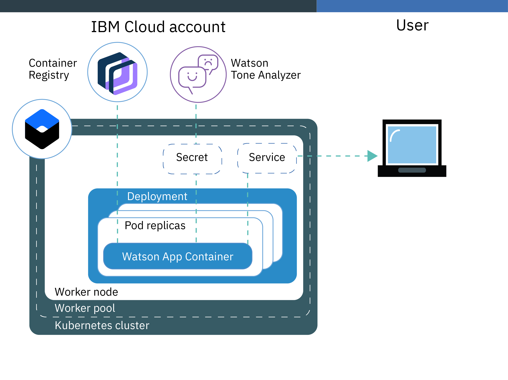

---

copyright:
  years: 2014, 2021
lastupdated: "2021-08-13"

keywords: kubernetes, iks

subcollection: containers

content-type: tutorial
services: containers, tone-analyzer, Registry
account-plan:
completion-time: 60m

---

{:DomainName: data-hd-keyref="APPDomain"}
{:DomainName: data-hd-keyref="DomainName"}
{:android: data-hd-operatingsystem="android"}
{:api: .ph data-hd-interface='api'}
{:apikey: data-credential-placeholder='apikey'}
{:app_key: data-hd-keyref="app_key"}
{:app_name: data-hd-keyref="app_name"}
{:app_secret: data-hd-keyref="app_secret"}
{:app_url: data-hd-keyref="app_url"}
{:audio: .audio}
{:authenticated-content: .authenticated-content}
{:beta: .beta}
{:c#: .ph data-hd-programlang='c#'}
{:c#: data-hd-programlang="c#"}
{:cli: .ph data-hd-interface='cli'}
{:codeblock: .codeblock}
{:curl: #curl .ph data-hd-programlang='curl'}
{:curl: .ph data-hd-programlang='curl'}
{:deprecated: .deprecated}
{:dotnet-standard: .ph data-hd-programlang='dotnet-standard'}
{:download: .download}
{:external: .external target="_blank"}
{:external: target="_blank" .external}
{:faq: data-hd-content-type='faq'}
{:fuzzybunny: .ph data-hd-programlang='fuzzybunny'}
{:generic: data-hd-operatingsystem="generic"}
{:generic: data-hd-programlang="generic"}
{:gif: data-image-type='gif'}
{:go: .ph data-hd-programlang='go'}
{:help: data-hd-content-type='help'}
{:hide-dashboard: .hide-dashboard}
{:hide-in-docs: .hide-in-docs}
{:important: .important}
{:ios: data-hd-operatingsystem="ios"}
{:java: #java .ph data-hd-programlang='java'}
{:java: .ph data-hd-programlang='java'}
{:java: data-hd-programlang="java"}
{:javascript: .ph data-hd-programlang='javascript'}
{:javascript: data-hd-programlang="javascript"}
{:middle: .ph data-hd-position='middle'}
{:navgroup: .navgroup}
{:new_window: target="_blank"}
{:node: .ph data-hd-programlang='node'}
{:note: .note}
{:objectc: .ph data-hd-programlang='Objective C'}
{:objectc: data-hd-programlang="objectc"}
{:org_name: data-hd-keyref="org_name"}
{:php: .ph data-hd-programlang='PHP'}
{:php: data-hd-programlang="php"}
{:pre: .pre}
{:preview: .preview}
{:python: .ph data-hd-programlang='python'}
{:python: data-hd-programlang="python"}
{:right: .ph data-hd-position='right'}
{:route: data-hd-keyref="route"}
{:row-headers: .row-headers}
{:ruby: .ph data-hd-programlang='ruby'}
{:ruby: data-hd-programlang="ruby"}
{:runtime: architecture="runtime"}
{:runtimeIcon: .runtimeIcon}
{:runtimeIconList: .runtimeIconList}
{:runtimeLink: .runtimeLink}
{:runtimeTitle: .runtimeTitle}
{:screen: .screen}
{:script: data-hd-video='script'}
{:service: architecture="service"}
{:service_instance_name: data-hd-keyref="service_instance_name"}
{:service_name: data-hd-keyref="service_name"}
{:shortdesc: .shortdesc}
{:space_name: data-hd-keyref="space_name"}
{:step: data-tutorial-type='step'}
{:step: data-tutorial-type='step'} 
{:subsection: outputclass="subsection"}
{:support: data-reuse='support'}
{:swift: #swift .ph data-hd-programlang='swift'}
{:swift: .ph data-hd-programlang='swift'}
{:swift: data-hd-programlang="swift"}
{:table: .aria-labeledby="caption"}
{:term: .term}
{:terraform: .ph data-hd-interface='terraform'}
{:tip: .tip}
{:tooling-url: data-tooling-url-placeholder='tooling-url'}
{:topicgroup: .topicgroup}
{:troubleshoot: data-hd-content-type='troubleshoot'}
{:tsCauses: .tsCauses}
{:tsResolve: .tsResolve}
{:tsSymptoms: .tsSymptoms}
{:tutorial: data-hd-content-type='tutorial'}
{:ui: .ph data-hd-interface='ui'}
{:unity: .ph data-hd-programlang='unity'}
{:url: data-credential-placeholder='url'}
{:user_ID: data-hd-keyref="user_ID"}
{:vbnet: .ph data-hd-programlang='vb.net'}
{:video: .video}
  


# Creating Kubernetes clusters
{: #cs_cluster_tutorial}
{: toc-content-type="tutorial"}
{: toc-services="containers, tone-analyzer, Registry"}
{: toc-completion-time="60m"}

Create a Kubernetes cluster on managed {{site.data.keyword.containerlong_notm}} with Classic infrastructure worker nodes that run an Ubuntu operating system.
{: shortdesc}

With this tutorial, you can deploy and manage a Kubernetes cluster in {{site.data.keyword.containerlong}}. Follow along with a fictional public relations firm to learn how to automate the deployment, operation, scaling, and monitoring of containerized apps in a cluster that integrate with other cloud services such as {{site.data.keyword.ibmwatson}}.

## Objectives
{: #tutorials_objectives}

In this tutorial, you work for a public relations (PR) firm and complete a series of lessons to set up and configure a custom Kubernetes cluster environment. First, you set up your {{site.data.keyword.cloud_notm}} CLI, create a {{site.data.keyword.containershort_notm}} cluster, and store your PR firm's images in a private {{site.data.keyword.registrylong}}. Then, you provision a {{site.data.keyword.toneanalyzerfull}} service and bind it to your cluster. After you deploy and test a Hello World app in your cluster, you deploy progressively more complex and highly available versions of your {{site.data.keyword.watson}} app so that your PR firm can analyze press releases and receive feedback with the latest AI technology.
{: shortdesc}

The following diagram provides an overview of what you set up in this tutorial.



## Audience
{: #tutorials_audience}

This tutorial is intended for software developers and system administrators who are creating a Kubernetes cluster and deploying an app for the first time.
{: shortdesc}

## Prerequisites
{: #tutorials_prereqs}

-  To create a cluster, you must have a paid account. However, you can complete this tutorial without incurring costs by using a free cluster and limiting the amount of registry images and tone analyzer services that you use.
-  Check out the steps you need to take to [prepare to create a cluster](/docs/containers?topic=containers-clusters#cluster_prepare).
-  Ensure you have the following access policies:
    - The [**Administrator** {{site.data.keyword.cloud_notm}} IAM platform access role](/docs/containers?topic=containers-users#checking-perms) for {{site.data.keyword.containerlong_notm}}
    - The [**Administrator** {{site.data.keyword.cloud_notm}} IAM platform access role](/docs/containers?topic=containers-users#checking-perms) for {{site.data.keyword.registrylong_notm}}
    - The [**Writer** or **Manager** {{site.data.keyword.cloud_notm}} IAM service access role](/docs/containers?topic=containers-users#checking-perms) for {{site.data.keyword.containerlong_notm}}

## Set up your cluster environment
{: #cs_cluster_tutorial_lesson1}
{: step}

Create your Kubernetes cluster in the {{site.data.keyword.cloud_notm}} console, install the required CLIs, set up your container registry, and set the context for your Kubernetes cluster in the CLI.
{: shortdesc}

Because it can take a few minutes to provision, create your cluster before you set up the rest of your cluster environment.

1. [In the {{site.data.keyword.cloud_notm}} console](https://cloud.ibm.com/kubernetes/catalog/create){: external}, create a free or standard cluster with one worker pool that has one worker node in it.

    You can also create a [cluster in the CLI](/docs/containers?topic=containers-clusters#clusters_cli_steps).
    {: tip}

2. While your cluster provisions, install the [{{site.data.keyword.cloud_notm}} CLI](/docs/cli?topic=cli-getting-started){: external}. This installation includes:
    -   The base {{site.data.keyword.cloud_notm}} CLI (`ibmcloud`).
    -   The {{site.data.keyword.containerlong_notm}} plug-in plug-in (`ibmcloud ks`). Use this plug-in to manage your Kubernetes clusters, such as to resize worker pools for added compute capacity or to bind {{site.data.keyword.cloud_notm}} services to the cluster.
    -   {{site.data.keyword.registrylong_notm}} plug-in (`ibmcloud cr`). Use this plug-in to set up and manage a private image repository in {{site.data.keyword.registrylong_notm}}.
    -   The Kubernetes CLI (`kubectl`). Use this CLI to deploy and manage Kubernetes resources such as your app's pods and services.

    If you want to use the {{site.data.keyword.cloud_notm}} console instead, after your cluster is created, you can run CLI commands directly from your web browser in the [{{site.data.keyword.cloud-shell_notm}}](/docs/containers?topic=containers-cs_cli_install#cloud-shell).
    {: tip}

3. In your command line, log in to your {{site.data.keyword.cloud_notm}} account. Enter your {{site.data.keyword.cloud_notm}} credentials when prompted. If you have a federated ID, use the `--sso` flag to log in. Select the region and, if applicable, target the resource group (`-g`) that you created your cluster in.
    ```
    ibmcloud login [-g <resource_group>] [--sso]
    ```
    {: pre}

5. Verify that the plug-ins are installed correctly.
    ```
    ibmcloud plugin list
    ```
    {: pre}

    The {{site.data.keyword.containerlong_notm}} plug-in is displayed in the results as **kubernetes-service**, and the {{site.data.keyword.registrylong_notm}} plug-in is displayed in the results as **container-registry**.
6. Set up your own private image repository in {{site.data.keyword.registrylong_notm}} to securely store and share Docker images with all cluster users. A private image repository in {{site.data.keyword.cloud_notm}} is identified by a namespace. The namespace is used to create a unique URL to your image repository that developers can use to access private Docker images.
    Learn more about [securing your personal information](/docs/containers?topic=containers-security#pi) when you work with container images.

    In this example, the PR firm wants to create only one image repository in {{site.data.keyword.registrylong_notm}}, so they choose `pr_firm` as their namespace to group all images in their account. Replace `<namespace>` with a namespace of your choice that is unrelated to the tutorial.

    ```
    ibmcloud cr namespace-add <namespace>
    ```
    {: pre}

7. Before you continue to the next step, verify that the deployment of your worker node is complete.
    ```
    ibmcloud ks worker ls --cluster <cluster_name_or_ID>
    ```
    {: pre}

    When your worker node is finished provisioning, the status changes to **Ready** and you can start binding {{site.data.keyword.cloud_notm}} services.

    ```
    ID                                                 Public IP       Private IP       Machine Type   State    Status   Zone   Version
    kube-mil01-pafe24f557f070463caf9e31ecf2d96625-w1   169.xx.xxx.xxx   10.xxx.xx.xxx   free           normal   Ready    mil01      1.20.7
    ```
    {: screen}

8. Set the context for your Kubernetes cluster in your CLI.
    1. Download and add the `kubeconfig` configuration file for your cluster to your existing `kubeconfig` in `~/.kube/config` or the last file in the `KUBECONFIG` environment variable. Every time that you log in to the {{site.data.keyword.containerlong}} CLI to work with clusters, you must run these commands to set the path to the cluster's configuration file as a session variable. The Kubernetes CLI uses this variable to find a local configuration file and certificates that are necessary to connect with the cluster in {{site.data.keyword.cloud_notm}}.
        ```
        ibmcloud ks cluster config --cluster <cluster_name_or_ID>
        ```
        {: pre}

    2. Verify that `kubectl` commands run properly and that the Kubernetes context is set to your cluster.
        ```
        kubectl config current-context
        ```
        {: pre}

        Example output:
        ```
        <cluster_name>/<cluster_ID>
        ```
        {: screen}

Good job! You've successfully installed the CLIs and set up your cluster context for the following lessons. Next, set up your cluster environment and add the {{site.data.keyword.watson}} {{site.data.keyword.toneanalyzershort}} service.

<br />

## Add an {{site.data.keyword.cloud_notm}} service to your cluster
{: #cs_cluster_tutorial_lesson2}
{: step}

With {{site.data.keyword.cloud_notm}} services, you can take advantage of already developed functionality in your apps. Any {{site.data.keyword.cloud_notm}} service that is bound to the Kubernetes cluster can be used by any app that is deployed in that cluster. Repeat the following steps for every {{site.data.keyword.cloud_notm}} service that you want to use with your apps.
{: shortdesc}

1. Add the {{site.data.keyword.toneanalyzershort}} service to your {{site.data.keyword.cloud_notm}} account in the same region as your cluster. Replace `<service_name>` with a name for your service instance and `<region>` with a region, such as the one that your cluster is in.

    When you add the {{site.data.keyword.toneanalyzershort}} service to your account, a message is displayed that the service is not free. If you limit your API call, this tutorial does not incur charges from the {{site.data.keyword.watson}} service. [Review the pricing information for the {{site.data.keyword.watson}} {{site.data.keyword.toneanalyzershort}} service](https://cloud.ibm.com/catalog/services/tone-analyzer){: external}.
    {: note}

    ```
    ibmcloud resource service-instance-create <service_name> tone-analyzer standard <region>
    ```
    {: pre}

2. Bind the {{site.data.keyword.toneanalyzershort}} instance to the `default` Kubernetes namespace for the cluster. Later, you can create your own namespaces to manage user access to Kubernetes resources, but for now, use the `default` namespace. Kubernetes namespaces are different from the registry namespace you created earlier.
    ```
    ibmcloud ks cluster service bind --cluster <cluster_name> --namespace default --service <service_name>
    ```
    {: pre}

    Example output:
    ```
    ibmcloud ks cluster service bind pr_firm_cluster default mytoneanalyzer
    Binding service instance to namespace...
    OK
    Namespace:    default
    Secret name:    binding-mytoneanalyzer
    ```
    {: screen}

3. Verify that the Kubernetes secret was created in your cluster namespace. When you [bind an {{site.data.keyword.cloud_notm}} service to your cluster](/docs/containers?topic=containers-service-binding), a JSON file is generated that includes confidential information such as the {{site.data.keyword.cloud_notm}} Identity and Access Management (IAM) API key and the URL that the container uses to gain access to the service. To securely store this information, the JSON file is stored in a Kubernetes secret.

    ```
    kubectl get secrets --namespace=default
    ```
    {: pre}

    Example output:

    ```
    NAME                       TYPE                                  DATA      AGE
    binding-mytoneanalyzer     Opaque                                1         1m
    bluemix-default-secret     kubernetes.io/dockercfg               1         1h
    default-token-kf97z        kubernetes.io/service-account-token   3         1h
    ```
    {: screen}

</br>
Great work! Your cluster is configured and your local environment is ready for you to start deploying apps into the cluster.


Before you continue with the next lesson, why not test your knowledge and [take a short quiz](https://ibmcloud-quizzes.mybluemix.net/containers/cluster_tutorial/quiz.php){: external}?
{: note}


<br />

## Deploy single instance apps to Kubernetes clusters
{: #cs_cluster_tutorial_lesson3}
{: step}

In the previous lesson, you set up a cluster with one worker node. In this lesson, you configure a deployment and deploy a single instance of the app into a Kubernetes pod within the worker node.
{: shortdesc}

The components that you deploy by completing this lesson are shown in the following diagram.


To deploy the app:

1. Clone the source code for the [Hello world app](https://github.com/IBM/container-service-getting-started-wt){: external} to your user home directory. The repository contains different versions of a similar app in folders that each start with `Lab`. Each version contains the following files:
    *   `Dockerfile`: The build definitions for the image.
    *   `app.js`: The Hello world app.
    *   `package.json`: Metadata about the app.

    ```
    git clone https://github.com/IBM/container-service-getting-started-wt.git
    ```
    {: pre}

2. Navigate to the `Lab 1` directory.
    ```
    cd 'container-service-getting-started-wt/Lab 1'
    ```
    {: pre}

3. Build a Docker image that includes the app files of the `Lab 1` directory, and push the image to the {{site.data.keyword.registrylong_notm}} namespace that you created in the previous lesson. If you need to make a change to the app in the future, repeat these steps to create another version of the image. **Note**: Learn more about [securing your personal information](/docs/containers?topic=containers-security#pi) when you work with container images.

    Use lowercase alphanumeric characters or underscores (`_`) only in the image name. Don't forget the period (`.`) at the end of the command. The period tells Docker to look inside the current directory for the Dockerfile and build artifacts to build the image. **Note**: You must specify a [registry region](/docs/Registry?topic=Registry-registry_overview#registry_regions), such as `us`. To get the registry region that you are currently in, run `ibmcloud cr region`.

    ```
    ibmcloud cr build -t <region>.icr.io/<namespace>/hello-world:1 .
    ```
    {: pre}

    When the build is complete, verify that you see the following success message:

    ```
    Successfully built <image_ID>
    Successfully tagged <region>.icr.io/<namespace>/hello-world:1
    The push refers to a repository [<region>.icr.io/<namespace>/hello-world]
    29042bc0b00c: Pushed
    f31d9ee9db57: Pushed
    33c64488a635: Pushed
    0804854a4553: Layer already exists
    6bd4a62f5178: Layer already exists
    9dfa40a0da3b: Layer already exists
    1: digest: sha256:f824e99435a29e55c25eea2ffcbb84be4b01345e0a3efbd7d9f238880d63d4a5 size: 1576
    ```
    {: screen}

4. Create a deployment. Deployments are used to manage pods, which include containerized instances of an app. The following command deploys the app in a single pod by referring to the image that you built in your private registry. For the purposes of this tutorial, the deployment is named **hello-world-deployment**, but you can give the deployment any name that you want.
    ```
    kubectl create deployment hello-world-deployment --image=<region>.icr.io/<namespace>/hello-world:1
    ```
    {: pre}

    Example output:
    ```
    deployment "hello-world-deployment" created
    ```
    {: screen}

    Learn more about [securing your personal information](/docs/containers?topic=containers-security#pi) when you work with Kubernetes resources.
5. Make the app accessible to the world by exposing the deployment as a NodePort service. Just as you might expose a port for a Cloud Foundry app, the NodePort that you expose is the port on which the worker node listens for traffic.
    ```
    kubectl expose deployment/hello-world-deployment --type=NodePort --port=8080 --name=hello-world-service --target-port=8080
    ```
    {: pre}

    Example output:
    ```
    service "hello-world-service" exposed
    ```
    {: screen}

    <table summary="Information about the expose command parameters.">
    <caption>More about the expose parameters</caption>
    <thead>
    <col width="25%">
    <th>Parameter</th>
    <th>Description</th>
    </thead>
    <tbody>
    <tr>
    <td><code>expose</code></td>
    <td>Expose a resource as a Kubernetes service and make it publicly available to users.</td>
    </tr>
    <tr>
    <td><code>deployment/<em>&lt;hello-world-deployment&gt;</em></code></td>
    <td>The resource type and the name of the resource to expose with this service.</td>
    </tr>
    <tr>
    <td><code>--name=<em>&lt;hello-world-service&gt;</em></code></td>
    <td>The name of the service.</td>
    </tr>
    <tr>
    <td><code>--port=<em>&lt;8080&gt;</em></code></td>
    <td>The port on which the service serves.</td>
    </tr>
    <tr>
    <td><code>--type=NodePort</code></td>
    <td>The service type to create.</td>
    </tr>
    <tr>
    <td><code>--target-port=<em>&lt;8080&gt;</em></code></td>
    <td>The port to which the service directs traffic. In this instance, the target-port is the same as the port, but other apps you create might differ.</td>
    </tr>
    </tbody></table>
6. Now that all the deployment work is done, you can test your app in a browser. Get the details to form the URL.
    1. Get information about the service to see which NodePort was assigned.
        ```
        kubectl describe service hello-world-service
        ```
        {: pre}

        Example output:
        ```
        Name:                   hello-world-service
        Namespace:              default
        Labels:                 run=hello-world-deployment
        Selector:               run=hello-world-deployment
        Type:                   NodePort
        IP:                     10.xxx.xx.xxx
        Port:                   <unset> 8080/TCP
        NodePort:               <unset> 30872/TCP
        Endpoints:              172.30.xxx.xxx:8080
        Session Affinity:       None
        No events.
        ```
        {: screen}

        The NodePorts are randomly assigned when they are generated with the `expose` command, but within 30000-32767. In this example, the NodePort is 30872.
    2. Get the public IP address for the worker node in the cluster.
        ```
        ibmcloud ks worker ls --cluster <cluster_name_or_ID>
        ```
        {: pre}

        Example output:
        ```
        ibmcloud ks worker ls --cluster pr_firm_cluster
        Listing cluster workers...
        OK
        ID                                                 Public IP       Private IP       Machine Type   State    Status   Zone   Version
        kube-mil01-pa10c8f571c84d4ac3b52acbf50fd11788-w1   169.xx.xxx.xxx  10.xxx.xx.xxx    free           normal   Ready    mil01      1.20.7
        ```
        {: screen}

7. Open a browser and check out the app with the following URL: `http://<IP_address>:<NodePort>`. With the example values, the URL is `http://169.xx.xxx.xxx:30872`. When you enter that URL in a browser, you can see the following text.
    ```
    Hello world! Your app is up and running in a cluster!
    ```
    {: screen}

    To see that the app is publicly available, try entering it into a browser on your cell phone.
    {: tip}

8. [Launch the Kubernetes dashboard](/docs/containers?topic=containers-deploy_app#cli_dashboard).

    If you select your cluster in the [{{site.data.keyword.cloud_notm}} console](https://cloud.ibm.com/), you can use the **Kubernetes Dashboard** button to launch your dashboard with one click.
    {: tip}

9. In the **Workloads** tab, you can see the resources that you created.

Good job! You deployed your first version of the app.

Too many commands in this lesson? Agreed. How about using a configuration script to do some of the work for you? To use a configuration script for the second version of the app, and to create higher availability by deploying multiple instances of that app, continue to the next lesson.

**Clean up**

Want to delete the resources that you created in this lesson before you move on? When you created the deployment, Kubernetes assigned the deployment a label, `app=hello-world-deployment` (or whatever you named the deployment). Then, when you exposed the deployment, Kubernetes applied the same label to the service that was created. Labels are useful tools for you to organize your Kubernetes resources so that you can apply bulk actions such as `get` or `delete` to them.

    You can check all your resources that have the `app=hello-world-deployment` label.
    ```
    kubectl get all -l app=hello-world-deployment
    ```
    {: pre}

    Then, you can delete all the resources with the label.
    ```
    kubectl delete all -l app=hello-world-deployment
    ```
    {: pre}

    Example output:
    ```
    pod "hello-world-deployment-5c78f9b898-b9klb" deleted
    service "hello-world-service" deleted
    deployment.apps "hello-world-deployment" deleted
    ```
    {: screen}

<br />

## Deploy and update apps with higher availability
{: #cs_cluster_tutorial_lesson4}
{: step}

In this lesson, you deploy three instances of the Hello World app into a cluster for higher availability than the first version of the app.
{: shortdesc}

Higher availability means that user access is divided across the three instances. When too many users are trying to access the same app instance, they might notice slow response times. Multiple instances can mean faster response times for your users. In this lesson, you also learn how health checks and deployment updates can work with Kubernetes. The following diagram includes the components that you deploy by completing this lesson.


In the previous lessons, you created your cluster with one worker node and deployed a single instance of an app. In this lesson, you configure a deployment and deploy three instances of the Hello World app. Each instance is deployed in a Kubernetes pod as part of a replica set in the worker node. To make it publicly available, you also create a Kubernetes service.

As defined in the configuration script, Kubernetes can use an availability check to see whether a container in a pod is running or not. For example, these checks might catch deadlocks, where an app runs, but it is unable to progress. Restarting a container that is in this condition can help to make the app more available despite bugs. Then, Kubernetes uses a readiness check to know when a container is ready to start accepting traffic again. A pod is considered ready when its container is ready. When the pod is ready, it is started again. In this version of the app, every 15 seconds it times out. With a health check configured in the configuration script, containers are re-created if the health check finds an issue with an app.

If you took a break from the last lesson, make sure that you log back in to your cluster.

1. In your command line, navigate to the `Lab 2` directory.
    ```
    cd 'container-service-getting-started-wt/Lab 2'
    ```
    {: pre}

2. Build, tag, and push the app as an image to your namespace in {{site.data.keyword.registrylong_notm}}. Don't forget the period (`.`) at the end of the command.
    ```
    ibmcloud cr build -t <region>.icr.io/<namespace>/hello-world:2 .
        ```
    {: pre}

    Verify that you see the success message.
    ```
    Successfully built <image_ID>
    Successfully tagged <region>.icr.io/<namespace>/hello-world:1
    The push refers to a repository [<region>.icr.io/<namespace>/hello-world]
    29042bc0b00c: Pushed
    f31d9ee9db57: Pushed
    33c64488a635: Pushed
    0804854a4553: Layer already exists
    6bd4a62f5178: Layer already exists
    9dfa40a0da3b: Layer already exists
    1: digest: sha256:f824e99435a29e55c25eea2ffcbb84be4b01345e0a3efbd7d9f238880d63d4a5 size: 1576
    ```
    {: screen}

3. In the `Lab 2` directory, open the `healthcheck.yml` file with a text editor. This configuration script combines a few steps from the previous lesson to create a deployment and a service at the same time. The PR firm's app developers can use these scripts when updates are made or to troubleshoot issues by re-creating the pods.
    1. Update the details for the image in your private registry namespace.
        ```
        image: "<region>.icr.io/<namespace>/hello-world:2"
        ```
        {: codeblock}

    2. In the **Deployment** section, note the `replicas`. Replicas are the number instances of your app. Running three instances makes the app more highly available than just one instance.
        ```
        replicas: 3
        ```
        {: codeblock}

    3. Note the HTTP liveness probe that checks the health of the container every 5 seconds.
        ```
        livenessProbe:
          httpGet:
            path: /healthz
            port: 8080
          initialDelaySeconds: 5
          periodSeconds: 5
        ```
        {: codeblock}

    4. In the **Service** section, note the `NodePort`. Rather than generating a random NodePort like you did in the previous lesson, you can specify a port in the 30000 - 32767 range. This example uses 30072.
4. Switch back to the CLI that you used to set your cluster context, and run the configuration script. When the deployment and the service are created, the app is available for the PR firm's users to see.
    ```
    kubectl apply -f healthcheck.yml
    ```
    {: pre}

    Example output:
    ```
    deployment "hw-demo-deployment" created
    service "hw-demo-service" created
    ```
    {: screen}

5. Now that the deployment work is done, open a browser and check out the app. To form the URL, take the same public IP address that you used in the previous lesson for your worker node and combine it with the NodePort that was specified in the configuration script. To get the public IP address for the worker node:
    ```
    ibmcloud ks worker ls --cluster <cluster_name_or_ID>
    ```
    {: pre}

    With the example values, the URL is `http://169.xx.xxx.xxx:30072`. In a browser, you might see the following text. If you do not see this text, don't worry. This app is designed to go up and down.
    ```
    Hello world! Great job getting the second stage up and running!
    ```
    {: screen}

    You can also check `http://169.xx.xxx.xxx:30072/healthz` for status.

    For the first 10 - 15 seconds, a 200 message is returned, so you know that the app is running successfully. After those 15 seconds, a timeout message is displayed. This is an expected behavior.
    ```
    {
        "error": "Timeout, Health check error!"
    }
    ```
    {: screen}

6. Check your pod status to monitor the health of your app in Kubernetes. You can check the status from the CLI or in the Kubernetes dashboard.
    *   **From the CLI**: Watch what is happening to your pods as they change status.
        ```
        kubectl get pods -o wide -w
        ```
        {: pre}

    *   **From the Kubernetes dashboard**:
        1. [Launch the Kubernetes dashboard](/docs/containers?topic=containers-deploy_app#cli_dashboard).
        2. In the **Workloads** tab, you can see the resources that you created. From this tab, you can continually refresh and see that the health check is working. In the **Pods** section, you can see how many times the pods are restarted when      containers in them are re-created. If you happen to catch the following error in the dashboard, this message indicates that the health check caught a problem. Give it a few minutes and refresh again. You see the number of restarts changes for each pod.

            ```
            Liveness probe failed: HTTP probe failed with statuscode: 500
            Back-off restarting failed docker container
            Error syncing pod, skipping: failed to "StartContainer" for "hw-container" w      CrashLoopBackOff: "Back-off 1m20s restarting failed container=hw-container pod=hw-d     deployment-3090568676-3s8v1_default(458320e7-059b-11e7-8941-56171be20503)"
            ```
            {: screen}

Nice, you deployed the second version of the app. You had to use fewer commands, learned how health checks work, and edited a deployment, which is great! The Hello world app passed the test for the PR firm. Now, you can deploy a more useful app for the PR firm to start analyzing press releases.

**Clean up**

Ready to delete what you created before you continue to the next lesson? This time, you can use the same configuration script to delete both of the resources that you created.

    ```
    kubectl delete -f healthcheck.yml
    ```
    {: pre}

    Example output:

    ```
    deployment "hw-demo-deployment" deleted
    service "hw-demo-service" deleted
    ```
    {: screen}

<br />

## Deploy and update the {{site.data.keyword.watson}} Tone Analyzer app
{: #cs_cluster_tutorial_lesson5}
{: step}

In the previous lessons, the apps were deployed as single components in one worker node. In this lesson, you can deploy two components of an app into a cluster that use the {{site.data.keyword.watson}} {{site.data.keyword.toneanalyzershort}} service.
{: shortdesc}

Separating components into different containers ensures that you can update one without affecting the others. Then, you update the app to scale it up with more replicas to make it more highly available. The following diagram includes the components that you deploy by completing this lesson.


From the previous tutorial, you have your account and a cluster with one worker node. In this lesson, you create an instance of {{site.data.keyword.watson}} {{site.data.keyword.toneanalyzershort}} service in your {{site.data.keyword.cloud_notm}} account and configure two deployments, one deployment for each component of the app. Each component is deployed in a Kubernetes pod in the worker node. To make both of those components publicly available, you also create a Kubernetes service for each component.


### Step 5a: Deploying the {{site.data.keyword.watson}} {{site.data.keyword.toneanalyzershort}} app
{: #lesson5a}

Deploy the {{site.data.keyword.watson}} apps, access the service publicly, and analyze some text with the app.
{: shortdesc}

If you took a break from the last lesson, make sure that you log back in to your cluster.

1. In a CLI, navigate to the `Lab 3` directory.
    ```
    cd 'container-service-getting-started-wt/Lab 3'
    ```
    {: pre}

2. Build the first {{site.data.keyword.watson}} image.
    1. Navigate to the `watson` directory.
        ```
        cd watson
        ```
        {: pre}

    2. Build, tag, and push the `watson` app as an image to your namespace in {{site.data.keyword.registrylong_notm}}. Again, don't forget the period (`.`) at the end of the command.
        ```
        ibmcloud cr build -t <region>.icr.io/<namespace>/watson .
        ```
        {: pre}

        Verify that you see the success message.
        ```
        Successfully built <image_id>
        ```
        {: screen}

    3. Repeat these steps to build the second `watson-talk` image.
        ```
        cd 'container-service-getting-started-wt/Lab 3/watson-talk'
        ```
        {: pre}

        ```
        ibmcloud cr build -t <region>.icr.io/<namespace>/watson-talk .
        ```
        {: pre}

3. Verify that the images were successfully added to your registry namespace.
    ```
    ibmcloud cr images
    ```
    {: pre}

    Example output:

    ```
    Listing images...

    REPOSITORY                        NAMESPACE  TAG      DIGEST         CREATED         SIZE     VULNERABILITY STATUS
    us.icr.io/namespace/watson        namespace  latest   fedbe587e174   3 minutes ago   274 MB   OK
    us.icr.io/namespace/watson-talk   namespace  latest   fedbe587e174   2 minutes ago   274 MB   OK
    ```
    {: screen}

4. In the `Lab 3` directory, open the `watson-deployment.yml` file with a text editor. This configuration script includes a deployment and a service for both the `watson` and `watson-talk` components of the app.
    1. Update the details for the image in your registry namespace for both deployments.
        **watson**:
        ```
        image: "<region>.icr.io/<namespace>/watson"
        ```
        {: codeblock}

        **watson-talk**:
        ```
        image: "<region>.icr.io/<namespace>/watson-talk"
        ```
        {: codeblock}

    2. In the volumes section of the `watson-pod` deployment, update the name of the {{site.data.keyword.watson}} {{site.data.keyword.toneanalyzershort}} secret that you created in [Lesson 2](#cs_cluster_tutorial_lesson2). By mounting the Kubernetes secret as a volume to your deployment, you make the {{site.data.keyword.cloud_notm}} Identity and Access Management (IAM) API key available to the container that runs in your pod. The {{site.data.keyword.watson}} app components in this tutorial are configured to look up the API key by using the volume mount path.
        ```
        volumes:
        - name: service-bind-volume
          secret:
            defaultMode: 420
            secretName: binding-mytoneanalyzer
        ```
        {: codeblock}

        If you forgot what you named the secret, run the following command.
        ```
        kubectl get secrets --namespace=default
        ```
        {: pre}

    3. In the watson-talk service section, note the value that is set for the `NodePort`. This example uses 30080.
5. Run the configuration script.
    ```
    kubectl apply -f watson-deployment.yml
    ```
    {: pre}

6. Optional: Verify that the {{site.data.keyword.watson}} {{site.data.keyword.toneanalyzershort}} secret is mounted as a volume to the pod.
    1. To get the name of a watson pod, run the following command.
        ```
        kubectl get pods
        ```
        {: pre}

        Example output:
        ```
        NAME                                 READY     STATUS    RESTARTS  AGE
        watson-pod-4255222204-rdl2f          1/1       Running   0         13h
        watson-talk-pod-956939399-zlx5t      1/1       Running   0         13h
        ```
        {: screen}

    2. Get the details about the pod and look for the secret name.
        ```
        kubectl describe pod <pod_name>
        ```
        {: pre}

        Example output:
        ```
        Volumes:
          service-bind-volume:
            Type:       Secret (a volume populated by a Secret)
            SecretName: binding-mytoneanalyzer
          default-token-j9mgd:
            Type:       Secret (a volume populated by a Secret)
            SecretName: default-token-j9mgd
        ```
        {: codeblock}

7. Open a browser and analyze some text. The format of the URL is `http://<worker_node_IP_address>:<watson-talk-nodeport>/analyze/"<text_to_analyze>"`.
    Example:
    ```
    http://169.xx.xxx.xxx:30080/analyze/"Today is a beautiful day"
    ```
    {: codeblock}

    In a browser, you can see the JSON response for the text you entered.
    ```
    {
        "document_tone": {
        "tone_categories": [
          {
            "tones": [
              {
                "score": 0.011593,
                "tone_id": "anger",
                "tone_name": "Anger"
              },
              ...
            "category_id": "social_tone",
            "category_name": "Social Tone"
          }
        ]
        }
    }
    ```
    {: screen}

8. [Launch the Kubernetes dashboard](/docs/containers?topic=containers-deploy_app#cli_dashboard).
9. In the **Workloads** tab, you can see the resources that you created.

### Step 5b: Updating the running {{site.data.keyword.watson}} Tone Analyzer deployment
{: #lesson5b}

While a deployment is running, you can edit the deployment to change values in the pod template. In this lesson, the PR firm wants to change the app in the deployment by updating the image that is used.
{: shortdesc}

Change the name of the image:

1. Open the configuration details for the running deployment.
    ```
    kubectl edit deployment/watson-talk-pod
    ```
    {: pre}

    Depending on your operating system, either a vi editor opens or a text editor opens.
2. Change the name of the image to `ibmliberty`.
    ```
    spec:
        containers:
        - image: icr.io/ibm/liberty:latest
    ```
    {: codeblock}

3. Save your changes and exit the editor.
4. Apply the changes to the running deployment.
    ```
    kubectl rollout status deployment/watson-talk-pod
    ```
    {: pre}

    Wait for confirmation that the rollout is complete.
    ```
    deployment "watson-talk-pod" successfully rolled out
    ```
    {: screen}

    When you roll out a change, another pod is created and tested by Kubernetes. When the test is successful, the old pod is removed.

Good job! You deployed the {{site.data.keyword.watson}} {{site.data.keyword.toneanalyzershort}} app and learned how to perform a simple app update. The PR firm can use this deployment to start analyzing their press releases with the latest AI technology.

**Clean up**

Ready to delete the {{site.data.keyword.watson}} {{site.data.keyword.toneanalyzershort}} app that you created in your {{site.data.keyword.containerlong_notm}} cluster? You can use the configuration script to delete the resources that you created.

    ```
    kubectl delete -f watson-deployment.yml
    ```
    {: pre}

    Example output:

    ```
    deployment "watson-pod" deleted
    deployment "watson-talk-pod" deleted
    service "watson-service" deleted
    service "watson-talk-service" deleted
    ```
    {: screen}

    If you do not want to keep the cluster, you can delete that too.

    ```
    ibmcloud ks cluster rm --cluster <cluster_name_or_ID>
    ```
    {: pre}


Quiz time! You covered a lot of material, so [make sure that you understand it all](https://ibmcloud-quizzes.mybluemix.net/containers/apps_tutorial/quiz.php){: external}. Don't worry, the quiz is not cumulative!
{: note}


<br />

## What's next?
{: #tutorials_next}

Now that you conquered the basics, you can move to more advanced activities. Consider trying out one of the following resources to do more with {{site.data.keyword.containerlong_notm}}.
{: shortdesc}

*   Complete a [more complicated lab](https://github.com/IBM/container-service-getting-started-wt#lab-overview){: external} in the repository.
*   Learn about creating [highly available apps](/docs/containers?topic=containers-ha) by using features such as multizone clusters, persistent storage, cluster autoscaler, and horizontal pod autoscaling for apps.
*   Explore the container orchestration code patterns on [IBM Developer](https://developer.ibm.com/technologies/containers/){: external}.


