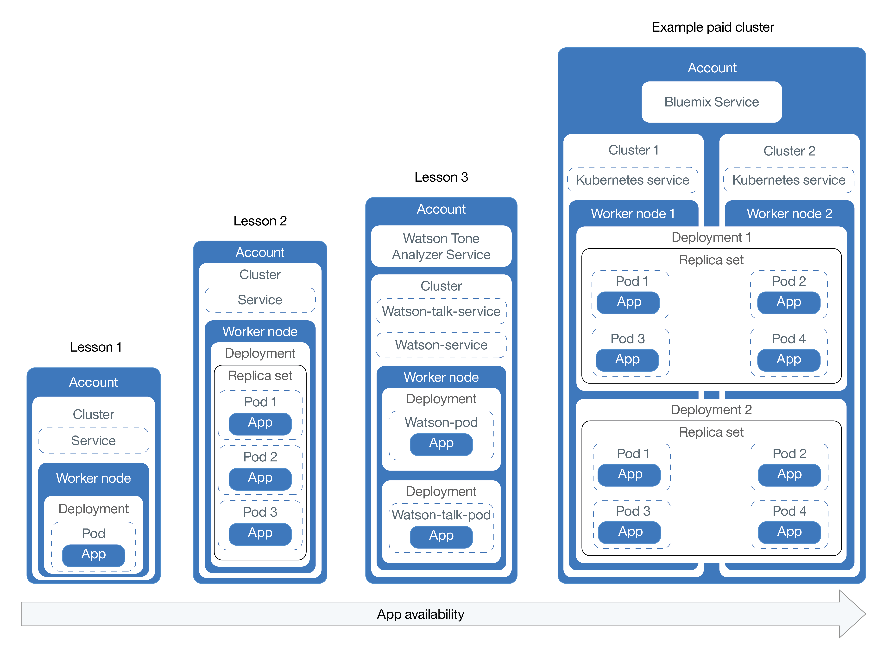
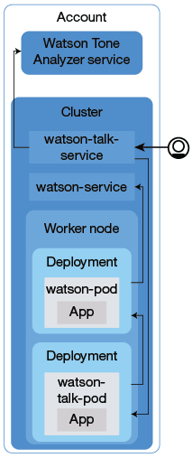

---

copyright:
  years: 2014, 2018
lastupdated: "2017-12-08"

---

{:new_window: target="_blank"}
{:shortdesc: .shortdesc}
{:screen: .screen}
{:pre: .pre}
{:table: .aria-labeledby="caption"}
{:codeblock: .codeblock}
{:tip: .tip}
{:download: .download}


# Tutorial: Deploying apps into clusters
{: #cs_apps_tutorial}

This second tutorial continues how you can use Kubernetes to deploy a containerized app that leverages the {{site.data.keyword.watson}} {{site.data.keyword.toneanalyzershort}} {{site.data.keyword.Bluemix_notm}} service. A fictional PR firm uses {{site.data.keyword.watson}} to analyze their press releases and receive feedback on the tone in their messages.
{:shortdesc}

In this scenario, the PR firm's app developer deploys a Hello World version of the app into the Kubernetes cluster that the network administrator created in the [first tutorial](cs_tutorials.html#cs_cluster_tutorial).

Each lesson teaches you how to deploy progressively more complicated versions of the same app. The following diagram shows the tutorial's components of the app deployments, except the fourth part.



As depicted in the diagram, Kubernetes uses several different types of resources to get your apps up and running in clusters. In Kubernetes, deployments and services work together. Deployments include the definitions for the app, like for example the image to use for the container and which port must be exposed for the app. When you create a deployment, a Kubernetes pod is created for each container that you defined in the deployment. To make your app more resilient, you can define multiple instances of the same app in your deployment and let Kubernetes automatically create a replica set for you. The replica set monitors the pods and assures that the desired number of pods is up and running at all times. If one of the pods becomes unresponsive, the pod is re-created automatically.

Services group a set of pods and provide network connection to these pods for other services in the cluster without exposing the actual private IP address of each pod. You can use Kubernetes services to make an app available to other pods inside the cluster or to expose an app to the internet. In this tutorial, you will use a Kubernetes service to access your running app from the internet by using a public IP address that is automatically assigned to a worker node and a public port.

To make your app even more highly available, in standard clusters, you can create multiple worker nodes to run even more replicas of your app. This task is not covered in this tutorial, but keep this concept in mind for future improvements to an app's availability.

Only one of the lessons includes the integration of an {{site.data.keyword.Bluemix_notm}} service into an app, but you can use them with as simple or complex of an app as you can imagine.

## Objectives

* Understand basic Kubernetes terminology
* Push an image to your registry namespace in {{site.data.keyword.registryshort_notm}}
* Make an app publicly accessible
* Deploy a single instance of an app in a cluster by using a Kubernetes command and a script
* Deploy multiple instances of an app in containers that are re-created during health checks
* Deploy an app that uses functionality from an {{site.data.keyword.Bluemix_notm}} service

## Time required

40 minutes

## Audiences

Software developers and network administrators who have never deployed an app in a Kubernetes cluster before.

## Prerequisites

[Tutorial: Creating Kubernetes clusters in {{site.data.keyword.containershort_notm}}](cs_tutorials.html#cs_cluster_tutorial).

## Lesson 1: Deploying single instance apps to Kubernetes clusters
{: #cs_apps_tutorial_lesson1}

In this lesson, you deploy a single instance of the Hello World app into a cluster. The following diagram includes the components that you deploy by completing this lesson.
{:shortdesc}


From the previous tutorial, you have an account and a cluster with one worker node already. In this lesson, you configure a deployment and deploy the Hello World app in a Kubernetes pod in the worker node. To make it publicly available, you create a Kubernetes service.


1.  Log in to the {{site.data.keyword.Bluemix_notm}} CLI. Enter your {{site.data.keyword.Bluemix_notm}} credentials when prompted. To specify an {{site.data.keyword.Bluemix_notm}} region, [include the API endpoint](cs_regions.html#bluemix_regions).

    ```
    bx login
    ```
    {: pre}

    **Note:** If you have a federated ID, use `bx login --sso` to log in to the {{site.data.keyword.Bluemix_notm}} CLI. Enter your user name and use the provided URL in your CLI output to retrieve your one-time passcode. You know you have a federated ID when the login fails without the `--sso` and succeeds with the `--sso` option.

2.  Set the context for the cluster in your CLI.
    1.  Get the command to set the environment variable and download the Kubernetes configuration files.

        ```
        bx cs cluster-config <pr_firm_cluster>
        ```
        {: pre}

        When the download of the configuration files is finished, a command is displayed that you can use to set the path to the local Kubernetes configuration file as an environment variable.

        Example for OS X:

        ```
        export KUBECONFIG=/Users/<user_name>/.bluemix/plugins/container-service/clusters/<pr_firm_cluster>/kube-config-prod-dal10-pr_firm_cluster.yml
        ```
        {: screen}

    2.  Copy and paste the command that is displayed in your terminal to set the `KUBECONFIG` environment variable.
    3.  Verify that the `KUBECONFIG` environment variable is set properly.

        Example for OS X:

        ```
        echo $KUBECONFIG
        ```
        {: pre}

        Output:

        ```
        /Users/<user_name>/.bluemix/plugins/container-service/clusters/<pr_firm_cluster>/kube-config-prod-dal10-pr_firm_cluster.yml
        ```
        {: screen}

    4.  Verify that the `kubectl` commands run properly with your cluster by checking the Kubernetes CLI server version.

        ```
        kubectl version  --short
        ```
        {: pre}

        Example output:

        ```
        Client Version: v1.8.6
        Server Version: v1.8.6
        ```
        {: screen}

3.  Start Docker.
    * If you are using Docker CE, no action is needed.
    * If you are using Linux, follow the [Docker documentation ](https://docs.docker.com/engine/admin/) to find instructions about how to start Docker depending on the Linux distribution that you use.
    * If you are using Docker Toolbox on Windows or OSX, you can use the Docker Quickstart Terminal, which starts Docker for you. Use the Docker Quickstart Terminal for the next few steps to run the Docker commands and then switch back to the CLI where you set the `KUBECONFIG` session variable.
        * If you are using the Docker QuickStart Terminal, run the {{site.data.keyword.Bluemix_notm}} CLI log in command again.

          ```
          bx login
          ```
          {: pre}

4.  Log in to the {{site.data.keyword.registryshort_notm}} CLI. **Note**: Ensure that you have the container-registry plugin [installed](/docs/services/Registry/index.html#registry_cli_install).

    ```
    bx cr login
    ```
    {: pre}

    -   If you forgot your namespace in {{site.data.keyword.registryshort_notm}}, run the following command.

        ```
        bx cr namespace-list
        ```
        {: pre}

5.  Clone or download the source code for the [Hello world app ](https://github.com/Osthanes/container-service-getting-started-wt) to your user home directory.

    ```
    git clone https://github.com/Osthanes/container-service-getting-started-wt.git
    ```
    {: pre}

    If you downloaded the repository, extract the compressed file.

    Examples:

    * Windows: `C:Users\<my_username>\container-service-getting-started-wt`
    * OS X: `/Users/<my_username>/container-service-getting-started-wt`

    The repository contains three versions of a similar app in folders that are named `Stage1`, `Stage2`, and `Stage3`. Each version contains the following files:
    * `Dockerfile`: The build definitions for the image
    * `app.js`: The Hello world app
    * `package.json`: Metadata about the app

6.  Navigate to the first app directory, `Stage1`.

    ```
    cd <username_home_directory>/container-service-getting-started-wt/Stage1
    ```
    {: pre}

7.  Build a Docker image that includes the app files of the `Stage1` directory. If you need to make a change to the app in the future, repeat these steps to create another version of the image.

    1.  Build the image locally and tag it with the name and tag that you want to use, and the namespace that you created in {{site.data.keyword.registryshort_notm}} in the previous tutorial. Tagging the image with the namespace information tells Docker where to push the image in a later step. Use lowercase alphanumeric characters or underscores (`_`) only in the image name. Don't forget the period (`.`) at the end of the command. The period tells Docker to look inside the current directory for the Dockerfile and build artifacts to build the image.

        ```
        docker build -t registry.<region>.bluemix.net/<namespace>/hello-world:1 .
        ```
        {: pre}

        When the build is complete, verify that you see the success message.

        ```
        Successfully built <image_id>
        ```
        {: screen}

    2.  Push the image to your registry namespace.

        ```
        docker push registry.<region>.bluemix.net/<namespace>/hello-world:1
        ```
        {: pre}

        Output:

        ```
        The push refers to a repository [registry.<region>.bluemix.net/<namespace>/hello-world]
        ea2ded433ac8: Pushed
        894eb973f4d3: Pushed
        788906ca2c7e: Pushed
        381c97ba7dc3: Pushed
        604c78617f34: Pushed
        fa18e5ffd316: Pushed
        0a5e2b2ddeaa: Pushed
        53c779688d06: Pushed
        60a0858edcd5: Pushed
        b6ca02dfe5e6: Pushed
        1: digest: sha256:0d90cb73288113bde441ae9b8901204c212c8980d6283fbc2ae5d7cf652405
        43 size: 2398
        ```
        {: screen}

        Wait for the image to be pushed before you continue to the next step.

    3.  If you are using the Docker Quickstart Terminal, switch back to the CLI that you used to set the `KUBECONFIG` session variable.

    4.  Verify that the image was successfully added to your namespace.

        ```
        bx cr images
        ```
        {: pre}

        Output:

        ```
        Listing images...

        REPOSITORY                                  NAMESPACE   TAG       DIGEST         CREATED        SIZE     VULNERABILITY STATUS
        registry.<region>.bluemix.net/<namespace>/hello-world   <namespace>   1   0d90cb732881   1 minute ago   264 MB   OK
        ```
        {: screen}

8.  Create a Kubernetes deployment that is named _hello-world-deployment_ to deploy the app to a pod in your cluster. Deployments are used to manage pods, which include containerized instances of an app. The following deployment deploys the app in single pod.

    ```
    kubectl run hello-world-deployment --image=registry.<region>.bluemix.net/<namespace>/hello-world:1
    ```
    {: pre}

    Output:

    ```
    deployment "hello-world-deployment" created
    ```
    {: screen}

    Because this deployment creates only one instance of the app, the deployment creates more quickly than it does in later lessons where more than one instance of the app is created.

9.  Make the app accessible to the world by exposing the deployment as a NodePort service. Services apply networking for the app. Because the cluster has one worker node rather than several, load balancing across worker nodes is not needed. Therefore, a NodePort can be used to provide users with external access to the app. Just as you might expose a port for a Cloud Foundry app, the NodePort you expose is the port on which the worker node listens for traffic. In a later step, you see which NodePort was randomly assigned to the service.

    ```
    kubectl expose deployment/hello-world-deployment --type=NodePort --port=8080 --name=hello-world-service --target-port=8080
    ```
    {: pre}

    Output:

    ```
    service "hello-world-service" exposed
    ```
    {: screen}

    <table>
    <table summary=“Information about the expose command parameters.”>
    <caption>Table 1. Command parameters</caption>
    <thead>
    <th colspan=2> More about the expose parameters</th>
    </thead>
    <tbody>
    <tr>
    <td><code>expose</code></td>
    <td>Expose a resource as a Kubernetes service and make it publicly available to users.</td>
    </tr>
    <tr>
    <td><code>deployment/<em>&lt;hello-world-deployment&gt;</em></code></td>
    <td>The resource type and the name of the resource to expose with this service.</td>
    </tr>
    <tr>
    <td><code>--name=<em>&lt;hello-world-service&gt;</em></code></td>
    <td>The name of the service.</td>
    </tr>
    <tr>
    <td><code>--port=<em>&lt;8080&gt;</em></code></td>
    <td>The port on which the service should serve.</td>
    </tr>
    <tr>
    <td><code>--type=NodePort</code></td>
    <td>The service type to create.</td>
    </tr>
    <tr>
    <td><code>--target-port=<em>&lt;8080&gt;</em></code></td>
    <td>The port to which the service directs traffic. In this instance, the target-port is the same as the port, but other apps you create might differ.</td>
    </tr>
    </tbody></table>

    Now that all the deployment work is done, you can check to see how everything turned out.

10. To test your app in a browser, get the details to form the URL.
    1.  Get information about the service to see which NodePort was assigned.

        ```
        kubectl describe service <hello-world-service>
        ```
        {: pre}

        Output:

        ```
        Name:                   hello-world-service
        Namespace:              default
        Labels:                 run=hello-world-deployment
        Selector:               run=hello-world-deployment
        Type:                   NodePort
        IP:                     10.10.10.8
        Port:                   <unset> 8080/TCP
        NodePort:               <unset> 30872/TCP
        Endpoints:              172.30.171.87:8080
        Session Affinity:       None
        No events.
        ```
        {: screen}

        The NodePorts are randomly assigned when they are generated with the `expose` command, but within 30000-32767. In this example, the NodePort is 30872.

    2.  Get the public IP address for the worker node in the cluster.

        ```
        bx cs workers <pr_firm_cluster>
        ```
        {: pre}

        Output:

        ```
        Listing cluster workers...
        OK
        ID                                            Public IP        Private IP      Machine Type   State      Status
        dal10-pa10c8f571c84d4ac3b52acbf50fd11788-w1   169.47.227.138   10.171.53.188   free           normal    Ready
        ```
        {: screen}

11. Open a browser and check out the app with the following URL: `http://<IP_address>:<NodePort>`. With the example values, the URL is `http://169.47.227.138:30872`. When you enter that URL in a browser, you can see the following text.

    ```
    Hello world! Your app is up and running in a cluster!
    ```
    {: screen}

    You can give this URL to a co-worker to try or enter it in your cell phone's browser, so that you can see that the Hello World app really is publicly available.

12. Launch your Kubernetes dashboard with the default port 8001.
    1.  Set the proxy with the default port number.

        ```
        kubectl proxy
        ```
         {: pre}

        ```
        Starting to serve on 127.0.0.1:8001
        ```
        {: screen}

    2.  Open the following URL in a web browser to see the Kubernetes dashboard.

        ```
        http://localhost:8001/ui
        ```
         {: pre}

13. In the **Workloads** tab, you can see the resources that you created. When you are done exploring the Kubernetes dashboard, use CTRL+C to exit the `proxy` command.

Congratulations! You deployed your first version of the app.

Too many commands in this lesson? Agreed. How about using a configuration script to do some of the work for you? To use a configuration script for the second version of the app, and to create higher availability by deploying multiple instances of that app, continue to the next lesson.


## Lesson 2: Deploying and updating apps with higher availability
{: #cs_apps_tutorial_lesson2}

In this lesson, you deploy three instances of the Hello World app into a cluster for higher availability than the first version of the app. Higher availability means that user access is divided between the three instances. When too many users are trying to access the same app instance, they might notice slow response times. Multiple instances can mean faster response times for your users. In this lesson, you will also learn how health checks and deployment updates can work with Kubernetes.
{:shortdesc}

The following diagram includes the components that you deploy by completing this lesson.


From the previous tutorial, you have your account and a cluster with one worker node. In this lesson, you configure a deployment and deploy three instances of the Hello World app. Each instance is deployed in a Kubernetes pod as part of a replica set in the worker node. To make it publicly available, you also create a Kubernetes service.

As defined in the configuration script, Kubernetes can use an availability check to see whether a container in a pod is running or not. For example, these checks might catch deadlocks, where an app is running, but it is unable to make progress. Restarting a container that is in this condition can help to make the app more available despite bugs. Then, Kubernetes uses readiness check to know when a container is ready to start accepting traffic again. A pod is considered ready when its container is ready. When the pod is ready, it is started again. In the Stage2 app, every 15 seconds, the app times out. With a health check configured in the configuration script, containers are re-created if the health check finds an issue with an app.

1.  In a CLI, navigate to the second app directory, `Stage2`. If you are using Docker Toolbox for Windows or OS X, use Docker Quickstart Terminal.

  ```
  cd <username_home_directory>/container-service-getting-started-wt/Stage2
  ```
  {: pre}

2.  Build and tag the second version of the app locally as an image. Again, don't forget the period (`.`) at the end of the command.

  ```
  docker build -t registry.<region>.bluemix.net/<namespace>/hello-world:2 .
  ```
  {: pre}

  Verify that you see the success message.

  ```
  Successfully built <image_id>
  ```
  {: screen}

3.  Push the second version of the image in your registry namespace. Wait for the image to be pushed before you continue to the next step.

  ```
  docker push registry.<region>.bluemix.net/<namespace>/hello-world:2
  ```
  {: pre}

  Output:

  ```
  The push refers to a repository [registry.<region>.bluemix.net/<namespace>/hello-world]
  ea2ded433ac8: Pushed
  894eb973f4d3: Pushed
  788906ca2c7e: Pushed
  381c97ba7dc3: Pushed
  604c78617f34: Pushed
  fa18e5ffd316: Pushed
  0a5e2b2ddeaa: Pushed
  53c779688d06: Pushed
  60a0858edcd5: Pushed
  b6ca02dfe5e6: Pushed
  1: digest: sha256:0d90cb73288113bde441ae9b8901204c212c8980d6283fbc2ae5d7cf652405
  43 size: 2398
  ```
  {: screen}

4.  If you are using the Docker Quickstart Terminal, switch back to the CLI that you used to set the `KUBECONFIG` session variable.
5.  Verify that the image was successfully added to your registry namespace.

    ```
    bx cr images
    ```
     {: pre}

    Output:

    ```
    Listing images...

    REPOSITORY                                 NAMESPACE  TAG  DIGEST        CREATED        SIZE     VULNERABILITY STATUS
    registry.<region>.bluemix.net/<namespace>/hello-world  <namespace>  1    0d90cb732881  30 minutes ago 264 MB   OK
    registry.<region>.bluemix.net/<namespace>/hello-world  <namespace>  2    c3b506bdf33e  1 minute ago   264 MB   OK
    ```
    {: screen}

6.  Open the `<username_home_directory>/container-service-getting-started-wt/Stage2/healthcheck.yml` file with a text editor. This configuration script combines a few steps from the previous lesson to create a deployment and a service at the same time. The PR firm's app developers can use these scripts when updates are made or to troubleshoot issues by re-creating the pods.

    1.  In the **Deployment** section, note the `replicas`. Replicas are the number instances of your app. Running three instances makes the app more highly available than just one instance.

        ```
        replicas: 3
        ```
        {: pre}

    2.  Update the details for the image in your private registry namespace.

        ```
        image: "registry.<region>.bluemix.net/<namespace>/hello-world:2"
        ```
        {: pre}

    3.  Note the HTTP liveness probe that check health of the container every 5 seconds.

        ```
        livenessProbe:
                    httpGet:
                      path: /healthz
                      port: 8080
                    initialDelaySeconds: 5
                    periodSeconds: 5
        ```
        {: codeblock}

    4.  In the **Service** section, note the `NodePort`. Rather than generating a random NodePort like you did in the previous lesson, you can specify a port in the 30000 - 32767 range. This example uses 30072.

7.  Run the configuration script in the cluster. When the deployment and the service are created, the app is available for the PR firm's users to see.

  ```
  kubectl apply -f <username_home_directory>/container-service-getting-started-wt/Stage2/healthcheck.yml
  ```
  {: pre}

  Output:

  ```
  deployment "hw-demo-deployment" created
  service "hw-demo-service" created
  ```
  {: screen}

  Now that all the deployment work is done, check how everything turned out. You might notice that because more instances are running, things might run a bit slower.

8.  Open a browser and check out the app. To form the URL, take the same public IP address that you used in the previous lesson for your worker node and combine it with the NodePort that was specified in the configuration script. To get the public IP address for the worker node:

  ```
  bx cs workers <pr_firm_cluster>
  ```
  {: pre}

  With the example values, the URL is `http://169.47.227.138:30072`. In a browser, you might see the following text. If you do not see this text, don't worry. This app is designed to go up and down.

  ```
  Hello world! Great job getting the second stage up and running!
  ```
  {: screen}

  You can also check `http://169.47.227.138:30072/healthz` for status.

  For the first 10 - 15 seconds, a 200 message is returned, so you know that the app is running successfully. After those 15 seconds, a timeout message is displayed, as is designed in the app.

  ```
  {
    "error": "Timeout, Health check error!"
  }
  ```
  {: screen}

9.  Launch your Kubernetes dashboard with the default port 8001.
    1.  Set the proxy with the default port number.

        ```
        kubectl proxy
        ```
        {: pre}

        Output:

        ```
        Starting to serve on 127.0.0.1:8001
        ```
        {: screen}

    2.  Open the following URL in a web browser to see the Kubernetes dashboard.

        ```
        http://localhost:8001/ui
        ```
        {: codeblock}

10. In the **Workloads** tab, you can see the resources that you created. From this tab, you can continually refresh and see that the health check is working. In the **Pods** section, you can see how many times the pods are restarted when the containers in them are re-created. If you happen to catch the following error in the dashboard, this message indicates that the health check caught a problem. Give it a few minutes and refresh again. You see the number of restarts changes for each pod.

    ```
    Liveness probe failed: HTTP probe failed with statuscode: 500
    Back-off restarting failed docker container
    Error syncing pod, skipping: failed to "StartContainer" for "hw-container" with CrashLoopBackOff: "Back-off 1m20s restarting failed container=hw-container pod=hw-demo-deployment-3090568676-3s8v1_default(458320e7-059b-11e7-8941-56171be20503)"
    ```
    {: screen}

    When you are done exploring the Kubernetes dashboard, in your CLI, enter CTRL+C to exit the `proxy` command.


Congratulations! You deployed the second version of the app. You had to use fewer commands, learned how health checks work, and edited a deployment, which is great! The Hello world app passed the test for the PR firm. Now, you can deploy a more useful app for PR firm to start analyzing press releases.

Ready to delete what you created before you continue? This time, you can use the same configuration script to delete both of the resources you created.

```
kubectl delete -f <username_home_directory>/container-service-getting-started-wt/Stage2/healthcheck.yml
```
{: pre}

Output:

```
deployment "hw-demo-deployment" deleted
service "hw-demo-service" deleted
```
{: screen}

## Lesson 3: Deploying and updating the Watson Tone Analyzer app
{: #cs_apps_tutorial_lesson3}

In the previous lessons, the apps were deployed as single components in one worker node. In this lesson, you deploy two components of an app into a cluster that use the Watson Tone Analyzer service that you added to your cluster in the previous tutorial. Separating components into different containers ensures that you can update one without affecting the others. Then, you will update the app to scale it up with more replicas to make it more highly available.
{:shortdesc}

The following diagram includes the components that you deploy by completing this lesson.



From the previous tutorial, you have your account and a cluster with one worker node. In this lesson, you create an instance of Watson Tone Analyzer service in your {{site.data.keyword.Bluemix_notm}} account and configure two deployments, one deployment for each component of the app. Each component is deployed in a Kubernetes pod in the worker node. To make both of those components publicly available, you also create a Kubernetes service for each component.


### Lesson 3a: Deploying the Watson Tone Analyzer app
{: #lesson3a}

1.  In a CLI, navigate to the third app directory, `Stage3`. If you are using Docker Toolbox for Windows or OS X, use Docker Quickstart Terminal.

  ```
  cd <username_home_directory>/container-service-getting-started-wt/Stage3
  ```
  {: pre}

2.  Build the first {{site.data.keyword.watson}} image.

    1.  Navigate to the `watson` directory.

        ```
        cd watson
        ```
        {: pre}

    2.  Build and tag the first part of the app locally as an image. Again, don't forget the period (`.`) at the end of the command.

        ```
        docker build -t registry.<region>.bluemix.net/<namespace>/watson .
        ```
        {: pre}

        Verify that you see the success message.

        ```
        Successfully built <image_id>
        ```
        {: screen}

    3.  Push the first part of the app as an image in your private registry namespace. Wait for the image to be pushed before you continue to the next step.

        ```
        docker push registry.<region>.bluemix.net/<namespace>/watson
        ```
        {: pre}

3.  Build the second {{site.data.keyword.watson}}-talk image.

    1.  Navigate to the `watson-talk` directory.

        ```
        cd <username_home_directory>/container-service-getting-started-wt/Stage3/watson-talk
        ```
        {: pre}

    2.  Build and tag the second part of the app locally as an image. Again, don't forget the period (`.`) at the end of the command.

        ```
        docker build -t registry.<region>.bluemix.net/<namespace>/watson-talk .
        ```
        {: pre}

        Verify that you see the success message.

        ```
        Successfully built <image_id>
        ```
        {: screen}

    3.  Push the second part of the app to your private registry namespace. Wait for the image to be pushed before you continue to the next step.

        ```
        docker push registry.<region>.bluemix.net/<namespace>/watson-talk
        ```
        {: pre}

4.  If you are using the Docker Quickstart Terminal, switch back to the CLI that you used to set the `KUBECONFIG` session variable.

5.  Verify that the images were successfully added to your registry namespace.

    ```
    bx cr images
    ```
    {: pre}

    Output:

    ```
    Listing images...

    REPOSITORY                                  NAMESPACE  TAG            DIGEST         CREATED         SIZE     VULNERABILITY STATUS
    registry.<region>.bluemix.net/namespace/hello-world   namespace  1              0d90cb732881   40 minutes ago  264 MB   OK
    registry.<region>.bluemix.net/namespace/hello-world   namespace  2              c3b506bdf33e   20 minutes ago  264 MB   OK
    registry.<region>.bluemix.net/namespace/watson        namespace  latest         fedbe587e174   3 minutes ago   274 MB   OK
    registry.<region>.bluemix.net/namespace/watson-talk   namespace  latest         fedbe587e174   2 minutes ago   274 MB   OK
    ```
    {: screen}

6.  Open the `<username_home_directory>/container-service-getting-started-wt/Stage3/watson-deployment.yml` file with a text editor. This configuration script includes a deployment and a service for both the watson and watson-talk components of the app.

    1.  Update the details for the image in your registry namespace for both deployments.

        watson:

        ```
        image: "registry.<region>.bluemix.net/namespace/watson"
        ```
        {: codeblock}

        watson-talk:

        ```
        image: "registry.<region>.bluemix.net/namespace/watson-talk"
        ```
        {: codeblock}

    2.  In the volumes section of the watson deployment, update the name of the {{site.data.keyword.watson}} {{site.data.keyword.toneanalyzershort}} secret that you created in the previous tutorial. By mounting the Kubernetes secret as a volume to your deployment, you make the {{site.data.keyword.Bluemix_notm}} service credentials available to the container that is running in your pod. The {{site.data.keyword.watson}} app components in this tutorial are configured to look up the service credentials by using the volume mount path.

        ```
        volumes:
                - name: service-bind-volume
                  secret:
                    defaultMode: 420
                    secretName: binding-<mytoneanalyzer>
        ```
        {: codeblock}

        If you forget what you named the secret, run the following command.

        ```
        kubectl get secrets --namespace=default
        ```
        {: pre}

    3.  In the watson-talk service section, note the value that is set for the `NodePort`. This example uses 30080.

7.  Run the configuration script.

  ```
  kubectl apply -f <username_home_directory>/container-service-getting-started-wt/Stage3/watson-deployment.yml
  ```
  {: pre}

8.  Optional: Verify that the {{site.data.keyword.watson}} {{site.data.keyword.toneanalyzershort}} secret is mounted as a volume to the pod.

    1.  To get the name of a watson pod, run the following command.

        ```
        kubectl get pods
        ```
        {: pre}

        Output:

        ```
        NAME                                 READY     STATUS    RESTARTS  AGE
        watson-pod-4255222204-rdl2f          1/1       Running   0         13h
        watson-talk-pod-956939399-zlx5t      1/1       Running   0         13h
        ```
        {: screen}

    2.  Get the details about the pod and look for the secret name.

        ```
        kubectl describe pod <pod_name>
        ```
        {: pre}

        Output:

        ```
        Volumes:
          service-bind-volume:
            Type:       Secret (a volume populated by a Secret)
            SecretName: binding-mytoneanalyzer
          default-token-j9mgd:
            Type:       Secret (a volume populated by a Secret)
            SecretName: default-token-j9mgd
        ```
        {: codeblock}

9.  Open a browser and analyze some text. With the example IP address, the format of the URL is `http://<worker_node_IP_address>:<watson-talk-nodeport>/analyze/"<text_to_analyze>"`. Example:

    ```
    http://169.47.227.138:30080/analyze/"Today is a beautiful day"
    ```
    {: codeblock}

    In a browser, you can see the JSON response for the text you entered.

10. Launch your Kubernetes dashboard with the default port 8001.

    1.  Set the proxy with the default port number.

        ```
        kubectl proxy
        ```
        {: pre}

        ```
        Starting to serve on 127.0.0.1:8001
        ```
        {: screen}

    2.  Open the following URL in a web browser to see the Kubernetes dashboard.

        ```
        http://localhost:8001/ui
        ```
        {: codeblock}

11. In the **Workloads** tab, you can see the resources that you created. When you are done exploring the Kubernetes dashboard, use CTRL+C to exit the `proxy` command.

### Lesson 3b. Updating the running Watson Tone Analyzer deployment
{: #lesson3b}

While a deployment is running, you can edit the deployment to change values in the pod template. This lesson includes updating the image that is used. The PR firm wants to change the app in the deployment.

Change the name of the image:

1.  Open the configuration details for the running deployment.

    ```
    kubectl edit deployment/watson-talk-pod
    ```
    {: pre}

    Depending on your operating system, either a vi editor opens or a text editor opens.

2.  Change the name of the image to the ibmliberty image.

    ```
    spec:
          containers:
          - image: registry.<region>.bluemix.net/ibmliberty:latest
    ```
    {: codeblock}

3.  Save your changes and exit the editor.

4.  Apply the changes to the running deployment.

    ```
    kubectl rollout status deployment/watson-talk-pod
    ```
    {: pre}

    Wait for confirmation that the rollout is complete.

    ```
    deployment "watson-talk-pod" successfully rolled out
    ```
    {: screen}

    When you roll out a change, another pod is created and tested by Kubernetes. When the test is successful, the old pod is removed.

[Test your knowledge and take a quiz! ](https://ibmcloud-quizzes.mybluemix.net/containers/apps_tutorial/quiz.php)

Congratulations! You deployed the Watson Tone Analyzer app. The PR firm can definitely start using this deployment of the app to start analyzing their press releases.

Ready to delete what you created? You can use the configuration script to delete the resources that you created.

```
kubectl delete -f <username_home_directory>/container-service-getting-started-wt/Stage3/watson-deployment.yml
```
{: pre}

Output:

```
deployment "watson-pod" deleted
deployment "watson-talk-pod" deleted
service "watson-service" deleted
service "watson-talk-service" deleted
```
{: screen}

If you do not want to keep the cluster, you can delete that too.

```
bx cs cluster-rm <pr_firm_cluster>
```
{: pre}

## What's next?
{: #next}

Try exploring the container orchestration journeys on [developerWorks ](https://developer.ibm.com/code/journey/category/container-orchestration/).
