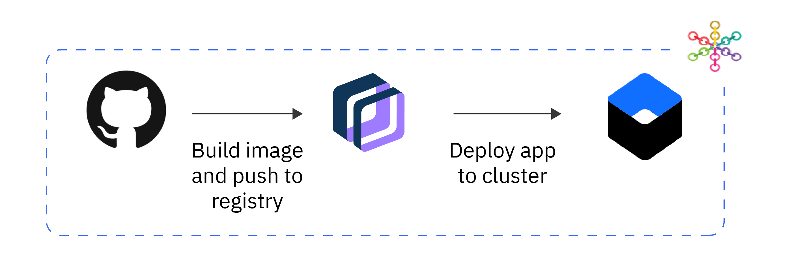

---

copyright:
  years: 2014, 2020
lastupdated: "2020-07-31"

keywords: kubernetes, iks

subcollection: containers

---

{:beta: .beta}
{:codeblock: .codeblock}
{:deprecated: .deprecated}
{:download: .download}
{:external: target="_blank" .external}
{:faq: data-hd-content-type='faq'}
{:gif: data-image-type='gif'}
{:help: data-hd-content-type='help'}
{:important: .important}
{:new_window: target="_blank"}
{:note: .note}
{:pre: .pre}
{:preview: .preview}
{:screen: .screen}
{:shortdesc: .shortdesc}
{:support: data-reuse='support'}
{:table: .aria-labeledby="caption"}
{:tip: .tip}
{:troubleshoot: data-hd-content-type='troubleshoot'}
{:tsCauses: .tsCauses}
{:tsResolve: .tsResolve}
{:tsSymptoms: .tsSymptoms}


# Set up a DevOps delivery pipeline for your app
{: #tutorial-byoc-kube}

Set up a {{site.data.keyword.contdelivery_short}} pipeline for your containerized app that is stored in GitHub. Learn how you create a DevOps toolchain in {{site.data.keyword.cloud_notm}}, integrate it with your GitHub repository and configure delivery pipeline stages that automatically build a container image from your Dockerfile, push it to {{site.data.keyword.registrylong_notm}}, and deploy your app to a cluster in {{site.data.keyword.containerlong_notm}}.
{: shortdesc}

## Objectives
{: #objectives-byoc-kube}

- Set up a DevOps toolchain in {{site.data.keyword.cloud_notm}}.
- Add a GitHub integration to your DevOps toolchain that points to the repository where you store your Dockerfile.
- Create a delivery pipeline and delivery pipeline stages that automatically perform the following tasks:
  - Retrieve the Dockerfile from GitHub.
  - Build the container image.
  - Push the image to a namespace in {{site.data.keyword.registrylong_notm}}.
  - Create a Kubernetes deployment from the image and deploy the app to an {{site.data.keyword.containerlong_notm}} cluster.
  - Expose the app with a Kubernetes NodePort.



## Time required
{: #time-byoc-kube}

45 minutes

## Audience
{: #audience-byoc-kube}

This tutorial is intended for experienced software developers and DevOps engineers who want to configure a continuous integration and continuous delivery pipeline that you can use to deploy an app from a source repository in GitHub to a cluster in {{site.data.keyword.containerlong_notm}}.

## Prerequisites
{: #prereqs-byoc-kube}

* Containerize your app and store the Dockerfile and related app code in a GitHub repository. For more information about how to create a Dockerfile, see the [Dockerfile reference](https://docs.docker.com/engine/reference/builder/){: external}.
* [Install the {{site.data.keyword.cloud_notm}} CLI, the {{site.data.keyword.containerlong_notm}} CLI plug-in, and the Kubernetes CLI](/docs/containers?topic=containers-cs_cli_install#cs_cli_install).
* [Set up a namespace in {{site.data.keyword.registrylong_notm}}](/docs/Registry?topic=Registry-getting-started) to store your container image.
* Get the details of a [classic](/docs/containers?topic=containers-clusters#clusters_standard) or [VPC](/docs/containers?topic=containers-clusters#clusters_vpc_standard) cluster to deploy and run your app.
*  Make sure that you have at least the following permissions in {{site.data.keyword.cloud_notm}} IAM:
   *  **Editor** platform role and **Writer** service role to the **Kubernetes Service** cluster. For more information, see [User access permissions](/docs/containers?topic=containers-access_reference).
   *  **Writer** service role to the **Container Registry** service.
   *  **Viewer** platform role to the resource group of the cluster where you want to create the toolchain.
   *  **Editor** platform role to the **Toolchain** service.
   *  **Editor** platform role to the **Continuous Delivery** service.
* Create or retrieve an [{{site.data.keyword.cloud_notm}} API key](/docs/account?topic=account-userapikey).

## Lesson 1: Create a {{site.data.keyword.contdelivery_short}} service and a DevOps toolchain skeleton
{: #create-devops-toolchain}

To configure your continuous delivery tools, create a {{site.data.keyword.contdelivery_short}} service instance in {{site.data.keyword.cloud_notm}} and set up a DevOps toolchain skeleton.
{: shortdesc}

1. Configure your {{site.data.keyword.contdelivery_short}} service instance.
   1. From the {{site.data.keyword.cloud_notm}} catalog, open the [{{site.data.keyword.contdelivery_short}} service](https://cloud.ibm.com/catalog/services/continuous-delivery).
   2. Select the {{site.data.keyword.cloud_notm}} region where you want to create the service.
   3. Select a pricing plan.
   4. Enter a name for your service instance, select a resource group, and enter any tags that you want to associate with your service instance.
   5. Click **Create** to create the service instance in your account.
2. Create a DevOps toolchain skeleton.
   1. From the [DevOps toolchain dashboard](https://cloud.ibm.com/devops/toolchains), click **Create a Toolchain**.
   2. Select the **Build your own toolchain** template and click **Create**.
   3. On the **Build your own toolchain** page, enter a name for your toolchain, and select the same region and resource group that you used for your {{site.data.keyword.contdelivery_short}} service instance. Then, click **Create**.  

With your toolchain skeleton set up, you can now start configuring your toolchain.

## Lesson 2: Add a GitHub integration to your toolchain
{: #add-gh-integration}

Add a GitHub integration to your DevOps toolchain skeleton to point to the GitHub repository where your Dockerfile and app code are stored. When you change the code in your GitHub repository, the changes are automatically made available in {{site.data.keyword.cloud_notm}}.
{: shortdesc}

1. In your [DevOps toolchain dashboard](https://cloud.ibm.com/devops/toolchains), select your toolchain and click **Add a Tool**.
2. Select **GitHub**.
3. Select or enter the GitHub server that you want to connect to and click **Authorize**.
4. Find the GitHub organization that you want to integrate with your toolchain and click **Grant**. Enter your GitHub password.
5. Click **Authorize IBM-Cloud** to grant your DevOps toolchain permission to use the GitHub REST API. Note that you might not see the screen to do this step if your GitHub organization was already granted access to {{site.data.keyword.cloud_notm}}.
6. Return to the toolchain configuration screen in {{site.data.keyword.cloud_notm}}.
7. From the **Repository URL** drop-down menu, select **Existing**.
8. Select an existing GitHub repository that you want to add to your toolchain.
9. Optional. Choose if you want to enable GitHub issue tracking and deployment code changes.
10. Click **Create Integration** to add an integration for your GitHub repository. After the integration is set up, your toolchain is triggered every time that you submit a pull request or commit code changes to your repository.

Now that your toolchain is connected to your GitHub repository, create a continuous delivery pipeline that automatically deploys your app to a Kubernetes cluster.


## Lesson 3: Configure a continuous delivery pipeline and pipeline stages
{: #pipeline-byoc-kube}

To automate the deployment of your code into a cluster, you must configure a {{site.data.keyword.contdelivery_short}} pipeline and delivery pipeline stages.
{: shortdesc}

The delivery pipeline stages that you configure as part of this tutorial complete the following tasks:
- Retrieve the Dockerfile from your GitHub repository.
- Build the image from your Dockerfile.
- Push the image to a namespace in {{site.data.keyword.registrylong_notm}}.
- Create a Kubernetes deployment from the image and deploy the app to an {{site.data.keyword.containerlong_notm}} cluster.
- Expose the app with a Kubernetes NodePort.

To set up your delivery pipeline:

1. In your DevOps toolchain, click **Add a Tool**.
2. Select **Delivery Pipeline**.
3. Enter a name for your pipeline, select **Classic** for your pipeline type, and click **Create Integration**.
4. Configure a pipeline stage to build your container image from the Dockerfile in your GitHub repository and push this image to your namespace in {{site.data.keyword.registrylong_notm}}.
   1. Select the tile for the delivery pipeline integration that you created.
   2. Click **Add a Stage**.
   3. Select the **Input** tab and complete the fields as follows:
      * Change the name of your stage from `MyStage` to `Build image in registry`.
      * Verify that the **Git repository** and **Branch** are correct. Make changes as necessary.
   4. Select the **Jobs** tab.
   5. Click **Add Job '+'**, select **Build** for the job type, and complete the fields as follows:
      * Select **Container Registry** for the builder type.
      * Enter an existing {{site.data.keyword.cloud_notm}} API key. If you don't have an API key, see [Creating an API key](/docs/account?topic=account-userapikey#create_user_key).
      * Select the region and the {{site.data.keyword.cloud_notm}} account where you set up the namespace in {{site.data.keyword.registrylong_notm}}.
      * Select the namespace in {{site.data.keyword.registrylong_notm}} where you want to push your container image to.
      * Enter a name for your Docker image.
   6. Click **Save**.
5. Test your `Build image in registry` pipeline stage.
   1. Click the **Play** icon to start the pipeline stage.
   2. Click **View logs and history** to review the logs of your pipeline stage. Correct errors if they occur, for example you might see an error that you do not have enough storage left in your {{site.data.keyword.registrylong_notm}} namespace to store the image. If the pipeline stage ran successfully, you see a success message at the end of your log files.
6. Configure another pipeline stage to deploy the Docker image to your cluster.
   1. On the delivery pipeline page, click **Add a Stage**.
   2. Select the **Input** tab and complete the fields as follows:
      * Change the name of your stage from `MyStage` to `Deploy to cluster`.
      * Select **Build artifacts** for the input type.
      * Select **Build image in registry** for the stage.
      * Select **Build** for the job.
   3. Select the **Jobs** tab.
   4. Click **Add Job '+'**, select **Deploy** for the job type, and complete the fields as follows:
      * Enter `Deploy to cluster` for the name.
      * Select **Kubernetes** for the deployer type.
      * Enter your {{site.data.keyword.cloud_notm}} API key.
      * Select the region, {{site.data.keyword.cloud_notm}} account, and the resource group where your cluster was created.
      * Select the name of the cluster where you want to deploy your app.
   5. Click **Save**.
7. Test your `Deploy to cluster` pipeline stage.
   1. Click the **Play** icon to start the pipeline stage.
   2. Click **View logs and history** to review the logs of your pipeline stage and correct errors if they occur. Your app is deployed as a Kubernetes deployment and automatically exposed by using a [Kubernetes NodePort service](/docs/containers?topic=containers-nodeport) so that you can test your app's accessibility. The public IP address and the NodePort that are assigned to your app are listed at the end of your log file.
8. Use the the public IP address and the NodePort to access your app from a web browser.
   ```
   http://<public_IP_address>:<nodeport>
   ```
   {: codeblock}

Great job! You successfully automated the deployment of an app from your source code in GitHub to a Kubernetes cluster by using a {{site.data.keyword.contdelivery_short}} pipeline in {{site.data.keyword.cloud_notm}}.

## Lesson 4: Verify the deployment and health of your app in the cluster
{: #verify-byoc-kube}

With your app up and running, review the health of your app in your cluster.
{: shortdesc}

1. [Log in to your account. If applicable, target the appropriate resource group. Set the context for your cluster.](/docs/containers?topic=containers-cs_cli_install#cs_cli_configure)
2. List the deployments in your cluster. Look for a deployment that is named after your {{site.data.keyword.contdelivery_short}} pipeline. Make sure that the deployment shows that all pods are **READY**.
   ```
   kubectl get deployments
   ```
   {: pre}

   Example output:
   ```
   NAME                        READY   UP-TO-DATE   AVAILABLE   AGE
   mytoolchain                 1/1     1            1           13m
   ```
   {: screen}

3. List the pods of your deployment and verify that all pods are in a **Running** state.
   ```
   kubectl get pods
   ```
   {: pre}

   Example output:
   ```
   NAME                                           READY   STATUS             RESTARTS   AGE
   mytoolchain-6955bdbcdf-l756b                   1/1     Running            0          1d
   ```
   {: screen}

4. Review the logs of your pod.
   ```
   kubectl logs <pod_name>
   ```
   {: pre}


## What's next

- Explore other [pre-defined toolchains](/docs/ContinuousDelivery?topic=ContinuousDelivery-cd_about#templates) in {{site.data.keyword.cloud_notm}} that you can use to deploy Helm charts to a cluster or accomplish canary testing for your app.
- Learn about other ways to expose an app to the public, such as [Ingress or LoadBalancer services](/docs/containers?topic=containers-cs_network_planning).
- Set up [logging and monitoring](/docs/containers?topic=containers-health) for your containerized app.
