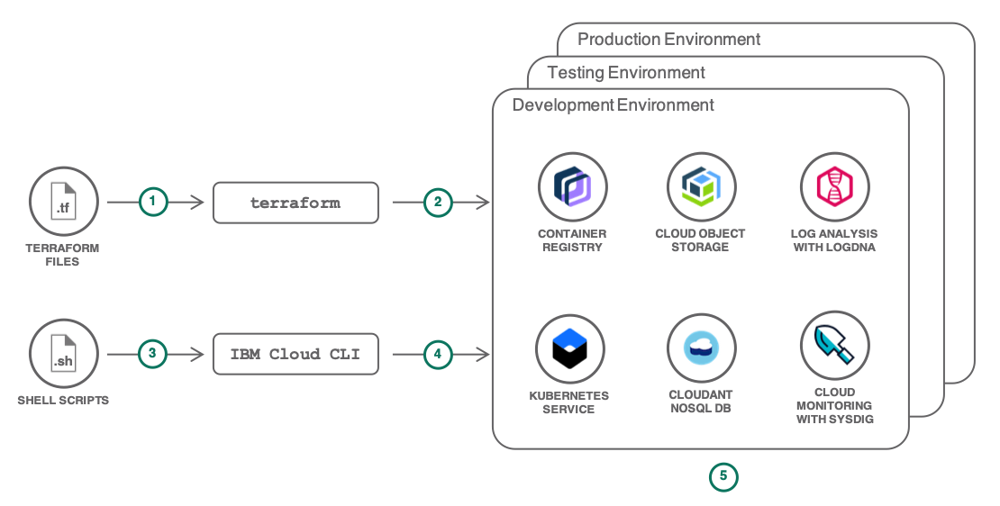

---

copyright:
  years: 2014, 2020
lastupdated: "2020-08-11"

keywords: kubernetes, iks

subcollection: containers

---

{:DomainName: data-hd-keyref="APPDomain"}
{:DomainName: data-hd-keyref="DomainName"}
{:android: data-hd-operatingsystem="android"}
{:apikey: data-credential-placeholder='apikey'}
{:app_key: data-hd-keyref="app_key"}
{:app_name: data-hd-keyref="app_name"}
{:app_secret: data-hd-keyref="app_secret"}
{:app_url: data-hd-keyref="app_url"}
{:authenticated-content: .authenticated-content}
{:beta: .beta}
{:c#: data-hd-programlang="c#"}
{:codeblock: .codeblock}
{:curl: .ph data-hd-programlang='curl'}
{:deprecated: .deprecated}
{:dotnet-standard: .ph data-hd-programlang='dotnet-standard'}
{:download: .download}
{:external: target="_blank" .external}
{:faq: data-hd-content-type='faq'}
{:fuzzybunny: .ph data-hd-programlang='fuzzybunny'}
{:generic: data-hd-operatingsystem="generic"}
{:generic: data-hd-programlang="generic"}
{:gif: data-image-type='gif'}
{:go: .ph data-hd-programlang='go'}
{:help: data-hd-content-type='help'}
{:hide-dashboard: .hide-dashboard}
{:hide-in-docs: .hide-in-docs}
{:important: .important}
{:ios: data-hd-operatingsystem="ios"}
{:java: #java .ph data-hd-programlang='java'}
{:java: .ph data-hd-programlang='java'}
{:java: data-hd-programlang="java"}
{:javascript: .ph data-hd-programlang='javascript'}
{:javascript: data-hd-programlang="javascript"}
{:new_window: target="_blank"}
{:note: .note}
{:objectc data-hd-programlang="objectc"}
{:org_name: data-hd-keyref="org_name"}
{:php: data-hd-programlang="php"}
{:pre: .pre}
{:preview: .preview}
{:python: .ph data-hd-programlang='python'}
{:python: data-hd-programlang="python"}
{:route: data-hd-keyref="route"}
{:row-headers: .row-headers}
{:ruby: .ph data-hd-programlang='ruby'}
{:ruby: data-hd-programlang="ruby"}
{:runtime: architecture="runtime"}
{:runtimeIcon: .runtimeIcon}
{:runtimeIconList: .runtimeIconList}
{:runtimeLink: .runtimeLink}
{:runtimeTitle: .runtimeTitle}
{:screen: .screen}
{:script: data-hd-video='script'}
{:service: architecture="service"}
{:service_instance_name: data-hd-keyref="service_instance_name"}
{:service_name: data-hd-keyref="service_name"}
{:shortdesc: .shortdesc}
{:space_name: data-hd-keyref="space_name"}
{:step: data-tutorial-type='step'}
{:subsection: outputclass="subsection"}
{:support: data-reuse='support'}
{:swift: #swift .ph data-hd-programlang='swift'}
{:swift: .ph data-hd-programlang='swift'}
{:swift: data-hd-programlang="swift"}
{:table: .aria-labeledby="caption"}
{:term: .term}
{:tip: .tip}
{:tooling-url: data-tooling-url-placeholder='tooling-url'}
{:troubleshoot: data-hd-content-type='troubleshoot'}
{:tsCauses: .tsCauses}
{:tsResolve: .tsResolve}
{:tsSymptoms: .tsSymptoms}
{:tutorial: data-hd-content-type='tutorial'}
{:unity: .ph data-hd-programlang='unity'}
{:url: data-credential-placeholder='url'}
{:user_ID: data-hd-keyref="user_ID"}
{:vb.net: .ph data-hd-programlang='vb.net'}
{:video: .video}

# Tutorial overview
{: #tutorials-ov}

## Create a cluster and deploy your first app
{: #tutorials-create-cluster-deploy-app}

  

    <a href = "/docs/containers?topic=containers-cs_cluster_tutorial">
      

      

        
<strong>Community Kubernetes cluster</strong>

        

            
Create a Kubernetes cluster on managed {{site.data.keyword.containerlong_notm}} with Classic infrastructure worker nodes that run an Ubuntu operating system.

            

                
            

        

        

    </a>
  

    

        <a href = "/docs/containers?topic=containers-vpc_ks_tutorial">
        

        

          
<strong>Virtual Private Cloud cluster</strong>

            

                
Create a classic cluster in your Virtual Private Cloud (VPC).

                

                    
                

            

        

        </a>
    

    

        <a href = "/docs/openshift?topic=openshift-openshift_tutorial">
        

        

          
<strong>OpenShift cluster</strong>

            

                
Create an {{site.data.keyword.containerlong_notm}} cluster with worker nodes that come installed with the OpenShift container orchestration platform software.

                

                    
                

            

        

        </a>
    

## Deploy apps to a cluster
{: #tutorials-deploy-app}

    

    <a href = "/docs/solution-tutorials?topic=solution-tutorials-scalable-webapp-kubernetes">
        

        
<strong>Scalable web application on Kubernetes</strong>

          

                

                  
Scaffold a web app, deploy it to a cluster, and learn how to scale your app and monitor its health. 
 
                

                

                    
                

            

        

    </a>
    

    

    <a href = "https://github.com/IBM-Cloud/logistics-wizard-kubernetes">
        

               
<strong>Run Kubernetes and Cloud Foundry apps</strong>

          

                

                  
Create a Logistics Wizard where the ERP and Controller services are in Kubernetes and the web UI in a Cloud Foundry app. 
 
                

                

                    
                

            

        

    </a>
    

    

    <a href = "/docs/solution-tutorials?topic=solution-tutorials-pub-sub-object-storage#pub-sub-object-storage">
        

               
<strong>Asynchronous data processing for apps</strong>

          

                

                  
Use an Apache Kafka-based messaging service to orchestrate long running workloads in Kubernetes apps.
 
                

                

                    
                

            

        

    </a>
    

    

        <a href = "/docs/containers?topic=containers-tutorial-starterkit-kube">
        

                
<strong>Deploy a starter kit app to a cluster</strong>

          

                

                  
Create a containerized app from an {{site.data.keyword.cloud_notm}} starter kit and deploy your app by using a DevOps toolchain. 
 
                

                

                    
                

            

        

    </a>
    

## Set up high availability and security
{: #tutorials-ov-ha-network-security}

    

    <a href = "/docs/solution-tutorials?topic=solution-tutorials-multi-region-k8s-cis#multi-region-k8s-cis">
        

                
<strong>Resilient and secure multi-region clusters with Cloud Internet Services</strong>

          

                

                  
Integrate Cloud Internet Services with Kubernetes clusters to deliver a resilient and secure solution across multiple {{site.data.keyword.cloud_notm}} regions. 
 
                

                

                    
                

            

        

    </a>
    

    

    <a href = "/docs/solution-tutorials?topic=solution-tutorials-strategies-for-resilient-applications">
        

                
<strong>Strategies for resilient applications in the cloud</strong>

          

                

                  
Learn what to consider when creating resilient apps in the cloud and what {{site.data.keyword.cloud_notm}} services you can use. 
 
                

                

                    
                

            

        

    </a>
    

    

    <a href = "/docs/containers?topic=containers-policy_tutorial">
        

                
<strong>Block unwanted network traffic with Calico policies</strong>

          

                

                  
Learn how to use Calico policies to allow network traffic from and to certain IP addresses. 
 
                

                

                    
                

            

        

    </a>
    

    

        <a href = "/docs/containers?topic=containers-istio">
        

                
<strong>Secure, manage, and monitor a network of microservices with Istio</strong>

          

                

                  
Use Istio for intelligent routing and monitoring of your microservices in the cloud. 
 
                

                

                     
                

            

        

    </a>
    

    

    <a href = "/docs/solution-tutorials?topic=solution-tutorials-cloud-e2e-security#cloud-e2e-security">
        

                
<strong>Apply end to end security to an {{site.data.keyword.cloud_notm}} app</strong>

          

                

                  
Learn how to use authentication and encryption to protect your app, and how to monitor and audit cluster activities. 
 
                

                

                     
                

            

        

    </a>
    

    

    <a href = "/docs/solution-tutorials?topic=solution-tutorials-users-teams-applications#users-teams-applications">
        

                
<strong>Organize users and teams with {{site.data.keyword.cloud_notm}} Identity and Access Management</strong>

          

                

                  
Set up cluster access for users and teams and learn how to replicate this setup across environments. 
 
                

                

                     
                

            

        

    </a>
    

## Automate app and cluster deployments
{: #tutorials-ov-app-cluster-deployments}

    

    <a href = "/docs/containers?topic=containers-serverless-apps-knative">
        

                
<strong>Deploy serverless apps with Knative services</strong>

          

                

                   
Create modern, source-centric, containerized, and serverless apps on top of your Kubernetes cluster. 
 
                

                

                    
                

            

        

    </a>
    

    

    <a href = "/docs/solution-tutorials?topic=solution-tutorials-continuous-deployment-to-kubernetes#continuous-deployment-to-kubernetes">
        

                
<strong>Continuous deployment to Kubernetes clusters</strong>

          

                

                   
Set up a DevOps pipeline for Kubernetes apps and integrate with security scanner, Slack notifications, and analytics.
 
                

                

                    
                

            

        

    </a>
    

    

    <a href = "/docs/containers?topic=containers-tutorial-byoc-kube">
        

                
<strong>Set up a DevOps delivery pipeline for your GitHub app</strong>

          

                

                  
Configure pipelines to build an image from a Dockerfile, push it to a container registry, and deploy the app to a cluster.
             
 
                

                

                    
                

            

        

    </a>
    

    

    <a href = "https://github.com/razee-io/Razee">
        

                
<strong>Automate multi-cluster deployments with Razee</strong>

            

                

                  
Automate, deploy, manage, and visualize Kubernetes resources across clusters, environments, and cloud providers with Razee.
 
                

                

                    
                

            

        

    </a>
    

    

    <a href = "/docs/solution-tutorials?topic=solution-tutorials-plan-create-update-deployments">
        

                
<strong>Automate cluster deployments across environments with Terraform</strong>

            

                

                   
Plan, create, and update Kubernetes resources across multiple deployment environments with Terraform.
 
                

                

                    
                

            

        

    </a>
    

## Monitor and log cluster activity
{: #tutorials-ov-monitor-log}

    

    <a href = "/docs/Log-Analysis-with-LogDNA?topic=Log-Analysis-with-LogDNA-kube#kube">
        

                
<strong>Manage Kubernetes cluster logs with {{site.data.keyword.la_full_notm}}</strong>

          

                

                  
Configure a logging agent in your cluster and monitor different log sources with  {{site.data.keyword.la_full_notm}}. 
 
                

                

                    
                

            

        

    </a>
    

    

    <a href = "/docs/Monitoring-with-Sysdig?topic=Monitoring-with-Sysdig-kubernetes_cluster#kubernetes_cluster">
        

                
<strong>Analyze cluster metrics with {{site.data.keyword.mon_full_notm}}</strong>

            

                

                   
Set up a Sysdig metrics agent in your cluster and explore how you can monitor your cluster's health.  
 
                

                

                    
                

            

        

    </a>
    

## Migrate apps to the cloud
{: #tutorials-ov-migrate-apps}

    

    <a href = "/docs/containers?topic=containers-cf_tutorial">
        

                
<strong>Containerize a Cloud Foundry app</strong>

          

                

                  
Create a Docker image from a Python Cloud Foundry app, push the image to a container registry, and deploy your app to a Kubernetes cluster.
 
                

                

                    
                

            

        

    </a>
    

    

    <a href = "/docs/solution-tutorials?topic=solution-tutorials-vm-to-containers-and-kubernetes">
        

                
<strong>Migrate a VM-based app</strong>

            

                

                   
Prepare your app code, containerize your VM-based app, and deploy this app to a Kubernetes cluster.  
 
                

                

                    
                

            

        

    </a>
    

    

    <a href = "https://github.com/IBM-Cloud/jpetstore-kubernetes">
        

                
<strong>Modernize a Java web app</strong>

            

                

                   
Containerize the JPetStore app and extend it with Watson Visual Recognition and Twilio text messaging.
 
                

                

                    
                

            

        

    </a>
    

